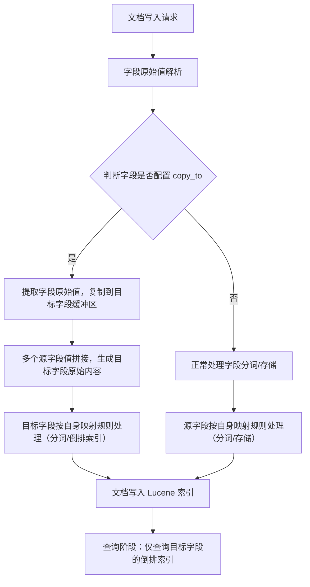
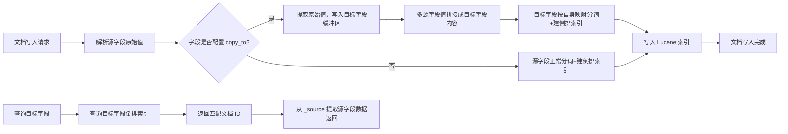
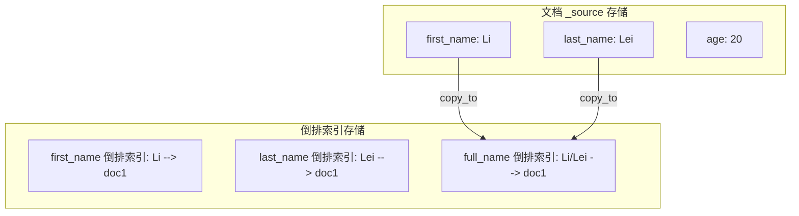
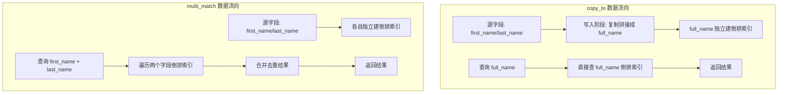
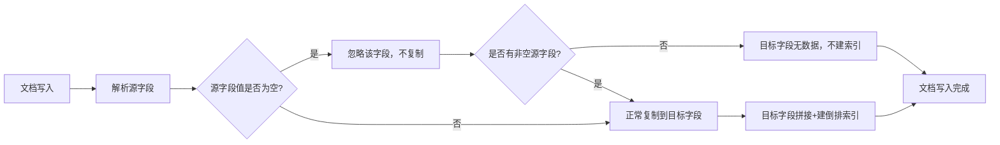

## copy_to 概述

`copy_to` 是 ES 映射（mapping）中字段的一个参数，作用是将多个字段的内容复制到一个目标字段中，这个目标字段不会存储原始数据（默认是 `store: false`），但可以被用来统一查询，相当于创建一个聚合查询字段。

简单来说，它就像给多个字段建了一个汇总搜索框：比如你有 `first_name`、`last_name` 字段，用 `copy_to` 把它们都复制到 `full_name` 字段，之后只需查询 `full_name` 就能同时匹配姓和名，不用写复杂的多字段查询。

## 核心用法

### 基础语法

创建索引时配置 `copy_to` 参数：

```json
PUT /user_index
{
  "mappings": {
    "properties": {
      "first_name": {
        "type": "text",
        "copy_to": "full_name"
      },
      "last_name": {
        "type": "text",
        "copy_to": "full_name"
      },
      "full_name": {
        "type": "text"
      },
      "age": {
        "type": "integer"
      }
    }
  }
}
```

### 写入数据并测试查询

```json
# 写入测试数据
PUT /user_index/_doc/1
{
  "first_name": "Li",
  "last_name": "Lei",
  "age": 20
}

# 查询 full_name 字段（能匹配 Li 或 Lei）
GET /user_index/_search
{
  "query": {
    "match": {
      "full_name": "Lei"
    }
  }
}
```

### 复制到多个目标字段

可以将一个字段复制到多个目标字段，使用数组形式指定：

```json
"first_name": {
  "type": "text",
  "copy_to": ["full_name", "name_search"]
}
```

### 目标字段特性

- 目标字段（如 `full_name`）不会出现在文档的 `_source` 中（除非显式设置 `store: true`），它仅用于查询
- 复制的是字段的原始文本，而非分词后的结果
- 支持嵌套字段（如 `address.city` 复制到 `all_address`）

## 适用场景

### 多字段统一查询

用户搜索时想同时匹配标题、内容、标签，不用写 `bool` 多字段查询，直接查复制后的汇总字段。

### 简化查询语句

避免重复写 `should` 子句匹配多个字段，提升查询可读性。

### 性能优化

相比 `multi_match` 查询多个字段，查询单个汇总字段的性能更高（尤其字段数量多时）。

## 对比 multi_match

| 特性 | copy_to | multi_match |
|------|---------|-------------|
| 数据存储 | 提前复制到目标字段（逻辑存储） | 无额外存储，查询时匹配多个字段 |
| 查询性能 | 高（单字段查询） | 较低（多字段匹配） |
| 灵活性 | 低（需提前配置映射） | 高（查询时动态指定字段） |
| 适用场景 | 固定多字段聚合查询 | 动态多字段匹配 |

## 实现原理

### 核心实现逻辑

`copy_to` 本质是在文档写入（索引）阶段完成字段内容的逻辑复制，而非物理上存储多份数据（默认场景），最终将复制后的内容构建到目标字段的倒排索引中，供查询使用。



### 写入阶段：字段内容的逻辑复制

`copy_to` 的处理发生在文档解析后、倒排索引构建前，具体步骤如下：

**步骤1：解析源字段原始值**

ES 先解析文档中所有字段的原始值（比如 `first_name: "Li"`、`last_name: "Lei"`），不做分词、过滤等处理，只提取原始字符串。

**步骤2：复制到目标字段缓冲区**

遍历配置了 `copy_to` 的源字段，将它们的原始值按顺序拼接（默认无分隔符，可通过映射配置调整），写入目标字段的临时缓冲区。

例如：`first_name` + `last_name` 复制到 `full_name`，缓冲区内容就是 `"LiLei"`（若需分隔符，需手动在源字段值中加，或用 ingest pipeline 处理）。

**步骤3：目标字段的索引构建**

目标字段（如 `full_name`）会按照自身的映射规则（`type`、`analyzer` 等）处理缓冲区中的内容：

- 若目标字段是 `text` 类型：对拼接后的字符串做分词（比如 `LiLei` 按分词器拆分为 `li`、`lei`）
- 若目标字段是 `keyword` 类型：直接将拼接后的字符串作为整体存入倒排索引
- 最终，目标字段的处理结果会写入 Lucene 底层索引，但不会将目标字段写入文档的 `_source`（默认 `store: false`）



### 存储阶段：无额外物理存储

`copy_to` 的核心是逻辑复制，而非物理复制：

- 源字段：正常存储（写入 `_source`，并构建自身的倒排索引）
- 目标字段：仅构建倒排索引供查询，不存储原始值（除非显式设置 `store: true`），也不会出现在 `_source` 中
- 底层 Lucene 层面：目标字段的倒排索引是独立的，但数据来源是源字段的原始值拼接，没有物理上的重复存储（仅倒排索引的词条指向同一个文档 ID）



### 查询阶段：仅匹配目标字段的倒排索引

当你查询目标字段（如 `full_name`）时：

- ES 会直接查询目标字段的倒排索引，找到匹配的文档 ID
- 由于目标字段的倒排索引是提前构建好的，因此查询性能和单字段查询一致，远高于 `multi_match`（需遍历多个字段的倒排索引）
- 返回结果时，`_source` 中仍只有源字段（`first_name`、`last_name`），不会显示目标字段（除非 `store: true` 并指定 `stored_fields`）



### 关键细节

**复制的是原始值而非分词后的值**

比如源字段 `first_name: "Li Lei"` 被分词为 `li`、`lei`，但 `copy_to` 复制的是原始字符串 `"Li Lei"`，而非分词后的词条，目标字段的分词由自身的 `analyzer` 决定。

**嵌套字段的复制规则**

若源字段是嵌套字段（如 `address.city`），`copy_to` 会解析嵌套路径，提取原始值后复制；若目标字段是嵌套字段，需确保路径匹配，否则会报错。

**空值/缺失字段的处理**

若源字段值为空（`null`）或字段缺失，`copy_to` 会忽略该字段，仅复制非空字段的内容；若所有源字段都为空，目标字段的倒排索引中不会生成该文档的词条。



**性能开销点**

`copy_to` 的开销主要在写入阶段（多了字段复制、拼接、目标字段分词的步骤），但这部分开销通常很小，且是一次性的；查询阶段则完全无额外开销，这也是它比 `multi_match` 快的核心原因。

### 底层差异对比

| 阶段 | copy_to | multi_match |
|------|---------|-------------|
| 写入阶段 | 提前复制+构建目标字段倒排索引 | 无额外操作，仅构建源字段索引 |
| 存储层面 | 目标字段仅存倒排索引（无原始值） | 无额外存储 |
| 查询阶段 | 查单个字段的倒排索引 | 遍历多个字段的倒排索引，合并结果 |
| 性能开销 | 写入略高，查询极低 | 写入无开销，查询随字段数增加而升高 |

## 总结

`copy_to` 的核心作用是将多个字段的内容复制到一个目标字段，用于统一查询，提升查询性能和简化语句。目标字段不存储原始数据，仅用于查询，复制的是字段原始文本。对比 `multi_match`，`copy_to` 适合固定多字段的聚合查询场景，性能更优但灵活性较低。

从实现层面看，`copy_to` 的核心是写入阶段的逻辑复制：提取源字段原始值拼接，为目标字段构建独立的倒排索引，无额外物理数据存储。目标字段仅存倒排索引（供查询），不写入 `_source`，这是它轻量且查询快的关键。开销集中在写入阶段（一次性），查询阶段性能优于 `multi_match`，本质是提前完成了多字段聚合的预处理。
