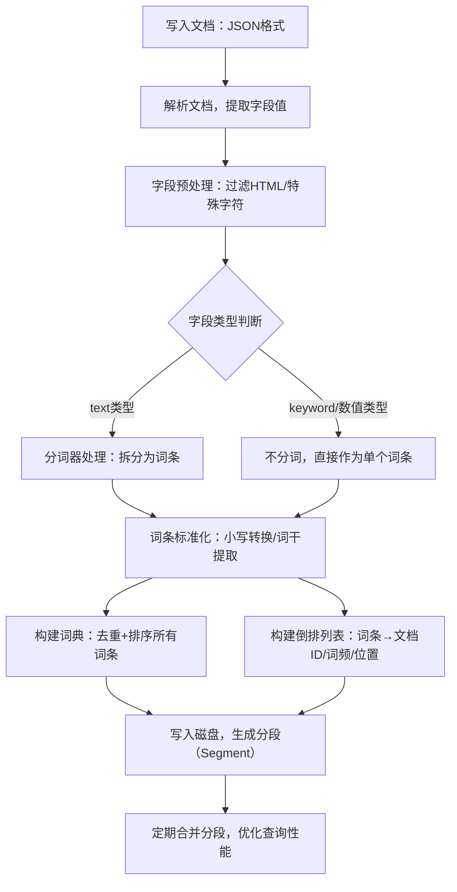
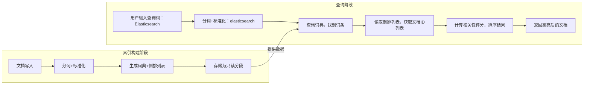

Elasticsearch 的核心检索能力完全依赖倒排索引，它是一种专为全文搜索设计的数据结构，与传统数据库的正排索引（行→列值）逻辑相反，能实现快速的关键词匹配。

## 核心概念：正排 vs 倒排

### 正排索引

传统数据库的存储逻辑，以文档（行）为中心，记录每个文档包含的内容：

| 文档ID | 内容（字段值）|
|--------|--------------------------|
| 1      | I love Elasticsearch |
| 2      | Elasticsearch is powerful |

查询时需要遍历所有文档，逐个判断是否包含目标关键词，效率极低（时间复杂度 O(n)）。

### 倒排索引

以关键词（词条）为中心，记录每个关键词出现在哪些文档中，结构分为两部分：

- **词典（Term Dictionary）**：去重后的所有关键词列表，通常用跳表/前缀树优化查询
- **倒排列表（Posting List）**：每个关键词对应的文档ID集合，还可附带词频、位置等信息

以上面的文档为例，分词后的倒排索引结构如下：

| 关键词（Term） | 倒排列表（文档ID + 附加信息） |
|---------------|--------------------------------|
| love          | [1, 词频=1, 位置=2] |
| elasticsearch | [1, 词频=1, 位置=3], [2, 词频=1, 位置=1] |
| powerful      | [2, 词频=1, 位置=3] |

查询 `Elasticsearch` 时，直接通过词典找到该关键词，再读取对应的文档ID列表，无需遍历所有文档，效率极高（时间复杂度 O(1)）。

---

## ES 倒排索引的构建流程

ES 构建倒排索引的过程发生在文档写入阶段，与分词器、映射配置强相关。

### 构建流程图

### 文档解析与预处理

ES 先将 JSON 文档解析为字段-值对，过滤掉无效字符（如 HTML 标签、转义符）。

示例：字段 `content: "I Love ES!"` 预处理后变为 `I Love ES`。

### 分词处理（text 字段核心步骤）

分词器（如 `standard`/`ik_max_word`）将文本拆分为独立词条，并做标准化处理：

- 小写转换：`Love` → `love`
- 词干提取（英文）：`running` → `run`
- 停用词过滤：去掉 `the`/`a` 等无意义词汇

示例：`I Love ES` → 分词后为 `[i, love, es]`

### 词典与倒排列表构建

- **词典**：收集所有字段的标准化词条，去重并排序，方便快速查找
- **倒排列表**：为每个词条记录对应的文档ID、词频（TF，词条在文档中出现次数）、位置（词条在文本中的偏移量），这些信息用于计算相关性评分（BM25）

### 分段存储与合并

ES 不会一次性将所有文档写入一个大索引，而是拆分为多个分段（Segment）存储在磁盘。后台会定期合并小分段为大分段，减少查询时的 IO 开销，同时清理已删除的文档。

---

## 倒排索引的核心特性

### 只读不可变

一旦分段写入磁盘，就会变成只读状态，无法修改。

- **优点**：避免并发写入冲突，查询时无需加锁，提升性能
- **缺点**：更新/删除文档时，不会直接修改旧分段，而是标记文档为已删除，并在新分段中写入更新后的内容，合并分段时才会清理无效数据

### 支持多维度附加信息

倒排列表除了文档ID，还会存储：

- **词频（TF）**：词条在文档中出现的次数，次数越多，相关性评分越高
- **位置（Position）**：用于实现短语查询（如 `match_phrase: "Elasticsearch tutorial"`），要求词条按顺序出现
- **偏移量（Offset）**：用于高亮显示搜索结果中的匹配关键词

### 与映射（Mapping）强绑定

- `text` 类型字段会分词，生成多词条的倒排索引，适合全文搜索
- `keyword` 类型字段不分词，直接以整个字符串作为词条，适合精确匹配、聚合
- 数值类型（`integer`/`date`）会被编码为词条，支持范围查询

---

## 倒排索引与 ES 核心功能的关系

| 功能 | 实现原理 |
|------|----------|
| **全文搜索** | 直接通过词典匹配关键词，快速获取文档列表 |
| **相关性评分（BM25）** | 基于倒排列表中的词频（TF）、文档频率（DF，词条在所有文档中出现的次数）计算评分，决定搜索结果的排序 |
| **聚合分析** | 对 `keyword`/数值字段的倒排索引进行分组统计，实现 `terms`/`range` 等聚合 |
| **过滤查询** | 通过倒排索引快速筛选符合条件的文档，过滤后的结果会缓存，提升重复查询性能 |

---

## 查询流程可视化

---

## 总结

1. 倒排索引是 ES 实现高效全文搜索的核心，核心结构是词典 + 倒排列表，以词条为中心反向映射文档
2. 构建过程依赖分词器和映射配置，生成的分段只读不可变，通过后台合并优化性能
3. 倒排列表中的词频、位置等信息，支撑了 ES 的相关性评分、短语查询、高亮等核心功能
