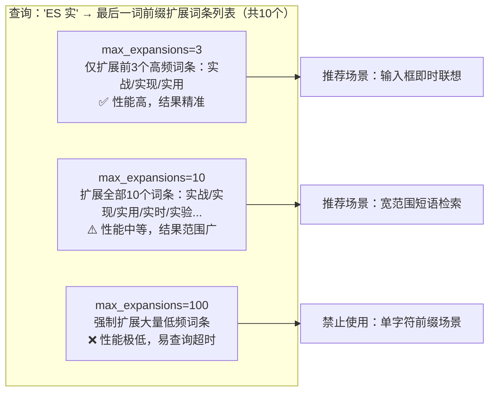
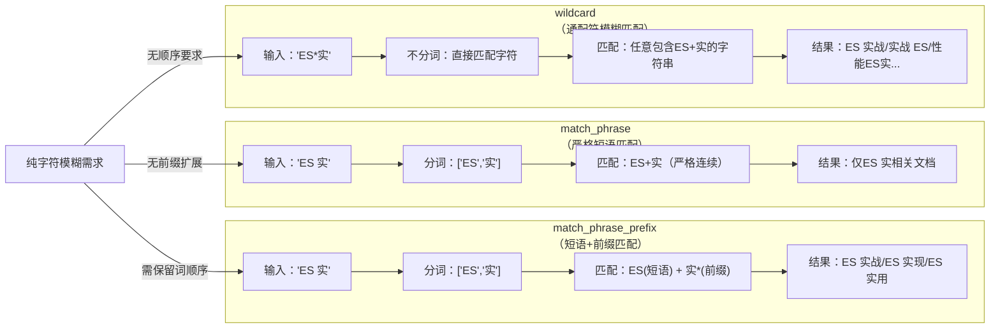
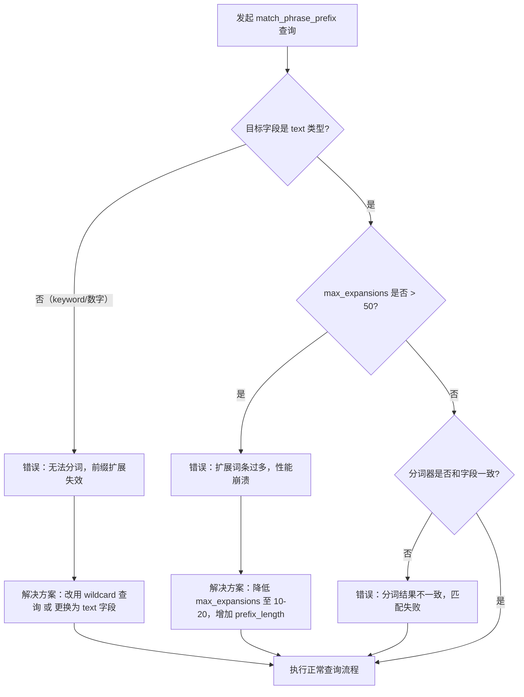
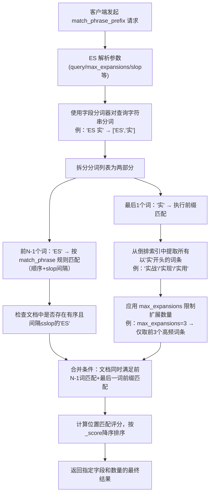
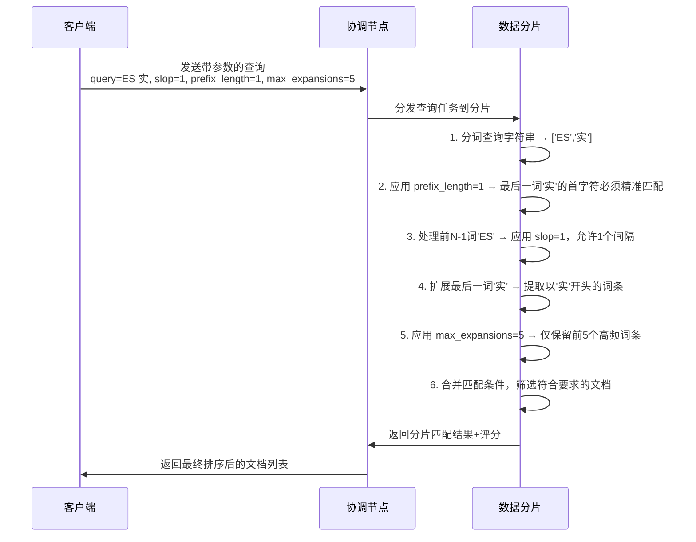

`match_phrase_prefix` 是 Elasticsearch 中专为即时搜索和联想提示设计的查询语句，它结合了短语匹配和前缀匹配的特性，能够高效处理用户输入未完成时的检索需求。

---

## 基础语法

### 最简格式

快速实现联想搜索：

```json
{
  "query": {
    "match_phrase_prefix": {
      "目标字段名": "查询字符串（最后一个词为前缀）"
    }
  }
}
```

示例：输入 `ES 实`，匹配包含 `ES 实战`、`ES 实现`、`ES 实用` 的文档。

### 完整格式

自定义核心参数：

```json
{
  "query": {
    "match_phrase_prefix": {
      "目标字段名": {
        "query": "查询字符串",
        "max_expansions": 50,
        "slop": 0,
        "prefix_length": 1,
        "boost": 1.0,
        "analyzer": "ik_max_word"
      }
    }
  }
}
```

---

## 核心参数详解

### query

- 作用：指定带前缀词的查询短语，最后一个分词会作为前缀进行扩展匹配
- 注意：查询短语的分词逻辑必须和目标字段一致（如字段用 ik 分词，查询 `ES 实` 会拆分为 `["ES", "实"]`）
- 反例：若查询 `ES 实战`（最后一个词是完整词），则退化为 `match_phrase` 查询（无前缀扩展）

### max_expansions

这是 `match_phrase_prefix` 最关键的参数，直接决定查询性能和匹配范围。

- 作用：限制最后一个分词的前缀匹配所扩展的词条数量上限
- 逻辑：ES 会先从倒排索引中找出所有以最后一个词为前缀的词条，按文档频率（出现次数）排序，只取前 `max_expansions` 个词条参与匹配
- 默认值：50



**场景建议**

| 场景 | 建议值 | 说明 |
|------|--------|------|
| 即时搜索（输入框联想） | 10-20 | 快速返回少量精准结果 |
| 宽范围检索 | 50-100 | 平衡范围和性能 |
| 禁止设置 | >100 | 尤其是单字符前缀，会导致超时 |

### slop

兼容 `match_phrase` 的参数。

- 作用：允许前 N-1 个分词在文档中存在的最大间隔/位置调换步数
- 默认值：0（前 N-1 个词必须严格连续、顺序一致）
- 示例：`slop: 1` → 查询 `ES 实` 时，`ES` 和 `实`（或其前缀词）之间允许 1 个间隔（如 `ES 快速 实战` 也能匹配）

### prefix_length

优化性能的参数。

- 作用：指定最后一个分词的前 N 个字符必须精准匹配，减少无效前缀扩展
- 默认值：0（无固定前缀，仅匹配首字符）

**示例**

- `prefix_length: 2` + 最后一个词是 `perf` → 仅匹配以 `perf` 开头的词条（如 `performance`），不匹配 `perfect`（前 2 字符 `pe` 不一致）
- 中文场景：`prefix_length: 1` → 最后一个词 `实` 的前 1 个字符必须精准，避免匹配 `时`、`石` 等形近字

### boost

权重参数。

- 作用：提升该查询在多条件组合（如 Bool Query）中的评分占比
- 示例：`boost: 3.0` → 该前缀匹配的文档评分是默认值的 3 倍，在结果中排序更靠前

### analyzer

分词器参数。

- 作用：指定处理查询字符串的分词器，确保和目标字段的分词逻辑一致
- 中文场景必选：需指定 `ik_max_word` 或 `ik_smart`（避免默认 `standard` 分词器将中文拆分为单字）

---

## 使用场景

`match_phrase_prefix` 是即时搜索和联想提示的最优解，核心场景包括：

| 场景 | 说明 | 示例 |
|------|------|------|
| 输入框实时联想 | 用户输入时实时返回联想结果 | 输入 `ES 性`，返回 `ES 性能优化`、`ES 性能调优`、`ES 性能监控` |
| 模糊短语联想 | 输入短语前缀，联想完整短语 | 输入 `Elasticsearch 实`，联想 `Elasticsearch 实战`、`Elasticsearch 实现` |
| 短文本精准联想 | 商品标题等短文本联想 | 输入 `手机 华`，匹配 `手机 华为`、`手机 华为Mate` |

---

## 与同类查询对比



**对比总结**

| 查询类型 | 分词 | 顺序性 | 前缀扩展 | 适用场景 |
|---------|------|--------|---------|---------|
| match_phrase_prefix | ✅ | ✅ | ✅ | 即时联想搜索 |
| match_phrase | ✅ | ✅ | ❌ | 精确短语匹配 |
| wildcard | ❌ | ❌ | ❌ | 纯字符模糊匹配 |

---

## 避坑指南



### 常见错误及解决方案

| 错误类型 | 问题描述 | 解决方案 |
|---------|---------|---------|
| 对 keyword 字段使用 | `keyword` 字段的倒排索引是完整字符串，前缀扩展无法匹配 | 仅对 `text` 字段使用，或改用 `wildcard` 查询 |
| 设置过大的 max_expansions | 前缀为 `a` 时，`max_expansions: 1000` 会扩展出上万词条，导致超时 | 结合 `prefix_length` 缩小扩展范围，同时降低 `max_expansions` |
| 忽略分词器一致性 | 字段用 `ik_max_word` 分词，查询时用 `standard` 分词，导致匹配失败 | 查询时指定和字段一致的分词器（`analyzer: "ik_max_word"`） |
| 混淆 match_phrase_prefix 和 wildcard | 两者的查询逻辑和性能差异巨大 | 联想搜索优先用 `match_phrase_prefix`，而非 `wildcard` |

---

## 核心原理


### 执行步骤

| 步骤 | 操作 | 说明 |
|:---:|------|------|
| 1 | 分词处理 | 使用目标字段的分词器，将查询字符串拆分为有序的分词列表（如 `"ES 实"` → `["ES", "实"]`） |
| 2 | 前 N-1 个词匹配 | 对除最后一个词外的所有分词，按 `match_phrase` 规则匹配（要求顺序一致，支持 `slop` 间隔容错） |
| 3 | 最后一个词前缀匹配 | 对最后一个分词，匹配所有以该分词为前缀的词条（如"实"匹配"实战""实现""实用"等） |
| 4 | 扩展数限制 | 通过 `max_expansions` 限制最后一个词的前缀扩展词条数量（避免性能崩溃） |
| 5 | 结果筛选 | 合并前 N-1 个词的匹配结果和最后一个词的前缀匹配结果，得到最终候选文档 |
| 6 | 排序返回 | 按匹配度评分降序返回文档（前缀匹配的词条越常用，评分越高） |

---

## 参数协作时序

