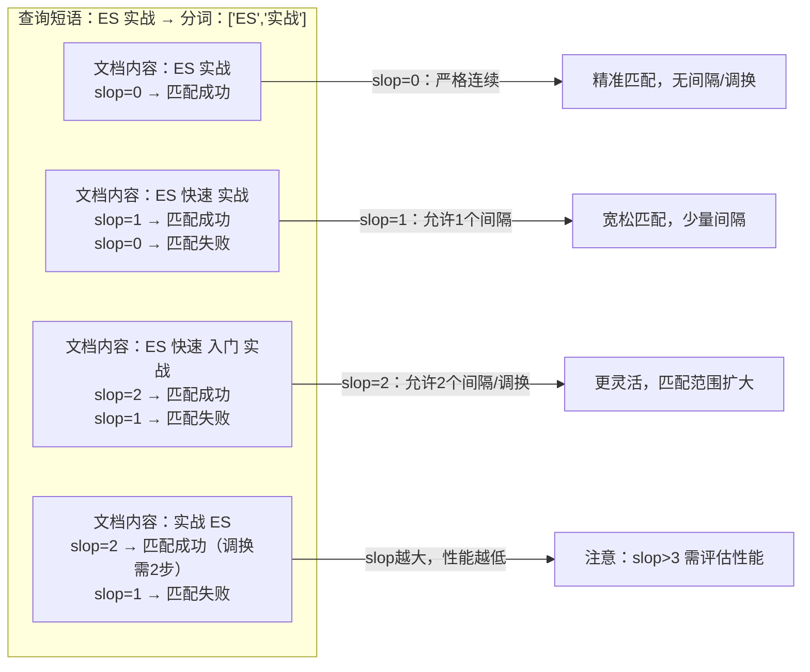
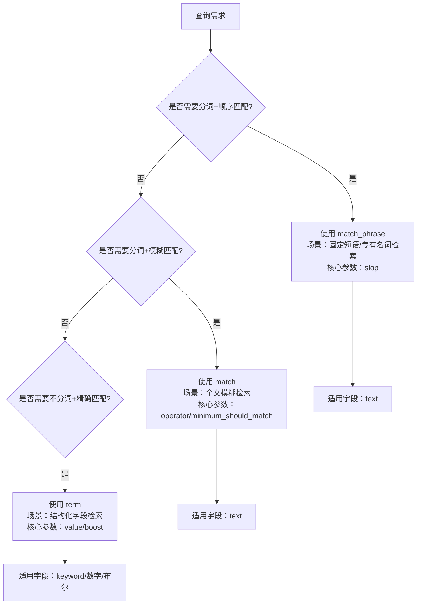
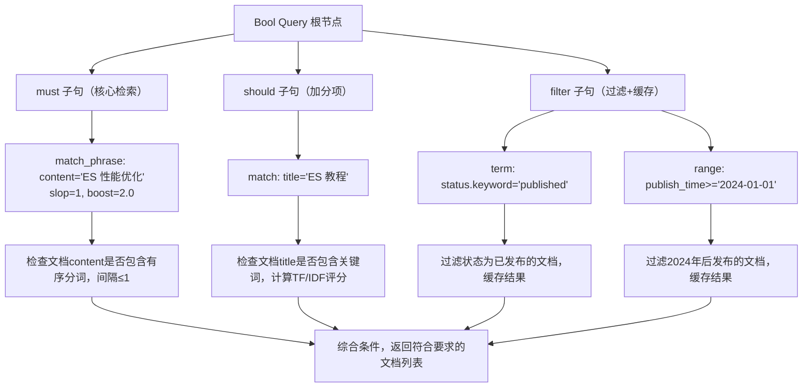

`match_phrase` 是 Elasticsearch 中实现精准短语检索的核心查询类型。本文从原理、语法、核心参数、使用场景到性能优化，全面解析 match_phrase 的用法和边界。

---

## 基础语法结构

### 最简格式（快速使用）

```json
{
  "query": {
    "match_phrase": {
      "字段名": "查询短语"
    }
  }
}
```

### 完整格式（自定义参数）

```json
{
  "query": {
    "match_phrase": {
      "字段名": {
        "query": "查询短语",
        "slop": 0,
        "boost": 1.0,
        "analyzer": "ik_max_word",
        "zero_terms_query": "none"
      }
    }
  }
}
```

---

## 核心参数详解

### `query`（必选）

要匹配的短语字符串，支持任意文本内容，会被分词器处理为有序分词列表。

- 示例：`"query": "ES 性能优化实战"` → 分词后为 `["ES", "性能优化", "实战"]`（取决于分词器）
- 注意：查询短语的分词逻辑必须和文档字段的分词逻辑一致（否则会匹配失败）

### `slop`（核心可选参数）

这是 `match_phrase` 最关键的参数。

- **作用**：允许查询分词在文档中存在的最大间隔/位置调换步数
- **默认值**：0（严格连续，分词必须无间隔、顺序一致）
- **步数计算规则**：
  - 插入1个词 → 消耗1步 slop
  - 调换2个相邻词的位置 → 消耗2步 slop（如 `A B` → `B A` 需要2步）

#### slop 示例

```json
{
  "match_phrase": {
    "content": {
      "query": "ES 实战",
      "slop": 1
    }
  }
}
```



### `boost`（可选）

权重提升参数，用于调整该查询在多条件组合（如 Bool Query）中的评分占比。

- 数值越大，匹配到该短语的文档评分越高
- 示例：`"boost": 3.0` → 该短语匹配的权重是默认值的3倍

### `analyzer`（可选）

指定处理查询短语的分词器，覆盖字段的默认分词器。

- 场景：字段默认用 `ik_smart`（粗粒度分词），但查询时需要 `ik_max_word`（细粒度分词）
- 示例：`"analyzer": "ik_max_word"`

### `zero_terms_query`（可选）

当查询短语分词后全是停用词（如的、了、吗）时的处理策略。

- `none`（默认）：返回空结果
- `all`：返回所有文档（等价于 `match_all`）
- 示例：`"zero_terms_query": "all"`

---

## match_phrase vs match vs term 对比

新手最易混淆这三个查询，下表清晰区分它们的核心差异：

| 特性 | match_phrase | match | term |
|------|--------------|-------|------|
| 分词处理 | 对查询词分词，要求顺序/间隔匹配 | 对查询词分词，无顺序/间隔要求 | 不对查询词分词，精确匹配完整值 |
| 词顺序 | 敏感（必须和查询顺序一致） | 不敏感（任意顺序均可） | 无分词，不存在顺序问题 |
| 核心参数 | slop（间隔容错） | operator/minimum_should_match | value/boost |
| 适用场景 | 精准短语检索（如固定搭配、专有名词） | 全文模糊检索（如文章内容搜索） | 结构化字段精确匹配（如状态/ID） |
| 示例 | 匹配 ES 实战教程（允许1个间隔） | 匹配包含 ES 或 实战 或 教程 | 匹配完整值 ES 实战教程（keyword字段） |



---

## 实战场景示例

### 场景1：严格短语匹配（slop=0）

需求：查询内容中严格包含 Elasticsearch 性能优化这个短语的文档（无间隔、顺序一致）。

```json
{
  "query": {
    "match_phrase": {
      "content": "Elasticsearch 性能优化"
    }
  },
  "size": 20,
  "_source": ["title", "content", "publish_time"]
}
```

#### 匹配结果

- 成功：`"content": "Elasticsearch 性能优化的核心是分片配置"`
- 失败：`"content": "性能优化 Elasticsearch 的核心是分片配置"`（顺序颠倒）
- 失败：`"content": "Elasticsearch 快速 性能优化的核心是分片配置"`（有间隔）

---

### 场景2：宽松短语匹配（slop=1）

需求：允许短语中词之间有1个间隔，适配更灵活的场景。

```json
{
  "query": {
    "match_phrase": {
      "content": {
        "query": "Elasticsearch 性能优化",
        "slop": 1
      }
    }
  }
}
```

#### 匹配结果

- 成功：`"content": "Elasticsearch 快速 性能优化的核心是分片配置"`（间隔1个词）
- 成功：`"content": "Elasticsearch 性能优化的核心是分片配置"`（无间隔）
- 失败：`"content": "Elasticsearch 快速 入门 性能优化"`（间隔2个词，slop=1不够）

---

### 场景3：结合 Bool Query 组合查询

需求：查询标题包含 ES 教程且内容包含 Elasticsearch 性能优化（允许1个间隔）且状态为已发布的文档。

```json
{
  "query": {
    "bool": {
      "must": [
        {"match": {"title": "ES 教程"}},
        {"match_phrase": {
          "content": {
            "query": "Elasticsearch 性能优化",
            "slop": 1,
            "boost": 2.0
          }
        }}
      ],
      "filter": [
        {"term": {"status.keyword": "published"}}
      ]
    }
  }
}
```



---