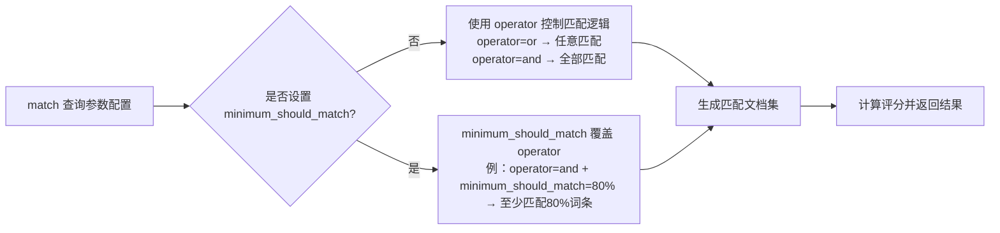
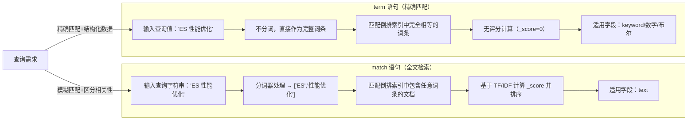
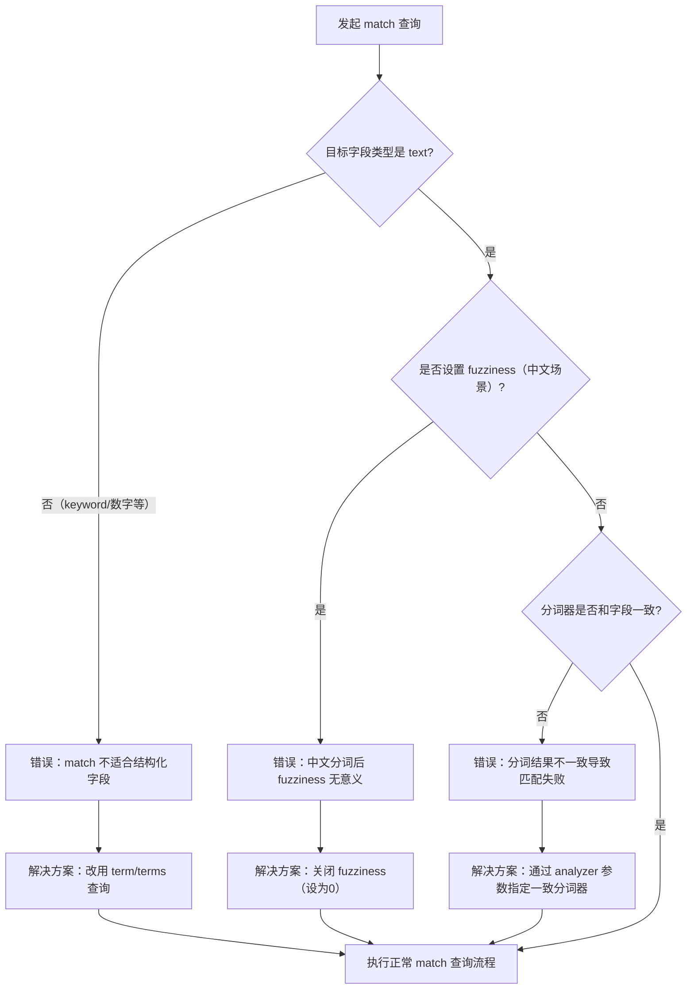
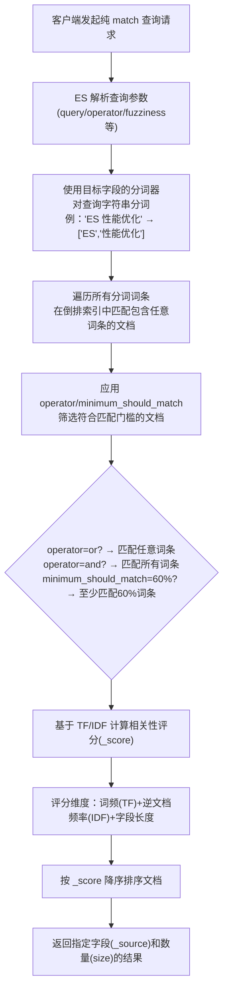
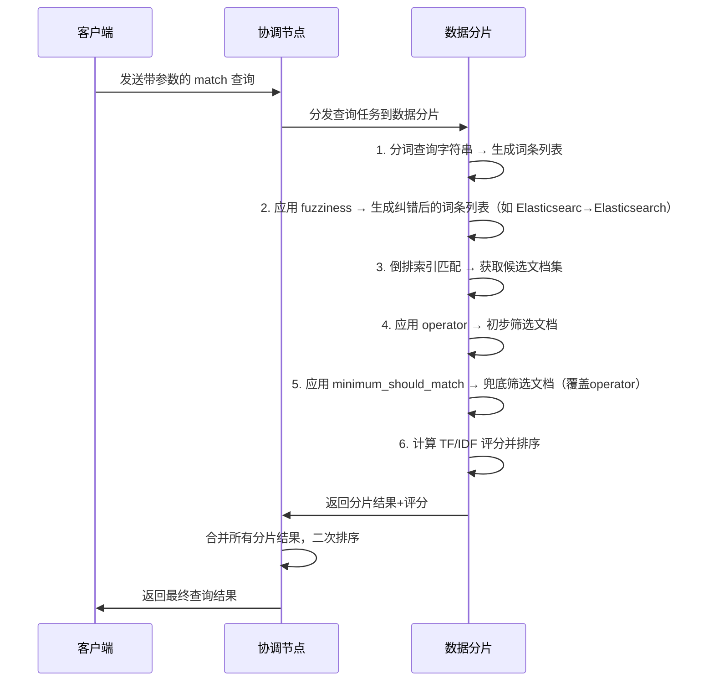

`match` 是 ES 专为 `text` 类型字段设计的全文检索语句，核心是"分词后模糊匹配"，能根据 TF/IDF 计算相关性评分，优先展示最相关的文档。

## 基础语法

`match` 语句的语法极简，分为最简格式（快速使用）和完整格式（自定义参数），无多余嵌套，新手易上手。

### 最简格式

90% 场景够用：

```json
{
  "query": {
    "match": {
      "目标字段名": "查询字符串"
    }
  }
}
```

示例：查询 `title` 字段中包含"Elasticsearch"或"性能优化"的文档

```json
{
  "query": {
    "match": {
      "title": "Elasticsearch 性能优化"
    }
  }
}
```

### 完整格式

自定义核心参数：

```json
{
  "query": {
    "match": {
      "目标字段名": {
        "query": "查询字符串",
        "operator": "or",
        "minimum_should_match": "70%",
        "fuzziness": "AUTO",
        "prefix_length": 2,
        "boost": 2.0,
        "analyzer": "ik_max_word",
        "zero_terms_query": "none"
      }
    }
  }
}
```

## 核心参数详解

以下参数仅针对基础 `match` 语句，每个参数都对应核心功能：

### query（必选）

- 作用：指定要检索的字符串，是 `match` 语句的核心输入
- 类型：字符串（支持任意文本，如中文、英文、数字混合）
- 注意：查询字符串的分词逻辑必须和目标字段的分词逻辑一致（否则会匹配失败）
  示例：若 `title` 字段用 `ik_max_word` 分词，查询字符串"ES 教程"会被拆分为 `["ES", "教程"]`，而非整体匹配

### operator（核心可选）

作用：控制分词后词条的匹配逻辑

| 取值 | 说明 |
|------|------|
| `or`（默认） | 匹配任意一个分词词条即可（逻辑或） |
| `and` | 必须匹配所有分词词条（逻辑与） |

示例：查询字符串"ES 性能优化"分词后为 `["ES", "性能优化"]`

- `operator: "or"`：包含"ES" 或 "性能优化"的文档都匹配
- `operator: "and"`：必须同时包含"ES" 且 "性能优化"的文档才匹配

### minimum_should_match（灵活可选）

作用：比 `operator` 更灵活的匹配门槛，指定至少需要匹配多少个分词词条，支持数字或百分比

- 数字：如 `2` → 至少匹配 2 个分词
- 百分比：如 `70%` → 至少匹配 70% 的分词（向下取整）

场景：当分词词条较多时（如 5 个），既不想用 `or`（匹配 1 个即可），也不想用 `and`（匹配 5 个），可设置 `minimum_should_match: "60%"`（至少匹配 3 个）

```json
{
  "match": {
    "content": {
      "query": "ES 性能优化 实战 案例",
      "minimum_should_match": "75%"
    }
  }
}
```

### 参数优先级



### fuzziness（容错可选）

作用：允许查询词有少量拼写错误（容错）

| 取值 | 说明 |
|------|------|
| `AUTO`（推荐） | 自动根据词长度适配容错度：词长度 ≤2 → 0个错误；词长度 3-5 → 1个错误；词长度 ≥6 → 2个错误 |
| 数字 | 如 `1` → 允许最多 1 个字符的增/删/改（如"Elasticsearc"匹配"Elasticsearch"） |
| `0` | 关闭容错（默认） |

注意：容错仅作用于英文/拼音等字母类文本，中文无意义（中文分词后是单个词，无法容错）

### prefix_length（配合 fuzziness 使用）

作用：模糊匹配时，指定前 N 个字符必须精准匹配，减少无效容错

示例：`prefix_length: 3` → 即使开启 `fuzziness: "AUTO"`，查询词的前 3 个字符也必须精准，避免"Elastic"匹配"eLASTic"（前 3 个字符"Ela"不一致）

### boost（权重可选）

- 作用：提升该 `match` 查询的评分权重，默认值 `1.0`
- 场景：在 Bool Query 中，让某个字段的 `match` 查询评分更高（如标题的权重高于内容）

```json
{
  "bool": {
    "should": [
      {"match": {"title": {"query": "ES", "boost": 3.0}}},
      {"match": {"content": {"query": "ES", "boost": 1.0}}}
    ]
  }
}
```

### analyzer（分词器可选）

- 作用：指定处理查询字符串的分词器，覆盖目标字段的默认分词器
- 场景：字段默认用 `ik_smart`（粗粒度分词），但查询时需要 `ik_max_word`（细粒度分词）

### zero_terms_query（边缘场景可选）

作用：当查询字符串分词后全是停用词（如"的、了、吗"）时的处理策略

| 取值 | 说明 |
|------|------|
| `none`（默认） | 返回空结果 |
| `all` | 返回所有文档（等价于 `match_all` 查询） |

## 评分逻辑

`match` 语句的 `_score` 核心基于 TF/IDF 算法，包含 3 个核心维度：

| 维度 | 说明 | 示例 |
|------|------|------|
| **TF（词频）** | 分词词条在文档中出现的次数越多，评分越高 | "ES"在文档中出现 5 次，比出现 1 次的评分高 |
| **IDF（逆文档频率）** | 分词词条在索引中出现的文档数越少，评分越高 | "性能优化"只在 10 篇文档中出现，比"ES"在 1000 篇文档中出现的评分高 |
| **字段长度** | 字段内容越短，评分越高 | 标题中匹配"ES"，比内容中匹配"ES"的评分高 |

简单总结：稀有词、高频出现、短字段，评分越高。

## 适用场景

`match` 语句是全文检索的主力军，仅适用于以下场景：

1. 模糊全文检索：如"搜索文章内容中包含'ES 性能优化'的文档"（不要求顺序、不要求连续）
2. 需区分相关性的检索：如"按匹配度排序，优先展示最相关的文档"
3. 多词条灵活匹配：如"匹配'ES'或'Elasticsearch'或'性能优化'的文档"

## match vs term 对比



## 避坑点

### 对 keyword 字段使用 match 语句

问题：`keyword` 字段的倒排索引是"完整字符串"，`match` 会对查询字符串分词，导致匹配失败

示例：`keyword` 字段值为"ES 教程"，`match` 查询"ES 教程"会分词为 `["ES", "教程"]`，但倒排索引中只有"ES 教程"这一个词条，无"ES"或"教程"，匹配失败

解决方案：`keyword` 字段用 `term` 语句，而非 `match`

### 混淆 operator 和 minimum_should_match

问题：同时设置 `operator: "and"` 和 `minimum_should_match: "80%"`，`minimum_should_match` 会覆盖 `operator`

解决方案：二选一即可，分词少用 `operator`，分词多用 `minimum_should_match`

### 对中文开启 fuzziness

问题：中文分词后是单个词（如"教程"），`fuzziness` 是字符级容错，对中文无意义，还会增加性能开销

解决方案：中文场景关闭 `fuzziness`（默认 `0` 即可）

### 忽略分词器一致性

问题：文档字段用 `ik_max_word` 分词，查询时用默认 `standard` 分词，导致分词结果不一致，匹配失败

解决方案：查询时通过 `analyzer` 参数指定和字段一致的分词器

### 避坑流程



## 完整示例

```json
{
  "query": {
    "match": {
      "article_content": {
        "query": "Elasticsearch 性能优化 实战",
        "operator": "or",
        "minimum_should_match": "60%",
        "fuzziness": "AUTO",
        "prefix_length": 3,
        "boost": 2.5,
        "analyzer": "ik_max_word",
        "zero_terms_query": "none"
      }
    }
  },
  "size": 20,
  "_source": ["title", "article_content", "publish_time"]
}
```

逻辑：检索 `article_content` 字段，包含"Elasticsearch""性能优化""实战"中至少 60% 的词条，允许查询词有少量拼写错误（前 3 个字符精准），该查询权重提升 2.5 倍，使用 ik 细粒度分词，分词后无有效词则返回空结果。

## 核心原理

`match` 查询的执行流程可拆解为 5 步：

1. 分词处理：ES 会使用目标字段配置的分词器（如 ik_max_word、standard），将查询字符串拆分成一个个独立的词条（term）
2. 倒排索引匹配：遍历分词后的所有词条，在字段的倒排索引中查找包含任意一个词条的文档
3. 匹配逻辑判断：根据 `operator`/`minimum_should_match` 参数，筛选出满足匹配门槛的文档
4. 相关性评分计算：对匹配的文档，基于 TF/IDF 算法计算相关性评分（`_score`）
5. 结果排序返回：按 `_score` 降序返回文档（评分越高，匹配度越高）

### 核心特点

| 特点 | 说明 |
|------|------|
| **仅作用于 text 字段** | `keyword` 字段用 `match` 会踩坑 |
| **不分词顺序** | 查询"ES 教程"和"教程 ES"，匹配结果完全一致 |
| **模糊匹配** | 只需匹配分词后的任意/部分/全部词条，无需完整匹配字符串 |
| **计算评分** | 核心价值是通过评分区分文档的相关性高低 |

### 执行流程



### 核心参数作用时序



## 总结

1. 纯 `match` 语句是 ES 全文检索的核心，仅作用于 text 字段，核心是"分词后模糊匹配+相关性评分"
2. 核心参数中，`operator`/`minimum_should_match` 控制匹配门槛，`fuzziness` 控制容错，`boost` 控制权重
3. 避坑核心：不用于 keyword 字段、保证分词器一致、中文关闭 fuzziness
4. 评分基于 TF/IDF，优先匹配"稀有词、高频出现、短字段"的文档
