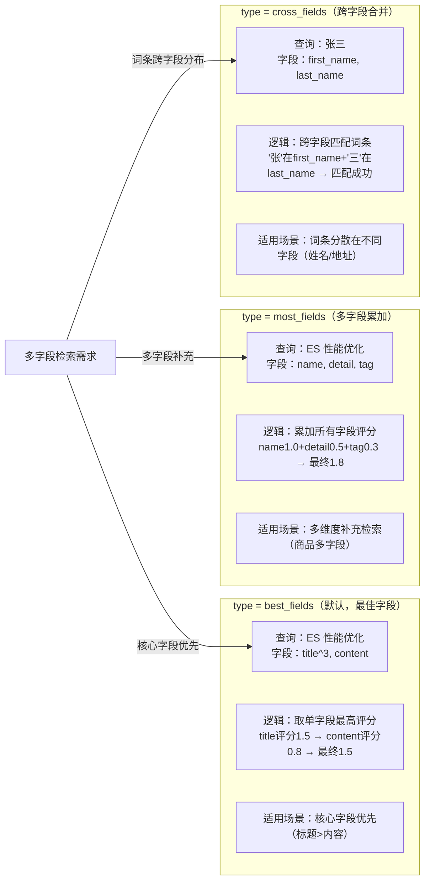
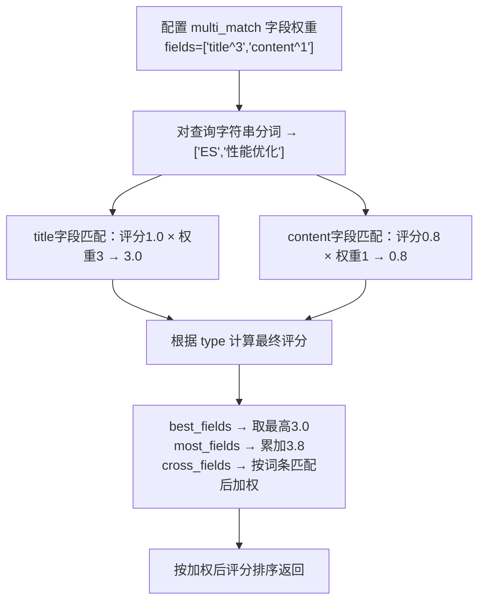
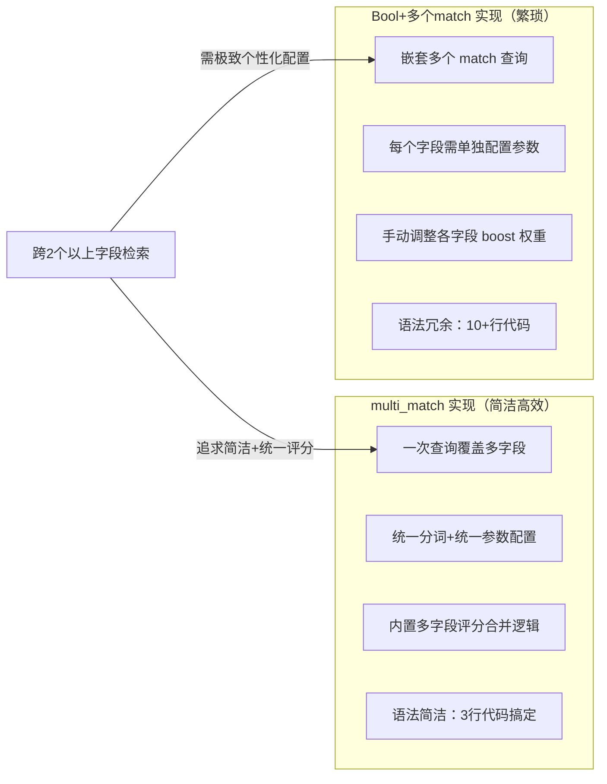
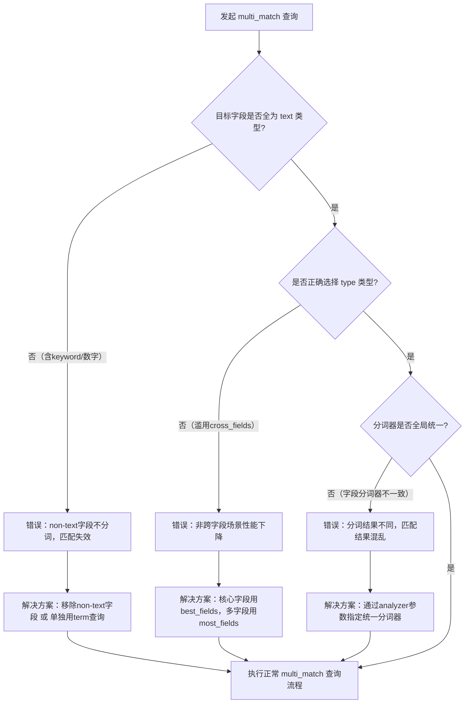

`multi_match` 是 Elasticsearch 中实现跨多个字段全文检索的核心查询类型，它允许使用同一个查询字符串同时在多个 text 类型字段上执行 match 查询，并合并结果。

---

## 基础语法

### 最简格式

快速跨字段匹配：

```json
{
  "query": {
    "multi_match": {
      "query": "查询字符串",
      "fields": ["字段1", "字段2"]
    }
  }
}
```

示例：同时在 `title` 和 `content` 字段上检索 `ES 性能优化`

```json
{
  "query": {
    "multi_match": {
      "query": "ES 性能优化",
      "fields": ["title", "content"]
    }
  }
}
```

### 完整格式

自定义核心参数：

```json
{
  "query": {
    "multi_match": {
      "query": "查询字符串",
      "fields": ["title^3", "content"],
      "type": "best_fields",
      "operator": "or",
      "minimum_should_match": "70%",
      "fuzziness": "AUTO",
      "prefix_length": 2,
      "analyzer": "ik_max_word",
      "tie_breaker": 0.3,
      "zero_terms_query": "none"
    }
  }
}
```

---

## 核心参数详解

### 基础必选参数

#### query

必选参数，指定要检索的字符串，会被分词器处理为词条列表。

#### fields

必选参数，指定要匹配的多个字段，支持 3 种写法：

| 写法 | 示例 | 说明 |
|------|------|------|
| 显式列表 | `["title", "content", "author"]` | 直接列出所有字段 |
| 通配符 | `["title*", "content*"]` | 匹配所有以 title/content 开头的字段 |
| 权重标记 | `["title^3", "content"]` | `^3` 表示 `title` 字段的评分权重是 `content` 的 3 倍 |

注意：字段必须是 `text` 类型，否则会按 `keyword` 处理（分词失效，匹配失败）。

### 核心类型参数：type

`type` 是 `multi_match` 的灵魂参数，不同 `type` 对应完全不同的匹配和评分逻辑。

#### 五种类型对比

| type 类型 | 核心逻辑 | 适用场景 |
|-----------|----------|---------|
| `best_fields` | 取所有字段中**匹配度最高的字段评分**作为文档最终评分（默认类型） | 检索核心字段优先场景（如标题比内容重要） |
| `most_fields` | 汇总所有字段的评分（累加），字段匹配越多、评分越高 | 检索多字段补充场景（如标题+摘要+内容） |
| `cross_fields` | 将多个字段视为一个"大字段"，按词条跨字段匹配 | 检索词条跨字段场景（如姓名=张三，姓在 name1、名在 name2） |
| `phrase` | 所有字段执行 `match_phrase` 匹配，取最佳字段评分 | 多字段短语精准匹配 |
| `phrase_prefix` | 所有字段执行 `match_phrase_prefix` 匹配，取最佳字段评分 | 多字段短语前缀联想 |

#### 高频类型详解



**best_fields（默认）**

- 逻辑：文档只需在**任意一个字段**上匹配度高，就会获得高评分
- 示例：查询 `ES 教程`，文档 A 的 `title` 字段完全匹配（评分 1.5），`content` 字段未匹配；文档 B 的 `content` 字段部分匹配（评分 0.8）→ 文档 A 评分更高（取最佳字段 1.5）
- 适配场景：标题/摘要/内容检索，优先匹配标题的场景

**most_fields**

- 逻辑：文档在越多字段上匹配，评分越高（累加所有字段的评分）
- 示例：查询 `ES 教程`，文档 A 仅 `title` 匹配（评分 1.5），文档 B `title`+`content` 都匹配（评分 1.5+0.8=2.3）→ 文档 B 评分更高
- 适配场景：多维度补充检索（如商品名称+详情+标签）

**cross_fields**

- 解决痛点：`best_fields`/`most_fields` 无法处理词条分散在不同字段的场景（如查询 `张三`，`张` 在 `first_name` 字段，`三` 在 `last_name` 字段）
- 逻辑：将多个字段合并为一个字段，按词条跨字段匹配
- 示例：

```json
{
  "multi_match": {
    "query": "张三",
    "fields": ["first_name", "last_name"],
    "type": "cross_fields",
    "operator": "and"
  }
}
```

即使 `张` 在 `first_name`、`三` 在 `last_name`，也会匹配成功。

### 其他兼容参数

`operator`/`minimum_should_match`/`fuzziness`/`prefix_length`/`analyzer`/`zero_terms_query` 这些参数，作用和 `match` 语句完全一致，用于控制分词后的匹配逻辑、容错度等。

### 专属参数：tie_breaker

- 作用：仅对 `best_fields`/`phrase` 类型生效，用于融合次优字段的评分，避免仅取最佳字段导致评分单一
- 取值范围：0~1（0=仅取最佳字段，1=所有字段评分平均）
- 示例：`tie_breaker: 0.3` → 最终评分 = 最佳字段评分 + 0.3 × 次优字段评分
- 场景：既优先核心字段，又兼顾其他字段的匹配度

### 字段权重配置



---

## 使用场景

`multi_match` 是跨字段检索的首选，核心场景包括：

### 场景1：文章多字段检索（best_fields）

需求：检索 `ES 性能优化`，优先匹配标题（权重×3），其次匹配内容，取最佳字段评分。

```json
{
  "query": {
    "multi_match": {
      "query": "ES 性能优化",
      "fields": ["title^3", "content"],
      "type": "best_fields",
      "operator": "and"
    }
  }
}
```

### 场景2：商品多维度检索（most_fields）

需求：检索 `华为手机`，匹配商品名称、详情、标签，匹配字段越多评分越高。

```json
{
  "query": {
    "multi_match": {
      "query": "华为手机",
      "fields": ["name", "detail", "tag"],
      "type": "most_fields",
      "minimum_should_match": "60%"
    }
  }
}
```

### 场景3：姓名跨字段检索（cross_fields）

需求：检索 `张三`，匹配 `first_name`（姓）和 `last_name`（名），支持词条跨字段分布。

```json
{
  "query": {
    "multi_match": {
      "query": "张三",
      "fields": ["first_name", "last_name"],
      "type": "cross_fields",
      "operator": "and"
    }
  }
}
```

### 场景4：多字段短语前缀联想（phrase_prefix）

需求：输入 `ES 实`，在标题和内容字段同时执行短语前缀匹配，实现联想提示。

```json
{
  "query": {
    "multi_match": {
      "query": "ES 实",
      "fields": ["title^2", "content"],
      "type": "phrase_prefix",
      "max_expansions": 10
    }
  }
}
```

---

## 与 Bool+match 对比



**对比总结**

| 特性 | multi_match | Bool+多个match |
|------|-------------|---------------|
| 语法简洁度 | 高（3-5行） | 低（10+行） |
| 参数配置 | 统一配置 | 每个字段单独配置 |
| 评分合并 | 内置逻辑 | 手动调整 boost |
| 灵活性 | 中等 | 高 |

---

## 性能优化

### 1. 控制字段数量

- 避免一次性匹配过多字段（如 >10 个），会增加每个字段的 `match` 查询开销
- 仅选择核心字段（如标题、摘要），非核心字段通过 Bool Query 按需补充

### 2. 合理选择 type 类型

| 场景 | 推荐类型 | 原因 |
|------|---------|------|
| 核心字段优先 | `best_fields` | 取最佳字段，性能最优 |
| 多字段补充 | `most_fields` | 累加评分，全面匹配 |
| 词条跨字段 | `cross_fields` | 解决词条分散问题 |

避免滥用 `cross_fields`（性能略低于前两者）。

### 3. 权重优化

- 通过 `^N` 标记核心字段权重（如 `title^3`），而非后续再调整评分
- 避免设置过高权重（如 `^10`），会导致评分失衡

### 4. 结合 Filter 缩小范围

在 Bool Query 中，先用 `filter` 过滤无关文档（如状态、分类），再执行 `multi_match`。

```json
{
  "query": {
    "bool": {
      "filter": [{"term": {"status.keyword": "published"}}],
      "must": [
        {
          "multi_match": {
            "query": "ES 性能优化",
            "fields": ["title^3", "content"]
          }
        }
      ]
    }
  }
}
```

---

## 避坑指南



### 常见错误及解决方案

| 错误类型 | 问题描述 | 解决方案 |
|---------|---------|---------|
| 包含 non-text 字段 | `fields` 中包含 `keyword`/数字/布尔字段，这些字段不分词，导致查询字符串分词后无法匹配 | 仅选择 `text` 字段，`keyword` 字段单独用 `term` 查询在 Bool 中组合 |
| 滥用 cross_fields 类型 | 非跨字段场景使用 `cross_fields`，会增加合并字段的计算开销 | 仅在词条可能分散在不同字段时使用（如姓名、地址） |
| 忽略分词器一致性 | 不同字段使用不同分词器（如 `title` 用 ik、`content` 用 standard），导致同一查询字符串在不同字段分词结果不一致 | 查询时通过 `analyzer` 参数强制指定统一分词器（如 `analyzer: "ik_max_word"`） |
| 误解 tie_breaker 作用 | 对 `most_fields` 类型设置 `tie_breaker`（该参数仅对 `best_fields` 生效） | `tie_breaker` 仅用于 `best_fields`/`phrase` 类型，`most_fields` 无需设置 |

---