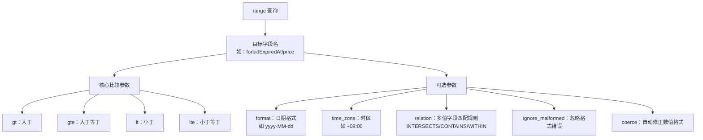
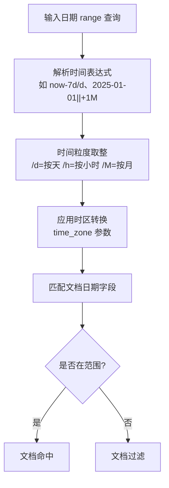
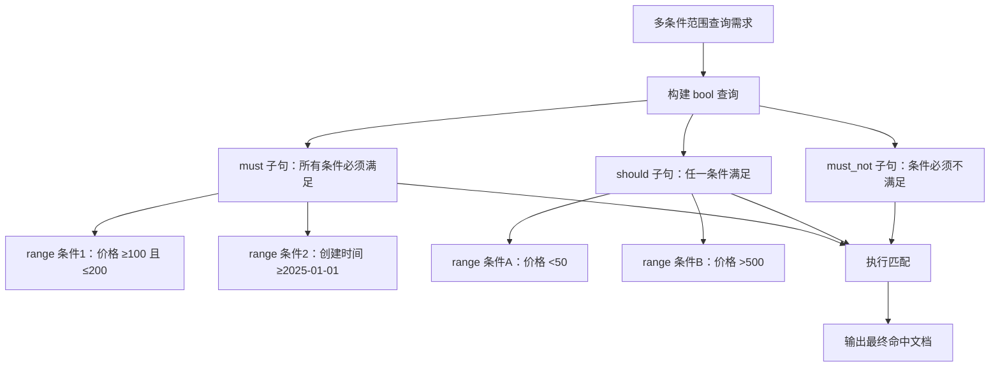

`range` 查询是 Elasticsearch 中最常用的查询类型之一，核心用于对**数值、日期、甚至字符串**类型的字段做**范围筛选**。用于匹配字段值在指定数值范围/日期范围/字符串范围内的文档，是 ES 中筛选"区间数据"的核心方式，比如"查询价格在 100-200 元的商品""查询 2025 年 1 月之后过期的文档"。

`range` 查询支持两种使用形式：**查询字符串语法**（简洁版）和 **Query DSL 语法**（结构化 JSON，更规范、功能更全，推荐生产环境使用）。

## 核心语法与参数

Query DSL 是最通用的写法，结构清晰、可扩展性强：

```json
{
  "query": {
    "range": {
      "字段名": {
        "gte": 起始值,
        "gt": 起始值,
        "lte": 结束值,
        "lt": 结束值,
        "boost": 1.0,
        "format": "yyyy-MM-dd HH:mm:ss",
        "time_zone": "+08:00"
      }
    }
  }
}
```

### 关键参数说明

| 参数 | 含义 | 适用字段类型 |
|------|------|--------------|
| `gt` | 大于（不包含边界） | 数值/日期/字符串 |
| `gte` | 大于等于（包含边界） | 数值/日期/字符串 |
| `lt` | 小于（不包含边界） | 数值/日期/字符串 |
| `lte` | 小于等于（包含边界） | 数值/日期/字符串 |
| `format` | 日期解析格式，比如 `yyyy-MM-dd` | 仅日期类型 |
| `time_zone` | 时区偏移，比如 `+08:00`（东八区） | 仅日期类型 |



## 不同字段类型的使用示例

### 数值类型

最常用的场景，包括价格、年龄、ID 等。查询商品表中，价格在 100（含）到 200（不含）元的商品：

```json
{
  "query": {
    "range": {
      "price": {
        "gte": 100,
        "lt": 200
      }
    }
  }
}
```

### 日期类型

高频场景，用于时间范围筛选。查询 `forbidExpiredAt` 字段在 2025-01-01 00:00:00（东八区）之后过期的文档：

```json
{
  "query": {
    "range": {
      "forbidExpiredAt": {
        "gte": "2025-01-01 00:00:00",
        "lte": "now",
        "format": "yyyy-MM-dd HH:mm:ss",
        "time_zone": "+08:00"
      }
    }
  }
}
```

ES 对日期支持灵活的表达式：

- `now`：当前时间
- `now-1d`：当前时间减 1 天（d=天，h=小时，m=分钟，s=秒，M=月，y=年）
- `2025-01-01||+1M`：2025-01-01 加 1 个月

查询近 7 天创建的文档：

```json
{
  "range": {
    "createTime": {
      "gte": "now-7d/d",
      "lte": "now"
    }
  }
}
```



### 字符串类型

`range` 也支持字符串字段，但会按 **Unicode 字典序**匹配（不是按语义），仅适合纯字母/固定长度字符串的场景。查询用户名以 A-F 开头的文档（字典序 A ≤ username &lt; G）：

```json
{
  "range": {
    "username": {
      "gte": "A",
      "lt": "G"
    }
  }
}
```

```mermaid
graph LR
    A[range 查询] --> B[数值类型<br/>long/integer/double]
    A --> C[日期类型<br/>date]
    A --> D[字符串类型<br/>text/keyword]
    
    B --> B1[支持 gt/gte/lt/lte<br/>按数值大小匹配<br/>推荐使用]
    C --> C1[支持时间表达式+时区<br/>需指定 format<br/>高频使用场景]
    D --> D1[按 Unicode 字典序匹配<br/>数字字符串易出错<br/>谨慎使用]
    
    D1 --> D2[反例："100" 字典序 < "20"]
    D2 --> D3[解决方案：改为数值类型]
```

## 查询字符串语法

查询字符串语法常用于 URI Search（直接拼在 URL 里）或简单场景：

| 语法 | 含义 | 对应 DSL 参数 |
|------|------|--------------|
| `[a TO b]` | 闭区间：包含 a 和 b | `gte:a` + `lte:b` |
| `{a TO b}` | 开区间：不包含 a 和 b | `gt:a` + `lt:b` |
| `[a TO b}` | 左闭右开：包含 a，不包含 b | `gte:a` + `lt:b` |
| `*` | 通配符：代表"无上限/无下限" | `lte:*`（无上限）/ `gte:*`（无下限） |

示例：

- `price:[100 TO 200]` → 价格 ≥100 且 ≤200
- `price:{100 TO 200}` → 价格 >100 且 &lt;200
- `forbidExpiredAt:[2025-01-01 TO *]` → 过期时间 ≥2025-01-01
- `forbidExpiredAt:[* TO 2025-01-01]` → 过期时间 ≤2025-01-01（已过期）

```mermaid
graph LR
    A[range 查询语法] --> B[查询字符串语法<br/>URI Search 适用]
    A --> C[Query DSL 语法<br/>生产环境推荐]
    
    B --> B1[格式：字段名[起始值 TO 结束值]]
    B1 --> B2[示例1：forbidExpiredAt:[2025-01-01 TO *]<br/>→ 大于等于 2025-01-01]
    B1 --> B3[示例2：price:{100 TO 200}<br/>→ 大于100 且 小于200]
    B1 --> B4[符号：[]=闭区间 / {}=开区间 / *=无边界]
    
    C --> C1[格式：JSON 结构化配置]
    C1 --> C2[示例1：{"range":{"price":{"gte":100,"lt":200}}}]
    C1 --> C3[示例2：{"range":{"forbidExpiredAt":{"gte":"2025-01-01","lte":"now"}}}]
    C1 --> C4[支持全部可选参数]
```

## 冷门但实用的参数

### relation：多值字段的范围匹配规则

如果字段是**多值类型**（比如一个商品有多个价格 `[99, 199, 299]`），`relation` 用来定义"多值字段如何匹配范围"，默认值是 `INTERSECTS`。

| `relation` 值 | 含义 | 示例（查询价格 [100, 200]） |
|---------------|------|------------------------------|
| `INTERSECTS`（默认） | 字段中**至少有一个值**落在范围里即可匹配 | 商品价格 `[99, 199, 299]` → 匹配（199 在范围里） |
| `CONTAINS` | 字段中**所有值都落在范围里**才匹配 | 商品价格 `[99, 199, 299]` → 不匹配（99、299 不在范围） |
| `WITHIN` | 范围**完全包含**字段的所有值才匹配 | 商品价格 `[100, 150]` → 匹配（范围 [100,200] 包含所有值） |

示例代码：

```json
{
  "query": {
    "range": {
      "multi_price": {
        "gte": 100,
        "lte": 200,
        "relation": "CONTAINS"
      }
    }
  }
}
```

### ignore_malformed：忽略格式错误的字段值

默认值 `false`，如果字段值格式不符合（比如 date 字段存了非日期字符串 `"abc"`，数值字段存了 `"xxx"`），ES 会直接抛出异常；设置为 `true` 时，会忽略这些格式错误的文档（不报错，也不匹配）。

示例：

```json
{
  "query": {
    "range": {
      "forbidExpiredAt": {
        "gte": "2025-01-01",
        "ignore_malformed": true
      }
    }
  }
}
```

### coerce：自动修正数值格式

默认值 `true`，会自动将字符串格式的数值转为纯数值（比如 `"100.5"` → `100.5`，`" 200 "` → `200`）；设置为 `false` 时，字符串格式的数值会被判定为不匹配。

示例：

```json
{
  "query": {
    "range": {
      "price": {
        "gte": 100,
        "coerce": false
      }
    }
  }
}
```

## 特殊场景的用法

### 结合 bool 查询实现多范围叠加

`range` 可以和 `must/should/must_not` 结合，实现更复杂的范围筛选：

- 查询"价格 100-200 元 **且** 2025 年之后上架"的商品
- 查询"价格 &lt;50 元 **或** 价格 >500 元"的商品

示例（多范围叠加）：

```json
{
  "query": {
    "bool": {
      "must": [
        {
          "range": {
            "price": { "gte": 100, "lte": 200 }
          }
        },
        {
          "range": {
            "createTime": { "gte": "2025-01-01", "format": "yyyy-MM-dd" }
          }
        }
      ]
    }
  }
}
```



### 日期范围的四舍五入（rounding）

日期范围支持更细的四舍五入规则，用于精准对齐时间粒度：

- `now-1h/h`：当前时间减 1 小时，且按小时取整（比如现在 10:30 → 9:00）
- `2025-01-01||/M`：2025-01-01 按月份取整（即 2025-01-01 00:00:00）
- `now+1w/w`：当前时间加 1 周，且按周取整（周一 00:00:00）

查询 2025 年 1 月整月的文档：

```json
{
  "range": {
    "createTime": {
      "gte": "2025-01-01||/M",
      "lte": "2025-01-01||+1M-1s"
    }
  }
}
```

## 易踩的隐形坑

### 字符串字段的 range 查询陷阱

即使字符串字段存的是数字（比如 `"100"`、`"20"`），range 查询也会按 **Unicode 字典序**匹配，而非数值大小。比如查询 `price_str:[20 TO 100]`（price_str 是字符串字段），结果会匹配 `"20"`、`"200"`、`"99"`，但**不匹配 `"100"`**（因为字符 '1' &lt; '2'，`"100"` 字典序小于 `"20"`）。

解决方案：把字段改为数值类型，或用 `script` 查询（不推荐，性能差）。

### null 值的处理

如果字段值为 `null`、空数组 `[]` 或字段不存在，`range` 查询会**直接跳过这些文档**（既不匹配，也不报错）。如果需要匹配"字段不存在"的场景，要结合 `bool + must_not + exists`：

示例（查询价格 ≤100 元 **或** 价格字段不存在的商品）：

```json
{
  "query": {
    "bool": {
      "should": [
        { "range": { "price": { "lte": 100 } } },
        { "bool": { "must_not": { "exists": { "field": "price" } } } }
      ]
    }
  }
}
```

### 版本兼容性

- ES 7.x 及以上：`range` 查询的语法无大变化，但 `relation` 参数是 ES 6.x 新增的，低版本（如 5.x）不支持
- ES 5.x 及以下：日期格式的容错性更低，`ignore_malformed` 对 date 字段的支持有限，建议优先升级或严格校验字段格式

## 使用注意事项

### 字段类型必须匹配

- 数值范围查询：字段必须是 `long/integer/double` 等数值类型，不能是字符串（比如 "100" 是字符串，范围查询会按字典序，结果错误）
- 日期范围查询：字段必须是 `date` 类型，否则需指定 `format` 或先做字段映射

### 性能优化

- 对大数值/日期字段，建议开启**字段排序/索引优化**（比如 date 字段默认已优化）
- 避免对"高基数字符串字段"做 range 查询（性能差，可改用关键词分词/前缀查询）

### 时区问题

日期类型的 range 查询，务必指定 `time_zone`（比如东八区 `+08:00`），否则会用 ES 服务器默认时区（UTC），导致时间筛选偏差。

---

## 总结

1. `range` 是 ES 核心查询，用于筛选**数值/日期/字符串**字段的区间数据，支持 `gt/gte/lt/lte` 四个核心参数
2. 推荐使用 **Query DSL 语法**（结构化 JSON），生产环境更易维护，查询字符串语法仅用于简单/临时场景
3. 核心避坑点：确保字段类型与查询匹配（数值/日期字段别存为字符串），日期查询指定时区
4. 多值字段、格式容错的**特殊参数**：`relation`/`ignore_malformed`/`coerce`
5. 日期四舍五入、多范围叠加的**进阶用法**
6. 字符串范围查询、null 值处理的**避坑点**
