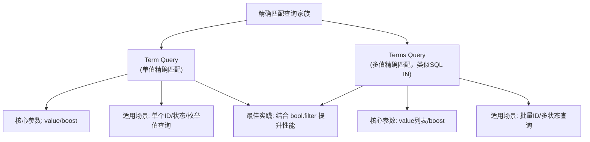
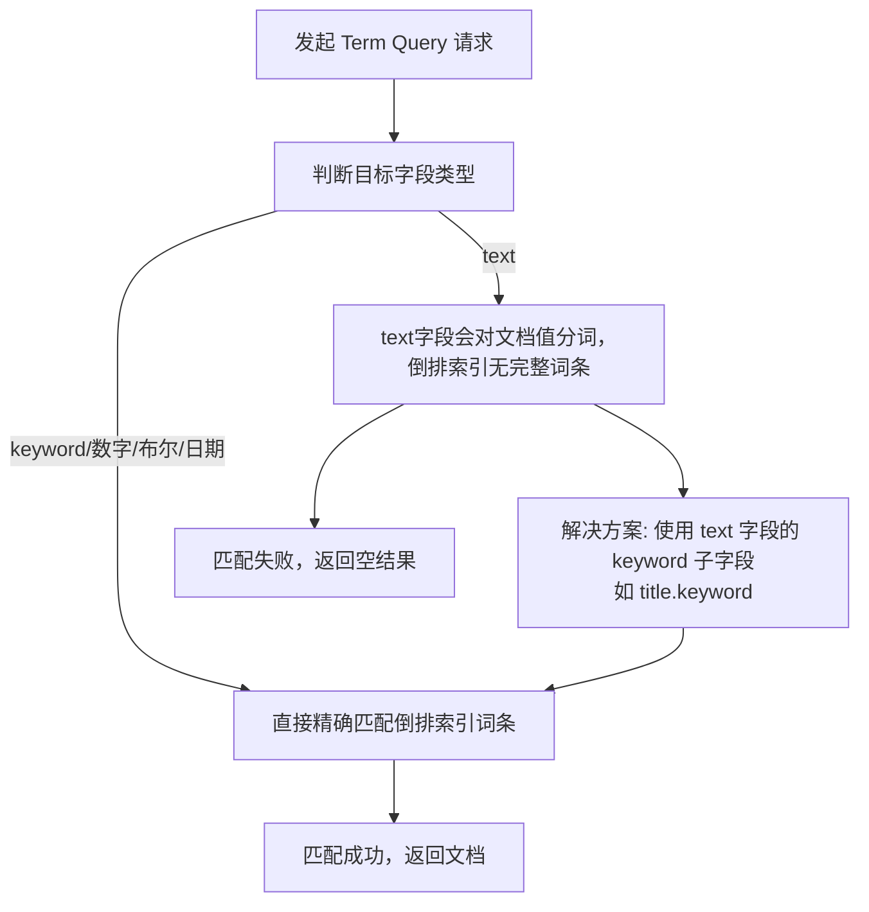
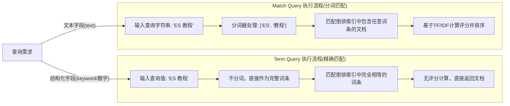
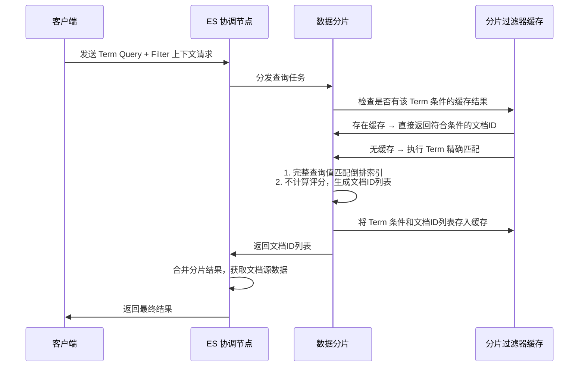

## 基础语法结构

Term Query 有最简格式和完整格式，核心参数较少，语法简洁：

### 最简格式（快速使用）

```json
{
  "query": {
    "term": {
      "字段名": "精确匹配值"
    }
  }
}
```

### 完整格式（自定义参数）

```json
{
  "query": {
    "term": {
      "字段名": {
        "value": "精确匹配值",
        "boost": 1.0
      }
    }
  }
}
```

---

## 核心参数详解

### value（必选）

要精确匹配的完整值，支持字符串、数字、布尔值等类型：

- 字符串：需注意大小写和空格（比如 Active ≠ active）
- 数字：直接写数值（比如 100，而非 100）
- 布尔值：true/false（小写）

#### 示例（不同类型字段的 Term 查询）

```json
{
  "query": {
    "bool": {
      "must": [
        {"term": {"user_id": 1001}},
        {"term": {"status.keyword": "active"}},
        {"term": {"is_vip": true}}
      ]
    }
  }
}
```

### boost（可选）

权重调整参数，默认值为 1.0，仅在 Query 上下文（会计算评分）生效：

- 数值越大，该查询对文档总评分的贡献越高
- 在 Filter 上下文（如 bool.filter 中），boost 无效（因为 Filter 不计算评分）

#### 示例（提升 Term 查询的权重）

```json
{
  "query": {
    "term": {
      "tag.keyword": {
        "value": "精品",
        "boost": 3.0
      }
    }
  }
}
```

---

## 关键使用场景

Term Query 是处理结构化数据的首选，常见场景包括：

1. 枚举值查询：状态（active/inactive）、类型（product/order）、标签（hot/new）等
2. ID 查询：用户ID、商品ID、订单ID等唯一标识
3. 布尔值查询：是否VIP（is_vip: true）、是否删除（is_deleted: false）等
4. 数值精确匹配：价格（price: 99）、库存（stock: 0）等
5. 过滤场景：结合 bool.filter 使用（性能最优，可缓存）



---

## 高频注意事项

### 字段类型是核心：text vs keyword

Term Query 不能直接用于 text 类型字段，因为 text 字段会对文档值分词，导致倒排索引中无完整词条。

| 字段类型 | 文档值       | 分词后倒排索引词条 | Term 查询值 | 是否匹配 |
|----------|--------------|--------------------|-------------|----------|
| text     | ES 实战教程 | ES, 实战, 教程 | ES 实战教程 | ❌ 不匹配 |
| keyword  | ES 实战教程 | ES 实战教程    | ES 实战教程 | ✅ 匹配 |

#### 解决方案

- 对字符串字段，创建索引时指定 keyword 子类型（ES 默认会为 text 字段生成 字段名.keyword 的 keyword 子字段）
- 始终用 字段名.keyword 作为 Term Query 的字段名（针对字符串类型）

#### 示例（正确查询 text 字段的完整值）

```json
{
  "query": {
    "term": {
      "title.keyword": "ES 实战教程"
    }
  }
}
```



### 大小写敏感

Term Query 对字符串的大小写严格敏感：

- 查询值 Active 无法匹配文档值 active
- 如需忽略大小写，需在创建索引时为 keyword 字段设置 normalizer（标准化器）

#### 示例（创建索引时定义 normalizer）

```json
PUT /my_index
{
  "settings": {
    "analysis": {
      "normalizer": {
        "lowercase_normalizer": {
          "type": "custom",
          "filter": ["lowercase"]
        }
      }
    }
  },
  "mappings": {
    "properties": {
      "status": {
        "type": "keyword",
        "normalizer": "lowercase_normalizer"
      }
    }
  }
}
```

#### 示例（此时 Term 查询忽略大小写）

```json
{
  "query": {
    "term": {
      "status": "Active"
    }
  }
}
```

### 批量精确匹配：Terms Query

如果需要匹配多个精确值（类似 SQL 的 IN），用 terms 查询（Term 的复数形式）：

```json
{
  "query": {
    "terms": {
      "user_id": [1001, 1002, 1003],
      "boost": 1.0
    }
  }
}
```

---

## Term Query vs Match Query 核心对比

这是新手最易混淆的点，用表格清晰区分：

| 特性                | Term Query                | Match Query               |
|---------------------|---------------------------|---------------------------|
| 分词处理            | 不对查询值分词            | 对查询值分词              |
| 匹配逻辑            | 完整值精确匹配            | 分词后模糊匹配            |
| 评分计算            | 不计算（_score=0）| 基于 TF/IDF 计算评分      |
| 适用字段类型        | keyword/数字/布尔/日期    | text                      |
| 核心场景            | 结构化数据精确检索        | 全文文本模糊检索          |
| 大小写敏感          | 是（可通过normalizer优化） | 否（分词器通常转小写）|
| 性能                | 极高（直接命中倒排索引）| 中等（需分词+评分）|



---

## 完整实战示例

需求：查询状态为已发布、分类为手机、库存大于 0 的商品，且优先用 Filter 上下文提升性能：

```json
{
  "query": {
    "bool": {
      "filter": [
        {"term": {"status.keyword": "published"}},
        {"term": {"category.keyword": "phone"}},
        {"range": {"stock": {"gt": 0}}}
      ],
      "should": [
        {"term": {"tag.keyword": {"value": "爆款", "boost": 2.0}}}
      ]
    }
  },
  "size": 20,
  "_source": ["product_name", "price", "stock"]
}
```

