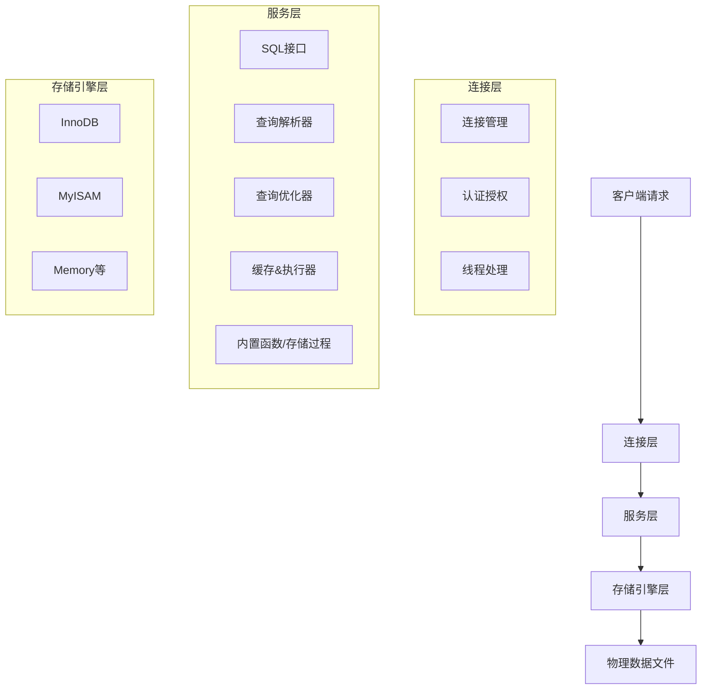

## 简介

MySQL 是一款**开源的关系型数据库管理系统（RDBMS）**，由瑞典 MySQL AB 公司开发，现在隶属于 Oracle 公司。它基于 SQL（结构化查询语言）进行数据管理，核心是将数据存储在按"表""行""列"组织的关系模型中，是目前全球最流行的数据库之一，尤其在中小型应用和互联网场景中占据主导地位。

可以简单理解：如果把数据比作书籍，MySQL 就是一个"智能图书馆"——它负责收纳、分类、检索、修改这些"书籍"，并且能高效处理多个人同时查阅/修改的需求。

## 核心特点

| 特性 | 说明 |
|------|------|
| **开源免费** | 社区版完全免费，无需支付授权费用，这是它普及的核心原因之一；企业版提供商业支持，但大部分开发者/中小企业用社区版即可满足需求。 |
| **跨平台** | 支持 Windows、Linux、macOS 等主流操作系统，部署灵活。 |
| **高性能** | 针对读写操作做了大量优化，尤其是读操作（查询）效率极高，能轻松应对高并发场景（比如电商网站的商品查询）。 |
| **易用性** | 语法贴近标准 SQL，学习成本低；配套工具丰富（如 Navicat、MySQL Workbench、phpMyAdmin），可视化操作降低了使用门槛。 |
| **支持多种存储引擎** | 最常用的是 **InnoDB**（支持事务、行级锁、外键，适合高并发、数据一致性要求高的场景，如电商订单）和 **MyISAM**（查询速度快、不支持事务，适合只读/少写场景，如日志统计）。MySQL 5.5 之后默认使用 InnoDB。 |
| **支持事务和 ACID 特性** | 基于 InnoDB 引擎，MySQL 支持事务（一组操作要么全成功，要么全失败），满足 ACID 原则： • **原子性**（Atomicity）：事务是不可分割的最小单位 • **一致性**（Consistency）：事务执行前后数据状态合法 • **隔离性**（Isolation）：多个事务互不干扰 • **持久性**（Durability）：事务提交后数据永久保存 |

## 逻辑架构

MySQL 的逻辑架构是"分层设计"，从客户端请求到最终返回结果，数据会依次经过这些层级处理，核心可以分为 3 层：

### 连接层

连接层是最外层，负责处理客户端与 MySQL 服务器的连接，是请求的"入口"。

**核心作用**：处理客户端与 MySQL 服务器的连接。

**关键组件**：

- 连接管理：每一个客户端连接都会创建/复用一个线程，MySQL 会限制最大连接数（`max_connections`）避免资源耗尽；
- 认证授权：验证用户名/密码，检查该用户是否有访问对应数据库/表的权限；
- 线程池：复用线程减少创建/销毁线程的开销（高并发场景关键优化）。

### 服务层

服务层是核心处理层，所有 SQL 逻辑都在这里处理，负责 SQL 的"解析、优化、执行"，与存储引擎无关（对下统一调用存储引擎接口）。

**核心组件**：

- **SQL 接口**：接收客户端的 SQL 语句（增删改查/存储过程等），返回执行结果；
- **查询解析器**：把 SQL 语句解析成"解析树"（比如把 `SELECT * FROM user WHERE id=1` 拆成"查询user表、条件id=1、返回所有字段"），如果 SQL 语法错误，这里会直接报错；
- **查询优化器**：对解析树做"最优执行计划"选择（比如先过滤条件还是先联表、用哪个索引），比如同样的查询，优化器会选"走主键索引"而非"全表扫描"，保证执行效率；
- **缓存**（MySQL 8.0 已移除）：MySQL 5.7 及之前有 Query Cache，缓存常用查询的结果，相同查询直接返回缓存（但实际中缓存失效快，8.0 直接删掉了）；
- **执行器**：根据优化后的执行计划，调用存储引擎的接口（比如 InnoDB 的"读取行"接口），获取数据并返回。

### 存储引擎层

存储引擎层是数据存储/读取的核心，是 MySQL 最具特色的一层——**插件式设计**，不同存储引擎负责不同的物理数据存储方式，上层服务层只需要调用统一的接口（如 `read_row`、`write_row`），无需关心底层实现。

**核心职责**：数据的存储、读取、锁管理、事务处理等。

**常用引擎**：

- InnoDB：默认引擎，支持事务、行级锁、外键，数据存在 `ibd` 文件中；
- MyISAM：不支持事务，表级锁，数据存在 `MYD`（数据）+ `MYI`（索引）文件中；
- Memory：内存引擎，数据存在内存中，速度极快但重启丢失。

## 物理架构

物理架构指 MySQL 的数据、日志、配置等文件在磁盘上的存储结构，不同操作系统存储路径不同（Linux 一般在 `/var/lib/mysql`），核心文件类型：

| 文件类型                | 作用                                                                 |
|-------------------------|----------------------------------------------------------------------|
| 数据库目录（如 test_db） | 每个数据库对应一个目录，存储该库下所有表的文件                       |
| .frm 文件               | 表结构文件（存储表的字段、索引定义等），所有引擎都有                 |
| .ibd 文件（InnoDB）     | 存储 InnoDB 表的数据和索引（如果是独立表空间模式，默认开启）         |
| .MYD/.MYI 文件（MyISAM）| .MYD 存数据，.MYI 存索引                                             |
| binlog                  | 二进制日志，记录所有数据修改操作（用于备份、主从复制）               |
| redo log                | 重做日志（InnoDB 特有），保证事务持久性（崩溃后恢复数据）            |
| undo log                | 回滚日志（InnoDB 特有），保证事务原子性（执行失败时回滚数据）        |
| my.cnf / my.ini         | 配置文件（Linux/Windows），定义 MySQL 的核心参数（端口、内存、字符集）|

## 部署架构

实际生产中不会只用"单机 MySQL"，而是根据业务规模选择不同部署架构。

### 单机架构

最简单的架构：一台服务器运行 MySQL 实例，数据存在本地磁盘。

- 优点：部署简单、成本低；
- 缺点：单点故障（服务器挂了，业务就无法访问），性能上限低。

### 主从架构

最常用架构，读写分离。

**核心设计**：1 个主库（Master）+ 1/N 个从库（Slave）；

- 主库：负责**写操作**（增删改），并把修改记录到 binlog；
- 从库：通过复制主库的 binlog 同步数据，只负责**读操作**（查询）；

**优点**：

- 读写分离：缓解单机读写压力（比如电商场景，查询远多于修改）；
- 容灾：主库挂了，可把从库提升为主库；

**关键**：主从复制是**异步/半同步**的，可能存在短暂的数据延迟。

### 主主架构

**核心设计**：两台服务器互为主库和从库，都能处理读写操作；

- 适用场景：需要高可用（主库故障时，另一台可立即接管），且写操作压力较大的场景；
- 注意：需避免"写冲突"（比如两台同时修改同一行数据）。

### 集群架构

当单库数据量达到 TB 级、QPS 达到 10 万+时，主从架构也扛不住，需要分库分表：

- 分库：把一个大数据库拆成多个小数据库（比如按业务拆：订单库、用户库）；
- 分表：把一个大表拆成多个小表（比如用户表按 id 拆：user_1、user_2）；

**常用方案**：基于 Sharding-JDBC、MyCat 等中间件实现，或用 MySQL Cluster（官方集群方案）。

## 数据库核心分类

首先要分清数据库的核心类型，这是对比的基础：

| 类型               | 代表数据库       | 核心特点                     |
|--------------------|------------------|------------------------------|
| 关系型数据库（RDBMS） | MySQL、PostgreSQL、Oracle、SQL Server | 基于表/行/列，支持SQL、事务、ACID |
| 非关系型数据库（NoSQL） | MongoDB、Redis   | 无固定表结构，分文档/键值/列族等类型 |

## vs PostgreSQL

两者都是开源免费的关系型数据库，常被拿来对比，核心差异在"定位和特性广度"：

| 维度               | MySQL                          | PostgreSQL                     |
|--------------------|--------------------------------|--------------------------------|
| **核心定位**       | 轻量、高性能，主打"易用+高效"  | 功能全面、标准兼容，主打"强大+严谨" |
| **SQL 兼容性**     | 部分兼容标准 SQL，有自定义扩展 | 几乎完全兼容标准 SQL，规范度更高 |
| **高级特性**       | 基础功能满足大部分场景，高级特性（如复杂查询、自定义函数）较弱 | 支持复杂查询、自定义函数/存储过程、地理信息（GIS）、JSON 处理、全文检索等，功能更全面 |
| **性能**           | 读操作性能极佳，写操作（高并发）稍弱（InnoDB 已优化） | 复杂查询（多表联查、聚合）性能更强，简单读写略逊于 MySQL |
| **适用场景**       | 互联网应用（电商、社交、博客）、中小型系统、读多写少场景 | 企业级复杂业务（金融、数据分析）、需要复杂查询/地理信息的场景 |
| **生态**           | 第三方工具多，社区活跃，教程丰富 | 生态稍小，但专业领域（GIS、数据分析）生态更优 |

**一句话总结**：MySQL 胜在"轻量、易用、读性能"，PostgreSQL 胜在"功能全面、标准兼容、复杂场景"。

## vs Oracle

Oracle 是闭源商业数据库的代表，和 MySQL 同属 Oracle 公司，但定位完全不同：

| 维度               | MySQL                          | Oracle                        |
|--------------------|--------------------------------|--------------------------------|
| **成本**           | 社区版免费，企业版低成本       | 收费昂贵（按CPU/用户授权），仅大型企业能承担 |
| **性能&扩展性**    | 单机性能优秀，集群需依赖第三方（如主从、分库分表） | 原生支持高可用集群（RAC）、分布式，支持PB级数据，性能无上限 |
| **特性**           | 满足80%的通用场景，高级特性（如高级安全、分布式事务）缺失 | 全栈特性：高级安全、分布式事务、数据仓库、灾备、审计等，企业级特性最全 |
| **适用场景**       | 中小型应用、互联网创业公司、非核心业务 | 大型企业核心业务（金融、银行、电信）、对稳定性/安全性要求极高的场景 |
| **维护成本**       | 维护简单，新手易上手           | 维护复杂，需专业DBA团队        |

**一句话总结**：MySQL 是"性价比之王"，适合中小规模；Oracle 是"企业级旗舰"，适合核心业务但成本极高。

## vs SQL Server

SQL Server 是微软的闭源商业数据库，和 Windows 生态深度绑定：

| 维度               | MySQL                          | SQL Server                    |
|--------------------|--------------------------------|--------------------------------|
| **跨平台**         | 支持Windows/Linux/macOS        | 主要支持Windows，Linux版本功能有限 |
| **生态整合**       | 无专属生态，适配所有开发语言   | 与.NET、Visual Studio、Office深度整合，微软技术栈首选 |
| **成本**           | 社区版免费                     | 收费（比Oracle低），有开发版免费 |
| **易用性**         | 命令行/第三方工具为主          | 可视化工具（SSMS）极其完善，新手友好 |
| **适用场景**       | 跨平台应用、非微软技术栈       | 微软技术栈（.NET）、Windows服务器环境、中小型企业 |

**一句话总结**：选 MySQL 还是 SQL Server，核心看技术栈——非微软栈选 MySQL，.NET/Windows 栈选 SQL Server。

## vs MongoDB

这是关系型 vs 非关系型的核心对比，底层设计理念完全不同：

| 维度               | MySQL（关系型）                | MongoDB（文档型NoSQL）         |
|--------------------|--------------------------------|--------------------------------|
| **数据模型**       | 固定表结构（需先建表），强类型 | 无固定结构（JSON文档），灵活扩展 |
| **事务支持**       | 支持ACID（InnoDB），事务成熟   | 4.0+支持事务，但性能/稳定性弱于MySQL |
| **查询能力**       | 支持复杂SQL查询（联表、聚合）   | 简单查询快，复杂联表查询弱     |
| **扩展性**         | 水平扩展需分库分表（复杂）     | 原生支持分布式（分片），水平扩展简单 |
| **适用场景**       | 数据结构固定、需事务、复杂查询（订单、用户、财务） | 数据结构多变（电商商品、社交动态）、高并发写入（日志、物联网）、快速迭代的业务 |

**一句话总结**：数据结构固定、需事务选 MySQL；数据结构灵活、需快速扩展选 MongoDB。

## 数据库选型决策表

| 业务场景                          | 首选数据库       | 核心原因                     |
|-----------------------------------|------------------|------------------------------|
| 互联网创业公司、读多写少的Web应用 | MySQL            | 免费、高性能、易维护         |
| 复杂数据分析、地理信息、科研业务  | PostgreSQL       | 功能全面、SQL标准、复杂查询强 |
| 银行/金融核心系统、超大规模企业业务 | Oracle          | 稳定性、安全性、集群能力顶级 |
| .NET开发、Windows服务器环境       | SQL Server       | 生态深度整合                 |
| 商品/内容存储、物联网日志、快速迭代业务 | MongoDB      | 结构灵活、水平扩展简单       |
