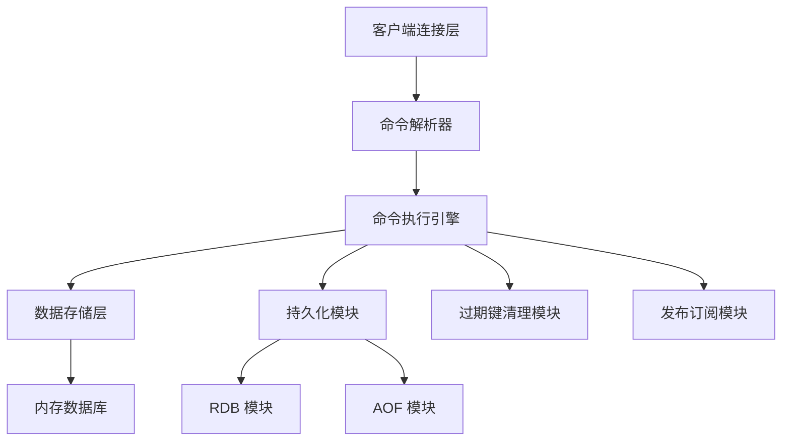

# 一、Redis 是什么？

Redis（Remote Dictionary Server，远程字典服务）是一款**开源的高性能键值对（Key-Value）内存数据库**，由 Salvatore Sanfilippo 开发，遵循 BSD 协议。其核心特点是“数据优先存储于内存”，配合灵活的持久化策略、丰富的数据结构及高效的网络模型，成为分布式系统中不可或缺的中间件。

关键定位：并非替代MySQL等关系型数据库，而是作为“缓存+中间件”补充，解决高并发、低延迟场景的需求。

# 二、核心数据结构（5大基础+3大扩展）

Redis 区别于普通键值存储的核心优势是提供**结构化的值（Value）存储**，支持多种场景的精准适配，以下是开发中最常用的类型：

## 1. 五大基础数据结构

|数据结构|核心特性|典型命令|
|---|---|---|
|**String（字符串）**|最基础类型，可存储文本、数字（整数/浮点数），支持原子操作|SET、GET、INCR（自增）、APPEND（追加）|
|**Hash（哈希）**|键值对的集合（类似Java的Map），适合存储对象（如用户信息）|HSET、HGET、HMGET（批量获取）、HDEL|
|**List（列表）**|有序字符串集合，基于双向链表实现，支持两端操作（先进先出/后进先出）|LPUSH（左插）、RPOP（右删）、LRANGE（范围获取）|
|**Set（集合）**|无序字符串集合，自动去重，支持交集、并集等集合运算|SADD、SMEMBERS（获取所有）、SINTER（交集）、SUNION（并集）|
|**Sorted Set（有序集合）**|带“分数（score）”的Set，按分数排序，支持范围查询|ZADD（指定分数添加）、ZRANK（获取排名）、ZRANGE（按分数范围获取）|
## 2. 三大常用扩展结构

- **Bitmap（位图）**：基于String实现，按位存储数据（0/1），适合存储布尔型数据（如用户签到、在线状态），空间效率极高（1字节=8位，1000万用户仅需1.2MB）。核心命令：SETBIT、GETBIT、BITCOUNT。

- **Geo（地理信息）**：存储经纬度坐标，支持距离计算、范围筛选（如“附近的商家”）。核心命令：GEOADD、GEODIST（计算距离）、GEORADIUS（范围查询）。

- **HyperLogLog（基数统计）**：用于统计集合的“基数”（不重复元素个数），占用空间固定（约12KB），适合海量数据去重统计（如UV统计），存在0.81%左右误差。核心命令：PFADD、PFCOUNT、PFMERGE。

# 三、核心应用场景

Redis的应用场景完全围绕其“内存存储+高效结构+灵活特性”展开，以下是高频场景：

## 1. 缓存（最核心场景）

将MySQL等数据库中的热点数据（如首页商品、高频查询用户信息）缓存到Redis，减少数据库访问压力，提升响应速度。

- **缓存策略**：支持设置过期时间（EXPIRE命令），配合“缓存淘汰策略”（如LRU最近最少使用）处理内存满的情况。

- **注意点**：需解决“缓存穿透”（缓存和数据库都无数据，用布隆过滤器拦截）、“缓存击穿”（热点key过期，加互斥锁）、“缓存雪崩”（大量key同时过期，过期时间加随机值）问题。

## 2. 分布式锁

基于Redis的SETNX（仅当key不存在时设置）命令实现分布式锁，解决多服务实例并发修改共享资源的问题（如秒杀库存扣减）。

优化方案：设置过期时间防止死锁，结合Lua脚本实现“加锁+过期时间”原子操作，或使用Redlock算法提升可靠性。

## 3. 计数器与排行榜

- **计数器**：String的INCR命令支持原子自增，适合秒杀库存计数、接口限流、文章阅读量统计等场景（避免并发下的计数不准）。

- **排行榜**：Sorted Set的分数排序特性，适合实现“游戏积分榜”“商品销量榜”等，支持实时更新排名。

## 4. 消息队列

基于List的LPUSH（生产者发消息）+ RPOP（消费者取消息）实现简单消息队列，支持“先进先出”；或用Pub/Sub（发布订阅）模式实现广播消息（如系统通知）。

注意：Redis消息队列无持久化保障（需开启AOF），复杂场景建议用RabbitMQ/Kafka，但轻量场景足够高效。

## 5. 其他场景

- 会话存储：存储用户登录会话（如Session共享），替代传统的服务器本地存储，支持分布式部署。

- 地理信息服务：基于Geo实现“附近的人”“同城配送”等功能。

- 基数统计：基于HyperLogLog实现亿级UV统计，节省内存。

# 四、效率优势分析

Redis的“高性能”并非单一因素导致，而是多层面优化的结果，核心体现在“快”和“稳”：

## 1. 极致速度：单机QPS可达10万+

- **内存存储**：数据优先存于内存，避免磁盘I/O的高延迟（内存读写速度约100ns，磁盘约10ms，相差10万倍）。

- **单线程模型**：采用“单线程+IO多路复用”模型，避免多线程上下文切换和锁竞争的开销（Redis操作均为内存操作，单线程足够支撑高并发）。

- **高效编码**：底层采用精简的SDS（简单动态字符串）、双向链表等数据结构，减少内存碎片，提升操作效率。

## 2. 可靠性保障

虽然是内存数据库，但通过持久化机制避免数据丢失：

- **RDB（快照）**：定时将内存数据快照写入磁盘，适合备份恢复，恢复速度快但可能丢失快照后的数据。

- **AOF（追加日志）**：记录每一条写命令到日志文件，恢复时重放命令，数据安全性更高（可配置“每写必刷盘”），但日志文件较大，恢复速度慢。

# 五、关键对比（Redis vs 其他组件）

明确Redis与其他数据库/中间件的差异，避免误用场景：

## 1. Redis vs MySQL（关系型数据库）

|维度|Redis|MySQL|
|---|---|---|
|存储类型|键值对，非结构化/半结构化|关系型，结构化（表结构）|
|存储介质|内存为主，支持持久化到磁盘|磁盘为主，内存为缓存|
|并发能力|高（单机10万+ QPS），适合读多写少|中（单机万级 QPS），需分库分表提升并发|
|核心场景|缓存、计数器、分布式锁|核心业务数据存储（如订单、用户信息）|
## 2. Redis vs Memcached（传统内存缓存）

|维度|Redis|Memcached|
|---|---|---|
|数据结构|支持String、Hash等多种结构|仅支持String类型|
|持久化|支持RDB/AOF持久化|无持久化，重启数据丢失|
|分布式支持|原生支持主从、集群（Redis Cluster）|需依赖客户端实现分布式哈希|
|原子操作|支持INCR、ZADD等原子命令|仅支持简单的增删改查，无复杂原子操作|
## 3. Redis vs RabbitMQ（消息队列）

|维度|Redis（消息队列）|RabbitMQ|
|---|---|---|
|功能完整性|轻量，仅支持基础队列/发布订阅|完善，支持死信队列、延迟队列等高级特性|
|可靠性|需依赖AOF保障，消息可能丢失|支持消息确认、持久化，可靠性更高|
|适用场景|轻量、低延迟的简单消息场景|复杂业务的消息流转（如订单状态同步）|
# 六、核心总结

Redis的核心价值在于“**用内存速度解决高并发问题，用结构化存储适配多样场景**”：

- 优势：高性能（10万+ QPS）、丰富数据结构、灵活持久化、分布式支持。

- 局限：内存成本高（不适合存海量数据）、复杂事务支持弱（无MySQL的ACID完整特性）。

- 最佳实践：作为“缓存+中间件”与MySQL等数据库配合使用，而非替代关系型数据库。
> （注：文档部分内容可能由 AI 生成）

# 七、架构与实现原理

## 单机架构

单机 Redis 是一个单进程单线程的程序，核心组件包括客户端连接层、命令解析器、命令执行引擎、数据存储层、持久化模块、过期键清理模块和发布订阅模块。

客户端连接层负责处理 TCP 连接，支持多种客户端协议（RESP 协议），提供连接池管理。命令解析器将客户端发送的命令解析为 Redis 可执行的指令。命令执行引擎是核心单线程模块，负责执行所有命令，保证原子性。

数据存储层是内存中的键值对数据库，采用哈希表（Dict）作为核心存储结构，支持动态扩容/缩容。持久化模块包含 RDB 和 AOF 两个子模块，负责内存数据的磁盘持久化。过期键清理模块采用惰性删除 + 定期删除的策略，清理过期的键值对，释放内存。发布订阅模块实现 Pub/Sub 模式，支持消息的发布与订阅。

## 分布式架构

为了解决单机的性能瓶颈和单点故障问题，Redis 提供了三种分布式方案：

| 架构方案 | 核心原理 | 适用场景 |
|----------|----------|----------|
| 主从复制 | 一台主节点（Master）写数据，多台从节点（Slave）同步主节点数据并提供读服务 | 读写分离、提升读并发 |
| 哨兵（Sentinel） | 监控主从节点的健康状态，主节点故障时自动将从节点提升为主节点 | 高可用、自动故障转移 |
| 集群（Cluster） | 采用哈希槽（Hash Slot）分片，将 16384 个槽分配到不同节点，每个节点负责部分槽的读写 | 海量数据存储、水平扩展 |

## 数据存储

Redis 的核心存储结构是字典（Dict），类似于 Go 语言中的 `map[string]interface{}`，由两个哈希表组成：

- 主哈希表：用于正常读写数据
- 备用哈希表：用于哈希表扩容/缩容时的数据迁移

当哈希表的负载因子（used / size）超过阈值（默认 1）时，会触发扩容；当负载因子低于阈值（默认 0.1）时，会触发缩容。扩容/缩容过程是渐进式的，每次处理一个桶（bucket）的数据，避免阻塞主线程。

不同数据结构有各自的底层实现：

- List：小数据量时用压缩列表（ziplist），大数据量时用双向链表（linkedlist）
- Hash：小数据量时用 ziplist，大数据量时用 Dict
- Sorted Set：小数据量时用 ziplist，大数据量时用跳表（skiplist）+ Dict

## 单线程与多路 I/O 复用

Redis 的单线程指的是命令执行线程是单线程的，而持久化、异步删除等操作是通过后台线程（BIO）完成的，不会阻塞主线程。

多路 I/O 复用的核心是：一个线程监听多个 TCP 连接的事件（如可读、可写），当某个连接有事件发生时，才会进行对应的读写操作。Redis 会根据操作系统选择最优的 I/O 复用模型：

- Linux：epoll
- macOS/FreeBSD：kqueue
- Windows：select

## RDB 持久化

- 原理：在指定时间间隔内，将内存中的数据快照（Snapshot）写入磁盘，生成 `.rdb` 文件
- 触发方式：手动触发（`SAVE`/`BGSAVE`）、自动触发（配置文件中的 `save` 规则）
- 优缺点：文件体积小、恢复速度快；但可能丢失最后一次快照后的修改数据

## AOF 持久化

- 原理：将所有写命令以协议格式追加到 `.aof` 文件中，重启时通过重放命令恢复数据
- 触发方式：支持三种同步策略 `always`（每次写都同步）、`everysec`（每秒同步，默认）、`no`（由操作系统决定）
- 优缺点：数据一致性更高（默认每秒同步，最多丢失 1 秒数据）；但文件体积大，恢复速度比 RDB 慢

## 过期键清理

Redis 中键可以设置过期时间，过期键的清理采用惰性删除 + 定期删除的混合策略：

- 惰性删除：当客户端访问某个键时，检查该键是否过期，若过期则删除并返回 `nil`
- 定期删除：Redis 每隔 100ms 随机抽取一定数量的键（默认 20 个），检查是否过期，若过期则删除；如果过期键比例超过 25%，则继续抽取

## Redis Cluster 哈希槽分片

Redis Cluster 采用哈希槽（Hash Slot）机制进行分片，将 16384 个槽分配到不同节点，槽分配算法为 `CRC16(key) % 16384`。