## 一、什么是分布式缓存？

分布式缓存是一种将缓存数据分散存储在多个节点上的缓存架构，通过网络将多台缓存服务器组织成一个逻辑整体，对外提供统一的缓存服务。与单机缓存相比，分布式缓存具有更高的可用性、可扩展性和容量上限。

### 核心特点

| 特性 | 单机缓存 | 分布式缓存 |
|------|----------|------------|
| 容量 | 受单机内存限制 | 可水平扩展，容量近乎无限 |
| 可用性 | 单点故障导致服务不可用 | 多节点冗余，高可用 |
| 一致性 | 天然一致 | 需要解决数据一致性问题 |
| 网络开销 | 无 | 存在网络通信开销 |
| 复杂度 | 简单 | 需要处理分布式问题 |

### 架构演进

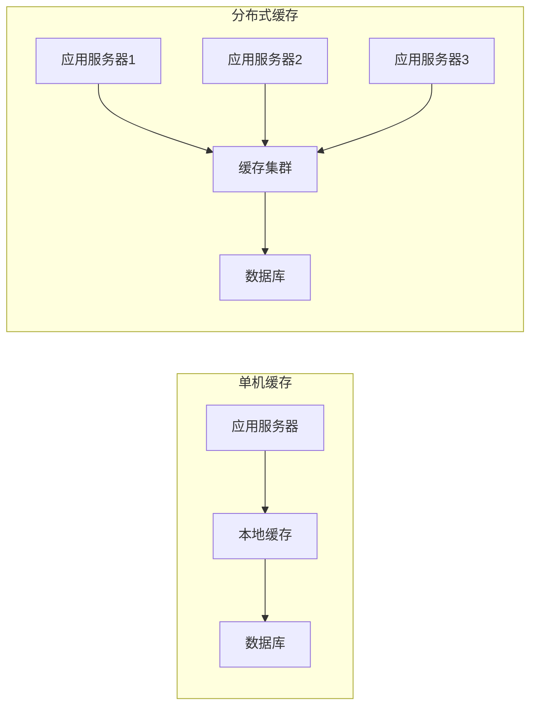

## 二、分布式缓存实现方案

### 2.1 主流技术选型

| 方案 | 特点 | 适用场景 |
|------|------|----------|
| Redis Cluster | 官方集群方案，自动分片，高可用 | 大规模生产环境 |
| Redis Sentinel | 主从复制+哨兵监控，自动故障转移 | 中小规模高可用场景 |
| Memcached | 简单高效，多线程 | 简单KV缓存，无持久化需求 |
| Hazelcast | 内嵌式分布式缓存，支持近缓存 | Java应用，需要近缓存 |

### 2.2 Redis Cluster 架构

Redis Cluster 采用无中心架构，数据自动分片到 16384 个槽（slot），每个节点负责一部分槽。

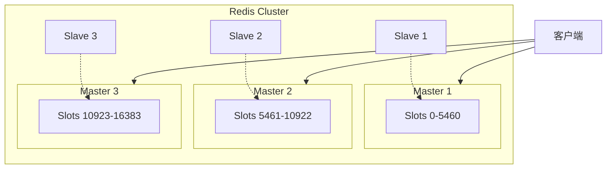

**数据分片算法：**
```
slot = CRC16(key) % 16384
```

### 2.3 Redis Sentinel 架构

Sentinel 模式通过哨兵节点监控主从状态，实现自动故障转移。

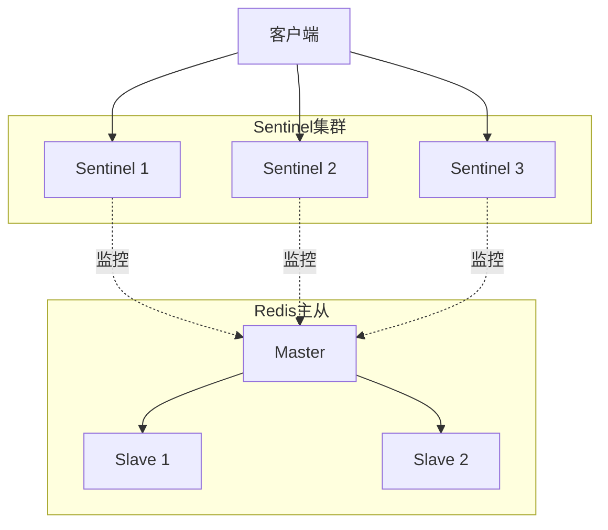

**故障转移流程：**

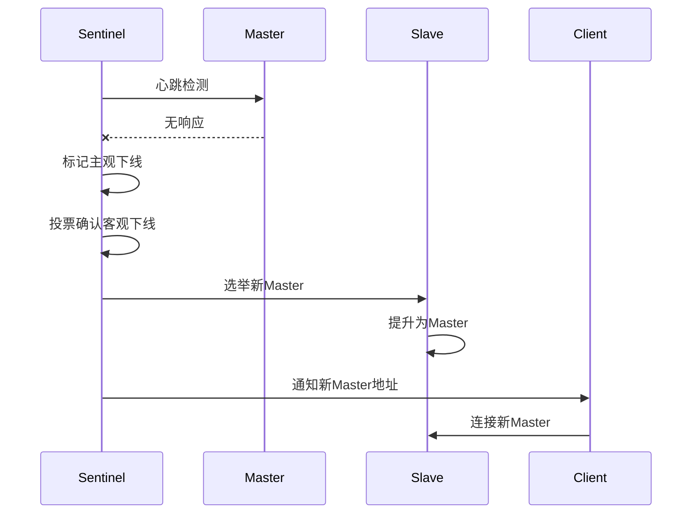

### 2.4 一致性哈希

一致性哈希解决了传统哈希在节点增减时大量数据迁移的问题。

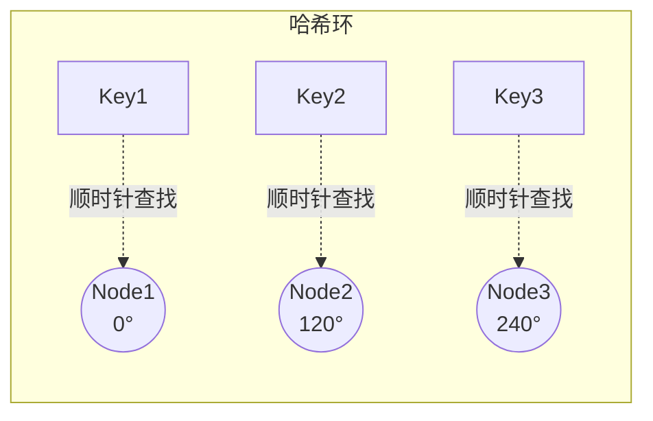

**虚拟节点机制：** 为解决数据分布不均问题，每个物理节点映射多个虚拟节点到哈希环上。

## 三、常见问题与解决方案

### 3.1 缓存穿透

**问题描述：** 查询不存在的数据，请求直接打到数据库。

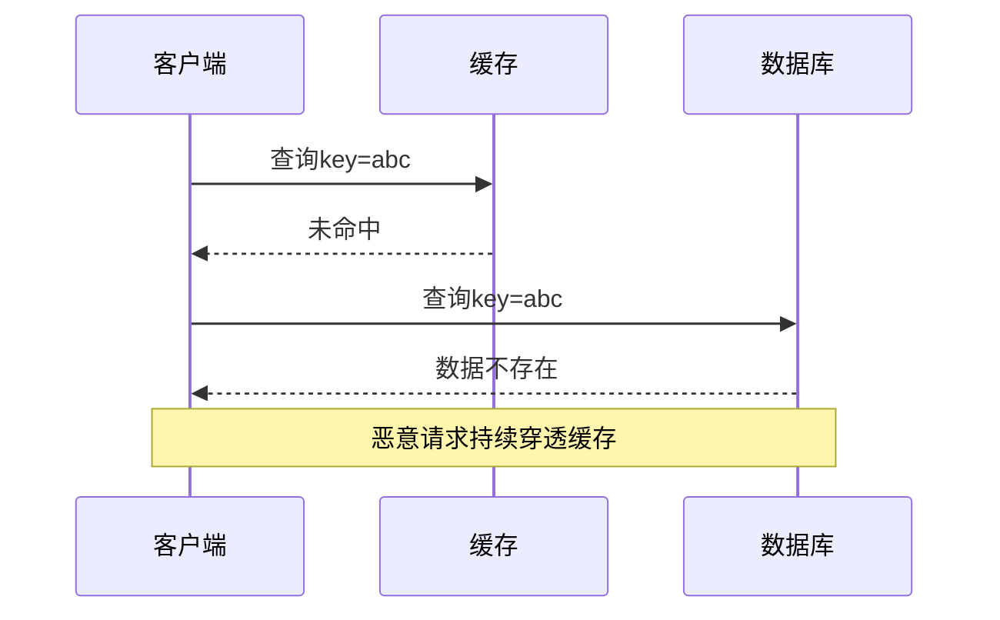

**解决方案：**

| 方案 | 原理 | 优缺点 |
|------|------|--------|
| 缓存空值 | 将不存在的key缓存为空值 | 简单；但占用内存，需设置较短过期时间 |
| 布隆过滤器 | 请求前先经过布隆过滤器判断key是否存在 | 高效；存在误判率，不支持删除 |
| 参数校验 | 对请求参数做基础校验 | 简单有效；无法防止合法但不存在的查询 |

**布隆过滤器方案：**

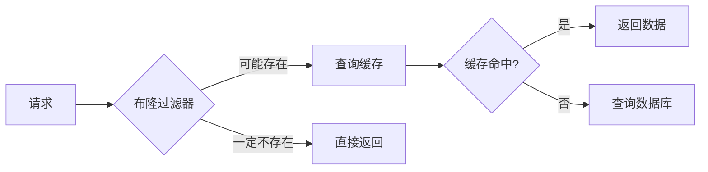

### 3.2 缓存击穿

**问题描述：** 热点key过期瞬间，大量请求同时打到数据库。

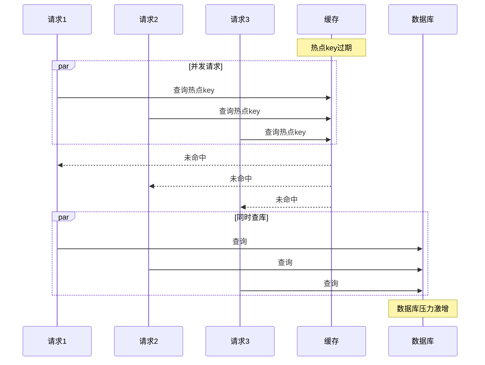

**解决方案：**

| 方案 | 原理 | 适用场景 |
|------|------|----------|
| 互斥锁 | 只允许一个请求重建缓存 | 数据一致性要求高 |
| 逻辑过期 | 不设置TTL，由业务判断是否过期并异步更新 | 允许短暂数据不一致 |
| 热点数据永不过期 | 对热点数据不设置过期时间 | 数据更新频率低 |

**互斥锁方案流程：**

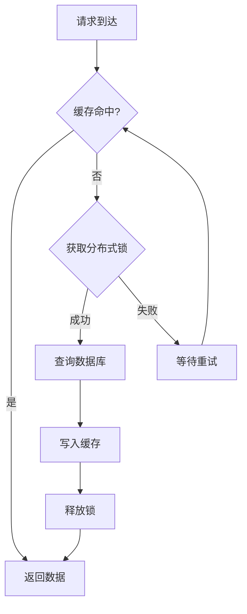

### 3.3 缓存雪崩

**问题描述：** 大量缓存key同时过期或缓存服务宕机，请求全部打到数据库。

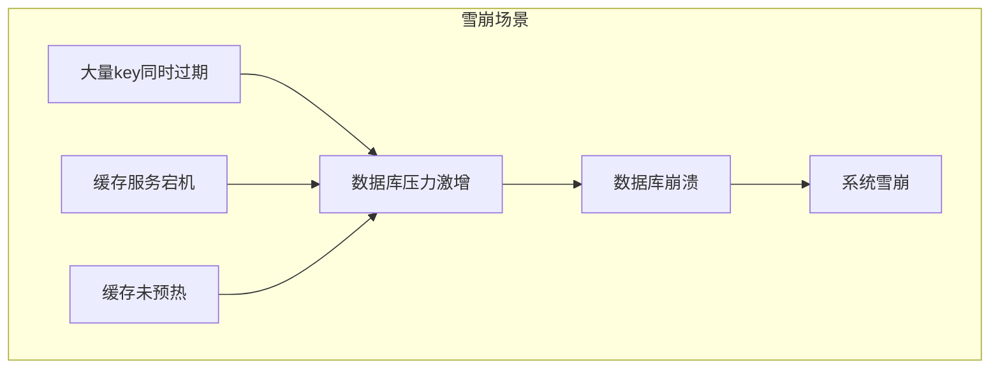

**解决方案：**

| 方案 | 描述 |
|------|------|
| 过期时间随机化 | 在基础过期时间上增加随机值，避免同时过期 |
| 多级缓存 | 本地缓存 + 分布式缓存，降低对单一缓存的依赖 |
| 缓存预热 | 系统启动时预先加载热点数据 |
| 熔断降级 | 数据库压力过大时触发熔断，返回默认值或错误 |
| 集群高可用 | 使用Redis Cluster或Sentinel保障缓存服务可用性 |

**多级缓存架构：**

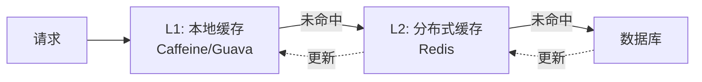

### 3.4 缓存与数据库一致性

**问题描述：** 更新数据时，缓存与数据库可能出现不一致。

**常见策略对比：**

| 策略 | 流程 | 一致性 | 问题 |
|------|------|--------|------|
| 先更新DB，再删缓存 | DB更新 -> 删除缓存 | 最终一致 | 删缓存失败导致不一致 |
| 先删缓存，再更新DB | 删除缓存 -> DB更新 | 较差 | 并发时可能读到旧数据 |
| 延迟双删 | 删缓存 -> 更新DB -> 延迟再删缓存 | 较好 | 延迟时间难以确定 |
| 订阅binlog | 监听DB变更，异步更新缓存 | 最终一致 | 实现复杂，有延迟 |

**Cache Aside Pattern（推荐）：**

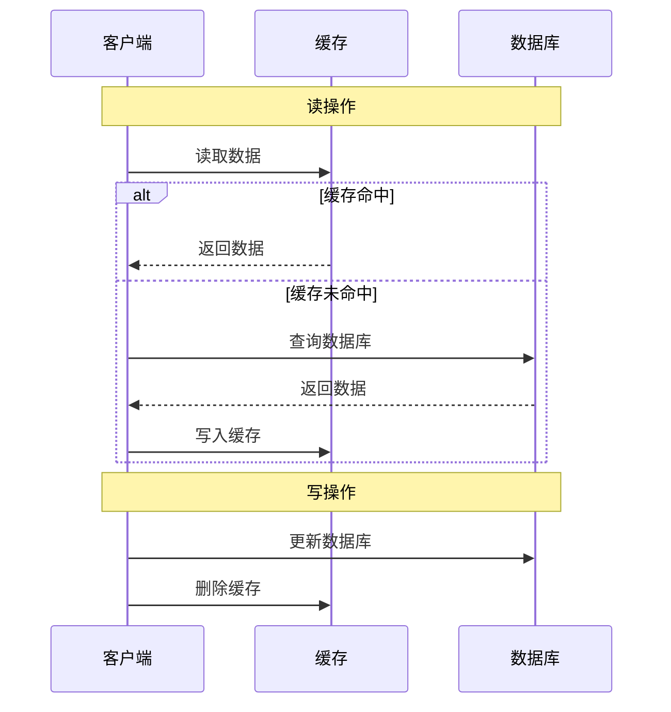

**延迟双删方案：**

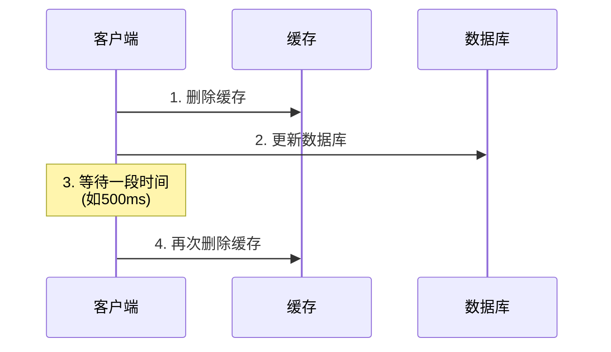

### 3.5 热点Key问题

**问题描述：** 某个key访问频率极高，单节点压力过大。

**解决方案：**

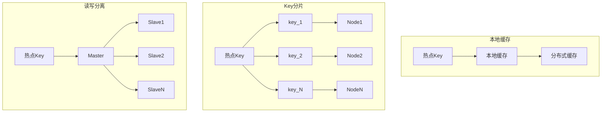

| 方案 | 描述 |
|------|------|
| 本地缓存 | 在应用层增加本地缓存（如Caffeine），减少对Redis的请求 |
| Key分片 | 将热点key拆分为多个子key（如key_1, key_2），分散到不同节点 |
| 读写分离 | 通过主从架构，读请求分散到多个从节点 |

## 四、最佳实践

### 4.1 缓存设计原则

1. **合理设置过期时间**：根据数据更新频率设置TTL，避免缓存过久导致数据不一致
2. **缓存预热**：系统启动时预加载热点数据，避免冷启动问题
3. **监控告警**：监控缓存命中率、内存使用、连接数等关键指标
4. **容量规划**：预估数据量和QPS，合理规划集群规模

### 4.2 Key设计规范

```
业务前缀:模块:数据类型:业务标识
```

示例：
- `user:profile:info:10001` - 用户信息
- `order:detail:hash:202401010001` - 订单详情
- `product:stock:string:SKU123` - 商品库存

### 4.3 缓存更新策略选择

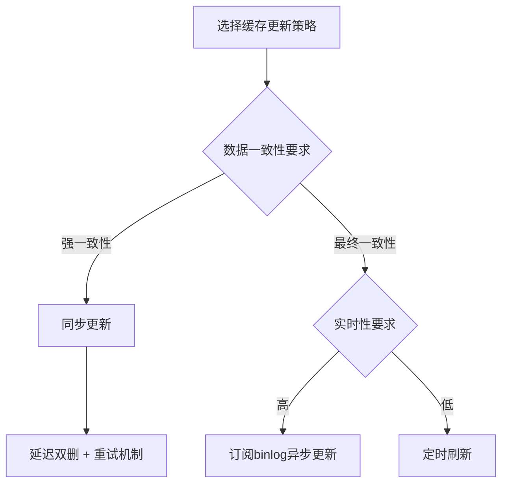

## 五、总结

分布式缓存是构建高并发系统的核心组件，需要根据业务场景选择合适的技术方案：

| 场景 | 推荐方案 |
|------|----------|
| 中小规模，需要高可用 | Redis Sentinel |
| 大规模，需要水平扩展 | Redis Cluster |
| 极致性能，简单KV | Memcached |
| Java应用，需要近缓存 | Redis + Caffeine |

关键要点：
- 理解缓存穿透、击穿、雪崩的原因和解决方案
- 根据业务选择合适的缓存一致性策略
- 做好监控和容量规划
- 使用多级缓存架构提升整体可用性

> （注：文档部分内容可能由 AI 生成）
