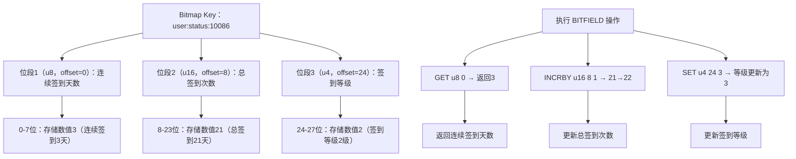
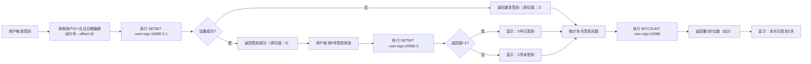
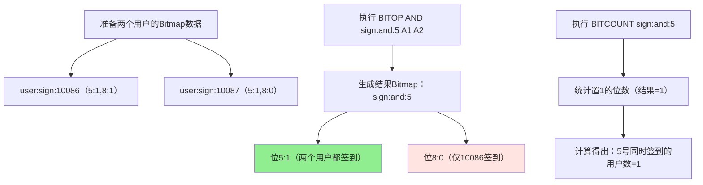

Bitmap 是 Redis 中一种基于 String 类型实现的位操作功能，通过位操作实现高效的布尔型数据存储和计算。

## 核心原理

Bitmap 并不是 Redis 单独新增的一种数据类型，而是基于 String 类型实现的一种位操作功能。

String 类型在 Redis 中最大能存储 512MB 的数据，对应可以操作的位数是 `512MB * 1024 * 1024 * 8 = 2^32` 位（约42.9亿位）。

Bitmap 把 String 中的每个字节拆分成 8 个二进制位，每个 bit 只能是 0 或 1，通过对这些位的设置、获取、统计来实现高效的数据存储和计算。

核心优势包括：
- `极致的空间效率`：存储海量布尔型数据时，比普通的字符串/哈希表节省百倍以上空间
- `高效的位运算`：支持按位与/或/异或等操作

下面通过示意图展示 Bitmap 基于 String 字节拆分的核心原理：

```mermaid
graph TD
    A["Redis String (键：user:sign:10086)"] --> B["字节0 (0-7位)"]
    A --> C["字节1 (8-15位)"]
    A --> D["字节2 (16-23位)"]
    
    B --> B1["位0:0 (1号未签到)"]
    B --> B2["位1:0 (2号未签到)"]
    B --> B3["位2:0 (3号未签到)"]
    B --> B4["位3:0 (4号未签到)"]
    B --> B5["位4:0 (5号未签到)"]
    B --> B6["位5:1 (5号签到)"]
    B --> B7["位6:0 (6号未签到)"]
    B --> B8["位7:0 (7号未签到)"]
    
    C --> C1["位8:1 (8号签到)"]
    C --> C2["位9:0 (9号未签到)"]
    C --> C3["位10:0 (10号未签到)"]
    C --> C4["位11:0 (11号未签到)"]
    C --> C5["位12:0 (12号未签到)"]
    C --> C6["位13:0 (13号未签到)"]
    C --> C7["位14:0 (14号未签到)"]
    C --> C8["位15:0 (15号未签到)"]
    
    D --> D1["位16:0 (16号未签到)"]
    D --> D2["位17:0 (17号未签到)"]
    D --> D3["位18:0 (18号未签到)"]
    D --> D4["位19:0 (19号未签到)"]
    D --> D5["位20:0 (20号未签到)"]
    D --> D6["位21:0 (21号未签到)"]
    D --> D7["位22:0 (22号未签到)"]
    D --> D8["位23:0 (23号未签到)"]
    
    style B6 fill:#90EE90
    style C1 fill:#90EE90
```



---

## 基础命令

Bitmap 提供了丰富的命令来操作位数据，以下是常用的基础命令：

### 设置位值

SETBIT 命令用于给指定 key 的第 offset 位设置值（0 或 1），offset 从 0 开始计数。

示例：记录用户签到（用户ID=10086，日期偏移=5 代表5号签到）

```bash
# 给 key=user:sign:10086 的第5位设置为1（表示5号签到）
127.0.0.1:6379> SETBIT user:sign:10086 5 1
(integer) 0  # 返回该位原来的值（首次设置为0）

# 给第8位设置为1（8号签到）
127.0.0.1:6379> SETBIT user:sign:10086 8 1
(integer) 0
```

### 获取位值

GETBIT 命令用于获取指定 key 第 offset 位的值。

示例：查询用户10086是否5号签到

```bash
127.0.0.1:6379> GETBIT user:sign:10086 5
(integer) 1  # 1代表签到，0代表未签到

127.0.0.1:6379> GETBIT user:sign:10086 6
(integer) 0  # 6号未签到
```

### 统计置1的位数

BITCOUNT 命令用于统计指定 key 中值为 1 的位的数量，start/end 按字节（不是位）范围筛选。

示例：统计用户10086的签到天数

```bash
127.0.0.1:6379> BITCOUNT user:sign:10086
(integer) 2  # 共签到2天
```

### 位运算

BITOP 命令用于对多个 key 执行位运算（AND/OR/XOR/NOT），结果存入 destkey。

示例：统计某天（比如第5位）同时签到的用户数

```bash
# 先设置用户10087的签到记录（5号签到，8号未签）
127.0.0.1:6379> SETBIT user:sign:10087 5 1
(integer) 0
127.0.0.1:6379> SETBIT user:sign:10087 8 0
(integer) 0

# 对两个用户的签到记录做AND运算，结果存入sign:and:5
127.0.0.1:6379> BITOP AND sign:and:5 user:sign:10086 user:sign:10087
(integer) 2  # 结果字符串的字节数

# 统计结果中1的位数（即5号同时签到的用户数）
127.0.0.1:6379> BITCOUNT sign:and:5
(integer) 1  # 只有第5位是1，代表1个用户同时签到
```

### 查找第一个非0/非1位

BITPOS 命令用于在指定 key 中，从 start（字节）到 end（字节）范围内，查找第一个值为 bit（0 或 1）的位的位置。

场景：比如找用户第一次签到的日期、第一次未签到的日期。

示例：

```bash
# 找用户10086第一个签到（值为1）的位
127.0.0.1:6379> BITPOS user:sign:10086 1
(integer) 5  # 第5位是第一个1，即5号首次签到

# 找用户10086第一个未签到（值为0）的位（从第5位之后开始找）
127.0.0.1:6379> BITPOS user:sign:10086 0 1  # start=1（字节），对应第8位开始
(integer) 6  # 第6位是第一个0，即6号未签到
```

---

## 位域操作

BITFIELD 是 Redis 3.2+ 新增的最强大的进阶命令，支持多位数段操作、原子操作、溢出控制，弥补了传统位操作只能按单比特处理的不足。

### 核心子命令

- `GET type offset`：获取指定类型和偏移的位域值
- `SET type offset value`：设置指定类型和偏移的位域值
- `INCRBY type offset increment`：原子递增位域值
- `OVERFLOW [WRAP|SAT|FAIL]`：设置溢出策略（循环/饱和/失败）

### 使用示例

用 BITFIELD 同时管理用户的多个状态（比如签到次数、连续签到天数）

```bash
# 对key=user:status:10086执行多个位域操作：
# 1. 用8位无符号整数（u8），偏移0，设置连续签到天数为3；
# 2. 用16位无符号整数（u16），偏移8，设置总签到次数为20；
# 3. 对总签到次数（u16，偏移8）原子+1
127.0.0.1:6379> BITFIELD user:status:10086 SET u8 0 3 SET u16 8 20 INCRBY u16 8 1
1) (nil)  # SET操作无返回（首次设置）
2) (nil)
3) (integer) 21  # INCRBY后的值为21

# 获取连续签到天数（u8，偏移0）
127.0.0.1:6379> BITFIELD user:status:10086 GET u8 0
1) (integer) 3
```

下面通过示意图展示 BITFIELD 如何在同一个 String 中划分不同位段存储多维度数据：



---

## 核心特性

### 惰性分配内存

Bitmap 基于 String 实现，Redis 会惰性分配内存：只有当你设置的 offset 超过当前字符串长度对应的位数时，才会扩展字符串并分配内存，且扩展时按字节对齐（比如设置第 10 位，会分配 2 字节=16 位）。

示例：首次设置第 100 位时，Redis 会分配 13 字节（100/8=12.5，向上取整为13），而非直接分配 100 位对应的内存。

### 过期时间支持

Bitmap 本质是 String，因此可以给 Bitmap 的 key 设置过期时间（EXPIRE 命令），适合临时场景（比如仅统计近30天的签到数据）。

示例：

```bash
# 给用户10086的签到记录设置30天过期
127.0.0.1:6379> EXPIRE user:sign:10086 2592000
(integer) 1  # 2592000秒=30天
```

### 集群环境下的注意事项

位运算（BITOP）要求所有参与运算的 key 都在 Redis 集群的同一个槽位（slot），否则会报错。

解决方案：给相关 key 加相同的哈希标签（比如 user:sign:\{10086\}、user:sign:\{10086\}:extra），强制落在同一槽位。

---

## 应用场景

Bitmap 适合海量布尔型数据的存储和统计场景，以下是典型的应用场景：

### 用户行为标记

签到、是否浏览过商品、是否点击过广告等（用 offset 代表日期/商品ID/广告ID）。

下面通过流程图展示单用户签到与统计的完整流程：



### 海量用户状态统计

比如统计连续7天签到的用户数、某活动参与用户的交集/并集，用位运算高效实现。

下面通过流程图展示多用户签到交集统计（BITOP 应用）的流程：



### 布隆过滤器

基于 Bitmap 实现，用于快速判断一个元素是否存在（比如缓存穿透防护）。

### 在线状态统计

用 offset 代表用户ID，1 代表在线，0 代表离线，BITCOUNT 可快速统计在线人数。

### 用户画像标签

用不同的位段存储用户标签（比如 0-7 位存性别、8-15 位存年龄段、16-23 位存兴趣），通过 BITFIELD 快速读写，相比 Hash 更节省空间。

### 限流/计数

用 BITFIELD 的 INCRBY 实现原子计数（比如单用户单日接口调用次数），结合溢出策略（如 OVERFLOW SAT 饱和计数，达到上限后不再增加）。

### 时间序列数据

按时间分桶存储状态（比如每分钟记录一次设备是否在线），通过 BITPOS 快速定位设备离线的时间点。

---

## 性能优化

### 拆分大 Bitmap

如果一个 key 的 Bitmap 位数超过 1 亿，建议按维度拆分（比如按月份拆分用户签到 key：user:sign:10086:202601、user:sign:10086:202602），避免单 key 过大导致位运算/统计变慢。

### 批量操作

用 BITFIELD 替代多次 SETBIT/GETBIT，减少网络往返次数（比如一次 BITFIELD 可同时设置/获取多个位域）。

### offset 合理规划

offset 不要设置过大（比如超过 2^32），否则会占用大量连续内存，影响性能。

Bitmap 是按字节分配内存的，即使只设置第 1000 位，Redis 也会分配 125 字节（1000/8）的空间，合理规划 offset 范围可减少内存浪费。

### 位运算性能优化

位运算的性能与参与运算的 key 的大小相关，避免对超大 Bitmap 做频繁的位运算。

---

## 使用建议

Redis Bitmap 是基于 String 类型的位操作功能，核心是通过 0/1 位存储布尔型数据，空间效率极高。

核心命令包括 SETBIT（设值）、GETBIT（取值）、BITCOUNT（统计）、BITOP（位运算）、BITPOS（定位）、BITFIELD（多位数段操作），满足存储和计算需求。

进阶命令方面，BITPOS 可快速定位目标位，BITFIELD 支持多位数段操作，是 Bitmap 从单比特到多比特的核心扩展。

特性上，Bitmap 支持过期时间，但集群下位运算需保证 key 在同一槽位，且大 Bitmap 建议拆分以优化性能。

应用场景可扩展到用户行为标记、用户状态统计、布隆过滤器、在线状态统计、用户画像、限流、时间序列数据等，相比基础场景更贴近实际生产需求。
