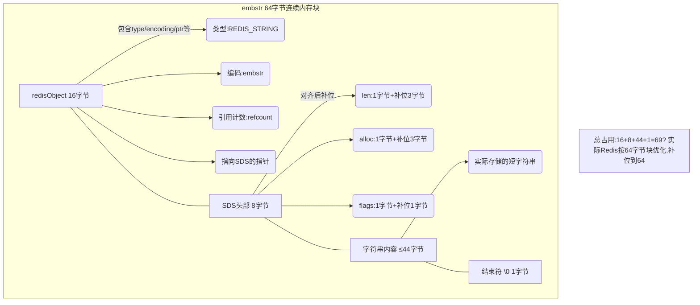
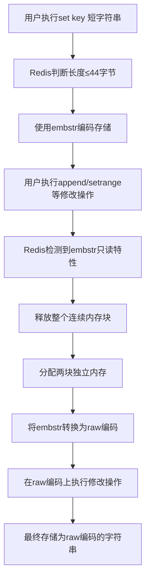
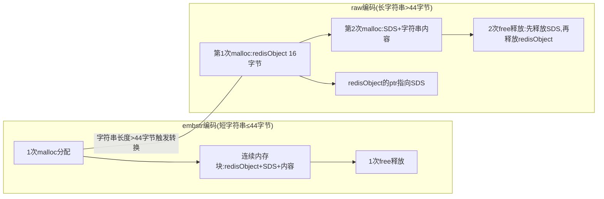

## 核心定义

embstr 是 Redis 专门为**短字符串**设计的一种内存优化编码方式，全称为 `Embedded String`（嵌入式字符串）。它是 Redis 字符串对象（`REDIS_STRING`）的两种底层编码之一，另一种是 `raw` 编码。

embstr 编码的核心特征是将字符串对象的元数据（如类型、编码、引用计数等）和字符串的实际内容存储在**同一块连续的内存空间**中。相比之下，`raw` 编码则会将元数据和字符串内容分别存储在**两块不同的内存**中。



---

## 编码特点

### 内存分配与释放效率

embstr 编码在内存管理方面具有显著优势。创建 embstr 编码的字符串时，Redis 只需调用**一次内存分配函数**（如 `malloc`），就能同时分配元数据和字符串内容的空间。而 raw 编码需要调用两次分配操作。同理，销毁 embstr 字符串时只需**一次内存释放**，raw 编码则需要两次释放。

这种设计减少了系统调用次数，降低了内存管理开销，提升了整体性能。

### 内存布局紧凑性

连续的内存布局带来了两个显著优势：减少了内存碎片化问题，同时能够更好地利用 CPU 缓存。由于数据存储在连续内存中，缓存行命中的概率更高，数据访问效率得到显著提升。

### 长度限制规则

Redis 中默认规定：**字符串长度 ≤ 44 字节** 时使用 embstr 编码，超过 44 字节则自动转为 raw 编码。这个阈值的设计考虑了内存对齐和性能优化的平衡。

### 只读特性

embstr 编码的字符串具有只读特性。如果对 embstr 字符串执行修改操作（如 `append`、`setrange`），Redis 会先将其编码转为 raw，再执行修改操作。这个机制保证了 embstr 编码的内存布局稳定性。

#### 连续内存的刚性限制

embstr 将 `RedisObject`（元信息）和 `SDS`（字符串内容）分配在同一块连续内存中，整块内存的大小是固定的。如果修改字符串长度超过原内存块大小，就必须执行以下操作：
- 释放整个连续内存块；
- 重新分配一块新的连续内存块（包含新的 RedisObject + 新的 SDS）；
- 将原内容拷贝到新内存块，再执行修改。

这个过程相当于"推倒重来"，效率极低。因此，Redis 设计为：**只要对 embstr 编码的字符串执行修改操作，直接将其转为 raw 编码**，不再复用 embstr 的内存结构。

#### 设计定位的权衡

embstr 的核心设计目标是节省内存（连续内存减少碎片），而非支持修改。Redis 预判短字符串（≤44字节）大多是静态的（如配置值、状态标识），所以选择牺牲修改灵活性换取内存效率。这种设计在内存使用率和访问速度上实现极致优化，但不适合需要频繁修改的场景。



---

## 与 raw 编码对比

| 特性                | embstr 编码                | raw 编码                  |
|---------------------|----------------------------|---------------------------|
| 内存分配次数        | `1 次`                     | `2 次`                    |
| 内存布局            | 连续内存（元数据+内容）    | 非连续内存（分开存储）    |
| 适用字符串长度      | `≤ 44 字节`（默认）        | `> 44 字节`               |
| 修改操作            | 先转 raw 再修改            | 直接修改                  |
| 内存碎片            | 少                         | 多                        |



---

## 长度阈值解析

### 直观计算与实际差异

从纯字段相加的角度计算，embstr 可存储的字符串长度理论值应为 38 字节。计算方式如下：Redis 为 embstr 分配 64 字节内存块，减去 redisObject（16 字节）、SDS 头部（9 字节）和结束符（1 字节），剩余 38 字节。但实际 Redis 使用了 44 字节作为阈值，核心原因是**内存对齐**。

### 内存对齐机制

现代操作系统和 CPU 为了提升内存访问效率，要求数据的存储地址必须是其对齐基数的整数倍。在 64 位系统中，默认对齐基数是 8 字节。

SDS 结构体的实际内存占用会受到对齐规则影响。理论上 SDS 头部占用 3 字节（len + alloc + flags），但为了满足 8 字节对齐要求，Redis 会给 SDS 头部**补 5 字节**，最终 SDS 头部占用 **8 字节**。

### 44 字节推导过程

embstr 编码的字符串会一次性分配 **64 字节** 的连续内存块，分配规则如下：

| 内存块部分          | 占用字节 | 说明                     |
|---------------------|----------|--------------------------|
| redisObject 结构体  | 16       | 固定（8×2，符合对齐）    |
| SDS 头部（对齐后）  | 8        | 原本3字节，补5字节对齐   |
| 字符串内容 + 结束符 | 40       | 64 - 16 - 8 = 40         |

考虑 Redis 源码中的安全预留和版本差异，最终将 embstr 的阈值定为 **44 字节**。这个数值平衡了内存利用率和访问效率，是 Redis 底层优化的典型体现。

---

## 实操验证

可以通过 `object encoding` 命令查看字符串的编码类型，验证不同长度字符串的编码转换规则。

### 短字符串验证

```bash
127.0.0.1:6379> set name "redis-embstr-intro"
OK
127.0.0.1:6379> object encoding name
"embstr"
```

### 长字符串验证

```bash
127.0.0.1:6379> set long_str "this-is-a-very-long-string-more-than-44-bytes-1234567890"
OK
127.0.0.1:6379> object encoding long_str
"raw"
```

### 修改操作触发编码转换

```bash
127.0.0.1:6379> append name "_modified"
(integer) 21
127.0.0.1:6379> object encoding name
"raw"
```

### 边界值测试

```bash
# 44 字节字符串 → embstr
127.0.0.1:6379> set str "12345678901234567890123456789012345678901234"
OK
127.0.0.1:6379> object encoding str
"embstr"

# 45 字节字符串 → raw
127.0.0.1:6379> set str "123456789012345678901234567890123456789012345"
OK
127.0.0.1:6379> object encoding str
"raw"
```

---

## 应用价值

embstr 编码的设计为 Redis 的短字符串处理带来了显著优势：

### 内存优化

对短字符串（如用户 ID、小标签、状态值等）实现极致的内存使用优化，有效减少内存碎片化问题，提升内存利用率。

### 性能提升

连续内存布局提升了短字符串的访问速度，CPU 缓存命中率更高，数据读取效率显著提升。

### 系统开销降低

减少内存分配和释放的系统调用次数，降低 CPU 开销，提升 Redis 整体性能表现，特别是在高并发场景下效果更为明显。

---

## 总结

embstr 编码是 Redis 针对**短字符串（≤44字节）** 的专用优化编码方案，其核心特点包括：

1. 将元数据和字符串内容存储在连续内存中，减少内存分配和释放次数；
2. 相比 raw 编码，降低内存碎片，提升访问效率；
3. embstr 字符串具有只读特性，修改时会先转为 raw 编码，长字符串默认使用 raw 编码；
4. 44 字节的阈值设计综合考虑了内存对齐、安全预留和性能平衡。

这种编码方式充分体现了 Redis 在底层优化方面的设计理念，是提升 Redis 整体性能的重要技术手段之一。
