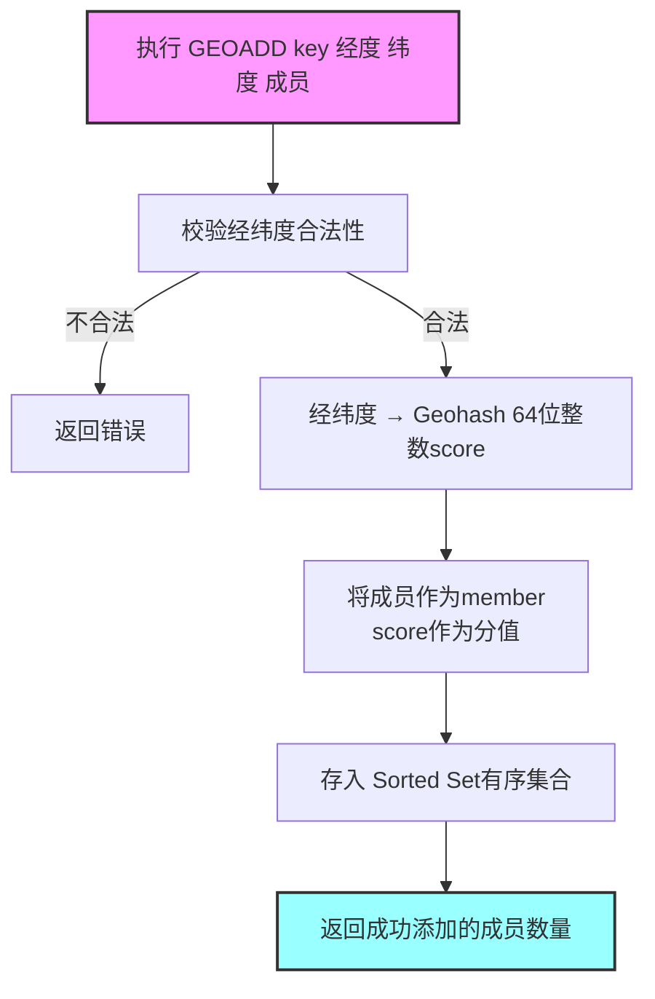
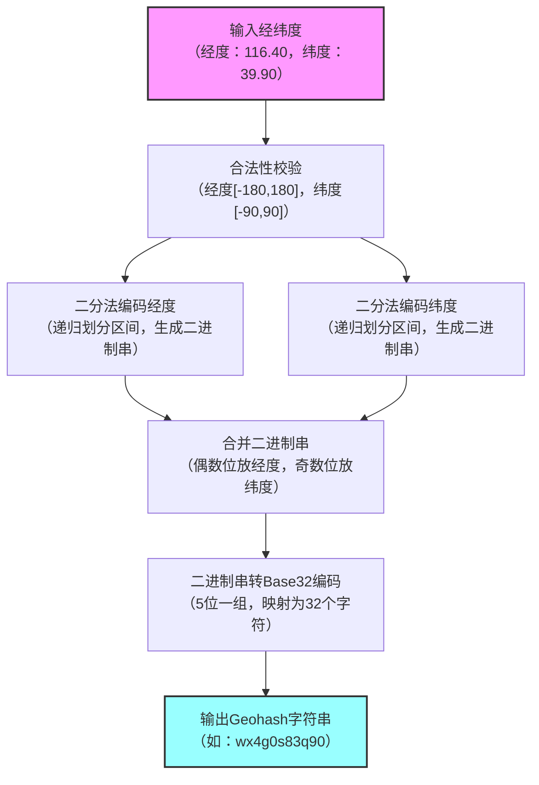
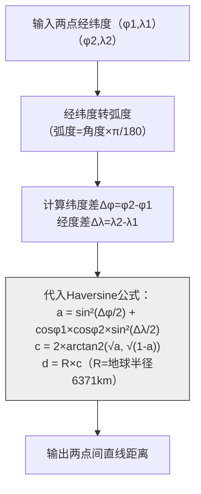
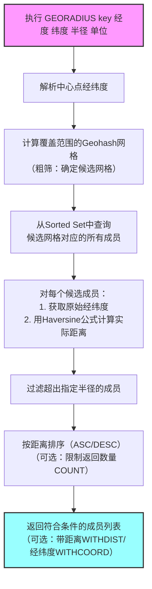

## 核心概念

Redis GEO 是 Redis 专门用于处理地理位置相关数据的功能，它并非全新的底层数据结构，而是基于 **Sorted Set（有序集合）** 实现的地理位置功能，通过将经纬度编码成有序集合的 `score`（使用 Geohash 算法），实现地理位置的存储、距离计算、范围查找等操作。

### 核心特性

- 支持存储经纬度坐标，并关联一个唯一的成员（如商家ID、用户ID）
- 支持计算两个位置之间的距离
- 支持根据指定位置查找指定范围内的其他位置（附近的人/商家）
- 底层依赖有序集合，因此能复用有序集合的部分命令（如 `ZREM` 删除位置）

---

## 核心命令

Redis GEO 提供了六个核心命令，用于地理位置的存储、查询和计算。

### GEOADD 添加地理位置

将一个或多个经纬度-成员对添加到指定的 GEO 键中。

**语法**：`GEOADD key 经度 纬度 成员 [经度 纬度 成员 ...]`

**示例**：
```redis
# 添加3个商家的位置：美团总部、饿了么总部、京东物流总部
GEOADD restaurant:location 116.39748 39.90882 "meituan" 121.47370 31.23042 "eleme" 116.60680 39.91758 "jdlogistics"
```

**返回值**：成功添加的成员数量（整数）

### GEOPOS 获取成员经纬度

根据成员名称查询其对应的经纬度坐标。

**语法**：`GEOPOS key 成员 [成员 ...]`

**示例**：
```redis
# 查询美团和饿了么的经纬度
GEOPOS restaurant:location "meituan" "eleme"
```

**返回值**：数组形式，每个元素对应一个成员的经纬度 `[经度, 纬度]`，不存在的成员返回 nil

### GEODIST 计算距离

计算两个地理位置之间的直线距离，支持指定单位。

**语法**：`GEODIST key 成员1 成员2 [单位]`

**单位可选**：`m`（米，默认）、`km`（千米）、`mi`（英里）、`ft`（英尺）

**示例**：
```redis
# 计算美团和京东物流总部之间的距离（单位：千米）
GEODIST restaurant:location "meituan" "jdlogistics" km
```

**返回值**：距离数值（浮点数），如 `9.2345`

### GEORADIUS 根据经纬度范围查找

以指定经纬度为中心，查找指定半径范围内的所有成员。

**语法**：`GEORADIUS key 经度 纬度 半径 单位 [WITHCOORD] [WITHDIST] [ASC|DESC] [COUNT 数量]`

**参数说明**：
- `WITHCOORD`：返回成员的经纬度
- `WITHDIST`：返回成员与中心的距离
- `ASC|DESC`：按距离升序/降序排列
- `COUNT`：限制返回的成员数量

**示例**：
```redis
# 以美团总部（116.39748, 39.90882）为中心，查找10千米内的商家，返回距离和经纬度，最多2个
GEORADIUS restaurant:location 116.39748 39.90882 10 km WITHDIST WITHCOORD COUNT 2 ASC
```

**返回值**：数组形式，每个元素包含成员名、距离、经纬度

### GEORADIUSBYMEMBER 根据成员范围查找

以指定成员的位置为中心，查找指定半径范围内的所有成员（是 `GEORADIUS` 的简化版）。

**语法**：`GEORADIUSBYMEMBER key 成员 半径 单位 [WITHCOORD] [WITHDIST] [ASC|DESC] [COUNT 数量]`

**示例**：
```redis
# 以美团总部为中心，查找10千米内的商家
GEORADIUSBYMEMBER restaurant:location "meituan" 10 km WITHDIST ASC
```

### GEOHASH 获取 Geohash 编码

返回成员对应的 Geohash 字符串。

**语法**：`GEOHASH key 成员 [成员 ...]`

**示例**：
```redis
GEOHASH restaurant:location "meituan"
```

**返回值**：Geohash 字符串，如 `wx4g0s83q90`



---

## Geohash 算法原理

Geohash 是一种将二维的经纬度坐标编码成一维字符串的算法，是 Redis GEO 实现地理位置功能的核心。

### 核心思想

- 地球是一个三维球体，Geohash 先将其简化为二维平面，再把这个平面递归划分成一个个矩形网格
- 每个网格对应一个唯一的字符串编码，编码越长，网格越小，位置精度越高
- 两个位置的 Geohash 编码前缀越相似，说明它们的地理位置越近（这是 Redis 实现范围查找的关键）

### 编码过程

以北京某点（经度 116.40，纬度 39.90）为例，编码步骤如下：

**步骤1**：将经纬度归一化到 [-180, 180]（经度）、[-90, 90]（纬度）区间
- 经度：116.40 ∈ [-180, 180]
- 纬度：39.90 ∈ [-90, 90]

**步骤2**：二分法编码（以纬度为例）

| 区间         | 中点  | 39.90 落在左/右 | 编码位 | 新区间       |
|--------------|-------|----------------|--------|--------------|
| [-90, 90]    | 0     | 右（>0）       | 1      | [0, 90]      |
| [0, 90]      | 45    | 左（&lt;45）      | 0      | [0, 45]      |
| [0, 45]      | 22.5  | 右（>22.5）    | 1      | [22.5, 45]   |
| [22.5, 45]   | 33.75 | 右（>33.75）   | 1      | [33.75, 45]  |
| [33.75, 45]  | 39.375| 右（>39.375）  | 1      | [39.375, 45] |

最终纬度会得到一串二进制数（如 `10111...`），经度同理得到另一串二进制数（如 `11010...`）

**步骤3**：合并经纬度二进制串
- 规则：偶数位放经度，奇数位放纬度
- 示例：经度二进制 `11010`，纬度二进制 `10111`，合并后得到 `1 1 1 0 0 1 1 1 0 1`

**步骤4**：将二进制串转成 Base32 编码
- Base32 编码表：0-9 + a-z（去掉 a,i,l,o），共32个字符，对应 5 位二进制数
- 把合并后的二进制串按 5 位一组拆分，每组转成一个 Base32 字符，最终得到 Geohash 字符串（如北京的 `wx4g0s83q90`）

### Geohash 关键特性

| 特性         | 说明                                                                 |
|--------------|----------------------------------------------------------------------|
| 降维         | 二维经纬度 → 一维字符串，便于存储和比较                             |
| 精度可控     | 编码长度越长，精度越高（1位≈5000km，10位≈1.5m）                     |
| 邻近性       | 编码前缀相同 → 位置相近（注意：相邻网格可能编码前缀不同，需特殊处理） |



---

## Redis GEO 实现机制

Redis 并没有直接存储 Geohash 字符串作为有序集合的 score，而是将 Geohash 编码转换成 64位浮点数（score）存储在 Sorted Set 中。

### GEOADD 存储位置

执行 `GEOADD key 经度 纬度 成员` 时，Redis 会：
1. 对传入的经纬度做合法性校验（经度 [-180,180]，纬度 [-90,90]）
2. 将经纬度通过 Geohash 算法编码成 64 位的整数（作为有序集合的 `score`）
3. 将成员作为有序集合的 `member`，`64位整数` 作为 `score`，存入指定的 key 中

### GEODIST 计算距离

Redis 计算距离并不是直接用 Geohash 编码，而是用经典的地理公式：**Haversine 公式**（计算球面上两点间的最短距离，即大圆距离）

**公式简化版**：
$$a = \sin^2(\Delta\phi/2) + \cos\phi_1 \cdot \cos\phi_2 \cdot \sin^2(\Delta\lambda/2)$$
$$c = 2 \cdot \arctan2(\sqrt\{a\}, \sqrt\{1-a\})$$
$$d = R \cdot c$$

其中：
- $\phi$ 是纬度（转弧度），$\lambda$ 是经度（转弧度）
- $\Delta\phi$ 是纬度差，$\Delta\lambda$ 是经度差
- $R$ 是地球半径（约6371km）
- $d$ 是最终距离

**执行流程**：
1. 通过 `GEOPOS` 获取两个成员的原始经纬度
2. 将经纬度转成弧度，代入 Haversine 公式计算
3. 根据指定单位（m/km/mi/ft）转换结果并返回



### GEORADIUS 范围查找

`GEORADIUS` 和 `GEORADIUSBYMEMBER` 是 Redis GEO 最核心的范围查找功能，实现逻辑分两步：

**步骤1**：Geohash 快速筛选（粗筛）
- 以目标中心点（经纬度/指定成员的位置）为核心，计算出覆盖指定半径范围的所有 Geohash 网格（如半径10km，可能覆盖8个相邻的 Geohash 网格）
- 从有序集合中快速找出这些网格对应的所有成员（利用有序集合的范围查询特性，因为 Geohash 编码的 score 是有序的）

**步骤2**：Haversine 公式精准过滤（精筛）
- 粗筛会得到候选成员列表（可能包含少量超出范围的成员）
- 对每个候选成员，用 Haversine 公式计算其与中心点的实际距离
- 过滤掉距离超过指定半径的成员，最终返回符合条件的结果

### GEOPOS/GEOHASH 查询原始数据

- `GEOPOS`：从有序集合中取出成员对应的 score，反向解码成经纬度并返回
- `GEOHASH`：将 score 反向解码成 Geohash 字符串并返回



---

## 实际应用场景

### 附近的人/商家

外卖APP的附近商家、社交APP的附近的人功能，通过 `GEORADIUS` 或 `GEORADIUSBYMEMBER` 快速查找指定范围内的目标

### 地理位置围栏

物流系统监控车辆是否超出指定区域，通过定期检查车辆位置与围栏范围的关系实现

### 距离计算

打车APP计算用户到司机的距离，通过 `GEODIST` 命令快速获取两点间的直线距离

---

## 注意事项

1. **直线距离计算**：Redis GEO 仅支持二维平面的直线距离计算，不考虑实际道路、地形等因素
2. **有序集合特性**：底层是有序集合，因此可以用 `ZREM key 成员` 删除指定地理位置，用 `ZCARD key` 统计成员数量
3. **精度建议**：Geohash 编码的精度有限，经纬度的精度建议保留 6 位小数（误差约 10 厘米）
4. **版本要求**：Redis 3.2 及以上版本才支持 GEO 功能

---

## 总结

Redis GEO 基于有序集合实现，核心是通过 Geohash 编码经纬度，支持地理位置的存储和计算。核心命令包括 `GEOADD`（添加）、`GEODIST`（计算距离）、`GEORADIUS/GEORADIUSBYMEMBER`（范围查找），主要用于附近的人/商家、距离计算等地理位置相关场景，需注意其仅计算直线距离的特性。

Geohash 是将二维经纬度编码成一维字符串的算法，核心是网格划分 + 二进制编码 + Base32 转换，前缀越相似的编码位置越近。Redis GEO 的 `GEODIST` 用 Haversine 公式计算球面距离，而非 Geohash；`GEORADIUS/GEORADIUSBYMEMBER` 先通过 Geohash 粗筛候选成员，再用 Haversine 公式精筛，兼顾性能和准确性。
