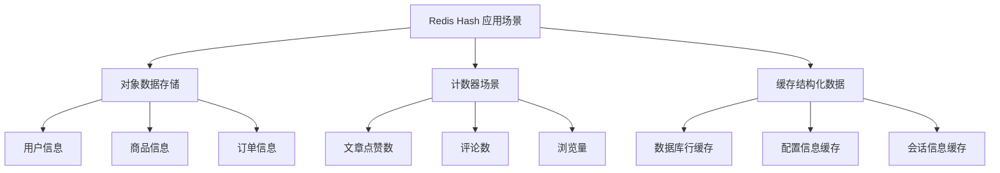
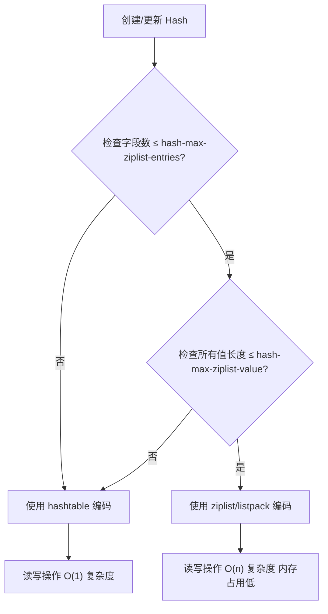
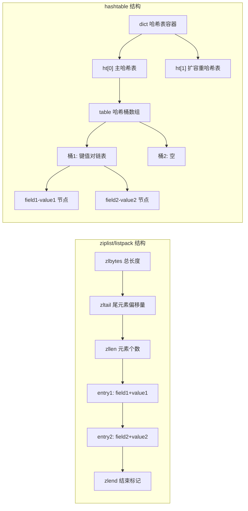
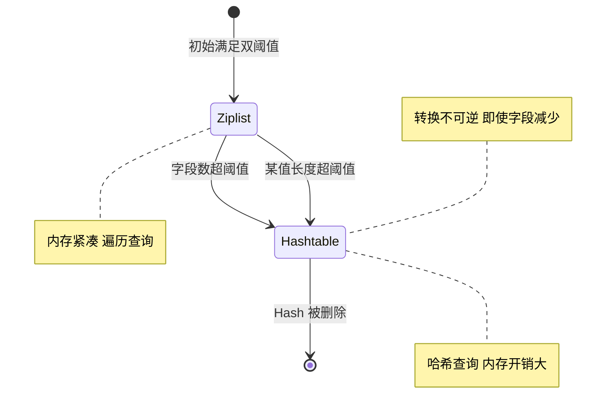

## 基础概念

Redis 的 Hash 类型可以理解为**一个键（Key）对应一个键值对集合**，就像你有一个"用户信息"的大抽屉（Key），里面又放了很多小格子，每个格子有自己的标签（Field）和内容（Value），比如：
- 大抽屉 Key：`user:1001`
- 小格子：`name` → `张三`、`age` → `25`、`city` → `北京`

这种结构非常适合存储**对象类数据**，相比把整个对象序列化成字符串存储，Hash 可以精准操作对象的某个属性，不用读取/修改整个对象，效率更高。

### 核心特性

1. **结构**：每个 Hash 由 `Key`（外层键） + `Field`（字段） + `Value`（字段值）组成，**Field 和 Value 都是字符串类型**（Redis 5.0+ 也支持二进制安全）。
2. **容量**：单个 Hash 最多支持 `2^32 - 1` 个字段（约42亿），但实际使用中建议控制在万级以内，避免单个 Hash 过大影响性能。
3. **存储优化**：Redis 对小 Hash（字段少、值小）会采用**紧凑存储（ziplist）**，占用内存极少；当 Hash 变大后会自动转为**哈希表（hashtable）**，保证读写效率。

---

## 核心命令

以下是最常用的 Hash 操作命令，附带示例，你可以直接在 Redis 客户端执行测试：

| 命令                | 作用                                  | 示例                                      |
|---------------------|---------------------------------------|-------------------------------------------|
| `HSET`              | 设置单个/多个 Field-Value             | `HSET user:1001 name 张三 age 25`         |
| `HGET`              | 获取单个 Field 的值                   | `HGET user:1001 name` → 输出 "张三"       |
| `HMGET`             | 获取多个 Field 的值                   | `HMGET user:1001 name age` → ["张三","25"]|
| `HGETALL`           | 获取 Hash 中所有 Field-Value          | `HGETALL user:1001` → ["name","张三","age","25"] |
| `HDEL`              | 删除指定 Field                        | `HDEL user:1001 city`                     |
| `HEXISTS`           | 判断 Field 是否存在                   | `HEXISTS user:1001 age` → 1（存在）/0（不存在） |
| `HLEN`              | 获取 Hash 中 Field 的数量             | `HLEN user:1001` → 2（name、age两个字段） |
| `HINCRBY`           | 对数字类型的 Field 做自增/自减        | `HINCRBY user:1001 age 1` → 26（age从25变成26） |
| `HKEYS`             | 获取所有 Field 名称                   | `HKEYS user:1001` → ["name","age"]        |
| `HVALS`             | 获取所有 Value 值                     | `HVALS user:1001` → ["张三","26"]         |

### Python 代码示例

先确保安装了 redis 库：
```bash
pip install redis
```

然后编写操作代码：
```python
import redis

r = redis.Redis(host='localhost', port=6379, db=0, decode_responses=True)

r.hset("user:1001", mapping={"name": "张三", "age": "25", "city": "北京"})

name = r.hget("user:1001", "name")
print("用户名：", name)

age, city = r.hmget("user:1001", "age", "city")
print("年龄：", age, "城市：", city)

r.hincrby("user:1001", "age", 1)
print("自增后年龄：", r.hget("user:1001", "age"))

all_info = r.hgetall("user:1001")
print("所有信息：", all_info)

r.hdel("user:1001", "city")
print("删除city后所有字段：", r.hkeys("user:1001"))
```

### 使用场景

1. **存储对象数据**：用户信息、商品信息、订单信息等（如 `product:10086` 存储商品的名称、价格、库存）。
2. **计数器场景**：比如统计文章的点赞数、评论数（`article:888` 的 `like` 字段自增）。
3. **缓存结构化数据**：替代关系型数据库的单行记录，减少数据库查询压力。



---

## 底层原理

Redis Hash 在什么条件下会使用 `ziplist`（压缩列表）存储，又在什么条件下转为 `hashtable`（哈希表），这完全由两个核心配置参数控制。

| 配置参数                | 默认值 | 含义                                                                 |
|-------------------------|--------|----------------------------------------------------------------------|
| `hash-max-ziplist-entries` | 512    | Hash 中**字段（Field）的数量**不超过这个值，是使用 ziplist 的前提之一 |
| `hash-max-ziplist-value`   | 64     | Hash 中**每个字段值（Value）的字节长度**不超过这个值，是另一前提     |

只有**同时满足** ziplist 的条件时才会使用紧凑存储，只要有一个条件不满足，就会自动转为 hashtable，且转换是**单向的**（一旦转为 hashtable，即使后续删除字段让 Hash 变小，也不会再转回 ziplist）。




### 两种存储方式对比

Redis 这么设计的核心是**平衡内存占用和读写效率**。

**ziplist 的特点**：
- 优点：是连续的内存块，没有哈希表的额外开销（比如哈希桶、指针），内存占用极少（比 hashtable 省 50%+ 内存）；
- 缺点：查找/修改字段时需要遍历整个列表，字段越多、值越长，效率越低（时间复杂度 O(n)）。

**hashtable 的特点**：
- 优点：基于哈希表结构，查找/修改字段的时间复杂度是 O(1)，即使字段很多，读写效率也很高；
- 缺点：需要额外存储哈希桶、指针等元数据，内存占用比 ziplist 高。



---

## 实践验证

### 编码类型验证

你可以通过 Redis 命令查看某个 Hash 的存储编码类型，验证上述规则：

```bash
# 1. 先创建一个小 Hash（满足 ziplist 条件）
127.0.0.1:6379> HSET user:1001 name "张三" age "25" city "北京"
(integer) 3

# 2. 查看编码类型（ziplist 会显示为 ziplist，Redis 7.0+ 后显示为 listpack）
127.0.0.1:6379> OBJECT ENCODING user:1001
"ziplist"

# 3. 插入一个超长值（超过 64 字节），触发转 hashtable
127.0.0.1:6379> HSET user:1001 desc "这是一段超过64字节的超长描述，用于测试Redis Hash的编码转换，1234567890123456789012345678901234567890123456789012345678901234567890"
(integer) 1

# 4. 再次查看编码，已转为 hashtable
127.0.0.1:6379> OBJECT ENCODING user:1001
"hashtable"
```

### 编码转换逻辑



### 配置调整建议

1. 如果你存储的都是**小对象**（比如用户基本信息、商品简单属性），默认的 `512/64` 配置足够用，无需修改；
2. 如果你需要存储的 Hash 字段数略多（比如 1000 个以内）但值都很短，可以适当调大 `hash-max-ziplist-entries`（比如改为 1024），继续享受 ziplist 的内存优势；
3. 如果你存储的 Hash 有长值（比如超过 64 字节的文本），不用纠结配置，Redis 会自动转 hashtable，保证效率。