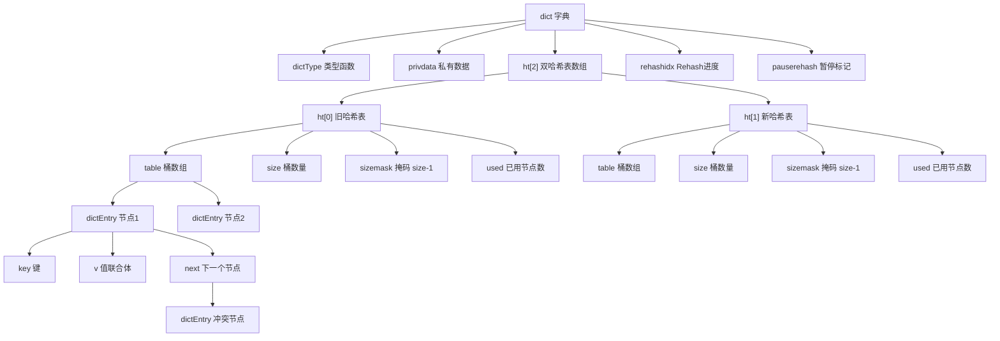
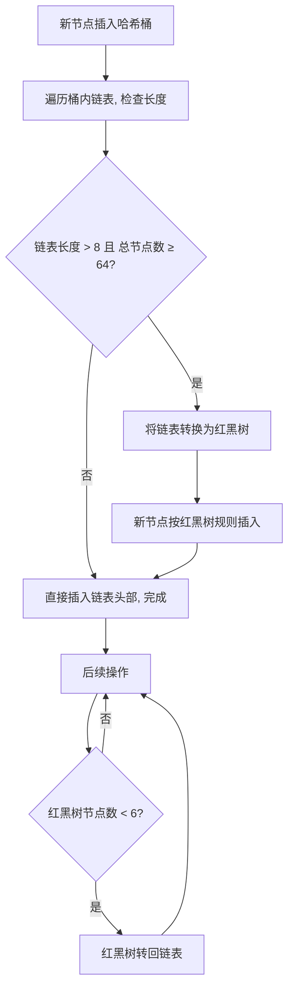
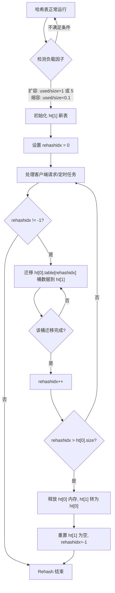
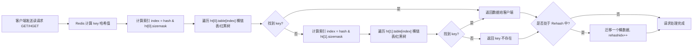
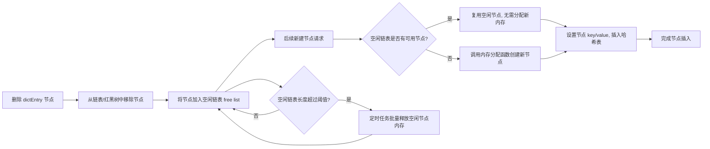

## 基本概念

Redis 中的 hashtable（也常被称为字典 `dict`）是一种用于存储键值对的数据结构，它不仅是 Redis 对外提供的 `HASH` 数据类型的底层实现之一，也是 Redis 数据库本身（存储所有 key-value）的核心底层结构。

简单来说，Redis 的 hashtable 就像一个"抽屉柜"：每个"抽屉"（哈希桶）通过哈希函数计算 key 的哈希值来定位；当多个 key 哈希到同一个抽屉时，会用**链表**（Redis 7.0+ 引入了渐进式扩容的红黑树优化）解决哈希冲突；支持动态扩容/缩容，保证查询、插入、删除的效率。



## 核心结构

Redis 的 hashtable 由以下几个关键部分组成：

```c
// 哈希表节点
typedef struct dictEntry {
    void *key;                // 键
    union {                   // 值（支持多种类型）
        void *val;
        uint64_t u64;
        int64_t s64;
        double d;
    } v;
    struct dictEntry *next;   // 解决哈希冲突的链表指针
} dictEntry;

// 哈希表
typedef struct dictht {
    dictEntry **table;        // 哈希桶数组（存储节点指针）
    unsigned long size;       // 哈希桶数组的大小（2的幂次）
    unsigned long sizemask;   // 掩码，用于计算索引（size-1）
    unsigned long used;       // 已使用的节点数量
} dictht;

// 字典（对外的 hashtable 结构）
typedef struct dict {
    dictType *type;           // 类型特定函数（处理不同类型的key/val）
    void *privdata;           // 私有数据
    dictht ht[2];             // 两个哈希表，用于渐进式扩容
    long rehashidx;           // 重哈希进度（-1 表示未扩容）
    int16_t pauserehash;      // 是否暂停扩容
} dict;
```

## 哈希计算与索引定位

Redis 计算 key 的哈希值后，通过 `sizemask`（`size-1`）取模得到桶的索引，公式：

`index = hash(key) & sizemask`

因为 `size` 是 2 的幂次，`sizemask` 二进制全为 1，取模效率远高于普通取模运算。

### 哈希函数的选择

Redis 对哈希函数的设计是高性能的关键，且不同场景有不同选择：

- **普通 key**：使用 `SipHash`（Redis 5.0+ 默认），抗哈希碰撞攻击（早期用 MurmurHash，易被构造恶意 key 导致哈希冲突，链表过长拖慢性能）
- **整数 key**（如 `123`、`456`）：做了特殊优化，直接返回整数本身作为哈希值，省去哈希计算开销

计算出原始哈希值后，Redis 会对其做一次"扰动"处理（混合高低位），避免某些哈希函数分布不均导致的桶分布失衡。

---

## 哈希冲突解决

Redis 采用**链地址法**解决冲突：当多个 key 哈希到同一个桶时，这些 key 对应的 `dictEntry` 会组成一个单向链表；查找时先定位到桶，再遍历链表匹配 key。

### Redis 7.0+ 链表转红黑树优化

Redis 7.0+ 引入了 **dict ht inline table** 优化，解决了极端场景下的性能退化问题：

**触发条件**：当单个桶的链表长度超过阈值（默认8），且哈希表总节点数 ≥ 64 时，该链表会自动转为**红黑树**

**反向触发**：当红黑树节点数少于阈值（默认6）时，会转回链表（红黑树的维护开销高于短链表）

**优化效果**：查询、删除、插入的时间复杂度从 O(n) 降为 O(log n)，大幅提升大冲突链表的操作效率

**注意点**：该优化仅针对 Redis 底层的 dict 结构（数据库全局 key 表），**对外的 Hash 类型（HSET/HGET）暂未启用**（Hash 类型优先用 ziplist/hashtable，冲突概率低）



---

## 渐进式扩容

当哈希表的负载因子（`used / size`）超过阈值（默认1）时，Redis 会触发扩容：扩容规则为，新表大小为大于当前 `used*2` 的最小 2 的幂次。

核心特点是**不一次性完成 rehash**，而是分多次、在处理客户端请求的间隙逐步将旧表（ht[0]）的数据迁移到新表（ht[1]），避免单次扩容阻塞 Redis 主线程。迁移过程中，读写操作会同时操作两个表：读先查 ht[0]，再查 ht[1]；写直接写入 ht[1]。

### 扩容的触发条件

- **扩容**：当哈希表负载因子 `used / size > 1`（默认阈值），且 Redis 没有执行 BGSAVE/BGREWRITEAOF 等后台持久化操作时，触发扩容；若有持久化操作，阈值会提升到 5，避免频繁扩容影响持久化效率
- **缩容**：当负载因子 `< 0.1` 时，触发缩容，释放闲置内存

### 渐进式 Rehash 核心流程



1. 初始化 `ht[1]`：创建新的哈希表 `ht[1]`，大小为大于 `ht[0].used * 2` 的最小 2 的幂次（比如 `ht[0].used=5`，则 `ht[1].size=8`）
2. 设置 `rehashidx=0`：标记 Rehash 开始，`rehashidx` 表示当前正在迁移 `ht[0]` 中索引为 `rehashidx` 的桶
3. 渐进式迁移：每次处理客户端请求时，顺带迁移 `ht[0]` 中 `rehashidx` 对应的桶的所有数据到 `ht[1]`，然后 `rehashidx++`
4. 迁移完成：当 `ht[0]` 所有数据迁移完毕，将 `ht[1]` 赋值给 `ht[0]`，清空 `ht[1]`，设置 `rehashidx=-1`，Rehash 结束

### 数据迁移的具体逻辑

每次 Rehash 只迁移 `ht[0]` 中 `rehashidx` 对应的一个桶，核心步骤：

1. 取出 `ht[0].table[rehashidx]` 指向的链表（所有哈希到该桶的 dictEntry）
2. 遍历链表中的每个 `dictEntry`：
   - 重新计算该 entry 的哈希值（基于 `ht[1].sizemask`），得到在 `ht[1]` 中的新索引
   - 将该 entry 插入到 `ht[1]` 对应桶的链表头部（Redis 链表插入默认头插，效率更高）
3. 将 `ht[0].table[rehashidx]` 置为 NULL，释放该桶的引用
4. `rehashidx++`，准备下次迁移下一个桶

**关键优化**：
- 迁移是"批量"的？不，默认每次只迁移 1 个桶（可通过配置调整），确保单次迁移耗时极短（微秒级），不阻塞主线程
- 若桶为空（没有 entry），直接跳过，`rehashidx++`

### Rehash 的加速机制

Redis 为了避免 Rehash 耗时过久，还设计了加速策略：

- **定时任务加速**：Redis 主线程的 `serverCron` 定时任务（每100ms执行一次），若检测到 Rehash 未完成，会**批量迁移最多100个桶**（可通过 `dict_force_resize_ratio` 配置），比单次请求迁移1个桶快得多
- **批量命令加速**：执行 `KEYS`、`SCAN`、`HMGET` 等批量命令时，处理完命令后会额外触发多次桶迁移，利用批量命令的"空闲时间"加快 Rehash
- **Rehash 暂停的恢复**：若因主线程压力大暂停了 Rehash（`pauserehash=1`），当压力降低后，定时任务会优先恢复 Rehash，避免长期停滞

---

## 读写逻辑

Rehash 过程中的读写逻辑是理解 Redis 非阻塞特性的关键。

### 读操作

读操作需要兼顾两个哈希表，保证数据不丢失：

1. 计算 key 的哈希值，先在 `ht[0]` 的对应桶中查找
2. 如果在 `ht[0]` 中找到，直接返回结果
3. 如果没找到，再到 `ht[1]` 的对应桶中查找
4. 若都没找到，返回"key 不存在"

**示例**：假设要查 `key="user:100"`，哈希后索引为 3，先查 `ht[0].table[3]` 的链表，若没有，再查 `ht[1].table[3]`。



### 写操作

写操作优先保证新数据进入新表，避免重复迁移：

- **新增/修改**：直接将数据写入 `ht[1]`（即使 `ht[0]` 中还有该 key 的旧数据，后续查询会优先查 `ht[0]`，不影响）
- **删除**：先在 `ht[0]` 中查找，找到则删除；再在 `ht[1]` 中查找，找到也删除（避免残留）

### 读请求是否触发迁移

Redis 设计渐进式 Rehash 的核心目标是**把迁移成本分摊到所有客户端请求中**，而不是只依赖写请求——如果仅靠写请求触发迁移，在只读场景下 Rehash 会迟迟无法完成，旧表 `ht[0]` 会一直占用内存，新表 `ht[1]` 也无法完全生效。

因此，Redis 会在**所有类型的客户端请求处理的收尾阶段**（执行完请求的核心逻辑后），检查是否处于 Rehash 状态，若是则执行一次桶迁移。

**关键细节**：
- 迁移操作无感知：迁移是在"返回结果之后"执行的，对客户端来说，读请求的响应时间不受迁移影响（单次迁移一个桶仅微秒级）
- 迁移是"原子小步"：无论请求类型是读是写，每次仅迁移**一个桶**（而非整个哈希表），确保主线程不会被长时间阻塞
- 特殊场景：空桶跳过：如果当前 `rehashidx` 对应的桶是空的，会直接 `rehashidx++`，不做实际迁移，进一步降低耗时

---

## 缩容机制

缩容的规则和细节更容易被忽略，但对内存优化至关重要。

### 缩容的特殊逻辑

1. **触发条件**：当哈希表负载因子（`used/size`）&lt; 0.1 时触发缩容
2. **缩容规则**：新表大小为大于等于 `used` 的最小 2 的幂次（而非扩容的 `2倍`），比如 `used=5` 则新表大小=8，`used=7` 也=8
3. **缩容的 Rehash 逻辑**：和扩容完全一致（渐进式、请求间隙迁移），但缩容**不会受持久化操作影响**（扩容时若有 BGSAVE/BGREWRITEAOF，阈值会从1提升到5，缩容无此限制）
4. **缩容的意义**：Redis 作为内存数据库，缩容能及时释放闲置的哈希桶数组内存，避免"大表小数据"的内存浪费（比如一个哈希表原本有1024个桶，仅用100个，缩容后桶数会降到128）

---

## 内存管理

### 内存复用策略

哈希表的节点（`dictEntry`）回收不是"即时"的，而是结合了 Redis 的内存管理策略：

**惰性删除**：删除 key 时，Redis 仅将 `dictEntry` 从链表/红黑树中移除，不会立即释放内存，而是将其放入"空闲链表"（free list），后续新建节点时优先复用，减少内存分配开销

**主动清理**：当空闲链表过长（超过阈值），Redis 会在定时任务中批量释放空闲节点的内存，避免内存泄漏

**Rehash 时的内存复用**：迁移节点时，`dictEntry` 会被直接复用（仅重新计算索引），而非新建，进一步降低内存分配成本

