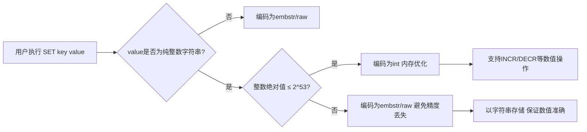
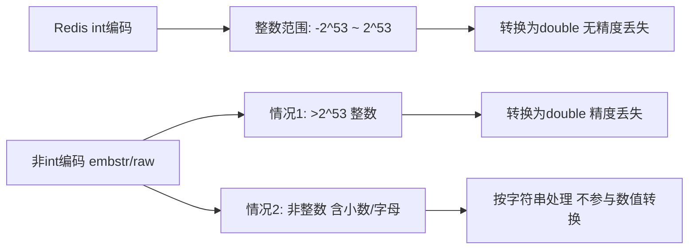
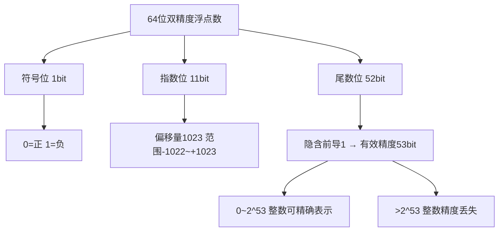

## 核心概念与适用场景

Redis 的键值对存储中，值的底层存储会根据数据类型和大小自动选择最优的编码方式。整数编码（int）是针对整数值的高效编码，主要用于优化内存占用。

Redis 中，当满足以下条件时，字符串类型的键值会使用整数编码：

- 值是`可以被解析为整数`的字符串（如 `"123"`、`"4567"`），而非真正的整数类型（Redis 本身没有单独的整数类型，整数本质上是字符串的一种特殊编码）
- 整数值的范围在 `[-2^63, 2^63-1]`（64位有符号整数）内
- 对于 Redis 5.0+ 版本，默认配置下，当整数`小于等于 2^53` 时会优先使用 int 编码（避免浮点数精度丢失问题）
- 该整数值未被修改为非整数字符串（一旦修改为 `"123abc"` 这类非纯整数字符串，编码会切换为 raw/embstr）

## 底层实现机制

### 内存优化原理

普通的短字符串（embstr 编码）至少占用 40 字节（Redis 对象头 + 字符串内容），而整数编码直接将整数值存储在 Redis 对象的 `ptr` 指针字段中（64位系统下仅占用 8 字节），内存占用大幅降低。

### 编码标识

在 Redis 对象的 `encoding` 字段中，整数编码对应的标识是 `OBJ_ENCODING_INT`，可以通过 `OBJECT ENCODING key` 命令查看。



---

## 实操验证

通过以下命令可以验证 Redis 的整数编码行为：

```bash
# 1. 设置一个整数值的字符串键
127.0.0.1:6379> SET num 123
OK

# 2. 查看该键的编码方式（此时为int编码）
127.0.0.1:6379> OBJECT ENCODING num
"int"

# 3. 修改为非整数值，编码切换为embstr
127.0.0.1:6379> SET num 123.45
OK
127.0.0.1:6379> OBJECT ENCODING num
"embstr"

# 4. 修改为纯整数但带引号（本质还是字符串，仍会触发int编码）
127.0.0.1:6379> SET num "456"
OK
127.0.0.1:6379> OBJECT ENCODING num
"int"

# 5. 修改为非纯整数字符串，编码切换为raw
127.0.0.1:6379> SET num "456abc"
OK
127.0.0.1:6379> OBJECT ENCODING num
"raw"
```



---

## 特殊情况：整数集合

需要注意区分：

- 上述的 `int` 编码是`字符串类型`的值的编码方式
- 而 `intset` 是`集合（Set）类型`的底层编码（当集合中所有元素都是整数且数量较少时），属于另一种整数优化编码，不要混淆

示例验证集合的 intset 编码：

```bash
127.0.0.1:6379> SADD set1 1 2 3
(integer) 3
127.0.0.1:6379> OBJECT ENCODING set1
"intset"

# 添加非整数元素，编码切换为hashtable
127.0.0.1:6379> SADD set1 "abc"
(integer) 1
127.0.0.1:6379> OBJECT ENCODING set1
"hashtable"
```

---

## 2^53 阈值的原理

Redis 5.0+ 版本中整数编码阈值设为 2^53，核心是为了规避浮点数的精度丢失问题，这和计算机中浮点数（尤其是双精度浮点数）的存储机制直接相关。

### 双精度浮点数存储结构

双精度浮点数（64位）的存储格式遵循 IEEE 754 标准，结构分为三部分：

- `符号位（1位）`：表示正负（0=正，1=负）
- `指数位（11位）`：存储指数值（偏移量 1023）
- `尾数位（52位）`：存储有效数字（小数部分），且隐含一个前导的 `1`（即实际有效精度是 52+1=53 位）



### 精度边界说明

double 类型的`有效精度是 53 位二进制数`，这意味着：

- 对于 `0 到 2^53` 之间的整数，每一个整数都能被 double 精确表示（因为 53 位二进制刚好能覆盖这些数的所有位）
- 超过 2^53 的整数，二进制位数超过 53 位，double 无法精确存储，会出现精度丢失（只能存储近似值）

举例说明：

- 2^53 = 9007199254740992，这个数的二进制是 `1` 后面跟着 53 个 `0`，能被 double 精确表示
- 2^53 + 1 = 9007199254740993，二进制是 `1` 后面 53 个 `0` 加 1，此时尾数位只有 52 位，无法完整存储，double 会将其近似为 9007199254740992，导致精度丢失

### Redis 的编码选择

Redis 虽然把整数存为字符串，但在处理以下场景时会将字符串转换为 double 类型：

- 执行数值运算命令（如 `INCR`、`DECR`、`INCRBYFLOAT`）
- 与客户端的协议交互（RESP 协议中数值的传输）
- 内部的一些数值比较、计算逻辑

如果 Redis 对超过 2^53 的整数使用 int 编码，当需要转换为 double 时会出现精度丢失，导致数据不一致（比如存的是 9007199254740993，转换后变成 9007199254740992）。

因此 Redis 5.0+ 版本做了折中：

- 对于 `≤ 2^53` 的整数：优先用 int 编码（既节省内存，又能保证转换为 double 时无精度丢失）
- 对于 `> 2^53` 的整数：即使是纯整数，也不再使用 int 编码，而是用 embstr/raw 编码（避免后续转换时的精度问题）

验证 Redis 的这个行为：

```bash
# 1. 设置 2^53 的值（9007199254740992），使用 int 编码
127.0.0.1:6379> SET num 9007199254740992
OK
127.0.0.1:6379> OBJECT ENCODING num
"int"

# 2. 设置 2^53 + 1 的值（9007199254740993），编码变为 embstr
127.0.0.1:6379> SET num 9007199254740993
OK
127.0.0.1:6379> OBJECT ENCODING num
"embstr"

# 3. 验证精度丢失：对 2^53+1 执行 INCR，结果错误
127.0.0.1:6379> INCR num
(integer) 9007199254740994  # 看似正确，但底层转换已丢失精度
127.0.0.1:6379> GET num
"9007199254740994"  # 实际存储的是字符串，看似没问题，但如果依赖 double 运算就会出错
```

---

## 核心要点

1. Redis 的 `int` 编码是针对`字符串类型`纯整数值的内存优化编码，直接将整数存储在指针字段，大幅节省内存
2. 当值为非纯整数（如含小数、字母）时，编码会切换为 embstr/raw，不再使用 int 编码
3. 注意区分字符串的 `int` 编码和集合的 `intset` 编码，二者适用场景和数据类型不同
4. 2^53 是`双精度浮点数（double）能精确表示整数的最大边界`，源于其 53 位的有效精度（52 位尾数位 + 1 位隐含前导位）
5. Redis 内部会将整数字符串转换为 double 处理运算/协议交互，为避免精度丢失，将 int 编码的阈值设为 2^53
6. 超过 2^53 的整数，Redis 放弃 int 编码，改用字符串编码，本质是权衡内存优化和数据精度的结果
