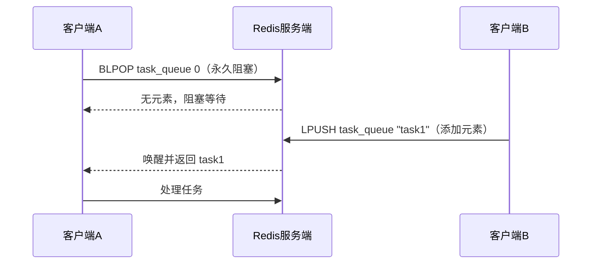
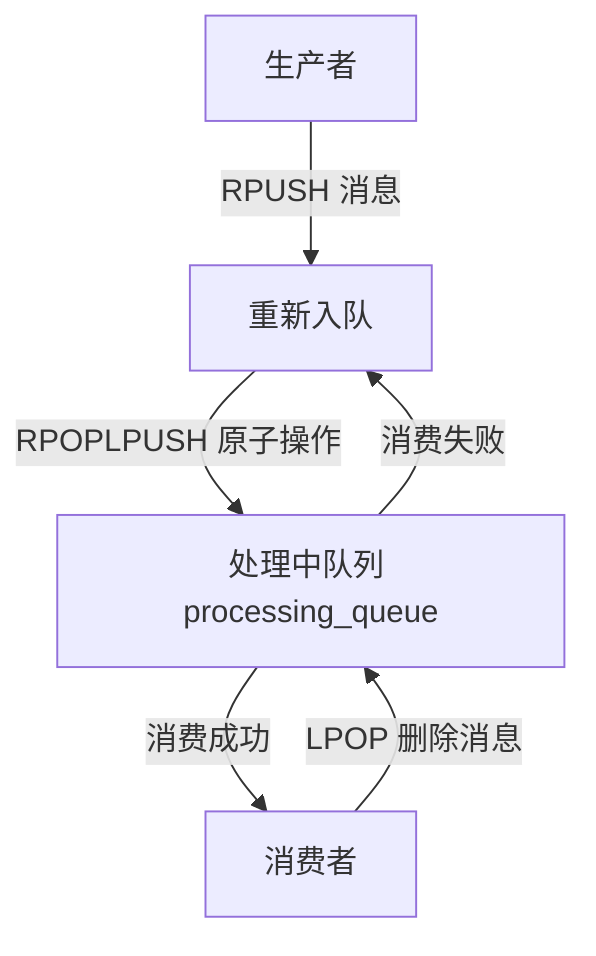

## 基本概念

Redis List 是一种**有序、可重复**的字符串元素集合，底层实现主要是快速链表（quicklist）（Redis 3.2+），结合了双向链表和压缩列表的优势，既高效又节省内存。

Redis List 可以看作是一个**双向队列**（双端可操作），支持从头部（left）或尾部（right）添加/删除元素，也可以当作栈或普通链表使用。元素按插入顺序排列，有索引（从 0 开始），可通过索引访问元素。

### 核心特性

1. **有序性**：元素按插入顺序排列，不会自动排序
2. **可重复性**：同一个字符串可以多次出现在列表中
3. **双端操作**：支持从表头（LPUSH/LPOP）、表尾（RPUSH/RPOP）快速操作，时间复杂度 O(1)
4. **范围访问**：支持按索引范围获取元素（LRANGE），适合分页场景
5. **长度限制**：理论上最多可存储 2^32 - 1 个元素（约 42 亿）


---

## 常用命令

### 基础操作命令

| 命令 | 作用 | 示例 |
|-----|------|------|
| `LPUSH key value` | 从列表头部添加一个/多个元素 | `LPUSH mylist "apple"` → 列表变为 [apple] |
| `RPUSH key value` | 从列表尾部添加一个/多个元素 | `RPUSH mylist "banana"` → [apple, banana] |
| `LPOP key` | 从列表头部删除并返回一个元素 | `LPOP mylist` → 返回 "apple"，列表剩 [banana] |
| `RPOP key` | 从列表尾部删除并返回一个元素 | `RPOP mylist` → 返回 "banana"，列表空 |
| `LRANGE key start end` | 获取列表中 start 到 end 索引的元素（end=-1 表示最后一个） | `LRANGE mylist 0 -1` → 返回所有元素 |
| `LLEN key` | 获取列表长度 | `LLEN mylist` → 返回列表元素个数 |
| `LINDEX key index` | 获取指定索引的元素（索引从 0 开始，负数表示倒数）| `LINDEX mylist 1` → 返回第2个元素 |
| `LTRIM key start end` | 修剪列表，只保留 start 到 end 的元素（删除其他元素）| `LTRIM mylist 0 2` → 只保留前3个元素 |

### 实用示例

```bash
# 初始化列表：从尾部添加3个元素
RPUSH fruits apple banana orange
# 返回：3（列表长度）

# 从头部添加1个元素
LPUSH fruits grape
# 返回：4

# 查看所有元素（0到-1表示全部）
LRANGE fruits 0 -1
# 返回：1) "grape" 2) "apple" 3) "banana" 4) "orange"

# 获取列表长度
LLEN fruits
# 返回：4

# 获取索引为2的元素（第三个）
LINDEX fruits 2
# 返回："banana"

# 从尾部删除一个元素
RPOP fruits
# 返回："orange"

# 修剪列表，只保留前2个元素
LTRIM fruits 0 1
LRANGE fruits 0 -1
# 返回：1) "grape" 2) "apple"
```

```mermaid
graph LR
    List((List: [A,B,C,D])) --> LPUSH[LPUSH List X<br/>结果: [X,A,B,C,D]]
    List --> RPUSH[RPUSH List Y<br/>结果: [A,B,C,D,Y]]
    List --> LPOP[LPOP List<br/>取出: A → 结果: [B,C,D]]
    List --> RPOP[RPOP List<br/>取出: D → 结果: [A,B,C]]
    List --> LRANGE[LRANGE List 0 2<br/>返回: [A,B,C]]
    List --> LTRIM[LTRIM List 1 2<br/>结果: [B,C]]
```

---

## 进阶命令

### 阻塞操作命令

| 命令 | 作用 | 适用场景 |
|-----|------|---------|
| `BLPOP/BRPOP key timeout` | **阻塞式删除**：从列表头/尾删除元素，若列表为空则阻塞，直到有元素或超时（timeout 单位秒，0=永久阻塞） | 消息队列（避免空轮询）|
| `RPOPLPUSH source dest` | 从 source 列表尾部删除元素，并添加到 dest 列表头部（原子操作）| 可靠消息队列、任务转移 |
| `BRPOPLPUSH source dest timeout` | 阻塞版的 `RPOPLPUSH`，列表为空时阻塞 | 高可靠的阻塞消息队列 |
| `LINSERT key BEFORE/AFTER pivot value` | 在指定元素 pivot 之前/之后插入 value | 精准插入元素（非索引）|

### 阻塞队列示例

```bash
# 开两个终端，终端1执行（阻塞等待，timeout=0表示永久）
BLPOP task_queue 0
# 终端2往task_queue添加元素
LPUSH task_queue "task1"
# 终端1立即返回：1) "task_queue" 2) "task1"
```

### 可靠消息队列示例

```bash
# 生产消息到待处理队列
RPUSH todo_queue "order_1001" "order_1002"

# 消费消息：将todo_queue的消息移到processing_queue（处理中），避免消息丢失
RPOPLPUSH todo_queue processing_queue
# 返回："order_1002"

# 查看两个队列
LRANGE todo_queue 0 -1    # 返回：1) "order_1001"
LRANGE processing_queue 0 -1  # 返回：1) "order_1002"

# 处理完成后，从processing_queue删除该消息
LPOP processing_queue
```

### 其他实用命令

| 命令 | 作用 |
|-----|------|
| `LSET key index value` | 修改指定索引的元素（索引必须存在，否则报错）|
| `LPUSHX/RPUSHX` | 仅当列表已存在时，才从头部/尾部添加元素（避免创建空列表）|
| `LLEN` 空列表 | 对不存在的列表执行 `LLEN`，返回 0，不会报错|

### 修改元素示例

```bash
# 修改索引1的元素
LPUSH mylist a b c
LSET mylist 1 "bbb"
LRANGE mylist 0 -1  # 返回：1) "c" 2) "bbb" 3) "a"

# LPUSHX：列表不存在则不操作
LPUSHX non_exist_list "test"  # 返回0（无操作）
LPUSH mylist2 "x"             # 创建列表并添加，返回1
LPUSHX mylist2 "y"            # 列表存在，添加成功，返回2
```

---

## 应用场景

### 消息队列

使用 `RPUSH` 生产消息，`LPOP` 消费消息（简单场景）。如果需要阻塞等待消息，可用 `BLPOP/BRPOP` 避免轮询空列表。



### 最新列表

比如最新评论、最新商品，用 `LPUSH` 添加新内容，`LTRIM` 限制列表长度（如只保留100条），`LRANGE` 分页展示。

### 栈/队列实现

栈：`LPUSH` 入栈 + `LPOP` 出栈

队列：`LPUSH` 入队 + `RPOP` 出队

```mermaid
graph TD
    subgraph 实现栈（后进先出 LIFO）
        A[LPUSH 元素1] --> B[LPUSH 元素2]
        B --> C[LPUSH 元素3]
        C --> D[LPOP → 取出元素3]
        D --> E[LPOP → 取出元素2]
        E --> F[LPOP → 取出元素1]
    end

    subgraph 实现队列（先进先出 FIFO）
        G[LPUSH 元素1] --> H[LPUSH 元素2]
        H --> I[LPUSH 元素3]
        I --> J[RPOP → 取出元素1]
        J --> K[RPOP → 取出元素2]
        K --> L[RPOP → 取出元素3]
    end
```

### 可靠消息队列

`RPOPLPUSH` 是原子操作，用于实现不丢失消息的队列，核心是待处理队列到处理中队列的转移。



---

## 性能优化与注意事项

### 性能特点

头尾操作（LPUSH/RPOP/BLPOP）是 O(1)，极快。中间操作（LINSERT、根据索引修改元素 LSET）是 O(n)，列表很长时会慢，应避免对大列表做中间插入/修改。`LRANGE` 虽然是 O(k)（k是返回元素数），但只要k不大（比如分页取100条），性能依然很好。

### 索引越界处理

使用 `LINDEX` 访问不存在的索引（比如列表长度为3，访问索引5），返回 `nil`，不会报错。`LTRIM` 若 `start` > `end`（且列表非空），会清空整个列表（比如 `LTRIM mylist 5 10`）。

### 与其他数据类型的区别

List vs Set：List 有序可重复，Set 无序唯一

List vs Sorted Set：Sorted Set 是按分数排序，List 是按插入顺序，且 List 双端操作更轻量

### 内存优化

Redis 3.2+ 的 quicklist 会自动压缩列表的节点（默认压缩深度0，即不压缩头尾节点），可通过配置 `list-compress-depth` 调整，比如设为2，表示压缩除了头尾2个节点外的所有节点，节省内存。
