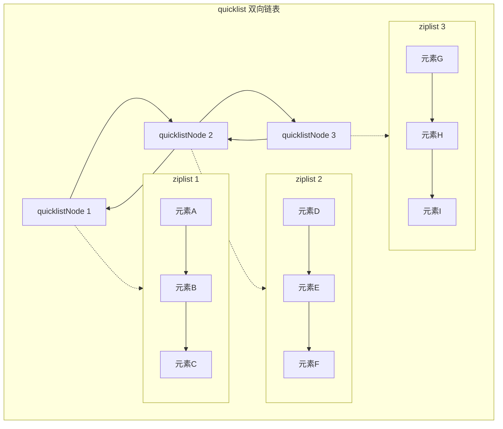
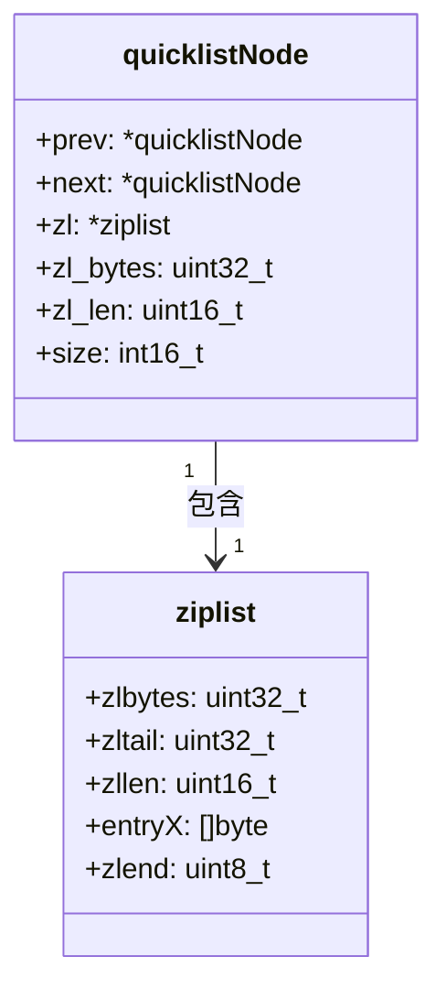
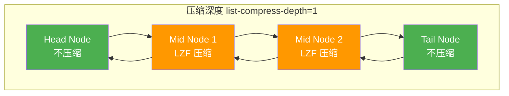
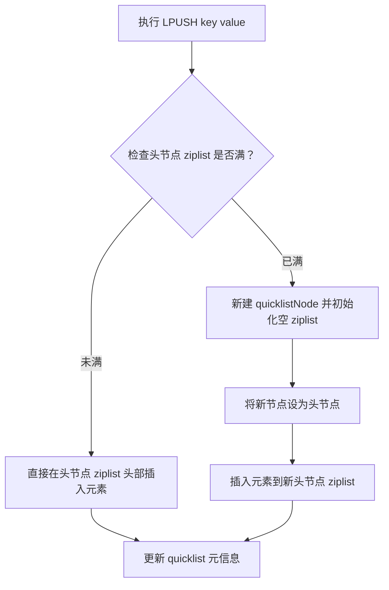

## quicklist 概述

quicklist 是 Redis 从 3.2 版本开始引入的数据结构，作为列表（List）类型的底层实现，它结合了 **ziplist（压缩列表）** 和 **双向链表** 的优点，解决了 ziplist 扩容效率低、双向链表内存开销大的问题。

quicklist 本质是一个双向链表，链表中的每个节点（称为 quicklistNode）不是直接存储数据，而是存储一个 ziplist。ziplist 是一种紧凑的连续内存结构，能节省内存；双向链表则解决了 ziplist 插入/删除元素时需要整体移动数据的问题。

Redis 3.2 之前，列表的底层实现是 `ziplist` 和 `双向链表` 的二选一（元素少用 ziplist，元素多用链表）。quicklist 是融合版本，无论元素多少，始终使用 quicklist，但内部自动调整 ziplist 大小。在小元素场景下，内存占用与 ziplist 接近，插入/删除性能略优（无需整体扩容）；在大元素/多元素场景下，内存占用远低于纯双向链表，迭代/修改性能基本持平。

---

## 核心结构设计

quicklist 由三个核心组成部分构成：quicklist（外层双向链表）、quicklistNode（链表节点）和 ziplist（存储实际元素）。

quicklist 作为外层双向链表，包含头节点、尾节点指针、节点数量、总元素数量等元信息。quicklistNode 是链表的单个节点，核心字段包括：`zl` 指向当前节点的 ziplist 指针、`prev/next` 指向前后节点的指针、`zl_bytes` 当前 ziplist 的字节数、`zl_len` 当前 ziplist 中的元素个数。ziplist 是紧凑的字节数组，所有元素连续存储，无冗余内存开销，适合存储少量、小尺寸的元素。

这种结构设计实现了内存与性能的平衡。如果只用 ziplist，元素少、尺寸小时内存高效，但元素增多/增大时，插入/删除需要移动大量内存数据，性能急剧下降。如果只用双向链表，插入/删除高效，但每个节点有额外指针开销（每个节点至少 16 字节），内存利用率低。quicklist 结合两者，每个节点用 ziplist 存储一批元素，既减少了链表节点的数量（降低指针开销），又保留了链表插入/删除的高效性。

---

## 关键特性

Redis 提供了两个核心配置项，可根据业务场景调整 quicklist 的行为。

**list-max-ziplist-size** 控制每个 quicklistNode 中 ziplist 的最大大小或最大元素数。正数表示 ziplist 最多包含的元素个数（如 8 表示每个节点最多存 8 个元素）。负数表示 ziplist 的最大字节数，-1 为 4kb，-2 为 8kb，-3 为 16kb，-4 为 32kb，-5 为 64kb。

**list-compress-depth** 控制 quicklist 的压缩深度（使用 LZF 算法压缩 ziplist），减少冷数据的内存占用。0 表示不压缩（默认）；1 表示压缩除了头、尾节点外的所有节点；2 表示压缩除了头 2 个、尾 2 个节点外的所有节点，以此类推。

quicklist 内部维护了 `count` 字段（总元素数），使得 `LLEN` 等操作无需遍历，直接返回，时间复杂度 O(1)。Redis 为 quicklist 实现了专用的迭代器（quicklistIter），支持双向迭代（从表头到表尾/从表尾到表头）、安全迭代（迭代过程中允许修改列表，不会因节点删除导致迭代器失效）、惰性加载（迭代到压缩节点时，才会临时解压，用完后可重新压缩，不影响内存）。

---

## 操作逻辑

以列表的 `LPUSH`（左插入）和 `RPOP`（右弹出）为例说明 quicklist 的操作流程。

**LPUSH 操作**：首先检查 quicklist 的头节点的 ziplist 是否还有空间（未达到 `list-max-ziplist-size`）。如果有空间，直接在头节点的 ziplist 头部插入元素。如果没有空间，新建一个 quicklistNode（包含空 ziplist），作为新的头节点，再插入元素。最后更新 quicklist 的 count 字段并返回操作结果。

**RPOP 操作**：首先检查 quicklist 的尾节点的 ziplist 是否有元素。如果有元素，直接从尾节点的 ziplist 尾部弹出元素。如果没有元素，删除该尾节点，再从新的尾节点弹出元素。如果所有节点都无元素，返回 nil。

**LINSERT 操作**（在指定元素前后插入）：先遍历找到目标元素所在的 quicklistNode 和 ziplist 位置，检查该 ziplist 是否有空间，有则直接插入，无则拆分 ziplist 为两个节点，再插入。全程只需操作单个或两个节点，不会影响整个列表。

---

## 深度优化机制

quicklistNode 内部的 ziplist 会做内存对齐处理（默认按 8 字节对齐），目的是减少内存碎片、提升 CPU 缓存命中率。CPU 读取内存时是按缓存行（通常 64 字节）批量读取的，对齐后的内存地址能让 ziplist 数据更适配缓存行，减少无效读取。内存对齐会带来少量内存冗余（最多 7 字节），但相比性能提升，这个开销是可接受的。

ziplist 存在一个经典问题：连锁更新（cascade update）。ziplist 中每个元素的长度字段是变长的（1/2/5 字节），若修改一个元素导致长度字段变化，可能触发后续所有元素的长度字段连续更新，最坏时间复杂度 O(n)。quicklist 的规避方式是：每个 quicklistNode 只存储一批元素（受 `list-max-ziplist-size` 限制），即使触发连锁更新，也只局限在单个节点的 ziplist 内，不会扩散到整个列表；单个 ziplist 元素数量/大小有限，连锁更新的影响范围被严格控制，性能损耗可忽略。

---

## Hash 类型为何不用 quicklist

Redis Hash 的底层实现规则是优先用 ziplist，当满足阈值时转为 dict（哈希表）（Redis 7.0+ 还引入了 listpack 替代 ziplist，但逻辑一致），从始至终都不会用 quicklist。触发 ziplist 转 dict 的阈值可配置：`hash-max-ziplist-entries` 表示 ziplist 中存储的键值对数量上限（默认 512）；`hash-max-ziplist-value` 表示单个键/值的字节数上限（默认 64）。

Hash 不用 quicklist 的核心原因在于访问模式完全不同。Hash 的核心操作是 `HGET`/`HSET`/`HDEL`（根据 key 快速查找/修改 value），属于随机访问，要求 O(1) 或 O(n) 但 n 极小的查找效率。quicklist 的设计目标是为 List 类型的顺序访问（`LPUSH`/`RPOP`/`LRANGE`）优化，本质是双向链表，随机访问某个元素需要遍历链表节点和 ziplist，时间复杂度 O(m+n)，效率远低于 ziplist 直接遍历。虽然 ziplist 随机查找也是 O(n)，但 Hash 使用 ziplist 时，n（键值对数量）被 `hash-max-ziplist-entries` 限制在极小范围（默认 512），实际遍历开销可忽略；且 ziplist 是连续内存，CPU 缓存命中率远高于 quicklist（离散的链表节点），实际访问速度更快。

quicklist 对 Hash 是过度设计加内存浪费。每个 quicklistNode 包含 `prev/next` 指针（至少 16 字节）、`zl_bytes`/`zl_len` 等元信息，即使只有一个节点，也比纯 ziplist 多占用十几字节内存。Hash 的使用场景是大量 Hash 存储的是少量键值对（如用户信息：name/age/phone），用 quicklist 会因链表节点的额外开销，导致内存利用率远低于 ziplist。ziplist 的优势是紧凑的连续内存，无冗余指针开销，存储少量键值对时内存效率极致，这正是 Hash 小数据场景的核心需求。

数据组织形式也不匹配。Hash 的存储需求是键值对是成对存储的，需要保证 key 和 value 的紧密关联。ziplist 中 Hash 的存储格式是 `[key1, value1, key2, value2, ...]`，连续存储且键值一一对应，遍历和解析逻辑简单。quicklist 的存储形式是以节点加 ziplist 为单位，若用 quicklist 存储 Hash，键值对可能被拆分到不同的 quicklistNode 中（比如 key1 在节点1，value1 在节点2），会彻底破坏键值的关联性，导致查找/修改逻辑极度复杂，完全违背 Hash 的设计初衷。

扩容/收缩逻辑的适配性也不同。Hash 的扩容逻辑是当 ziplist 达到阈值时，直接转为 dict（哈希表），dict 天生适配大量键值对的随机访问，时间复杂度 O(1)，是 Hash 大数据量场景的最优解。quicklist 的扩容逻辑是为 List 的追加/弹出设计的，扩容时新建节点，无法适配 Hash 从小数据量到大数据量的平滑过渡（quicklist 即使节点再多，随机访问效率也远不如 dict）。

Redis 对每种数据类型选择底层实现的核心逻辑是匹配该类型的核心操作特性，在小数据量时追求极致内存效率，大数据量时追求极致访问性能。List 的核心操作是顺序追加/弹出/范围遍历，选 quicklist 平衡内存和顺序操作性能。Hash 的核心操作是随机键值对查找/修改，小数据量选 ziplist 实现内存极致，大数据量选 dict 实现访问极致。若强行给 Hash 用 quicklist，会既损失内存效率，又损失访问性能，完全违背这一原则。
