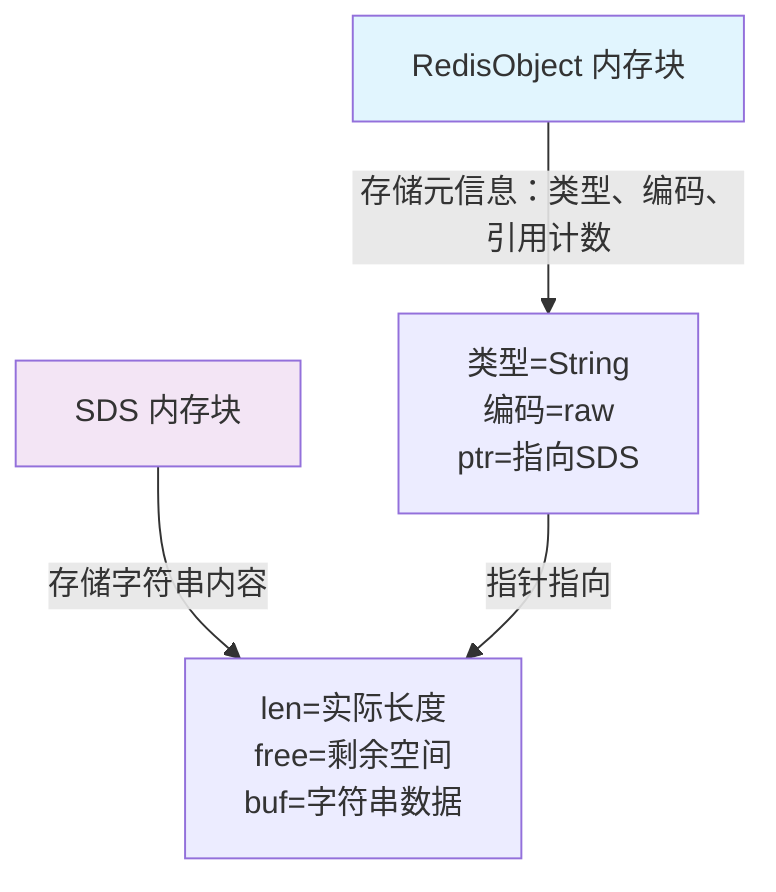
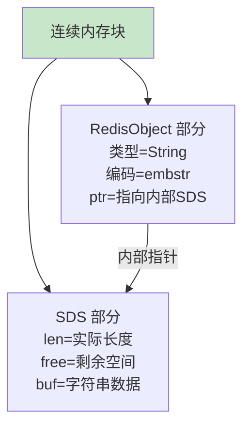
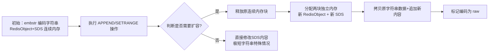
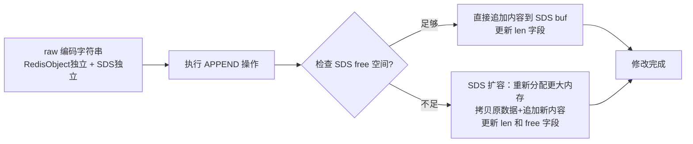

## 核心定义

raw 编码是 Redis 字符串类型的一种底层编码方式，本质是基于 C 语言的动态字符串（SDS，Simple Dynamic String）实现。它是 Redis 对**长字符串**的标准存储方式，与 `embstr` 编码（短字符串专用）相对应，专门用于存储超出 `embstr` 优化范围的字符串。

Redis 的字符串类型会根据**字符串长度**和**内容特征**自动选择不同的底层编码以优化内存和性能，`raw` 就是其中的核心编码之一。



---

## 使用场景

Redis 会自动在 `embstr` 和 `raw` 之间切换，核心判断规则（以 Redis 6.x/7.x 为例）：

### 长度触发

当字符串长度超过 `44 字节`（Redis 3.2+ 版本的阈值，旧版本是 39 字节）时，Redis 会将编码从 `embstr` 切换为 `raw`。

### 修改触发

即使字符串长度小于 44 字节，但如果字符串被**修改过**（如 `APPEND` 操作），原本的 `embstr` 也会转为 `raw`。这是因为 `embstr` 是只读优化，修改会触发重新分配内存。

---

## 与 embstr 编码对比

raw 编码与 embstr 编码在内存布局和使用场景上有显著差异，两者的核心区别如下：

| 特征                | raw 编码                  | embstr 编码               |
|---------------------|---------------------------|---------------------------|
| 适用字符串长度      | `>44 字节`（或修改过的短串） | `≤44 字节`                |
| 内存分配方式        | `两次分配`（SDS + RedisObject） | `一次分配`（连续内存）    |
| 内存释放            | `两次释放`                | `一次释放`                |
| 修改灵活性          | 支持高效修改              | 只读优化，修改会转 raw    |
| 内存开销            | 稍高（两次内存块）        | 更低（连续内存，减少碎片） |



---

## 底层实现

raw 编码的字符串在 Redis 底层由两个独立的内存块组成：

### RedisObject 结构体

存储对象类型（String）、编码类型（raw）、引用计数等元信息。这是 Redis 对所有对象的通用结构体。

### SDS 结构体

存储字符串的实际内容、长度、剩余空间等。SDS（Simple Dynamic String）是 Redis 自定义的动态字符串结构，支持高效的字符串操作。



---

## 修改灵活性分析

raw 编码在修改灵活性上优于 embstr 编码，核心原因在于两者**内存分配方式**和**设计定位**的本质差异。

### 内存布局决定修改能力

#### embstr 编码的刚性限制

embstr 把 `RedisObject`（元信息）和 `SDS`（字符串内容）分配在同一块连续内存中，好处是内存碎片少、分配/释放快，但缺点是**整块内存的大小是固定的**。

如果要修改字符串（如 `APPEND` 加长、`SETRANGE` 替换部分内容），一旦修改后字符串长度超过原内存块的大小，就必须执行以下操作：
- 释放整个连续内存块；
- 重新分配一块新的连续内存块（包含新的 RedisObject + 新的 SDS）；
- 把原内容拷贝到新内存块，再执行修改。

这个过程相当于"推倒重来"，效率极低。因此，Redis 设计为：**只要对 embstr 编码的字符串执行修改操作，直接将其转为 raw 编码**，不再复用 embstr 的内存结构。

#### raw 编码的灵活设计

raw 编码中，`RedisObject` 和 `SDS` 是两个独立的内存块，修改字符串时只需要操作 `SDS` 这一块，完全不影响 `RedisObject`：

- SDS 本身是 Redis 设计的动态字符串结构，内部维护了"已用长度"和"剩余空间"，修改时优先使用剩余空间，无需立即扩容；
- 即使需要扩容，也只需要重新分配 SDS 的内存（小范围操作），不用动 RedisObject，扩容成本远低于 embstr。

raw 编码没有 embstr 的"修改即转换"限制，所有字符串修改操作（`APPEND`、`SETRANGE`、`INCRBY` 等）都可以直接在原有结构上执行，无需整体重建。



### 修改操作示例对比

假设对一个字符串执行 `APPEND` 操作，两种编码的处理流程差异显著：

**embstr 编码处理流程**：
```
原内存：[RedisObject][SDS(hello)] → 执行 APPEND " world"
第一步：检测到修改，触发编码转换
第二步：释放整个 [RedisObject][SDS] 连续内存
第三步：分配两块独立内存 → [RedisObject] 和 [SDS(hello world)]
第四步：将编码标记为 raw
```
整个过程是"销毁-重建"，没有任何灵活性可言。

**raw 编码处理流程**：
```
原内存：[RedisObject]  [SDS(hello)] → 执行 APPEND " world"
第一步：检查 SDS 剩余空间，足够则直接追加内容
第二步：仅更新 SDS 的长度字段 → [SDS(hello world)]
第三步：完成修改，RedisObject 无任何变化
```
整个过程只操作 SDS，灵活且高效。

---

## 性能特点

raw 编码在性能方面具有显著优势：

### 读写性能

由于是独立的内存块，修改（如 `APPEND`、`SETRANGE`）时无需重新分配整个内存，对长字符串的修改效率更高。SDS 的动态特性使得大部分修改操作可以在原地完成，避免了频繁的内存分配和拷贝。

### 内存开销

相比 `embstr` 多一次内存分配，会产生少量内存碎片，但对长字符串来说，这种开销远小于性能收益。Redis 通过内存池等优化手段，将碎片影响降到最低。

### 回收效率

释放时需要分别回收 `RedisObject` 和 `SDS`，但 Redis 有内存池优化，实际影响可忽略不计。

---

## 实操验证

可以通过 `object encoding` 命令查看字符串的编码类型，验证不同场景下的编码转换规则。

### 短字符串编码

```bash
127.0.0.1:6379> SET short "hello world"
OK
127.0.0.1:6379> OBJECT ENCODING short
"embstr"
```

### 长字符串编码

```bash
127.0.0.1:6379> SET long "this is a very long string more than 44 bytes, test raw encoding"
OK
127.0.0.1:6379> OBJECT ENCODING long
"raw"
```

### 修改操作触发编码转换

```bash
127.0.0.1:6379> APPEND short " append more content to make it long"
(integer) 45
127.0.0.1:6379> OBJECT ENCODING short
"raw"
```

---

## 总结

raw 编码是 Redis 字符串类型针对**长字符串（>44字节）** 或**被修改过的字符串**的底层编码，其核心特点包括：

1. 通过"RedisObject + SDS"两次内存分配实现，相比 `embstr` 更灵活，适合修改操作；
2. Redis 会自动根据字符串长度/修改状态切换 `embstr` 和 `raw`，无需手动干预；
3. 核心设计目标是平衡内存开销和读写性能，为长字符串和动态修改场景提供高效支持。

raw 编码牺牲少量内存碎片换取修改灵活性，与 embstr 编码形成互补，共同构成 Redis 字符串类型的完整编码体系。这种设计充分体现了 Redis 在不同场景下的优化思路，是提升 Redis 整体性能的重要技术手段。
