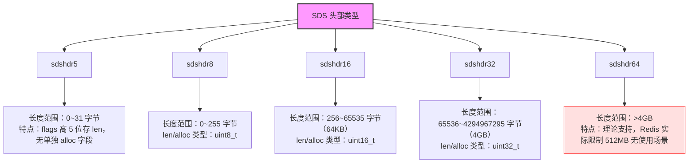
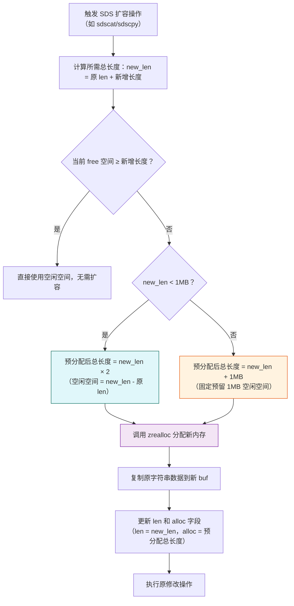
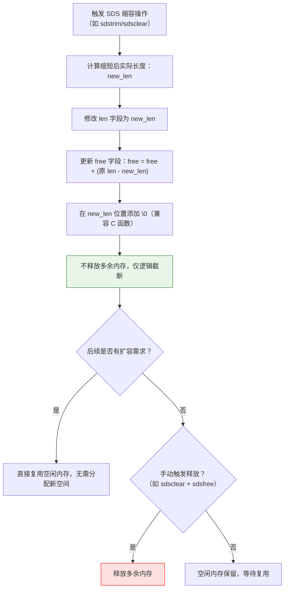
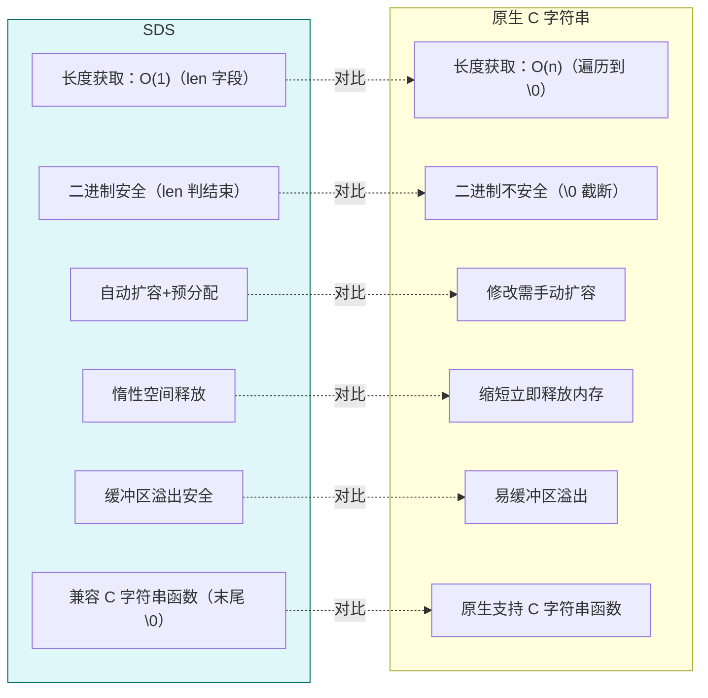
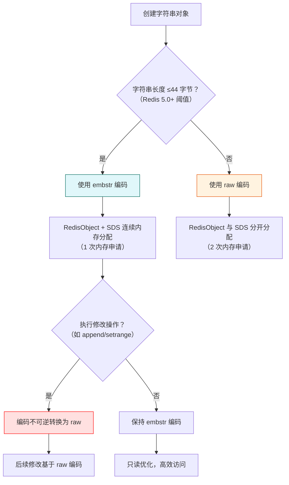
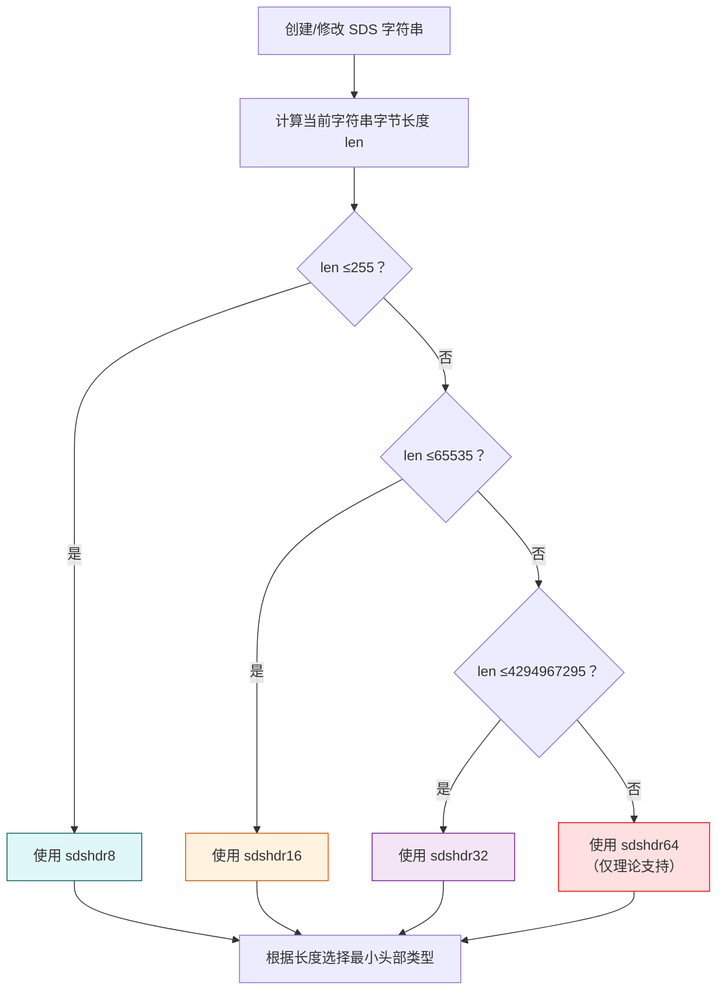

## SDS概述

SDS（Simple Dynamic String，简单动态字符串）是 Redis 为了解决原生 C 字符串的缺陷，自定义实现的字符串数据结构。Redis 中所有的字符串类型值（比如 `SET key value` 里的 `value`）、键（`key`），甚至哈希、集合等结构的底层实现，都依赖 SDS，而非直接使用 C 语言原生的字符串（以 `\0` 结尾的字符数组）。

### SDS 核心结构

Redis 为了节省内存，设计了**变长头部**的 SDS 结构——根据字符串长度选择不同大小的头部，避免小字符串占用过多内存。核心结构如下（以最常用的 `sdshdr8` 为例）：

```c
// 适用于长度 ≤ 255 字节的字符串（8位长度标识）
struct __attribute__((__packed__)) sdshdr8 {
    uint8_t len;        // 字符串已使用的长度（字节），O(1) 获取
    uint8_t alloc;      // 字符串总分配长度（不包含头部和末尾的 \0）
    unsigned char flags;// 标识头部类型（8/16/32/64），占1字节
    char buf[];         // 柔性数组：存储字符串内容 + 末尾的 \0（兼容C字符串函数）
};

// 更长字符串的头部（仅长度字段类型不同）
struct sdshdr16 {
    uint16_t len;       // 16位无符号整数，支持最长 65535 字节
    uint16_t alloc;
    unsigned char flags;
    char buf[];
};
struct sdshdr32 { uint32_t len; uint32_t alloc; ... }; // 支持最长 4GB 左右
struct sdshdr64 { uint64_t len; uint64_t alloc; ... }; // 支持超长字符串
```

#### 关键字段解释：

- `len`：记录字符串实际长度，解决了 C 字符串需要遍历到 `\0` 才能计算长度（O(n)）的问题
- `alloc`：记录已分配的内存总长度，用于快速判断是否需要扩容，避免频繁申请内存
- `flags`：1字节标识头部类型，Redis 会根据字符串长度自动选择 `sdshdr8/16/32/64`
- `buf`：存储实际字符，末尾保留 `\0` 是为了兼容 `strcpy`、`strcmp` 等 C 字符串函数，降低开发成本

### SDS 应用场景

- Redis 中所有**字符串键值对**的底层存储（如 `SET name "redis"`）
- 哈希（Hash）、列表（List）、集合（Set）等复合结构的底层实现（比如 Hash 的字段名/值）
- 存储二进制数据（如序列化后的对象、图片片段）
- 作为 Redis 内部的临时字符串（如命令解析、日志输出）

## SDS核心特性

SDS 解决了 C 字符串的多个痛点，是 Redis 字符串高性能的基础：

| 特性 | SDS | C 字符串 | 价值 |
|------|-----|----------|------|
| 长度获取 | len 字段，O(1) | 遍历到 \0，O(n) | 高频 strlen 操作无性能损耗 |
| 缓冲区溢出 | 扩容前检查空间，自动扩容 | 手动管理，易溢出 | 杜绝因内存操作失误导致的崩溃 |
| 二进制安全 | 以 len 而非 \0 判结束 | 遇 \0 截断，仅存文本 | 支持存储图片、序列化对象等二进制数据 |
| 内存管理 | 预分配 + 惰性释放 | 每次修改都需重分配 | 减少内存重分配次数，提升性能 |
| 兼容性 | 尾部自动加 \0，兼容 C 函数 | 原生支持所有 C 字符串函数 | 可复用部分 C 标准库逻辑，降低开发成本 |

### 二进制安全

C 字符串以 `\0` 作为结束标志，无法存储图片、视频等包含 `\0` 的二进制数据；而 SDS 靠 `len` 字段判断长度，`buf` 里可以存储任意字节（比如 Redis 的 `SET key "\0\x01\x02"` 能正常存储）。

### 自动扩容策略

- 当字符串长度 &lt; 1MB 时，扩容后分配**2倍**的空间（比如 len=100 → alloc=200）
- 当长度 ≥ 1MB 时，扩容后额外分配 **1MB** 空间（避免过度预分配）

既减少了频繁内存申请的开销，又避免了内存浪费。

### 惰性释放

缩短字符串时（比如 `sdstrim` 截断），SDS 不会立即释放多余内存，而是更新 `len` 字段，后续修改字符串时可直接复用，减少内存分配次数。

## SDS头部类型与长度限制

### SDS 理论最大长度（按头部类型划分）

SDS 会根据字符串长度自动选择不同的头部结构（`sdshdr8/16/32/64`），不同头部的 `len` 字段类型不同，直接决定了理论最大长度：

| SDS 头部类型 | len 字段类型 | 无符号整数范围 | 理论最大长度（字节） | 实际使用场景 |
|--------------|-------------|----------------|----------------------|--------------|
| sdshdr8 | uint8_t | 0 ~ 2^8 - 1 = 0~255 | 255 | 短字符串（最常用） |
| sdshdr16 | uint16_t | 0 ~ 2^16 - 1 = 0~65535 | 65535（64KB） | 中等长度字符串 |
| sdshdr32 | uint32_t | 0 ~ 2^32 - 1 ≈ 4.29GB | 约4.29GB | 长字符串（极少用到） |
| sdshdr64 | uint64_t | 0 ~ 2^64 - 1 ≈ 18EB | 约18EB | 理论极值（几乎无实际场景） |

> 注：`uintN_t` 表示 N 位无符号整数，最大值为 $2^N - 1$；长度单位均为**字节（Byte）**，而非字符（比如中文 UTF-8 占3字节）。

### Redis 对字符串的全局上限

虽然 `sdshdr64` 理论上支持 18EB 的长度，但 Redis 对**单个字符串值**有明确的硬限制：

**Redis 官方规定**：单个字符串键值对的最大长度为 **512MB**。

限制原因：
1. 内存与性能：Redis 是内存数据库，单个超大字符串会占用大量内存，且网络传输、序列化/反序列化都会严重影响性能
2. 设计定位：Redis 主打高性能的键值存储，而非大文件存储，超大数据应拆分为多个键或用专门的存储系统（如分布式文件系统）

### sdshdr32 触发场景

根据 SDS 头部的切换规则，当字符串的字节长度满足 **65536 bytes（64KB） ≤ len ≤ 4294967295 bytes（约4GB）** 时，Redis 会自动选择 `sdshdr32` 头部。

但结合 Redis 的核心限制——**单个字符串值最大不能超过 512MB**，因此 `sdshdr32` 的实际触发区间是：**64KB &lt; len ≤ 512MB**

典型应用场景：
- **存储大体积文本数据**：比如缓存完整的 JSON 配置文件、超长的 HTML 片段、大段的日志内容（字节数超过 64KB 但不超过 512MB）
- **存储序列化后的对象**：如果用 Redis 缓存大型业务对象（如电商的订单详情、用户的完整资料），序列化后的字节数超过 64KB 时，会使用 `sdshdr32`
- **临时存储大体积中间数据**：比如 Redis 内部执行命令时生成的超长字符串结果（如 `KEYS *` 命令返回海量键名的拼接字符串）

注意：虽然 `sdshdr32` 理论上支持到 4GB，但 512MB 是 Redis 强制的单字符串上限，超过会直接报错。

### sdshdr64 触发场景

`sdshdr64` 的触发条件是字符串字节长度 **> 4294967295 bytes（4GB）**，但这个场景在 Redis 中 **完全不会出现**，原因有两个：

1. **Redis 的硬限制**：单个字符串值最大只能到 512MB，远小于 4GB 的 `sdshdr64` 触发阈值
2. **内存与性能的双重瓶颈**：Redis 是内存数据库，512MB 的单字符串已经会占用大量内存，且网络传输、序列化/反序列化的耗时会急剧增加，完全不符合 Redis 高性能的设计定位

因此，`sdshdr64` 是一个 **纯理论的头部类型**，在生产环境中没有任何实际应用场景，Redis 设计它只是为了让 SDS 的头部体系覆盖所有无符号整数的长度范围，保证结构的完整性。

### 长度计算逻辑

SDS 的 `len` 字段统计的是**实际存储的字节数**，而非字符数。例如：
- 存储字符串 `"redis"`（5个ASCII字符），`len=5`
- 存储 `"Redis 中文"`（包含2个中文，UTF-8编码），`len=5 + 1 + 3*2 = 12`（`Redis`5字节 + 空格1字节 + 中文"中""文"各3字节）



## SDS内存管理策略

### 空间预分配（扩容时）

逻辑：修改字符串需扩容时，除分配所需空间外，额外预留空闲空间（free）。

规则：新长度 &lt; 1MB 时，空闲空间翻倍（如 10KB→20KB，free=10KB）；新长度 ≥1MB 时，每次额外分配 1MB 空闲空间。

目的：减少后续 append 等操作的内存重分配次数。



### 惰性释放（缩容时）

逻辑：缩短字符串（如 trim）时，不立即释放多余内存，仅更新 len 字段，空闲空间留待后续复用。

例外：可通过 `sdstrim` 配合 `sdsclear` 手动释放，或 Redis 内存紧张时触发主动回收。

目的：避免频繁释放/分配内存，提升短字符串反复修改的效率。



## SDS头部结构与类型切换

Redis 3.2+ 设计了 4 种头部结构体，按字符串长度自动选择最小类型，节省内存：

```c
// sdshdr8（len ≤ 255B）
struct __attribute__((__packed__)) sdshdr8 {
    uint8_t len;    // 已用长度
    uint8_t alloc;  // 总分配长度（不含头部和 \0）
    unsigned char flags; // 低 3 位存类型（8/16/32/64）
    char buf[];     // 柔性数组存数据
};
// 对应 sdshdr16（len ≤ 64KB）、sdshdr32（len ≤ 512MB）、sdshdr64（理论 len >4GB，无实际场景）
```

切换触发：字符串长度跨阈值时（如 255B→256B 切 sdshdr8→16），自动创建新头部并复制数据，开发者无需干预。



## SDS与Redis字符串编码关联

SDS 是底层存储，编码（embstr/raw）是 RedisObject 的包装方式，二者协同优化内存与性能：

### embstr 编码（len ≤44B）

RedisObject 与 SDS 连续内存分配，仅需 1 次内存申请，减少碎片；但修改时会转为 raw 编码（不可逆转）。

### raw 编码（len >44B）

RedisObject 与 SDS 分开分配内存，需 2 次申请，适配大字符串的扩容与缩容。

### 示例

45B 字符串用 raw + sdshdr8；70KB 字符串用 raw + sdshdr32。



## SDS关键API

Redis 提供一套 SDS 专属 API，避免直接操作底层结构，核心接口如下：

| API 函数 | 功能 | 核心逻辑 |
|----------|------|----------|
| sdsnewlen | 创建指定长度的 SDS | 选对应头部类型，初始化 len/alloc/flags |
| sdscat | 字符串拼接 | 先检查空间，不足则按预分配规则扩容 |
| sdslen | 获取字符串长度 | 直接返回 len 字段，O(1) |
| sdsfree | 释放 SDS | 回收头部与 buf 内存，避免泄漏 |
| sdstrim | 修剪字符串 | 缩短 len，惰性释放多余内存 |



## SDS实践注意事项

### 避免大字符串滥用

单个字符串最大 512MB，超过会报错；大字符串会增加内存占用、网络传输耗时，建议拆分存储（如拆超长 JSON 为多个小键）。

### 内存碎片问题

embstr 适合短字符串，raw 虽分开分配但配合预分配可减少碎片；可通过 `INFO memory` 查看碎片率，必要时重启实例。

### 二进制数据存储

用 SDS 存二进制数据时，需明确设置长度（如 `SET key "\x00\x01"`），避免隐式截断。

### 主动内存回收

若频繁缩短大字符串且后续无复用，可调用 `sdsclear` 或 `DEL` 释放内存，避免空闲空间长期占用。

### 头部切换是自动的

Redis 会根据字符串长度动态选择最小的头部类型（比如长度从 63KB 涨到 65KB 时，自动从 `sdshdr16` 升级为 `sdshdr32`），开发者无需手动干预。

## 总结

1. SDS 是 Redis 自定义的字符串结构，核心解决了原生 C 字符串长度计算慢、二进制不安全、内存操作繁琐的问题
2. 变长头部 + len/alloc 字段是 SDS 的核心设计，既实现了 O(1) 长度计算，又优化了内存使用和修改效率
3. 二进制安全、自动扩容、惰性释放是 SDS 适配 Redis 高性能、高可靠需求的关键特性
4. SDS 理论最大长度由头部类型决定：`sdshdr8` 最大255字节，`sdshdr64` 理论可达18EB，但无实际意义
5. Redis 实际限制单个字符串的最大长度为 **512MB**，这是兼顾性能和内存的工程选择
6. SDS 的长度统计以**字节**为单位，而非字符数，需注意多字节编码（如UTF-8）的影响
7. SDS 是 Redis 字符串的"底层引擎"，通过**动态头部、高效内存管理、二进制安全**三大核心设计，兼顾性能与安全性
