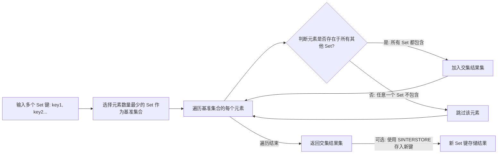
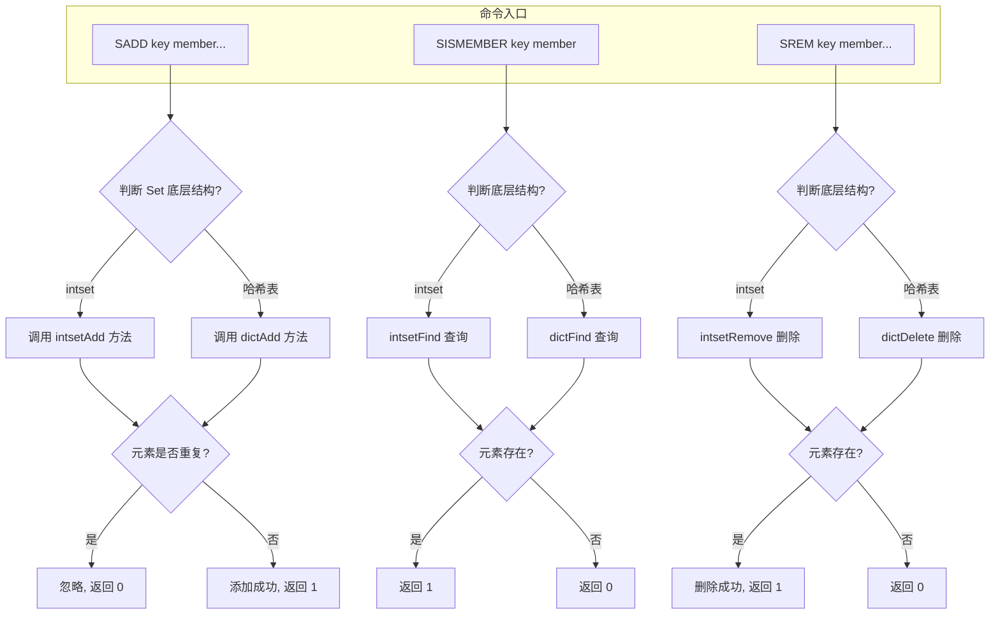
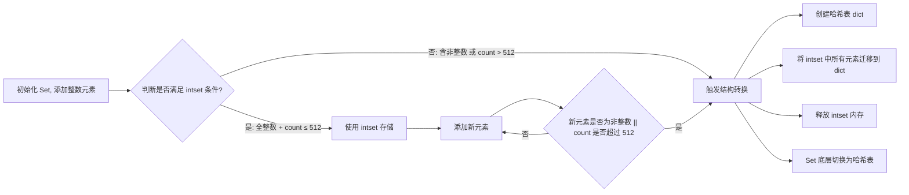
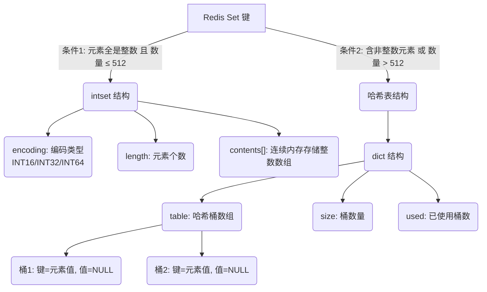

## Set 数据类型的核心定义
Redis 的 Set 是**无序、唯一、不重复**的字符串集合，类似于编程语言（如 Python）中的 `set` 类型，但基于 Redis 内存数据库实现，支持丰富的集合操作（交集、并集、差集）。
- **无序**：元素没有固定的排列顺序，无法通过下标访问（区别于 List）；
- **唯一性**：集合中不会存储重复的元素，添加重复元素时会自动忽略；
- **底层实现**：底层基于哈希表（Hash Table）实现，因此添加、删除、查找元素的时间复杂度都是 $O(1)$，性能极高。

---

## 核心命令（常用且实用）
以下是 Set 最常用的命令，附带示例和解释，你可以直接在 Redis 客户端（如 `redis-cli`）中测试：

## 基础操作（增、删、查）
| 命令               | 作用                                  | 示例                                  |
|--------------------|---------------------------------------|---------------------------------------|
| `SADD key member...` | 向集合中添加一个/多个元素（重复则忽略） | `SADD myset a b c` → 返回 3（成功添加的元素数） |
| `SMEMBERS key` | 获取集合中所有元素 | `SMEMBERS myset` → 返回 ["a","b","c"] |
| `SISMEMBER key member` | 判断元素是否在集合中 | `SISMEMBER myset a` → 返回 1（存在）；`SISMEMBER myset d` → 返回 0（不存在） |
| `SREM key member...` | 删除集合中指定元素 | `SREM myset b` → 返回 1（成功删除的元素数） |
| `SCARD key` | 获取集合的元素个数（基数） | `SCARD myset` → 返回 2（剩余 a、c） |
| `SPOP key [count]` | 随机弹出集合中的 1 个/多个元素 | `SPOP myset` → 随机返回 "a"，集合剩余 ["c"] |
| `SRANDMEMBER key [count]` | 随机获取 1 个/多个元素（不删除） | `SRANDMEMBER myset 2` → 随机返回 ["c","a"]（若元素足够） |

---

## 集合间操作（核心优势）
这是 Set 最具价值的功能，常用于社交、标签、权限等场景：

| 命令               | 作用                                  | 示例（假设有集合 `set1={a,b,c}`、`set2={b,c,d}`） |
|--------------------|---------------------------------------|--------------------------------------------------|
| `SINTER key1 key2...` | 求多个集合的**交集**（共同元素）| `SINTER set1 set2` → ["b","c"]                   |
| `SUNION key1 key2...` | 求多个集合的**并集**（所有元素，去重） | `SUNION set1 set2` → ["a","b","c","d"]           |
| `SDIFF key1 key2...`  | 求多个集合的**差集**（key1 有、key2 无） | `SDIFF set1 set2` → ["a"]                        |
| `SINTERSTORE dest key1 key2...` | 将交集结果存入新集合 | `SINTERSTORE set_inter set1 set2` → 新集合 `set_inter` 包含 ["b","c"] |

---

## Set 集合运算原理（交集/并集/差集）
以 `SINTER key1 key2` 为例，展示交集的计算流程。


---

## Set 核心命令执行逻辑（增删查）
以 `SADD`/`SISMEMBER`/`SREM` 为例，展示命令的执行步骤。


## 实际应用场景
Set 的特性决定了它适合解决以下问题：
1. **用户标签管理**：
   - 给用户打标签（如 "运动"、"美食"、"旅行"），用 Set 存储（自动去重，避免重复标签）；
   - 求「同时喜欢运动和美食的用户」（交集）、「喜欢运动或美食的用户」（并集）。
2. **社交场景**：
   - 存储用户的关注列表、粉丝列表、共同好友（交集）；
   - 随机抽奖：用 `SPOP` 随机抽取中奖用户（弹出后自动从集合移除，避免重复中奖）。
3. **去重统计**：
   - 统计网站的独立访客（UV）：将每个访客的 ID 加入 Set，`SCARD` 直接获取 UV 数（比 List 去重效率高）。
4. **权限控制**：
   - 存储某角色的所有权限，用 `SISMEMBER` 判断用户是否拥有某权限。

---

## 底层实现的补充细节
1.  **哈希表 vs 整数集合（intset）**
    之前提到 Set 底层是哈希表，但其实 Redis 有**优化存储**：当集合中的元素都是整数，且元素数量不超过 `set-max-intset-entries`（默认 512）时，会使用 **intset（整数集合）** 作为底层存储，而不是哈希表。
    - intset 的优势：**内存占用极低**（连续内存存储，无哈希表的元数据开销）；
    - 触发转换条件：当添加非整数元素，或元素数量超过阈值时，会自动转为哈希表；
    - 源码关联：`intset.h` 和 `intset.c` 中定义了 `intset` 结构，包含编码方式（`ENC_INT16`/`ENC_INT32`/`ENC_INT64`）和元素数组。

---

## Set 存储结构自动转换流程
描述 `intset` 升级为哈希表的触发条件和步骤。



2.  哈希表的扩容与收缩
    Set 基于哈希表实现时，会遵循 Redis 哈希表的通用规则：
    - 扩容：负载因子（元素数/桶数）> 1 时，自动扩容为 2 倍；
    - 收缩：负载因子 &lt; 0.1 时，自动收缩以节省内存；
    - 影响：扩容/收缩时会有短暂的 rehash 操作，但 Redis 采用**渐进式 rehash**，不会阻塞主线程。

---

## Redis Set 底层存储结构对比
展示 Set 在不同条件下的两种存储方式（`intset` / 哈希表）及其结构组成。


## 进阶命令与冷门但实用的功能
1.  **阻塞式弹出命令：`BLPOP` 是 List 的命令，Set 没有对应的阻塞弹出，但可以结合 `BRPOP` + 临时 List 模拟**
    场景：如果需要等待 Set 中有元素时再弹出，可以将 Set 元素转移到 List，再用 `BRPOP` 阻塞获取。

2.  **元素移动命令：SMOVE source destination member**
    - 作用：原子性地将元素从源集合移动到目标集合（如果源集合没有该元素，则操作失败）；
    - 原子性保证：在分布式场景下，避免了 "先删后加" 导致的元素丢失；
    - 示例：`SMOVE set1 set2 a` → 将 set1 中的 `a` 移动到 set2。

3.  **批量操作的性能优化：`SADD`/`SREM` 支持多元素批量操作**
    - 推荐实践：批量添加/删除元素时，尽量用一条命令传递多个元素，减少网络往返次数（相比循环单条命令，性能提升 10 倍以上）；
    - 错误实践：在 Go 等语言中，循环调用 `redisClient.SAdd(ctx, key, member)`，而不是用 `SAdd(ctx, key, members...)` 批量传递。

4.  **迭代器命令：SSCAN**
    - 解决的问题：`SMEMBERS` 会一次性返回所有元素，当集合元素量极大（如百万级）时，会阻塞 Redis 主线程；
    - `SSCAN` 优势：**游标式迭代**，分批获取元素，不阻塞主线程；
    - 用法：`SSCAN key cursor [MATCH pattern] [COUNT count]`
      示例：`SSCAN myset 0 MATCH a* COUNT 100` → 从游标 0 开始，匹配以 `a` 开头的元素，每次返回 100 个左右。

---

## 特殊场景与性能优化技巧
1.  **大集合的集合运算优化**
    - 问题：`SINTER`/`SUNION`/`SDIFF` 直接返回结果，当集合元素很多时，结果会占用大量内存和带宽；
    - 优化方案：使用 **SINTERSTORE/SUNIONSTORE/SDIFFSTORE** 将运算结果存入新集合，而不是直接返回，后续可以通过 `SSCAN` 分批读取新集合；
    - 推荐实践：大集合运算优先用 `*STORE` 命令，避免直接返回大结果集。

2.  **与 Sorted Set 的区别与选型**
    很多人会混淆 Set 和 Sorted Set（ZSet），核心区别如下：
    | 特性         | Set                | Sorted Set（ZSet）|
    |--------------|--------------------|-----------------------------|
    | 有序性       | 无序               | 按 score 有序               |
    | 元素唯一性   | 唯一               | 唯一（member 唯一，score 可重复） |
    | 核心操作     | 集合运算（交并差） | 排序、范围查询（ZRANGE/ZREVRANGE） |
    | 底层实现     | 哈希表/intset      | 跳跃表 + 哈希表             |
    | 选型建议     | 去重、集合关系     | 排序、排行榜、带权重的场景  |

3.  **过期时间的坑**
    - Set 本身**不支持给单个元素设置过期时间**，只能给整个 Set 键设置过期时间（`EXPIRE key seconds`）；
    - 需求矛盾：如果需要给集合中的元素单独设置过期，不要用 Set，推荐用 **Sorted Set**（将过期时间作为 score，定期删除过期元素）。

---

## 源码级别的关键结构（以 Redis 6.2 为例）
1.  **intset 结构定义**
    ```c
    typedef struct intset {
        uint32_t encoding; // 编码方式：INTSET_ENC_INT16/32/64
        uint32_t length;   // 元素个数
        int8_t contents[]; // 存储元素的数组（柔性数组）
    } intset;
    ```
    - 编码自动升级：当添加的整数超过当前编码范围时，自动升级编码（如 INT16 → INT32），但**不支持降级**。

2.  **Set 的 redisObject 类型**
    Set 对应的 `redisObject` 的 `type` 是 `REDIS_SET`，`encoding` 是 `REDIS_ENCODING_HT`（哈希表）或 `REDIS_ENCODING_INTSET`（整数集合）。