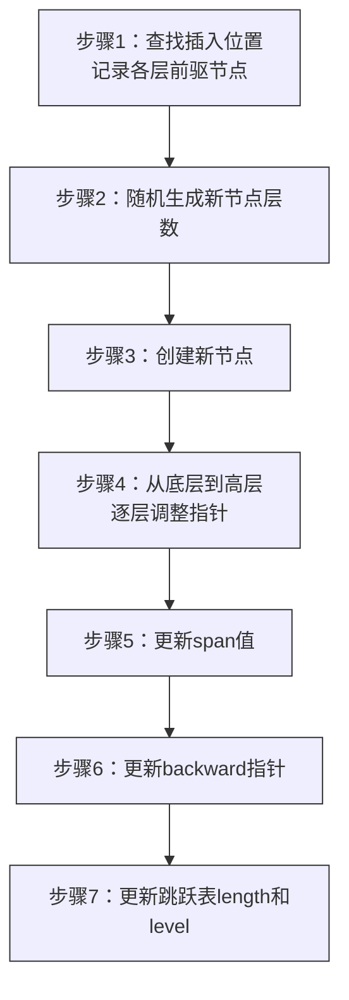
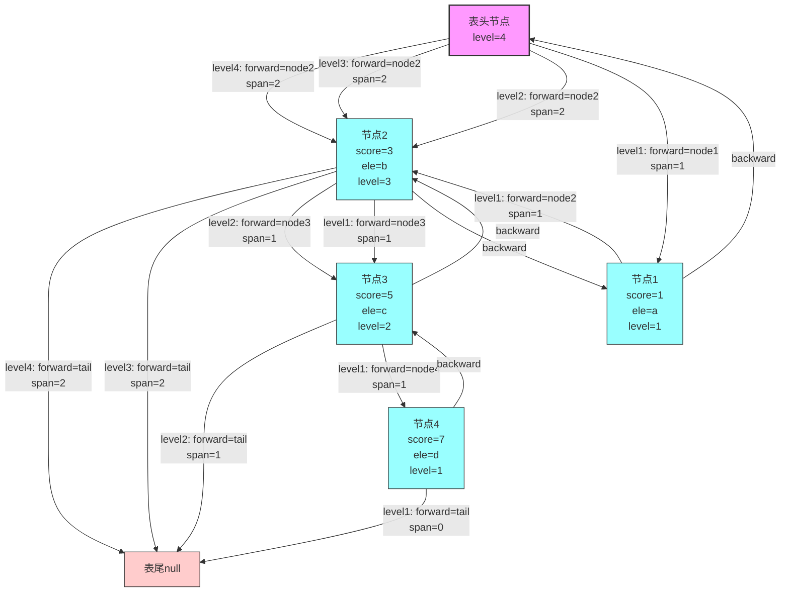

## 基础概念

Redis 的跳跃表（Skip List）是一种高效的**有序数据结构**，核心用于 `ZSET`（有序集合）的底层实现之一（另一个是压缩列表 ziplist，满足条件时才会使用），支持平均 `O(log n)`、最坏 `O(n)` 的查找、插入、删除操作，且实现简单、并发友好，相比平衡二叉树（如红黑树），在同等复杂度下有更低的常数开销。

跳跃表由 William Pugh 于 1990 年提出，Redis 对其进行了**深度优化**，包括引入 `span`（跨度）字段用于快速排名计算、使用柔性数组节省内存、与字典结构协同工作等。

---

## 核心原理

### 基础结构设计

跳跃表的本质是**多层有序链表**，通过"分层"的方式跳过无效节点，实现快速查找：

- **最底层**：是一个完整的有序双向链表，包含所有节点，节点按 `ZSET` 的分值（score）排序，分值相同则按成员（member）的字典序排序
- **上层链表**：是底层链表的"索引层"，每层节点数逐渐减少（通常是下层的 1/2 或 1/4，Redis 中通过随机算法决定节点层数）
- **节点结构**：每个节点包含：
  - 多层前向指针（forward）：指向对应层的下一个节点，用于快速跳转
  - 后退指针（backward）：仅底层节点有，用于反向遍历
  - 分值（score）和成员（member）：存储 `ZSET` 的核心数据

### 核心操作流程

#### 查找操作

1. 从跳跃表的**最高层**的表头开始，沿当前层前向指针查找，直到下一个节点的分值大于目标值，或者到达链表尾部
2. 下降到下一层，重复步骤 1，直到到达最底层
3. 在最底层遍历，找到目标分值和成员对应的节点

```mermaid
graph LR
    %% 步骤定义
    step1[步骤1：从表头最高层开始] --> step2
    step2[步骤2：当前层向右遍历<br/>若下一个节点score<目标则继续] --> step3
    step3[步骤3：无法前进时下降一层] --> step4
    step4[步骤4：重复步骤2-3<br/>直到到达最底层] --> step5
    step5[步骤5：底层遍历找到目标节点]

    %% 查找路径示例
    subgraph 查找路径示例（查找score=5）
        h[表头] -.高层.-> n2[node2(score=3)]
        n2 -.下降.-> n2_low[node2]
        n2_low -.底层.-> n3[node3(score=5)]
    end

    classDef step fill:#eef,stroke:#333,stroke-width:1px
    classDef path fill:#ff9,stroke:#333,stroke-width:1px
    class step1,step2,step3,step4,step5 step
    class h,n2,n2_low,n3 path
```

#### 插入操作

1. 执行查找流程，找到插入位置，并记录每层的前驱节点（用于后续指针调整）
2. 随机生成新节点的**层数**（Redis 中最大层数为 32，通过幂次定律控制，高层节点概率极低）
3. 创建新节点，调整前驱节点和后继节点的指针，完成插入



#### 删除操作

1. 执行查找流程，找到待删除节点，并记录每层的前驱节点
2. 调整前驱节点的前向指针，跳过待删除节点
3. 释放待删除节点的内存，若删除后某层无节点，该层可被忽略（无需显式删除层结构）

### 随机层数算法

Redis 中节点层数的生成是跳跃表性能的关键，采用**无参数的随机算法**：

1. 初始层数为 1
2. 每次以 **1/4 的概率**（Redis 源码中 `ZSKIPLIST_P` 定义为 0.25）向上增加一层，直到达到最大层数 32 或随机失败

```c
#define ZSKIPLIST_MAXLEVEL 32
#define ZSKIPLIST_P 0.25
int zslRandomLevel(void) {
    int level=1;
    while ((random()&0xFFFF) < (ZSKIPLIST_P*0xFFFF))
        level += 1;
    return (level < ZSKIPLIST_MAXLEVEL) ? level : ZSKIPLIST_MAXLEVEL;
}
```

该算法保证高层节点数量呈指数级减少，确保查找路径的平均长度为 `O(log n)`。

---

## 核心结构体

### 节点结构

```c
typedef struct zskiplistNode {
    sds ele;                              // 成员值（SDS 字符串）
    double score;                         // 分值
    struct zskiplistNode *backward;       // 仅底层有，后退指针
    struct zskiplistLevel {
        struct zskiplistNode *forward;    // 本层前向指针
        unsigned long span;               // 跨度，记录到forward节点的距离
    } level[];                            // 柔性数组，按需分配
} zskiplistNode;
```

### 跳跃表结构

```c
typedef struct zskiplist {
    struct zskiplistNode *header, *tail;  // 表头、表尾指针
    unsigned long length;                 // 节点总数（不含表头）
    int level;                            // 当前跳跃表的最大层数
} zskiplist;
```

### ZSET 结构

```c
typedef struct zset {
    dict *dict;          // 字典：member -> score，O(1) 查分值
    zskiplist *zsl;      // 跳跃表：按 score+ele 排序，支持范围查询
} zset;
```

### 跳跃表完整结构



---

## 核心特性与优化

### 关键补充点

1. **span（跨度）**
   - 作用：计算节点的排名（`ZRANK`/`ZREVRANK`），无需遍历整个底层链表；查找时累计 span 即可得到排名
   - 插入/删除时，必须同步更新前驱节点的 span 值

2. **柔性数组 level**
   - 节点的层数由 `zslRandomLevel()` 决定，内存按需分配，避免固定数组浪费
   - 表头节点固定为 32 层（`ZSKIPLIST_MAXLEVEL`），无需随机

3. **zset 双结构协同**
   - 跳跃表负责有序范围查询
   - 字典负责 `O(1)` 成员到分值的映射
   - 两者数据一致，修改时需同时更新

### Redis 特殊优化

- **最大层数限制**：设为 32，足够支撑 $2^\{32\}$ 个节点，避免层数过高导致的内存浪费和查找开销
- **双向遍历支持**：底层节点的后退指针，支持 `ZREVRANGE` 等反向遍历命令
- **同分值节点处理**：当多个节点分值相同时，按成员的字典序排序，保证 `ZSET` 的有序性
- **内存高效设计**：节点的前向指针数组按需分配（根据层数动态申请内存），避免固定数组的内存浪费
- **与压缩列表的切换**：`ZSET` 初始化时若元素少、分值小，使用 ziplist 节省内存；当元素数量或分值大小超过阈值（`zset-max-ziplist-entries`、`zset-max-ziplist-value`），自动转为跳跃表

---

## 关键操作详解

### 排名计算（ZRANK/ZREVRANK）

1. 从最高层表头开始，累计当前层的 span 值
2. 当无法继续前进时，下降一层，重复累计
3. 到达目标节点时，累计的 span 之和即为节点的排名（从 0 开始）

### 范围查询（ZRANGE/ZRANGEBYSCORE）

- **正向范围**：先找到起始节点，再沿底层链表向后遍历，直到满足结束条件
- **反向范围**：通过 backward 指针，从尾部向前遍历
- **边界处理**：
  - 包含/不包含边界值（`(score` 与 `score`）
  - 分值相同的节点，按 member 字典序排序
  - 超出范围时返回空列表

### 同分值节点处理

- **排序规则**：`score` 相同 → 比较 `ele` 的字典序（按 SDS 的 `sdscmp()` 函数）
- **插入时**：若 `score` 相同，必须找到 `ele` 对应的位置，避免重复
- **删除时**：若 `score` 相同，必须指定 `ele` 才能准确删除

---

## 性能优化与内存管理

### 内存优化

1. **节点内存分配**：使用 `zmalloc()` 分配节点，level 数组作为柔性数组紧跟在节点结构体后，内存连续，减少碎片

2. **zset 与 ziplist 的切换阈值**：
   - `zset-max-ziplist-entries`：默认 128，元素数超过则转为 skiplist
   - `zset-max-ziplist-value`：默认 64，成员值长度超过则转为 skiplist
   - 切换是不可逆的（ziplist → skiplist 后，不会自动转回）

### 并发与线程安全

- Redis 是单线程模型，跳跃表的所有操作（插入、删除、查询）都在主线程中执行，无需加锁
- 但在 RDB 持久化、AOF 重写时，会 fork 子进程，此时主线程只能执行读操作，避免跳跃表结构被修改

### 性能边界

- **平均查找长度**：`O(log n)`，常数因子远低于红黑树（无旋转操作）
- **最坏情况**：`O(n)`（所有节点层数为 1，退化为单链表），但概率极低（随机算法保证）
- **内存开销**：索引层的总节点数约为 `n/P`（P=0.25），即 4n 个索引节点，但实际中因层数分布，开销远低于此

---

## 与其他结构的对比

| 结构 | 平均查找复杂度 | 实现复杂度 | 内存开销 | 适合场景 |
| :--- | :--- | :--- | :--- | :--- |
| 跳跃表 | `O(log n)` | 低 | 中（索引层有额外开销） | 有序集合，支持快速插入、删除、范围查询 |
| 红黑树 | `O(log n)` | 高（旋转操作复杂） | 低 | 通用有序结构，适合单值查询 |
| 压缩列表 | `O(n)` | 低 | 极低 | 小规模有序集合 |

---

## 使用场景

Redis 跳跃表仅用于**有序集合（ZSET）** 的底层实现，典型业务场景包括：

- **排行榜**：如用户积分排名、商品销量排名
- **带权重的任务队列**：按优先级处理任务
- **范围查询**：如查询某分值区间内的所有成员

---

## 常见误区

1. **误区**：跳跃表是 Redis 原创？
   - 不是，跳跃表由 William Pugh 于 1990 年提出，Redis 对其进行了优化（如 span、柔性数组、双结构协同等）

2. **误区**：跳跃表的层数越多越好？
   - 不是，层数过多会增加内存开销和查找时的层数切换成本，`ZSKIPLIST_MAXLEVEL=32` 是平衡后的选择

3. **误区**：跳跃表的删除操作会删除空层
   - 跳跃表的 `level` 记录的是当前最大层数，删除节点后，若该层无其他节点，`level` 会减 1；表头节点始终保留 32 层

4. **误区**：跳跃表支持更新分值
   - 跳跃表不支持更新分值，`ZINCRBY` 本质是删除旧节点再插入新节点

---

## 源码关键函数

| 函数 | 作用 |
| :--- | :--- |
| `zslCreate()` | 创建跳跃表 |
| `zslInsert()` | 插入节点（核心函数，包含查找、层数随机、指针与 span 更新） |
| `zslDelete()` | 删除节点 |
| `zslGetRank()` | 获取节点排名 |
| `zslGetElementByRank()` | 根据排名获取节点 |
| `zslFree()` | 释放跳跃表 |

Redis 源码中跳跃表的实现位于 `src/t_zset.c` 和 `src/server.h` 中。

---

## 总结

Redis 跳跃表是一种高效的有序数据结构，核心优势在于：

1. **高效性**：查找、插入、删除均为 `O(log n)` 时间复杂度，优于普通有序链表
2. **简洁性**：实现简单，代码复杂度远低于平衡二叉树
3. **并发友好**：局部修改特性便于实现高效并发控制
4. **空间效率**：索引层总空间为 `O(n)`，是一种合理的空间换时间策略

Redis 通过 `span` 字段实现快速排名计算，通过柔性数组节省内存，通过字典与跳跃表协同工作实现 `O(1)` 的分值查询和 `O(log n)` 的范围查询，在 `ZSET` 场景下展现了优异的性能。
