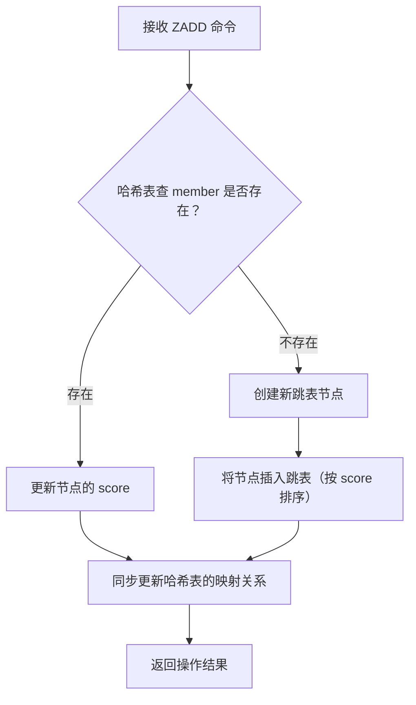
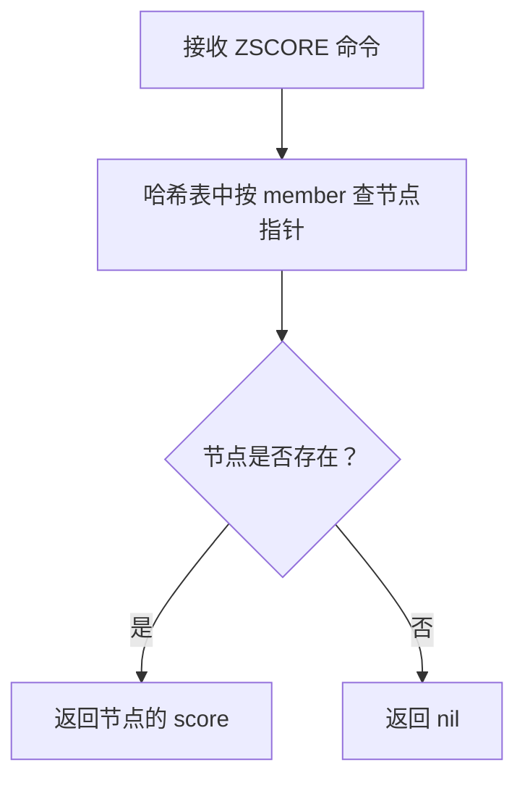
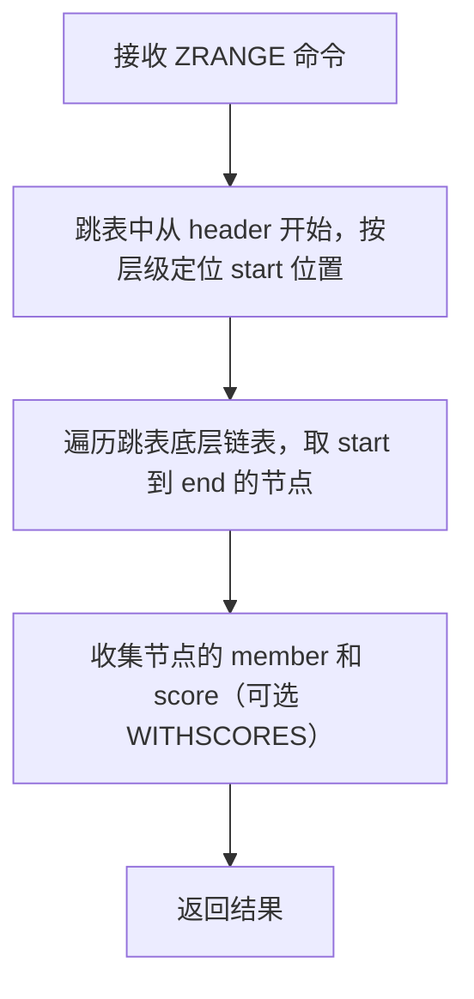

## 核心概念

Redis 的 Sorted Set（有序集合，简称 ZSet）是一种**兼具集合特性和排序特性**的数据结构：

- **集合特性**：和普通集合（Set）一样，元素（member）是**唯一的**，不能重复
- **排序特性**：每个元素会关联一个浮点型的分数（score），Redis 会根据 score 对元素进行**从小到大**的排序（也支持按 score 倒序操作）

注意：score 可以重复，多个 member 可以有相同的 score，此时 Redis 会按 member 的字典序排序。

可以把它理解为：一个"带分数的无重复名单"，名单会自动按分数高低排好序，比如游戏排行榜（分数是积分，member 是玩家ID）、热点文章排行（分数是阅读量，member 是文章ID）都适合用 ZSet 实现。

---

## 核心操作命令

### 基础增删改查

| 命令 | 作用 | 示例 |
|------|------|------|
| `ZADD` | 添加元素（指定 score 和 member） | `ZADD rank 100 "user1" 95 "user2" 98 "user3"`（添加3个玩家到排行榜，分数分别为100/95/98） |
| `ZSCORE` | 获取指定 member 的 score | `ZSCORE rank "user1"` → 返回 "100" |
| `ZREM` | 删除指定 member | `ZREM rank "user2"`（删除玩家user2） |
| `ZCARD` | 获取 ZSet 中元素总数 | `ZCARD rank` → 返回 2（只剩user1和user3） |

### 排序与范围查询

| 命令 | 作用 | 示例 |
|------|------|------|
| `ZRANGE` | 按 score 升序取范围元素（WITHSCORES 可返回分数） | `ZRANGE rank 0 -1 WITHSCORES` → 返回 ["user3", "98", "user1", "100"]（0-1表示全部） |
| `ZREVRANGE` | 按 score 降序取范围元素 | `ZREVRANGE rank 0 1 WITHSCORES` → 返回 ["user1", "100", "user3", "98"]（取前2名） |
| `ZRANK` | 获取 member 的升序排名（从0开始） | `ZRANK rank "user1"` → 返回 1（升序第2位） |
| `ZREVRANK` | 获取 member 的降序排名（从0开始） | `ZREVRANK rank "user1"` → 返回 0（降序第1位） |

### 分数操作

| 命令 | 作用 | 示例 |
|------|------|------|
| `ZINCRBY` | 给指定 member 的 score 增减数值 | `ZINCRBY rank 5 "user3"` → user3的score变为103 |
| `ZRANGEBYSCORE` | 按 score 范围取元素 | `ZRANGEBYSCORE rank 90 100 WITHSCORES` → 返回score在90-100之间的元素 |

---

## 实际使用场景

1. **排行榜系统**：游戏积分排行、文章阅读量排行、商品销量排行，用 `ZREVRANGE` 取前N名，`ZINCRBY` 更新分数

2. **延迟队列**：把任务执行时间作为 score，member 是任务ID，定期用 `ZRANGEBYSCORE` 取出当前时间已到的任务执行

3. **权重排序**：比如消息队列按优先级（score）排序，高优先级先消费

---

## Python 操作示例

以 Python 的 `redis` 库为例（需先安装：`pip install redis`）：

```python
import redis

r = redis.Redis(host='localhost', port=6379, db=0, decode_responses=True)

r.zadd("game_rank", {"player_1": 88, "player_2": 95, "player_3": 92})

score = r.zscore("game_rank", "player_2")
print(f"player_2的分数: {score}")

top2 = r.zrevrange("game_rank", 0, 1, withscores=True)
print("排行榜前2名:", top2)

r.zincrby("game_rank", 5, "player_1")
print("player_1加分后的分数:", r.zscore("game_rank", "player_1"))

rank = r.zrevrank("game_rank", "player_1")
print(f"player_1的排名: 第{rank+1}名")
```

---

## 容易被忽略的核心特性

### 分数（score）的特殊处理

**分数的数值类型**：score 本质是 64 位浮点数（双精度），但 Redis 会将整数形式的浮点数（如 10.0）当作整数存储，且比较时会按数值大小（而非字符串）比较。

- 容易踩坑：如果用 `ZSCORE` 获取 score，返回的是字符串形式（如 "10" 或 "10.5"），程序中需要手动转换为数值类型
- 特殊值处理：score 支持正负无穷（`+inf`/`-inf`），比如 `ZADD key +inf member1`，可用于标记"优先级最高/最低"的元素

**分数相同的元素排序**：当多个元素 score 相同时，Redis 会按元素的**二进制字典序**（lexicographical order）排序，且这个排序是稳定的。

```bash
127.0.0.1:6379> ZADD test 10 a 10 b 10 c
(integer) 3
127.0.0.1:6379> ZRANGE test 0 -1
1) "a"
2) "b"
3) "c"
```

### 批量操作的高效性与限制

**ZADD 的批量与原子性**：`ZADD` 支持一次性添加多个 `score-member` 对（如 `ZADD key 1 m1 2 m2 3 m3`），且整个操作是原子的，适合批量初始化数据。

**ZUNIONSTORE/ZINTERSTORE 的聚合规则**：这两个命令用于多集合的并集/交集计算，默认按 `SUM` 聚合 score，但还支持 `MIN`（取最小 score）、`MAX`（取最大 score），且可指定权重（WEIGHTS）。

```bash
127.0.0.1:6379> ZADD set1 10 a 20 b
(integer) 2
127.0.0.1:6379> ZADD set2 15 a 25 c
(integer) 2
127.0.0.1:6379> ZINTERSTORE result 2 set1 set2 AGGREGATE MAX
(integer) 1
127.0.0.1:6379> ZSCORE result a
"15"
```

### 范围操作的灵活用法

**按 score 范围删除（ZREMRANGEBYSCORE）**：可直接删除 score 在指定区间的元素，比如清理过期的排行榜数据：

```bash
127.0.0.1:6379> ZREMRANGEBYSCORE rank 0 -inf
(integer) 5
```

**按字典序范围查询（ZRANGEBYLEX）**：当所有元素 score 相同时，可通过该命令按字典序查询，适合实现"按字母排序的筛选"：

```bash
127.0.0.1:6379> ZADD dict 0 apple 0 banana 0 cherry 0 date
(integer) 4
127.0.0.1:6379> ZRANGEBYLEX dict [b [c
1) "banana"
2) "cherry"
```

**带偏移和限制的范围查询**：`ZRANGE`/`ZREVRANGE` 支持 `LIMIT offset count`，适合分页查询排行榜：

```bash
127.0.0.1:6379> ZREVRANGE rank 10 19 WITHSCORES
```

### 基数统计与排名细节

**ZCOUNT**：快速统计 score 在指定区间的元素数量，比 `ZRANGEBYSCORE ... COUNT 0 -1` 更高效（无需返回元素，仅统计数量）：

```bash
127.0.0.1:6379> ZCOUNT exam_score 80 100
(integer) 23
```

**ZRANK vs ZREVRANK**：`ZRANK` 是升序排名（score 最小的排第0），`ZREVRANK` 是降序排名（score 最大的排第0），注意**排名从 0 开始**，而非 1：

```bash
127.0.0.1:6379> ZADD rank 90 a 95 b 85 c
(integer) 3
127.0.0.1:6379> ZRANK rank b
(integer) 2
127.0.0.1:6379> ZREVRANK rank b
(integer) 0
```

---

## 性能与实现相关的隐藏细节

1. **底层结构**：Sorted Set 核心是跳表（skiplist），而非红黑树。跳表在 Redis 中实现更简单，且批量插入/范围查询的性能更优；哈希表仅用于快速查询 `member -> score` 的映射

2. **内存优化**：当 Sorted Set 中元素数量少（默认 &lt; 128）且 score 都是整数时，Redis 会用**压缩列表（ziplist）** 代替跳表，大幅节省内存；当超过阈值时自动转为跳表

3. **原子性操作**：所有 Sorted Set 命令都是单线程原子执行的，比如 `ZINCRBY`（给元素 score 增减）无需担心并发问题，适合做"实时排行榜加分"

---

## 易踩坑的边缘场景

1. **score 精度丢失**：由于是 64 位浮点数，极端情况下（如超大数/超高精度小数）可能出现精度丢失，建议：
   - 整数型 score 直接用整数（如时间戳、分数），避免小数
   - 需小数时，放大为整数（如 1.23 分 → 123 分）

2. **member 唯一性**：Sorted Set 的 member 是唯一的，重复 `ZADD` 同一个 member 会覆盖其 score（而非新增）

3. **空集合处理**：对空的 Sorted Set 执行 `ZRANK`/`ZSCORE` 等命令，返回 `nil`，程序中需做非空判断

---

## 底层实现

Redis Sorted Set 的底层存储分为**两种形态**：一种是内存优化的紧凑形态（压缩列表），另一种是标准形态（跳表+哈希表）。Redis 会根据元素数量和 score 特征自动切换，核心目标是**平衡性能和内存占用**。

### 紧凑形态：压缩列表（ziplist）

这是 Redis 为小数据量场景设计的内存优化存储结构，当 Sorted Set 满足以下两个条件时，会使用 ziplist 存储：

- 条件1：有序集合中**元素数量 ≤ 128**（可通过配置 `zset-max-ziplist-entries` 修改）
- 条件2：每个元素的 member 字符串长度 ≤ 64 字节（可通过配置 `zset-max-ziplist-value` 修改）
- 额外隐含条件：score 为整数（非浮点数，Redis 对整数 score 的 ziplist 存储更高效）

**ziplist 存储 Sorted Set 的方式**：

ziplist 是一个连续的内存块，Sorted Set 的每个元素会以「score（整数）+ member（字符串）」的顺序紧凑排列，整体按 score 升序存储（score 相同则按 member 字典序）。

- 优势：**极致节省内存**（连续内存、无冗余指针），适合小体量的 Sorted Set（如小型排行榜、简单权重队列）
- 劣势：范围查询、插入删除的效率较低（O(N)），数据量大时性能下降明显

### 标准形态：跳表（zskiplist）+ 哈希表（dict）

当 Sorted Set 不满足 ziplist 的条件（元素数超 128、member 过长、score 为浮点数），Redis 会自动将其转换为标准形态。在标准形态下，Sorted Set 由跳表和哈希表两部分组成，它们协同工作以提供高效的操作。

#### 结构分工

Sorted Set 中，跳表和哈希表是**互补协作**的关系，而非替代，各自负责不同的核心功能：

| 数据结构 | 核心作用 | 时间复杂度 | 对应常用命令 |
|---------|---------|-----------|-------------|
| 跳表（SkipList） | 维护成员的**有序性**，支持范围查询 | O(logN) | ZRANGE、ZREVRANGE、ZREMRANGEBYSCORE |
| 哈希表（HashTable） | 快速映射「成员 → 分数/跳表节点」 | O(1) | ZSCORE、ZADD（覆盖）、ZRANK（辅助） |

简单来说：
- 跳表管"有序"和"范围"
- 哈希表管"快速查找"
- 两者共享同一个成员的元数据（分数、节点指针），修改时会原子性同步

#### 跳表的核心实现

跳表是一种"分层的有序链表"，可以理解为：给普通有序链表加了"索引层"，用来跳过大量节点，提升查询效率。

- **底层**：是一个普通的有序双向链表（按 score 排序，score 相同则按 member 字典序）
- **上层**：是索引层，每一层都是下一层的"稀疏索引"，层数越高，节点越少
- 查询时：从最高层索引开始，快速定位到目标区间，再逐层下探到底层，最终找到目标节点

Redis 跳表的关键优化点：
- **双向链表**：每个节点有 `backward` 指针，支持反向遍历（如 ZREVRANGE）
- **跨度（span）**：记录节点间的距离，用于快速计算排名（如 ZRANK），无需遍历计数
- **层数限制**：Redis 跳表的最大层数默认是 32 层，足够支撑百万级节点的高效查询

#### 哈希表的实现

Redis 的哈希表就是其通用的 `dict` 结构（底层是哈希表 + 链表解决冲突），在 Sorted Set 中，哈希表的 key 是 Sorted Set 的 **member（成员字符串）**，value 是 **跳表节点指针（zskiplistNode*）**。

哈希表的核心价值：
1. **O(1) 查分数**：执行 `ZSCORE key member` 时，直接通过哈希表找到节点，再取 `score`，无需遍历跳表
2. **O(1) 判重**：执行 `ZADD key score member` 时，先查哈希表，若 member 已存在，直接更新分数（同步跳表），保证 member 唯一性
3. **辅助查排名**：先通过哈希表找到节点，再利用跳表的 `span` 快速计算排名（ZRANK/ZREVRANK）

#### 核心命令的执行逻辑

#### ZADD key score member（新增/更新成员）



存在：直接更新跳表节点的 score，并调整节点在跳表中的位置（重新排序）

不存在：先创建跳表节点并插入跳表，再将 member 和节点指针存入哈希表

#### ZSCORE key member（查成员分数）



全程无需碰跳表，纯哈希表操作，O(1) 效率。

#### ZRANGE key start end（范围查询）



全程依赖跳表的有序性，哈希表仅在需要验证 member 时辅助使用。

#### 为什么不用红黑树？

Redis 作者选择跳表而非红黑树的核心考量：

1. **范围查询更高效**：红黑树的范围查询需要中序遍历，跳表只需遍历底层链表，代码更简单、效率更高
2. **插入/删除实现更简单**：跳表的插入/删除只需调整指针，红黑树需要旋转平衡，代码复杂度高
3. **并发友好**：跳表的修改仅影响局部节点，红黑树的旋转可能影响多个节点
4. **内存可控**：跳表的额外内存是层级指针，红黑树的额外内存是颜色标记+父节点指针，实际内存占用相差不大

---

## 总结

Redis Sorted Set 的核心价值：

1. **基础特性**：唯一元素+分数排序的复合结构，score 可重复、member 不可重复，默认按 score 升序排列

2. **高效操作**：支持高效的排序和范围查询，`ZCOUNT` 比范围查询更高效，`ZUNIONSTORE/ZINTERSTORE` 支持 `MIN/MAX/SUM` 聚合规则

3. **底层实现**：跳表负责维护有序性、支持范围查询（O(logN)），哈希表负责快速映射 member 到节点（O(1)），两者协同保证所有操作的高效性

4. **存储优化**：小数据量时自动使用压缩列表节省内存，大数据量时自动切换为跳表+哈希表保证性能

5. **细节避坑**：排名从 0 开始，member 唯一（重复 ZADD 会覆盖 score），整数 score 可触发内存优化的压缩列表

这些特性在排行榜、延时队列、权重排序等场景中能大幅提升开发效率和性能，是 Sorted Set 的核心价值点。
