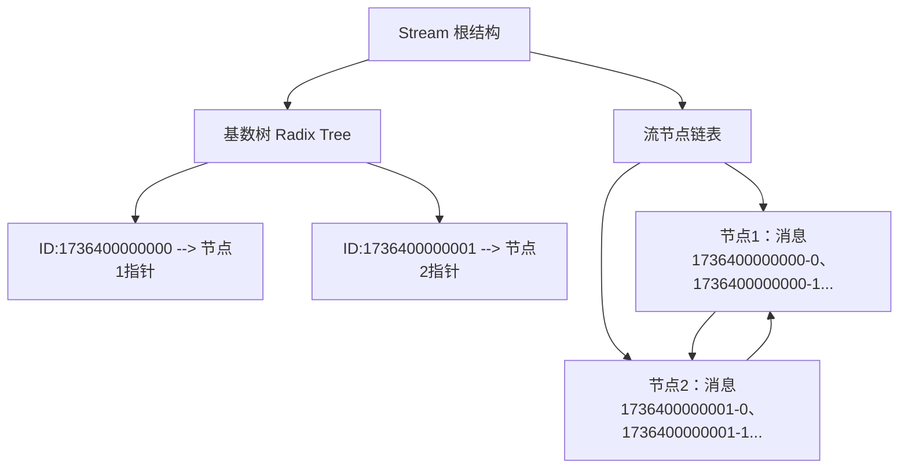
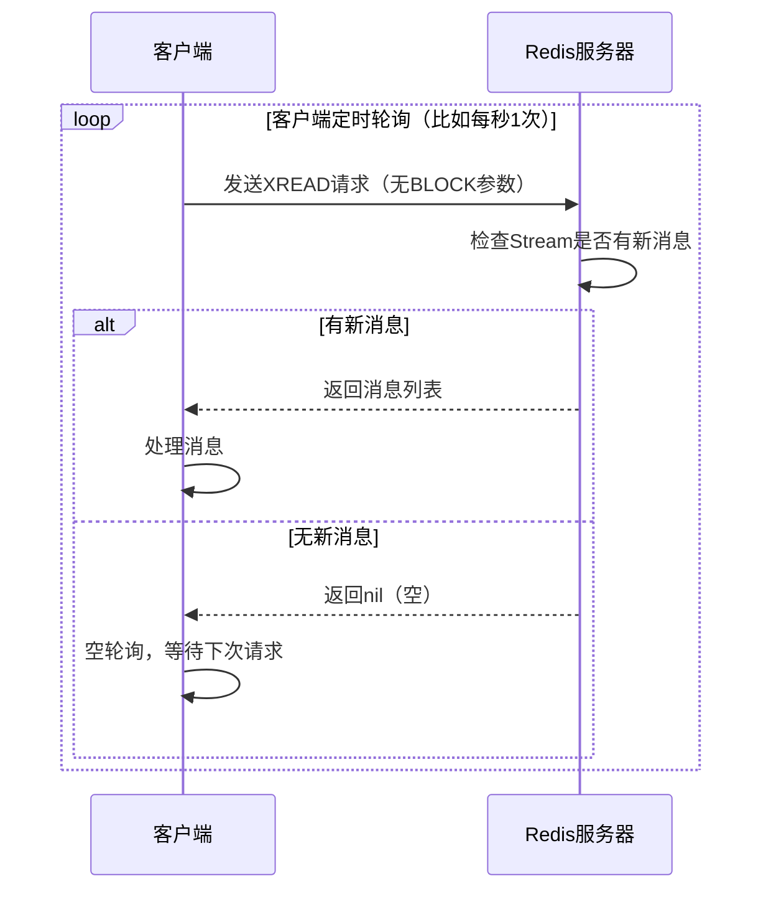

你想了解 Redis 的 Stream 数据类型，我会从基础概念、核心特性、常用操作和典型应用场景几个方面，由浅入深地为你讲解，让你能清晰理解它的作用和用法。

### 一、Stream 是什么？
Redis Stream 是 Redis 5.0 版本引入的一种**持久化的、有序的、可追加的消息队列数据类型**，专门用于解决传统 Redis 消息队列（List/Pub/Sub）的痛点（比如 Pub/Sub 不持久化、List 无法重复消费、没有消费确认机制等）。

你可以把它理解成一个**无限延伸的消息日志**：
- 每条消息都有一个唯一的、按时间递增的 `ID`（格式：`时间戳-序列号`，比如 `1736400000000-0`）；
- 消息以追加的方式写入，顺序严格按照 ID 递增；
- 支持多消费者组、消费确认、消息回溯、未消费消息监控等完整的消息队列特性。

### 二、核心概念
在使用 Stream 前，先理解几个关键概念：
1. **消息（Entry）**：Stream 的基本单元，包含 `ID` 和键值对（比如 `{name: "张三", age: "20"}`）；
2. **消费者组（Consumer Group）**：一组消费者的集合，同一个组内的消费者会**分摊消费**消息（避免重复消费），不同组之间独立消费（可重复消费）；
3. **消费者（Consumer）**：隶属于某个消费组的具体消费实例，有唯一名称；
4. **最后交付 ID（last-delivered-id）**：消费组记录的“已分发给消费者但未确认”的最大消息 ID，用于标识消费进度；
5. **待确认列表（PEL, Pending Entries List）**：记录已分发给消费者但未收到确认的消息，防止消息丢失；
6. **游标（Cursor）**：用于遍历 Stream 所有消息（非消费组模式）。

### 三、常用核心操作
下面通过具体命令示例，展示 Stream 的核心用法（所有命令都可直接在 Redis 客户端执行）。

#### 1. 基础操作：增/查消息
```bash
# 1. 向 Stream 中添加消息（XADD）
# 格式：XADD key ID field1 value1 field2 value2 ...
# * 表示让 Redis 自动生成 ID（推荐）
127.0.0.1:6379> XADD mystream * name Alice age 25
"1736400000000-0"  # 返回自动生成的消息ID

127.0.0.1:6379> XADD mystream * name Bob age 30
"1736400000001-0"

# 2. 读取 Stream 中的消息（XRANGE）
# 格式：XRANGE key start end [COUNT count]
# - 表示最小ID，+ 表示最大ID，COUNT 限制返回数量
127.0.0.1:6379> XRANGE mystream - + COUNT 2
1) 1) "1736400000000-0"
   2) 1) "name"
      2) "Alice"
      3) "age"
      4) "25"
2) 1) "1736400000001-0"
   2) 1) "name"
      2) "Bob"
      3) "age"
      4) "30"

# 3. 查看 Stream 长度（XLEN）
127.0.0.1:6379> XLEN mystream
(integer) 2
```

#### 2. 消费组模式（核心）
消费组是 Stream 最核心的特性，适合多实例分摊消费的场景：
```bash
# 1. 创建消费组（XGROUP CREATE）
# 格式：XGROUP CREATE key groupname ID [MKSTREAM]
# $ 表示从 Stream 最新的消息开始消费，MKSTREAM 表示如果 Stream 不存在则创建
127.0.0.1:6379> XGROUP CREATE mystream mygroup $ MKSTREAM
OK

# 2. 消费组内读取消息（XREADGROUP）
# 格式：XREADGROUP GROUP groupname consumer COUNT count STREAMS key ID
# > 表示读取消费组中未分发过的消息（核心）
127.0.0.1:6379> XREADGROUP GROUP mygroup consumer1 COUNT 1 STREAMS mystream >
1) 1) "mystream"
   2) 1) 1) "1736400000000-0"
         2) 1) "name"
            2) "Alice"
            3) "age"
            4) "25"

# 3. 确认消息消费完成（XACK）
# 格式：XACK key groupname ID [ID ...]
# 确认后，消息会从 PEL 列表中移除
127.0.0.1:6379> XACK mystream mygroup 1736400000000-0
(integer) 1

# 4. 查看消费组未确认的消息（XPENDING）
127.0.0.1:6379> XPENDING mystream mygroup
1) (integer) 0  # 已确认，PEL 为空
```

#### 3. 非消费组模式（简单消费）
适合单消费者读取消息的场景，类似 List 的 `BLPOP`：
```bash
# XREAD 阻塞读取（阻塞10秒，没有消息则返回null）
127.0.0.1:6379> XREAD COUNT 1 BLOCK 10000 STREAMS mystream 0
# 如果有新消息会立即返回，否则10秒后返回(nil)
```

### 四、核心特性总结
1. **持久化**：消息写入后会持久化到 Redis 磁盘（取决于 Redis 持久化策略），重启不丢失；
2. **多播消费**：多个消费组可以独立消费同一份消息（比如一份消息既给订单服务，又给日志服务）；
3. **消费确认**：通过 XACK 实现“至少一次”消费语义，未确认的消息会留在 PEL 中，可重试；
4. **消息回溯**：可以通过 ID 读取任意历史消息（比如消费失败后重新读取）；
5. **阻塞读取**：支持阻塞式读取（BLOCK 参数），避免轮询消耗资源；
6. **容量控制**：可通过 `XTRIM` 命令裁剪旧消息（比如只保留最近1000条），防止内存溢出。

### 五、典型应用场景
1. **分布式消息队列**：替代 Kafka/RabbitMQ 做轻量级消息队列（适合中小规模场景）；
2. **日志存储**：按时间顺序存储系统日志，支持回溯查询；
3. **事件溯源**：记录业务事件（比如订单状态变更），支持基于事件的回溯和分析；
4. **实时数据管道**：比如收集传感器数据、用户行为数据，按时间顺序处理。

### 总结
1. Redis Stream 是 Redis 5.0 引入的**持久化消息队列类型**，弥补了传统 Redis 消息队列的不足；
2. 核心特性是**消费组机制**，支持多消费者分摊消费、消息确认、进度追踪，满足分布式消费需求；
3. 常用命令：XADD（写消息）、XREADGROUP（消费组读）、XACK（确认消费）、XGROUP（管理消费组），是使用 Stream 的核心。


你想深入了解 Redis Stream 的实现原理，我会从底层数据结构、核心机制（如消息存储、消费组、PEL 等）的实现逻辑入手，拆解它是如何支撑起“持久化、有序、可追加之消息队列”这些特性的，让你理解其底层逻辑。

### 一、核心数据结构：Radix Tree + 链表（本质是「基数树+流节点」）
Redis Stream 并非简单的链表或数组，而是基于**基数树（Radix Tree，也叫基数树/前缀树）** + **流节点（Stream Node）** 构建的复合结构，核心目的是平衡「高效写入」和「高效范围查询」。

#### 1. 基础存储结构：流节点（Stream Node）
Stream 的消息不是平铺存储的，而是被划分成多个**流节点（每个节点默认存储 ~100 条消息）**，每个节点包含：
- `prev/next` 指针：串联所有节点，形成双向链表（保证消息的有序性）；
- 消息数组：存储该节点内的消息（每条消息包含 ID、键值对）；
- 节点的最小/最大 ID：快速定位节点范围。

#### 2. 索引结构：基数树（Radix Tree）
为了快速根据消息 ID 定位到对应的流节点，Redis 为 Stream 维护了一棵**基数树**：
- 基数树的 key 是消息 ID 的「时间戳部分」（比如 `1736400000000`）；
- 基数树的 value 是对应时间戳范围内的流节点指针；
- 作用：当执行 `XRANGE key 1736400000000-0 1736400000001-0` 时，Redis 先通过基数树找到时间戳对应的节点，再在节点内遍历，避免全量扫描。

#### 可视化理解


### 二、核心机制的实现原理
#### 1. 消息 ID 生成原理
Stream 自动生成的 ID 格式为 `时间戳-序列号`（如 `1736400000000-0`），保证全局唯一且递增：
- **时间戳部分**：Redis 服务器的毫秒级时间戳（`server.unixtime_ms`）；
- **序列号部分**：同一毫秒内写入的消息序号（从 0 开始递增）；
- 特殊处理：如果服务器时钟回拨（比如时间跳变），Redis 会复用「上一个 ID 的时间戳」并递增序列号，避免 ID 重复或倒退。

#### 2. 消费组（Consumer Group）的实现
消费组是 Stream 最复杂的部分，其元数据全部存储在 Redis 的「键空间」中，每个消费组对应一组核心属性：
```
# 消费组元数据存储格式（伪代码）
stream_key:groups:{group_name} = {
    last_delivered_id: "1736400000000-0",  # 已分发但未确认的最大ID
    consumers: {  # 组内消费者列表
        consumer1: { last_seen: 1736400000, pending_count: 1 },
        consumer2: { last_seen: 1736400001, pending_count: 0 }
    },
    pel: {  # 待确认列表（PEL）
        "1736400000000-0": { consumer: "consumer1", delivery_time: 1736400000 }
    }
}
```
- **last_delivered_id**：消费组的“消费进度”标记，`XREADGROUP GROUP ... >` 就是从这个 ID 的下一条开始分发；
- **PEL（待确认列表）**：核心是「消息 ID → 消费者 + 分发时间」的映射，未 `XACK` 的消息会一直存在，直到确认或被清理；
- **消费者心跳**：Redis 会记录消费者的 `last_seen` 时间，可通过 `XGROUP SETID`/`XGROUP DELCONSUMER` 管理失效消费者。

#### 3. 消息持久化原理
Stream 的持久化完全依赖 Redis 本身的持久化机制（RDB/AOF）：
- **AOF 持久化**：所有 `XADD`/`XGROUP` 等命令会被追加到 AOF 文件中，重启时重放命令恢复 Stream 数据；
- **RDB 持久化**：Redis 会将 Stream 的基数树、节点链表、消费组元数据等序列化到 RDB 文件中，恢复速度比 AOF 快；
- 注意：如果 Redis 未开启持久化，Stream 数据仅存于内存，重启后丢失。

#### 4. 阻塞读取（XREAD/XREADGROUP BLOCK）的实现
Redis 的阻塞读取并非“轮询”，而是基于「事件驱动」的异步模型：
1. 当执行 `XREAD BLOCK 10000 STREAMS mystream >` 时，客户端会被加入 Stream 的「阻塞客户端列表」；
2. 当有新消息（`XADD`）写入该 Stream 时，Redis 会遍历阻塞列表，将消息推送给等待的客户端；
3. 如果超时（比如 10 秒）仍无新消息，Redis 主动返回 `nil`，释放客户端。

### 三、性能优化相关的实现细节
1. **节点拆分**：每个流节点默认存储 ~100 条消息，避免单个节点过大导致遍历/序列化耗时；
2. **内存回收**：通过 `XTRIM` 命令裁剪旧消息时，Redis 会直接释放对应流节点的内存，同时更新基数树索引；
3. **PEL 清理**：可通过 `XPENDING` 查看超时未确认的消息，通过 `XCLAIM` 将消息转移给其他消费者，避免 PEL 无限膨胀。

### 总结
1. Redis Stream 底层基于**基数树 + 流节点链表**实现，既保证了消息的有序追加，又支持高效的范围查询；
2. 消费组的核心是「last_delivered_id（消费进度） + PEL（待确认列表）」的元数据管理，实现了分布式消费的进度追踪和消息可靠性；
3. Stream 的持久化、阻塞读取等特性完全复用 Redis 核心机制，无需额外组件，这也是它轻量高效的关键。


你想弄清楚 Redis Stream 的消息消费到底是 Push（推送）还是 Pull（拉取）模式，这个问题需要结合 Stream 的不同消费方式来拆解——它**本质是 Pull 模式，但通过「阻塞拉取」模拟出了 Push 的效果**，并非纯 Push 模式。

### 一、先明确核心结论
Redis Stream 不存在「服务器主动推送消息给客户端」的纯 Push 模式，所有消费行为的底层都是**客户端主动拉取（Pull）**，只是分为「非阻塞拉取」和「阻塞拉取」两种形式，其中阻塞拉取是最常用的方式，体感上接近 Push。

### 二、两种消费方式的底层逻辑
#### 1. 非阻塞拉取（纯 Pull，不推荐）
这是最基础的 Pull 模式，客户端主动发起请求读取消息，不管有没有新消息都会立即返回：
```bash
# 非阻塞读取：立即返回，有消息则返回消息，无消息则返回空
127.0.0.1:6379> XREAD COUNT 1 STREAMS mystream 0
(nil)  # 无消息时直接返回空
```
- 特点：客户端需要自己控制轮询频率（比如每秒查一次），会导致「空轮询」（大部分请求拿不到消息），浪费服务器资源，实际很少用。

#### 2. 阻塞拉取（Pull + 阻塞，模拟 Push，推荐）
这是 Stream 消费的核心方式，也是你体感上觉得像 Push 的原因：
```bash
# 阻塞拉取：客户端发起请求后，若没有新消息，会被 Redis 挂起（阻塞），直到有新消息或超时才返回
127.0.0.1:6379> XREAD BLOCK 10000 COUNT 1 STREAMS mystream >
# 阻塞10秒，有新消息则立即返回，超时则返回空
```
##### 底层实现逻辑（为什么是 Pull 而非 Push）：
1. 客户端发起 `XREAD BLOCK` 请求后，Redis 会检查是否有新消息：
   - 有新消息：立即返回（Pull 本质）；
   - 无新消息：将客户端加入该 Stream 的「阻塞客户端列表」，并挂起请求（不占用线程）。
2. 当有新消息通过 `XADD` 写入 Stream 时，Redis 会遍历该 Stream 的阻塞客户端列表，主动唤醒等待的客户端，让它们完成「拉取」操作；
3. 客户端被唤醒后，才真正执行「拉取消息」的动作，拿到消息后返回。

简单说：**消息不会主动“推”到客户端，而是客户端先“蹲守”（阻塞），服务器只是在有消息时“叫醒”客户端来拉取**。

#### 消费组模式下的阻塞拉取（同理）
消费组的 `XREADGROUP` 阻塞读取逻辑和上面完全一致，只是多了消费组的进度控制：
```bash
127.0.0.1:6379> XREADGROUP GROUP mygroup consumer1 BLOCK 10000 COUNT 1 STREAMS mystream >
```

### 三、和纯 Push 模式（如 Kafka Push）的区别
为了让你更清晰，对比下纯 Push 模式的特点：
| 特性                | Redis Stream（阻塞 Pull） | 纯 Push 模式（如 Kafka Push） |
|---------------------|---------------------------|------------------------------|
| 主动权              | 客户端（主动发起拉取）    | 服务器（主动推送）           |
| 流量控制            | 客户端控制（COUNT 参数）  | 服务器控制（易压垮客户端）   |
| 连接状态            | 阻塞时连接保持，但无数据传输 | 服务器持续推送数据           |
| 异常恢复            | 客户端重连后重新拉取      | 需客户端记录偏移量，易丢消息 |

### 四、为什么 Redis 选择阻塞 Pull 而非纯 Push
1. **避免客户端被压垮**：纯 Push 模式下，服务器如果推送速度超过客户端处理速度，会导致客户端堆积大量消息、内存溢出；而阻塞 Pull 由客户端控制拉取的 `COUNT`（每次拉取数量），可自主控制消费速度。
2. **简化服务器设计**：Redis 是单线程模型，纯 Push 需要维护大量“推送连接”，而阻塞 Pull 只需管理阻塞列表，唤醒逻辑简单，不影响核心性能。
3. **适配 Redis 核心模型**：Redis 所有命令都是「请求-响应」模型，阻塞 Pull 只是延长了“响应”的时间，完全适配其底层架构，无需重构。

### 总结
1. Redis Stream 的消息消费**本质是 Pull（拉取）模式**，不存在服务器主动推送的纯 Push 机制；
2. 实际使用的「阻塞拉取（BLOCK 参数）」是 Pull + 阻塞的组合，模拟出了 Push 的实时性效果，是兼顾性能和易用性的最优方案；
3. 这种设计既保证了客户端的消费可控性（避免被压垮），又解决了纯轮询 Pull 的资源浪费问题。


你希望用 Mermaid 图直观展示 Redis Stream 消费模式的核心逻辑，我会分别绘制「非阻塞 Pull 模式」「阻塞 Pull 模式（模拟 Push）」和「消费组核心流程」三张图，帮你清晰理解不同消费方式的执行链路。

### 1. 非阻塞 Pull 模式（纯轮询拉取）
这张图展示最基础的纯拉取逻辑，客户端主动轮询，不管有无消息都立即返回：


### 2. 阻塞 Pull 模式（核心，模拟 Push 效果）
这张图是 Stream 最常用的消费方式，客户端阻塞等待，有消息时被唤醒拉取，体感接近 Push：
```mermaid
sequenceDiagram
    participant Client as 客户端
    participant Redis as Redis服务器
    participant Stream as Stream数据结构

    Client->>Redis: 发送XREAD BLOCK请求（阻塞10秒）
    Redis->>Stream: 检查是否有未读取的新消息
    alt 有新消息
        Redis-->>Client: 立即返回消息
        Client->>Client: 处理消息
    else 无新消息
        Redis->>Redis: 将客户端加入Stream的阻塞列表
        note over Redis: 客户端连接保持，但无数据传输
        alt 超时前有新消息写入
            Actor->>Redis: XADD写入新消息
            Redis->>Redis: 遍历阻塞列表，唤醒等待的客户端
            Redis->>Stream: 拉取新消息
            Redis-->>Client: 返回新消息
            Client->>Client: 处理消息
        else 超时（10秒）
            Redis-->>Client: 返回nil
            Client->>Client: 重新发起阻塞请求
        end
    end
```

### 3. 消费组模式核心流程（带PEL和确认机制）
这张图补充消费组的关键环节（分发、确认、PEL管理），完整展示分布式消费逻辑：
```mermaid
graph TD
    A[生产者] -->|XADD| B[Stream消息队列]
    B --> C[消费组Group1]
    C --> C1[last_delivered_id（消费进度）]
    C --> C2[PEL待确认列表]
    C --> C3[消费者Consumer1/2]
    
    %% 消费流程
    C1 -->|1. 根据进度分发未消费消息| C3
    C3 -->|2. 接收消息并处理| D[业务逻辑处理]
    alt 处理成功
        D -->|3. 发送XACK确认| C2
        C2 -->|4. 从PEL移除该消息| C1
    else 处理失败
        D -->|3. 不确认| C2
        C2 -->|4. 消息留在PEL| E[超时后通过XCLAIM转移给其他消费者]
        E --> C3
    end
    
    %% 辅助说明
    note over C1: 记录已分发但未确认的最大ID
    note over C2: 存储已分发、未确认的消息
    note over C3: 组内消费者分摊消费消息
```

### 4. Stream 底层存储结构（补充）
这张图对应之前讲的「基数树+流节点」底层实现，帮你关联消费模式和存储逻辑：
```mermaid
graph TD
    A[Stream根结构] --> B[基数树Radix Tree]
    A --> C[流节点双向链表]
    
    B --> B1[Key:消息ID时间戳1<br/>Value:流节点1指针]
    B --> B2[Key:消息ID时间戳2<br/>Value:流节点2指针]
    
    C --> C1[流节点1<br/>包含：消息1、消息2...（约100条）<br/>minID:时间戳1-0<br/>maxID:时间戳1-99]
    C --> C2[流节点2<br/>包含：消息3、消息4...（约100条）<br/>minID:时间戳2-0<br/>maxID:时间戳2-99]
    
    C1 <--> C2[prev/next指针串联]
    
    note over B: 快速定位消息ID对应的流节点
    note over C: 保证消息有序追加，便于遍历
```

### 总结
1. 非阻塞 Pull 是「客户端主动轮询」，空轮询浪费资源；
2. 阻塞 Pull 是「客户端阻塞等待+有消息时唤醒拉取」，核心还是 Pull 但模拟出 Push 效果；
3. 消费组模式在阻塞 Pull 基础上，增加了「消费进度（last_delivered_id）+ 待确认列表（PEL）」，实现分布式可靠消费。

你可以直接复制这些 Mermaid 代码到支持的编辑器（如 Typora、Mermaid Live Editor）中渲染，查看可视化效果。