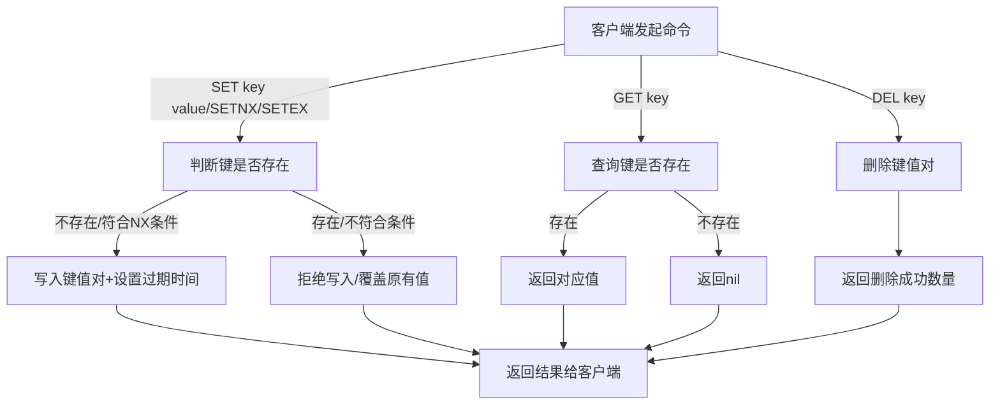
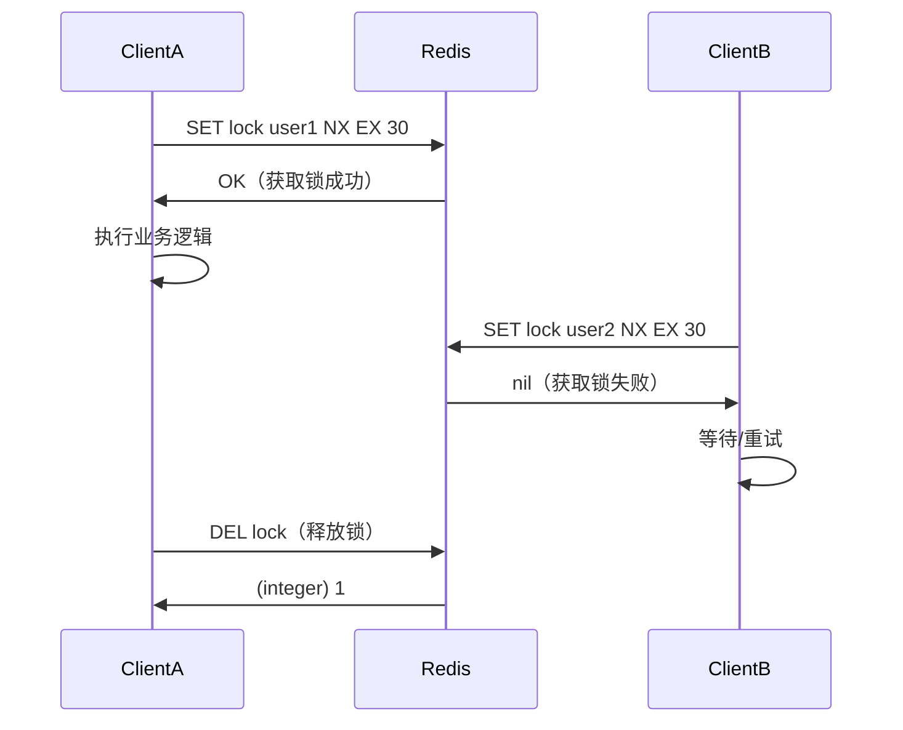
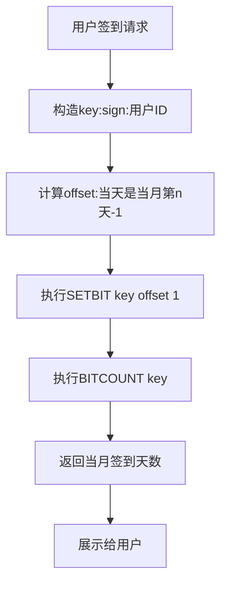
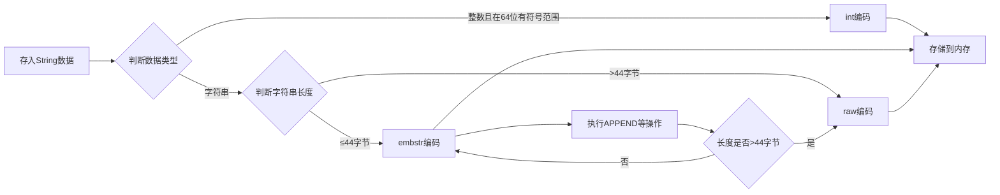

## 核心定义

String 是 Redis 最基础也最常用的数据类型，它并非传统意义上的字符串（仅存文本），而是 `二进制安全的字节序列`：

- 可以存储文本（如 "hello world"）、数字（如 123）、二进制数据（如图片、序列化对象）
- 单个 String 键的最大存储容量为 `512MB`
- 二进制安全意味着 Redis 不会对存储的内容做任何编码/解码，存入什么字节，取出就是什么字节

## 常用命令

### 基础增/改/查/删

| 命令 | 作用 | 示例 | 结果/说明 |
|------|------|------|-----------|
| `SET key value` | 设置键值对（覆盖已有值） | `SET name "zhangsan"` | OK |
| `GET key` | 获取键对应的值 | `GET name` | "zhangsan" |
| `DEL key` | 删除键值对 | `DEL name` | (integer) 1（成功删除1个键） |
| `SETNX key value` | 仅当键不存在时设置 | `SETNX name "lisi"` | (integer) 1（键不存在则成功） |
| `SETEX key sec value` | 设置键值对并指定过期时间 | `SETEX code 60 "123456"` | OK（code 60秒后自动过期） |



### 数字操作

Redis 支持对 String 类型的数字进行原子性增减操作，常用于计数器场景：

```bash
# 初始化计数器
SET view_count 0

# 自增1（原子操作，高并发下不会出错）
INCR view_count  # 结果：(integer) 1

# 自增指定数值
INCRBY view_count 10  # 结果：(integer) 11

# 自减1
DECR view_count  # 结果：(integer) 10

# 自减指定数值
DECRBY view_count 5  # 结果：(integer) 5
```

### 浮点数操作

Redis 提供 `INCRBYFLOAT` 命令支持浮点数的增减运算，其底层逻辑是：从字符串中解析出浮点数 → 执行运算 → 将结果转回字符串存储。

```bash
# 设置浮点数
SET pi 3.1415926535

# 浮点数增加
INCRBYFLOAT pi 0.0000000001  # 结果："3.1415926536"

# 浮点数减少（使用负数）
INCRBYFLOAT pi -1  # 结果："2.1415926536"
```

### 字符串拼接/截取

```bash
# 拼接字符串（追加到末尾）
SET msg "hello"
APPEND msg " world"  # 结果：(integer) 11（拼接后总长度）
GET msg  # 结果："hello world"

# 截取字符串（下标从0开始）
GETRANGE msg 0 4  # 结果："hello"（截取0-4位）
```

---

## 核心特性

### 原子性

所有 String 操作都是原子的（如 INCR），高并发下不会出现数据不一致，适合做计数器、秒杀库存。

### 过期时间

可通过 `SETEX` 或 `EXPIRE key sec` 为 String 设置过期，常用于验证码、临时令牌。

### 批量操作

支持 `MSET`/`MGET` 批量设置/获取多个键值对，减少网络IO：

```bash
MSET a 1 b 2 c 3  # 批量设置
MGET a b c        # 批量获取，结果：1) "1", 2) "2", 3) "3"
```

---

## 典型应用场景

### 计数器

文章阅读量、视频播放量、接口调用次数（用 INCR/INCRBY 实现）。

### 缓存

缓存热点数据（如用户信息、商品详情），减轻数据库压力。

### 验证码

存储手机验证码，设置5分钟过期（SETEX code 300 "6688"）。

### 分布式锁

基于 SETNX 实现（键存在则设置失败，代表锁被占用；键不存在则设置成功，获取锁）。



---

## 进阶命令与用法

### 带过期时间的原子设置

除了 `SETEX`，`SET` 命令支持多个参数组合，实现更灵活的原子操作：

- `SET key value NX EX seconds`：仅当键不存在时设置，同时指定过期时间（原子操作，避免 `SETNX` + `EXPIRE` 两步操作的竞态）
- `SET key value XX PX milliseconds`：仅当键存在时更新，同时设置毫秒级过期时间

示例：

```bash
# 分布式锁场景：原子性获取锁并设置30秒过期
SET lock "user_123" NX EX 30
```

### 字符串长度与替换

- `STRLEN key`：获取字符串的字节长度（注意：中文在 UTF-8 下占3个字节）

  ```bash
  SET name "张三"
  STRLEN name  # 结果：(integer) 6
  ```

- `SETRANGE key offset value`：从指定偏移量开始覆盖字符串内容

  ```bash
  SET msg "hello world"
  SETRANGE msg 6 "redis"  # 从下标6开始替换
  GET msg  # 结果："hello redis"
  ```

### 位操作

Redis String 支持 `按位操作`，这是非常强大的特性，基于字节的二进制位进行计算，常用于布隆过滤器、用户签到、状态统计等场景。

核心命令：

- `SETBIT key offset value`：设置指定偏移量的位值（0/1）
- `GETBIT key offset`：获取指定偏移量的位值
- `BITCOUNT key [start end]`：统计指定字节范围内的 1 的个数
- `BITOP operation destkey key1 [key2...]`：对多个键进行位运算（AND/OR/XOR/NOT）

示例（用户签到）：

```bash
# 用户ID=10086，第10天签到（offset从0开始）
SETBIT sign:10086 9 1
# 统计该用户当月签到天数
BITCOUNT sign:10086
```



---

## 底层实现

Redis String 的底层存储并非固定结构，而是根据 `字符串长度和内容` 选择不同编码，以优化内存：

| 编码类型 | 适用场景 | 内存特点 |
|----------|----------|----------|
| `int` | 字符串是 64 位有符号整数（如 `12345`） | 直接存储整数，不存字符串，内存占用极小 |
| `embstr` | 字符串长度 ≤ 44 字节（Redis 3.2+ 阈值） | 字符串和 Redis 对象头（`redisObject`）连续存储，减少内存碎片，查找快 |
| `raw` | 字符串长度 > 44 字节 | 字符串和对象头分开存储，适合长字符串 |

> 注意：当使用 `APPEND` 命令将 `embstr` 编码的字符串加长到超过 44 字节时，编码会自动转为 `raw`。



### 浮点数编码方式

Redis `并没有专门的 "float 编码类型"`，浮点数的存储取决于具体使用场景：

#### 字符串形式存储（最常见）

当执行 `SET num 3.14` 这类命令时，Redis 会将浮点数转换为字符串存储：

- 将浮点数转换为字符串（如 `"3.14"`）
- 采用 `embstr` 或 `raw` 编码存储这个字符串（取决于字符串长度：≤44 字节用 `embstr`，>44 字节用 `raw`）

```bash
# 设置浮点数
SET pi 3.1415926535

# 查看编码类型（结果是 embstr/raw，而非 float）
OBJECT ENCODING pi  # 结果："embstr"

# 获取值（Redis 会将字符串转回浮点数返回）
GET pi  # 结果："3.1415926535"
```

#### 数值形式存储（特殊场景）

在少数场景下，Redis 会将浮点数转换为整数存储，利用整数编码优化内存：

- `整数型浮点数`（如 `5.0`），Redis 会自动转为整数 `5`，采用 `int` 编码存储（占用更少内存）
- `Geo 类型`（如 `GEOADD` 存储经纬度），Redis 会将经纬度浮点数通过 `geohash 算法` 转换为 64 位整数，再以整数编码存储

```bash
# 存储整数型浮点数，自动转为 int 编码
SET num 5.0
OBJECT ENCODING num  # 结果："int"

# Geo 类型存储经纬度（浮点数→整数）
GEOADD city 116.403874 39.914885 beijing
```

---

## 常见使用陷阱

### 缓存穿透与空值缓存

当查询数据库无结果时，如果不缓存空值，会导致每次请求都打到数据库。可以缓存一个特殊空值（如 `""` 或 `"nil"`）并设置较短过期时间：

```bash
SET user:999 "" EX 60  # 缓存空值，过期时间60秒
```

### 大 Key 问题

String 最大支持 512MB，但存储大 Key（如几十 MB 的二进制数据）会导致：

- 网络传输慢，阻塞 Redis 主线程
- 内存碎片增多
- 删除/序列化时耗时久

解决方案：大文件拆分为多个小 Key，或使用 Redis Module（如 RedisBloom）替代。

### INCR 溢出问题

`INCR` 操作的整数范围是 `64 位有符号整数`（-9223372036854775808 ~ 9223372036854775807），超出范围会抛出错误。实际使用中需做边界判断，或定期重置计数器。

### 浮点数精度问题

由于浮点数本身的二进制存储特性，Redis 浮点数运算可能存在精度丢失：

```bash
SET num 0.1
INCRBYFLOAT num 0.2  # 结果可能为 "0.30000000000000004" 而非 "0.3"
```

解决方案：

- 需要精确计算时，可存储为整数（如存储 1、2，使用时除以 10）
- 或使用 Redis 6.2+ 的 `INCRBY` 配合 `SET` 实现自定义精度处理

### 编码转换注意事项

浮点数的编码会根据操作自动转换：

```bash
# 整数型浮点数使用 int 编码
SET num 5.0
OBJECT ENCODING num  # 结果："int"

# 执行浮点数运算后，编码转为 embstr
INCRBYFLOAT num 0.1  # 值变为 5.1
OBJECT ENCODING num  # 结果："embstr"
```

优化建议：存储浮点数时，优先使用整数型浮点数（如 `5.0`）可利用 Redis 的 `int` 编码优化内存（`int` 编码仅占 8 字节，`embstr` 编码占约 30 字节）。
---
