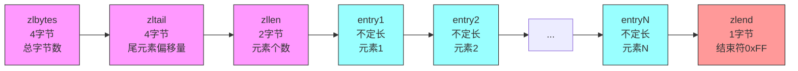
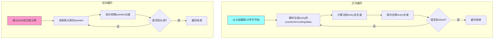
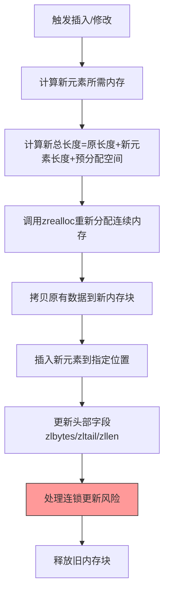
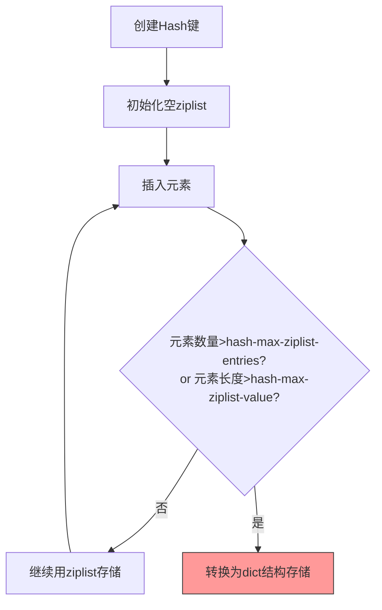

## 基本概念

压缩列表（ziplist）是 Redis 为了节省内存而设计的紧凑的、连续的内存块数据结构，它不是链表（虽然名字带 list），而是一片连续的内存数组。它被用作哈希表（Hash）、列表（List）、有序集合（Zset）的底层实现之一，当这些数据结构的元素数量少、元素长度短时，Redis 会优先使用 ziplist 来存储，以减少内存开销。

简单比喻：普通链表的每个节点都有指针（额外内存），而 ziplist 就像把所有数据"挤"在一段连续的内存里，没有冗余的指针开销，就像把零散的小物件整齐地装进一个收纳盒，而不是每个物件单独装一个盒子。



## 内存结构

ziplist 的内存布局是连续的，整体结构如下（从左到右）：

```
<zlbytes> <zltail> <zllen> <entry1> <entry2> ... <entryN> <zlend>
```

各部分含义：

| 字段    | 长度   | 作用                                                                 |
|---------|--------|----------------------------------------------------------------------|
| zlbytes | 4字节  | 记录整个 ziplist 占用的字节数，修改 ziplist 时可快速重新分配内存     |
| zltail  | 4字节  | 记录 ziplist 最后一个 `entry` 的偏移量，可快速定位到最后一个元素（O(1)） |
| zllen   | 2字节  | 记录 ziplist 中的元素个数，若超过 2^16-1（65535），则需遍历才能统计   |
| entry   | 不定长 | 实际存储的元素（可以是字符串或整数），每个 `entry` 有自己的编码格式     |
| zlend   | 1字节  | 标记 ziplist 的结束，固定值为 0xFF                                    |

单个 `entry` 包含三部分，目的是兼容不同长度的元素，进一步节省内存：

```
<prevlen> <encoding> <data>
```

- `prevlen`：前一个 `entry` 的长度（1 或 5 字节），用于反向遍历（从后往前找元素）
- `encoding`：编码类型（1/2/5 字节），标记 `data` 是字符串还是整数，以及 `data` 的长度
- `data`：实际存储的元素内容（字符串或整数）


## 核心特点

### 优点

**内存紧凑**：连续内存 + 无指针开销，相比普通链表，内存使用率极高

**支持双向遍历**：通过 `zltail` 快速定位尾元素，通过 `prevlen` 反向遍历

**编码优化**：针对短字符串、小整数做了特殊编码，比如整数直接存数值，无需转字符串



### 缺点

**修改效率低**：因为是连续内存，插入/删除元素时，可能需要移动后续所有元素（最坏 O(n)）

**长度限制**：`zllen` 只有 2 字节，超过 65535 个元素时，统计长度需要遍历整个 ziplist

**连锁更新风险**：当修改某个 `entry` 导致 `prevlen` 长度变化（比如从 1 字节变 5 字节），可能引发后续所有 `entry` 的 `prevlen` 依次更新，极端情况下性能下降

---

## 容量分配

ziplist 本质是连续的内存块，Redis 对它的内存分配遵循「按需分配 + 预分配」的原则，核心目标是减少内存重分配的次数，同时避免过度浪费内存。

### 分配的核心逻辑

- ziplist 的内存分配基于 `zmalloc`（Redis 封装的内存分配函数，底层调用 `malloc`/`calloc`）
- 分配的总内存大小 = ziplist 固定头部（zlbytes + zltail + zllen = 10 字节） + 所有 `entry` 占用的字节数 + 结束符 zlend（1 字节）
- 当插入新元素时，Redis 会先计算「新元素需要的内存」+「原有 ziplist 内存」，然后重新分配一块连续内存，再将原有数据和新元素拷贝进去，最后释放旧内存

### 预分配策略

为了避免频繁插入小元素时反复扩容，ziplist 会做少量预分配：

- 若 ziplist 新长度 &lt; 1KB：预分配和新长度相同的额外空间（即分配 2 倍所需内存）
- 若 ziplist 新长度 ≥ 1KB：预分配 1KB 的额外空间
- 预分配的空间不会立即使用，仅用于后续少量插入操作，平衡内存浪费和扩容次数

---

## 初始化

初始化 ziplist 是创建一个空的、最小的 ziplist 内存块，核心步骤如下：

### 初始化的内存结构

空 ziplist 的总长度为 10（头部） + 1（结束符） = 11 字节，各字段初始值：

| 字段    | 初始值 | 含义                     |
|---------|--------|--------------------------|
| zlbytes | 11     | 总占用字节数（11 字节）  |
| zltail  | 10     | 最后一个 `entry` 的偏移量（空 ziplist 中，结束符在偏移量 10 处） |
| zllen   | 0      | 元素个数为 0             |
| zlend   | 0xFF   | 固定结束符               |

### 初始化的代码逻辑

Redis 中初始化 ziplist 的核心函数是 `ziplistNew()`，简化后的伪代码如下：

```c
unsigned char *ziplistNew(void) {
    // 计算空 ziplist 的总长度：10 字节头部 + 1 字节结束符
    unsigned int bytes = sizeof(uint32_t) + sizeof(uint32_t) + sizeof(uint16_t) + 1;
    // 分配内存并初始化为 0
    unsigned char *zl = zmalloc(bytes);
    // 设置 zlbytes：总字节数
    ZIPLIST_BYTES(zl) = bytes;
    // 设置 zltail：结束符的偏移量（头部占 10 字节，结束符从 10 开始）
    ZIPLIST_TAIL_OFFSET(zl) = bytes - 1;
    // 设置 zllen：元素个数为 0
    ZIPLIST_LENGTH(zl) = 0;
    // 设置 zlend：结束符 0xFF
    zl[bytes - 1] = ZIP_END;
    return zl;
}
```

注：`ZIPLIST_BYTES`/`ZIPLIST_TAIL_OFFSET`/`ZIPLIST_LENGTH` 是 Redis 定义的宏，用于快速访问 ziplist 的头部字段。

当你在 Redis 中创建一个空的 Hash/List/Zset 时（如 `HSET empty_hash k1 v1` 前），Redis 会先初始化一个空 ziplist，后续插入元素时再基于此扩容。

---

## 扩容机制

扩容是 ziplist 最核心也最容易出性能问题的环节，触发场景是「插入/修改元素导致原有内存不足」，核心步骤和注意事项如下：

### 扩容的触发条件

- 插入新 `entry` 时，原有内存块无法容纳新 `entry` 的长度
- 修改现有 `entry` 时（如短字符串改成长字符串），`entry` 长度增加导致总内存不足



### 扩容的性能问题：连锁更新

这是 ziplist 扩容最需要注意的点，也是 Redis 限制 ziplist 元素数量的核心原因：

- **触发场景**：当插入/删除元素导致某个 `entry` 的 `prevlen` 字段长度变化（比如从 1 字节变为 5 字节），后续所有 `entry` 的 `prevlen` 都需要重新计算并更新（因为每个 `entry` 的 `prevlen` 记录前一个 `entry` 的长度）
- **极端情况**：若 ziplist 有 N 个元素，连锁更新会导致 O(N) 次内存修改，性能大幅下降
- **Redis 的应对**：通过配置限制 ziplist 的元素数量和元素长度（如 hash-max-ziplist-entries=512），避免 ziplist 过长引发连锁更新

### 扩容的代码逻辑

以插入元素的扩容为例，伪代码如下：

```c
unsigned char *ziplistInsert(unsigned char *zl, unsigned char *p, unsigned char *s, unsigned int slen) {
    // 1. 计算新 entry 所需的内存长度
    unsigned int reqlen = zipEntryBlobLen(s, slen);
    // 2. 计算 ziplist 原有长度
    unsigned int curlen = ZIPLIST_BYTES(zl);
    // 3. 计算新总长度（包含预分配空间）
    unsigned int newlen = curlen + reqlen;
    // 4. 预分配空间（优化逻辑）
    newlen = ziplistPrependSpace(newlen);
    // 5. 重新分配内存
    zl = zrealloc(zl, newlen);
    // 6. 移动原有数据，为新 entry 腾出空间
    memmove(p + reqlen, p, curlen - (p - zl));
    // 7. 写入新 entry
    zipSaveEntry(p, s, slen);
    // 8. 更新头部字段
    ZIPLIST_BYTES(zl) = newlen;
    ZIPLIST_TAIL_OFFSET(zl) = ...; // 重新计算尾元素偏移量
    ZIPLIST_LENGTH(zl) += 1;
    // 9. 处理可能的连锁更新
    zl = zipFixPrevlen(zl, p);
    return zl;
}
```

---

## 使用场景

Redis 配置中可以通过以下参数控制是否使用 ziplist：

- 哈希表：`hash-max-ziplist-entries`（默认 512）、`hash-max-ziplist-value`（默认 64）
- 列表：`list-max-ziplist-size`（默认 -2，代表按字节控制）
- 有序集合：`zset-max-ziplist-entries`（默认 128）、`zset-max-ziplist-value`（默认 64）

当数据量/元素长度超过上述阈值时，Redis 会自动将 ziplist 转换为更高效的结构（比如 Hash 转成 dict，List 转成 quicklist，Zset 转成 skiplist + dict）。



## 实际示例

当你创建一个小哈希表时，Redis 会用 ziplist 存储：

```bash
# 127.0.0.1:6379> HSET user name "tom" age 18
# (integer) 2

# 查看底层编码（ziplist）
127.0.0.1:6379> OBJECT ENCODING user
"ziplist"

# 插入大量元素，触发转换
127.0.0.1:6379> for i in {1..513} do HSET user k$i v$i done
# 再次查看编码（转成 hashtable）
127.0.0.1:6379> OBJECT ENCODING user
"hashtable"
```

## 总结

ziplist 是 Redis 为节省内存设计的紧凑连续内存结构，无指针开销，适合存储少量、短长度的元素。核心优势是内存高效，核心劣势是修改时可能触发移动/连锁更新，性能随元素数量增加下降。Redis 会根据配置阈值自动在 ziplist 和其他结构（如 dict、quicklist）间切换，平衡内存和性能。

关键点：ziplist 的扩容本质是「内存重分配 + 数据拷贝」，这也是它适合小数据量、不适合频繁修改的核心原因。
