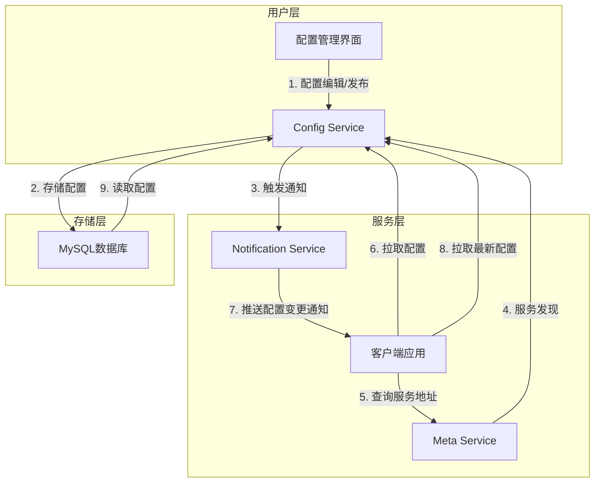
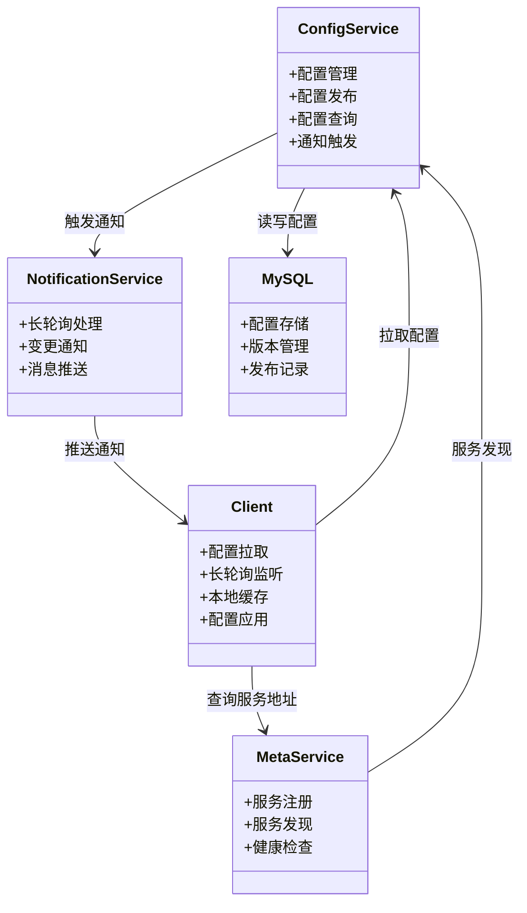
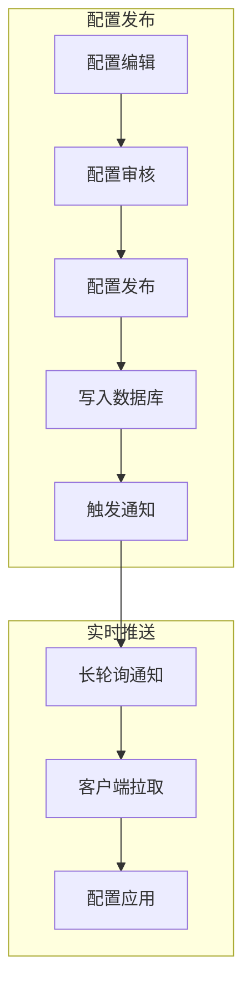
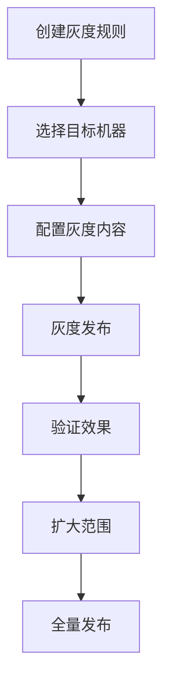

## 一、概述
**Apollo** 是一款由**携程开源**的**分布式配置中心**，专为解决**微服务架构**下的配置管理难题而设计。它提供了一套完整的配置管理解决方案，包括**配置的集中管理、实时推送、版本控制、灰度发布**等核心功能，帮助开发者轻松应对分布式系统中的配置挑战。

**核心价值**：通过集中化、实时化、可视化的配置管理服务，实现配置统一管理、动态更新与灰度发布，简化分布式系统配置维护，降低配置变更风险，提高系统的可用性和可靠性。

**技术栈支持**：Apollo支持多种语言客户端接入，包括**Java、Go、Python、.NET**等，可广泛应用于微服务架构、分布式系统及多环境部署场景。

**部署要求**：Apollo需要**JDK 1.8+**、**MySQL 5.6.5+**作为基础环境，管理界面可选择部署在**Tomcat 7.0.92+**上。

## 二、核心原理
随着微服务架构的普及，传统的本地配置文件方式逐渐暴露出诸多问题：**配置分散难以管理、更新配置需要重启服务、无法实现灰度发布**等。为了解决这些问题，Apollo应运而生，提供了一套完整的配置中心解决方案。

**关键机制**：
- **配置存储**：所有配置集中存储在**MySQL数据库**中，确保数据的持久化与一致性，支持配置的版本管理和回滚
- **实时推送**：基于**HTTP长轮询机制**，客户端定时向服务器发起请求，服务器在配置变更时立即返回最新配置，实现配置的实时更新
- **灰度发布**：支持按**集群、按机器分组**进行配置灰度发布，可逐步扩大影响范围，降低配置变更风险

可以将Apollo比作一个**配置超市**，各个服务实例作为顾客，可以实时获取最新的配置商品，并且支持**定向配送（灰度发布）**，确保配置变更的安全性和可控性。

### 架构与数据流转
Apollo采用**多服务架构设计**，主要包含以下核心服务：

**架构图**：

**核心组件关系图**：

**核心服务作用**：
1. **配置管理界面**：提供可视化的配置编辑、发布、回滚等操作界面，是**用户与Apollo交互的主要入口**
2. **Config Service**：**核心服务**，负责配置的读取、推送和管理，处理客户端的配置请求，将配置变更推送给客户端
3. **Meta Service**：提供**服务发现功能**，客户端通过Meta Service获取Config Service的地址列表
4. **Notification Service**：负责**配置变更的实时通知**，当配置变更时，通过HTTP长轮询机制通知客户端
5. **MySQL数据库**：**存储所有配置数据**，包括配置内容、版本信息、发布记录等

**数据流转过程**：
1. **配置发布**：用户在配置管理界面编辑并发布配置，配置信息存储到MySQL数据库
2. **服务注册**：Config Service启动时向Meta Service注册自身信息
3. **服务发现**：客户端通过Meta Service获取Config Service的地址列表
4. **配置拉取**：客户端从Config Service拉取当前配置
5. **配置变更**：当配置变更时，Config Service触发Notification Service，通过HTTP长轮询通知客户端
6. **配置更新**：客户端收到通知后，从Config Service拉取最新配置并应用

## 三、核心特性
**Apollo** 具备七大核心特性，为分布式系统提供全面的配置管理支持：

- **集中管理**：统一管理所有环境、所有应用的配置，支持可视化管理界面，避免配置分散导致的管理混乱
- **动态更新**：配置变更后客户端实时感知，无需重启应用，缩短配置生效时间
- **灰度发布**：支持按集群、机器分组进行配置灰度发布，逐步扩大影响范围，降低变更风险
- **版本管理**：记录配置的每一次变更，包括变更内容、变更人和变更时间，支持回滚到任意历史版本
- **权限控制**：提供细粒度的权限管理，支持配置的编辑、发布权限控制，确保配置安全
- **多环境支持**：支持开发、测试、生产等多环境配置管理，环境间配置隔离，避免环境间影响
- **多语言支持**：提供Java、Go、Python、.NET等多种语言客户端SDK，满足不同技术栈需求

## 四、典型应用场景
**Apollo** 可广泛应用于各种分布式系统场景：

- **微服务配置管理**：统一管理多个微服务的配置，实现配置的集中化与动态更新，简化微服务架构下的配置维护工作
- **多环境配置隔离**：为开发、测试、生产等不同环境提供独立配置管理，避免环境间配置混乱与误操作
- **灰度发布场景**：新功能上线时通过灰度发布配置，逐步验证功能稳定性，降低配置变更对系统的影响风险
- **应急配置变更**：线上问题紧急修复时，无需重启应用即可快速更新配置，缩短故障恢复时间
- **配置权限管控**：根据不同角色分配配置操作权限，确保配置变更的安全性与可追溯性

## 五、常见问题与解决方案
使用**Apollo**过程中可能遇到的典型问题及解决方案：

- **配置推送延迟**：检查网络连接状态，确保客户端与服务器之间网络畅通；调整客户端长轮询间隔（默认5秒）可优化推送时效性
- **配置回滚失败**：确认MySQL数据库连接正常；检查配置版本号是否正确，确保回滚操作指向有效的历史版本
- **客户端无法连接**：验证Meta Service地址配置是否正确；检查网络可达性，排查防火墙等网络限制
- **配置冲突**：利用Apollo的配置合并策略，明确配置的加载顺序和优先级，避免不同配置源之间的冲突

## 六、配置中心选型对比
主流配置中心对比分析：

| 对比维度 | **Apollo** | **Nacos** | **Spring Cloud Config** |
| --- | --- | --- | --- |
| **开源组织** | 携程 | 阿里巴巴 | Spring Cloud |
| **核心功能** | 配置管理、实时推送、灰度发布、权限控制、版本管理、多环境支持 | 配置管理、服务发现、实时推送、灰度发布 | 配置管理、版本管理、多环境支持 |
| **实时推送** | ✅ **支持**（HTTP长轮询） | ✅ **支持**（HTTP长轮询/GRPC） | ❌ **不支持**（需结合Spring Cloud Bus实现） |
| **灰度发布** | ✅ **支持**（按集群/机器分组） | ✅ **支持**（按命名空间/Group） | ❌ **不支持**（需自行实现） |
| **权限控制** | ✅ **支持**（细粒度权限管理） | ✅ **支持**（基本权限控制） | ❌ **不支持**（需结合外部权限系统） |
| **服务发现** | ❌ **不支持**（仅配置中心） | ✅ **支持**（集配置中心与服务发现于一体） | ❌ **不支持**（仅配置中心） |
| **版本管理** | ✅ **支持**（完整版本记录与回滚） | ✅ **支持**（基本版本管理） | ✅ **支持**（基于Git版本管理） |
| **多环境支持** | ✅ **支持**（环境间配置隔离） | ✅ **支持**（环境间配置隔离） | ✅ **支持**（基于Git分支/目录） |
| **部署复杂度** | ⭐⭐⭐ **中等**（需部署多个服务组件） | ⭐⭐ **简单**（单服务部署，支持集群） | ⭐⭐ **简单**（基于Git，需部署Config Server） |
| **适用场景** | 中大型企业、对配置管理要求高的场景 | 微服务架构、需要服务发现的场景 | Spring生态应用、对实时推送要求不高的场景 |
| **技术栈支持** | 多语言（Java、Go、Python、.NET等） | 多语言（Java、Go、Python、.NET等） | 主要支持Java/Spring应用 |
| **企业级特性** | ✅ **丰富**（完整的权限管理、审计日志等） | ✅ **基础**（基本的企业级特性） | ❌ **缺乏**（需结合其他组件） |

**选型建议**：
- 中大型企业推荐使用Apollo，提供全面的企业级配置管理特性
- 微服务架构推荐使用Nacos，集配置中心与服务发现于一体，部署简单
- Spring生态应用可考虑Spring Cloud Config，但需结合Spring Cloud Bus实现实时推送功能

## 七、核心实现原理

### 7.1 配置发布与实时推送

**配置发布流程**确保配置变更的安全性和可靠性：

**HTTP长轮询机制**实现实时推送：
- 客户端发起长轮询请求（默认90秒超时）
- 服务器挂起请求，等待配置变更或超时
- 配置变更时立即响应，客户端拉取最新配置
- 通过连接池复用、批量通知等优化提高效率

### 7.2 灰度发布机制

**灰度发布**支持按集群、机器分组进行配置灰度：

**核心实现**：
- 灰度规则存储在MySQL数据库
- 客户端请求时根据IP、机器名匹配灰度规则
- 灰度配置拥有独立版本号，支持独立回滚
- 提供灰度使用情况监控

### 7.3 客户端工作原理

**客户端初始化流程**：
1. 加载本地缓存配置
2. 从Config Service拉取最新配置
3. 启动长轮询监听配置变更
4. 注册配置监听器处理变更事件

**本地缓存机制**：
- 配置缓存到本地文件，确保应用重启时快速获取
- 先更新内存配置，再异步更新本地缓存
- 使用JSON格式存储，包含版本号和过期时间

### 7.4 一致性与性能保证

**数据一致性设计**：
- 采用最终一致性模型，保证配置在所有节点最终达到一致状态
- 数据库事务确保配置写入的原子性和完整性
- 基于版本号和发布时间的机制判断配置是否需要更新
- 配置内容MD5校验和快速判断配置一致性
- 自动重试机制确保配置在网络异常时最终获取成功
- 配置变更通知的顺序保证机制

**性能优化策略**：
- **服务端优化**：
  - 多级缓存架构（JVM内存缓存→Redis分布式缓存→MySQL持久化存储）
  - 异步非阻塞处理配置变更通知
  - 批量请求合并减少数据库访问压力
  - 读写分离架构提升并发处理能力
  - 连接池管理优化网络资源使用
- **客户端优化**：
  - 本地文件缓存机制减少网络请求
  - 批量拉取多个配置项提升效率
  - HTTP长轮询连接复用和超时优化
  - 异步更新机制避免阻塞主业务线程
  - 配置变更事件的增量处理

### 7.5 高可用与安全机制

**高可用设计**：
- 所有核心服务支持集群部署
- Meta Service实现服务发现
- 定期健康检查，自动剔除不健康节点
- 客户端支持自动故障转移
- MySQL主从复制确保数据高可用

**安全机制**：
- 基于Token的身份认证
- 细粒度权限控制（按应用、环境、操作类型）
- HTTPS协议支持数据传输安全
- 配置内容签名防篡改
- 敏感配置加密存储
- IP白名单和限流保护
