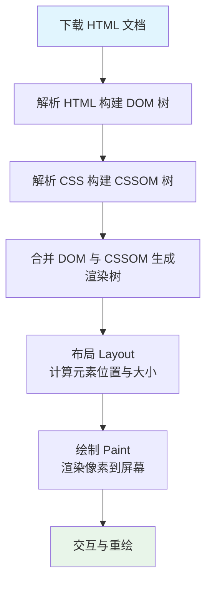
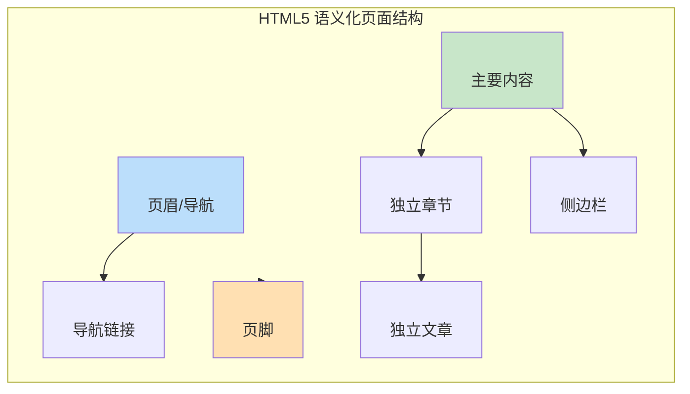
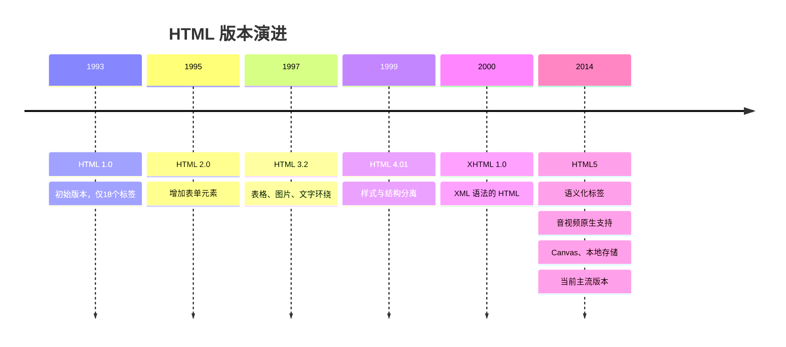
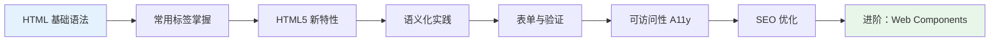

# HTML 标记语言

HTML（HyperText Markup Language，超文本标记语言）是构建 Web 页面的基石。它不是编程语言，而是一种**标记语言**，通过预定义的标签来描述网页的结构和内容。

> **一句话概括**：HTML 定义网页里有什么、按什么结构排列；CSS 负责「美化」（样式）；JavaScript 负责「交互」（动态效果）。

---

## 核心概念

### 文档结构

一个完整的 HTML5 文档包含以下基本骨架：

```html
<!DOCTYPE html>
<html lang="zh-CN">
<head>
    <meta charset="UTF-8">
    <meta name="viewport" content="width=device-width, initial-scale=1.0">
    <title>页面标题</title>
</head>
<body>
    <!-- 页面可见内容 -->
</body>
</html>
```

| 组成部分 | 说明 |
|---------|------|
| `<!DOCTYPE html>` | 文档类型声明，告诉浏览器使用 HTML5 标准渲染 |
| `<html>` | 根元素，包裹整个页面内容 |
| `<head>` | 元数据区域，包含字符集、视口设置、标题、样式链接等 |
| `<body>` | 可见内容区域，所有显示在页面上的元素都在这里 |

### 元素与标签

HTML 使用**标签（Tag）**来标记内容，标签通常成对出现：

```html
<p>这是一个段落元素</p>
<!--  ↑开始标签    ↑结束标签  -->
```

标签可以包含**属性（Attribute）**，用于提供额外信息：

```html

<!--   ↑属性名   ↑属性值                    -->
```

---

## HTML 文档渲染流程

浏览器解析 HTML 的过程遵循特定的顺序：



> **关键理解**：HTML 的解析是**阻塞式**的——遇到 `<script>` 标签会暂停解析，下载并执行完脚本后才继续。因此通常将脚本放在 `</body>` 前，或使用 `defer`/`async` 属性。

---

## 常用标签分类

### 1. 文本内容标签

```html
<!-- 标题：h1 最重要，h6 最不重要 -->
<h1>一级标题</h1>
<h2>二级标题</h2>

<!-- 段落与文本 -->
<p>普通段落文本</p>
<strong>重要文本（加粗）</strong>
<em>强调文本（斜体）</em>
<code>代码片段</code>
```

### 2. 链接与媒体

```html
<!-- 超链接 -->
<a href="https://example.com" target="_blank">打开新标签页</a>

<!-- 图片 -->


<!-- 音视频 -->
<video src="movie.mp4" controls poster="preview.jpg"></video>
<audio src="music.mp3" controls></audio>
```

### 3. 列表与表格

```html
<!-- 无序列表 -->
<ul>
    <li>列表项 A</li>
    <li>列表项 B</li>
</ul>

<!-- 有序列表 -->
<ol>
    <li>第一步</li>
    <li>第二步</li>
</ol>

<!-- 表格 -->
<table>
    <thead>
        <tr><th>姓名</th><th>年龄</th></tr>
    </thead>
    <tbody>
        <tr><td>张三</td><td>25</td></tr>
    </tbody>
</table>
```

### 4. 表单元素

表单是用户与网页交互的核心：

```html
<form action="/submit" method="POST">
    <!-- 文本输入 -->
    <input type="text" name="username" placeholder="用户名" required>
    
    <!-- 密码输入 -->
    <input type="password" name="password" placeholder="密码">
    
    <!-- 邮箱输入（自带格式验证） -->
    <input type="email" name="email" placeholder="邮箱">
    
    <!-- 单选按钮 -->
    <input type="radio" name="gender" value="male"> 男
    <input type="radio" name="gender" value="female"> 女
    
    <!-- 多选框 -->
    <input type="checkbox" name="hobbies" value="reading"> 阅读
    
    <!-- 下拉选择 -->
    <select name="city">
        <option value="beijing">北京</option>
        <option value="shanghai">上海</option>
    </select>
    
    <!-- 提交按钮 -->
    <button type="submit">提交</button>
</form>
```

---

## HTML5 语义化标签

HTML5 引入了一系列**语义化标签**，让文档结构更清晰，对搜索引擎和辅助技术更友好：



### 语义化标签速查

| 标签 | 用途 | 示例 |
|------|------|------|
| `<header>` | 页面或区块的头部 | 包含 logo、导航、搜索框 |
| `<nav>` | 导航链接区域 | 主导航菜单、面包屑 |
| `<main>` | 页面主要内容（每个页面唯一） | 文章正文、产品列表 |
| `<article>` | 可独立分发的内容块 | 博客文章、新闻条目、评论 |
| `<section>` | 主题相关的章节 | 章节划分、功能区块 |
| `<aside>` | 辅助/侧边内容 | 侧边栏、相关推荐、广告 |
| `<footer>` | 页面或区块的底部 | 版权信息、联系方式 |
| `<figure>` / `<figcaption>` | 图文组合 | 图片配说明文字 |

### 语义化对比示例

**传统 div 写法（语义不明）：**

```html
<div class="header">
    <div class="nav">...</div>
</div>
<div class="main">
    <div class="article">...</div>
    <div class="sidebar">...</div>
</div>
<div class="footer">...</div>
```

**语义化写法（结构清晰）：**

```html
<header>
    <nav>...</nav>
</header>
<main>
    <article>...</article>
    <aside>...</aside>
</main>
<footer>...</footer>
```

> **为什么语义化很重要？**
> 1. **SEO**：搜索引擎更易理解页面结构，提升排名
> 2. **可访问性**：屏幕阅读器能为视障用户提供更好的导航
> 3. **可维护性**：代码更易读，团队协作更高效

---

## HTML 发展历程



### HTML5 核心新特性

| 特性 | 说明 | 示例标签 |
|------|------|----------|
| **语义化标签** | 更清晰的文档结构 | `<header>`, `<article>`, `<nav>` |
| **多媒体支持** | 原生播放音视频 | `<video>`, `<audio>` |
| **图形绘制** | 2D/3D 图形渲染 | `<canvas>`, WebGL |
| **本地存储** | 客户端数据持久化 | `localStorage`, `sessionStorage` |
| **表单增强** | 更多输入类型与验证 | `type="email"`, `required`, `pattern` |
| **离线应用** | 支持离线访问 | Service Worker, Cache API |
| **地理定位** | 获取用户位置 | Geolocation API |

---

## 最佳实践

### 1. 文档基础配置

```html
<!DOCTYPE html>
<html lang="zh-CN">
<head>
    <meta charset="UTF-8">
    <!-- 响应式视口设置 -->
    <meta name="viewport" content="width=device-width, initial-scale=1.0">
    <!-- SEO 描述 -->
    <meta name="description" content="页面描述，用于搜索结果展示">
    <title>页面标题 | 网站名称</title>
</head>
```

### 2. 图片优化

```html
<!-- 使用 srcset 响应式图片 -->

```

### 3. 表单可访问性

```html
<!-- 始终关联 label 与 input -->
<label for="email">邮箱地址</label>
<input type="email" id="email" name="email" aria-required="true">

<!-- 或 -->
<label>
    邮箱地址
    <input type="email" name="email">
</label>
```

### 4. 常见误区

| ❌ 不推荐 | ✅ 推荐 | 原因 |
|---------|--------|------|
| `<div class="header">` | `<header>` | 语义化标签更易读 |
| `<b>` / `<i>` | `<strong>` / `<em>` | 后者具有语义含义 |
| `<br><br>` 换行 | 使用 CSS margin | 样式与结构分离 |
| 表格用于布局 | 使用 Flexbox / Grid | 表格仅用于数据展示 |
| 忽略 `alt` 属性 | 始终添加 `alt` | 可访问性与 SEO |

---

## 学习路径



1. **基础阶段**：掌握文档结构、常用标签、属性用法
2. **进阶阶段**：深入语义化标签、表单验证、多媒体
3. **实践阶段**：关注可访问性、SEO、性能优化
4. **高级阶段**：探索 Web Components、Shadow DOM

---

## 参考资源

- [MDN HTML 文档](https://developer.mozilla.org/zh-CN/docs/Web/HTML) — 最权威的中文参考
- [HTML Living Standard](https://html.spec.whatwg.org/) — 官方规范
- [Can I use](https://caniuse.com/) — 浏览器兼容性查询
- [W3C HTML Validator](https://validator.w3.org/) — HTML 代码验证工具

---

> 本章内容涵盖 HTML 的核心概念与最佳实践。后续文章将深入探讨语义化标签、表单验证、可访问性等专题。
