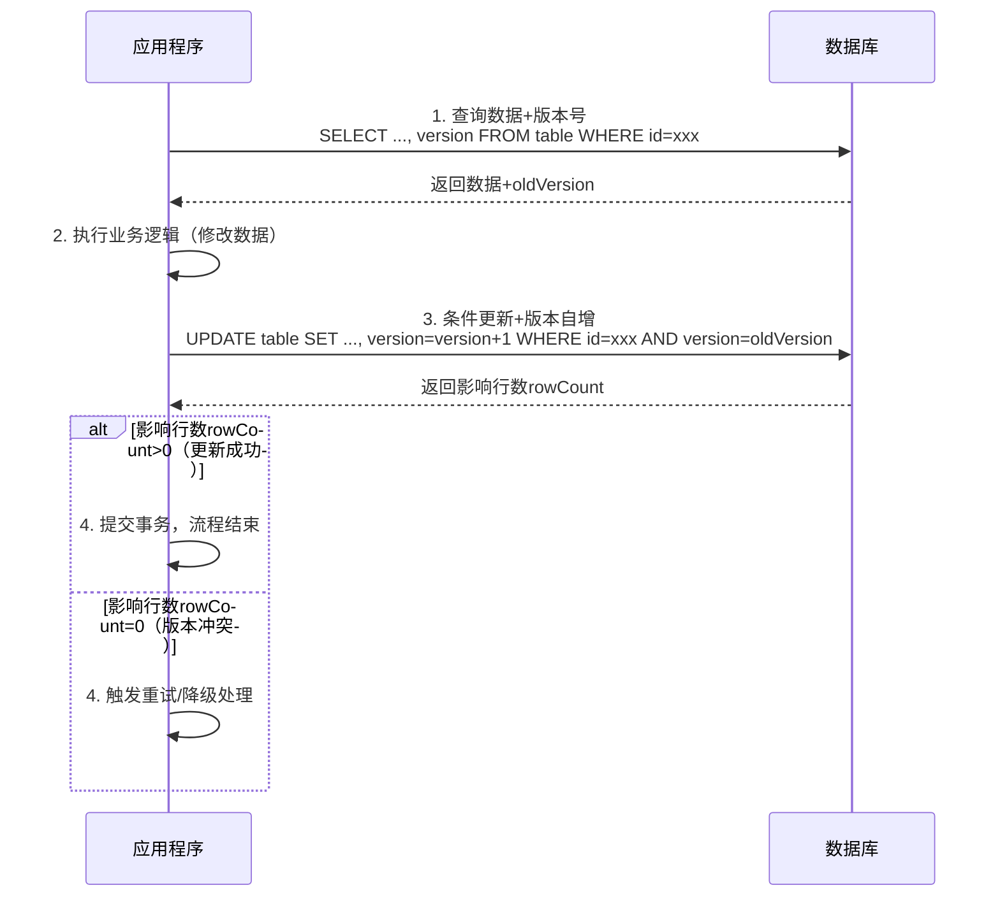
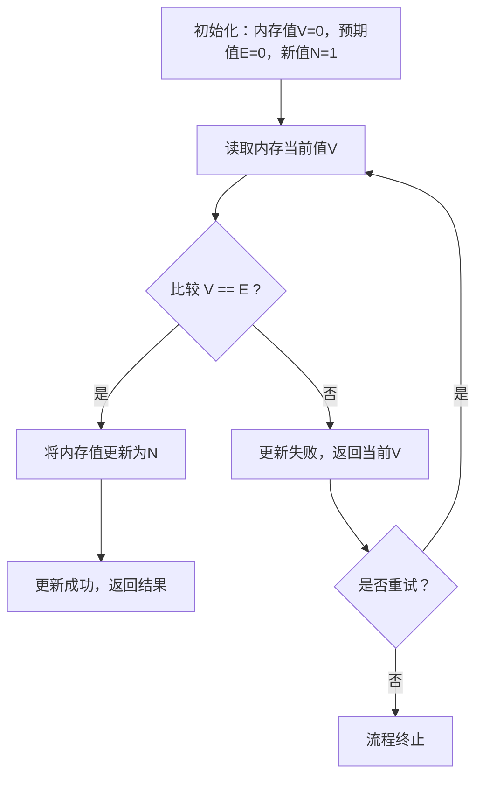
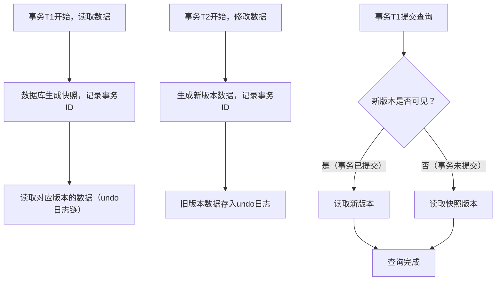
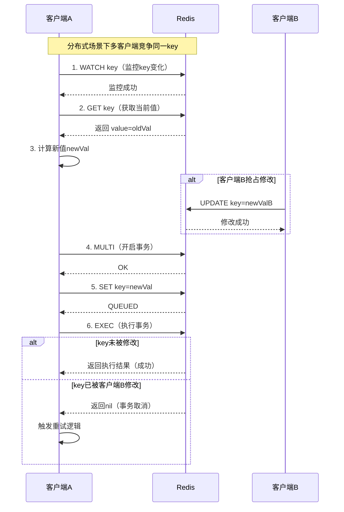

## 核心定义与设计思想

乐观锁是一种非阻塞的并发控制机制，假设数据并发冲突概率极低，不主动加锁，而是在提交更新时才检查数据是否被其他事务修改，若冲突则重试或回滚。

乐观锁的核心思想是乐观地认为读操作不会影响写操作，写操作之间冲突概率小，用版本校验替代物理锁，降低锁开销、提升并发性能。

乐观锁适合读多写少、冲突概率低的场景，如电商商品查询、订单查询。不适合写多冲突高的场景，如秒杀场景，会导致重试风暴。

---

## 版本号机制

版本号机制是乐观锁的主流实现方案，通过数据表新增 version 字段（整数，每次更新自增）来检测并发冲突。

实现步骤为：读取数据时同时获取当前 version，提交更新时执行条件更新 `UPDATE table SET ..., version=version+1 WHERE id=xxx AND version = [旧版本号]`，检查 SQL 影响行数，若为 0 则说明版本冲突，触发重试或告警。



示例 SQL：
```sql
-- 1. 查询并获取版本号
SELECT name, stock, version FROM product WHERE id=1;
-- 2. 业务逻辑修改（如扣减库存）
-- 3. 提交更新并校验版本
UPDATE product SET stock=stock-1, version=version+1 WHERE id=1 AND version=1;
```

版本号机制实现简单、无死锁风险、性能高，缺点是需要额外字段，且长事务可能导致重试次数过多。

---

## 时间戳机制

时间戳机制用 timestamp 字段替代 version，每次更新记录当前时间，更新时校验时间戳是否与读取时一致。

时间戳机制无需自增逻辑，缺点是时间戳存在精度问题（如数据库时钟偏差），且并发高时冲突概率略高于版本号。

---

## CAS 实现

CAS（Compare And Swap，比较并交换）是 CPU 提供的原子指令，是乐观锁在内存层面的核心实现，Java 的 AtomicInteger、AtomicReference 底层基于 CAS。

CAS 的核心操作是 `CAS(内存地址, 预期值, 新值)`，原子执行三步：读取内存地址的值、比较该值是否等于预期值、若相等则更新为新值返回成功，否则返回失败不做修改。



Java 示例：
```java
import java.util.concurrent.atomic.AtomicInteger;
public class CASDemo {
    private static final AtomicInteger count=new AtomicInteger(0);
    public static void main(String[] args) {
        while (true) {
            int oldValue=count.get();
            int newValue=oldValue+1;
            if (count.compareAndSet(oldValue, newValue)) {
                System.out.println("更新成功，新值：" + newValue);
                break;
            }
        }
    }
}
```

CAS 无锁、原子性、高性能，缺点是存在 ABA 问题，且可能导致自旋消耗 CPU。

ABA 问题是指线程 1 读取值为 A，线程 2 将 A 改为 B 再改回 A，线程 1 CAS 时发现值仍为 A，误以为无冲突执行更新。解决方案是用版本号+CAS（如 Java 的 AtomicStampedReference）。

---

## MVCC 多版本并发控制

MVCC（多版本并发控制）本质是数据库层面乐观锁的进阶实现，InnoDB 默认机制，不是显式的 version 字段，而是通过事务 ID+undo 日志维护多版本数据。

MVCC 核心逻辑：读操作不加锁，读取快照版本；写操作生成新版本，通过事务 ID 判断可见性；提交时校验是否有并发修改。

MVCC 与传统 version 机制的区别：MVCC 是数据库内核级实现，无需手动加 version 字段，且支持快照读（非阻塞）和当前读（加锁）分离；传统 version 是业务层主动实现。



MVCC 适用于 InnoDB 的 RC（读已提交）、RR（可重复读）隔离级别。

---

## 分布式乐观锁

分布式场景下，单机乐观锁（数据库/CAS）无法跨节点，可用分布式乐观锁实现。

Redis 实现方案：用 WATCH 命令+事务，WATCH 监控 key，事务执行时校验 key 是否被修改；或用 Lua 脚本原子执行版本校验+更新。

ZooKeeper 实现方案：用节点版本号（stat.version），更新时校验版本。

TCC（Try-Confirm-Cancel）是柔性事务中的乐观锁思想，核心是先尝试执行，提交时确认，失败则回滚，无全局锁，适合分布式事务。



---

## 乐观锁与悲观锁对比

乐观锁与悲观锁的核心区别在于：乐观锁假设冲突概率低，用版本号/CAS/时间戳实现，非阻塞，冲突重试；悲观锁假设冲突概率高，用行锁/表锁/排它锁实现，阻塞，等待锁释放。

|特性|乐观锁|悲观锁|
| :--- | :--- | :--- |
|核心假设|冲突概率低|冲突概率高|
|实现方式|版本号/CAS/时间戳|行锁/表锁/排它锁（如数据库`SELECT ... FOR UPDATE`）|
|阻塞性|非阻塞，冲突重试|阻塞，等待锁释放|
|性能|读多写少场景性能优异|写多场景稳定，读场景性能差|
|适用场景|电商商品查询、订单查询|金融交易、秒杀等强一致性场景|

---

## 最佳实践

读多写少优先用乐观锁，写多冲突高优先用悲观锁。

数据库层面优先用版本号机制，避免时间戳精度问题。

编程层面（如 Java）用 Atomic 系列类或 AtomicStampedReference 解决 ABA 问题。

控制重试次数，避免无限重试（如设置 3 次重试，失败则降级处理）。

长事务拆分，减少重试概率。

版本号字段类型选择：数据库中 version 字段用 BIGINT，避免溢出；CAS 中用 AtomicStampedReference（带版本号），避免 ABA 问题。

监控与告警：监控乐观锁冲突率、重试次数、失败率，设置阈值告警（如冲突率>20%告警）。

分场景选择乐观锁实现：单机场景用数据库 version 或 CAS；分布式场景用 Redis WATCH、ZooKeeper 版本号，或 TCC；数据库场景优先用 MVCC（InnoDB 默认）。

---

## 常见陷阱与容错策略

重试风暴：写冲突高时，大量线程重试导致 CPU 飙升，解决方案：限流、降级、分片。

ABA 问题：CAS 操作的经典问题，解决方案：引入版本号。

长事务导致版本过期：长事务读取版本后，其他事务多次更新导致版本号变化，解决方案：拆分长事务。

并发更新丢失：未正确使用乐观锁（如未校验版本号），导致数据覆盖，解决方案：严格执行条件更新。

批量更新问题：批量更新时，用乐观锁需确保每条记录的版本号都被校验，否则会出现部分成功部分失败；解决方案：用批量条件更新，或分批次更新，每批次单独校验。

缓存与数据库一致性问题：使用缓存时，乐观锁更新数据库后，若缓存未及时更新，会导致读取旧数据；解决方案：更新数据库后，删除缓存，或用缓存版本号与数据库版本号同步。

分布式事务中的乐观锁冲突：跨节点事务中，乐观锁冲突可能导致部分节点提交成功，部分失败；解决方案：用 TCC、SAGA 等柔性事务，或引入分布式锁。

容错与降级策略包括：重试策略用指数退避重试（如第一次等待 10ms，第二次 20ms，第三次 40ms），避免重试风暴；降级策略是重试 N 次后，降级为悲观锁（如执行 `SELECT ... FOR UPDATE`），或返回失败，让用户重试；熔断策略是当冲突率超过阈值（如 30%），直接熔断乐观锁，改用悲观锁。

乐观锁本身不提供隔离级别，而是辅助实现更高的并发+一致性，因此乐观锁需与事务隔离级别配合使用，才能满足业务一致性需求。

---

## 无版本号乐观锁

无版本号乐观锁实现逻辑：不额外加 version/timestamp，而是读取数据后计算数据哈希值（如 MD5），更新时重新计算当前数据哈希，与读取时的哈希对比。

无版本号乐观锁适用于无法新增字段的老旧系统，缺点是计算哈希有性能开销，且大字段哈希计算耗时，并发高时不推荐。
