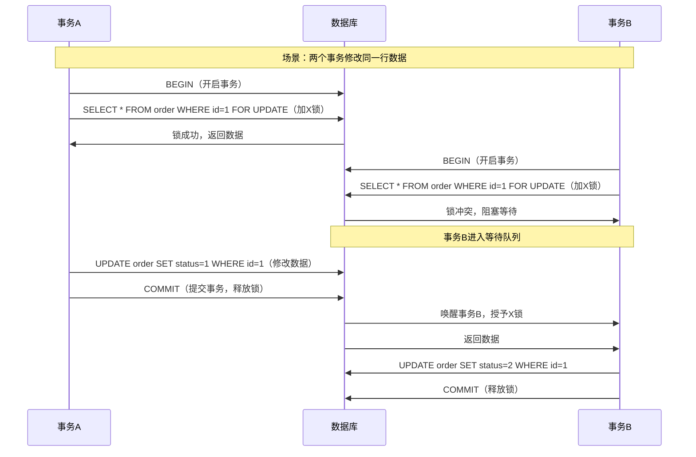
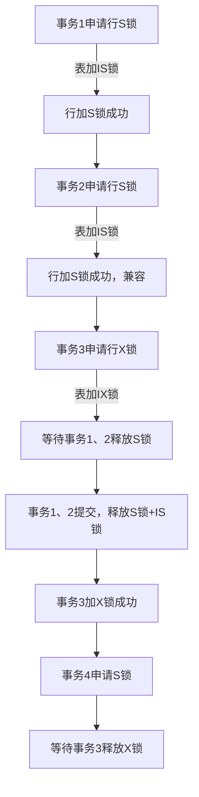
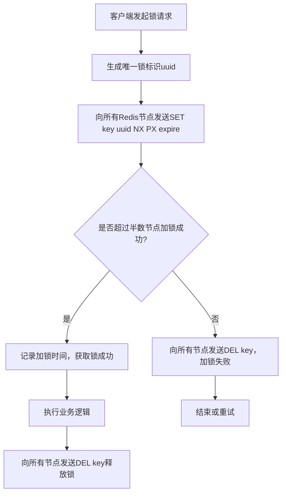
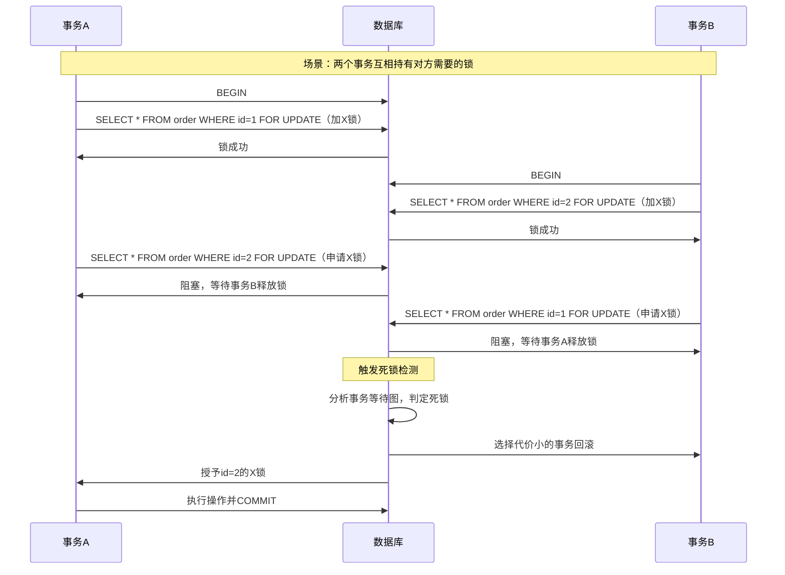

悲观锁是并发控制中的核心锁机制，在数据库和分布式系统中应用广泛。其核心思想是**对并发冲突持悲观态度**，认为数据随时可能被其他事务修改，因此在整个数据操作周期（查询→修改→提交）中会**主动锁定目标数据**，阻塞其他事务的写操作（甚至读操作，取决于隔离级别），直到当前事务完成并释放锁，以此保证数据的一致性。

悲观锁是一种**先上锁、再操作**的策略，典型实现包括数据库的行锁、表锁、页锁，以及编程语言中的 `synchronized`（Java）、互斥锁（Mutex）等。

---

## 核心原理与流程

悲观锁的执行分为三个阶段：

### 锁定阶段
事务发起数据操作请求，数据库/系统检查目标数据的锁状态。无锁则获取锁（行/表/页级）并标记锁持有者，有锁则阻塞等待，直到锁被释放。

以 MySQL InnoDB 为例，行级悲观锁通过 `FOR UPDATE` 实现：

```sql
BEGIN;
SELECT * FROM order WHERE id=1 FOR UPDATE;
UPDATE order SET status=1 WHERE id=1;
COMMIT;
```

### 操作阶段
持有锁的事务独占执行数据的读写操作。

### 释放阶段
事务提交（COMMIT）或回滚（ROLLBACK）时主动释放锁。若事务超时，系统也会强制释放锁，避免死锁。



---

## 锁的粒度与隔离级别

### 锁粒度对比

| 锁粒度 | 适用场景 | 优缺点 |
| :--- | :--- | :--- |
| 行级锁（InnoDB默认） | 高并发、热点数据分散 | 并发度高，开销大，可能出现间隙锁 |
| 表级锁（MyISAM默认） | 批量更新、全表扫描 | 并发度低，开销小，无间隙锁问题 |
| 页级锁 | 中等粒度，介于行和表之间 | 折中方案，存在页内冲突 |

### 数据库隔离级别的影响

悲观锁的效果与数据库隔离级别强相关：

- **读已提交**（Read Committed）：仅阻塞写操作，允许其他事务读快照
- **可重复读**（Repeatable Read，InnoDB默认）：阻塞写操作，且保证当前事务内重复读一致
- **串行化**（Serializable）：最高隔离级，读写都阻塞，完全串行执行

---

## 核心优缺点

### 优点

- **一致性强**：能严格避免丢失更新、脏读、不可重复读、幻读等并发问题
- **逻辑简单**：无需额外处理冲突（如重试），开发成本低

### 缺点

- **性能损耗**：锁的获取、释放、阻塞等待会带来额外开销，高并发场景下大量阻塞会导致系统吞吐量下降
- **死锁风险**：两个事务互相等待对方释放锁会出现死锁，需通过超时机制、死锁检测解决
- **资源浪费**：若事务持有锁但长时间不操作，会阻塞其他事务

---

## 适用场景

- 数据冲突概率高的场景：如电商秒杀、库存扣减、订单支付等热点数据操作
- 写操作频繁、读操作对实时性要求高的场景
- 不适合重试机制的场景（如金融交易，不允许重复提交）

### 不适合的场景

- 读多写少的场景：大量读操作会被写锁阻塞，导致系统吞吐量下降
- 分布式系统的高并发场景：分布式悲观锁的实现复杂度高，且存在网络延迟、节点故障等问题，可能影响可用性

---

## 与乐观锁的核心对比

| 特性 | 悲观锁 | 乐观锁 |
| :--- | :--- | :--- |
| 核心思想 | 悲观，先上锁再操作 | 乐观，先操作再校验 |
| 实现方式 | 数据库锁、Mutex等 | 版本号（version）、时间戳 |
| 并发性能 | 低（阻塞） | 高（无阻塞，冲突重试） |
| 适用场景 | 高冲突、写密集 | 低冲突、读密集 |
| 死锁风险 | 有 | 无 |

---

## 锁的模式分类

悲观锁并非只有独占写锁，还有**共享读锁（S锁）** 和**排他写锁（X锁）** 的组合，这是数据库悲观锁的核心底层机制。

### 共享锁（S锁）
多个事务可同时持有，仅允许读，**阻塞排他锁**。典型语句为 `SELECT ... LOCK IN SHARE MODE`（MySQL InnoDB）：

```sql
BEGIN;
SELECT * FROM order WHERE id=1 LOCK IN SHARE MODE;
COMMIT;
```

### 排他锁（X锁）
同一时刻仅一个事务持有，**阻塞所有S锁和X锁**。典型语句为 `SELECT ... FOR UPDATE`。

### 锁兼容性规则

|  | 持有S锁 | 持有X锁 |
| :--- | :--- | :--- |
| 申请S锁 | 兼容 | 不兼容（阻塞） |
| 申请X锁 | 不兼容（阻塞） | 不兼容（阻塞） |



---

## 意向锁

InnoDB 为了快速判断表是否有行级锁，引入了**意向共享锁（IS）** 和**意向排他锁（IX）**，属于表级锁，是数据库自动加的，无需手动操作。

- 事务加行级S锁前，先加表级IS锁
- 事务加行级X锁前，先加表级IX锁
- 作用：避免表级锁和行级锁的冲突检测遍历全表，提升性能

---

## 间隙锁与临键锁

这是行级锁的延伸，是悲观锁中非常容易踩坑的点。

### 间隙锁（Gap Lock）
锁定索引记录之间的间隙，不锁定记录本身，防止其他事务在间隙中插入数据（解决幻读）。

### 临键锁（Next-Key Lock）
默认锁模式，是**行锁+间隙锁**的组合，锁定索引记录及前面的间隙。

---

## 其他实现场景

### 编程语言层面
- Golang 的 `sync.Mutex`（互斥锁，悲观锁的典型实现）
- Java 的 `synchronized`、`ReentrantLock`

```go
package main

import (
    "sync"
    "fmt"
)

var (
    count int
    mu    sync.Mutex
)

func increment() {
    mu.Lock()
    defer mu.Unlock()
    count++
}

func main() {
    var wg sync.WaitGroup
    for i := 0; i < 1000; i++ {
        wg.Add(1)
        go func() {
            increment()
            wg.Done()
        }()
    }
    wg.Wait()
    fmt.Println(count)
}
```

### 分布式场景
分布式悲观锁（如基于Redis的RedLock、ZooKeeper的临时节点锁、etcd的分布式锁），解决跨节点的并发冲突。



---

## 锁超时与死锁处理

### 锁超时
数据库/系统会设置锁等待超时时间（如 MySQL 的 `innodb_lock_wait_timeout`，默认50秒），超时后事务会抛出异常并回滚，避免无限阻塞。

### 死锁检测
InnoDB 有内置死锁检测机制，会周期性检查事务等待图，发现死锁后会选择一个代价最小的事务回滚，释放锁。



---

## 与MVCC的关系

InnoDB 的悲观锁并非完全阻塞读操作，而是通过**MVCC（多版本并发控制）** 实现读快照。在可重复读隔离级别下，读操作不会阻塞写操作，写操作也不会阻塞读操作（读的是快照），这是对悲观锁的重要优化，避免了读写互斥的性能问题。

---

## 最佳实践

- 优先使用**行级锁**（InnoDB），避免全表扫描触发表锁
- 缩短事务周期：将非核心操作（如日志、通知）移出事务
- 按固定顺序获取锁，避免死锁
- 设置合理的锁超时时间，避免无限阻塞
- 高并发读场景，可搭配**读写分离**或**乐观锁**优化
- 避免在非索引列上使用悲观锁：非索引列会导致全表扫描，InnoDB 会升级为表级锁，并发度暴跌
- 区分 `FOR UPDATE` 和 `LOCK IN SHARE MODE`：仅写操作使用 `FOR UPDATE`，读操作且需要保证数据不被修改时使用 `LOCK IN SHARE MODE`
- 分布式悲观锁的选型：高可用场景优先选 etcd/ZooKeeper（基于一致性协议），高性能场景可考虑 Redis RedLock（但需注意脑裂问题）

---

## 常见陷阱

- **锁粒度不当**：误用表级锁替代行级锁，导致并发度暴跌
- **长事务持有锁**：事务中包含IO、RPC等耗时操作，导致锁长期不释放
- **死锁**：未按固定顺序获取锁，导致循环等待
- **间隙锁导致的锁范围扩大**：非唯一索引下的范围查询会锁定大量间隙，导致其他事务无法插入数据，引发性能问题
- **锁升级**：行级锁数量过多时，数据库可能会将行级锁升级为表级锁，导致并发度下降
- **分布式悲观锁的单点故障**：如 Redis 主从切换时，可能导致锁丢失
