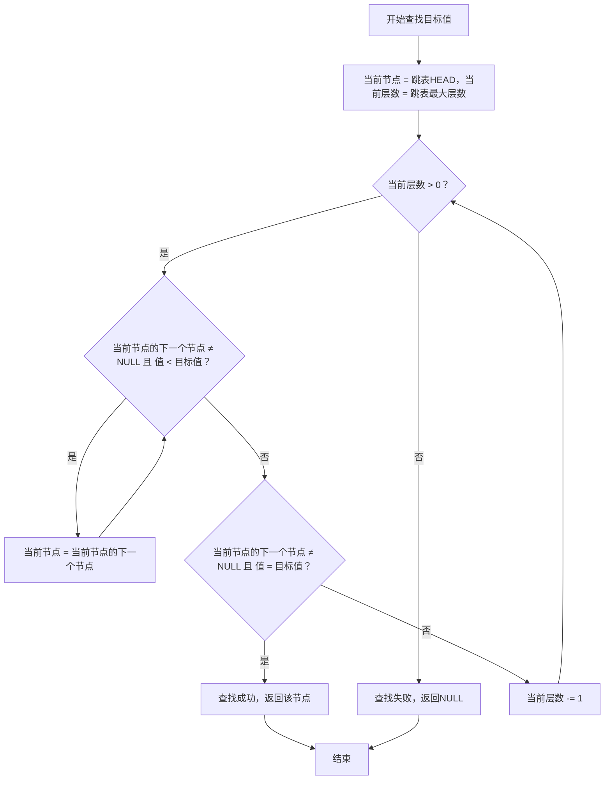
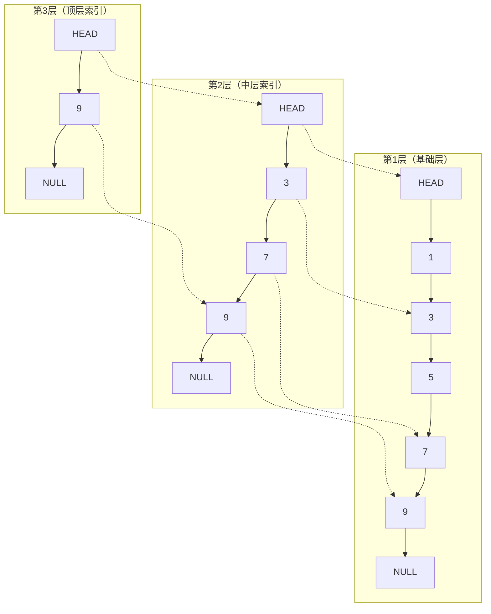
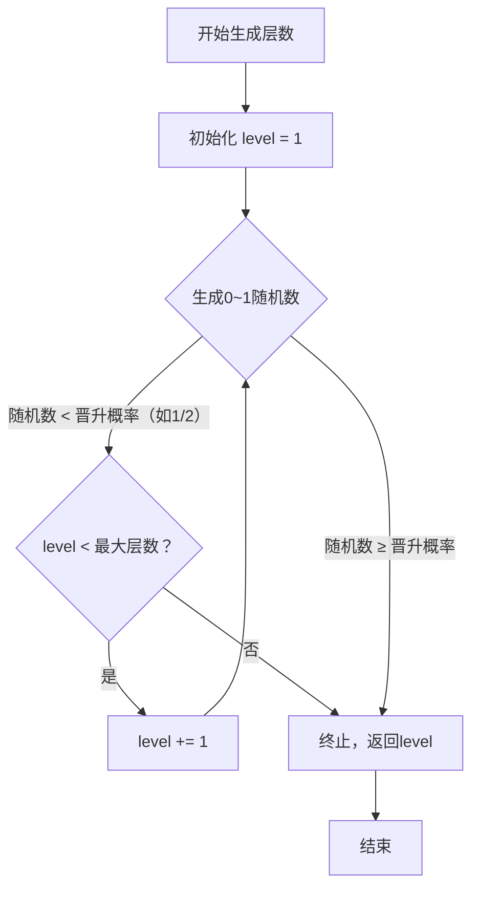

## 介绍
跳表是一种**有序链表的扩展**数据结构，由William Pugh于1990年提出，核心是通过**多层索引**来加速有序链表的查找、插入和删除操作，时间复杂度均优化至 `O(log n)`，同时保持了链表的动态性和空间效率。

---

## 核心原理

跳表通过在基础有序链表之上构建多层稀疏索引，实现高效查找。基础层存储所有数据元素，上层索引是下层元素的子集，层数越高节点越稀疏，用于快速定位目标区间。

节点包含数据值、指向当前层下一个节点的指针，以及指向同一节点下一层的指针（便于跨层跳转）。新节点的层数通过**随机算法**确定，通常以1/2概率递增层数，避免层级过高导致空间浪费，同时保证索引的平衡性。

### 查找操作

查找操作从跳表的**顶层索引的头节点**开始，向右遍历。若当前节点的下一个节点值小于目标值，继续向右；否则，**下降一层**。重复此过程，直到下降到基础层。在基础层向右遍历，找到目标节点（未找到则返回不存在）。



### 插入操作

插入操作先执行查找流程，记录每层需要插入新节点的前驱位置（路径节点）。然后随机生成新节点的层数。从底层开始，逐层在记录的前驱节点后插入新节点，并维护各层的指针关系。若新节点层数超过跳表当前最大层数，更新跳表的最大层数，并扩展顶层索引。

### 删除操作

删除操作先执行查找流程，确认目标节点存在，并记录每层目标节点的前驱位置。从顶层开始，逐层删除目标节点，维护各层的指针关系。若删除后顶层索引为空，降低跳表的最大层数。

---

## 时间与空间复杂度

| 操作 | 时间复杂度 | 空间复杂度 |
| :--- | :--- | :--- |
| 查找 | `O(log n)` | `O(n)`（索引层总空间为 `O(n)`，实际约为 `2n`，常数因子较小） |
| 插入 | `O(log n)` | 同查找 |
| 删除 | `O(log n)` | 同查找 |

时间复杂度通过多层索引跳过大量无效节点，等价于"二分查找"的逻辑，故为 `O(log n)`。空间复杂度中，索引层的节点数量随层数增长呈几何级数递减，总空间为 `O(n)`，是一种"空间换时间"的权衡。

---

## 跳表结构

跳表包含基础层和多层索引层，基础层存储所有数据元素，上层索引是下层元素的子集，形成"金字塔"式的稀疏索引结构。



第1层（基础层）存储**所有数据**，是完整的有序链表。第2层、第3层是索引层，节点数量逐层减少（稀疏）。虚线表示**同一节点在不同层的关联**，实线表示**同层的指针指向**。

---

## 随机层数生成

跳表新增节点时，不会人为指定层数，而是通过**无记忆的随机算法**生成一个"层高"，这个层高就决定了该节点会出现在哪些索引层（从第1层（基础层）到生成的最高层，每一层都会存储该节点）。

跳表的层数从**第1层**开始（基础层，存储所有节点），往上是第2层、第3层……第`max_level`层（顶层索引）。设定一个**晋升概率**（通常为 1/2 或 1/4），表示当前节点"晋升"到上一层的概率。

### 随机层数算法

初始化新节点的层数 `level = 1`。生成一个0~1之间的随机数：如果随机数小于晋升概率（比如 1/2），则 `level += 1`。重复此过程，直到随机数大于等于晋升概率，或层数达到跳表的预设最大层数（避免层数过高）。最终的 `level` 就是该节点的总层数，意味着这个节点会出现在第1层到第`level`层的所有索引中。



使用随机算法的原因：无需复杂的平衡逻辑（如红黑树的旋转），通过概率保证跳表的索引层`天然稀疏`。每层节点数约为下一层的 1/2（晋升概率 1/2），形成类似`二分查找`的层级结构，保证 $O(\log n)$ 复杂度。极端情况（如连续生成高层数）概率极低，实际应用中可通过预设`max_level`（通常设为 16 或 32）限制最大层数，避免性能退化。

---

## 代码实现

```python
import random

class SkipListNode:
    def __init__(self, value, level):
        self.value = value
        self.forward = [None] * level

class SkipList:
    MAX_LEVEL = 16
    PROMOTE_PROB = 0.5

    def __init__(self):
        self.level = 1
        self.head = SkipListNode(None, self.MAX_LEVEL)

    def _random_level(self):
        level = 1
        while random.random() < self.PROMOTE_PROB and level < self.MAX_LEVEL:
            level += 1
        return level

    def insert(self, value):
        update = [None] * self.MAX_LEVEL
        current = self.head

        for i in range(self.level - 1, -1, -1):
            while current.forward[i] and current.forward[i].value < value:
                current = current.forward[i]
            update[i] = current

        new_level = self._random_level()

        if new_level > self.level:
            for i in range(self.level, new_level):
                update[i] = self.head
            self.level = new_level

        new_node = SkipListNode(value, new_level)
        for i in range(new_level):
            new_node.forward[i] = update[i].forward[i]
            update[i].forward[i] = new_node

if __name__ == "__main__":
    sl = SkipList()
    for val in range(1, 11):
        sl.insert(val)
```

`_random_level()` 方法是核心的随机层数生成逻辑，严格遵循"1/2概率晋升"规则。插入逻辑中先找到每层插入的前驱节点，生成随机层数后，若层数超过跳表当前最大层数，更新跳表的层数，最后在第1层到新层数的所有索引中插入该节点。

---

## 关键特性与优缺点

跳表支持 $O(\log n)$ 的查找/插入/删除，优于普通有序链表的 $O(n)$，且无需像平衡二叉树（如红黑树）那样维护复杂的旋转操作。核心逻辑基于链表和随机层数，代码复杂度远低于红黑树、AVL树。节点的指针修改是局部操作，可通过乐观锁等机制实现高效并发控制。

跳表需要额外存储索引层，虽为 $O(n)$，但在内存敏感场景下需权衡。层数随机生成，极端情况下可能出现层级不平衡，导致性能退化（概率极低）。跳表的所有操作均依赖数据的有序性，不适用于无序数据。

---

## 典型应用场景

跳表常用于数据库索引，如Redis的Sorted Set底层实现、LevelDB的MemTable，利用跳表高效处理有序数据的增删查。也用于内存中的有序数据结构，替代平衡二叉树，用于实现有序集合、优先队列等。还可基于跳表的局部修改特性，实现高效的并发有序容器。

---

## 与其他结构的对比

| 数据结构 | 查找时间 | 插入/删除时间 | 实现复杂度 | 空间开销 | 适用场景 |
| :--- | :--- | :--- | :--- | :--- | :--- |
| 普通有序链表 | `O(n)` | `O(n)` | 低 | 低 | 数据量小、操作少 |
| 跳表 | `O(log n)` | `O(log n)` | 中 | 中 | 动态有序数据、高并发 |
| 红黑树 | `O(log n)` | `O(log n)` | 高 | 低 | 严格平衡、内存敏感 |

---

## 总结

跳表是一种通过多层索引加速有序链表操作的数据结构，核心优势在于：

1. **高效性**：查找、插入、删除均为 `O(log n)` 时间复杂度，优于普通有序链表
2. **简洁性**：实现简单，代码复杂度远低于平衡二叉树
3. **并发友好**：局部修改特性便于实现高效并发控制
4. **空间效率**：索引层总空间为 `O(n)`，是一种合理的空间换时间策略

随机层数算法通过概率晋升保证索引的稀疏性和平衡性，预设最大层数避免极端情况。跳表在Redis、LevelDB等系统中广泛应用，特别适合动态有序数据和高并发场景。
