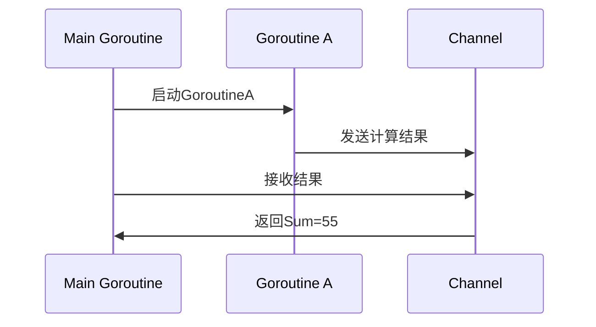

Go（又称Golang）是Google于2007年启动开发的开源静态类型编译型语言，2009年正式发布。其设计目标是解决大规模软件开发中的痛点——如编译慢、并发模型复杂、部署繁琐等——同时兼顾开发效率与运行性能。Go的核心理念是“简洁、高效、可靠”，凭借goroutine并发模型、垃圾回收、静态类型检查等特性，成为云原生、微服务等领域的首选语言。


## 一、核心设计理念
Go的所有特性均围绕三个核心目标展开，这也是其区别于其他语言的根本：

1. **简洁性（Simplicity）**
   移除冗余特性（如继承、构造函数、异常处理），仅保留25个关键字；通过`go fmt`强制统一代码风格，减少团队协作成本。

2. **高效性（Efficiency）**
   编译为机器码（无解释层），运行性能接近C/C++；Goroutine（轻量级线程）初始栈仅2KB，支持百万级并发。

3. **可靠性（Reliability）**
   静态类型检查避免运行时错误；并发模型基于“通信顺序进程（CSP）”，减少数据竞争；垃圾回收（GC）保证内存安全。


## 二、关键特性解析
### 1. 并发模型：Goroutine与Channel
Go的并发模型是其“杀手级特性”，彻底解决了传统线程的性能瓶颈。

#### Goroutine：轻量级执行单元
Goroutine是Go runtime管理的**用户态线程**，而非操作系统内核线程。相比传统线程（约1MB栈空间），Goroutine初始栈仅2KB，且可动态扩容（最大1GB）。启动Goroutine仅需`go`关键字：
```go
func main() {
    go printMessage("Hello from Goroutine!") // 启动Goroutine
    time.Sleep(100 * time.Millisecond)      // 等待Goroutine执行
}

func printMessage(msg string) {
    fmt.Println(msg)
}
```

#### Channel：通信取代共享内存
Channel是Goroutine间的**安全通信管道**，遵循“不要通过共享内存通信，而要通过通信共享内存”原则。示例：
```go
func main() {
    ch := make(chan int) // 创建Channel
    go calculateSum(10, ch)
    result := <-ch // 从Channel接收结果
    fmt.Printf("Sum: %d\n", result)
}

func calculateSum(n int, ch chan<- int) {
    sum := 0
    for i := 1; i <= n; i++ {
        sum += i
    }
    ch <- sum // 发送结果到Channel
}
```

#### 并发模型示意图


### 2. 内存管理：低延迟垃圾回收（GC）
Go采用**并发标记-清除**垃圾回收器（GC），目标是低延迟（延迟&lt;1ms）。GC过程分为三个阶段：
1. **标记准备**：暂停所有goroutine（STW，Stop The World），初始化标记状态。
2. **并发标记**：与goroutine并行执行，标记可达对象。
3. **标记终止**：再次STW，处理剩余任务。
4. **并发清除**：异步回收未标记对象。

GC性能可通过`GODEBUG=gctrace=1`查看，示例输出：
```
gc 1 @0.008s 0%: 0.012+0.34+0.005 ms clock, 0.048+0/0.29/0.68+0.020 ms cpu, 4->4->0 MB, 5 MB goal, 4 P
```

### 3. 类型系统：接口与组合
Go的类型系统强调**组合优于继承**，接口为**隐式实现**（无需`implements`关键字），降低耦合度。

#### 接口（Interface）
接口定义一组方法签名，任何类型只要实现了这些方法，即隐式实现该接口。示例：
```go
// 定义Writer接口
type Writer interface {
    Write(p []byte) (n int, err error)
}

// File类型隐式实现Writer接口
type File struct {
    name string
}

func (f *File) Write(p []byte) (n int, err error) {
    // 实现文件写入逻辑
    return len(p), nil
}
```

#### 组合（Composition）
通过嵌入（Embedding）实现代码复用，替代传统继承。示例：
```go
// 定义Logger类型
type Logger struct { /* ... */ }
func (l *Logger) Log(msg string) { /* ... */ }

// 嵌入Logger到Server类型
type Server struct {
    *Logger // 嵌入Logger（组合）
    addr string
}

// Server类型自动获得Log方法
func main() {
    s := &Server{Logger: &Logger{}, addr: ":8080"}
    s.Log("Server starting...") // 调用Logger的Log方法
}
```

### 4. 工具链：一体化开发体验
Go提供**全流程工具链**，覆盖从编码到部署的所有环节：
- `go build`：编译为单一二进制文件（无依赖）。
- `go run`：直接运行源码（跳过编译步骤）。
- `go mod`：依赖管理（替代旧版`go get`）。
- `go fmt`：自动格式化代码（统一风格）。
- `go test`：内置测试框架（支持单元测试、基准测试）。


## 三、主流语言对比
通过核心维度对比，帮助选择合适场景：

### Go vs Java
| 维度          | Go                          | Java                        |
|---------------|-----------------------------|-----------------------------|
| 语法复杂度    | 极简（25个关键字）          | 繁琐（50+关键字，样板代码多）|
| 并发能力      | Goroutine（百万级）          | 线程（thousands级）         |
| 部署方式      | 单一二进制文件              | 依赖JVM + JAR包             |
| 编译速度      | 秒级（大型项目）             | 分钟级（大型项目）           |
| 生态侧重      | 云原生、微服务              | 企业级应用、后端服务        |

### Go vs Python
| 维度          | Go                          | Python                      |
|---------------|-----------------------------|-----------------------------|
| 类型检查      | 静态（编译时）              | 动态（运行时）              |
| 并发能力      | 无GIL（高效）               | 有GIL（受限）                |
| 执行性能      | 接近C/C++                   | 解释执行（较慢）             |
| 生态侧重      | 系统编程、网络服务          | 数据科学、AI、快速原型      |

### Go vs Rust
| 维度          | Go                          | Rust                        |
|---------------|-----------------------------|-----------------------------|
| 内存安全      | GC保证                      | 所有权+借用检查             |
| 学习曲线      | 平缓（1周上手）             | 陡峭（1-2个月）              |
| 编译速度      | 极快                        | 较慢（复杂类型检查）        |
| 性能          | 高性能                      | 极致性能（接近C/C++）        |
| 适用场景      | 高并发服务、云原生          | 系统编程、嵌入式、性能敏感  |


## 四、适用场景与最佳实践
Go的特性使其在以下场景中**远胜其他语言**：

### 1. 高并发后端服务
- **示例**：API网关、实时消息推送、短信服务。
- **优势**：Goroutine处理百万级请求，内存占用仅为传统线程的1/500。

### 2. 云原生与容器生态
- **示例**：Kubernetes（容器编排）、Docker（容器引擎）、etcd（分布式存储）。
- **优势**：静态编译、跨平台、低资源占用，完美适配云环境。

### 3. 微服务架构
- **示例**：订单服务、用户服务