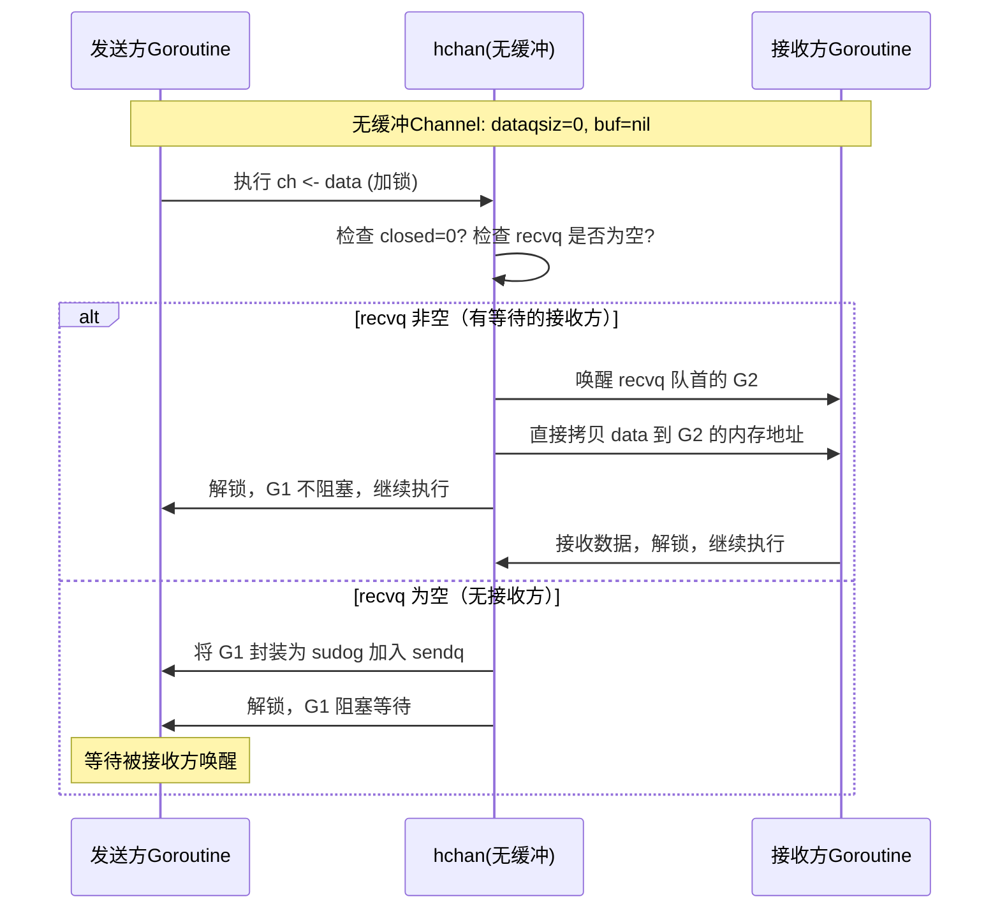
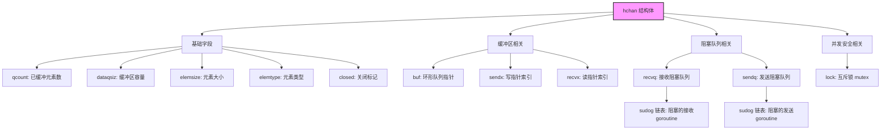
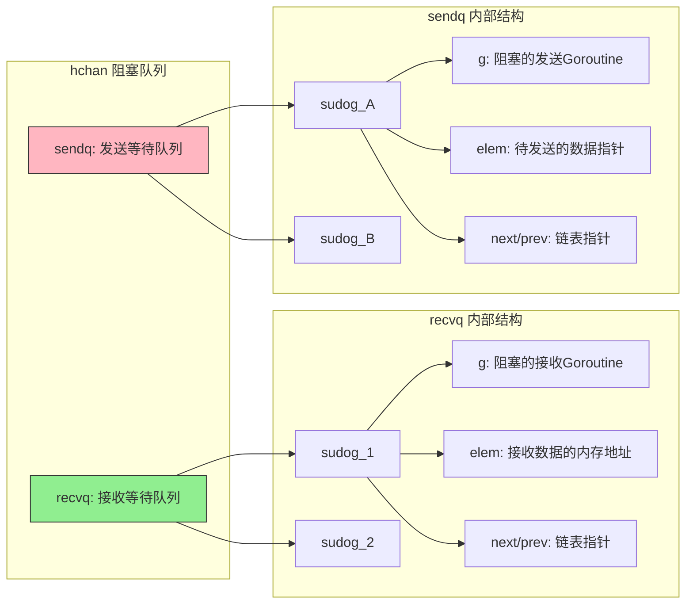

Channel（通道）是 Go 语言核心的并发原语，用于 `goroutine` 之间的通信与同步，遵循"不要通过共享内存通信，而要通过通信共享内存"的设计哲学。它本质是一个类型化的管道，支持 `goroutine` 之间安全地发送/接收数据，还能实现阻塞、同步、限流等功能。

## 核心特性

1. **类型安全**：Channel 有明确的元素类型，只能传输对应类型的数据（如 `chan int` 仅能传输整数）
2. **阻塞特性**：
   - 无缓冲通道：发送/接收操作都会阻塞，直到对方准备好
   - 有缓冲通道：仅当缓冲区满（发送）或空（接收）时才阻塞
3. **同步/异步**：无缓冲通道是同步通信，有缓冲通道可实现异步通信
4. **关闭特性**：通道可被关闭，关闭后仍可接收剩余数据，但发送会 panic
5. **单向通道**：支持声明只读/只写通道，增强代码可读性和安全性

## 基本用法

### 声明与初始化

Channel 需先声明（或初始化）才能使用，语法：

```go
// 声明：chan 元素类型
var ch chan int          // 声明一个int类型的通道（零值为nil，无法直接使用）
var chBuf chan string    // 声明字符串类型的通道

// 初始化：make(chan 类型, [缓冲大小])
ch = make(chan int)               // 无缓冲通道（缓冲大小=0）
chBuf = make(chan string, 10)     // 有缓冲通道（缓冲区大小=10）
```

### 发送与接收

使用 `<-` 操作符（方向决定发送/接收）：

```go
// 发送数据到通道：通道 <- 数据
ch <- 10          // 向ch发送整数10（无缓冲通道会阻塞，直到有goroutine接收）

// 从通道接收数据：变量 <- 通道
num := <-ch       // 从ch接收数据并赋值给num
_, ok := <-ch     // 带状态接收：ok=false表示通道已关闭且无数据

// 忽略接收结果
<-ch
```

### 关闭通道

使用 `close()` 函数关闭通道，注意：

- 只能由发送方关闭，接收方关闭会 panic
- 关闭已关闭的通道会 panic
- 关闭 nil 通道会 panic

```go
close(ch) // 关闭通道ch
```

### 遍历通道

使用 `for range` 遍历通道，会自动在通道关闭且无数据时退出：

```go
ch := make(chan int, 3)
ch <- 1
ch <- 2
ch <- 3
close(ch) // 必须关闭，否则range会一直阻塞

// 遍历通道（接收所有数据）
for num := range ch {
    fmt.Println(num) // 输出1、2、3
}
```

## 关键类型

### 无缓冲通道（同步通道）

- 缓冲区大小为 0，发送和接收必须"配对"：
  - 发送方 `goroutine` 会阻塞，直到有接收方接收数据
  - 接收方 `goroutine` 会阻塞，直到有发送方发送数据
- 典型场景：`goroutine` 间严格同步（如"信号传递"）

```go
func main() {
    ch := make(chan struct{}) // 空结构体不占内存，适合做信号通道

    go func() {
        fmt.Println("goroutine执行")
        close(ch) // 发送完成信号
        // 或 ch <- struct{}{}
    }()

    <-ch // 阻塞等待goroutine完成
    fmt.Println("主goroutine继续")
}
```



### 有缓冲通道（异步通道）

- 缓冲区大小 > 0，发送方仅当缓冲区满时阻塞，接收方仅当缓冲区空时阻塞
- 典型场景：削峰填谷（如生产消费模型）

```go
func main() {
    ch := make(chan int, 2) // 缓冲区大小2

    // 发送2个数据，缓冲区未满，不阻塞
    ch <- 1
    ch <- 2

    // 接收1个数据，缓冲区剩余1个
    fmt.Println(<-ch) // 1

    // 再发送1个，缓冲区仍未满
    ch <- 3

    close(ch)
    // 遍历剩余数据：2、3
    for num := range ch {
        fmt.Println(num)
    }
}
```

```mermaid
flowchart TD
    S1[发送方执行 ch <- data] --> S2[加锁 hchan.lock]
    S2 --> S3{检查通道是否关闭?}
    S3 -- 是 --> S4[panic: send on closed channel]
    S3 -- 否 --> S5{缓冲区是否未满?}
    
    S5 -- 是 --> S6[将数据写入 buf[sendx]]
    S6 --> S7[sendx = (sendx + 1) % dataqsiz]
    S7 --> S8[qcount++，解锁]
    S8 --> S9[发送方不阻塞，继续执行]
    
    S5 -- 否 --> S10{recvq 是否有等待的接收方?}
    S10 -- 是 --> S11[直接交付数据给接收方，唤醒接收方]
    S11 --> S8
    S10 -- 否 --> S12[将发送方封装为 sudog 加入 sendq]
    S12 --> S13[解锁，发送方阻塞]
    S13 --> S14[等待被接收方唤醒]
```

### 单向通道

仅允许发送或接收，用于约束函数参数/返回值的使用范围：

- `chan<- T`：只写通道（仅能发送 T 类型数据）
- `<-chan T`：只读通道（仅能接收 T 类型数据）

```go
// 生产者：仅能向通道发送数据（参数为只写通道）
func producer(ch chan<- int) {
    for i := 0; i < 3; i++ {
        ch <- i
    }
    close(ch)
}

// 消费者：仅能从通道接收数据（参数为只读通道）
func consumer(ch <-chan int) {
    for num := range ch {
        fmt.Println("接收：", num)
    }
}

func main() {
    ch := make(chan int)
    go producer(ch)
    consumer(ch)
}
```

---

# 核心使用场景详解

Channel 的设计目标是 `goroutine` 间通信+同步，以下是最常见且符合 Go 设计哲学的场景：

## 1. Goroutine 同步（等待任务完成）

**场景**：主 goroutine 等待多个子 goroutine 执行完毕，避免主程提前退出。  
**核心**：无缓冲 Channel 做"信号传递"，或有缓冲 Channel 收集结果。

```go
func main() {
    const taskNum = 3
    ch := make(chan struct{}, taskNum) // 空结构体不占内存，适合做信号

    for i := 0; i < taskNum; i++ {
        go func(id int) {
            defer func() { ch <- struct{}{} }() // 任务完成发送信号
            fmt.Printf("任务%d执行\n", id)
            time.Sleep(100 * time.Millisecond)
        }(i)
    }

    // 等待所有任务完成
    for i := 0; i < taskNum; i++ {
        <-ch
    }
    fmt.Println("所有任务完成")
}
```

## 2. 生产消费模型（削峰填谷）

**场景**：平衡生产速度和消费速度（如日志收集、任务分发）。  
**核心**：有缓冲 Channel 作为"缓冲区"，避免生产/消费方直接阻塞。

```go
func producer(ch chan<- int) {
    for i := 1; i <= 5; i++ {
        ch <- i // 生产数据
        fmt.Printf("生产：%d\n", i)
        time.Sleep(50 * time.Millisecond) // 生产慢
    }
    close(ch) // 生产完成，关闭通道
}

func consumer(id int, ch <-chan int) {
    for num := range ch { // 遍历直到通道关闭
        fmt.Printf("消费者%d消费：%d\n", id, num)
        time.Sleep(100 * time.Millisecond) // 消费快
    }
}

func main() {
    ch := make(chan int, 2) // 缓冲区大小根据业务调整
    go producer(ch)
    go consumer(1, ch)
    go consumer(2, ch)
    time.Sleep(2 * time.Second)
}
```

## 3. 并发限流（控制 goroutine 数量）

**场景**：限制同时运行的 goroutine 数量（如接口并发调用、爬虫）。  
**核心**：有缓冲 Channel 作为"令牌桶"，容量=最大并发数。

```go
func worker(id int, token chan struct{}) {
    <-token // 获取令牌（占用通道位置）
    fmt.Printf("工作协程%d启动\n", id)
    time.Sleep(1 * time.Second) // 模拟耗时任务
    fmt.Printf("工作协程%d结束\n", id)
    token <- struct{}{} // 释放令牌
}

func main() {
    const maxConcurrent = 2 // 最大并发数
    token := make(chan struct{}, maxConcurrent)

    // 初始化令牌
    for i := 0; i < maxConcurrent; i++ {
        token <- struct{}{}
    }

    // 启动5个协程，仅2个并发执行
    for i := 0; i < 5; i++ {
        go worker(i, token)
    }

    time.Sleep(6 * time.Second)
}
```

## 4. 超时控制（避免永久阻塞）

**场景**：限制 Channel 操作的等待时间（如网络请求、异步任务）。  
**核心**：结合 `select` + `time.After` 实现超时。

```go
func main() {
    ch := make(chan string)

    go func() {
        time.Sleep(2 * time.Second) // 模拟耗时操作
        ch <- "任务结果"
    }()

    // 等待结果或超时
    select {
    case res := <-ch:
        fmt.Println("成功：", res)
    case <-time.After(1 * time.Second):
        fmt.Println("超时！") // 触发超时
    }
}
```

## 5. 多路选择（监听多个 Channel）

**场景**：同时监听多个 Channel 操作，响应最先就绪的事件（如多数据源读取）。  
**核心**：`select` 实现多路 Channel 复用。

```go
func main() {
    ch1 := make(chan int)
    ch2 := make(chan string)

    go func() {
        time.Sleep(300 * time.Millisecond)
        ch1 <- 100
    }()

    go func() {
        time.Sleep(100 * time.Millisecond)
        ch2 <- "hello"
    }()

    select {
    case num := <-ch1:
        fmt.Println("ch1：", num)
    case str := <-ch2:
        fmt.Println("ch2：", str) // 优先执行
    }
}
```

---

# 最佳实践指南

### 1. 明确 Channel 所有权：发送方关闭，接收方判断

**原则**：Channel 的关闭权归"最后一个发送数据的 goroutine"，接收方通过 `ok` 状态判断通道是否关闭。  
**原因**：接收方关闭通道会导致发送方 panic；重复关闭通道也会 panic。

```go
// 正确：生产者关闭通道
func producer(ch chan<- int) {
    for i := 0; i < 3; i++ {
        ch <- i
    }
    close(ch) // 发送方关闭
}

// 正确：消费者判断通道状态
func consumer(ch <-chan int) {
    for {
        num, ok := <-ch
        if !ok { // 通道关闭且无数据
            break
        }
        fmt.Println("接收：", num)
    }
}
```

### 2. 优先使用单向 Channel 约束函数参数

**原则**：函数参数中，生产者用 `chan<- T`（只写），消费者用 `<-chan T`（只读）。  
**好处**：明确接口意图，避免函数内部误操作（如向只读通道发送数据）。

```go
// 错误：参数为双向通道，无法约束使用方式
func badProducer(ch chan int) { /* ... */ }

// 正确：参数为只写通道，清晰且安全
func goodProducer(ch chan<- int) { /* ... */ }
```

### 3. 合理选择 Channel 类型

| 场景                | 推荐类型       | 原因                     |
|---------------------|----------------|--------------------------|
| 严格同步（如信号）| 无缓冲 Channel | 发送/接收必须配对，强同步 |
| 生产消费（削峰）| 有缓冲 Channel | 缓冲区平衡速度，减少阻塞 |
| 仅传递信号          | `chan struct{}` | 空结构体不占内存，高效   |
| 传递大对象          | `chan *T`      | 减少值拷贝开销           |

### 4. 避免裸用 Channel：封装为类型或函数

**原则**：将 Channel 封装在自定义类型/函数中，对外暴露简洁接口，隐藏内部实现。

```go
// 封装前：直接暴露Channel，调用方易误操作
var ch = make(chan int, 10)

// 封装后：隐藏Channel，提供安全接口
type TaskQueue struct {
    ch chan int
}

func NewTaskQueue(size int) *TaskQueue {
    return &TaskQueue{
        ch: make(chan int, size),
    }
}

func (q *TaskQueue) Push(taskID int) {
    q.ch <- taskID
}

func (q *TaskQueue) Pop() (int, bool) {
    id, ok := <-q.ch
    return id, ok
}

func (q *TaskQueue) Close() {
    close(q.ch)
}
```

### 5. 及时释放阻塞的 goroutine

**原则**：若 Channel 操作可能阻塞，必须提供退出机制（如 `context.Context`、退出信号 Channel）。

```go
func worker(ctx context.Context, ch <-chan int) {
    for {
        select {
        case num := <-ch:
            fmt.Println("处理：", num)
        case <-ctx.Done(): // 接收退出信号
            fmt.Println("退出工作协程")
            return
        }
    }
}

func main() {
    ctx, cancel := context.WithTimeout(context.Background(), 2*time.Second)
    defer cancel()

    ch := make(chan int)
    go worker(ctx, ch)

    for i := 0; i < 5; i++ {
        ch <- i
        time.Sleep(500 * time.Millisecond)
    }
}
```

### 6. 避免使用 Channel 传递所有数据

**原则**：本地 goroutine 无需通信时，不要滥用 Channel（如单 goroutine 内部数据传递）。  
**替代**：直接使用变量、切片等，减少开销。

---

# 常见错误场景与解决方案

## 1. 向已关闭的 Channel 发送数据（panic）

**错误代码**：
```go
func main() {
    ch := make(chan int)
    close(ch)
    ch <- 10 // panic: send on closed channel
}
```

**原因**：Channel 关闭后，发送操作会触发 panic（接收操作仍可读取剩余数据）。

**修复**：
1. 确保只有发送方关闭 Channel
2. 发送前通过 `select` 检查通道状态（或用状态变量）

## 2. 关闭 nil Channel 或重复关闭（panic）

**错误代码**：
```go
func main() {
    var ch chan int // nil Channel
    close(ch) // panic: close of nil channel

    // 重复关闭
    ch2 := make(chan int)
    close(ch2)
    close(ch2) // panic: close of closed channel
}
```

**原因**：nil Channel 无底层 `hchan` 结构体，关闭会 panic；重复关闭违反 Channel 状态规则。

**修复**：
1. 关闭前检查 Channel 是否为 nil
2. 用原子变量标记是否已关闭（如 `sync/atomic`）

## 3. Goroutine 泄漏（永久阻塞）

**错误代码**：
```go
func main() {
    ch := make(chan int) // 无缓冲Channel

    go func() {
        ch <- 10 // 阻塞：无接收方
    }()

    // 主程退出，goroutine永久阻塞（泄漏）
}
```

**原因**：goroutine 阻塞在 Channel 操作，且无其他 goroutine 处理，导致资源泄漏。

**修复**：
1. 确保每个发送操作都有对应的接收操作
2. 用有缓冲 Channel 或超时机制
3. 提供退出信号（如 `context`）

## 4. 忽略 Channel 接收的 ok 状态（读取零值误判）

**错误代码**：
```go
func main() {
    ch := make(chan int, 1)
    ch <- 1
    close(ch)

    num := <-ch
    fmt.Println(num) // 1
    num = <-ch
    fmt.Println(num) // 0（零值），但误判为有效数据
}
```

**原因**：通道关闭后，接收操作返回零值，若不检查 `ok` 状态，会将零值当作有效数据。

**修复**：接收时判断 `ok` 状态：
```go
num, ok := <-ch
if !ok {
    fmt.Println("通道已关闭")
    return
}
```

## 5. 无限制使用有缓冲 Channel（内存溢出）

**错误代码**：
```go
func main() {
    ch := make(chan int, 1000000) // 超大缓冲区
    for i := 0; ; i++ {
        ch <- i // 生产速度远大于消费，缓冲区撑爆内存
    }
}
```

**原因**：有缓冲 Channel 的缓冲区占用堆内存，无节制发送会导致内存溢出。

**修复**：
1. 合理设置缓冲区大小
2. 控制生产速度（如消费方反馈）
3. 用限流机制

## 6. 滥用 select 的 default 分支（忙轮询）

**错误代码**：
```go
func main() {
    ch := make(chan int)
    for {
        select {
        case num := <-ch:
            fmt.Println(num)
        default:
            // 无数据时空循环，占用CPU
        }
    }
}
```

**原因**：`default` 分支会让 `select` 非阻塞，空循环导致 CPU 100%。

**修复**：
1. 移除不必要的 `default` 分支（让 `select` 阻塞）
2. 若需非阻塞，添加 `time.Sleep` 降低轮询频率

## 7. 用 Channel 实现全局锁（性能差）

**错误场景**：用无缓冲 Channel 做全局互斥锁（替代 `sync.Mutex`）。

**原因**：Channel 的阻塞/唤醒涉及 goroutine 调度，性能远低于 `sync.Mutex`。

**修复**：同步场景优先使用 `sync.Mutex`/`sync.RWMutex`，Channel 仅用于 goroutine 通信。

---

## 注意事项

1. **nil 通道**：对 nil 通道的发送/接收/关闭操作都会永久阻塞
2. **通道关闭**：
   - 接收已关闭且无数据的通道，会返回元素类型的零值 + `ok=false`
   - 向已关闭的通道发送数据会 panic
3. **资源泄漏**：若 `goroutine` 阻塞在通道操作上且无其他 `goroutine` 处理，会导致 `goroutine` 泄漏
4. **通道方向**：函数参数优先使用单向通道，明确使用意图
5. **select 多路复用**：`select` 可同时监听多个通道操作，随机执行一个就绪的 case，无就绪则执行 `default`（若有），否则阻塞

## select 与 Channel

`select` 是 Go 处理多通道的核心语法，示例：

```go
func main() {
    ch1 := make(chan int)
    ch2 := make(chan string)

    go func() {
        time.Sleep(500 * time.Millisecond)
        ch1 <- 100
    }()

    go func() {
        time.Sleep(300 * time.Millisecond)
        ch2 <- "hello"
    }()

    // 监听多个通道
    select {
    case num := <-ch1:
        fmt.Println("ch1：", num)
    case str := <-ch2:
        fmt.Println("ch2：", str) // 优先执行（300ms < 500ms）
    case <-time.After(1 * time.Second):
        fmt.Println("超时")
    }
}
```

---

# Go Channel 底层原理深度解析

Channel 作为 Go 语言并发模型的核心，其底层实现依赖于 Go 运行时（runtime）的核心数据结构和调度机制。理解 Channel 的原理，能帮你更精准地使用它（避免阻塞、泄漏等问题），也能理解 Go "通信共享内存"的设计本质。

## Channel 核心数据结构

Channel 的底层由 `runtime.hchan` 结构体（Go 1.18+ 核心定义）实现，简化后的关键字段如下（基于 Go 源码 `src/runtime/chan.go`）：

```go
type hchan struct {
    qcount   uint           // 通道中已缓冲的元素数量
    dataqsiz uint           // 通道缓冲区大小（初始化时指定的容量）
    buf      unsafe.Pointer // 指向缓冲区的指针（环形队列）
    elemsize uint16         // 通道元素的大小
    closed   uint32         // 通道是否关闭（0=未关闭，1=已关闭）
    elemtype *_type         // 通道元素的类型信息（保证类型安全）
    sendx    uint           // 发送操作的下一个索引（环形队列写指针）
    recvx    uint           // 接收操作的下一个索引（环形队列读指针）
    recvq    waitq          // 等待接收的 goroutine 队列
    sendq    waitq          // 等待发送的 goroutine 队列
    lock     mutex          // 互斥锁（保护所有字段，保证并发安全）
}

// 等待队列（双向链表），存储阻塞的 goroutine
type waitq struct {
    first *sudog // 队列头
    last  *sudog // 队列尾
}

// sudog：封装了阻塞的 goroutine 及相关信息（如待发送/接收的数据）
type sudog struct {
    g          *g     // 阻塞的 goroutine
    next       *sudog // 链表下一个节点
    prev       *sudog // 链表上一个节点
    elem       unsafe.Pointer // 指向待发送/接收的数据
    // 其他字段（如通道引用、是否加锁等）
}
```



### 核心字段解读

| 字段 | 作用 |
|------|------|
| `buf` | 有缓冲通道的核心：环形队列（先进先出），存储待接收的元素 |
| `sendx/recvx` | 环形队列的"写指针"和"读指针"，标记下一次发送/接收的位置 |
| `recvq/sendq` | 阻塞队列：`recvq` 存等待接收的 goroutine，`sendq` 存等待发送的 goroutine |


| `lock` | 互斥锁：Channel 的所有操作（发送/接收/关闭）都需加锁，保证并发安全 |
| `closed` | 关闭标记：避免重复关闭、向已关闭通道发送数据等 panic |

## Channel 核心操作原理

Channel 的核心操作包括：**发送（`ch <- data`）、接收（`<-ch`）、关闭（`close(ch)`）**，以下拆解每个操作的底层流程。

### 发送操作（`ch <- data`）

发送操作的核心逻辑：优先直接交付（给阻塞的接收方），否则缓冲，否则阻塞。

#### 流程拆解（简化版）：

```
加锁（hchan.lock）→ 检查通道是否已关闭 → 若有等待的接收方（recvq 非空）→ 直接交付数据 → 唤醒接收方 → 解锁
                ↓ 否
                检查缓冲区是否有空位 → 若有 → 将数据写入环形队列（buf[sendx]）→ sendx++ → 解锁
                ↓ 否
                将当前 goroutine 封装为 sudog → 加入 sendq 队列 → 解锁 → 阻塞当前 goroutine（交给调度器）
```

#### 关键细节

- **直接交付**：无缓冲通道/缓冲区满时，若有 `goroutine` 阻塞在接收（`recvq` 非空），会跳过缓冲区，直接将数据从发送方拷贝到接收方的内存地址，无需入队
- **缓冲区写入**：有缓冲通道且缓冲区未满时，数据会拷贝到 `buf` 指向的环形队列，`sendx` 按环形队列规则更新（`sendx = (sendx + 1) % dataqsiz`）
- **阻塞逻辑**：当前 `goroutine` 会被标记为"阻塞状态"，并加入 `sendq`，由 Go 调度器（M-P-G 模型）接管，直到有接收方唤醒它

### 接收操作（`x := <-ch` / `x, ok := <-ch`）

接收操作的核心逻辑：优先直接获取（从阻塞的发送方），否则从缓冲区读取，否则阻塞。

#### 流程拆解（简化版）：

```
加锁（hchan.lock）→ 检查通道是否已关闭且缓冲区为空 → 若是 → 返回零值 + ok=false → 解锁
                ↓ 否
                检查是否有等待的发送方（sendq 非空）→ 若有 → 直接获取数据（无缓冲）/ 取出缓冲区头部+写入新数据（有缓冲）→ 唤醒发送方 → 解锁
                ↓ 否
                检查缓冲区是否有数据 → 若有 → 从环形队列读取（buf[recvx]）→ recvx++ → 解锁 → 返回数据
                ↓ 否
                将当前 goroutine 封装为 sudog → 加入 recvq 队列 → 解锁 → 阻塞当前 goroutine
```

#### 关键细节

- **直接获取**：无缓冲通道/缓冲区空时，若有 `goroutine` 阻塞在发送（`sendq` 非空），会直接从发送方拷贝数据，无需经过缓冲区
- **有缓冲通道的"交换"**：若缓冲区已满且有发送方阻塞，接收方会先读取缓冲区头部数据，再将发送方的数据写入缓冲区尾部（环形队列的"替换"逻辑）
- **关闭通道的处理**：若通道已关闭且缓冲区为空，接收操作会立即返回元素类型的零值，且 `ok=false`（这也是 `for range` 遍历关闭通道会退出的原因）

### 关闭操作（`close(ch)`）

关闭通道的核心逻辑：标记关闭状态，唤醒所有阻塞的 `goroutine`，禁止后续发送。

#### 流程拆解（简化版）：

```
加锁（hchan.lock）→ 检查通道是否已关闭 → 若是 → 解锁 → panic
                ↓ 否
                标记 closed=1 → 唤醒 recvq 中所有等待的 goroutine（接收方会收到零值）→ 唤醒 sendq 中所有等待的 goroutine（发送方会 panic）→ 解锁
```

#### 关键细节

- **关闭已关闭通道 panic**：由 `closed` 标记检查保证
- **唤醒所有阻塞 goroutine**：`recvq` 中的 `goroutine` 会被唤醒并接收零值，`sendq` 中的 `goroutine` 被唤醒后，发现通道已关闭，会触发 `send on closed channel` panic
- **关闭 nil 通道 panic**：因为 nil 通道的 `hchan` 指针为 nil，加锁前会直接触发 panic

## 无缓冲 vs 有缓冲 Channel 原理差异

| 维度 | 无缓冲 Channel（dataqsiz=0） | 有缓冲 Channel（dataqsiz>0） |
|------|------------------------------|------------------------------|
| 缓冲区 | 无（buf 为 nil） | 有（环形队列，buf 指向连续内存） |
| 发送/接收逻辑 | 必须"配对"：发送方阻塞直到有接收方，接收方阻塞直到有发送方，数据直接拷贝 | 优先缓冲：缓冲区未满时发送不阻塞，缓冲区未空时接收不阻塞；缓冲区满/空时退化为无缓冲逻辑 |
| 同步特性 | 强同步：发送和接收原子性完成（goroutine 切换） | 弱同步：缓冲区作为"中间层"，允许生产消费异步 |
| 性能 | 略高（少一次缓冲区拷贝） | 略低（数据需拷贝到缓冲区，再拷贝到接收方） |

### 数据拷贝说明

Channel 的数据传输本质是**值拷贝**（无论有无缓冲）：

- 无缓冲通道：数据从发送方栈/堆拷贝到接收方的内存地址
- 有缓冲通道：数据先从发送方拷贝到缓冲区，再从缓冲区拷贝到接收方（两次拷贝）

若需传递大对象，建议传递指针（减少拷贝开销），但需注意并发安全。

## Channel 与 Go 调度器的协同

Channel 的阻塞/唤醒逻辑依赖 Go 运行时的 M-P-G 调度模型：

1. 当 `goroutine` 因 Channel 操作阻塞时，会被从 P（处理器）的本地运行队列中移除，状态标记为 `Gwaiting`
2. 被阻塞的 `goroutine` 封装为 `sudog` 加入 `recvq/sendq`，等待被唤醒
3. 当有对应的发送/接收操作触发唤醒时，`sudog` 中的 `goroutine` 会被重新加入 P 的运行队列，等待调度执行

这也是 Channel 能实现 `goroutine` 同步的核心：调度器通过 `sudog` 管理阻塞的 `goroutine`，保证其在条件满足时被唤醒。

## 常见问题的原理层面解释

### 为什么向 nil 通道发送/接收会永久阻塞？

nil 通道的 `hchan` 指针为 nil，所有操作（发送/接收/关闭）都会先尝试加锁，但 nil 指针无法访问 `lock` 字段，最终陷入无限循环（runtime 层面的永久阻塞），且不会触发 panic。

### 为什么关闭通道后仍能接收剩余数据？

关闭通道仅标记 `closed=1`，不会清空缓冲区（`buf` 中的数据仍存在）。接收操作会优先读取缓冲区数据，直到 `qcount=0`，才会返回零值。

### 为什么 `for range` 遍历关闭的通道会退出？

`for range` 底层调用接收操作，当通道关闭且缓冲区为空时，接收操作返回 `ok=false`，`range` 检测到该状态后终止循环。

### Channel 为什么会导致 goroutine 泄漏？

若 `goroutine` 阻塞在 Channel 操作（如发送到无接收方的无缓冲通道），且没有其他 `goroutine` 唤醒它，该 `goroutine` 会一直停留在 `recvq/sendq` 中，占用内存和调度资源，即"泄漏"。

## 核心原理总结

1. Channel 底层是 `hchan` 结构体，通过互斥锁保证并发安全，通过 `recvq/sendq` 管理阻塞的 `goroutine`
2. 所有操作（发送/接收/关闭）都是"加锁→逻辑处理→解锁"的原子性流程
3. 数据传输本质是值拷贝，无缓冲通道少一次拷贝，性能略高
4. 阻塞/唤醒依赖 Go 调度器，通过 `sudog` 封装 `goroutine` 并加入等待队列
5. 无缓冲通道是"直接交付"，有缓冲通道是"缓冲+直接交付"的结合

理解这些原理后，你能更清晰地解释：为什么关闭通道后发送会 panic？为什么有缓冲通道能削峰填谷？为什么 select 能监听多个通道？也能规避大部分 Channel 相关的坑（如泄漏、重复关闭、nil 通道操作等）。

---

# 总结

| 维度         | 核心要点                                                                 |
|--------------|--------------------------------------------------------------------------|
| 使用场景     | 同步、生产消费、限流、超时控制、多路选择（避免滥用）|
| 最佳实践     | 发送方关闭、单向约束、合理选型、封装隐藏、及时退出                       |
| 错误规避     | 禁关nil/重复关、禁发已关通道、检查ok状态、防goroutine泄漏、控缓冲区大小 |

Channel 的核心价值是"通信共享内存"，而非"同步锁"或"数据容器"。遵循"最小权限、明确所有权、及时释放"的原则，才能避免大部分问题，充分发挥其并发优势。

**总结**

Channel 是 Go 并发编程的"粘合剂"，核心价值是**安全的 goroutine 通信与同步**。无缓冲通道侧重同步，有缓冲通道侧重异步，结合 `select` 可实现复杂的并发逻辑。使用时需注意通道的关闭、nil 状态和资源泄漏问题，遵循"发送方关闭通道，接收方判断状态"的最佳实践。