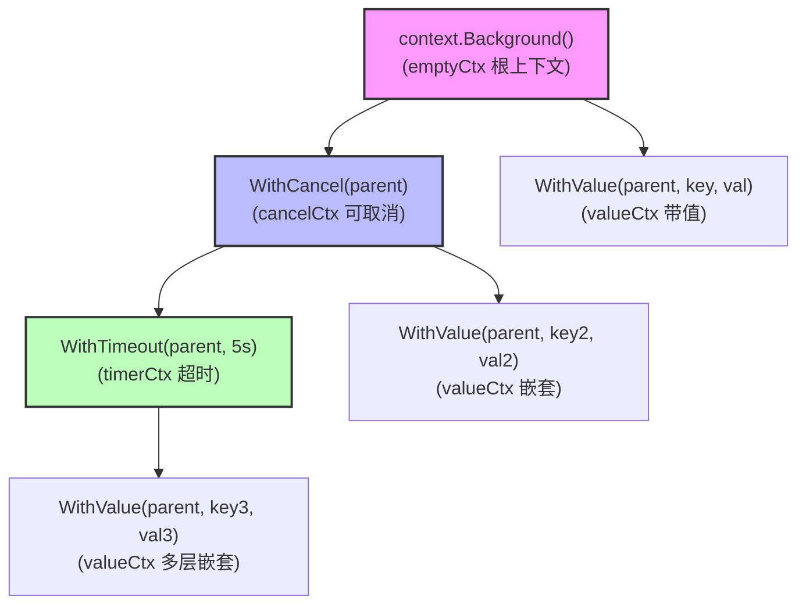
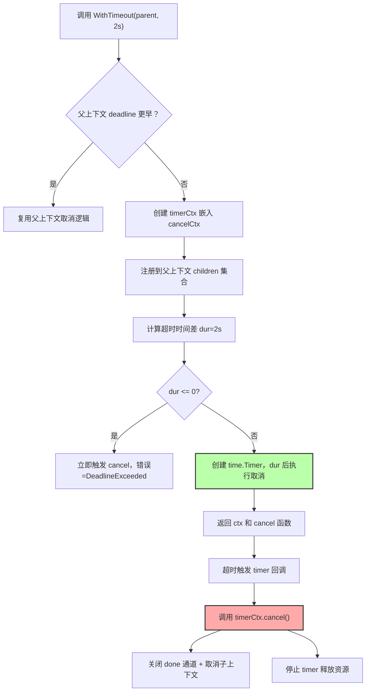
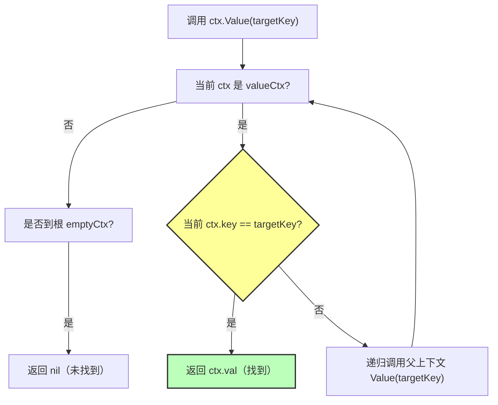
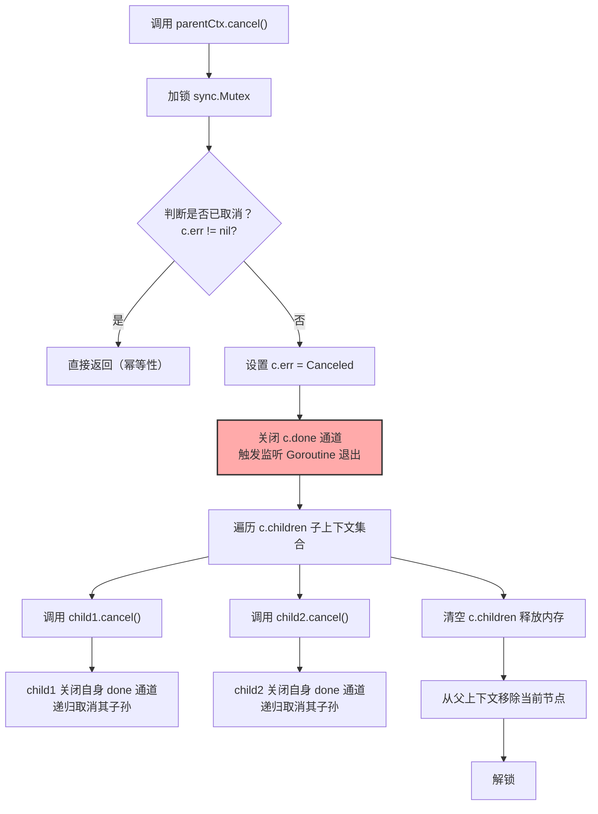
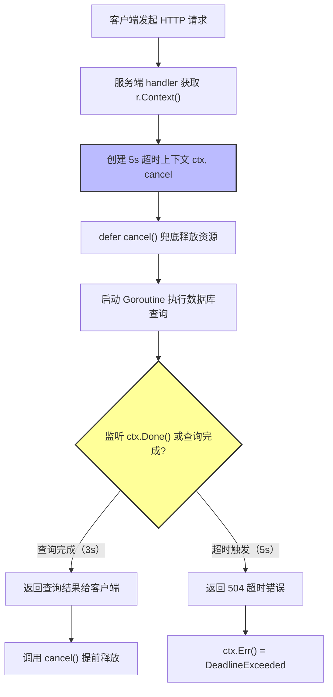

Go 语言的 `context` 包是用于在 Goroutine 之间传递上下文信息的核心工具，主要解决 Goroutine 间的取消信号、超时控制、元数据传递三大问题，是并发编程中协调多 Goroutine 生命周期的标准方案。

## 核心定义与设计初衷

### 本质

`Context` 是一个接口，定义在 `context` 包中，核心方法如下：

```go
type Context interface {
    Done() <-chan struct{}
    Err() error
    Deadline() (deadline time.Time, ok bool)
    Value(key any) any
}
```

- `Done()` - 返回上下文的取消信号（只读通道），关闭时表示上下文已取消
- `Err()` - 返回取消原因（Done 关闭后调用才有意义）
- `Deadline()` - 返回上下文的截止时间（若有），ok=false 表示无截止时间
- `Value(key)` - 获取上下文存储的键值对（元数据），key 需为可比较类型

所有实现该接口的类型都可作为上下文，`context` 包提供了默认实现（如 `emptyCtx`、`cancelCtx`、`timerCtx` 等）。

### 设计目的

Go 并发编程中，Goroutine 之间无父子关系，无法直接终止子 Goroutine，`context` 解决以下痛点：

- **取消控制** - 父 Goroutine 通知子 Goroutine 停止工作（如请求超时、用户取消操作）
- **超时/截止时间** - 自动触发取消，避免 Goroutine 无限阻塞
- **元数据传递** - 在 Goroutine 链中传递少量关键信息（如请求 ID、用户 Token）

---

## Context 的核心类型与创建方式

`context` 包提供了 4 类核心创建函数，覆盖绝大多数场景：

| 函数 | 类型 | 核心作用 | 适用场景 |
|------|------|----------|----------|
| `context.Background()` | 空上下文 | 根上下文，不可取消、无超时、无值 | 主函数/初始化/测试的顶层上下文 |
| `context.TODO()` | 空上下文 | 临时占位（不确定用哪种上下文时） | 重构/临时代码 |
| `context.WithCancel(parent)` | 可取消上下文 | 返回可手动取消的上下文 + 取消函数 | 手动触发取消（如用户取消请求） |
| `context.WithTimeout(parent, timeout)` | 超时上下文 | 超时后自动取消 | 控制操作最大耗时（如 HTTP 请求超时） |
| `context.WithDeadline(parent, deadline)` | 截止时间上下文 | 到达指定时间自动取消 | 固定时间点终止（如任务截止） |
| `context.WithValue(parent, key, val)` | 带值上下文 | 附加键值对，不可取消、无超时 | 传递元数据（如请求 ID） |

Context 采用**层级派生结构**，子上下文继承父上下文的取消信号，实现取消信号的逐层传播：



### 空上下文（Background/TODO）

- `Background()` - 所有上下文的根，通常在程序入口（如 `main` 函数、`init` 函数）创建
- `TODO()` - 语义是暂未确定上下文类型，编译器/静态检查工具会提示替换为具体上下文
- 二者本质都是 `emptyCtx`，无任何功能，仅作为父上下文

```go
ctx := context.Background()
ctx := context.TODO()
```

### 可取消上下文（WithCancel）

返回 `ctx` 和 `cancel` 函数，调用 `cancel()` 会关闭 `ctx.Done()` 通道，通知所有依赖该上下文的 Goroutine 退出。

```go
func main() {
    ctx, cancel := context.WithCancel(context.Background())
    defer cancel()

    go func(ctx context.Context) {
        for {
            select {
            case <-ctx.Done():
                fmt.Println("子 Goroutine 收到取消信号，退出")
                return
            default:
                fmt.Println("子 Goroutine 运行中...")
                time.Sleep(500 * time.Millisecond)
            }
        }
    }(ctx)

    time.Sleep(3 * time.Second)
    cancel()
    time.Sleep(1 * time.Second)
}
```

### 超时/截止时间上下文（WithTimeout/WithDeadline）

- `WithTimeout` - 指定多久后取消（相对时间），最常用
- `WithDeadline` - 指定到某个时间点取消（绝对时间）
- 超时后自动调用取消函数，也可手动提前取消

`WithTimeout` 从创建到超时自动取消的完整执行流程如下：



```go
func main() {
    ctx, cancel := context.WithTimeout(context.Background(), 2*time.Second)
    defer cancel()

    go func(ctx context.Context) {
        select {
        case <-ctx.Done():
            fmt.Println("超时，子 Goroutine 退出：", ctx.Err())
            return
        }
    }(ctx)

    time.Sleep(3 * time.Second)
}
```

### 带值上下文（WithValue）

用于传递少量、只读的元数据：

- key 必须是可比较类型（如 `int`、`string`、自定义类型），建议用自定义类型避免键冲突
- 仅传递请求级别的元数据（如请求 ID、用户 Token），不传递业务数据
- 带值上下文不可取消，需结合 `WithCancel/WithTimeout` 使用

多层 `valueCtx` 嵌套时，`Value(key)` 采用递归查找方式，查找流程如下：



```go
type ctxKey string

func main() {
    ctx := context.WithValue(context.Background(), ctxKey("requestID"), "req-12345")

    go func(ctx context.Context) {
        reqID := ctx.Value(ctxKey("requestID")).(string)
        fmt.Println("获取请求 ID：", reqID)
    }(ctx)
}
```

---

## Context 的核心使用规则

### 取消信号的传播

- 上下文是**层级结构**：子上下文继承父上下文的取消信号，父取消则所有子都会取消
- `Done()` 通道是只读的，仅能通过取消函数/超时触发关闭
- 多个 Goroutine 可监听同一个 `ctx.Done()`，关闭时所有 Goroutine 都会收到信号

父上下文取消时，会递归取消所有子上下文，核心流程如下：



示例：父子上下文取消传播

```go
func main() {
    parentCtx, parentCancel := context.WithCancel(context.Background())
    childCtx, _ := context.WithCancel(parentCtx)

    go func(ctx context.Context) {
        <-ctx.Done()
        fmt.Println("子上下文被取消")
    }(childCtx)

    parentCancel()
    time.Sleep(100 * time.Millisecond)
}
```

### Err() 方法的返回值

| 场景 | Err() 返回值 |
|------|--------------|
| 未取消 | nil |
| 手动取消（WithCancel） | context.Canceled |
| 超时/截止时间 | context.DeadlineExceeded |

### 资源释放

- 所有通过 `WithCancel/WithTimeout/WithDeadline` 创建的上下文，必须调用 `cancel` 函数
- 即使超时自动取消，也建议 `defer cancel()`
- 目的：释放上下文关联的资源（如定时器、Goroutine），避免内存泄漏

---

## 典型使用场景

### HTTP 服务的超时控制

Go 标准库 `net/http` 原生支持 `Context`，可控制请求处理超时。实际业务中，HTTP 请求通过 `context` 实现超时控制的完整流程如下：



Go 标准库 `net/http` 原生支持 `Context`，可控制请求处理超时：

```go
http.HandleFunc("/api", func(w http.ResponseWriter, r *http.Request) {
    ctx, cancel := context.WithTimeout(r.Context(), 5*time.Second)
    defer cancel()

    ch := make(chan string)
    go func() {
        time.Sleep(6 * time.Second)
        ch <- "result"
    }()

    select {
    case res := <-ch:
        w.Write([]byte(res))
    case <-ctx.Done():
        w.WriteHeader(http.StatusGatewayTimeout)
        w.Write([]byte("请求超时：" + ctx.Err().Error()))
    }
})

http.ListenAndServe(":8080", nil)
```

### 数据库查询的取消

多数数据库驱动（如 `database/sql`）支持 `Context`，可取消长时间的查询：

```go
func queryDB(ctx context.Context, db *sql.DB, sql string) (*sql.Rows, error) {
    return db.QueryContext(ctx, sql)
}

func main() {
    ctx, cancel := context.WithTimeout(context.Background(), 3*time.Second)
    defer cancel()

    db, _ := sql.Open("mysql", "dsn")
    rows, err := queryDB(ctx, db, "SELECT * FROM big_table")
    if err != nil {
        if err == context.DeadlineExceeded {
            fmt.Println("查询超时")
        }
        return
    }
}
```

### 多 Goroutine 协同取消

父 Goroutine 管理多个子 Goroutine，统一触发取消：

```go
func worker(ctx context.Context, id int) {
    for {
        select {
        case <-ctx.Done():
            fmt.Printf("worker %d 退出\n", id)
            return
        default:
            fmt.Printf("worker %d 工作中...\n", id)
            time.Sleep(300 * time.Millisecond)
        }
    }
}

func main() {
    ctx, cancel := context.WithCancel(context.Background())
    defer cancel()

    for i := 0; i < 3; i++ {
        go worker(ctx, i)
    }

    time.Sleep(5 * time.Second)
    fmt.Println("主 Goroutine 触发取消")
}
```

---

## 最佳实践与常见陷阱

### 最佳实践

#### 上下文传递与创建

##### 严格遵循参数规范

- **必须作为函数第一个参数**，命名为 `ctx`，且不可省略

```go
// 正确：ctx 为首参，无上下文时传 background
func doTask(ctx context.Context, taskID string) error { ... }

// 错误：ctx 位置靠后 / 可选参数
func doTask(taskID string, ctx ...context.Context) error { ... }
```

- **根上下文仅用 `Background()`**：`main` 函数、初始化、测试场景用 `context.Background()`；`TODO()` 仅用于暂未确定上下文类型的临时场景，最终需替换为具体上下文

##### 层级派生，不重复创建

子 Goroutine/函数必须使用传入的父上下文，而非重新创建 `Background()`，确保取消信号能逐层传播：

```go
// 正确：传递父上下文，继承取消信号
func parent() {
    ctx, cancel := context.WithTimeout(context.Background(), 5*time.Second)
    defer cancel()
    go child(ctx)
}
func child(ctx context.Context) {
    <-ctx.Done()
}

// 错误：子 Goroutine 重新创建根上下文，脱离取消控制
func child() {
    ctx := context.Background()
    <-ctx.Done() // 父取消时无法感知
}
```

#### 取消与超时控制

##### 必调用 cancel 函数，且 defer 兜底

所有通过 `WithCancel/WithTimeout/WithDeadline` 创建的上下文，**必须调用 cancel 函数**（即使超时自动取消），避免定时器/子上下文泄漏：

```go
// 正确：defer 确保 cancel 执行
func safeTimeout() {
    ctx, cancel := context.WithTimeout(context.Background(), 2*time.Second)
    defer cancel()
    // 业务逻辑
}

// 错误：未调用 cancel，定时器会一直存活到超时，导致内存泄漏
func unsafeTimeout() {
    ctx, _ := context.WithTimeout(context.Background(), 2*time.Second)
    // 业务逻辑
}
```

##### 超时粒度按需拆分，避免全局统一

为不同操作设置精准超时（如 HTTP 请求 5s、数据库查询 3s），而非全局一个超时值：

```go
func multiOp(ctx context.Context) error {
    // HTTP 请求超时：基于父 ctx 派生 5s 超时
    httpCtx, httpCancel := context.WithTimeout(ctx, 5*time.Second)
    defer httpCancel()
    if err := doHTTPRequest(httpCtx); err != nil {
        return err
    }

    // 数据库查询超时：基于父 ctx 派生 3s 超时
    dbCtx, dbCancel := context.WithTimeout(ctx, 3*time.Second)
    defer dbCancel()
    return doDBQuery(dbCtx)
}
```

##### 手动取消优先于等待超时

无需等待超时的场景（如用户主动取消、提前完成任务），立即调用 `cancel()`：

```go
func manualCancel() {
    ctx, cancel := context.WithCancel(context.Background())
    defer cancel()

    ch := make(chan struct{})
    go func() {
        time.Sleep(1 * time.Second)
        close(ch)
    }()

    select {
    case <-ch:
        cancel()
        fmt.Println("任务完成，取消上下文")
    case <-ctx.Done():
        fmt.Println("上下文被取消")
    }
}
```

#### WithValue 传值规范

##### 仅传递请求级元数据，杜绝业务数据

`WithValue` 仅用于传递**少量、只读、请求级**信息（如 requestID、traceID、用户 Token），不传递业务数据（如数据库连接、配置、大对象）：

```go
// 正确：传递请求 ID（请求级元数据）
type requestIDKey struct{}
func handleRequest(ctx context.Context) {
    reqID := ctx.Value(requestIDKey{}).(string)
    log.Printf("处理请求：%s", reqID)
}

// 错误：传递业务数据（数据库连接），增加查找开销且不符合设计意图
type dbConnKey struct{}
func badHandle(ctx context.Context) {
    conn := ctx.Value(dbConnKey{}).(*sql.DB)
}
```

##### 自定义 key 类型，避免命名冲突

禁止用 `string`/`int` 等基础类型作为 key，必须自定义类型（如空结构体），避免不同包的 key 冲突：

```go
// 正确：自定义 key 类型
package a
type traceIDKey struct{}
func NewCtxWithTraceID(ctx context.Context, traceID string) context.Context {
    return context.WithValue(ctx, traceIDKey{}, traceID)
}

// 其他包即使也用 "traceID" 作为逻辑键，类型不同不会冲突
package b
type traceIDKey struct{}
```

##### 避免多层嵌套 WithValue

多层嵌套会导致 `Value()` 递归查找耗时增加，建议将多组元数据封装为一个结构体传递：

```go
// 正确：封装为结构体，减少嵌套
type reqMeta struct {
    requestID string
    userID    string
    traceID   string
}
type reqMetaKey struct{}
func newMetaCtx(ctx context.Context, meta reqMeta) context.Context {
    return context.WithValue(ctx, reqMetaKey{}, meta)
}

// 错误：多层嵌套 WithValue，查找性能差
func badMetaCtx(ctx context.Context) {
    ctx = context.WithValue(ctx, "requestID", "req-123")
    ctx = context.WithValue(ctx, "userID", "user-456")
    ctx = context.WithValue(ctx, "traceID", "trace-789")
}
```

#### 错误处理与取消原因判断

区分 `ctx.Err()` 的类型（`Canceled`/`DeadlineExceeded`），做差异化处理：

```go
func handleErr(ctx context.Context) {
    select {
    case <-ctx.Done():
        switch ctx.Err() {
        case context.Canceled:
            fmt.Println("手动取消，无需重试")
        case context.DeadlineExceeded:
            fmt.Println("超时，可重试")
        default:
            fmt.Println("未知取消原因")
        }
    }
}
```

### 常见错误场景（陷阱）

#### 1. 忽略 cancel 函数导致资源泄漏

**错误代码**：

```go
func leakTimer() {
    ctx, _ := context.WithTimeout(context.Background(), 10*time.Second)
    go func() {
        <-ctx.Done()
    }()
}
```

**原因**：`timerCtx` 的定时器未被 `Stop()`，会一直占用 Goroutine 直到超时，大量调用会导致内存/ Goroutine 泄漏。

**修复**：必须调用 `cancel()`，建议 `defer cancel()`。

#### 2. WithValue 传递非可比较类型 key

**错误代码**：

```go
// key 是 slice（不可比较类型），panic: key is not comparable
ctx := context.WithValue(context.Background(), []string{"requestID"}, "req-123")
```

**原因**：`WithValue` 要求 key 必须是可比较类型（如 `int`/`string`/自定义结构体），slice/map/func 不可比较。

**修复**：改用自定义可比较类型：

```go
type requestIDKey struct{}
ctx := context.WithValue(context.Background(), requestIDKey{}, "req-123")
```

#### 3. 上下文传递中断（子 Goroutine 重建根上下文）

**错误代码**：

```go
func parent() {
    ctx, cancel := context.WithCancel(context.Background())
    defer cancel()
    go child() // 未传递 ctx
}

func child() {
    ctx := context.Background()
    <-ctx.Done() // 永远不会触发
}
```

**原因**：子 Goroutine 未使用父上下文，脱离取消控制，导致 Goroutine 一直阻塞。

**修复**：将父上下文传递给子 Goroutine：`go child(ctx)`。

#### 4. 滥用 WithValue 传递大量数据

**错误代码**：

```go
ctx := context.WithValue(context.Background(), "user", User{Name: "xxx", Age: 18, Data: bigData})
ctx = context.WithValue(ctx, "order", Order{ID: "123", Items: []Item{...}})
ctx = context.WithValue(ctx, "config", Config{...})
user := ctx.Value("user").(User)
```

**原因**：`valueCtx` 的 `Value()` 是递归查找，多层嵌套 + 大对象会显著降低性能，且不符合少量元数据的设计意图。

**修复**：业务数据通过函数参数/结构体传递，仅用 `WithValue` 传递 requestID/traceID 等核心标识。

#### 5. 将 Context 存储到结构体/全局变量

**错误代码**：

```go
type Service struct {
    ctx context.Context
}

func NewService() *Service {
    return &Service{ctx: context.Background()}
}
```

**原因**：Context 是请求级的临时上下文，存储到结构体/全局变量会导致：
- 上下文无法随请求销毁，引发资源泄漏
- 多请求共用同一个上下文，取消信号相互干扰

**修复**：Context 作为函数参数传递，不存储：

```go
type Service struct{}
func (s *Service) DoTask(ctx context.Context) error { ... }
```

#### 6. 上下文超时嵌套（父超时 &lt; 子超时，子超时无效）

**错误代码**：

```go
func invalidTimeout() {
    // 父超时 2s
    parentCtx, _ := context.WithTimeout(context.Background(), 2*time.Second)
    // 子超时 5s（比父长，无效）
    childCtx, _ := context.WithTimeout(parentCtx, 5*time.Second)
    <-childCtx.Done()
    fmt.Println(childCtx.Err()) // 输出 DeadlineExceeded（2s 后触发，而非 5s）
}
```

**原因**：子上下文继承父的取消信号，父超时先触发，子超时无意义。

**修复**：子超时需短于父超时：

```go
childCtx, _ := context.WithTimeout(parentCtx, 1*time.Second)
```

#### 7. 认为 Done() 通道会发送值（仅关闭）

**错误代码**：

```go
func wrongDone() {
    ctx, cancel := context.WithCancel(context.Background())
    go func() {
        val := <-ctx.Done()
        fmt.Println("收到取消值：", val)
    }()
    cancel()
}
```

**原因**：`Done()` 通道是 `chan struct{}`，关闭时读取会立即返回零值（`struct{}{}`），而非发送数据。

**修复**：仅监听通道关闭事件，不读取值：

```go
go func() {
    <-ctx.Done()
    fmt.Println("收到取消信号")
}()
```

#### 8. 传递 nil Context

**错误代码**：

```go
func doTask(ctx context.Context) {
    <-ctx.Done() // panic: runtime error: invalid memory address or nil pointer dereference
}
func main() {
    doTask(nil)
}
```

**原因**：nil 不是合法的 Context，调用其方法会 panic。

**修复**：无上下文时传递 `context.Background()`：

```go
doTask(context.Background())
```

---

## 最佳实践 vs 错误场景总结

| 场景 | 最佳实践 | 错误场景 |
|------|----------|----------|
| 上下文创建/传递 | 首参传 ctx，子 Goroutine 继承父 ctx | 存储 ctx 到结构体，子 Goroutine 重建根 ctx |
| 取消/超时 | defer cancel()，按需拆分超时粒度 | 忽略 cancel，子超时 > 父超时 |
| WithValue 传值 | 自定义 key 类型，仅传少量元数据 | 传非可比较 key，传递大量业务数据 |
| 错误处理 | 区分 Canceled/DeadlineExceeded | 仅判断 ctx.Err() != nil，不区分原因 |
| 通道使用 | 仅监听 Done() 关闭，不读取值 | 期望 Done() 发送具体值 |

---

## 底层原理

### 核心接口与基础实现

`context.Context` 是所有上下文的抽象，而 `context` 包的核心实现都基于该接口的私有结构体（如 `emptyCtx`、`cancelCtx`、`timerCtx`、`valueCtx`）。

#### Context 接口的设计意图

```go
type Context interface {
    Done() <-chan struct{}
    Err() error
    Deadline() (time.Time, bool)
    Value(key any) any
}
```

- `Done()` - 返回只读通道，是取消信号的载体，通道关闭时所有监听该通道的 Goroutine 都会收到信号
- `Err()` - 标识取消类型（手动取消/超时），避免 Goroutine 猜测取消原因
- `Deadline()` - 为超时上下文提供时间判断依据
- `Value()` - 实现层级化的元数据传递

#### 基础空上下文（emptyCtx）

`Background()` 和 `TODO()` 都返回 `emptyCtx`，是所有上下文的根：

```go
type emptyCtx int

func (*emptyCtx) Done() <-chan struct{} { return nil }
func (*emptyCtx) Err() error               { return nil }
func (*emptyCtx) Deadline() (time.Time, bool) { return time.Time{}, false }
func (*emptyCtx) Value(key any) any        { return nil }
```

作用：作为上下文树的根节点，不承载任何业务逻辑，仅用于派生其他上下文。

### 取消机制的底层原理（cancelCtx）

`WithCancel` 是最核心的取消实现，其底层依托 `cancelCtx` 结构体和父子上下文关联机制实现取消信号的传播。

#### cancelCtx 结构体

```go
type cancelCtx struct {
    Context
    mu       sync.Mutex
    done     chan struct{}
    err      error
    children map[canceler]struct{}
}

type canceler interface {
    cancel(removeFromParent bool, err error)
    Done() <-chan struct{}
}
```

核心字段：

- `children` - 存储所有基于当前 `cancelCtx` 派生的子可取消上下文，实现父取消、所有子都取消
- `done` - 单例通道，首次调用 `Done()` 时创建，关闭后不再重建
- `mu` - 保证并发下修改 `children`、`done`、`err` 的安全

#### WithCancel 的创建流程

```go
func WithCancel(parent Context) (ctx Context, cancel CancelFunc) {
    c := newCancelCtx(parent)
    propagateCancel(parent, &c)
    return &c, func() { c.cancel(true, Canceled) }
}
```

关键步骤是 `propagateCancel`：

- 若父上下文是可取消的，则将当前 `cancelCtx` 加入父的 `children` 集合
- 若父上下文已取消，则立即取消当前上下文
- 若父上下文不可取消（如 `emptyCtx`），则不注册，仅等待手动取消

#### 取消函数的执行逻辑

```go
func (c *cancelCtx) cancel(removeFromParent bool, err error) {
    c.mu.Lock()
    defer c.mu.Unlock()

    if c.err != nil {
        return
    }
    c.err = err

    if c.done == nil {
        c.done = closedchan
    } else {
        close(c.done)
    }

    for child := range c.children {
        child.cancel(false, err)
    }
    c.children = nil

    if removeFromParent {
        removeChild(c.Context, c)
    }
}
```

核心逻辑：

- **幂等性** - 多次调用 `cancel()` 仅生效一次
- **信号传播** - 关闭 `done` 通道，所有监听 `<-ctx.Done()` 的 Goroutine 都会收到信号
- **递归取消** - 遍历 `children` 集合，取消所有子上下文，实现层级取消
- **资源清理** - 移除父上下文的引用，避免内存泄漏

### 超时/截止时间机制的原理（timerCtx）

`WithTimeout` 和 `WithDeadline` 基于 `timerCtx` 实现，本质是 `cancelCtx` + 定时器的组合，超时后自动触发取消。

#### timerCtx 结构体

```go
type timerCtx struct {
    cancelCtx
    timer     *time.Timer
    deadline  time.Time
}
```

- 嵌入 `cancelCtx` - 复用取消逻辑（如 `children`、`done` 通道）
- `timer` - 核心定时器，到达 `deadline` 时自动调用取消函数
- `deadline` - 记录超时时间，供 `Deadline()` 方法返回

#### WithTimeout/WithDeadline 的创建流程

```go
func WithTimeout(parent Context, timeout time.Duration) (Context, CancelFunc) {
    return WithDeadline(parent, time.Now().Add(timeout))
}

func WithDeadline(parent Context, d time.Time) (Context, CancelFunc) {
    if cur, ok := parent.Deadline(); ok && cur.Before(d) {
        return WithCancel(parent)
    }

    c := &timerCtx{
        cancelCtx: newCancelCtx(parent),
        deadline:  d,
    }
    propagateCancel(parent, c)

    dur := time.Until(d)
    if dur <= 0 {
        c.cancel(true, DeadlineExceeded)
        return c, func() { c.cancel(false, Canceled) }
    }

    c.mu.Lock()
    defer c.mu.Unlock()
    if c.err == nil {
        c.timer = time.AfterFunc(dur, func() {
            c.cancel(true, DeadlineExceeded)
        })
    }
    return c, func() { c.cancel(true, Canceled) }
}
```

---

## 总结

`context.Context` 是 Go 并发编程的生命周期管家，核心价值是统一的取消信号和元数据传递。使用时需遵循以下核心原则：

1. **传递优先**：Context 仅作为函数参数传递，不存储、不全局
2. **及时取消**：所有可取消上下文必须调用 cancel，defer 兜底
3. **最小传值**：WithValue 仅传请求级元数据，避免性能损耗
4. **精准控制**：超时粒度按需拆分，区分取消原因做差异化处理

遵循这些原则，可避免 99% 的 Context 使用陷阱，确保 Goroutine 生命周期的安全管控。

核心口诀：

- 根上下文用 `Background()`，临时用 `TODO()`
- 取消用 `WithCancel`，超时用 `WithTimeout`
- 传值用 `WithValue`，key 用自定义类型
- 函数首参传 ctx，defer 调用 cancel
