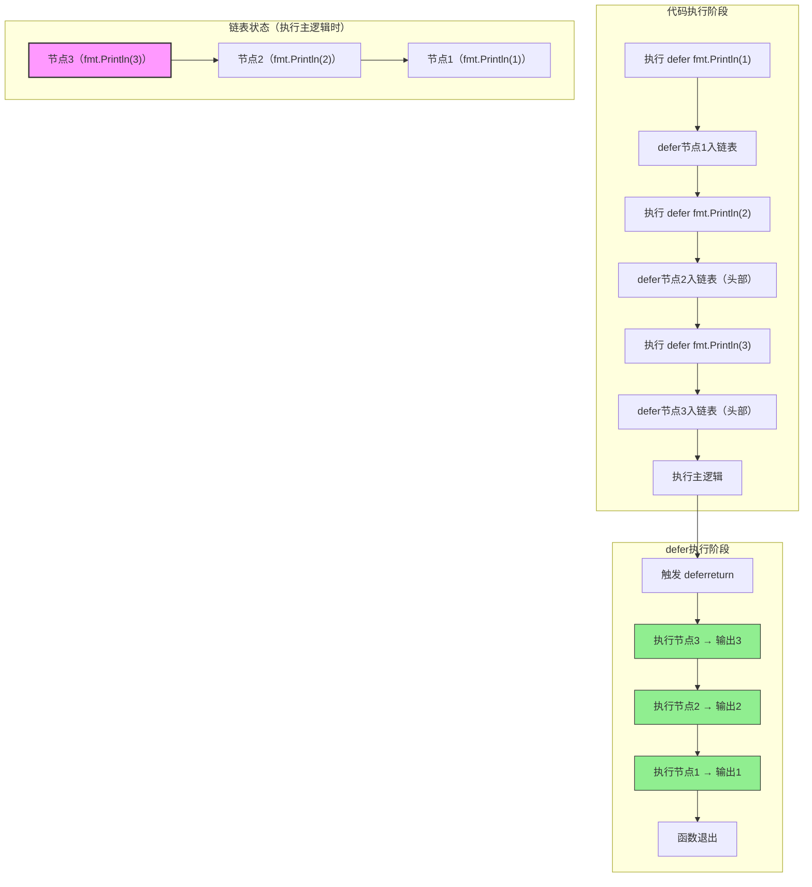
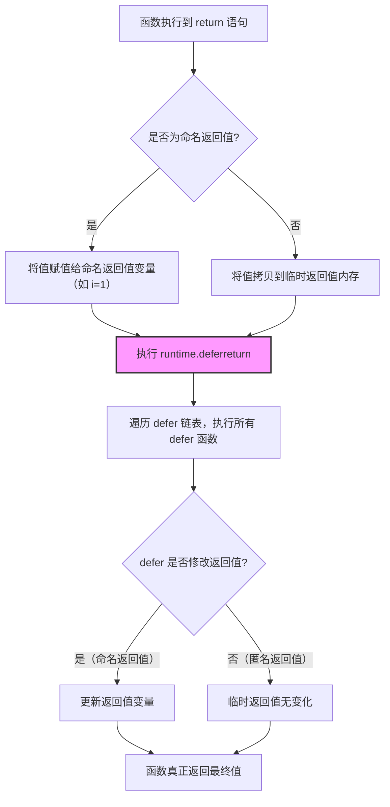
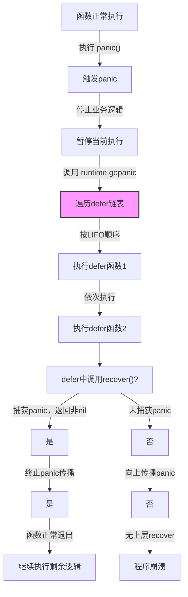
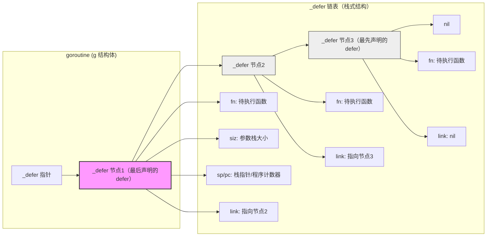
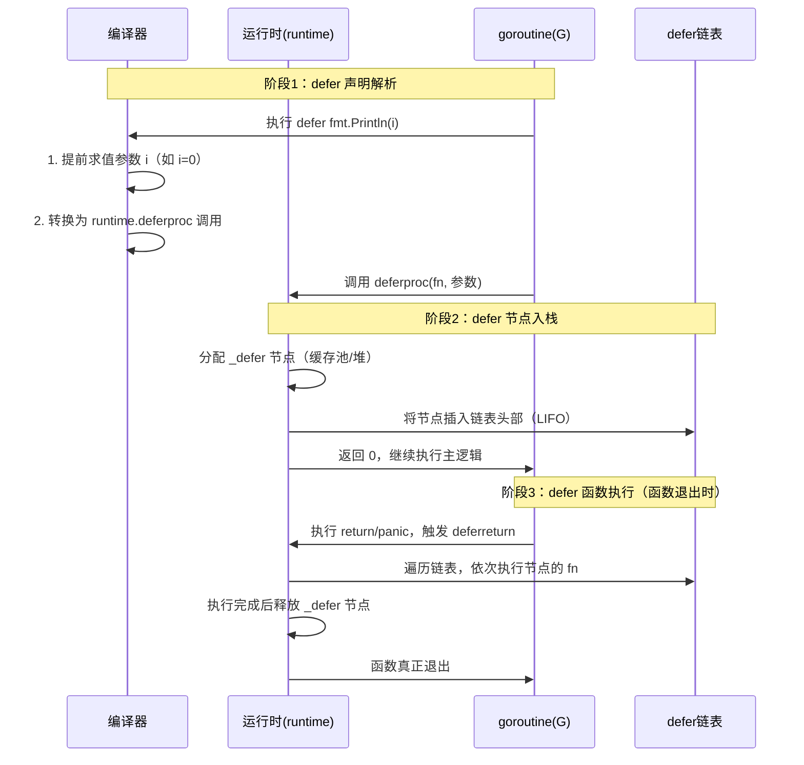

`defer` 是 Go 语言特有的关键字，用于`延迟执行函数调用`，核心场景是资源释放、异常捕获、操作收尾等，能让代码更简洁、健壮，是 Go 错误处理和资源管理的核心工具之一。

## 核心特性

### 基本定义与语法
`defer` 后跟一个函数调用（不能是表达式/语句），该函数会在`包含 defer 语句的函数执行完毕前`（即 `return` 之后、函数退出之前）执行，语法：

```go
func main() {
    defer fmt.Println("延迟执行") // 最后执行
    fmt.Println("主逻辑")
}
// 输出：
// 主逻辑
// 延迟执行
```

### 核心行为规则

| 规则 | 说明 |
|------|------|
| 执行时机 | 包含 defer 的函数`返回前`执行（先执行 return 赋值，再执行 defer，最后真正返回） |
| 参数求值时机 | defer 后函数的参数在`defer 语句执行时`就已计算（而非函数执行时） |
| 执行顺序 | 多个 defer 按`后进先出（LIFO）`执行（最后声明的 defer 最先执行） |
| 作用域 | 仅作用于当前函数，goroutine 退出时也会触发所属函数的 defer |
| 异常处理 | 即使函数发生 panic，defer 仍会执行（可用于 panic 捕获） |

## 关键用法详解

### 基础用法：多个 defer 的执行顺序
多个 defer 遵循"栈式"执行规则，最后声明的先执行：

```go
func main() {
    defer fmt.Println("defer 1")
    defer fmt.Println("defer 2")
    defer fmt.Println("defer 3")
    fmt.Println("主逻辑")
}
// 输出：
// 主逻辑
// defer 3
// defer 2
// defer 1
```



### 核心：参数提前求值
defer 后函数的参数在 `defer` 语句被解析时就已确定，而非执行时：

```go
func main() {
    i := 0
    defer fmt.Println("defer 执行：", i) // 参数 i=0 已确定
    i++
    fmt.Println("主逻辑：", i)
}
// 输出：
// 主逻辑：1
// defer 执行：0
```

`注意`：若 defer 后是匿名函数且引用外部变量，变量值会在执行时确定（闭包特性）：

```go
func main() {
    i := 0
    defer func() { fmt.Println("defer 执行：", i) }() // 闭包引用 i，执行时求值
    i++
    fmt.Println("主逻辑：", i)
}
// 输出：
// 主逻辑：1
// defer 执行：1
```

### 与 return 的执行顺序
defer 执行在 `return` 赋值之后、函数真正返回之前，可修改返回值（仅对命名返回值有效）：

#### 场景1：匿名返回值（无法修改）
```go
func f() int {
    i := 1
    defer func() { i++ }() // 修改的是局部变量 i，而非返回值
    return i
}
func main() {
    fmt.Println(f()) // 输出：1
}
```

#### 场景2：命名返回值（可修改）
```go
func f() (i int) { // 命名返回值 i
    i = 1
    defer func() { i++ }() // 直接修改返回值 i
    return i // 先赋值 i=1，再执行 defer（i=2），最后返回
}
func main() {
    fmt.Println(f()) // 输出：2
}
```

`执行流程拆解`：
1. 执行 return 语句：将 i 赋值给返回值（命名返回值直接用自身）；
2. 执行 defer 语句（修改返回值）；
3. 函数真正返回结果。



### 捕获 panic（与 recover 配合）
defer 是唯一能捕获 panic 的机制（`recover()` 必须在 defer 中调用才有效）：

```go
func safeFunc() {
    defer func() {
        if err := recover(); err != nil {
            fmt.Println("捕获 panic：", err) // 输出：捕获 panic：主动触发 panic
        }
    }()
    panic("主动触发 panic") // 触发 panic，后续代码停止执行
    fmt.Println("不会执行")
}

func main() {
    safeFunc()
    fmt.Println("主函数继续执行") // panic 被捕获，主函数不中断
}
```



## 核心使用场景（附示例）

`defer` 的核心价值是`让"收尾逻辑"紧跟"创建逻辑"`，确保函数无论正常/异常退出，收尾操作都能执行。以下是最符合 Go 设计哲学的场景：

### 1. 资源释放（最核心场景）
确保文件、网络连接、锁、数据库连接等资源在函数退出时释放，避免泄漏。这是 `defer` 最经典、最不可替代的用法。

#### 示例1：文件/句柄关闭
```go
func readConfig(path string) ([]byte, error) {
    f, err := os.Open(path)
    if err != nil {
        return nil, err
    }
    defer f.Close() // 紧跟 Open 后声明，确保文件最终关闭

    // 读取文件逻辑
    data, err := io.ReadAll(f)
    if err != nil {
        return nil, err // 即使报错，defer 仍会执行 Close
    }
    return data, nil
}
```

#### 示例2：锁释放
```go
func updateCache(cache map[string]string, mu *sync.Mutex, key, val string) {
    mu.Lock()
    defer mu.Unlock() // 紧跟 Lock 后声明，避免忘记解锁

    cache[key] = val
    // 即使后续逻辑报错，锁也会释放，避免死锁
}
```

#### 示例3：网络/数据库连接关闭
```go
func queryDB(sql string) (*sql.Rows, error) {
    conn, err := sql.Open("mysql", "dsn")
    if err != nil {
        return nil, err
    }
    defer conn.Close() // 函数退出时关闭连接

    rows, err := conn.Query(sql)
    return rows, err
}
```

### 2. 异常捕获（与 recover 配合）
`defer` 是唯一能捕获 `panic` 的机制（`recover()` 必须在 `defer` 中调用才有效），用于保证程序不崩溃，或优雅处理运行时异常。

```go
func safeProcess() {
    defer func() {
        // 捕获 panic 并转为错误处理
        if err := recover(); err != nil {
            log.Printf("处理异常：%v，程序继续运行", err)
        }
    }()

    // 可能触发 panic 的危险逻辑
    riskyOperation()
}
```

`进阶：封装通用异常捕获函数`
```go
func withRecover(fn func()) {
    defer func() {
        if err := recover(); err != nil {
            log.Printf("捕获 panic：%v", err)
        }
    }()
    fn()
}

// 调用：简化重复的 recover 逻辑
func main() {
    withRecover(func() {
        riskyOperation()
    })
}
```

### 3. 操作收尾（日志/统计/清理）
函数退出时记录日志、统计执行时间、清理临时数据等，让收尾逻辑与业务逻辑解耦。

#### 示例1：统计函数执行耗时
```go
func processData(data []int) {
    start := time.Now()
    defer func() {
        // 函数退出时打印耗时，无需在每个 return 前重复写
        log.Printf("处理数据耗时：%v", time.Since(start))
    }()

    // 复杂的业务逻辑
    sort.Ints(data)
    // ...
}
```

#### 示例2：记录函数出入日志
```go
func apiHandler(w http.ResponseWriter, r *http.Request) {
    log.Printf("进入接口：%s", r.URL.Path)
    defer func() {
        log.Printf("退出接口：%s", r.URL.Path)
    }()

    // 接口处理逻辑
    w.WriteHeader(http.StatusOK)
}
```

### 4. 批量操作的逆序清理
多个资源需清理时，利用 `defer` 后进先出（LIFO）的特性，实现"先创建后清理"。

```go
func multiResource() {
    // 资源1：先创建
    res1 := openResource1()
    defer closeResource1(res1)

    // 资源2：后创建
    res2 := openResource2()
    defer closeResource2(res2) // 先执行（清理资源2）

    // 业务逻辑
    // 函数退出时：先 closeResource2 → 再 closeResource1，符合资源清理顺序
}
```

## 最佳实践（避坑核心）

### 1. 「紧跟原则」：defer 紧跟资源创建/锁获取
- `原则`：声明 `defer` 的语句必须紧跟在资源创建（如 `Open`/`Lock`）之后，且在错误检查之后。
- `原因`：避免资源创建成功但 `defer` 未声明（如错误检查后直接 return），导致资源泄漏。

```go
// 正确示例
func good() {
    f, err := os.Open("file.txt")
    if err != nil { // 先检查错误
        return
    }
    defer f.Close() // 紧跟 Open，确保执行
}

// 错误反例：defer 放在错误检查前，若 Open 失败，f 为 nil，Close 会 panic
func bad() {
    f, err := os.Open("file.txt")
    defer f.Close() // 危险：f 可能为 nil
    if err != nil {
        return
    }
}
```

### 2. 「精简原则」：defer 函数逻辑尽量简单
- `原则`：`defer` 包裹的函数仅做"收尾操作"（如 Close/Unlock/日志），不包含复杂业务逻辑。
- `原因`：复杂逻辑可能引入新的 panic（如 nil 指针），或增加调试难度。

```go
// 正确示例：defer 仅做简单解锁
func good() {
    mu.Lock()
    defer mu.Unlock() // 逻辑简单，无副作用
    // 业务逻辑
}

// 错误反例：defer 包含复杂逻辑，引入新风险
func bad() {
    mu.Lock()
    defer func() {
        mu.Unlock()
        // 复杂逻辑：可能触发 panic，导致解锁后代码执行失败
        if err := updateDB(); err != nil {
            panic(err)
        }
    }()
}
```

### 3. 「性能原则」：高频循环中避免滥用 defer
- `原则`：`defer` 有微小的性能开销（链表操作+内存分配），`千万级以上循环`中避免使用。
- `解决方法`：手动替代 `defer`，或把循环内的 `defer` 提到循环外。

```go
// 错误反例：循环内高频创建 defer，性能差
func badLoop() {
    mu := &sync.Mutex{}
    for i := 0; i < 1000000; i++ {
        mu.Lock()
        defer mu.Unlock() // 每次循环创建 defer 节点，开销大
        // 简单逻辑
    }
}

// 正确示例：手动解锁，避免循环内 defer
func goodLoop() {
    mu := &sync.Mutex{}
    for i := 0; i < 1000000; i++ {
        mu.Lock()
        // 简单逻辑
        mu.Unlock() // 手动解锁，无 defer 开销
    }
}
```

### 4. 「值传递原则」：明确 defer 参数的求值时机
- `原则`：若需固定值，用参数传递（提前求值）；若需最终值，用闭包（延迟求值）。
- `核心区别`：`defer` 后函数的参数在声明时求值，闭包引用的变量在执行时求值。

```go
// 场景1：需要固定值（如操作开始时的变量值）
func fixedValue() {
    i := 0
    // 参数传递：i=0 提前求值，defer 执行时输出 0
    defer fmt.Println("固定值：", i)
    i++
}

// 场景2：需要最终值（如函数退出时的变量值）
func finalValue() {
    i := 0
    // 闭包引用：执行时求值，输出 1
    defer func() { fmt.Println("最终值：", i) }()
    i++
}
```

### 5. 「返回值原则」：修改返回值需用命名返回值
- `原则`：若需通过 `defer` 修改函数返回值，必须声明`命名返回值`；匿名返回值无法修改。

```go
// 正确示例：命名返回值，defer 可修改
func goodReturn() (res int) {
    res = 1
    defer func() { res++ }() // 修改命名返回值 res
    return res // 最终返回 2
}

// 错误反例：匿名返回值，defer 无法修改
func badReturn() int {
    res := 1
    defer func() { res++ }() // 修改的是局部变量，而非返回值
    return res // 最终返回 1
}
```

### 6. 「可测原则」：defer 不影响单元测试
- `原则`：避免在 `defer` 中执行无法 mock 的操作（如直接打印日志、调用外部接口），影响单元测试。
- `解决方法`：将收尾逻辑抽象为接口，便于测试。

```go
// 正确示例：抽象日志接口，便于 mock
type Logger interface {
    Info(string)
}

func process(logger Logger) {
    defer logger.Info("处理完成") // 依赖注入，测试时可 mock
}

// 测试时传入 mock Logger，避免真实日志输出
```

## 常见错误用法（附原因+修复方案）

### 1. 错误1：调用 nil 资源的方法（panic）
- `错误代码`：
```go
func bad() {
    var f *os.File // 初始为 nil
    defer f.Close() // panic: runtime error: invalid memory address or nil pointer dereference
    f, _ = os.Open("file.txt")
}
```

- `原因`：`defer` 声明时 `f` 为 nil，执行 `Close` 时触发 nil 指针 panic。

- `修复`：`defer` 放在资源创建成功且错误检查之后：
```go
func good() {
    f, err := os.Open("file.txt")
    if err != nil {
        return
    }
    defer f.Close() // f 非 nil，安全
}
```

### 2. 错误2：循环内 defer 导致资源堆积
- `错误代码`：
```go
func bad() {
    for i := 0; i < 3; i++ {
        f, _ := os.Open(fmt.Sprintf("file%d.txt", i))
        defer f.Close() // 3 个 defer 都在函数退出时执行，文件句柄堆积
        // 读取文件后，文件句柄未及时释放，可能耗尽系统资源
    }
}
```

- `原因`：`defer` 仅在函数退出时执行，循环内创建的资源会一直占用，直到函数结束。

- `修复`：将循环内的逻辑封装为子函数，让 `defer` 在子函数退出时执行：
```go
func readFile(path string) {
    f, err := os.Open(path)
    if err != nil {
        return
    }
    defer f.Close() // 子函数退出时关闭，及时释放
    // 读取逻辑
}
func good() {
    for i := 0; i < 3; i++ {
        readFile(fmt.Sprintf("file%d.txt", i))
    }
}
```


### 3. 错误3：defer 中忽略错误（如 Close 报错）
- `错误代码`：
```go
func bad() {
    f, _ := os.Create("file.txt")
    defer f.Close() // 忽略 Close 可能返回的错误（如磁盘满）
    f.WriteString("data")
}
```

- `原因`：`Close`（尤其是写文件的 Close）可能返回错误（如数据未刷盘），忽略会导致数据丢失。

- `修复`：在 `defer` 中检查错误（重要场景）：
```go
func good() {
    f, err := os.Create("file.txt")
    if err != nil {
        return
    }
    defer func() {
        if err := f.Close(); err != nil {
            log.Printf("关闭文件失败：%v", err) // 捕获 Close 错误
        }
    }()
    f.WriteString("data")
}
```

### 4. 错误4：recover 未判断 nil（无效捕获）
- `错误代码`：
```go
func bad() {
    defer recover() // 直接调用 recover，未判断返回值，无效
    panic("错误")
}
```

- `原因`：`recover()` 返回 nil 时（无 panic），直接调用不会有任何效果；有 panic 时，也未处理错误。

- `修复`：必须在 `defer` 中判断 `recover()` 的返回值：
```go
func good() {
    defer func() {
        if err := recover(); err != nil {
            log.Printf("捕获 panic：%v", err)
        }
    }()
    panic("错误")
}
```

### 5. 错误5：defer 嵌套（增加调试难度）
- `错误代码`：
```go
func bad() {
    defer func() {
        defer func() {
            // 嵌套 defer：执行顺序混乱，调试困难
            log.Println("内层 defer")
        }()
        log.Println("外层 defer")
    }()
    log.Println("主逻辑")
}
```

- `原因`：嵌套 `defer` 破坏"后进先出"的直观性，执行顺序难以追踪，且易引入逻辑错误。

- `修复`：拆解为多个扁平的 `defer`：
```go
func good() {
    defer log.Println("defer 1")
    defer log.Println("defer 2")
    log.Println("主逻辑")
    // 执行顺序：主逻辑 → defer 2 → defer 1，清晰可预测
}
```

## Go defer 关键字底层实现原理

`defer` 的优雅背后是 Go 运行时（runtime）对函数调用栈的特殊处理，其核心是`在函数执行时将 defer 调用入栈，函数退出前按栈序执行`。理解底层原理能帮你精准规避 defer 的坑（如参数求值、返回值修改等）。

### 核心数据结构：defer 链表
Go 运行时为每个 goroutine 维护了一个 `defer 链表`（栈式结构），存储待执行的 defer 调用。核心结构体是 `runtime._defer`（简化版）：

```go
// src/runtime/runtime2.go
type _defer struct {
    siz     int32        // defer 函数的参数栈大小
    started bool         // 是否已开始执行
    sp      uintptr      // 调用 defer 时的栈指针
    pc      uintptr      // 调用 defer 时的程序计数器
    fn      func()       // 待执行的 defer 函数（包装后的闭包）
    _panic  *_panic      // 关联的 panic 信息（若有）
    link    *_defer      // 指向下一个 defer 节点（链表）
}
```

- `链表结构`：每个 goroutine 的 `g` 结构体中包含 `_defer` 指针，指向当前最外层的 defer 节点；
- `栈式特性`：新的 defer 节点会被插入到链表头部（`link` 指向旧节点），执行时从头部遍历（后进先出）。



### defer 的完整执行流程
defer 的生命周期分为 `3 个阶段`：`defer 语句解析` → `defer 节点入栈` → `defer 函数执行`。



#### 阶段1：defer 语句解析（编译期+运行期）
Go 编译器会对 `defer xxx()` 语句做特殊处理：
1. `编译期`：将 defer 语句转换为 `runtime.deferproc` 调用，并将 defer 函数的参数提前求值（核心！）；
2. `运行期`：执行 `deferproc`，创建 `_defer` 节点并插入 goroutine 的 defer 链表头部。

##### 关键：参数提前求值的原理
编译器会将 defer 函数的参数在 `deferproc` 调用时计算，并将参数值拷贝到 `_defer` 节点的内存空间中。例如：

```go
i := 0
defer fmt.Println(i) // 编译期确定：先计算 i=0，再传入 deferproc
i++
```

等价于：

```go
i := 0
// 提前求值参数 i=0，封装为闭包
tmp := i
defer func() { fmt.Println(tmp) }()
i++
```

而闭包形式的 defer（`defer func() { fmt.Println(i) }()`）因参数未提前传递，仅捕获变量地址，执行时才取值。

#### 阶段2：defer 节点入栈（runtime.deferproc）
`deferproc` 函数的核心逻辑：
1. 为当前 defer 调用分配 `_defer` 节点（从缓存池或堆中分配）；
2. 将 defer 函数、参数、栈指针（sp）、程序计数器（pc）等信息写入节点；
3. 将节点插入到 goroutine 的 `_defer` 链表头部；
4. 返回 0（确保 defer 语句后代码继续执行）。

#### 阶段3：defer 函数执行（runtime.deferreturn）
defer 函数的执行触发时机有 3 种：

##### 1. 函数正常返回（最常见）
编译器会在函数的 `return` 语句处插入 `runtime.deferreturn` 调用，核心逻辑：
```
遍历 goroutine 的 defer 链表 → 依次执行每个 _defer 节点的 fn → 释放节点内存 → 直到链表为空
```

`与 return 的执行顺序拆解`：

```go
func f() (i int) {
    i = 1
    defer func() { i++ }()
    return i
}
```

编译后等价于：

```go
func f() (i int) {
    i = 1
    // 1. 执行 deferproc：创建 defer 节点（fn=func() { i++ }）
    runtime.deferproc(...)
    // 2. 执行 return 赋值：i = i（命名返回值直接赋值自身）
    // 3. 执行 deferreturn：遍历 defer 链表，执行 i++（i=2）
    runtime.deferreturn(...)
    // 4. 函数真正返回
}
```

##### 2. 函数触发 panic
当函数执行 `panic()` 时，运行时会调用 `runtime.gopanic`，核心逻辑：
```
暂停当前执行 → 遍历 defer 链表，执行所有 defer 函数 → 若 defer 中调用 recover()，则终止 panic；否则向上传播 panic
```

这也是 `recover()` 必须在 defer 中调用的原因：只有 panic 触发的 defer 执行流程，才能捕获 panic 并恢复。

##### 3. goroutine 退出
若 goroutine 未正常返回（如被终止），运行时会调用 `runtime.runfinizers`，遍历 defer 链表并执行剩余 defer 函数，避免资源泄漏。

### 关键特性的原理支撑

#### 1. 多个 defer 后进先出（LIFO）
因为新的 `_defer` 节点总是插入到链表头部，`deferreturn` 遍历链表时从头部开始执行，自然形成"最后声明的 defer 最先执行"。

示例：
```go
defer fmt.Println(1)
defer fmt.Println(2)
defer fmt.Println(3)
```
链表结构：`3 → 2 → 1`，执行顺序：3 → 2 → 1。

#### 2. 命名返回值可被 defer 修改
- `命名返回值`：函数的返回值是函数栈帧的一部分，defer 函数运行在同一栈帧中，可直接修改返回值的内存地址；
- `匿名返回值`：return 时会将局部变量拷贝到临时内存（返回值），defer 修改的是原局部变量，而非临时内存，因此无法修改返回值。

#### 3. defer 的性能开销
早期 Go 版本中 defer 因堆分配和链表遍历有明显开销，Go 1.13 后引入 `defer 栈优化`（开放编码，open coding）：
- 对简单 defer（无闭包、无参数），编译器直接将 defer 函数内联到函数末尾，跳过链表操作；
- 对复杂 defer，仍使用链表，但优化了内存分配（defer 池复用）。

### 核心原理总结

| 特性 | 底层原理 |
|------|----------|
| 参数提前求值 | 编译期将参数计算后传入 deferproc，值拷贝到 _defer 节点 |
| 后进先出执行 | _defer 节点插入链表头部，deferreturn 从头部遍历执行 |
| 能修改命名返回值 | defer 函数运行在原函数栈帧中，直接操作返回值的内存地址 |
| 能捕获 panic | panic 触发 gopanic 函数，遍历 defer 链表执行，recover 终止 panic 传播 |
| 性能优化（Go 1.13+） | 简单 defer 内联执行（开放编码），复杂 defer 复用 defer 池减少分配开销 |

### 原理层面的避坑指南
1. `循环内 defer 性能问题`：
   - 原理：每次循环创建 `_defer` 节点，链表操作+内存分配带来开销；
   - 解决：将循环内的 defer 提到循环外（若逻辑允许），或手动替代 defer（如手动解锁）。

2. `闭包 defer 变量引用问题`：
   - 原理：闭包捕获变量地址，执行时才取值，而非提前拷贝；
   - 解决：若需固定值，提前将变量值作为参数传入 defer 函数。

3. `recover 必须在 defer 中调用`：
   - 原理：只有 panic 触发的 defer 执行流程会关联 `_panic` 结构体，recover 需读取该结构体才能捕获 panic；
   - 错误示例：`recover()` 直接写在函数中（未在 defer 里），会返回 nil，无法捕获 panic。

## 总结

| 核心要点 | 关键结论 |
|---------|----------|
| 执行时机 | 函数 return 后、退出前，panic 时也会执行 |
| 执行顺序 | 多个 defer 后进先出（LIFO）|
| 参数求值 | defer 语句执行时求值，闭包引用变量则执行时求值 |
| 返回值修改 | 仅命名返回值可通过 defer 修改 |
| 核心价值 | 资源释放、panic 捕获、操作收尾，让"收尾逻辑"紧跟"创建逻辑"，代码更易维护 |
| 避坑点 | 1. 循环内避免高频使用 defer<br />2. 注意参数提前求值问题<br />3. recover 必须在 defer 中调用 |

| 维度 | 核心要点 |
|------|----------|
| 核心场景 | 1. 资源释放（Close/Lock/连接）<br />2. panic 捕获（与 recover 配合）<br />3. 收尾操作（日志/耗时统计） |
| 最佳实践 | 1. 紧跟资源创建声明<br />2. 逻辑精简无副作用<br />3. 高频循环避免滥用<br />4. 明确参数求值时机<br />5. 修改返回值用命名返回值 |
| 错误规避 | 1. 避免 nil 资源调用方法<br />2. 循环内避免资源堆积<br />3. 不忽略 Close 等错误<br />4. recover 必须判断 nil<br />5. 禁止 defer 嵌套 |

`defer` 是 Go 语言"优雅处理收尾"的核心设计，遵循"先声明后执行、资源释放紧跟创建"的原则，能大幅提升代码的健壮性和可读性。

理解 defer 的底层链表结构和执行流程，就能彻底搞懂"参数提前求值""返回值修改""LIFO 执行"等特性的本质，避免大部分使用误区。

遵循"紧跟、精简、高性能"的原则，能让代码更健壮、易维护；反之，滥用或误用会引入性能问题、逻辑错误甚至系统级故障（如资源泄漏、死锁）。