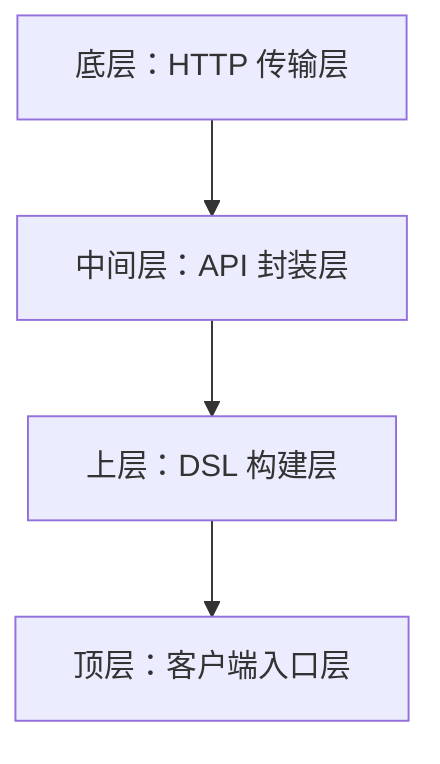
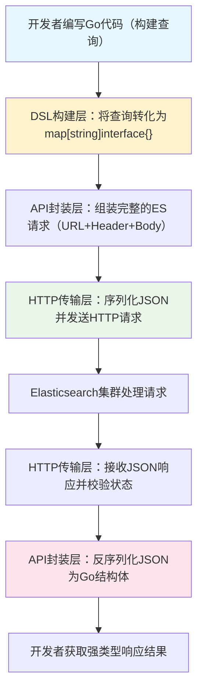

## 一、框架整体介绍

`elastic` 是 Go 语言生态中**最主流、最成熟的 Elasticsearch 客户端**，由 Oliver Eilhard 维护，目前主要维护 `v7` 版本（适配 Elasticsearch 7.x），也有历史版本适配 5.x/6.x。

### 1.1 核心定位

它是 Elasticsearch REST API 的**强类型 Go 语言封装**——Elasticsearch 本身通过 RESTful API 对外提供服务，`elastic` 把这些 HTTP 接口封装成 Go 的结构体、方法和函数，让开发者无需手动拼接 HTTP 请求、解析 JSON 响应，直接用 Go 代码操作 Elasticsearch（如索引、查询、聚合、集群管理等）。

### 1.2 核心特性

- **版本适配**：严格对齐 Elasticsearch 官方 API 版本，不同分支适配不同 ES 大版本（如 `v7` 分支适配 ES 7.x，`v6` 适配 6.x）
- **强类型封装**：所有 ES API 的请求参数、响应体都封装为 Go 结构体，编译期即可发现参数错误，避免运行时 JSON 解析问题
- **全 API 覆盖**：支持 ES 几乎所有功能（索引 CRUD、DSL 查询、聚合分析、快照备份、集群监控、索引模板管理等）
- **并发安全**：客户端实例（`*elastic.Client`）支持并发调用，可全局复用，无需为每个请求创建新客户端
- **灵活配置**：支持自定义 HTTP 客户端（如设置超时、代理、TLS 证书）、重试策略、熔断机制、请求追踪等
- **响应处理**：内置 JSON 解析、错误处理、分页封装，简化响应结果的提取（如聚合结果、命中数据）
- **兼容性**：兼容 Elastic Cloud（阿里云 ES、AWS ES 等托管服务），支持自定义 URL 和认证方式（Basic Auth、API Key 等）

### 1.3 生态地位

在 Go 语言操作 Elasticsearch 的场景中，`elastic` 是事实上的标准：

- 替代了 Elastic 官方早期的 Go 客户端（官方后来推出 `elastic/go-elasticsearch`，但 `elastic` 因易用性仍被广泛使用）
- 大量开源项目（如日志收集、监控系统）都基于它封装 ES 操作
- 文档完善、社区活跃，问题修复和版本迭代及时

---

## 二、核心实现原理

`elastic` 的核心实现逻辑可拆解为 4 个层次，从底层到上层依次是：



### 2.1 底层：HTTP 传输层

这是框架的基础，负责处理与 Elasticsearch 集群的 HTTP 通信，核心逻辑：

- **客户端初始化**：开发者创建 `*elastic.Client` 时，需传入 ES 集群地址（如 `http://127.0.0.1:9200`），框架会初始化一个可复用的 HTTP 客户端（基于 `net/http` 包），支持配置超时、TLS、认证信息（如 Basic Auth、API Key）
- **请求发送**：所有 ES 操作最终都会转化为 HTTP 请求（GET/POST/PUT/DELETE 等），框架会将 Go 结构体格式的请求参数序列化为 JSON，设置 HTTP 头（如 `Content-Type: application/json`、认证头），选择 ES 节点（支持节点轮询、故障转移）发送请求
- **响应处理**：接收 ES 的 HTTP 响应后，框架会检查响应状态码（如 404 表示索引不存在，500 表示 ES 内部错误），将 JSON 响应反序列化为对应的 Go 结构体，封装统一的错误类型（`*elastic.Error`），方便开发者处理

核心源码逻辑（简化）：

```go
func (c *Client) performRequest(ctx context.Context, req *transport.Request) (*transport.Response, error) {
    node, err := c.transport.SelectNode()
    if err != nil {
        return nil, err
    }
    httpReq, err := req.ToHTTPRequest(node.URL)
    if err != nil {
        return nil, err
    }
    httpResp, err := c.httpClient.Do(httpReq.WithContext(ctx))
    if err != nil {
        return nil, err
    }
    resp, err := transport.NewResponse(httpResp)
    if err != nil {
        return nil, err
    }
    if resp.IsError() {
        return nil, resp.Error()
    }
    return resp, nil
}
```

### 2.2 中间层：API 封装层

这一层是框架的核心，将 Elasticsearch 的每个 REST API 封装为对应的 Go 方法，核心逻辑：

- **API 一一映射**：ES 的每个 REST 端点都对应 `elastic` 的一个方法，例如：
  - ES 的 `PUT /{index}/{id}`（创建文档）→ `client.Index().Index("index").Id("id").BodyJson(doc).Do(ctx)`
  - ES 的 `GET /{index}/{id}`（获取文档）→ `client.Get().Index("index").Id("id").Do(ctx)`
  - ES 的 `POST /{index}/_search`（搜索文档）→ `client.Search().Index("index").Query(query).Do(ctx)`

- **请求参数封装**：每个 API 方法都对应一个"请求构建器"结构体（如 `IndexRequest`、`SearchRequest`），开发者通过链式调用设置参数（如索引名、文档 ID、查询条件），框架会将这些参数转化为 ES API 所需的 JSON 格式

- **响应结构体封装**：每个 API 的响应都封装为对应的 Go 结构体（如 `IndexResponse`、`SearchResponse`），例如 `SearchResponse` 包含 `Hits`（命中结果）、`Aggregations`（聚合结果）、`TotalHits`（总命中数）等字段，直接映射 ES 响应的 JSON 结构

核心示例（Search API 封装）：

```go
type SearchRequest struct {
    client *Client
    indices  []string
    query    Query
    sort     []Sort
    from     int
    size     int
    aggs     map[string]Aggregation
}

func (s *SearchRequest) Do(ctx context.Context) (*SearchResponse, error) {
    body, err := s.source()
    if err != nil {
        return nil, err
    }
    req := s.client.NewRequest("POST", "/_search").Body(body)
    if len(s.indices) > 0 {
        req.URL = fmt.Sprintf("/%s/_search", strings.Join(s.indices, ","))
    }
    resp, err := s.client.performRequest(ctx, req)
    if err != nil {
        return nil, err
    }
    var sr SearchResponse
    if err := json.Unmarshal(resp.Body, &sr); err != nil {
        return nil, err
    }
    return &sr, nil
}
```

### 2.3 上层：DSL 构建层

Elasticsearch 的核心是 DSL（领域特定语言）查询/聚合，这一层将 DSL 语法封装为 Go 的结构体和方法，核心逻辑：

- **DSL 结构化封装**：把 JSON 格式的 DSL 查询转化为 Go 结构体，例如：
  - ES 的 term 查询（JSON）：`{"term": {"user": "olivere"}}`
  - 对应 `elastic` 的 Go 代码：`termQuery := elastic.NewTermQuery("user", "olivere")`

  所有 DSL 元素（如 match、bool、range 查询，terms、avg、sum 聚合）都封装为对应的"Builder"结构体，实现统一的 `Source()` 方法（生成 JSON 格式的 DSL）

- **链式构建复杂 DSL**：支持嵌套构建复杂查询（如 bool 查询包含 must/should/must_not 子句）、聚合（如嵌套聚合）

- **DSL 序列化**：每个 DSL 结构体的 `Source()` 方法会将自身转化为 `map[string]interface{}`，最终序列化为 ES 可识别的 JSON 字符串

核心源码逻辑（TermQuery 示例）：

```go
type TermQuery struct {
    name  string
    value interface{}
}

func NewTermQuery(name string, value interface{}) *TermQuery {
    return &TermQuery{name: name, value: value}
}

func (q *TermQuery) Source() (interface{}, error) {
    source := make(map[string]interface{})
    term := make(map[string]interface{})
    source["term"] = term
    term[q.name] = q.value
    return source, nil
}
```

### 2.4 顶层：客户端入口层

`*elastic.Client` 是所有操作的统一入口，核心逻辑：

- **单例复用**：客户端实例是并发安全的，创建成本较高（需初始化 HTTP 客户端、节点列表），建议全局创建一个实例复用
- **方法工厂**：客户端提供一系列"工厂方法"（如 `NewIndexRequest()`、`NewSearchRequest()`），返回各 API 的构建器结构体，开发者通过链式调用配置参数后，调用 `Do(ctx)` 方法执行请求
- **扩展能力**：客户端支持配置拦截器（监控请求/响应）、重试策略（请求失败自动重试）、熔断机制（防止过多失败请求压垮 ES）等扩展功能

---

## 三、关键设计亮点

### 3.1 构建器模式

所有 API 请求、DSL 查询都采用构建器模式——先创建构建器，链式设置参数，最后调用 `Do()` 执行，既保证代码可读性，又能灵活配置复杂参数

### 3.2 接口抽象

定义了统一的 `Query`、`Aggregation` 接口，所有具体的查询/聚合类型都实现这些接口，便于扩展自定义 DSL 元素

### 3.3 延迟序列化

DSL 和请求参数不会立即序列化，而是在执行 `Do()` 时才生成 JSON，避免不必要的序列化开销

### 3.4 节点自动发现与故障转移

客户端可配置为自动发现 ES 集群节点，当某个节点不可用时，自动切换到其他节点，提升可用性

---

## 四、请求-响应流转详解

`elastic` 的本质是**"Go 结构体 → JSON 请求 → ES 处理 → JSON 响应 → Go 结构体"** 的双向转换器，所有功能都围绕这个核心流转展开。



### 4.1 第一步：DSL 构建层

这是框架最核心的"易用性封装"，核心解决"手动拼 JSON DSL 易出错"的问题。

- **核心设计**：基于**构建器模式** + **接口抽象**，所有 DSL 元素（查询、聚合、排序）都实现统一的 `Source() (interface{}, error)` 方法
- **原理细节**：
  1. 调用 `elastic.NewTermQuery("user", "olivere")` 时，框架会创建一个 `*TermQuery` 结构体，保存查询字段（`user`）和值（`olivere`）
  2. 当把查询传入 `Search()` 构建器后，框架会调用 `TermQuery.Source()` 方法，生成 `map[string]interface{}` 格式的结构化数据
  3. 若构建复杂的 `BoolQuery`（包含 `must`/`should`），框架会递归调用每个子查询的 `Source()` 方法，最终拼接成完整的布尔查询结构化数据

### 4.2 第二步：API 封装层

这一层负责把 DSL 数据组装成 Elasticsearch 能识别的完整 HTTP 请求，核心是"请求构建器"模式。

- **核心设计**：每个 ES API（如搜索、索引、删除）对应一个"请求构建器"结构体（如 `SearchRequest`、`IndexRequest`），通过链式调用配置参数，最终生成 HTTP 请求的三要素（URL、Header、Body）
- **原理细节**（以搜索请求为例）：
  1. 调用 `client.Search().Index("blog").Query(boolQuery).From(0).Size(10)` 时，框架会把这些参数（索引名、查询条件、分页）存入 `SearchRequest` 结构体
  2. 调用 `Do(ctx)` 时，框架会拼接请求 URL：`/blog/_search`（若指定多个索引则为 `/index1,index2/_search`），设置 HTTP Header：`Content-Type: application/json`、认证头（如 Basic Auth），将 DSL 结构化数据（`map[string]interface{}`）序列化为 JSON 字符串，作为请求 Body

### 4.3 第三步：HTTP 传输层

这是框架的"通信底座"，负责与 Elasticsearch 集群的网络交互，核心解决"高可用通信"问题。

- **核心设计**：基于 Go 标准库 `net/http` 封装，实现**节点选择**、**故障转移**、**请求重试**、**超时控制**等生产级特性
- **原理细节**：
  1. **节点选择**：客户端初始化时会传入 ES 集群节点列表（如 `[]string{"http://node1:9200", "http://node2:9200"}`），默认采用**轮询策略**选择节点发送请求
  2. **请求发送**：将 API 封装层生成的请求转化为 `*http.Request`，通过复用的 `*http.Client` 发送（避免频繁创建连接）
  3. **故障转移**：若某个节点请求失败（如超时、5xx 错误），自动切换到下一个节点重试
  4. **响应校验**：接收响应后，首先检查 HTTP 状态码（如 404 表示索引不存在，400 表示 DSL 语法错误），若为错误码则封装为 `*elastic.Error` 类型返回

### 4.4 第四步：响应反序列化

这是"请求-响应"的逆向过程，核心解决"手动解析 JSON 响应繁琐"的问题。

- **核心设计**：为每个 ES API 响应定义对应的强类型结构体，通过 JSON 反序列化直接映射，开发者无需手动解析字段
- **原理细节**（以搜索响应为例）：
  1. ES 返回的 JSON 响应大致如下：
     ```json
     {
         "took": 5,
         "timed_out": false,
         "hits": {
             "total": {"value": 100, "relation": "eq"},
             "hits": [{"_id": "1", "_source": {"user": "olivere"}}]
         }
     }
     ```
  2. 框架定义了 `SearchResponse` 结构体与之对应：
     ```go
     type SearchResponse struct {
         Took      int64         `json:"took"`
         TimedOut  bool          `json:"timed_out"`
         Hits      *SearchHits   `json:"hits"`
     }
     type SearchHits struct {
         Total *TotalHits `json:"total"`
         Hits  []*Hit     `json:"hits"`
     }
     type Hit struct {
         Id     string          `json:"_id"`
         Source json.RawMessage `json:"_source"`
     }
     ```
  3. 调用 `json.Unmarshal(resp.Body, &searchResp)` 将 JSON 反序列化为 `*SearchResponse`，可以直接通过 `searchResp.Hits.Hits[0].Id` 获取文档 ID

---

## 五、核心设计原理

### 5.1 并发安全的客户端设计

- **原理**：`*elastic.Client` 实例是**无状态**的（所有状态都存在请求构建器中，而非客户端本身），内部的 HTTP 客户端、节点列表等资源都是只读或通过原子操作修改的
- **效果**：可全局创建一个客户端实例，被多个 goroutine 并发调用，无需加锁，大幅降低资源开销

### 5.2 延迟序列化机制

- **原理**：DSL 构建层生成的 `map[string]interface{}` 不会立即序列化为 JSON，而是在调用 `Do()` 方法（执行请求）时才序列化
- **效果**：若在构建请求过程中修改了参数（如调整查询条件），无需重新序列化，减少不必要的性能损耗

### 5.3 可扩展的接口抽象

- **原理**：框架定义了 `Query`、`Aggregation`、`Sort` 等核心接口，所有具体的查询/聚合类型都实现这些接口：
  ```go
  type Query interface {
      Source() (interface{}, error)
  }
  var _ Query = (*TermQuery)(nil)
  ```
- **效果**：可以自定义实现 `Query` 接口，扩展框架不支持的 DSL 语法，保持与框架的兼容性

---

## 六、关键底层细节

### 6.1 JSON 处理优化

框架内部使用 `encoding/json` 作为基础，但对高频字段（如 `_source`）采用 `json.RawMessage` 延迟解析，避免不必要的反序列化开销

### 6.2 认证与加密

支持 Basic Auth、API Key、TLS/SSL 等认证方式，本质是在 HTTP 传输层添加对应的 Header（如 `Authorization: Basic xxx`）或配置 `http.Client` 的 TLS 客户端

### 6.3 请求拦截器

允许添加自定义拦截器，在请求发送前/响应接收后插入逻辑（如日志、监控、埋点），原理是在 `performRequest` 方法中执行拦截器链

---

## 七、与官方客户端对比

Elastic 官方后来推出了 `elastic/go-elasticsearch`，与 `elastic` 的核心差异如下：

| 特性                | `elastic`                | `elastic/go-elasticsearch`       |
|---------------------|----------------------------------|-----------------------------------|
| 封装方式            | 强类型封装，面向对象             | 轻量封装，接近原生 REST API      |
| 易用性              | 高（链式调用、强类型提示）       | 低（需手动拼接 JSON、解析响应）   |
| 性能                | 略低（额外的结构体序列化开销）   | 略高（更接近底层）                |
| 版本适配            | 按分支适配（v7 对应 ES 7.x）     | 严格版本对齐（每个 ES 版本对应一个客户端版本） |
| 社区成熟度          | 高（长期维护，案例多）           | 中（官方维护，但易用性差）        |

---

## 总结

1. `elastic` 是 Go 语言操作 Elasticsearch 的主流客户端，核心是**强类型封装 ES REST API**，让开发者无需直接处理 HTTP/JSON
2. 实现原理分为四层：HTTP 传输层（通信基础）→ API 封装层（映射 ES 接口）→ DSL 构建层（封装查询/聚合）→ 客户端入口层（统一调用）
3. 核心设计是**构建器模式**和**强类型映射**，兼顾易用性和类型安全，同时支持并发安全、故障转移等生产级特性
