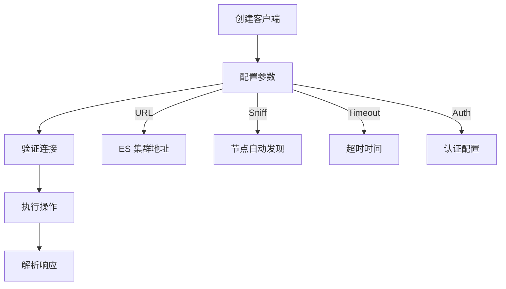
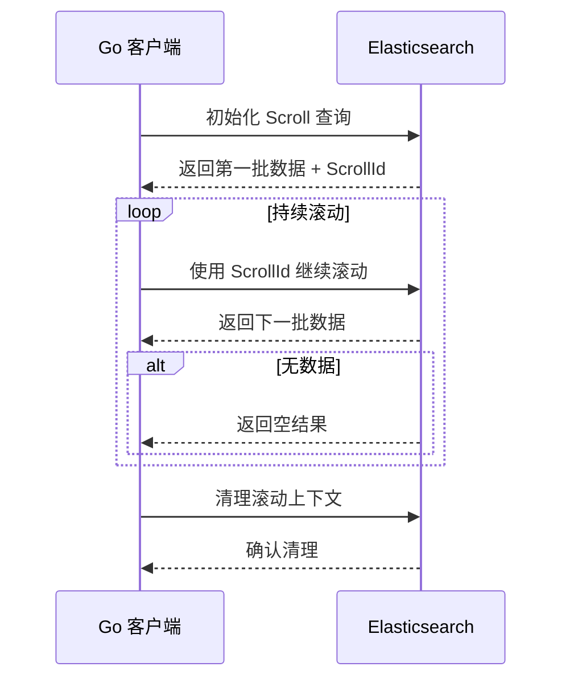
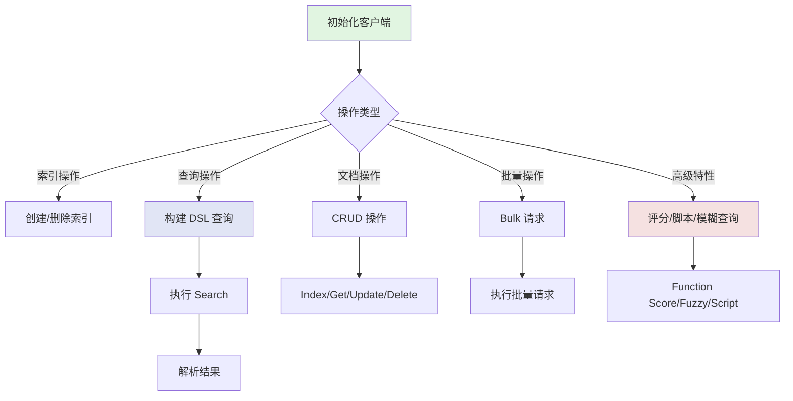

`olivere/elastic` 是 Go 语言中操作 Elasticsearch 的主流框架，基于适配 Elasticsearch 7.x 的 `v7` 版本。框架采用**构建器模式**，无需手动拼 JSON，提供强类型、易调试、并发安全的 API。

---

## 环境准备

### 安装框架

```bash
go get github.com/olivere/elastic/v7
```

### 初始化客户端

`*elastic.Client` 是所有操作的入口，**并发安全**，建议全局创建一个实例复用。

```go
package main

import (
    "context"
    "fmt"
    "log"

    "github.com/olivere/elastic/v7"
)

func main() {
    client, err := elastic.NewClient(
        elastic.SetURL("http://127.0.0.1:9200"),
        elastic.SetSniff(false),
        elastic.SetTimeout(10*time.Second),
    )
    if err != nil {
        log.Fatalf("创建客户端失败: %v", err)
    }

    info, code, err := client.Ping("http://127.0.0.1:9200").Do(context.Background())
    if err != nil {
        log.Fatalf("连接 ES 失败: %v", err)
    }
    fmt.Printf("ES 版本: %s, 状态码: %d\n", info.Version.Number, code)
}
```

**关键说明**：
- `SetSniff(true)`：自动发现 ES 集群节点（生产环境推荐）
- `SetTimeout`：避免请求长时间阻塞
- 客户端实例全局复用，无需每次请求创建



---

## 索引操作

### 创建索引

```go
mapping := `
{
    "settings": {
        "number_of_shards": 1,
        "number_of_replicas": 0
    },
    "mappings": {
        "properties": {
            "id": {"type": "keyword"},
            "title": {"type": "text", "analyzer": "ik_max_word"},
            "content": {"type": "text", "analyzer": "ik_max_word"},
            "create_time": {"type": "date", "format": "yyyy-MM-dd HH:mm:ss"}
        }
    }
}`

ctx := context.Background()
indexName := "blog"
exists, err := client.IndexExists(indexName).Do(ctx)
if err != nil {
    log.Fatalf("检查索引失败: %v", err)
}
if !exists {
    resp, err := client.CreateIndex(indexName).Body(mapping).Do(ctx)
    if err != nil {
        log.Fatalf("创建索引失败: %v", err)
    }
    if resp.Acknowledged {
        fmt.Printf("索引 %s 创建成功\n", indexName)
    }
}
```

### 删除索引

```go
resp, err := client.DeleteIndex(indexName).Do(ctx)
if err != nil {
    log.Fatalf("删除索引失败: %v", err)
}
if resp.Acknowledged {
    fmt.Printf("索引 %s 删除成功\n", indexName)
}
```

---

## 文档操作

### 定义文档结构体

```go
type Blog struct {
    ID         string `json:"id"`
    Title      string `json:"title"`
    Content    string `json:"content"`
    CreateTime string `json:"create_time"`
}
```

### 新增文档

```go
blog := Blog{
    ID:         "1",
    Title:      "Go 操作 Elasticsearch 实战",
    Content:    "olivere/elastic 框架使用教程",
    CreateTime: "2025-01-01 10:00:00",
}

indexResp, err := client.Index().
    Index(indexName).
    Id(blog.ID).
    BodyJson(blog).
    Do(ctx)
```

### 查询文档

```go
getResp, err := client.Get().
    Index(indexName).
    Id("1").
    Do(ctx)
if err != nil {
    log.Fatalf("查询文档失败: %v", err)
}
if getResp.Found {
    var blog Blog
    err := json.Unmarshal(getResp.Source, &blog)
    if err != nil {
        log.Fatalf("反序列化失败: %v", err)
    }
    fmt.Printf("文档内容: %+v\n", blog)
}
```

### 更新文档

```go
updateResp, err := client.Update().
    Index(indexName).
    Id("1").
    Script(elastic.NewScript("ctx._source.title = params.title").Param("title", "Go ES 实战（最终版）")).
    Do(ctx)
```

### 删除文档

```go
deleteResp, err := client.Delete().
    Index(indexName).
    Id("1").
    Do(ctx)
```

---

## 核心查询

### 简单查询

```go
termQuery := elastic.NewTermQuery("id", "1")

matchQuery := elastic.NewMatchQuery("title", "Go ES").
    Fuzziness("AUTO").
    Boost(2)

searchResp, err := client.Search().
    Index(indexName).
    Query(matchQuery).
    From(0).
    Size(10).
    Sort("create_time", false).
    Do(ctx)
```

### 布尔查询

```go
boolQuery := elastic.NewBoolQuery().
    Must(elastic.NewMatchQuery("title", "Go")).
    Should(elastic.NewMatchQuery("content", "elastic")).
    MustNot(elastic.NewTermQuery("id", "2")).
    Filter(elastic.NewRangeQuery("create_time").Gte("2025-01-01 00:00:00"))

searchResp, err := client.Search().
    Index(indexName).
    Query(boolQuery).
    Do(ctx)
```

### 聚合查询

```go
termsAgg := elastic.NewTermsAggregation().Field("title.keyword").Size(10)

searchResp, err := client.Search().
    Index(indexName).
    Query(elastic.NewMatchAllQuery()).
    Aggregation("title_agg", termsAgg).
    Size(0).
    Do(ctx)

agg, found := searchResp.Aggregations.Terms("title_agg")
if !found {
    log.Println("聚合结果不存在")
    return
}
for _, bucket := range agg.Buckets {
    fmt.Printf("标题: %s, 数量: %d\n", bucket.Key.(string), bucket.DocCount)
}
```

---

## 评分定制

### 基础权重提升

```go
titleQuery := elastic.NewMatchQuery("title", "Go").Boost(3.0)
contentQuery := elastic.NewMatchQuery("content", "Go").Boost(1.0)

boolQuery := elastic.NewBoolQuery().
    Should(titleQuery).
    Should(contentQuery)
```

### 函数评分查询

```go
baseQuery := elastic.NewMatchQuery("content", "ES")

decayFunc := elastic.NewLinearDecayFunctionScore("create_time").
    Origin("now").
    Scale("7d").
    Decay(0.5)

fieldValueFunc := elastic.NewFieldValueFactorFunctionScore("read_count").
    Factor(1.2).
    Modifier("log1p")

functionScoreQuery := elastic.NewFunctionScoreQuery().
    Query(baseQuery).
    AddFunction(decayFunc).
    AddFunction(fieldValueFunc).
    BoostMode("multiply").
    ScoreMode("sum").
    MaxBoost(10)
```

**核心参数说明**：

| 参数 | 说明 | 可选值 |
|------|------|--------|
| BoostMode | 基础分与函数分的组合方式 | multiply, sum, replace |
| ScoreMode | 多个函数分的组合方式 | sum, avg, max |
| 衰减函数类型 | 衰减曲线类型 | Linear, Exp, Gauss |

---

## 高级模糊查询

### 模糊查询

```go
fuzzyQuery := elastic.NewFuzzyQuery("title", "Golag").
    Fuzziness("1").
    PrefixLength(2).
    MaxExpansions(50)
```

### 正则表达式查询

```go
regexpQuery := elastic.NewRegexpQuery("title.keyword", "^Go.*实战$").
    Flags("ALL").
    MaxDeterminizedStates(10000)
```

### 通配符查询

```go
wildcardQuery := elastic.NewWildcardQuery("title.keyword", "Go*")
```

### 拼音查询

```go
matchPinyinQuery := elastic.NewMatchQuery("title.pinyin", "golang").
    Fuzziness("AUTO")
```

---

## 脚本操作

### 脚本字段

```go
scriptField := elastic.NewScriptField("total_score").
    Script(elastic.NewScript(`
        doc['read_count'].value + doc['like_count'].value
    `))

searchResp, err := client.Search().
    Index("blog").
    Query(elastic.NewMatchAllQuery()).
    ScriptField(scriptField).
    FetchSource(false).
    Do(ctx)
```

### 脚本过滤

```go
scriptFilter := elastic.NewScriptFilter(elastic.NewScript(`
    doc['read_count'].value > params.read_threshold && doc['like_count'].value > params.like_threshold
`)).Param("read_threshold", 100).Param("like_threshold", 50)

boolQuery := elastic.NewBoolQuery().
    Must(elastic.NewMatchQuery("title", "Go")).
    Filter(scriptFilter)
```

### 脚本更新

```go
updateByQueryResp, err := client.UpdateByQuery().
    Index("blog").
    Query(elastic.NewTermQuery("id", "1")).
    Script(elastic.NewScript(`
        ctx._source.read_count += 1;
    `)).
    Do(ctx)
```

---

## 批量操作

```go
bulkRequest := client.Bulk()

blog1 := Blog{ID: "2", Title: "ES 性能优化", Content: "批量操作教程", CreateTime: "2025-01-02 10:00:00"}
blog2 := Blog{ID: "3", Title: "ES 索引设计", Content: "映射优化", CreateTime: "2025-01-03 10:00:00"}

bulkRequest.Add(elastic.NewBulkIndexRequest().
    Index(indexName).
    Id(blog1.ID).
    Doc(blog1))
bulkRequest.Add(elastic.NewBulkIndexRequest().
    Index(indexName).
    Id(blog2.ID).
    Doc(blog2))

bulkResp, err := bulkRequest.Do(ctx)
```

---

## 滚动查询

```go
scrollResp, err := client.Scroll().
    Index(indexName).
    Query(elastic.NewMatchAllQuery()).
    Size(100).
    Scroll("1m").
    Do(ctx)

for {
    for _, hit := range scrollResp.Hits.Hits {
        var blog Blog
        json.Unmarshal(hit.Source, &blog)
        fmt.Printf("滚动查询文档: %+v\n", blog)
    }

    scrollResp, err = client.Scroll().
        ScrollId(scrollResp.ScrollId).
        Scroll("1m").
        Do(ctx)
    if err != nil {
        if err == io.EOF {
            break
        }
        log.Fatalf("滚动查询失败: %v", err)
    }

    if len(scrollResp.Hits.Hits) == 0 {
        break
    }
}

_, err = client.ClearScroll().ScrollId(scrollResp.ScrollId).Do(ctx)
```



---

## 请求重试与故障转移

```go
client, err := elastic.NewClient(
    elastic.SetURL("http://node1:9200", "http://node2:9200"),
    elastic.SetSniff(true),
    elastic.SetRetryBackoff(elastic.NewConstantBackoff(1*time.Second)),
    elastic.SetMaxRetries(3),
)
```

---

## 生产级实践建议

| 建议 | 说明 |
|------|------|
| 客户端复用 | 全局只创建一个 `*elastic.Client` 实例，避免频繁创建销毁 |
| 错误处理 | 所有操作必须检查 `err`，尤其注意 ES 的 4xx/5xx 错误 |
| 超时控制 | 所有请求必须设置 `context.WithTimeout`，避免服务阻塞 |
| DSL 调试 | 开发阶段可通过 `Request.Source()` 打印生成的 JSON DSL |
| 性能优化 | 批量操作代替单条操作，滚动查询代替深度分页，避免返回不必要的字段 |

**DSL 调试示例**：

```go
dsl, _ := boolQuery.Source()
dslJson, _ := json.MarshalIndent(dsl, "", "  ")
fmt.Println("生成的 DSL:", string(dslJson))
```

---

## 核心流程



---

## 总结

`olivere/elastic` 的使用核心是**构建器模式**：

1. 初始化客户端
2. 构建请求（索引/查询/聚合）
3. 链式配置参数
4. 调用 `Do(ctx)` 执行
5. 解析响应

优势是**强类型、易调试、并发安全**，无需手动处理 HTTP/JSON 细节。高频场景包括文档 CRUD、全文检索、聚合分析、批量操作，基本覆盖 ES 所有核心功能。
