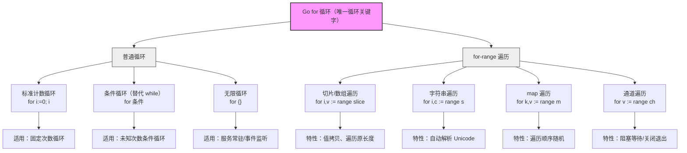
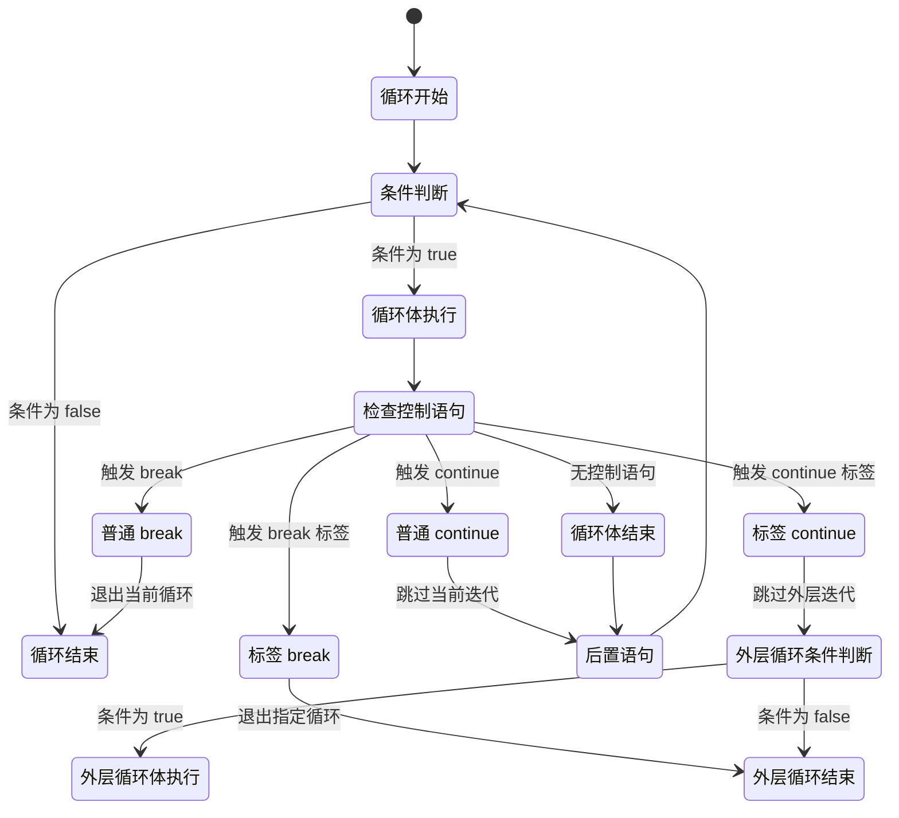
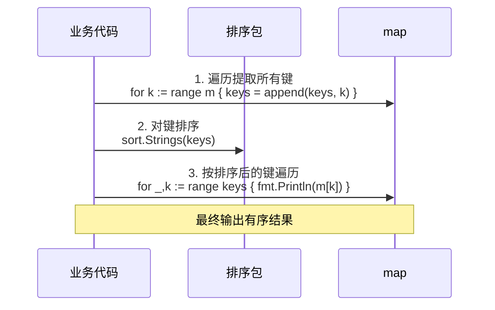
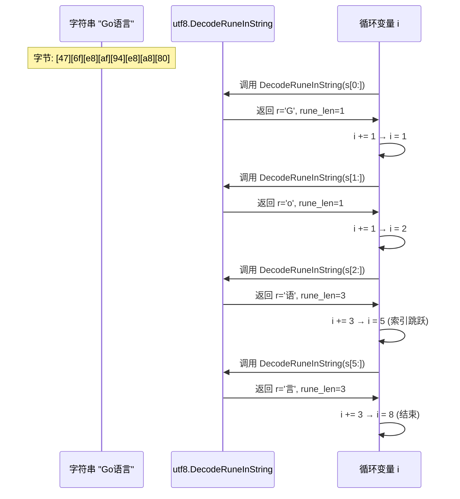
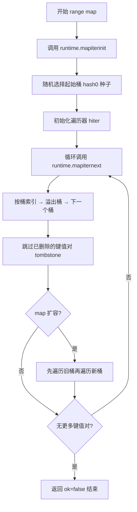

`for` 是 Go 语言**唯一的循环关键字**（无 `while`/`do-while`），但通过灵活的语法变体，可实现所有常见的循环场景，包括普通计数循环、条件循环、无限循环、范围遍历等。

## 核心语法变体

Go 的 `for` 支持 4 种语法形式，覆盖所有循环需求：

| 语法形式               | 说明                     | 典型场景               |
|------------------------|--------------------------|------------------------|
| `for 初始化; 条件; 后置` | 标准计数循环（类 C/C++） | 固定次数循环（如遍历数组） |
| `for 条件`             | 条件循环（替代 while）| 未知次数循环（如等待条件满足） |
| `for`                  | 无限循环                 | 服务常驻、事件监听     |
| `for 索引, 值 := range 集合` | 范围遍历（for-range）| 遍历数组/切片/映射/通道/字符串 |

### 标准计数循环

```go
// 语法：初始化语句（仅执行一次）→ 条件判断 → 循环体 → 后置语句
for i := 0; i < 5; i++ {
    fmt.Println(i) // 输出 0-4
}
```

- 初始化语句：可声明变量（仅作用于循环体），或修改外部变量；
- 条件表达式：为 `true` 时执行循环体，为 `false` 时退出；
- 后置语句：循环体执行后执行（通常为自增/自减）；
- 注意：初始化/后置语句可省略（但分号不能省），如 `for ; i < 5; `。

### 条件循环（替代 while）

省略初始化和后置语句，仅保留条件判断，等价于其他语言的 `while`：

```go
i := 0
for i < 5 { // 条件为 true 时循环
    fmt.Println(i)
    i++
}
```

### 无限循环

无任何条件，永久执行（需通过 `break`/`return`/`panic` 退出）：

```go
// 方式1：纯 for
for {
    fmt.Println("无限循环")
    break // 退出循环（否则卡死）
}
```
**典型场景**：服务主循环、事件监听：

```go
// 示例：简单的 TCP 服务主循环
func tcpServer() {
    listener, _ := net.Listen("tcp", ":8080")
    for { // 无限循环接收连接
        conn, err := listener.Accept()
        if err != nil {
            log.Error("接收连接失败：", err)
            continue // 跳过当前迭代，继续循环
        }
        go handleConn(conn) // 异步处理连接
    }
}
```

---

## for 关键字语法变体分类



---

### for-range 范围遍历

Go 特有的遍历方式，支持数组、切片、映射（map）、字符串、通道（channel），语法：

```go
// 遍历可索引集合（数组/切片/字符串）
for 索引, 值 := range 集合 { ... }

// 遍历映射
for 键, 值 := range 映射 { ... }

// 遍历通道（仅接收值）
for 值 := range 通道 { ... }
```

#### 遍历数组/切片

```go
nums := []int{10, 20, 30}
// 完整遍历（索引+值）
for i, v := range nums {
    fmt.Printf("索引%d：值%d\n", i, v) // 0:10, 1:20, 2:30
}

// 仅遍历索引（忽略值）
for i := range nums {
    fmt.Println("索引：", i)
}

// 仅遍历值（忽略索引，用 _ 占位）
for _, v := range nums {
    fmt.Println("值：", v)
}
```

**关键特性**：
- 遍历切片时，`v` 是元素的**值拷贝**，修改 `v` 不会影响原切片；
- 若遍历过程中切片扩容（底层数组替换），遍历仍基于原切片的副本（不会遍历新元素）。

#### 遍历字符串（按符文遍历）

```go
s := "Go语言"
// 索引：字节位置，值：rune 类型（Unicode 码点）
for i, c := range s {
    fmt.Printf("字节位置%d：字符%c（Unicode：%U）\n", i, c, c)
}
// 输出：
// 字节位置0：字符G（Unicode：U+0047）
// 字节位置1：字符o（Unicode：U+006F）
// 字节位置2：字符语（Unicode：U+8BED）
// 字节位置5：字符言（Unicode：U+8A00）
```

**关键特性**：
- 自动处理 Unicode 字符（如中文占 3 字节），避免手动处理字节；
- 若仅遍历索引，得到的是每个字符的起始字节位置。

#### 遍历映射

```go
m := map[string]int{"a": 1, "b": 2}
// 遍历键值对（顺序随机，Go 1.0+ 不保证顺序）
for k, v := range m {
    fmt.Printf("键%s：值%d\n", k, v)
}

// 仅遍历键
for k := range m {
    fmt.Println("键：", k)
}

// 仅遍历值
for _, v := range m {
    fmt.Println("值：", v)
}
```

**关键特性**：
- 遍历顺序随机（每次运行可能不同），若需有序遍历，需先提取键排序；
- 遍历过程中删除映射元素，已遍历的元素不受影响，未遍历的可能被跳过；
- 遍历过程中新增元素，不一定会被遍历到。

#### 遍历通道

```go
ch := make(chan int, 3)
ch <- 1
ch <- 2
ch <- 3
close(ch) // 必须关闭，否则 range 会永久阻塞

// 遍历通道，直到通道关闭且无数据
for v := range ch {
    fmt.Println("接收：", v) // 1,2,3
}
```

**关键特性**：
- 仅能遍历接收值（无法获取索引/键）；
- 通道未关闭时，`range` 会阻塞等待数据；
- 通道关闭且无数据时，遍历自动退出。

## 循环控制语句

Go 提供 `break`/`continue`/`goto` 控制循环流程，其中 `goto` 可配合标签实现灵活跳转：

### break：退出当前循环

```go
// 普通 break：退出当前循环
for i := 0; i < 5; i++ {
    if i == 3 {
        break // 退出循环，后续 i=3/4 不执行
    }
    fmt.Println(i) // 0,1,2
}

// 带标签 break：退出指定循环（多层循环时）
outer: // 定义标签
for i := 0; i < 3; i++ {
    for j := 0; j < 3; j++ {
        if i+j == 3 {
            break outer // 退出 outer 标签的外层循环
        }
        fmt.Printf("i=%d,j=%d\n", i, j)
    }
}
```

### continue：跳过当前迭代

```go
// 普通 continue：跳过当前迭代，执行下一次
for i := 0; i < 5; i++ {
    if i%2 == 0 {
        continue // 跳过偶数，仅输出奇数
    }
    fmt.Println(i) // 1,3
}

// 带标签 continue：跳过指定循环的当前迭代
outer:
for i := 0; i < 3; i++ {
    for j := 0; j < 3; j++ {
        if j == 1 {
            continue outer // 跳过外层循环的当前迭代（i 直接+1）
        }
        fmt.Printf("i=%d,j=%d\n", i, j) // i=0,j=0; i=1,j=0; i=2,j=0
    }
}
```

### goto：跳转到标签

`goto` 可跳转到同一函数内的标签，常用于简化多层循环退出或错误处理：

```go
// 示例：错误处理时跳转
func process() {
    for i := 0; i < 5; i++ {
        if i == 3 {
            goto end // 跳转到 end 标签
        }
        fmt.Println(i)
    }
end: // 标签定义
    fmt.Println("循环结束")
}
```

---

#### 循环控制语句执行逻辑



**注意**：`goto` 不能跨函数跳转，也不能跳转到循环体/条件块内部。

## 最佳实践

### 1. 基础循环：优先选择简洁且高性能的形式

| 场景                | 推荐写法                          | 原因                                                                 |
|---------------------|-----------------------------------|----------------------------------------------------------------------|
| 固定次数循环        | `for i := 0; i < n; i++`         | 逻辑清晰，编译器优化充分                                             |
| 未知次数条件循环    | `for 条件`（替代 while）| 比 `for ;;` 更易读，无多余语法                                       |
| 无限循环            | `for {}` 而非 `for true {}`      | 编译器优化为无条件跳转（JMP），少一次条件判断，符合 Go 设计习惯       |
| 仅遍历次数（无逻辑）| `for range make([]struct{}, n)`  | 空结构体切片无内存开销，比 `for i := 0; i < n; i++` 更简洁            |

#### 示例：优雅的无限循环（带退出条件）
```go
// 推荐：for {} + 显式 break
func serverLoop(stop chan struct{}) {
    for {
        select {
        case <-stop:
            fmt.Println("退出循环")
            break // 显式退出，逻辑清晰
        default:
            // 业务逻辑
            fmt.Println("服务运行中")
            time.Sleep(1 * time.Second)
        }
    }
}
```

### 2. for-range 遍历：按集合类型优化

#### （1）切片/数组遍历
- 小切片/简单元素：直接 `for _, v := range slice`（易读）；
- 大切片/大结构体元素：用索引访问（避免值拷贝开销）；
- 需修改元素：必须用索引（`slice[i]`），而非值拷贝（`v`）。

```go
// 优化前：大结构体值拷贝（性能差）
type BigData struct {
    Data [1024]byte
}
slice := make([]BigData, 1000)
for _, v := range slice {
    // 操作 v（拷贝后的副本，无意义）
}

// 优化后：索引访问（无拷贝，可修改原元素）
for i := range slice {
    slice[i].Data[0] = 1 // 直接修改原元素
}
```

#### （2）字符串遍历
- 需字符+字节位置：`for i, c := range s`（自动处理 Unicode）；
- 仅需字节：`for i := 0; i < len(s); i++`（跳过 Unicode 解析，性能更高）；
- 需批量处理字符：先转换为 `[]rune` 再遍历（避免重复解析）。

```go
// 推荐：处理中文等多字节字符
s := "Go语言"
runes := []rune(s) // 一次性解析所有 Unicode 字符
for i, c := range runes {
    fmt.Printf("索引%d：字符%c\n", i, c) // 0:G, 1:o, 2:语, 3:言（逻辑索引）
}
```

#### （3）map 遍历
- 需有序遍历：先提取键→排序→按键遍历；
- 仅遍历键/值：忽略不需要的部分（`for k := range m` / `for _, v := range m`）；
- 遍历中修改 map：先遍历到切片，再批量修改（避免遍历过程中增删元素）。

```go
// 有序遍历 map 的最佳写法
m := map[string]int{"c":3, "a":1, "b":2}
// 步骤1：提取键
keys := make([]string, 0, len(m))
for k := range m {
    keys = append(keys, k)
}
// 步骤2：排序键
sort.Strings(keys)
// 步骤3：按排序后的键遍历
for _, k := range keys {
    fmt.Printf("%s: %d\n", k, m[k]) // a:1, b:2, c:3
}
```

---

#### map 有序遍历流程



#### （4）通道遍历
- 遍历前确保通道会关闭（避免永久阻塞）；
- 仅需接收值：`for v := range ch`（简洁）；
- 需超时/退出：结合 `select`。

```go
// 推荐：带超时的通道遍历
ch := make(chan int)
go func() {
    for i := 0; i < 3; i++ {
        ch <- i
        time.Sleep(500 * time.Millisecond)
    }
    close(ch)
}()

// 遍历通道，5秒超时退出
for {
    select {
    case v, ok := <-ch:
        if !ok {
            fmt.Println("通道关闭")
            return
        }
        fmt.Println("接收：", v)
    case <-time.After(5 * time.Second):
        fmt.Println("遍历超时")
        return
    }
}
```

### 3. 循环控制：清晰的跳转逻辑

- 多层循环退出：用标签 `break`（避免嵌套 `if` 判断）；
- 跳过迭代：用 `continue`（而非冗余的 `if` 分支）；
- 慎用 `goto`：仅用于错误处理/多层循环退出，避免混乱。

```go
// 推荐：标签 break 退出多层循环
outer:
for i := 0; i < 3; i++ {
    for j := 0; j < 3; j++ {
        if i+j == 3 {
            break outer // 直接退出外层循环，逻辑清晰
        }
        fmt.Printf("i=%d,j=%d\n", i, j)
    }
}
```

### 4. 循环内 goroutine：正确捕获变量

循环内启动 goroutine 时，避免捕获循环变量的引用，需通过参数传递或重新声明变量：

```go
// 错误：捕获同一变量引用（所有 goroutine 输出 5）
for i := 0; i < 5; i++ {
    go func() {
        fmt.Println(i)
    }()
}

// 推荐写法1：参数传递（每次传递当前值）
for i := 0; i < 5; i++ {
    go func(n int) {
        fmt.Println(n)
    }(i)
}

// 推荐写法2：循环内重新声明变量（每次创建新变量）
for i := 0; i < 5; i++ {
    n := i
    go func() {
        fmt.Println(n)
    }()
}
```

### 5. 性能优化：减少循环内的冗余操作

- 提前计算长度：避免循环内重复调用 `len(slice)`/`len(map)`；
- 缓存函数调用结果：循环内避免频繁调用同一函数；
- 避免循环内内存分配：提前预分配切片/映射。

```go
// 优化前：循环内重复计算 len + 频繁分配
for i := 0; i < len(slice); i++ {
    tmp := make([]int, 0) // 每次循环分配内存
    tmp = append(tmp, slice[i])
}

// 优化后：提前计算长度 + 预分配内存
n := len(slice)
tmp := make([]int, 0, n) // 预分配容量
for i := 0; i < n; i++ {
    tmp = append(tmp, slice[i])
}
```

---

#### for 循环性能优化对比

```mermaid
flowchart TD
    subgraph 未优化循环（性能差）
        A[for i := 0; i < len(slice); i++] --> B[循环内重复计算 len]
        A --> C[循环内频繁分配内存<br>tmp := make([]int, 0)]
        B --> D[冗余计算开销]
        C --> E[内存分配/GC 开销]
        D & E --> F[整体性能低]
    end
    
    subgraph 优化后循环（高性能）
        G[提前计算长度<br>n := len(slice)] --> H[for i := 0; i < n; i++]
        G --> I[预分配内存<br>tmp := make([]int, 0, n)]
        H --> J[无冗余 len 计算]
        I --> K[无频繁内存分配]
        J & K --> L[整体性能高]
    end
    
    style A fill:#ffcccc,stroke:#333
    style G fill:#ccffcc,stroke:#333
    style F fill:#ffcccc,stroke:#333
    style L fill:#ccffcc,stroke:#333
```

## 核心总结表

| 遍历类型 | 语法示例 | 返回值 | 拷贝行为 | 遍历顺序 | 零值处理 |
|----------|----------|--------|----------|----------|----------|
| 数组/切片 | `for i, v := range arr` | index, value | 拷贝元素 | 顺序 0→len-1 | 跳过不执行 |
| 字符串 | `for i, r := range s` | byte index, rune | 拷贝 rune | 按 UTF-8 字符 | 跳过不执行 |
| Map | `for k, v := range m` | key, value | 拷贝 key/value | 随机顺序 | 跳过不执行 |
| Channel | `for v := range ch` | value | 拷贝元素 | 接收顺序 | 阻塞直到关闭 |

## 常见误解与澄清

### ❌ 误解 1：range 遍历 map 时顺序固定
```go
m := map[string]int{"a": 1, "b": 2, "c": 3}
for k, v := range m {
    fmt.Println(k, v)  // 每次运行顺序可能不同
}
```
**✅ 事实**：Map 遍历顺序是随机的，且每次运行可能不同。

### ❌ 误解 2：range 遍历切片时返回指针
```go
slice := []Data{{1}, {2}, {3}}
for _, item := range slice {
    item.value = 100  // 错误：修改的是副本
}
```
**✅ 事实**：Range 返回的是值的拷贝，不是引用。

### ❌ 误解 3：循环中可以直接使用变量地址
```go
for _, v := range values {
    go func() {
        fmt.Println(&v)  // 错误：所有 goroutine 共享同一变量
    }()
}
```
**✅ 事实**：需要参数传递或重新声明变量来捕获正确的值。

## 底层原理

### 一、普通 for 循环（计数/条件/无限循环）
普通 for 循环（`for 初始化; 条件; 后置`/`for 条件`/`for {}`）是 Go 中最基础的循环形式，底层直接映射为汇编的**条件跳转指令**，无额外运行时开销。

#### 1. 标准计数循环（for i:=0; i&lt;N; i++）
编译流程（以 `for i:=0; i<5; i++ { fmt.Println(i) }` 为例）：
1. **初始化阶段**：编译器将 `i:=0` 编译为栈变量赋值指令（如 `MOVQ $0, 0x8(%rsp)`），`i` 存储在 goroutine 的栈上；
2. **条件判断阶段**：编译为比较指令（`CMPQ 0x8(%rsp), $5`）+ 条件跳转指令（`JGE`，若 `i>=5` 则跳转到循环外）；
3. **循环体执行**：编译循环体内的逻辑（如 `fmt.Println(i)`）；
4. **后置阶段**：编译自增指令（`INCQ 0x8(%rsp)`），执行后跳回条件判断阶段；
5. **退出逻辑**：条件不满足时，跳转到循环后的指令地址。

**汇编简化示例**（AMD64 架构）：
```asm
# 初始化：i=0
MOVQ $0, 0x8(%rsp)        ; 将 0 存入栈地址 0x8(%rsp)（i 的地址）
loop_start:
# 条件判断：i < 5？
CMPQ 0x8(%rsp), $5        ; 比较 i 和 5
JGE loop_end              ; 若 i>=5，跳转到 loop_end
# 循环体：fmt.Println(i)
MOVQ 0x8(%rsp), %rdi      ; 将 i 传入 fmt.Println 的第一个参数
CALL fmt.Println(SB)      ; 调用 fmt.Println
# 后置阶段：i++
INCQ 0x8(%rsp)            ; i 自增
JMP loop_start            ; 跳回条件判断
loop_end:
# 循环结束后的逻辑
```

#### 2. 条件循环（for 条件）
等价于"省略初始化和后置的标准计数循环"，仅保留**条件判断 + 循环体 + 跳转**：
- 无初始化指令，直接从条件判断开始；
- 无后置指令，循环体执行后直接跳回条件判断；
- 示例：`for i<5 { ... }` 编译后仅省略 `MOVQ $0` 和 `INCQ` 指令，其余与标准循环一致。

#### 3. 无限循环（for \{\}）
编译器对 `for {}` 做了**特殊优化**：直接编译为"无条件跳转指令"（`JMP`），无任何条件判断开销，是性能最高的循环形式：

**汇编示例**：
```asm
loop_start:
# 循环体逻辑
CALL runtime.doSomething(SB)
JMP loop_start  ; 无条件跳回 loop_start，永久执行
```

⚠️ 对比 `for true {}`：会多一条 `CMPQ $1, $1`（判断 `true`）+ `JNE` 指令，虽无实际性能损耗，但 `for {}` 更符合 Go 设计习惯。

### 二、for-range 遍历的核心实现原理

Go 语言中 `range` 并非简单的语法糖，其底层由编译器（gc）和运行时（runtime）协同实现，不同可迭代类型的遍历逻辑差异较大，但核心是**编译器将 `range` 循环拆解为底层的基础循环逻辑 + 运行时辅助函数**（如 map/channel 遍历）。

#### 1. 核心前提：编译器的"语法拆解"

`range` 是编译期特性，编译器会先将 `for ... range` 语句翻译成**普通的 for 循环 + 边界检查 + 数据读取逻辑**，而非运行时动态处理。

关键点：
1. 遍历前会**缓存可迭代对象的长度/边界**（如切片 len、map 桶数量），遍历过程中对象的长度变化（如切片 append 扩容、map 新增键）不会影响遍历次数
2. 所有 `range` 最终都会被转为基于索引/指针的基础循环，无额外运行时开销（除 map/channel 需调用运行时函数）

#### 2. 数组/切片遍历（for i, v := range slice）

**底层逻辑**（编译器转换）：
**底层逻辑**（编译器转换）：
编译器会将 for-range 遍历切片转换为**基于长度的普通计数循环**，核心步骤：
1. 先计算切片长度 `n := len(slice)`，避免循环中重复计算；
2. 初始化索引 `i := 0`，循环条件 `i < n`；
3. 每次迭代：
   - 索引 `i` 自增；
   - 值 `v` 是 `slice[i]` 的**值拷贝**（若元素是结构体，会拷贝整个结构体）；
4. 循环结束条件：`i >= n`。

**编译器转换示例**：
```go
// 原始代码
nums := []int{1,2,3}
for i, v := range nums {
    fmt.Println(i, v)
}

// 编译器转换后（伪代码）
nums := []int{1,2,3}
n := len(nums)          // 提前计算长度
i := 0                  // 初始化索引
for ; i < n; i++ {
    v := nums[i]        // 值拷贝
    fmt.Println(i, v)
}
```

**关键特性原理**：
- **值拷贝**：`v` 是栈上的临时变量，修改 `v` 不会影响原切片（因为拷贝的是值，而非引用）；
- **遍历原切片副本**：若遍历过程中切片扩容（底层数组替换），`n` 是扩容前的长度，因此不会遍历新增元素。

---

#### for-range 底层转换流程

```mermaid
flowchart TD
    A[原始代码<br>for i,v := range slice] --> B[编译器预处理]
    B --> C[提前计算长度<br>n := len(slice)]
    C --> D[初始化索引<br>i := 0]
    D --> E[循环条件判断<br>i < n?]
    E -- 否 --> F[循环结束]
    E -- 是 --> G[值拷贝<br>v := slice[i]]
    G --> H[执行循环体逻辑]
    H --> I[索引自增<br>i++]
    I --> E
    
    style G fill:#f9f,stroke:#333,stroke-width:2px
    style C fill:#90EE90,stroke:#333
```

**流程说明**：
- **编译器预处理**：将 for-range 语法糖转换为普通 for 循环
- **提前计算长度**：在循环开始前获取切片长度，避免重复计算
- **值拷贝操作**：每次迭代都会将 slice[i] 拷贝到临时变量 v（粉色高亮）
- **循环控制**：通过索引 i 自增和长度 n 的比较控制循环

#### 2. 字符串遍历（for i, c := range s）

**底层实现**：调用 `utf8.DecodeRuneInString` 解码 UTF-8 字节序列，返回 Unicode 码点和字节长度。索引是字节位置，不是字符位置。

**拆解后的逻辑（伪代码）**：

```go
s := "Go语言"
len_temp := len(s)
i := 0
for i < len_temp {
    // 调用运行时函数解码 Unicode 字符
    r, rune_len := utf8.DecodeRuneInString(s[i:])
    // 原循环体中的 c = r，字节索引 = i
    i += rune_len // 跳过当前字符的字节数（如中文占3字节则+3）
}
```

**关键点**：
- 若字符是单字节（ASCII），`rune_len=1`，等价于字节遍历
- 若遇到无效 Unicode 字节序列，`r` 会被设为 `U+FFFD`（替换字符），`rune_len=1`（跳过无效字节）
- 字符串是不可变的，因此遍历中无需拷贝，直接读取原字符串的字节数组


字符串遍历是 for-range 的特殊场景，需处理 **Unicode 多字节字符**（如中文占 3 字节），底层依赖 `runtime.stringiter` 函数：

**核心步骤**：
1. 初始化迭代器：`runtime.stringiter` 接收字符串指针、长度，初始化迭代状态（当前字节位置、剩余长度）；
2. 每次迭代：
   - 从当前字节位置解析 Unicode 码点（`rune`）；
   - 若遇到多字节字符（如 `0xE4` 开头的 UTF-8 字符），自动解析后续字节；
   - 索引 `i` 是**字节位置**，值 `c` 是解析后的 `rune` 类型；
3. 结束条件：遍历完所有字节（`i >= len(s)`）。

**关键原理**：
- 单字节字符（如字母/数字）：直接解析，`i` 每次+1；
- 多字节字符（如中文）：解析所有字节后，`i` 跳转到下一个字符的起始字节位置（如+3）；
- 非法 UTF-8 字符：解析为 `0xFFFD`（Unicode 替换字符），`i` 每次+1。

#### 3. map 遍历（for k, v := range m）

Map 的遍历是 `range` 中最复杂的实现，依赖运行时的 `map` 底层结构（哈希桶 + 溢出桶）和遍历辅助函数，核心逻辑在 `runtime/map.go` 中。

**Map 的底层结构回顾**：
Go 的 map 底层是 `hmap` 结构体，包含：
- `B`：哈希桶的数量（2^B 个桶）
- `buckets`：指向哈希桶数组的指针（每个桶是 `bmap` 结构体，存 8 个键值对）
- `oldbuckets`：扩容时的旧桶数组
- `hash0`：随机种子（决定遍历起始桶，导致遍历顺序随机）

**Map range 的核心步骤**：
编译器将 `for k, v := range m` 拆解为：

```go
// 1. 初始化遍历状态（调用 runtime.mapiterinit）
h := m // 取map的hmap指针
iter := runtime.mapiterinit(h) // 初始化遍历器，随机选起始桶

// 2. 循环遍历每个桶（调用 runtime.mapiternext）
for {
    k, v, ok := runtime.mapiternext(iter) // 读取下一个键值对
    if !ok { // 无更多键值对，退出循环
        break
    }
    // 原循环体逻辑（k、v 是当前键值对的拷贝）
}
```

**运行时核心函数解析**：
- `runtime.mapiterinit`：
  1. 若 map 为 `nil`，直接标记遍历结束
  2. 生成随机的 `hash0` 种子（决定遍历的起始桶，因此每次遍历顺序不同）
  3. 初始化遍历器 `hiter`（记录当前桶索引、溢出桶位置、已遍历的键值对数量）
- `runtime.mapiternext`：
  1. 按「桶索引 → 溢出桶 → 下一个桶」的顺序遍历
  2. 跳过已被删除的键值对（tombstone 标记）
  3. 若遍历中 map 扩容（oldbuckets 非空），会先遍历旧桶，再遍历新桶
  4. 无更多键值对时返回 `ok=false`



**关键特性的底层原因**：
- 遍历顺序随机：因为 `mapiterinit` 随机选择起始桶
- 遍历中修改值安全：键值对的内存地址固定（除非扩容），修改值只是修改内存内容
- 遍历中增/删键不确定：增键可能分配到未遍历的桶（会被遍历），删键会标记 tombstone（可能被跳过）

#### 4. 通道遍历（for v := range ch）

Channel 的遍历是「阻塞式接收值」的封装，编译器将 `for v := range ch` 拆解为调用运行时的通道接收函数 `runtime.chanrecv`。

**拆解后的核心逻辑（伪代码）**：

```go
// 遍历通道 ch
for {
    // 调用运行时函数接收通道值
    v, ok := runtime.chanrecv(ch, true) // true 表示阻塞接收
    if !ok { // 通道关闭且无值，退出循环
        break
    }
    // 原循环体逻辑
}
```

**运行时函数 `runtime.chanrecv` 的核心逻辑**：
1. 若通道有缓冲且缓冲区有值：直接从缓冲区取第一个值（FIFO 顺序）
2. 若通道无缓冲：阻塞等待发送方 goroutine 发送值（通过调度器挂起当前 goroutine）
3. 若通道已关闭且缓冲区为空：返回 `ok=false`，触发循环退出
4. 若通道是 `nil`：永久阻塞（goroutine 挂起，无唤醒条件）

**关键点**：
- 通道遍历无"长度缓存"：完全依赖通道的实时状态（发送/关闭）
- 遍历关闭的通道：仅读取缓冲区剩余值，读完后退出（不会阻塞）
- 无索引返回值：因为通道是单向的消息队列，仅需接收值，无需索引

**编译器转换示例**：
```go
// 原始代码
ch := make(chan int)
for v := range ch {
    fmt.Println(v)
}

// 编译器转换后（伪代码）
ch := make(chan int)
for {
    v, ok := <-ch  // 调用 runtime.chanrecv
    if !ok {       // 通道关闭且无数据
        break
    }
    fmt.Println(v)
}
```

### 三、for-range 优化逻辑
Go 编译器对 for-range 做了多项优化，减少不必要的开销：

#### 1. 忽略索引/值的优化
- 若仅遍历索引（`for i := range slice`）：跳过值拷贝，直接返回索引；
- 若仅遍历值（`for _, v := range slice`）：编译器仍会计算索引，但忽略不使用；
- 若完全忽略索引和值（`for range slice`）：仅遍历 len(slice) 次，无任何拷贝开销。

#### 2. 数组遍历的优化
遍历数组时，编译器会直接使用数组的长度（而非 `len(arr)`），且若数组是栈上的局部变量，会跳过边界检查（`runtime.panicindex`），提升性能。

#### 3. 小切片遍历的优化
对于长度较小的切片（如 len&lt;8），编译器会将 for-range 直接展开为多个独立的语句（如 `fmt.Println(s[0])`、`fmt.Println(s[1])`），避免循环跳转开销。

### 四、核心原理总结

| for 变体          | 底层实现核心                                                                 | 关键特性原理                     |
|-------------------|------------------------------------------------------------------------------|----------------------------------|
| 普通计数循环      | 汇编条件跳转（CMP+JMP），无运行时调用                                       | 性能最高，无额外开销             |
| 无限循环（for \{\}）| 无条件跳转指令（JMP），编译器特殊优化                                       | 无条件判断，性能略高于 for true\{\} |
| for-range 切片/数组 | 转换为普通计数循环，值拷贝自切片元素                                         | 修改 v 不影响原切片，遍历原长度  |
| for-range 字符串  | 调用 runtime.stringiter，解析 Unicode 码点                                   | 自动处理多字节字符，i 是字节位置 |
| for-range map     | 调用 runtime.mapiterinit/next，随机起始桶遍历                                | 遍历顺序随机，增删元素影响遍历   |
| for-range 通道    | 调用 runtime.chanrecv，阻塞等待数据/关闭                                     | 未关闭则阻塞，关闭则退出         |

## 原理层面的避坑指南

### 1. 切片遍历扩容不生效
- **原理**：for-range 提前计算 `len(slice)`，遍历基于原切片长度；
- **解决**：若需遍历新增元素，改用普通循环，每次判断 `i < len(slice)`。

```go
// 错误：for-range 不会遍历新增元素
nums := []int{1,2,3}
for i, v := range nums {
    if i == 0 {
        nums = append(nums, 4) // 扩容
    }
    fmt.Println(v) // 仅输出 1,2,3
}

// 正确：普通循环可遍历新增元素
nums := []int{1,2,3}
for i := 0; i < len(nums); i++ {
    if i == 0 {
        nums = append(nums, 4) // 扩容
    }
    fmt.Println(nums[i]) // 输出 1,2,3,4
}
```

### 2. for-range 值拷贝修改无效
- **原理**：v 是栈上临时变量，与原切片/map 元素无关；
- **解决**：遍历索引（`for i := range slice`），通过 `slice[i]` 修改原元素。

```go
// 错误：修改值拷贝不影响原数据
type User struct {
    Name string
}

users := []User{{"Alice"}, {"Bob"}}
for _, v := range users {
    v.Name = "Tom" // 修改副本
}
fmt.Println(users) // 仍为 [Alice, Bob]

// 正确：通过索引修改原元素
for i := range users {
    users[i].Name = "Tom"
}
fmt.Println(users) // [Tom, Tom]
```

### 3. map 遍历顺序随机
- **原理**：起始桶由随机数决定；
- **解决**：提取所有键，排序后遍历（`sort.Strings(keys)`）。

```go
m := map[string]int{"c":3, "a":1, "b":2}

// 错误：依赖遍历顺序（可能不同）
for k, v := range m {
    fmt.Printf("%s:%d ", k, v) // 输出顺序不确定
}

// 正确：有序遍历
keys := make([]string, 0, len(m))
for k := range m {
    keys = append(keys, k)
}
sort.Strings(keys)

for _, k := range keys {
    fmt.Printf("%s:%d ", k, m[k]) // a:1 b:2 c:3
}
```

### 4. 循环内 goroutine 变量捕获
- **原理**：循环变量 i 是栈上的同一个变量，goroutine 捕获的是变量地址；
- **解决**：将变量作为参数传入 goroutine，或循环内重新声明变量（`n := i`）。

```go
// 错误：所有 goroutine 捕获同一个变量
for i := 0; i < 5; i++ {
    go func() {
        fmt.Println(i) // 输出 5,5,5,5,5
    }()
}

// 正确1：传参
for i := 0; i < 5; i++ {
    go func(n int) {
        fmt.Println(n) // 输出 0,1,2,3,4
    }(i)
}

// 正确2：重新声明
for i := 0; i < 5; i++ {
    n := i // 创建新变量
    go func() {
        fmt.Println(n) // 输出 0,1,2,3,4
    }()
}
```

---

#### 循环内 goroutine 变量捕获错误对比

```mermaid
graph TD
    subgraph 错误用法：捕获循环变量引用
        A[for i := 0; i < 5; i++] --> B[go func() { fmt.Println(i) }()]
        B --> C[所有 goroutine 捕获同一个 i 的地址]
        C --> D[最终输出：5,5,5,5,5]
    end
    
    subgraph 正确用法1：参数传递
        E[for i := 0; i < 5; i++] --> F[go func(n int) { fmt.Println(n) }(i)]
        F --> G[每次传递当前 i 的值拷贝]
        G --> H[输出：0,1,2,3,4（顺序不定）]
    end
    
    subgraph 正确用法2：循环内重新声明
        I[for i := 0; i < 5; i++] --> J[n := i<br>go func() { fmt.Println(n) }()]
        J --> K[每次创建新变量 n]
        K --> L[输出：0,1,2,3,4（顺序不定）]
    end
    
    style A fill:#ffcccc,stroke:#333
    style E fill:#ccffcc,stroke:#333
    style I fill:#ccffcc,stroke:#333
```

## 错误实践（附原因+修复方案）

### 1. 错误1：for-range 遍历值拷贝导致修改无效

#### 错误代码：
```go
type User struct {
    Name string
}
users := []User{{"Alice"}, {"Bob"}}
for _, v := range users {
    v.Name = "Tom" // 修改的是拷贝的副本，原切片无变化
}
fmt.Println(users) // 输出：[{Alice} {Bob}]
```

#### 原因：
`v` 是切片元素的**值拷贝**（栈上临时变量），与原切片元素无关联。

#### 修复：
通过索引访问原元素：
```go
for i := range users {
    users[i].Name = "Tom"
}
```

---

#### for-range 值拷贝错误场景对比

```mermaid
graph TD
    subgraph 错误用法：修改值拷贝（无效果）
        A[定义结构体切片<br>users := []User{{"Alice"}, {"Bob"}}] --> B[for _,v := range users]
        B --> C[修改 v.Name = "Tom"]
        C --> D[v 是栈上副本，原切片无变化]
        D --> E[输出：[{Alice}, {Bob}]]
    end
    
    subgraph 正确用法：通过索引修改原元素
        F[定义结构体切片<br>users := []User{{"Alice"}, {"Bob"}}] --> G[for i := range users]
        G --> H[修改 users[i].Name = "Tom"]
        H --> I[直接操作原切片内存]
        I --> J[输出：[{Tom}, {Tom}]]
    end
    
    style A fill:#ffcccc,stroke:#333
    style F fill:#ccffcc,stroke:#333
    style D fill:#ffcccc,stroke:#333
    style I fill:#ccffcc,stroke:#333
```

### 2. 错误2：遍历切片时扩容，新增元素不生效

#### 错误代码：
```go
nums := []int{1,2,3}
for i, v := range nums {
    if i == 0 {
        nums = append(nums, 4) // 扩容，底层数组替换
    }
    fmt.Println(v) // 仅输出 1,2,3（4 不会被遍历）
}
```

#### 原因：
for-range 遍历切片时，编译器会**提前计算长度 `n := len(nums)`**，遍历基于原长度，扩容后的新增元素不会被遍历。

#### 修复：
改用普通循环，每次判断当前长度：
```go
nums := []int{1,2,3}
for i := 0; i < len(nums); i++ { // 每次循环重新计算 len
    if i == 0 {
        nums = append(nums, 4)
    }
    fmt.Println(nums[i]) // 输出 1,2,3,4
}
```

### 3. 错误3：map 遍历中增删元素，导致遍历不完整

#### 错误代码：
```go
m := map[int]int{1:1, 2:2, 3:3}
for k := range m {
    if k == 2 {
        delete(m, k) // 删除元素，可能跳过后续元素
    }
    m[4] = 4 // 新增元素，不一定会被遍历到
}
fmt.Println(m) // 结果不可预测
```

#### 原因：
map 遍历基于哈希桶，增删元素会改变桶的状态，导致部分元素被跳过或重复遍历。

#### 修复：
先遍历到切片，再批量修改：
```go
m := map[int]int{1:1, 2:2, 3:3}
// 步骤1：遍历到切片
keys := make([]int, 0, len(m))
for k := range m {
    keys = append(keys, k)
}
// 步骤2：批量修改
for _, k := range keys {
    if k == 2 {
        delete(m, k)
    }
    m[4] = 4
}
```

### 4. 错误4：无限循环无退出条件，导致程序卡死

#### 错误代码：
```go
// 危险：无退出条件，永久执行
for {
    fmt.Println("无限循环")
    // 无 break/return/panic，程序卡死
}
```

#### 原因：
`for {}` 是无条件跳转，无退出逻辑会导致 goroutine 永久阻塞，占用 CPU/内存。

#### 修复：
添加退出条件（如通道、定时器、信号）：
```go
stop := make(chan struct{})
go func() {
    time.Sleep(5 * time.Second)
    close(stop) // 5秒后关闭通道，触发退出
}()

for {
    select {
    case <-stop:
        fmt.Println("退出循环")
        return
    default:
        fmt.Println("运行中...")
        time.Sleep(1 * time.Second)
    }
}
```

### 5. 错误5：循环内频繁创建 goroutine，导致资源耗尽

#### 错误代码：
```go
// 危险：循环创建 10 万个 goroutine，耗尽内存/调度资源
for i := 0; i < 100000; i++ {
    go func() {
        time.Sleep(1 * time.Second)
        fmt.Println(i)
    }()
}
```

#### 原因：
goroutine 虽轻量（初始栈 2KB），但大量创建仍会占用内存，且调度器压力剧增。

#### 修复：
使用 goroutine 池（如 `errgroup`/`worker pool`）限制并发数：
```go
import "golang.org/x/sync/errgroup"

var eg errgroup.Group
sem := make(chan struct{}, 100) // 限制最多 100 个并发

for i := 0; i < 100000; i++ {
    sem <- struct{}{} // 获取信号量
    eg.Go(func() error {
        defer func() { <-sem }() // 释放信号量
        time.Sleep(1 * time.Second)
        fmt.Println(i)
        return nil
    })
}
eg.Wait()
```

### 6. 错误6：字符串遍历误用索引（按字节而非字符）

#### 错误代码：
```go
s := "Go语言"
// 错误：按字节遍历，多字节字符被截断
for i := 0; i < len(s); i++ {
    fmt.Printf("%c\n", s[i]) // 输出 G o å ž Ÿ è ¯ ´（乱码）
}
```

#### 原因：
`len(s)` 返回字符串的字节数（"Go语言" 共 8 字节），直接索引会按字节取，而非 Unicode 字符。

#### 修复：
用 for-range 遍历（自动解析 Unicode）：
```go
for _, c := range s {
    fmt.Printf("%c\n", c) // 输出 G o 语 言
}
```

### 7. 错误7：循环条件写错，导致索引越界

#### 错误代码：
```go
nums := []int{1,2,3}
// 错误：条件写成 i <= len(nums)，索引越界（nums[3] 不存在）
for i := 0; i <= len(nums); i++ {
    fmt.Println(nums[i]) // panic: index out of range [3] with length 3
}
```

#### 原因：
切片索引范围是 `0 ~ len(nums)-1`，`i <= len(nums)` 会导致 `i = len(nums)` 时访问越界。

#### 修复：
条件改为 `i < len(nums)`，或优先用 for-range：
```go
// 推荐：for-range 无需手动控制索引
for _, v := range nums {
    fmt.Println(v)
}
```

## 总结

| 维度         | 最佳实践核心                                                                 | 错误实践规避                                                                 |
|--------------|------------------------------------------------------------------------------|------------------------------------------------------------------------------|
| 语法选择     | 1. 无限循环用 `for {}`<br />2. 条件循环用 `for 条件`<br />3. 固定次数用 `for i:=0; i<n; i++` | 1. 避免 `for true {}`<br />2. 避免循环条件写错（如 `i<=len`）<br />3. 避免无限循环无退出 |
| for-range 遍历 | 1. 大切片用索引访问<br />2. map 有序遍历先排序键<br />3. 字符串遍历用 `for i,c := range s` | 1. 避免修改 for-range 的值拷贝<br />2. 避免遍历切片时扩容<br />3. 避免 map 遍历中增删元素 |
| 性能优化     | 1. 提前计算长度/缓存函数结果<br />2. 预分配内存<br />3. 循环内 goroutine 限制并发 | 1. 避免循环内频繁分配内存<br />2. 避免循环内创建大量 goroutine<br />3. 避免冗余计算 |
| 逻辑清晰     | 1. 多层循环退出用标签<br />2. 跳过迭代用 `continue`<br />3. 慎用 `goto` | 1. 避免嵌套过深的循环<br />2. 避免 `goto` 滥用<br />3. 避免循环内逻辑过于复杂 |

遵循"简洁、高性能、可预测"的原则使用 `for` 循环：优先选择编译器优化充分的写法，避免依赖未定义行为（如 map 遍历顺序），关键场景（如 goroutine、大切片）做好性能和逻辑校验，就能写出高效且健壮的循环代码。