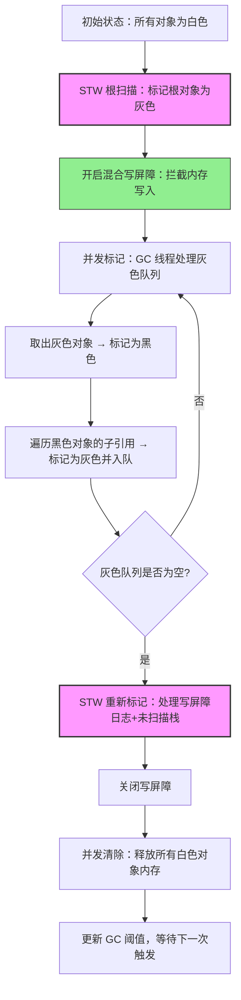
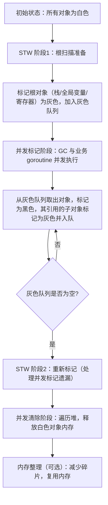
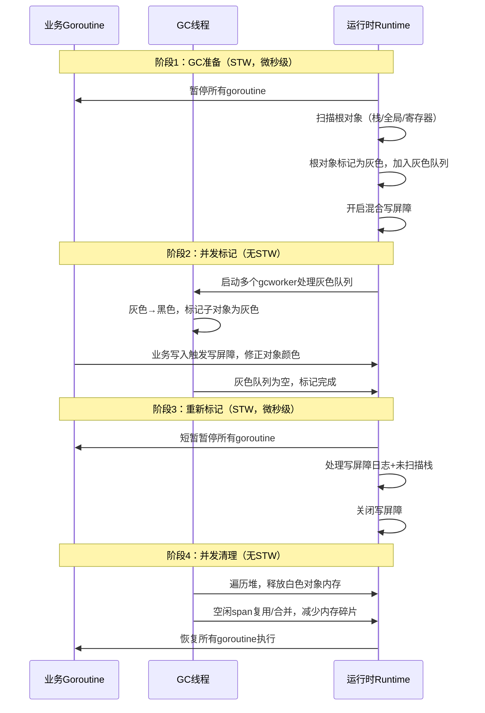
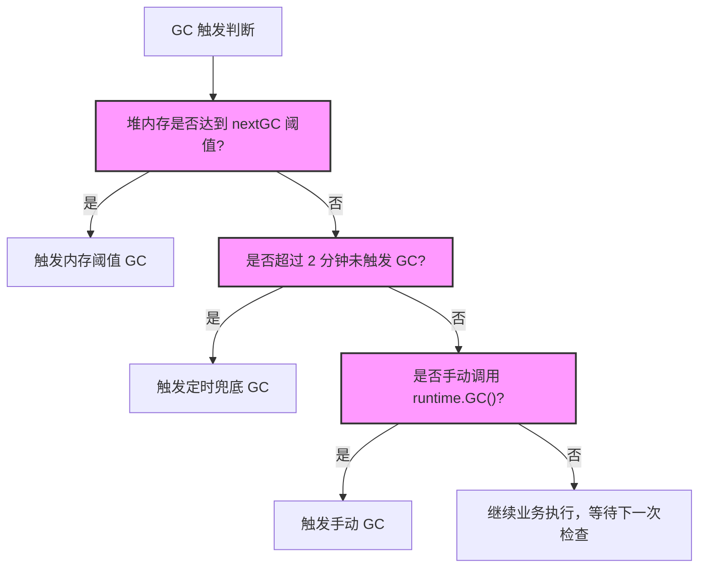
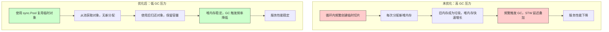
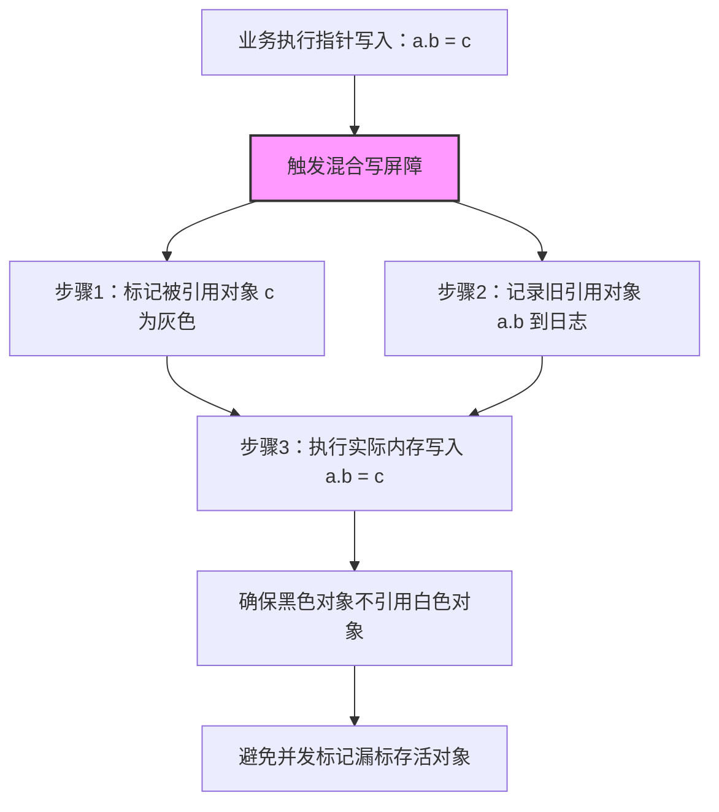
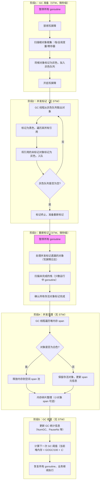

Go 的垃圾回收（Garbage Collection，GC）是其核心特性之一，旨在自动管理内存、避免内存泄漏，让开发者无需手动分配/释放内存（如 C/C++ 的 `malloc`/`free`）。Go GC 经历了多代演进（从 v1.1 的简单标记清除到 v1.5+ 的并发三色标记），目前已实现 `低延迟`、`高并发` 的垃圾回收，适配高吞吐的服务端场景。

## GC 核心目标与设计原则

Go GC 围绕以下核心目标设计：

| 目标 | 说明 |
|------|------|
| 自动内存管理 | 无需开发者手动调用 `free`/`delete`，运行时自动识别并释放无用内存 |
| 低延迟（STW 最小化） | 尽可能减少 `Stop The World`（暂停所有 goroutine）的时间，适配高可用服务 |
| 高并发 | GC 过程与业务 goroutine 并发执行，不阻塞核心业务 |
| 内存效率 | 减少内存碎片，合理利用堆空间 |

## Go GC 核心算法：三色标记法（并发）

Go 1.5 后采用 `并发三色标记-清除算法`（Tri-color Mark and Sweep），是 GC 实现的核心，替代了早期的"停止世界"标记清除。

### 三色标记法核心思想

将堆中的对象分为三种颜色，通过"标记-清除"两步完成垃圾回收：

| 颜色 | 含义 |
|------|------|
| 白色 | 未被标记的对象（初始状态，最终未被标记的白色对象即为垃圾）|
| 灰色 | 已被标记，但引用的子对象（如指针指向的对象）未完全标记 |
| 黑色 | 已被标记，且所有子对象都已标记完成（无引用白色对象，视为"存活"）|



### 核心流程（Go 1.19+ 简化版）



### GC 完整执行阶段时序图



#### 关键阶段详解

**根扫描准备（短 STW）**
暂停所有 goroutine（STW，Stop The World），完成：
- 确定"根对象"（goroutine 栈、全局变量、寄存器中的指针）
- 禁用写屏障（后续开启），确保根对象扫描准确

**并发标记（核心，无 STW）**
GC 线程与业务 goroutine 并发执行：
- 从灰色队列取出对象，标记为黑色
- 遍历该对象的所有引用，将未标记的子对象标记为灰色，加入灰色队列
- 开启 `写屏障（Write Barrier）`：监控业务 goroutine 对对象的修改，避免"漏标"（如黑色对象新增引用白色对象）

**重新标记（短 STW）**
再次短暂 STW，处理并发标记阶段因业务写入导致的"漏标"，确保标记准确性。

**并发清除（无 STW）**
GC 线程遍历堆内存，释放所有未被标记的白色对象（垃圾），将内存归还到空闲链表，供后续分配使用。

### 写屏障：并发标记的关键保障

写屏障是 Go GC 实现"并发标记"的核心机制，本质是 `内存写入的钩子函数`：当业务 goroutine 修改对象引用时，写屏障会拦截并调整对象颜色，避免漏标。

- Go 采用 `Dijkstra 写屏障`（早期）/ `Yuasa 写屏障`（优化版）
- 作用：确保"黑色对象不会引用白色对象"，保证标记准确性

## Go GC 的触发时机

Go GC 并非固定时间执行，而是通过以下方式触发：

### GC 触发机制决策树



### 内存阈值触发（默认）

当堆内存分配量达到 `上一次 GC 后堆内存的 2 倍`（可通过 `GOGC` 环境变量调整，默认 `GOGC=100`），触发 GC。

- 示例：上一次 GC 后堆内存为 1GB，当新分配内存达到 2GB 时，触发 GC
- `GOGC=off`：禁用 GC（仅测试用，生产环境禁止）
- `GOGC=50`：阈值降低为 1.5 倍，更频繁触发 GC，减少单次 GC 压力

### 手动触发

通过 `runtime.GC()` 手动触发 GC，适用于：
- 测试/调试场景
- 业务低峰期主动触发 GC，避免高峰期 STW 影响

### 定时触发（兜底）

若长时间未达到内存阈值（如低内存占用的服务），Go 会在 2 分钟后兜底触发一次 GC，避免内存泄漏。

## Go GC 关键优化（版本演进）

Go 团队持续优化 GC，核心改进集中在"降低 STW 时间"和"提升并发效率"：

| Go 版本 | 核心优化 | STW 时间改进 |
|---------|----------|--------------|
| 1.1 | 基础标记-清除算法，全程 STW | 百毫秒级（大堆内存）|
| 1.5 | 引入并发三色标记法，STW 仅保留根扫描和重新标记 | 毫秒级 |
| 1.8 | 优化写屏障，引入"混合写屏障"，减少重新标记阶段的 STW 时间 | 微秒级（堆内存 1GB 时 &lt;1ms） |
| 1.12+ | 优化内存分配器，减少 GC 触发频率；引入"并发清理"，彻底消除清理阶段的 STW | 几乎无感知 |
| 1.19+ | 优化根扫描，支持栈扫描并发；减少写屏障开销，提升业务 goroutine 执行效率 | 极致低延迟 |

## GC 监控与调优

### 监控 GC 状态

#### runtime 包获取 GC 统计

```go
import (
    "fmt"
    "runtime"
    "runtime/debug"
)

func printGCStats() {
    var stats runtime.MemStats
    runtime.ReadMemStats(&stats)
    fmt.Printf("GC 次数：%d\n", stats.NumGC)
    fmt.Printf("上次 GC 耗时：%d 纳秒\n", stats.PauseTotalNs)
    fmt.Printf("堆内存使用：%d MB\n", stats.HeapInuse/1024/1024)
}
```

#### pprof 分析 GC 性能

通过 `net/http/pprof` 暴露 GC 指标，可视化分析：

```go
import _ "net/http/pprof"

func main() {
    go func() {
        http.ListenAndServe(":6060", nil)
    }()
    // 业务逻辑
}
```

访问 `http://localhost:6060/debug/pprof/`，查看：
- `heap`：堆内存分配/使用情况
- `gc`：GC 次数、耗时、暂停时间
- `trace`：GC 触发时机、STW 时间分布

### GC 调优原则

#### 调整 GOGC（内存阈值）

- 高内存、低延迟场景：`GOGC=200`（减少 GC 触发频率，单次 GC 处理更多内存）
- 低内存、高吞吐场景：`GOGC=50`（频繁触发 GC，单次 GC 耗时更短）

#### 减少内存分配（从根源降低 GC 压力）

- 复用对象：使用 sync.Pool 缓存频繁创建/销毁的对象（如临时切片、结构体）
- 避免频繁小对象分配：预分配切片/映射容量（`make([]T, 0, n)`）
- 减少逃逸：避免局部变量逃逸到堆（通过 `go build -gcflags="-m"` 分析逃逸）

#### 优化大对象分配

- 大对象（>32KB）会直接分配到"大对象区"，GC 处理成本高
- 尽量拆分大对象，或复用大对象（如连接池、缓冲区池）

### GC 性能优化对比



## 常见 GC 误区

### 误区1：认为 GC 完全无开销

GC 虽低延迟，但仍有开销：
- 写屏障会增加内存写入的耗时（约 1-5%）
- 并发标记/清除会占用 CPU 资源，高负载时可能影响业务

### 误区2：频繁调用 runtime.GC() 优化性能

手动触发 GC 会打断 Go 运行时的 GC 调度策略，导致：
- 不必要的 GC 触发，增加 CPU 开销
- 堆内存阈值计算混乱，反而降低效率

### 误区3：sync.Pool 能解决所有内存问题

sync.Pool 是"临时对象池"，对象可能被 GC 回收，适用于：
- 频繁创建/销毁的临时对象（如 HTTP 响应体）
- 不适用于需长期持有对象（如数据库连接）

### 误区4：禁用 GC（GOGC=off）提升性能

禁用 GC 会导致堆内存持续增长，最终触发 OOM（内存溢出），仅适用于：
- 短生命周期的测试程序
- 生产环境绝对禁止

## 核心原理总结

| 核心点 | 关键结论 |
|--------|----------|
| 核心算法 | 并发三色标记-清除法，通过写屏障保证并发标记准确性 |
| STW 阶段 | 仅保留"根扫描准备"和"重新标记"，时间优化至微秒级 |
| 触发时机 | 内存阈值（默认 2 倍）、手动触发、2 分钟兜底 |
| 调优核心 | 减少堆内存分配（复用对象、预分配容量）> 调整 GOGC > 监控 GC 指标 |
| 性能优化方向 | 降低 GC 触发频率、减少单次 GC 处理的内存量、提升并发标记效率 |

---

Go GC 是"自动化内存管理"与"高性能"的平衡，开发者无需深入理解底层实现，但掌握 GC 触发机制和调优原则，能有效避免内存泄漏、降低 GC 开销，提升服务稳定性。**核心原则**：减少不必要的堆内存分配，让 GC 少干活，比调优 GC 参数更有效。

---

# Go GC 底层实现原理（深度拆解）

Go GC 的核心是 `并发三色标记-清除算法`（Tri-color Mark and Sweep），并通过写屏障、栈扫描优化、内存分配器等配套机制，实现"低 STW（Stop The World）、高并发"的自动内存管理。以下从核心算法、关键机制、执行流程、版本演进四个维度，完整拆解其底层实现。

## 核心算法：三色标记-清除法（并发版）

Go GC 本质是"标记-清除"的变种，核心解决"如何在不停止业务的情况下，准确识别存活对象"，三色标记是核心思想，并发执行是性能关键。

### 三色标记的核心定义

堆中所有对象被标记为三种颜色，通过颜色状态流转完成存活对象识别：

| 颜色 | 状态说明 | 内存命运 |
|------|----------|----------|
| 白色 | 初始状态，未被 GC 扫描/标记；并发标记结束后仍为白色 → 判定为"垃圾" | 最终被清除、释放内存 |
| 灰色 | 已被标记，但该对象引用的子对象（如指针指向的对象）未完全扫描/标记 | 待处理，加入灰色队列 |
| 黑色 | 已被标记，且所有子对象都完成标记；黑色对象不会引用白色对象（写屏障保障）| 存活，保留内存 |

### 核心约束（不变式）

并发标记的正确性依赖两个核心约束，由写屏障保障：
- `约束1`：黑色对象不会直接引用白色对象（避免黑色对象"漏标"其引用的白色存活对象）
- `约束2`：灰色对象必须被处理（确保所有存活对象的引用链被完整扫描）

## 关键支撑机制（让并发 GC 成为可能）

### 写屏障（Write Barrier）：并发标记的"安全网"

写屏障是 GC 拦截内存写入的"钩子函数"，是并发标记不出错的核心。Go 1.8 后采用 `混合写屏障（Hybrid Write Barrier）`，融合 Dijkstra 和 Yuasa 写屏障的优点，大幅降低 STW 时间。

#### 混合写屏障的核心逻辑



当业务 goroutine 修改堆对象的指针引用时（如 `a.b = c`），写屏障会执行：

```go
// 伪代码：混合写屏障逻辑
func writeBarrier(dst *object, src *object) {
    // 1. 将被指向的对象（src）标记为灰色（确保存活）
    shade(src)
    // 2. 将原引用的对象（dst 的旧值）加入扫描队列（避免漏标）
    queue(dst.old_value)
    // 3. 执行实际的内存写入（a.b = c）
    *dst = src
}
```

**工作原理**：当程序执行 `a.b = c` 时，写屏障会：
1. 确保新对象 `c` 被标记为灰色（不会被误删）
2. 将旧对象 `a.b` 加入扫描队列（确保引用关系正确）
3. 执行实际的指针写入操作

- `作用`：确保修改后的引用链不破坏"黑色不引用白色"的约束，避免并发标记时漏标存活对象
- `开销`：对所有堆指针写入增加约 1-5% 的性能损耗，但换来了近乎无感知的 STW

### 栈扫描优化：减少 STW 时间

goroutine 栈上的指针是 GC 的"根对象"之一，栈扫描的效率直接影响 STW 时长：

**早期（Go 1.5 前）**：全程 STW 扫描所有 goroutine 栈，栈越大、goroutine 越多，STW 越长

**Go 1.19+ 优化**：
1. `栈上指针掩码（Stack Pointer Masking）`：编译器为栈帧生成指针掩码，GC 仅扫描掩码标记的指针位置，无需遍历整个栈
2. `并发栈扫描`：大部分 goroutine 的栈扫描可在并发阶段完成，仅少数阻塞/运行中的 goroutine 需 STW 扫描
3. `栈收缩`：函数退出后栈帧自动释放，GC 无需处理已释放的栈内存

### 内存分配器（TCMalloc 变种）：与 GC 协同

Go 内存分配器基于 TCMalloc 实现，将内存划分为不同等级的"span"（内存块），与 GC 深度协同：

**span 分类**：
- 小对象 span（&lt;32KB）：按大小分级（8B、16B、32B…），减少内存碎片
- 大对象 span（≥32KB）：单独分配，不参与小对象池，GC 扫描/回收成本更高

**GC 与分配器的协同**：
1. 分配内存时，优先从"已清理的 span"中分配，减少 GC 压力
2. 当 span 内存使用率低于阈值，触发"懒清理"（并发阶段异步清理），而非立即释放
3. 大对象 span 不会被内存压缩（compact），易产生碎片，需开发者手动复用

## GC 完整执行流程（Go 1.21+ 最新版）

Go GC 执行分为 5 个阶段，其中仅 2 个短阶段 STW，其余阶段与业务 goroutine 并发执行：



### 各阶段底层细节

#### 根对象扫描（阶段1核心）

根对象是 GC 扫描的"起点"，底层由 `runtime.gcroot` 函数实现：
- 栈根：遍历所有 goroutine 的栈帧，通过指针掩码快速定位指针
- 全局根：遍历 `runtime.data` 段的全局变量，筛选指针类型
- 寄存器根：通过 `runtime.registers` 读取 CPU 寄存器中的指针

#### 并发标记（阶段2核心）

由 `runtime.markroot` 和 `runtime.scanobject` 函数驱动：
- 灰色队列由 `runtime.workbuf` 实现，采用分段缓存，减少锁竞争
- 多个 GC 工作线程（`gcworker`）并发消费灰色队列，利用多核优势
- 写屏障拦截的内存修改会记录到 `runtime.wbBuf`，供重新标记阶段处理

#### 重新标记（阶段3核心）

耗时极短（微秒级），核心处理两类遗漏：
- 写屏障日志：并发标记阶段业务写入的指针变更
- 未扫描栈：并发阶段处于运行状态、无法扫描的 goroutine 栈

#### 并发清理（阶段4核心）

- 清理粒度是 `span`（而非单个对象），提升效率
- 小对象 span 清理后会被合并，减少碎片
- 大对象 span 直接释放，不合并（因大对象移动成本高）

## GC 触发机制的底层实现

Go GC 触发并非"定时执行"，而是由 `runtime.gcTrigger` 结构体判断，核心触发条件的底层逻辑：

### 内存阈值触发（默认）

- 底层判断逻辑：`heapInuse >= nextGC`（`nextGC` = 上一次 GC 后堆内存 × (GOGC/100 + 1)）
- `nextGC` 存储在 `runtime.memstats.next_gc`，每次 GC 后更新
- GOGC 默认为 100，即堆内存翻倍触发 GC；GOGC=50 则 1.5 倍触发

### 定时兜底触发

- 由 `runtime.timer` 实现，每 2 分钟触发一次 `runtime.gcStart`
- 底层通过 `runtime.checkTimers` 检查超时，即使内存未达阈值也会触发
- 可通过 `debug.SetGCPercent(-1)` 禁用兜底触发（仅测试用）

### 手动触发（runtime.GC()）

- 底层调用 `runtime.gcStart(runtime.GCForceBlock)`，强制触发 GC
- 手动触发会跳过阈值判断，直接进入 GC 准备阶段
- 触发后会重置 `nextGC` 为当前堆内存 × 2，可能导致后续 GC 频繁触发

## 版本演进中的核心优化（底层实现变更）

Go GC 历经多代优化，核心是"降低 STW 时间"和"提升并发效率"，关键底层变更：

| Go 版本 | 核心底层优化 | 实现细节 |
|---------|--------------|----------|
| 1.5 | 引入并发三色标记法 | 新增 `runtime.gcMarkWorker` 并发标记线程，实现标记阶段无 STW |
| 1.8 | 混合写屏障（Hybrid Write Barrier） | 替换原 Dijkstra 写屏障，减少重新标记阶段的 STW 时间（从毫秒→微秒） |
| 1.12 | 并发清理（Concurrent Sweep） | 清理阶段从 STW 改为并发，新增 `runtime.sweepWorker` 清理线程 |
| 1.19 | 栈扫描并发化 + 指针掩码 | 栈扫描从 STW 改为部分并发，通过 `runtime.stackmap` 生成指针掩码，加速扫描 |
| 1.21 | 大对象回收优化 + 空闲 span 复用 | 大对象 span 清理后加入专用池，减少重复分配开销；小对象 span 自动合并 |

## 核心原理总结

| 核心维度 | 底层实现关键 |
|----------|--------------|
| 核心算法 | 并发三色标记-清除法，混合写屏障保障并发正确性 |
| STW 优化 | 仅保留"根扫描准备"和"重新标记"两个短 STW 阶段，其余阶段并发执行 |
| 内存管理协同 | 基于 TCMalloc 的 span 分配器，与 GC 协同实现内存复用、减少碎片 |
| 触发机制 | 内存阈值（nextGC）、2 分钟兜底定时器、手动触发（runtime.GC()） |
| 性能关键 | 多核并发标记（gcworker）、栈指针掩码、写屏障日志、懒清理 |

---

Go GC 的实现本质是"在正确性和性能之间找平衡"：写屏障增加了内存写入开销，但换来了近乎无感知的 STW；并发标记利用多核优势，但需复杂的同步机制保障正确性。理解这些底层细节，才能针对性优化 GC 性能（如减少堆分配、复用大对象、调整 GOGC），而非盲目依赖 GC 自动优化。

---

# Go GC 最佳实践与典型错误用法（避坑指南）

Go GC 是自动内存管理的核心，但"自动"不代表"无需关注"——错误的编码习惯会导致 GC 频繁触发、内存泄漏、STW 延迟飙升，而掌握最佳实践能从根源降低 GC 开销。以下是经过生产环境验证的最佳实践，以及最易踩坑的错误用法，附原理和修复方案。

## GC 最佳实践（从根源降低 GC 压力）

### 1. 减少堆内存分配（核心原则）

GC 的核心开销来自"扫描/标记堆对象"，减少堆分配是最有效的优化手段。

#### 预分配容器容量（切片/Map）

- `原理`：避免容器扩容时的频繁内存分配和拷贝，减少堆对象数量。
- `实践`：创建切片/Map 时指定足够的 `cap`（容量），而非默认扩容。

```go
// 反例：无预分配，切片会多次扩容（每次扩容都分配新堆内存）
func badAlloc() {
    var data []int
    for i := 0; i < 10000; i++ {
        data = append(data, i) // 扩容时分配新内存，旧内存成为垃圾
    }
}

// 正例：预分配容量，无扩容开销
func goodAlloc() {
    data := make([]int, 0, 10000) // 预分配容量 10000
    for i := 0; i < 10000; i++ {
        data = append(data, i) // 无扩容，仅栈操作
    }
}
```

#### 复用临时对象（sync.Pool）

- `原理`：`sync.Pool` 是 Go 提供的"临时对象池"，缓存频繁创建/销毁的对象，避免重复分配/回收。
- `适用场景`：高频创建的临时对象（如 HTTP 响应体、序列化缓冲区、大切片）。

```go
// 正例：用 sync.Pool 复用大切片
var bufPool = sync.Pool{
    New: func() interface{} {
        // 初始化：创建 4KB 缓冲区
        return make([]byte, 4096)
    },
}

func processData(data []byte) {
    // 从池获取对象（复用旧对象，无新分配）
    buf := bufPool.Get().([]byte)
    defer bufPool.Put(buf[:0]) // 归还时清空，保留容量

    // 业务逻辑：使用 buf
    copy(buf, data)
}
```

- `注意`：`sync.Pool` 中的对象可能被 GC 回收，不可存储需长期持有的数据（如数据库连接）。

#### 避免局部变量逃逸到堆

- `原理`：栈变量由编译器自动释放（无需 GC），而逃逸到堆的变量会增加 GC 扫描压力。
- `实践`：通过 `go build -gcflags="-m"` 分析逃逸，优化代码减少逃逸。

```go
// 反例：大数组逃逸到堆（栈空间不足，编译器强制逃逸）
func badEscape() []byte {
    var buf [1024 * 1024]byte // 1MB 数组，超出栈阈值（默认 2KB）
    return buf[:] // 返回切片，触发逃逸到堆
}

// 正例：栈上复用小对象，或通过池复用大对象
func goodEscape() []byte {
    buf := bufPool.Get().([]byte) // 从池获取，堆对象但可复用
    defer bufPool.Put(buf)
    return buf[:1024]
}
```

### 2. 优化大对象处理（≥32KB）

- `原理`：大对象直接分配到"大对象区"，GC 扫描/回收成本高，且不会被内存压缩（易产生碎片）。
- `实践`：
  1. 拆分大对象：将单一超大结构体拆分为多个小结构体，降低单次分配的内存量；
  2. 复用大对象：通过 `sync.Pool` 缓存大对象（如 64KB 缓冲区），避免频繁创建/销毁；
  3. 避免零散大对象：批量处理大对象，减少堆内存碎片。

```go
// 反例：频繁创建大对象（每次分配 64KB，GC 频繁回收）
func badBigObj() {
    for i := 0; i < 1000; i++ {
        buf := make([]byte, 65536) // 64KB 大对象，每次分配新内存
        // 短暂使用后，buf 成为垃圾，GC 需回收
    }
}

// 正例：复用大对象池
var bigBufPool = sync.Pool{
    New: func() interface{} {
        return make([]byte, 65536)
    },
}

func goodBigObj() {
    for i := 0; i < 1000; i++ {
        buf := bigBufPool.Get().([]byte)
        defer bigBufPool.Put(buf[:0])
        // 使用 buf，无新分配
    }
}
```

### 3. 合理调整 GC 阈值（GOGC）

- `原理`：`GOGC` 控制 GC 触发阈值（默认 100，即堆内存翻倍触发 GC），调整需结合业务场景。
- `实践`：

| 场景 | GOGC 调整建议 | 原理 |
|------|--------------|------|
| 高内存、低延迟 | GOGC=200 | 降低 GC 触发频率，单次 GC 处理更多内存，减少 STW 次数 |
| 低内存、高吞吐 | GOGC=50 | 频繁触发 GC，单次 GC 耗时更短，避免堆内存暴涨 |
| 短生命周期程序（CLI）| GOGC=off | 禁用 GC（仅测试/短程序），避免 GC 占用时间 |

- `设置方式`：

```go
// 代码中设置
import "runtime/debug"
func init() {
    debug.SetGCPercent(200) // 等价于 GOGC=200
}
// 或启动时设置环境变量
// GOGC=200 ./your-app
```

### 4. 监控 GC 状态，定位瓶颈

- `核心指标`：通过 `runtime.MemStats` 或 `pprof` 监控以下指标：
  1. `NumGC`：GC 触发次数（频繁触发说明堆分配过多）；
  2. `PauseTotalNs`：GC 暂停总时间（STW 累计耗时）；
  3. `HeapInuse`：堆内存使用量（持续增长说明内存泄漏）；
- `实践`：集成监控工具（如 Prometheus + Grafana），设置 GC 指标告警。

```go
// 打印 GC 核心统计
func printGCStats() {
    var stats runtime.MemStats
    runtime.ReadMemStats(&stats)
    fmt.Printf("GC 次数：%d\n", stats.NumGC)
    fmt.Printf("单次最大暂停：%d 微秒\n", stats.PauseNs[0]/1000)
    fmt.Printf("堆内存使用：%d MB\n", stats.HeapInuse/1024/1024)
}
```

### 5. 避免 CGO 内存泄漏

- `原理`：CGO 分配的内存（如 `C.malloc`）脱离 Go GC 管控，必须手动释放。
- `实践`：使用 `defer` 确保 CGO 内存释放，或封装为 Go 对象管理。

```go
/*
#include <stdlib.h>
*/
import "C"
import "unsafe"

// 正例：CGO 内存手动释放
func safeCGO() {
    // 分配 C 内存
    cBuf := C.malloc(1024)
    // 确保函数退出时释放
    defer C.free(unsafe.Pointer(cBuf))
    
    // 业务逻辑：使用 cBuf
}
```

## GC 典型错误用法（附原因+修复）

### 错误1：滥用 runtime.GC() 手动触发 GC

- `错误代码`：

```go
func badManualGC() {
    // 业务逻辑：创建大量临时对象
    for i := 0; i < 10000; i++ {
        _ = make([]byte, 1024)
    }
    runtime.GC() // 手动触发 GC，认为"主动清理更高效"
}
```

- `错误原因`：
  1. 手动触发会打断 Go 运行时的 GC 调度策略，重置 `nextGC` 阈值（导致后续 GC 频繁触发）；
  2. 高频手动 GC 会增加 CPU 开销（标记/清除需要 CPU 资源）。
- `修复方案`：
  - 仅在测试/调试场景使用 `runtime.GC()`；
  - 生产环境依赖 Go 自动调度，通过"减少堆分配"降低 GC 压力。

### 错误2：忽略临时对象的堆分配（循环内频繁创建）

- `错误代码`：

```go
func badLoopAlloc() {
    for {
        // 循环内频繁创建临时切片，每次都分配堆内存
        buf := make([]byte, 1024)
        _ = buf
        time.Sleep(10 * time.Millisecond)
    }
}
```

- `错误原因`：循环内频繁创建临时对象，堆内存快速增长，触发 GC 高频执行（甚至每秒数次），STW 延迟叠加。
- `修复方案`：复用临时对象（`sync.Pool`）或移到循环外创建。

```go
var smallBufPool = sync.Pool{
    New: func() interface{} {
        return make([]byte, 1024)
    },
}

func goodLoopAlloc() {
    for {
        buf := smallBufPool.Get().([]byte)
        defer smallBufPool.Put(buf[:0])
        _ = buf
        time.Sleep(10 * time.Millisecond)
    }
}
```

### 错误3：误用 SetFinalizer 依赖对象回收时机

- `错误代码`：

```go
func badFinalizer() {
    type Resource struct {
        fd *os.File
    }
    r := &Resource{fd: file}
    // 依赖终结器关闭文件，认为"GC 会自动调用"
    runtime.SetFinalizer(r, func(obj *Resource) {
        obj.fd.Close() // 执行时机不可控，可能文件句柄泄漏
    })
    r = nil // 释放强引用，依赖 GC 回收
}
```

- `错误原因`：
  1. `SetFinalizer` 是"弱引用"，对象回收时机由 GC 决定（可能延迟数分钟）；
  2. 若程序退出前 GC 未触发，终结器不会执行，导致资源泄漏（如文件句柄、网络连接）。
- `修复方案`：
  - 显式释放资源（`defer fd.Close()`），而非依赖终结器；
  - 终结器仅作为"兜底"，不可作为核心资源释放逻辑。

### 错误4：大切片/Map 引用未释放（隐性内存泄漏）


- `错误代码`：

```go
func badRefLeak() {
    // 全局大切片，持有大量内存引用
    var globalData []int = make([]int, 1024*1024*100) // 400MB 内存
    
    // 业务逻辑：仅需使用前 100 个元素
    data := globalData[:100]
    // 函数退出后，data 仍引用 globalData，导致 400MB 内存无法回收
    return
}
```

- `错误原因`：切片的"浅拷贝"特性导致子切片持有原切片的底层数组引用，GC 认为原数组仍存活，无法回收。
- `修复方案`：
  - 复制子切片数据，切断对原数组的引用；
  - 不再使用时，将大对象置为 `nil`，释放引用。

```go
func goodRefLeak() {
    globalData := make([]int, 1024*1024*100)
    // 复制数据，切断原数组引用
    data := make([]int, 100)
    copy(data, globalData[:100])
    globalData = nil // 释放原数组引用，GC 可回收
    return
}
```

### 错误5：禁用 GC（GOGC=off）追求极致性能

- `错误代码`：

```go
func badDisableGC() {
    debug.SetGCPercent(-1) // 禁用 GC
    // 业务逻辑：持续创建堆对象
    for {
        _ = make([]byte, 1024*1024) // 每次分配 1MB 堆内存
    }
}
```

- `错误原因`：禁用 GC 后堆内存持续增长，最终触发系统 OOM（内存溢出），程序崩溃。
- `修复方案`：
  - 生产环境禁止禁用 GC；
  - 若需降低 GC 频率，调整 `GOGC` 为更高值（如 200/300），而非禁用。

### 错误6：忽略 goroutine 泄漏（间接导致 GC 压力）

- `错误代码`：

```go
func badGoroutineLeak() {
    for i := 0; i < 1000; i++ {
        // 无退出条件的 goroutine，持续运行并持有内存
        go func() {
            ch := make(chan int)
            <-ch // 永久阻塞，goroutine 无法退出
        }()
    }
}
```

- `错误原因`：泄漏的 goroutine 会持有栈/堆内存引用，GC 无法回收，导致堆内存持续增长，GC 频繁触发。
- `修复方案`：
  - 给 goroutine 增加退出条件（如 `context.WithCancel`）；
  - 监控 goroutine 数量（`runtime.NumGoroutine()`），避免泄漏。

```go
func goodGoroutineLeak(ctx context.Context) {
    for i := 0; i < 1000; i++ {
        go func(ctx context.Context) {
            select {
            case <-ctx.Done():
                return // 收到退出信号，goroutine 退出
            case <-make(chan int):
            }
        }(ctx)
    }
}
```

## 核心总结

| 维度 | 最佳实践核心 | 错误用法规避 |
|------|--------------|--------------|
| 内存分配 | 1. 预分配容器容量<br />2. 复用临时对象（sync.Pool）<br />3. 减少大对象分配 | 1. 循环内频繁创建临时对象<br />2. 大切片/Map 引用未释放<br />3. 局部变量不必要逃逸 |
| GC 配置 | 1. 按场景调整 GOGC<br />2. 依赖自动调度，少用手动 GC<br />3. 监控 GC 核心指标 | 1. 滥用 runtime.GC()<br />2. 禁用 GC（GOGC=off）<br />3. 忽略 GC 触发频率告警 |
| 资源管理 | 1. 显式释放资源（defer）<br />2. CGO 内存手动释放<br />3. 终结器仅作为兜底 | 1. 依赖 SetFinalizer 释放核心资源<br />2. CGO 内存忘记释放<br />3. 资源句柄泄漏 |
| 并发管理 | 1. 监控 goroutine 数量<br />2. 给 goroutine 加退出条件 | 1. goroutine 永久阻塞导致泄漏<br />2. 大量 goroutine 持有内存引用 |

---

Go GC 优化的核心逻辑是：**让 GC 少干活**——减少堆内存分配、复用对象、释放无用引用，比调优 GC 参数更有效。开发者无需深入理解 GC 底层算法，但需规避上述错误用法，通过监控和编码规范，让 GC 保持"低开销、低延迟"的状态。