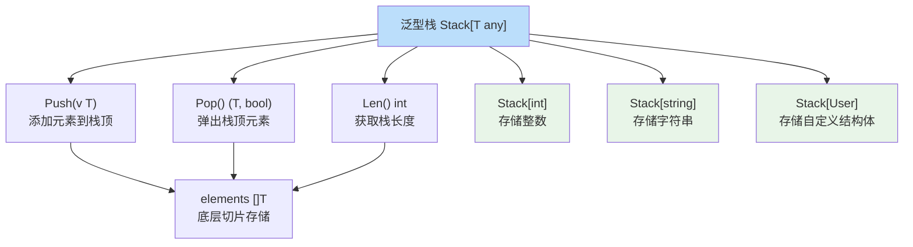
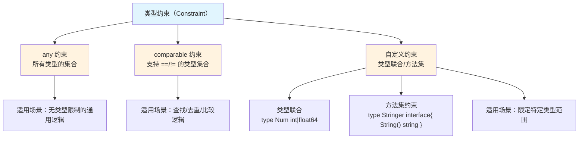
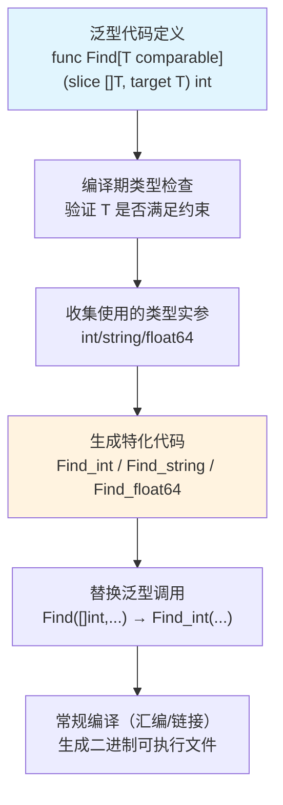
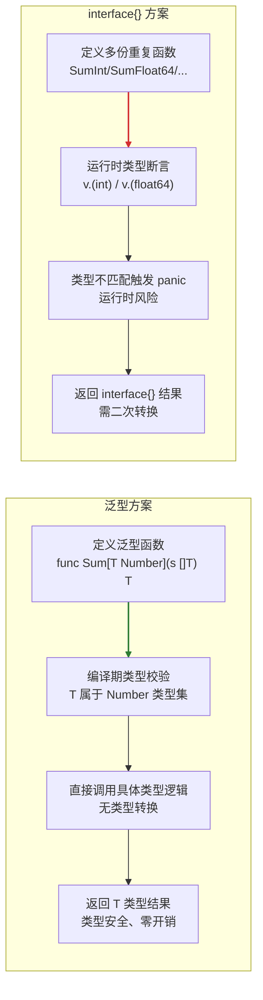
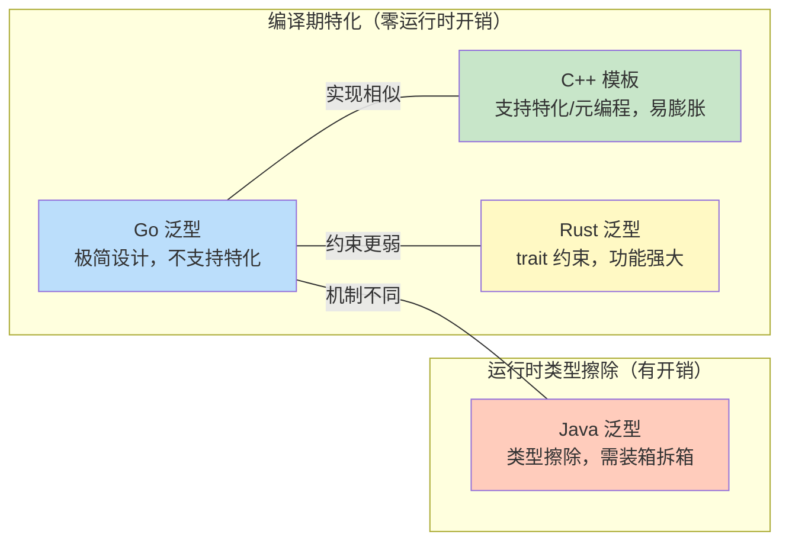
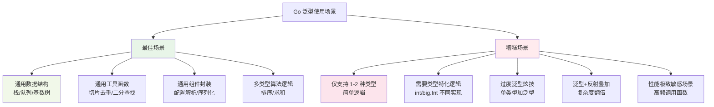

Go 语言的泛型（Generics）在 **Go 1.18** 版本正式发布，核心解决了「代码复用」和「类型安全」的双重问题——此前 Go 只能通过 `interface{}` 实现通用逻辑，但会丢失类型检查；泛型则允许编写**与类型无关的通用代码**，同时保留编译期类型校验。

## 核心概念

泛型的核心是「类型参数（Type Parameters）」：函数/结构体/接口可以定义「类型形参」，使用时传入「类型实参」，就像普通函数的「值参数」一样。

### 类型参数语法
- 用 `[T Constraint]` 定义类型参数（`T` 是类型形参，`Constraint` 是类型约束，限定 `T` 能接收的类型）；
- 约束可以是：基础类型、接口、`any`（等价于 `interface{}`）、自定义约束。

## 基础使用场景

### 泛型函数（最常用）
场景：实现一个通用的「切片查找」函数，支持 `int`/`string`/`float64` 等类型，无需重复写多份代码。

```go
// 定义泛型函数：T 是类型参数，约束为 comparable（可比较类型）
func Find[T comparable](slice []T, target T) int {
    for i, v := range slice {
        if v == target { // comparable 保证 T 支持 == 操作
            return i
        }
    }
    return -1
}

// 使用：传入具体类型实参（可省略，编译器自动推导）
func main() {
    // 查找 int 切片
    nums := []int{1, 2, 3}
    fmt.Println(Find[int](nums, 2)) // 输出 1
    
    // 查找 string 切片（自动推导类型，省略 [string]）
    strs := []string{"a", "b", "c"}
    fmt.Println(Find(strs, "c")) // 输出 2
}
```

### 泛型结构体
场景：实现通用的「栈」结构，支持任意类型的元素存储。



```go
// 泛型结构体：T 是类型参数，约束为 any（任意类型）
type Stack[T any] struct {
    elements []T
}

// 泛型方法：结构体的方法可以复用类型参数 T
func (s *Stack[T]) Push(v T) {
    s.elements = append(s.elements, v)
}

func (s *Stack[T]) Pop() (T, bool) {
    if len(s.elements) == 0 {
        var zero T // 泛型的零值
        return zero, false
    }
    last := s.elements[len(s.elements)-1]
    s.elements = s.elements[:len(s.elements)-1]
    return last, true
}

// 使用
func main() {
    // 整型栈
    intStack := &Stack[int]{}
    intStack.Push(10)
    intStack.Push(20)
    fmt.Println(intStack.Pop()) // 20, true
    
    // 字符串栈
    strStack := &Stack[string]{}
    strStack.Push("hello")
    fmt.Println(strStack.Pop()) // hello, true
}
```

### 自定义类型约束
场景：限定类型参数只能是「数值类型」（int/int64/float64 等），避免传入非数值类型。

```go
// 自定义约束：接口形式，限定 T 必须实现 int | int64 | float64
type Number interface {
    int | int64 | float64
}

// 泛型函数：计算切片元素之和
func Sum[T Number](slice []T) T {
    var total T
    for _, v := range slice {
        total += v
    }
    return total
}

// 使用
func main() {
    fmt.Println(Sum([]int{1, 2, 3}))        // 6
    fmt.Println(Sum([]float64{1.5, 2.5}))   // 4.0
    // fmt.Println(Sum([]string{"a", "b"})) // 编译报错：string 不满足 Number 约束
}
```

## 关键约束（Constraint）

Go 提供了核心约束类型，决定类型参数的范围：



| 约束        | 含义                                  | 适用场景                  |
|-------------|---------------------------------------|---------------------------|
| `any`       | 等价于 `interface{}`，任意类型        | 无类型限制的通用逻辑      |
| `comparable`| 支持 `==`/`!=` 比较的类型             | 查找、去重、比较逻辑      |
| 自定义接口  | 限定类型必须实现接口方法/指定类型集合 | 限定特定类型范围（如数值）|

## 泛型的优势与注意事项

### 优势
1. **减少重复代码**：无需为不同类型写逻辑相同的函数/结构体；
2. **编译期类型安全**：避免 `interface{}` 强制类型转换的运行时 panic；
3. **性能无损耗**：编译器会为每个具体类型生成专属代码，性能与手写类型代码一致。

### 注意事项
1. **避免过度泛型**：简单逻辑（如仅支持 1-2 种类型）无需泛型，否则增加复杂度；
2. **约束越严格越好**：尽量缩小类型参数范围，提升代码可读性和安全性；
3. **兼容问题**：泛型仅支持 Go 1.18+，旧版本无法编译。

## 典型应用场景
- 通用数据结构：栈、队列、链表、映射（如你之前提到的基数树）；
- 工具函数：切片查找、排序、去重、求和；
- 组件封装：通用缓存、通用序列化/反序列化逻辑。

---

## 泛型实现原理

Go 泛型的实现核心是**编译器在编译期完成「泛型代码特化（Specialization）」** —— 即把泛型代码（如 `func Find[T comparable](...)`）转换为具体类型的非泛型代码（如 `func Find_int(...)`、`func Find_string(...)`），最终生成的二进制中**不存在泛型代码**，只有针对具体类型的专属实现。

这种设计既保证了泛型的灵活性，又延续了 Go 「编译期做足优化、运行时零开销」的核心理念，下面从**核心机制、编译流程、关键细节**三方面拆解：

### 核心实现机制：特化（Specialization）

Go 泛型不采用「运行时类型擦除」（如 Java），而是「编译期特化」—— 编译器为每一个被实际使用的「类型实参」生成独立的函数/结构体实现，本质是「自动帮你手写不同类型的重复代码」。

#### 举个例子：泛型函数的特化过程
```go
// 泛型函数定义
func Find[T comparable](slice []T, target T) int {
    for i, v := range slice {
        if v == target {
            return i
        }
    }
    return -1
}

// 主函数中使用两种类型
func main() {
    Find([]int{1,2,3}, 2)    // 类型实参：int
    Find([]string{"a","b"}, "b") // 类型实参：string
}
```

编译器会做两件事：
1. 为 `int` 类型生成特化函数 `Find_int`：
   ```go
   func Find_int(slice []int, target int) int {
       for i, v := range slice {
           if v == target {
               return i
           }
       }
       return -1
   }
   ```
2. 为 `string` 类型生成特化函数 `Find_string`：
   ```go
   func Find_string(slice []string, target string) int {
       for i, v := range slice {
           if v == target {
               return i
           }
       }
       return -1
   }
   ```
3. 把 `main` 中的 `Find` 调用替换为对 `Find_int`/`Find_string` 的直接调用。

最终二进制中只有 `Find_int` 和 `Find_string`，没有泛型版本的 `Find`。

### Go 泛型的编译流程

Go 编译器处理泛型代码分为 4 个关键阶段（基于 Go 1.18+ 的 `gc` 编译器）：



#### 1. 解析泛型代码
编译器扩展了语法解析器，支持 `[T Constraint]` 类型参数语法，将泛型函数/结构体解析为「带类型参数的抽象语法树（AST）」。

#### 2. 类型检查（核心：约束验证）
- 验证类型实参是否满足约束（如 `int` 是否满足 `comparable`）；
- 检查泛型代码中的操作是否合法（如 `comparable` 约束保证 `==` 操作合法）；
- 这一步是泛型「类型安全」的核心，避免运行时类型错误。

#### 3. 特化（Specialization）
这是泛型实现的核心步骤，分为两种特化策略：

| 特化策略       | 适用场景                | 特点                     |
|----------------|-------------------------|--------------------------|
| 即时特化       | 函数/结构体被直接调用   | 编译期为使用的类型生成代码 |
| 延迟特化（懒特化） | 泛型代码被导出供其他包使用 | 仅当其他包实际使用时才特化 |

**关键优化**：相同类型实参的泛型调用会复用同一个特化版本（比如多次调用 `Find([]int,...)` 只会生成一份 `Find_int`）。

#### 4. 常规编译
特化后的代码与普通 Go 代码无区别，编译器继续执行：
- 生成汇编代码 → 生成目标文件 → 链接为二进制。

### 关键细节：约束（Constraint）的实现

Go 泛型的「类型约束」是实现的另一核心，底层依赖「类型集（Type Set）」：

1. **约束本质是「类型集」**：
   - `comparable` 约束对应「所有支持 ==/!= 的类型集合」（int、string、指针、数组等）；
   - `any` 约束对应「所有类型的集合」；
   - 自定义约束（如 `type Number interface{ int | int64 | float64 }`）对应「指定类型的集合」。

2. **编译器验证逻辑**：
   类型实参必须「属于」约束对应的类型集，否则编译报错（如 `string` 不属于 `Number` 类型集）。

## 泛型对比分析

### Go 泛型 vs Go 传统方案（interface\{\} + 反射）

这是最核心的对比（解决「为什么需要泛型」的问题）：



| 维度                | Go 泛型（1.18+）| Go interface\{\}（无泛型） | Go interface\{\} + 反射       |
|---------------------|---------------------------------------|--------------------------|-----------------------------|
| **实现机制**        | 编译期特化（生成具体类型代码）| 运行时动态类型断言       | 运行时反射解析类型          |
| **类型安全**        | 编译期校验，无运行时类型错误          | 运行时 panic（断言失败） | 运行时 panic（类型不匹配）  |
| **运行时性能**      | 零开销（与手写类型代码一致）| 轻微开销（装箱/拆箱）| 严重开销（反射是慢操作）|
| **代码复用性**      | 高（一套逻辑适配多类型）| 低（需为每种类型写重复代码） | 中（但逻辑晦涩）|
| **代码可读性**      | 高（类型意图明确）| 中（需阅读上下文猜类型） | 低（反射逻辑难以理解）|
| **学习/维护成本**   | 中（需学泛型语法）| 低（语法简单）| 高（反射 API 复杂）|
| **典型场景**        | 通用数据结构、工具函数                | 简单多态（如 io.Reader） | 极少场景（如序列化框架）|

#### 示例对比（切片求和）：
```go
// 1. 泛型版（推荐）
type Number interface{ int | float64 }
func Sum[T Number](s []T) T {
    var total T
    for _, v := range s { total += v }
    return total
}

// 2. interface{} 版（冗余）
func SumInt(s []int) int { /* 重复逻辑 */ }
func SumFloat64(s []float64) float64 { /* 重复逻辑 */ }

// 3. interface{} + 反射版（危险且低效）
func SumAny(s []interface{}) interface{} {
    total := 0.0
    for _, v := range s {
        switch val := v.(type) { // 手动断言，易漏类型
        case int: total += float64(val)
        case float64: total += val
        default: panic("unsupported type")
        }
    }
    return total
}
```

### Go 泛型 vs 主流语言泛型（Java/C++/Rust）

这是理解「Go 泛型设计取舍」的关键（Go 泛型是「极简版」，而非「全功能版」）：



| 维度                | Go 1.18+ 泛型                | Java 泛型                  | C++ 模板                   | Rust 泛型                  |
|---------------------|------------------------------|----------------------------|----------------------------|----------------------------|
| **核心实现**        | 编译期特化（静态）| 运行时类型擦除（动态）| 编译期模板实例化（静态）| 编译期单态化（静态）|
| **运行时开销**      | 零开销                       | 有（装箱/拆箱）| 零开销                     | 零开销                     |
| **类型安全**        | 编译期校验                   | 编译期校验（但擦除后有漏洞） | 编译期校验（但模板膨胀）| 编译期极致校验             |
| **特化能力**        | 无（不支持全/偏特化）| 无（类型擦除无法特化）| 支持全/偏特化              | 支持全/偏特化              |
| **约束灵活性**      | 中（类型集 + 简单方法集）| 高（接口约束 + 通配符）| 极高（无显式约束，鸭子类型） | 极高（trait 约束 + 关联类型） |
| **语法复杂度**      | 低（极简设计）| 中（通配符 &lt;? extends>）| 高（模板元编程）| 中高（trait 关联类型）|
| **二进制体积**      | 轻微膨胀（复用特化版本）| 小（类型擦除）| 易膨胀（模板多次实例化）| 可控（单态化优化）|
| **反射支持**        | 有限（仅支持特化后类型）| 完善（反射可解析泛型）| 无（模板仅编译期存在）| 完善（const generics）|

#### 关键差异解读：
1. `Go vs Java`：
   - Java 泛型是「伪泛型」（类型擦除），运行时丢失类型信息，需装箱/拆箱；
   - Go 泛型是「真泛型」（编译期特化），无运行时开销，但功能比 Java 少（如无通配符）。

2. `Go vs C++`：
   - C++ 模板是「超集泛型」，支持特化、元编程，但语法复杂、易导致二进制膨胀；
   - Go 泛型是「子集泛型」，砍掉特化/元编程，只保留核心复用能力，兼顾简洁性。

3. `Go vs Rust`：
   - Rust 泛型（基于 trait）功能强大，支持特化、关联类型、常量泛型；
   - Go 泛型仅满足「基础复用需求」，避免引入 Rust 复杂的 trait 体系，符合 Go 「极简哲学」。

### Go 泛型使用场景指南



### 最佳使用场景（泛型的「高光时刻」）
这些场景中，泛型能**大幅减少重复代码**、**保证类型安全**，且逻辑本身就是「与类型无关的通用规则」，是泛型设计的核心目标：

#### 1. 通用数据结构（最经典、最推荐）
场景：实现栈、队列、链表、哈希表、基数树、缓存等「容器类」结构，这类结构的核心逻辑（增删改查）与存储的元素类型无关。

✅ 示例：泛型栈（适配任意类型，无需为 int/string/自定义结构体写多份栈代码）
```go
type Stack[T any] struct {
    elements []T
}

func (s *Stack[T]) Push(v T) { s.elements = append(s.elements, v) }
func (s *Stack[T]) Pop() (T, bool) {
    if len(s.elements) == 0 {
        var zero T
        return zero, false
    }
    last := s.elements[len(s.elements)-1]
    s.elements = s.elements[:len(s.elements)-1]
    return last, true
}

// 使用：一套代码适配所有类型
func main() {
    intStack := &Stack[int]{}
    strStack := &Stack[string]{}
    type User struct{ ID int; Name string }
    userStack := &Stack[User]{}
}
```

👉 优势：避免写 `IntStack`/`StringStack`/`UserStack` 等重复结构体，逻辑统一且类型安全。

#### 2. 通用工具函数（高频使用）
场景：实现切片/映射的通用操作（查找、排序、去重、求和、过滤、分组），这类函数的逻辑仅依赖类型的基础特性（如 `comparable`/数值运算）。

✅ 示例：通用切片去重（支持所有可比较类型）
```go
func Unique[T comparable](slice []T) []T {
    m := make(map[T]struct{}, len(slice))
    res := make([]T, 0, len(slice))
    for _, v := range slice {
        if _, ok := m[v]; !ok {
            m[v] = struct{}{}
            res = append(res, v)
        }
    }
    return res
}

// 使用：int/string/自定义可比较类型都能复用
fmt.Println(Unique([]int{1,2,2,3}))       // [1 2 3]
fmt.Println(Unique([]string{"a","a","b"})) // [a b]
```

👉 优势：替代 `UniqueInt`/`UniqueString` 等重复函数，编译期校验类型，无运行时 panic。

#### 3. 组件封装（通用能力抽象）
场景：封装通用组件（如通用配置解析、通用序列化/反序列化、通用锁、通用连接池），组件的核心逻辑与处理的具体类型无关。

✅ 示例：通用配置解析器（适配任意结构体）
```go
func ParseConfig[T any](path string) (T, error) {
    data, err := os.ReadFile(path)
    if err != nil {
        var zero T
        return zero, err
    }
    var cfg T
    if err := json.Unmarshal(data, &cfg); err != nil {
        return zero, err
    }
    return cfg, nil
}

// 使用：解析不同配置结构体
type DBConfig struct{ Addr string; Port int }
type HTTPConfig struct{ Port int; Timeout int }

dbCfg, _ := ParseConfig[DBConfig]("db.json")
httpCfg, _ := ParseConfig[HTTPConfig]("http.json")
```

👉 优势：避免为每种配置结构体写重复的「读文件+反序列化」逻辑。

#### 4. 多类型算法逻辑
场景：算法逻辑（如排序、查找、哈希计算）与数据类型无关，仅依赖类型的约束（如可比较、可排序）。

✅ 示例：通用二分查找（支持所有可比较且有序的切片）
```go
func BinarySearch[T comparable](sorted []T, target T) int {
    left, right := 0, len(sorted)-1
    for left <= right {
        mid := (left + right) / 2
        if sorted[mid] == target {
            return mid
        } else if sorted[mid] < target { // 需额外约束 Ordered（Go 1.21+ 内置）
            left = mid + 1
        } else {
            right = mid - 1
        }
    }
    return -1
}
```

### 糟糕的使用场景（泛型的「反面教材」）
这些场景中，泛型要么「画蛇添足」增加复杂度，要么「功能不足」无法满足需求，甚至导致代码更难维护：

#### 1. 仅支持 1-2 种类型的简单逻辑
场景：函数/结构体仅需适配 1-2 种类型，且逻辑极简单（如仅一行代码）。

❌ 反面示例：为仅支持 int 的求和函数加泛型
```go
// 糟糕：仅支持 int 类型，泛型完全没必要
func Sum[T int](slice []T) T {
    var total T
    for _, v := range slice { total += v }
    return total
}

// 更好的写法：直接写具体类型，更简洁
func SumInt(slice []int) int {
    var total int
    for _, v := range slice { total += v }
    return total
}
```

👉 问题：泛型增加了语法复杂度，但未带来任何复用价值，反而让代码可读性下降。

#### 2. 需要为特定类型定制逻辑（特化需求）
场景：希望为不同类型实现不同的泛型逻辑（如 `int` 版求和用普通加法，`big.Int` 版用 `Add` 方法）。

❌ 反面示例：泛型无法支持特化，导致代码冗余
```go
type Number interface{ int | *big.Int }

func Sum[T Number](slice []T) T {
    var total T
    for _, v := range slice {
        // 不得不写大量类型断言，泛型失去意义
        switch val := any(v).(type) {
        case int:
            total = any(val).(T) // 类型断言绕路
        case *big.Int:
            total = any(new(big.Int).Add(any(total).(*big.Int), val)).(T)
        }
    }
    return total
}
```

👉 问题：Go 泛型不支持「全/偏特化」，只能通过类型断言绕路，代码比直接写 `SumInt`/`SumBigInt` 更晦涩。

#### 3. 过度泛型：把简单逻辑复杂化
场景：为了「炫技」而滥用泛型，甚至为单类型逻辑加泛型，导致代码难以理解。

❌ 反面示例：泛型包装简单函数
```go
// 糟糕：仅打印字符串，却加了泛型
func Print[T string](v T) {
    fmt.Println(v)
}

// 更好的写法：直接传 string
func PrintString(v string) {
    fmt.Println(v)
}
```

👉 问题：泛型无任何实际价值，反而增加了阅读和维护成本（新人需理解类型参数）。

#### 4. 依赖反射的泛型逻辑
场景：泛型代码中仍需大量使用反射（如解析未知类型的字段），泛型与反射叠加导致复杂度翻倍。

❌ 反面示例：泛型+反射解析结构体字段
```go
func GetField[T any](v T, fieldName string) interface{} {
    // 泛型+反射，复杂度远高于直接用 interface{}
    t := reflect.TypeOf(v)
    f, _ := t.FieldByName(fieldName)
    return reflect.ValueOf(v).FieldByName(fieldName).Interface()
}
```

👉 问题：泛型未减少反射的使用，反而叠加了类型参数的复杂度，不如直接用 `interface{}` 实现。

#### 5. 性能极致敏感且类型极少的场景
场景：代码运行在性能临界路径（如高频调用的内核函数），且仅需支持 1-2 种类型。

❌ 反面示例：高频调用的泛型函数
```go
// 糟糕：高频调用的函数用泛型，编译期特化虽无运行时开销，但编译时间增加，且二进制体积膨胀
func Add[T int](a, b T) T {
    return a + b
}

// 更好的写法：直接写具体类型，编译更快，二进制更小
func AddInt(a, b int) int {
    return a + b
}
```

👉 问题：泛型特化会增加编译时间和二进制体积，对于极致性能场景，手写具体类型更优。

### 核心判断原则（快速区分好坏场景）
| 维度                | 最佳场景                          | 糟糕场景                          |
|---------------------|-----------------------------------|-----------------------------------|
| 类型覆盖数          | ≥3 种类型，且逻辑通用             | ≤2 种类型，且逻辑简单             |
| 逻辑与类型的关系    | 逻辑与类型无关（仅依赖约束）| 逻辑需为特定类型定制              |
| 复杂度变化          | 泛型让代码更简洁                  | 泛型让代码更复杂                  |
| 实际价值            | 减少重复代码、保证类型安全        | 无复用价值，仅增加语法复杂度      |

### 使用场景选择指南

| 场景                | 最优选择                     | 次优选择                     |
|---------------------|------------------------------|------------------------------|
| Go 项目复用多类型逻辑 | Go 泛型                      | interface\{\}（仅简单场景）|
| 追求极致功能/特化    | C++/Rust 泛型                | Go 泛型（需绕路实现）|
| 跨语言兼容/反射需求  | Java 泛型                    | Go 泛型（反射支持有限）|
| 极简语法/低维护成本  | Go 泛型                      | C++ 模板（避坑成本高）|

## Go 泛型实现的关键限制

源于特化机制，Go 泛型有以下限制：

1. **不支持「全特化/偏特化」**：
   无法为特定类型自定义泛型实现（如为 `int` 类型的 `Sum` 函数写特殊逻辑），所有类型共用同一套泛型代码（Go 团队认为这会增加复杂度）。

2. **泛型代码不能直接导出到 C**：
   特化后的代码是具体类型的函数，泛型函数本身不存在于二进制中，无法被 C 调用。

3. **反射对泛型的支持有限**：
   `reflect` 包能识别泛型类型，但无法直接操作未特化的泛型代码。

## 总结

Go 泛型的设计核心是「取舍」：
- 对比自身（interface\{\}）：解决了类型不安全、代码冗余、性能差的核心痛点；
- 对比其他语言：放弃了「全功能」，只保留「核心复用能力」，避免破坏 Go 「简单、高效、易维护」的语言特性。

最终定位：**Go 泛型是「够用就好」的泛型** —— 不追求功能全覆盖，但能解决 80% 的代码复用场景，且保持 Go 一贯的简洁和高效。

Go 泛型的实现本质是「编译器自动生成具体类型代码」：
- 核心：编译期特化，运行时零开销；
- 保障：类型约束基于「类型集」，编译期校验类型安全；
- 设计目标：在保持 Go 简洁性的前提下，解决代码复用问题，避免 `interface{}` 的类型不安全和运行时开销。

这种实现方式既符合 Go 「简单、高效」的设计哲学，又兼顾了泛型的灵活性，也是为什么 Go 泛型从提案到落地耗时多年——核心是平衡「功能」和「语言复杂度」。