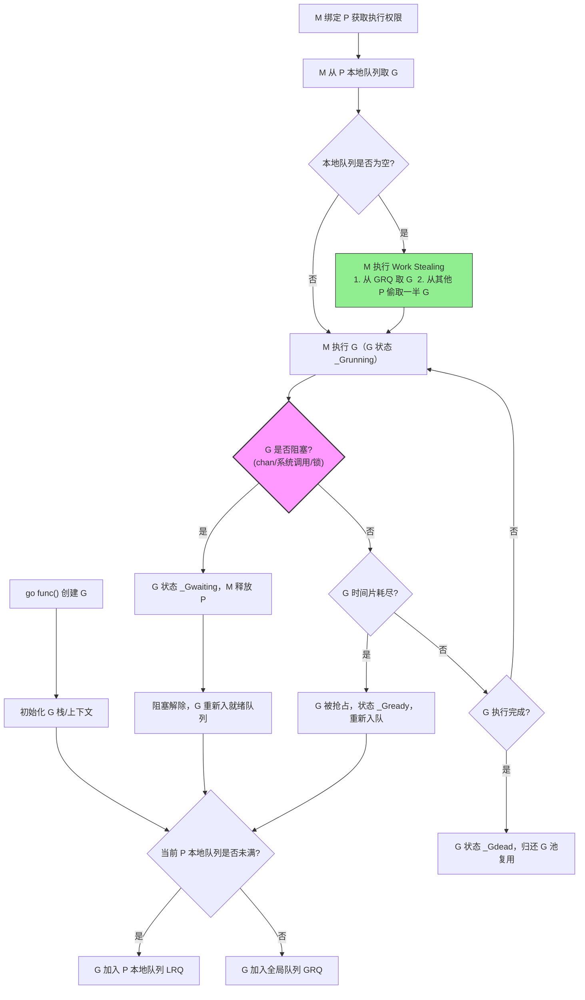
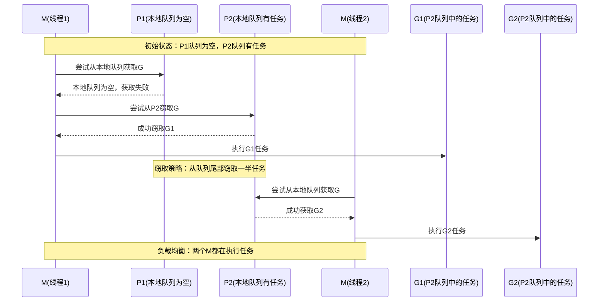
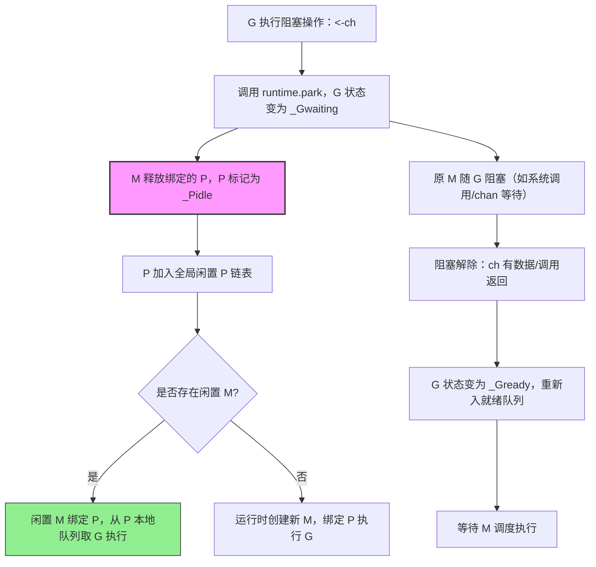
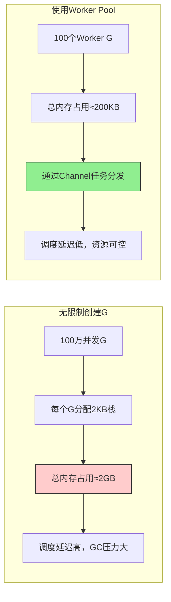
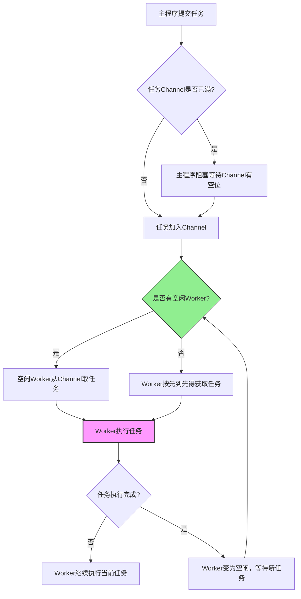
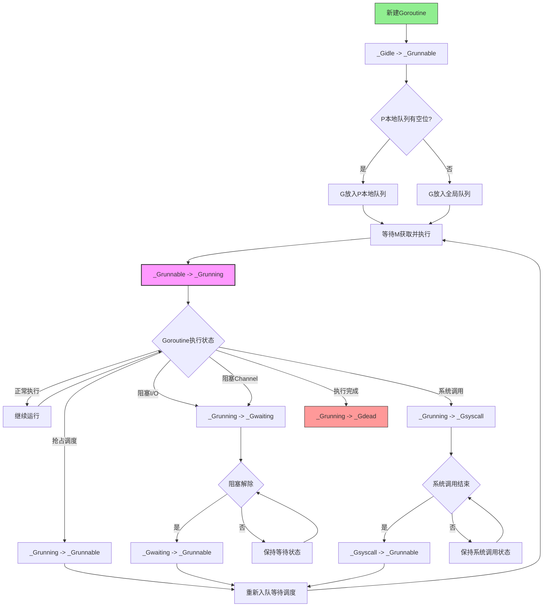

> 本文深入解析了Go语言的GMP调度模型，包括核心原理、实现机制、常见问题与优化策略，并提供实践案例与性能分析工具，帮助开发者全面理解并高效利用Go的并发特性。

## 一、GMP调度模型概述

Go语言的并发模型基于CSP（Communicating Sequential Processes）理论，通过`goroutine`和`channel`实现轻量级并发。GMP调度模型是Go运行时的核心组件，负责高效地调度goroutine到系统线程上执行。

### 核心组件定义

1. **G (Goroutine)**：Go中的轻量级线程，由Go运行时管理，每个G都有自己的栈空间和调度信息。

2. **M (Machine/Thread)**：操作系统线程，由Go运行时创建和管理，负责执行G。

3. **P (Processor)**：处理器，维护一个可运行的G队列，M需要获取P才能执行G。P的数量默认等于CPU核心数，可通过`GOMAXPROCS`环境变量调整。

### 调度核心流程



### 核心优化机制

1. **工作窃取**：当一个P的本地队列为空时，会从其他P的队列中窃取G来执行，实现负载均衡。

工作窃取机制的具体流程如下图所示，展示了P1如何从P2窃取Goroutine的过程：



2. **抢占调度**：Go运行时定期检查长时间运行的G，并将其抢占，防止某个G独占M。

3. **G池复用**：Go运行时维护一个G池，避免频繁创建和销毁G带来的开销。

## 二、GMP调度原理详解

### 调度器初始化

```go
// Go程序启动时，调度器初始化的核心代码
func schedinit() {
    // 获取CPU核心数
    ncpu := getncpu()
    // 设置P的数量
    procs := ncpu
    if n := int(gomaxprocs); n > 0 {
        procs = n
    }
    // 初始化P
    if procresize(procs) != nil {
        throw("unknown failure in procresize")
    }
}
```

### G创建与入队

当调用`go`关键字时，Go运行时会创建一个新的G，并将其放入当前P的本地队列中。如果本地队列已满，会将部分G转移到全局队列中。

```go
// go关键字的底层实现（简化版）
func newproc(siz int32, fn *funcval) {
    // 获取当前G
    argp := getcallerpc(unsafe.Pointer(&siz))
    // 创建新G
    gp := getg()
    // 获取当前P
    pc := getcallerpc()
    systemstack(func() {
        newg := newproc1(fn, argp, siz, gp, pc)
        // 将新G放入P的本地队列
        runqput(_p_, newg, true)
    })
}
```

### M绑定P与G执行

M需要绑定P才能执行G，当M执行完一个G后，会从P的队列中获取下一个G继续执行。如果P的本地队列为空，M会尝试从全局队列或其他P的队列中窃取G。

```go
// M的主要调度循环（简化版）
func schedule() {
    _g_ := getg()
    
    top:
        // 获取待执行的G
        gp, inheritTime, tryWakeP := findrunnable()
        // 执行G
        execute(gp, inheritTime)
}

// M执行G的核心函数
func execute(gp *g, inheritTime bool) {
    _g_ := getg()
    // 将G与M关联
    _g_.m.curg = gp
    gp.m = _g_.m
    // 切换到G的执行上下文
    gogo(&gp.sched)
}
```

### G阻塞与M/P解耦

当G执行阻塞操作（如系统调用、channel操作等）时，M会与P解耦，P可以绑定其他M继续执行其他G。当阻塞操作完成后，G会重新入队等待调度。

```go
// 系统调用处理（简化版）
func entersyscall(dummy int32) {
    _g_ := getg()
    // 解除P与M的绑定
    _g_.m.p = 0
    _g_.m.mcache = nil
    
    // 执行系统调用
    systemcall()
    
    // 系统调用返回后尝试重新获取P
    exitsyscall()
}

func exitsyscall() {
    _g_ := getg()
    // 尝试重新获取之前的P
    oldp := _g_.m.oldp
    if oldp != nil && cas(&_g_.m.oldp.ptr().status, _Pidle, _Prunning) {
        // 成功获取之前的P
        _g_.m.p = oldp
        _g_.m.mcache = oldp.mcache
    } else {
        // 获取失败，将G放入全局队列
        lock(&sched.lock)
        globrunqput(_g_)
        unlock(&sched.lock)
    }
}
```

下面展示了G阻塞时M释放P、P绑定新M的核心逻辑流程图：



### 抢占调度机制

Go运行时通过基于信号的抢占式调度来防止某个G长时间占用M。在Go 1.14之前，采用协作式调度，需要函数调用才能触发调度；Go 1.14之后引入了基于信号的抢占式调度，可以更及时地抢占长时间运行的G。

```go
// Go 1.14后的抢占调度实现
func preemptone(_p_ *p) bool {
    mp := _p_.m.ptr()
    if mp == nil || mp == getg().m {
        return false
    }
    // 向M发送信号，触发抢占
    if preemptMSupported && debug.asyncpreemptoff == 0 {
        // 使用异步信号抢占
        _p_.preempt = true
        preemptM(mp)
    } else {
        // 使用同步抢占
        newg := _p_.runqget()
        if newg == nil {
            newg, _p_ = runqget(_p_)
        }
        if newg != nil {
            // 设置抢占标记
            newg.preempt = true
            _p_.runqput(newg, true)
        }
    }
    return true
}
```

## 三、GMP调度模型常见误区与错误用法

### 误区1：`runtime.GOMAXPROCS`设置越大越好

许多人认为将`runtime.GOMAXPROCS`设置为远大于CPU核心数的值可以提高并发性能，但实际上这会导致频繁的线程切换，反而降低性能。

**错误用法**：
```go
func main() {
    // 错误：将GOMAXPROCS设置为CPU核心数的数倍
    runtime.GOMAXPROCS(32) // 假设CPU只有8核
    // ... 应用逻辑
}
```

**正确用法**：
```go
func main() {
    // 通常不需要显式设置，让Go运行时自动处理
    // 如果确实需要调整，应基于CPU核心数进行设置
    runtime.GOMAXPROCS(runtime.NumCPU())
    // ... 应用逻辑
}
```

### 误区2：无限制地创建goroutine

由于goroutine轻量级的特性，有些开发者会无限制地创建goroutine，导致内存耗尽或调度效率下降。

**错误用法**：
```go
func main() {
    for i := 0; i < 1000000; i++ {
        go func() {
            // 执行某些操作
        }()
    }
    // 等待所有goroutine完成
    time.Sleep(time.Hour)
}
```

**正确用法**：
```go
func main() {
    // 使用worker pool模式限制并发goroutine数量
    var wg sync.WaitGroup
    workerCount := 100 // 根据实际情况调整
    taskCh := make(chan Task, 1000)
    
    // 启动worker
    for i := 0; i < workerCount; i++ {
        wg.Add(1)
        go func() {
            defer wg.Done()
            for task := range taskCh {
                process(task)
            }
        }()
    }
    
    // 提交任务
    for i := 0; i < 1000000; i++ {
        taskCh <- Task{ID: i}
    }
    close(taskCh)
    
    wg.Wait()
}
```

下图对比了无限制创建goroutine与使用worker pool的内存使用和调度效率差异：



### 误区3：忽略goroutine阻塞对调度的影响

当一个goroutine执行阻塞操作（如系统调用、I/O操作等）时，会导致M与P解耦，影响调度效率。如果不注意这一点，可能会导致并发性能下降。

**错误用法**：
```go
func main() {
    for i := 0; i < 100; i++ {
        go func() {
            // 直接进行阻塞的I/O操作，会占用M资源
            http.Get("https://example.com/api/data")
            // 处理响应
        }()
    }
    // 等待所有goroutine完成
    time.Sleep(time.Minute)
}
```

**正确用法**：
```go
func main() {
    var wg sync.WaitGroup
    for i := 0; i < 100; i++ {
        wg.Add(1)
        go func() {
            defer wg.Done()
            // 使用非阻塞I/O或封装到专门的goroutine中
            resp, err := http.Get("https://example.com/api/data")
            if err != nil {
                log.Printf("请求失败: %v", err)
                return
            }
            defer resp.Body.Close()
            // 处理响应
        }()
    }
    wg.Wait()
}
```

### 误区4：过度使用锁导致goroutine阻塞

在高并发场景下，过度使用互斥锁会导致大量goroutine阻塞，降低并发性能。

**错误用法**：
```go
var mu sync.Mutex
var data []string

func processItem(item string) {
    mu.Lock()
    defer mu.Unlock()
    // 每次处理都需要获取全局锁
    data = append(data, strings.ToUpper(item))
}

func main() {
    var wg sync.WaitGroup
    items := []string{"a", "b", "c", "d", "e"}
    
    for _, item := range items {
        wg.Add(1)
        go func(s string) {
            defer wg.Done()
            processItem(s)
        }(item)
    }
    
    wg.Wait()
    fmt.Println(data)
}
```

**正确用法**：
```go
// 方案1：减少锁的范围
data := make([]string, 0, len(items))
var mu sync.Mutex

func processItem(item string) {
    // 只在必要时获取锁
    processedItem := strings.ToUpper(item)
    mu.Lock()
    data = append(data, processedItem)
    mu.Unlock()
}

// 方案2：使用channel避免锁
func main() {
    items := []string{"a", "b", "c", "d", "e"}
    resultCh := make(chan string, len(items))
    
    for _, item := range items {
        go func(s string) {
            resultCh <- strings.ToUpper(s)
        }(item)
    }
    
    var data []string
    for i := 0; i < len(items); i++ {
        data = append(data, <-resultCh)
    }
    
    fmt.Println(data)
}
```

## 四、GMP调度模型优化策略

### 1. 合理设置GOMAXPROCS

根据应用类型合理设置`GOMAXPROCS`，避免过多线程上下文切换。

```go
// CPU密集型应用：可以设置为CPU核心数
runtime.GOMAXPROCS(runtime.NumCPU())

// I/O密集型应用：可以设置为CPU核心数的2倍左右
runtime.GOMAXPROCS(runtime.NumCPU() * 2)
```

### 2. 使用worker pool模式

限制并发goroutine数量，避免无限制创建goroutine。

```go
type WorkerPool struct {
    workerCount int
    taskCh      chan func()
    wg          sync.WaitGroup
}

func NewWorkerPool(workerCount int) *WorkerPool {
    return &WorkerPool{
        workerCount: workerCount,
        taskCh:      make(chan func(), workerCount*2),
    }
}

func (p *WorkerPool) Start() {
    for i := 0; i < p.workerCount; i++ {
        p.wg.Add(1)
        go func() {
            defer p.wg.Done()
            for task := range p.taskCh {
                task()
            }
        }()
    }
}

func (p *WorkerPool) Submit(task func()) {
    p.taskCh <- task
}

func (p *WorkerPool) Stop() {
    close(p.taskCh)
    p.wg.Wait()
}
```

Worker Pool的工作流程如下所示，展示了任务分发和执行的核心机制：



### 3. 使用channel减少锁的使用

尽可能使用channel替代互斥锁，减少goroutine阻塞。

```go
// 使用channel实现安全的共享数据访问
type SafeData struct {
    data  map[string]string
    readCh  chan string
    writeCh chan keyValue
    resultCh chan string
}

type keyValue struct {
    key   string
    value string
}

func NewSafeData() *SafeData {
    sd := &SafeData{
        data:     make(map[string]string),
        readCh:   make(chan string),
        writeCh:  make(chan keyValue),
        resultCh: make(chan string),
    }
    
    // 启动专门处理数据访问的goroutine
    go func() {
        for {
            select {
            case key := <-sd.readCh:
                sd.resultCh <- sd.data[key]
            case kv := <-sd.writeCh:
                sd.data[kv.key] = kv.value
            }
        }
    }()
    
    return sd
}

func (sd *SafeData) Read(key string) string {
    sd.readCh <- key
    return <-sd.resultCh
}

func (sd *SafeData) Write(key, value string) {
    sd.writeCh <- keyValue{key: key, value: value}
}
```

### 4. 避免阻塞操作影响调度

将阻塞操作封装到专门的goroutine中，避免阻塞M影响调度。

```go
// 将阻塞操作封装到专门的goroutine中
type BlockingWorker struct {
    taskCh chan func() error
    errCh  chan error
}

func NewBlockingWorker() *BlockingWorker {
    bw := &BlockingWorker{
        taskCh: make(chan func() error),
        errCh:  make(chan error, 1),
    }
    
    go func() {
        for task := range bw.taskCh {
            bw.errCh <- task()
        }
    }()
    
    return bw
}

func (bw *BlockingWorker) Submit(task func() error) error {
    bw.taskCh <- task
    return <-bw.errCh
}

func (bw *BlockingWorker) Close() {
    close(bw.taskCh)
}
```

## 五、GMP调度模型性能分析

### 常用性能分析工具

1. **pprof**：Go内置的性能分析工具，可以分析CPU、内存、阻塞等性能数据。

```go
import (
    "log"
    "net/http"
    _ "net/http/pprof"
)

func main() {
    // 启动pprof HTTP服务器
    go func() {
        log.Println(http.ListenAndServe("localhost:6060", nil))
    }()
    
    // 应用逻辑
    // ...
}
```

2. **trace**：Go内置的执行跟踪工具，可以可视化分析goroutine的调度行为。

```go
import (
    "os"
    "runtime/trace"
)

func main() {
    // 启动trace
    f, err := os.Create("trace.out")
    if err != nil {
        log.Fatalf("failed to create trace file: %v", err)
    }
    defer f.Close()
    
    if err := trace.Start(f); err != nil {
        log.Fatalf("failed to start trace: %v", err)
    }
    defer trace.Stop()
    
    // 应用逻辑
    // ...
}
```

### 性能分析关键指标

1. **Goroutine创建/销毁速率**：过高的创建/销毁速率可能导致性能问题。

2. **调度延迟**：从G可运行到实际执行的时间，调度延迟过高表示调度效率低下。

3. **工作窃取效率**：工作窃取频率过高表示负载不均衡。

4. **系统调用阻塞时间**：过多的系统调用阻塞时间会影响调度效率。

## 六、GMP调度模型实践案例

### 案例1：高并发Web服务器

```go
package main

import (
    "log"
    "net/http"
    "runtime"
    "sync"
)

// WorkerPool 实现简单的worker pool
type WorkerPool struct {
    workerCount int
    taskCh      chan http.Handler
    server      *http.Server
    wg          sync.WaitGroup
}

func NewWorkerPool(workerCount int, addr string) *WorkerPool {
    p := &WorkerPool{
        workerCount: workerCount,
        taskCh:      make(chan http.Handler, workerCount*2),
    }
    
    p.server = &http.Server{
        Addr:    addr,
        Handler: p,
    }
    
    return p
}

func (p *WorkerPool) Start() error {
    // 启动worker
    for i := 0; i < p.workerCount; i++ {
        p.wg.Add(1)
        go func() {
            defer p.wg.Done()
            for handler := range p.taskCh {
                handler.ServeHTTP(nil, nil)
            }
        }()
    }
    
    return p.server.ListenAndServe()
}

func (p *WorkerPool) ServeHTTP(w http.ResponseWriter, r *http.Request) {
    // 将请求封装为任务，提交到任务队列
    p.taskCh <- http.HandlerFunc(func(w http.ResponseWriter, r *http.Request) {
        // 实际处理请求的逻辑
        w.Write([]byte("Hello, World!"))
    })
}

func (p *WorkerPool) Stop() {
    close(p.taskCh)
    p.wg.Wait()
    p.server.Close()
}

func main() {
    // 设置GOMAXPROCS为CPU核心数
    runtime.GOMAXPROCS(runtime.NumCPU())
    
    // 创建worker pool
    pool := NewWorkerPool(runtime.NumCPU()*2, ":8080")
    
    log.Println("Server started on :8080")
    if err := pool.Start(); err != nil {
        log.Fatalf("Server failed: %v", err)
    }
}
```

### 案例2：并发数据处理

```go
package main

import (
    "fmt"
    "runtime"
    "sync"
    "time"
)

type DataProcessor struct {
    workers    int
    inputCh    chan Data
    outputCh   chan Result
    workerPool *WorkerPool
}

type Data struct {
    ID   int
    Data []byte
}

type Result struct {
    ID   int
    Data []byte
    Err  error
}

func NewDataProcessor(workers int) *DataProcessor {
    return &DataProcessor{
        workers:    workers,
        inputCh:    make(chan Data, workers*10),
        outputCh:   make(chan Result, workers*10),
        workerPool: NewWorkerPool(workers),
    }
}

func (dp *DataProcessor) Start() {
    // 启动数据输入goroutine
    go dp.inputWorker()
    
    // 启动数据处理worker
    dp.workerPool.Start()
    
    // 启动数据输出goroutine
    go dp.outputWorker()
}

func (dp *DataProcessor) inputWorker() {
    for i := 0; i < 1000; i++ {
        data := Data{
            ID:   i,
            Data: []byte(fmt.Sprintf("data-%d", i)),
        }
        dp.inputCh <- data
    }
    close(dp.inputCh)
}

func (dp *DataProcessor) outputWorker() {
    for result := range dp.outputCh {
        if result.Err != nil {
            fmt.Printf("Error processing data %d: %v\n", result.ID, result.Err)
            continue
        }
        fmt.Printf("Processed data %d: %s\n", result.ID, result.Data)
    }
}

func (dp *DataProcessor) Process(data Data) Result {
    // 模拟数据处理
    time.Sleep(10 * time.Millisecond)
    return Result{
        ID:   data.ID,
        Data: []byte(fmt.Sprintf("processed-%s", data.Data)),
        Err:  nil,
    }
}

func main() {
    // 设置GOMAXPROCS
    runtime.GOMAXPROCS(runtime.NumCPU())
    
    // 创建数据处理器
    processor := NewDataProcessor(runtime.NumCPU() * 2)
    
    // 启动处理器
    processor.Start()
    
    // 等待处理完成
    time.Sleep(15 * time.Second)
}
```

## 七、GMP调度模型高级特性

Goroutine的生命周期包含多个状态转换，下图展示了从创建到销毁的完整状态流转过程：



### 1. 调度器跟踪与调试

Go提供了丰富的调度器跟踪和调试功能，帮助开发者分析调度行为。

```go
// 启用调度器跟踪
import (
    "os"
    "runtime/trace"
)

func main() {
    // 创建跟踪文件
    f, err := os.Create("scheduler-trace.out")
    if err != nil {
        panic(err)
    }
    defer f.Close()
    
    // 启动跟踪
    if err := trace.Start(f); err != nil {
        panic(err)
    }
    defer trace.Stop()
    
    // 应用逻辑
    // ...
}
```

### 2. 调度器统计信息

Go运行时提供了丰富的调度器统计信息，可以通过`runtime`包获取。

```go
import (
    "fmt"
    "runtime"
    "time"
)

func printSchedulerStats() {
    var stats runtime.MemStats
    runtime.ReadMemStats(&stats)
    
    fmt.Printf("Goroutines: %d\n", runtime.NumGoroutine())
    fmt.Printf("GOMAXPROCS: %d\n", runtime.GOMAXPROCS(0))
    fmt.Printf("Go calls: %d\n", stats.NumGC)
    fmt.Printf("Memory usage: %d KB\n", stats.Alloc/1024)
}

func main() {
    go func() {
        for {
            printSchedulerStats()
            time.Sleep(5 * time.Second)
        }
    }()
    
    // 应用逻辑
    // ...
}
```

### 3. 调度器调优参数

Go提供了一些调优参数，可以通过环境变量设置。

```bash
# 设置GOMAXPROCS
export GOMAXPROCS=4

# 设置GODEBUG=tracebackancestors=N，在panic时打印N个祖先goroutine的栈信息
export GODEBUG=tracebackancestors=10

# 设置GODEBUG=schedtrace=X，每X毫秒打印一次调度信息
export GODEBUG=schedtrace=1000

# 设置GODEBUG=scheddetail=1，打印详细的调度信息
export GODEBUG=scheddetail=1
```

## 八、GMP调度模型：最佳实践与典型错误用法（避坑指南）

### 1. GOMAXPROCS配置

#### 最佳实践
```go
// 动态根据CPU核心数设置GOMAXPROCS
func init() {
    runtime.GOMAXPROCS(runtime.NumCPU())
}

// 根据应用类型调整
// CPU密集型应用：与CPU核心数相同
// IO密集型应用：可设置为CPU核心数的2倍
func adjustGOMAXPROCS(isCPUIntensive bool) {
    if isCPUIntensive {
        runtime.GOMAXPROCS(runtime.NumCPU())
    } else {
        runtime.GOMAXPROCS(runtime.NumCPU() * 2)
    }
}
```

#### 错误用法
```go
// 错误1：设置过高导致过多线程切换
func badMaxProcs() {
    // 假设只有8核CPU，却设置了32个P
    runtime.GOMAXPROCS(32) // 会导致过多的线程切换，降低性能
}

// 错误2：设置过低导致并发度不足
func badMaxProcs2() {
    // 多核CPU只设置单核，无法利用多核优势
    runtime.GOMAXPROCS(1) // 在多核系统上性能下降
}
```

#### 修复方案
```go
// 正确配置GOMAXPROCS
func correctMaxProcs() {
    // 方法1：根据实际CPU核心数设置
    runtime.GOMAXPROCS(runtime.NumCPU())
    
    // 方法2：根据应用类型动态调整
    cpuCount := runtime.NumCPU()
    if isCPUIntensiveApp() {
        runtime.GOMAXPROCS(cpuCount)
    } else {
        // IO密集型应用可适当增加，但不宜超过CPU核心数的2倍
        runtime.GOMAXPROCS(cpuCount * 2)
    }
}

func isCPUIntensiveApp() bool {
    // 判断应用是否为CPU密集型
    return true
}
```

### 2. Goroutine管理

#### 最佳实践
```go
// 使用Worker Pool模式控制并发goroutine数量
func goodWorkerPool() {
    // 创建带缓冲的channel作为任务队列
    taskQueue := make(chan Task, 100)
    
    // 启动固定数量的worker
    workerCount := 10
    for i := 0; i < workerCount; i++ {
        go worker(taskQueue)
    }
    
    // 提交任务
    for i := 0; i < 1000; i++ {
        taskQueue <- Task{ID: i}
    }
    close(taskQueue)
}

type Task struct {
    ID int
}

func worker(taskQueue <-chan Task) {
    for task := range taskQueue {
        process(task)
    }
}

func process(task Task) {
    // 处理任务
}
```

#### 错误用法
```go
// 错误1：无限制创建goroutine
func badGoroutineCreation() {
    for i := 0; i < 100000; i++ {
        go func() {
            // 每个goroutine都持有内存，可能导致内存耗尽
            heavyOperation()
        }()
    }
}

// 错误2：goroutine泄漏
func badGoroutineLeak() {
    ch := make(chan int)
    
    go func() {
        // 如果没有接收者，这个goroutine会一直阻塞，导致泄漏
        ch <- 1
    }()
    
    // 忘记接收channel中的数据
    // <-ch // 注释掉了，导致goroutine泄漏
}
```

#### 修复方案
```go
// 修复1：使用worker pool限制并发数量
func fixGoroutineCreation() {
    // 使用sync.WaitGroup等待所有任务完成
    var wg sync.WaitGroup
    
    // 限制并发goroutine数量
    concurrency := 100
    semaphore := make(chan struct{}, concurrency)
    
    for i := 0; i < 100000; i++ {
        wg.Add(1)
        
        go func(id int) {
            defer wg.Done()
            
            // 获取信号量，控制并发数量
            semaphore <- struct{}{}
            defer func() { <-semaphore }()
            
            heavyOperation(id)
        }(i)
    }
    
    wg.Wait()
}

// 修复2：避免goroutine泄漏
func fixGoroutineLeak() {
    ch := make(chan int, 1) // 使用带缓冲的channel
    
    go func() {
        ch <- 1
    }()
    
    // 确保接收channel中的数据
    result := <-ch
    fmt.Println(result)
    
    // 或者使用context设置超时
    ctx, cancel := context.WithTimeout(context.Background(), 5*time.Second)
    defer cancel()
    
    go func() {
        select {
        case ch <- 1:
        case <-ctx.Done():
            // 超时处理
            return
        }
    }()
    
    select {
    case result := <-ch:
        fmt.Println(result)
    case <-ctx.Done():
        fmt.Println("超时")
    }
}
```

### 3. 阻塞操作优化

#### 最佳实践
```go
// 将阻塞操作封装到专门的goroutine中
func goodBlockingOperation() {
    resultCh := make(chan Result)
    errCh := make(chan error)
    
    go func() {
        // 将阻塞操作放在单独的goroutine中
        result, err := blockingOperation()
        if err != nil {
            errCh <- err
            return
        }
        resultCh <- result
    }()
    
    // 非阻塞地处理结果
    select {
    case result := <-resultCh:
        processResult(result)
    case err := <-errCh:
        handleError(err)
    case <-time.After(5 * time.Second):
        // 超时处理
        handleTimeout()
    }
}

type Result struct {
    Data []byte
}

func blockingOperation() (Result, error) {
    // 模拟阻塞操作
    time.Sleep(2 * time.Second)
    return Result{Data: []byte("result")}, nil
}

func processResult(result Result) {
    // 处理结果
}

func handleError(err error) {
    // 处理错误
}

func handleTimeout() {
    // 处理超时
}
```

#### 错误用法
```go
// 错误1：直接在goroutine中进行阻塞操作
func badBlockingOperation() {
    for i := 0; i < 1000; i++ {
        go func() {
            // 直接进行阻塞的I/O操作，会占用M资源
            resp, err := http.Get("https://example.com/api/data")
            if err != nil {
                log.Printf("请求失败: %v", err)
                return
            }
            defer resp.Body.Close()
            
            // 处理响应
            processResponse(resp)
        }()
    }
    // 等待所有goroutine完成
    time.Sleep(time.Hour)
}

// 错误2：不处理阻塞操作中的错误
func badBlockingOperation2() {
    go func() {
        // 阻塞操作不处理错误，可能导致goroutine永久阻塞
        conn, _ := net.Dial("tcp", "unreachable.example.com:80")
        defer conn.Close()
        
        // 如果连接失败，后面的代码不会执行，但goroutine不会退出
        io.WriteString(conn, "GET / HTTP/1.0\r\n\r\n")
    }()
}
```

#### 修复方案
```go
// 修复1：使用worker pool处理阻塞操作
func fixBlockingOperation() {
    workerCount := 50
    taskQueue := make(chan Task, 1000)
    
    // 启动worker
    for i := 0; i < workerCount; i++ {
        go func() {
            for task := range taskQueue {
                // 处理任务
                processTask(task)
            }
        }()
    }
    
    // 提交任务
    for i := 0; i < 1000; i++ {
        taskQueue <- Task{ID: i, URL: "https://example.com/api/data"}
    }
    close(taskQueue)
}

type Task struct {
    ID  int
    URL string
}

func processTask(task Task) {
    // 处理任务，包含超时控制
    ctx, cancel := context.WithTimeout(context.Background(), 5*time.Second)
    defer cancel()
    
    req, err := http.NewRequestWithContext(ctx, "GET", task.URL, nil)
    if err != nil {
        log.Printf("创建请求失败: %v", err)
        return
    }
    
    resp, err := http.DefaultClient.Do(req)
    if err != nil {
        log.Printf("请求失败: %v", err)
        return
    }
    defer resp.Body.Close()
    
    // 处理响应
    processResponse(resp)
}

// 修复2：正确处理阻塞操作中的错误
func fixBlockingOperation2() {
    go func() {
        conn, err := net.DialTimeout("tcp", "unreachable.example.com:80", 5*time.Second)
        if err != nil {
            log.Printf("连接失败: %v", err)
            return
        }
        defer conn.Close()
        
        _, err = io.WriteString(conn, "GET / HTTP/1.0\r\n\r\n")
        if err != nil {
            log.Printf("写入失败: %v", err)
            return
        }
    }()
}
```

### 4. Channel使用优化

#### 最佳实践
```go
// 使用带缓冲的channel减少阻塞
func goodBufferedChannel() {
    // 根据实际情况设置合适的缓冲区大小
    ch := make(chan int, 100) // 带缓冲的channel
    
    go func() {
        for i := 0; i < 1000; i++ {
            ch <- i // 发送不会立即阻塞
        }
        close(ch)
    }()
    
    for value := range ch {
        processValue(value)
    }
}

// 使用select实现非阻塞操作
func goodSelectChannel() {
    ch := make(chan int)
    timeout := time.After(2 * time.Second)
    
    go func() {
        time.Sleep(1 * time.Second)
        ch <- 1
    }()
    
    select {
    case value := <-ch:
        fmt.Printf("接收到值: %d\n", value)
    case <-timeout:
        fmt.Println("超时")
    }
}

func processValue(value int) {
    // 处理值
}
```

#### 错误用法
```go
// 错误1：使用无缓冲channel导致死锁
func badUnbufferedChannel() {
    ch := make(chan int) // 无缓冲channel
    
    // 在同一个goroutine中发送和接收会导致死锁
    ch <- 1 // 阻塞，直到有接收者
    value := <-ch // 永远执行不到
    fmt.Println(value)
}

// 错误2：忘记关闭channel导致goroutine泄漏
func badLeakingChannel() {
    ch := make(chan int)
    
    go func() {
        for value := range ch {
            processValue(value)
        }
        // 如果ch没有被关闭，这个goroutine会一直阻塞在这里
    }()
    
    for i := 0; i < 100; i++ {
        ch <- i
    }
    // 忘记关闭channel，导致goroutine泄漏
    // close(ch)
}

// 错误3：向已关闭的channel发送数据导致panic
func badClosedChannel() {
    ch := make(chan int, 2)
    
    ch <- 1
    ch <- 2
    close(ch)
    
    // 向已关闭的channel发送数据会导致panic
    ch <- 3 // panic: send on closed channel
}
```

#### 修复方案
```go
// 修复1：使用带缓冲的channel或在不同goroutine中操作
func fixUnbufferedChannel() {
    // 方法1：使用带缓冲的channel
    ch := make(chan int, 1)
    ch <- 1
    value := <-ch
    fmt.Println(value)
    
    // 方法2：在不同goroutine中操作无缓冲channel
    ch2 := make(chan int)
    go func() {
        ch2 <- 1
    }()
    value2 := <-ch2
    fmt.Println(value2)
}

// 修复2：确保关闭channel
func fixLeakingChannel() {
    ch := make(chan int)
    
    var wg sync.WaitGroup
    wg.Add(1)
    go func() {
        defer wg.Done()
        for value := range ch {
            processValue(value)
        }
    }()
    
    for i := 0; i < 100; i++ {
        ch <- i
    }
    close(ch) // 确保关闭channel
    wg.Wait()
}

// 修复3：检查channel是否已关闭
func fixClosedChannel() {
    ch := make(chan int, 2)
    
    ch <- 1
    ch <- 2
    close(ch)
    
    // 使用select和comma ok模式安全地向channel发送数据
    select {
    case ch <- 3:
        fmt.Println("发送成功")
    default:
        fmt.Println("channel已关闭或缓冲区已满")
    }
    
    // 安全地从channel接收数据
    if value, ok := <-ch; ok {
        fmt.Printf("接收到值: %d\n", value)
    } else {
        fmt.Println("channel已关闭")
    }
}
```

## 九、GMP调度模型未来发展

### 1. 调度器优化方向

1. **更精细的负载均衡**：改进工作窃取算法，减少P之间的负载不均衡。

2. **更智能的抢占机制**：减少不必要的抢占开销，提高调度效率。

3. **更高效的内存管理**：优化G的内存分配和回收机制，减少GC压力。

4. **更好的NUMA支持**：针对NUMA架构优化调度策略，提高多核扩展性。

### 2. 与硬件发展的结合

1. **针对新CPU架构的优化**：针对异构CPU架构（如大小核）设计更合适的调度策略。

2. **与新型内存技术的结合**：利用持久内存等新型内存技术优化G的生命周期管理。

3. **与硬件加速器的协同**：设计更高效的调度机制，实现CPU与硬件加速器的协同工作。

### 3. 云原生环境下的调度优化

1. **容器感知调度**：根据容器资源限制动态调整GOMAXPROCS和调度策略。

2. **热迁移支持**：优化G的跨节点迁移机制，实现无缝的负载重平衡。

3. **微服务友好型调度**：针对微服务场景优化调度策略，提高服务响应性能。

## 十、总结

Go语言的GMP调度模型是其高并发性能的核心，通过合理配置GOMAXPROCS、控制goroutine数量、优化阻塞操作和channel使用，可以充分发挥Go的并发优势。

本文详细介绍了GMP调度模型的原理、常见误区、优化策略和实践案例，希望能帮助开发者更好地理解和使用Go的并发特性。随着Go语言的不断发展，GMP调度模型也在持续优化，未来将更好地适应新型硬件架构和云原生环境的需求。