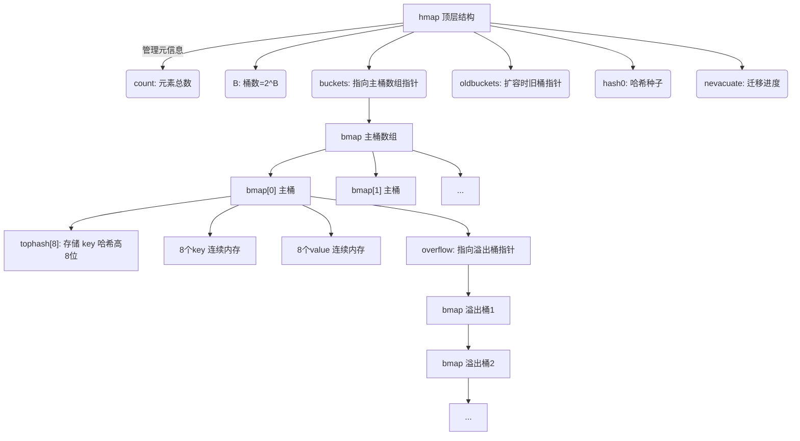
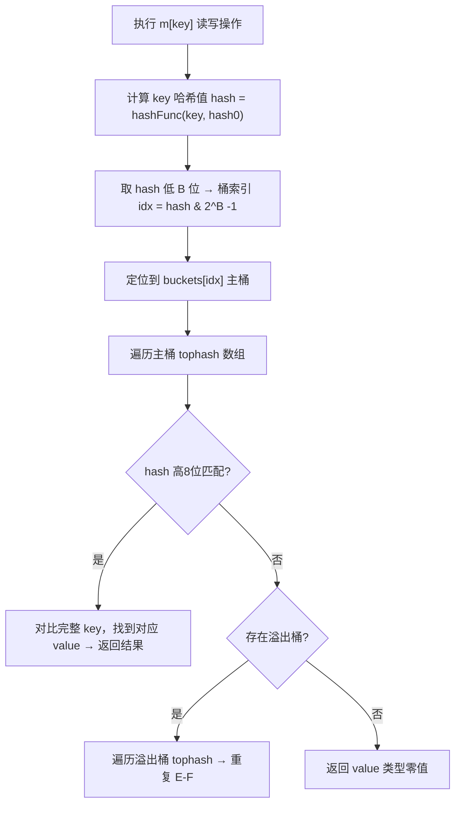
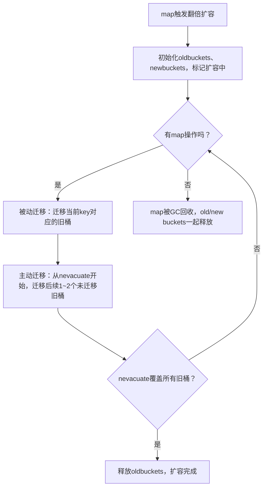

## 基本概念

在 Go 语言中，map 是一种**无序的键值对（key-value）集合**，也常被称为字典、哈希表。它的核心作用是通过唯一的 key 快速查找对应的 value，就像一本字典通过拼音（key）查找汉字（value）一样，查找效率极高（平均时间复杂度 O(1)）。

**核心特点**：

- key 必须是**可比较的类型**（如 string、int、bool、数组等），不能是切片、map、函数（这些类型不支持 == 比较）
- value 可以是任意类型（包括自定义类型）
- map 是引用类型（类似切片、指针），传递时不会拷贝数据，而是传递内存地址
- map 中的元素是无序的，每次遍历的顺序可能不同

---

## 基本使用

map 有三种常见的创建方式：

```go
package main

import "fmt"

func main() {
    // 方式1：仅声明（零值为 nil，不能直接赋值，需初始化）
    var m1 map[string]int // 声明一个 key 为 string、value 为 int 的 map
    fmt.Println(m1 == nil) // 输出：true

    // 方式2：使用 make 初始化（推荐，可指定初始容量）
    m2 := make(map[string]int, 10) // 初始容量 10，容量会自动扩容
    m2["apple"] = 5
    m2["banana"] = 3
    fmt.Println(m2) // 输出：map[apple:5 banana:3]

    // 方式3：字面量初始化（直接赋值）
    m3 := map[string]int{
        "orange": 8,
        "pear":   4, // 注意：最后一行末尾必须加逗号
    }
    fmt.Println(m3) // 输出：map[orange:8 pear:4]
}
```

### 访问、添加、修改元素

```go
func main() {
    m := make(map[string]int)

    // 添加/修改元素（key 不存在则添加，存在则修改）
    m["a"] = 1 // 添加
    m["a"] = 10 // 修改
    fmt.Println(m["a"]) // 输出：10

    // 访问不存在的 key：返回 value 类型的零值（不会报错）
    fmt.Println(m["b"]) // 输出：0

    // 安全访问：判断 key 是否存在
    val, ok := m["b"]
    if ok {
        fmt.Println("b 的值：", val)
    } else {
        fmt.Println("b 不存在") // 输出这行
    }
}
```

### 删除元素

使用 `delete` 内置函数删除 map 中的键值对，即使 key 不存在，delete 也不会报错：

```go
func main() {
    m := map[string]int{"a":1, "b":2}
    delete(m, "a") // 删除 key 为 "a" 的元素
    delete(m, "c") // 无操作，不会报错
    fmt.Println(m) // 输出：map[b:2]
}
```

### 遍历 map

使用 `for range` 遍历 map，注意遍历顺序不固定：

```go
func main() {
    m := map[string]int{"a":1, "b":2, "c":3}
    // 遍历 key 和 value
    for k, v := range m {
        fmt.Printf("key:%s, value:%d\n", k, v)
    }
    // 仅遍历 key
    for k := range m {
        fmt.Println("key:", k)
    }
    // 仅遍历 value
    for _, v := range m {
        fmt.Println("value:", v)
    }
}
```

---

## 核心注意事项

### nil map 不能直接赋值

仅声明未初始化的 map 是 nil，必须先用 make 或字面量初始化后才能添加元素，否则会 panic：

```go
var m map[string]int
// m["a"] = 1 // 运行时 panic: assignment to entry in nil map
m = make(map[string]int)
m["a"] = 1 // 正常
```

### map 不是并发安全的

多个 goroutine 同时读写 map 会触发 panic，若需并发安全，可使用 `sync.Map`（Go 1.9+ 内置），或手动加锁（sync.Mutex）。

### map 的容量

make 时指定的容量是提示性的，map 会自动扩容，且无法通过 cap() 函数获取 map 的容量（cap 仅用于切片），可通过 len() 获取当前键值对数量：

```go
m := make(map[string]int, 10)
m["a"] = 1
fmt.Println(len(m)) // 输出：1
```

### map 不能作为 key

因为 map 是引用类型，不支持 == 比较，所以不能作为另一个 map 的 key，但可以作为 value：

```go
// 合法：value 是 map
m := map[string]map[int]string{
    "group1": {1:"a", 2:"b"},
}
// 非法：key 是 map（编译报错）
// m2 := map[map[int]string]string{}
```

---

## 使用陷阱

### 结构体 value 无法直接修改字段

map 的 value 是"值拷贝"，如果 value 是结构体，直接通过 `m[key].Field` 修改字段会编译报错，因为 `m[key]` 返回的是值的副本，不是指针：

```go
type User struct {
    Name string
    Age  int
}

func main() {
    m := map[int]User{
        1: {"Alice", 20},
    }
    // m[1].Age = 21 // 编译报错：cannot assign to struct field m[1].Age in map
    
    // 正确做法1：先取出副本，修改后重新赋值
    u := m[1]
    u.Age = 21
    m[1] = u

    // 正确做法2：value 用指针类型（推荐，避免拷贝）
    m2 := map[int]*User{
        1: {"Alice", 20},
    }
    m2[1].Age = 21 // 正常修改
}
```

### map 作为函数参数传递的陷阱

map 是引用类型，传递给函数的是指针副本，但指向的是同一个底层哈希表 —— 函数内修改 map 会影响外部，但如果函数内给 map 重新赋值（`m = make(...)`），则不会影响外部：

```go
func modifyMap(m map[int]int) {
    m[1] = 100 // 会影响外部的 map
    m = make(map[int]int) // 重新赋值，指向新的哈希表，和外部无关
    m[2] = 200
}

func main() {
    m := make(map[int]int)
    m[1] = 10
    modifyMap(m)
    fmt.Println(m[1]) // 输出：100（函数内的修改生效）
    fmt.Println(m[2]) // 输出：0（重新赋值后的修改不生效）
}
```

### 遍历时删除/新增元素的注意事项

- 遍历过程中**可以删除**当前遍历到的 key，不会导致 panic
- 遍历过程中**新增元素**，新增的元素可能会被遍历到，也可能不会（取决于底层遍历逻辑），不要依赖这个行为
- 若需遍历并删除大量元素，建议先收集要删除的 key 到切片，遍历切片再删除

```go
func main() {
    m := map[int]int{1:1, 2:2, 3:3}
    // 错误示范：遍历中删除可能漏删（不 panic，但逻辑不稳定）
    // for k := range m {
    //     if k % 2 == 0 {
    //         delete(m, k)
    //     }
    // }

    // 正确示范：先收集，再删除
    toDelete := []int{}
    for k := range m {
        if k%2 == 0 {
            toDelete = append(toDelete, k)
        }
    }
    for _, k := range toDelete {
        delete(m, k)
    }
    fmt.Println(m) // 输出：map[1:1 3:3]
}
```

---

## 底层实现原理

Go 语言的 map 底层基于**哈希表（Hash Table）** 实现，核心结构体定义在 `runtime/map.go` 中。

### 核心数据结构

```go
// hmap：hash map 的顶层结构，存储 map 的元信息
type hmap struct {
    count     int // map 中键值对的数量（len(map) 返回的值）
    buckets   unsafe.Pointer // 指向桶数组的指针，数据真正存储的地方
    oldbuckets unsafe.Pointer // 扩容时的旧桶数组，扩容完成后置 nil
    B         uint8  // 桶数组的大小 = 2^B，初始 B 通常为 1（即 2 个桶）
    hash0     uint32 // 哈希种子，用于计算 key 的哈希值，增加随机性
    // 其他字段：如扩容标记、溢出桶指针等
}

// bmap：bucket（桶）的结构体，存储具体的键值对
type bmap struct {
    tophash [8]uint8 // 存储每个 key 哈希值的高 8 位，用于快速匹配
    // 实际内存布局中，tophash 后紧跟：8 个 key → 8 个 value → 溢出桶指针
    // 每个桶最多存储 8 个键值对
}
```



**核心设计**：

- 一个 `hmap` 管理整个 map，`bmap` 是存储数据的最小单元
- 每个 `bmap`（桶）最多存 8 个键值对，超过则通过**溢出桶**链接（类似链表）
- 桶数组的大小始终是 2 的幂（2^B），目的是通过位运算快速计算桶索引，提升效率

### 核心操作流程

当你执行 `m[key] = value` 或读取 `m[key]` 时，底层分 3 步：

1. **计算哈希值**：用 `hash0` 作为种子，对 key 计算一个 64 位（32 位系统是 32 位）的哈希值 `hash`
2. **定位桶索引**：取 `hash` 的低 B 位（因为桶数是 2^B），计算出该 key 所属的桶索引 `i = hash & (2^B - 1)`（位运算替代取模，更快）
3. **匹配 key**：取 `hash` 的高 8 位，先对比桶中 `tophash` 数组（快速过滤不匹配的 key），再对比完整 key，找到对应的 value

举个例子：

假设 B=3（桶数=8），key 的哈希值低 3 位是 `101`（二进制），则桶索引是 5；再用哈希值高 8 位匹配桶内 `tophash`，快速找到目标键值对。



### 哈希冲突解决

哈希冲突指不同 key 计算出的哈希值，最终定位到同一个桶。Go 采用「**链地址法**」解决：

- 若桶内 8 个位置已存满，会创建一个**溢出桶**，并将当前桶的溢出指针指向这个新桶
- 查找/删除时，会遍历当前桶 + 所有溢出桶，直到找到目标 key 或遍历完

### 关键特性解释

#### 为什么 map 是无序的？

- 哈希值计算有随机性（依赖 `hash0`），相同 key 在不同运行时可能定位到不同桶
- 扩容时数据会重新分布，遍历顺序也会变化
- Go 源码中甚至主动"打乱"遍历顺序，避免开发者依赖遍历顺序

#### 为什么 key 必须是可比较的类型？

因为底层需要通过 `==` 对比完整 key（tophash 只是快速过滤，最终需验证 key 本身），而切片、map、函数等类型不支持 `==`，所以不能作为 key。

#### 为什么 nil map 不能赋值？

nil map 的 `hmap` 结构体为 nil，没有指向任何桶数组（`buckets` 指针为空），无法定位存储位置，直接赋值会触发 panic；而初始化后的 map 会分配 `hmap` 和桶数组，才能正常存储数据。

### 哈希函数的选择

Go 为不同 key 类型内置了优化的哈希函数：

- 基础类型（int、string）：用高效的哈希算法（如 string 用 fnv-1a 哈希）
- 结构体/数组：逐字段/逐元素计算哈希，保证唯一性
- 哈希种子 `hash0`：每次创建 map 时随机生成，避免恶意构造 key 导致哈希冲突攻击（拒绝服务）

### 桶的内存布局优化

bmap（桶）的内存布局是紧凑排列的：`tophash[8] → 8个key → 8个value → 溢出桶指针`，而非 `(key1, value1), (key2, value2)...`，这样做是为了减少内存对齐带来的空间浪费（比如 key 是 int8、value 是 int64 时，紧凑排列可节省 padding 空间）。

### 临时桶（tiny bucket）

Go 源码中对极小的 map（元素数 &lt; 8）有优化：优先使用栈上的临时桶，避免堆内存分配，进一步提升性能（底层细节，用户无需感知，但影响性能）。

---

## 扩容机制

当 map 中的键值对数量过多（负载因子 = count / 2^B 超过 6.5），或溢出桶过多时，Go 会触发**扩容**，分两种类型：

| 扩容类型       | 触发条件                  | 底层逻辑                                                                 |
|----------------|---------------------------|--------------------------------------------------------------------------|
| 等量扩容       | 溢出桶占比过高            | 创建和原桶数相同的新桶，重新排布数据，减少溢出桶数量（解决"数据碎片化"） |
| 翻倍扩容       | 负载因子 > 6.5            | 桶数组大小翻倍（B+1），旧桶数组（oldbuckets）的数据**渐进式迁移**到新桶   |

### 翻倍扩容触发条件

只有当 map 的**负载因子（load factor）> 6.5** 时，才会触发翻倍扩容：

- 负载因子计算公式：`负载因子 = map 中元素总数 (count) / 桶总数 (2^B)`
- 6.5 是 Go 源码中设定的阈值，这个值是性能和内存的平衡（值太小浪费内存，太大哈希冲突多、查询慢）

翻倍扩容的核心目标：将桶数组的大小从 `2^B` 翻倍到 `2^(B+1)`，降低负载因子，提升读写效率。

#### 翻倍扩容准备阶段

当检测到负载因子超过 6.5 时，map 先做"扩容准备"，不实际迁移数据：

1. 创建新的桶数组，大小为原桶数的 2 倍（从 4 → 8）
2. 将 `hmap` 结构体中的：
   - `oldbuckets` 指向旧桶数组（原 4 个桶）
   - `B` 加 1（从 2 → 3）
   - 标记 `flags` 为"正在扩容"
   - 初始化一个迁移进度标记 `nevacuate`（记录当前迁移到哪个旧桶了）

此时 map 的数据还在 `oldbuckets` 中，新桶数组（`buckets`）是空的。
数据的迁移依靠后续的渐进式迁移。

### 等量扩容（溢出桶整理）

#### 触发条件

当 map 的**溢出桶占比过高**时，即使负载因子很低，也会触发等量扩容。核心条件：

```
溢出桶数 / 主桶数 > 某个阈值（源码中约为 2）
```

- 主桶数 = 2^B（固定）
- 溢出桶数是 map 中所有主桶链接的溢出桶总数
- 当溢出桶占比过高时，即使负载因子很低（远小于 6.5），也会触发等量扩容

#### 等量扩容准备阶段

1. 检测到溢出桶过多 → 创建和原桶数组大小**完全相同**的新桶数组（B 不变，2^B 个主桶）
2. 将 `hmap` 的 `oldbuckets` 指向旧桶数组（包含主桶+溢出桶）
3. `buckets` 指向新创建的空桶数组
4. 标记 `flags` 为"正在扩容"，初始化 `nevacuate`（迁移进度）

此时 map 的数据还在 `oldbuckets` 中，新桶数组（`buckets`）是空的。
数据的迁移依靠后续的渐进式迁移。

## 渐进式迁移

### 核心思想

如果扩容时一次性把旧桶（oldbuckets）的所有数据迁移到新桶（buckets），当 map 数据量很大时，这个操作会阻塞当前 goroutine 很长时间，导致程序卡顿。

**渐进式迁移**的核心：**不一次性迁移所有数据，而是把迁移工作分摊到后续对 map 的每一次增/删/改/查操作中，逐步完成旧桶到新桶的迁移**。

### 分摊式迁移流程

每次对 map 执行**增/删/改/查**操作时，都会"顺便"完成一小部分迁移工作，具体逻辑：

1. **定位旧桶**：根据操作的 key 计算出它在旧桶数组中的索引 `old_idx`
2. **检查是否已迁移**：如果 `old_idx` 对应的旧桶还没迁移，则执行迁移
3. **单桶迁移逻辑**：
   - 遍历旧桶（包括其所有溢出桶）中的每一个键值对
   - 对每个 key 重新计算哈希值（因为 B 变大了，桶索引的计算位数从 B 变成 B+1）
   - 根据新的哈希值，将键值对放到新桶数组的对应位置（新桶索引 = 哈希值 & (2^(B+1)-1)）
   - 标记该旧桶为"已迁移"

关键细节：翻倍扩容后，一个旧桶的数据只会分散到**两个新桶**中（因为旧桶索引是哈希值的低 B 位，新桶索引是低 B+1 位，仅多 1 位，所以只有 0/1 两种可能）。比如旧桶索引是 `10`（B=2），新桶索引只会是 `010` 或 `110`（B=3）。

### 扩容完成阶段

当所有旧桶（`oldbuckets`）的数据都迁移到新桶（`buckets`）后：

1. 将 `hmap` 的 `oldbuckets` 置为 nil（释放旧桶内存）
2. 清除"正在扩容"的标记
3. `nevacuate` 重置为 0

至此，翻倍扩容的渐进式迁移全部完成。

### 迁移过程中的读写兼容

迁移过程中，旧桶和新桶并存，map 能正确处理读写请求：

- **读操作**：先查新桶，如果没找到，再查旧桶（保证数据不丢失）
- **写操作**：
  - 若操作的 key 所在旧桶已迁移 → 直接写入新桶
  - 若操作的 key 所在旧桶未迁移 → 先迁移该旧桶，再写入新桶
- **删除操作**：逻辑同写操作，确保删除的是正确位置的数据

---

## 迁移完整性保障

### 核心问题

在渐进式迁移中，如果某个旧桶（old bucket）一直没有被访问，是否会永远无法迁移？

**核心结论**：不会出现"未被访问的旧桶永远不迁移"的情况。Go 除了"操作时顺便迁移"的被动机制外，还设计了**主动遍历迁移**的兜底逻辑，确保所有旧桶最终都会被迁移到新桶中。





### 主动迁移：遍历兜底

当 map 处于扩容状态（oldbuckets ≠ nil）时，每次执行 `mapaccess2`（读）、`mapassign`（写）、`mapdelete`（删）等核心操作时，除了处理当前 key 对应的旧桶，还会**主动检查并迁移"下一批"未迁移的旧桶**，直到所有旧桶迁移完成。

源码层面的核心逻辑（简化）：

```go
// 伪代码模拟源码逻辑
func evacuate(m *hmap, oldIdx uintptr) {
    // 1. 先迁移当前指定的 oldIdx 对应的旧桶
    migrateBucket(m, oldIdx)

    // 2. 主动"批量扫荡"剩余未迁移的旧桶（兜底关键）
    // nevacuate 是已迁移的旧桶索引，从该位置开始遍历
    for m.nevacuate < uintptr(len(m.oldbuckets)) {
        // 检查当前 nevacuate 位置的旧桶是否已迁移
        if !isBucketEvacuated(m.oldbuckets[m.nevacuate]) {
            // 若未迁移，直接迁移该桶
            migrateBucket(m, m.nevacuate)
        }
        m.nevacuate++ // 推进迁移进度
        
        // 限制单次扫荡的桶数量（避免单次操作耗时过长）
        // 源码中通常每次最多迁移 1~2 个额外桶，平衡性能和迁移速度
        if m.nevacuate%1024 == 0 { // 简化的阈值逻辑
            break
        }
    }

    // 3. 检查是否所有旧桶都已迁移完成
    if m.nevacuate == uintptr(len(m.oldbuckets)) {
        // 释放旧桶内存，结束扩容
        m.oldbuckets = nil
        m.flags &^= flagGrowing // 清除扩容标记
    }
}
```

### 主动迁移的关键细节

- **迁移进度标记 `nevacuate`**：`hmap` 中的 `nevacuate` 记录了"已完成迁移的旧桶索引上限"，每次操作都会从该位置开始，主动迁移后续未处理的旧桶
- **批量迁移但有限速**：为了避免单次主动迁移耗时过长（比如一次性迁移几百个桶），源码中会限制单次操作最多迁移少量旧桶（如 1~2 个），既保证迁移推进，又不阻塞业务逻辑
- **无差别遍历**：不管旧桶是否被访问，`nevacuate` 会从 0 到 `len(oldbuckets)-1` 逐个覆盖，最终所有旧桶都会被扫描并迁移

### 极端场景：map 扩容后完全无操作？
如果 map 扩容后，程序再也不对其执行任何增/删/改/查操作，理论上确实不会触发迁移。但这种场景下：
- 旧桶和新桶都会被 GC 管理：当 map 本身被垃圾回收（GC）时，无论是 oldbuckets 还是 buckets，都会被一起回收，不会造成内存泄漏；
- 业务层面无影响：因为 map 已无操作，旧桶是否迁移对程序逻辑没有任何影响，只是占用少量内存直到 GC 触发。

---

## 总结

Go 的 map 是功能强大的无序键值对集合，底层基于哈希表实现，通过精心的设计实现了高效的查找、插入和删除操作。本文从基本概念、使用方法、底层原理、扩容机制、迁移完整性保障、使用陷阱、性能优化、特殊场景处理以及底层细节等方面，全面解析了 Go map 的核心特性。

**核心要点**：

1. **基本概念与特性**：Go map 是无序键值对集合，通过 key 快速查找 value，key 必须是可比较类型，value 可以是任意类型。map 是引用类型，nil map 需初始化后才能使用，遍历顺序不固定且每次运行可能不同。

2. **核心操作**：包括初始化（make/字面量）、增改（key 赋值）、删除（delete）、安全访问（val, ok := m[key]）和遍历（for range）。使用时需注意 nil map 不能赋值、并发访问不安全等核心事项。

3. **底层实现原理**：map 底层基于哈希表实现，核心结构是 hmap（管理元信息）和 bmap（存储键值对）。采用链地址法解决哈希冲突，每个桶最多存储 8 个键值对，超出部分通过溢出桶链接。内存布局采用紧凑排列优化（tophash[8] → 8个key → 8个value → 溢出桶指针）减少空间浪费。

4. **扩容机制**：分为翻倍扩容和等量扩容两种类型。翻倍扩容在负载因子超过 6.5 时触发，将桶数组大小翻倍降低负载因子。等量扩容在溢出桶占比过高时触发，创建和原桶数相同的新桶重新排布数据，解决数据碎片化问题。

5. **渐进式迁移**：翻倍扩容采用渐进式迁移机制，避免一次性迁移导致程序卡顿。迁移过程将旧桶数据分摊到后续每一次增删改查操作中，一个旧桶的数据会分散到两个新桶中。

6. **迁移完整性保障**：通过被动迁移（操作触发）和主动迁移（遍历兜底）两层机制，确保所有旧桶最终都会被完整迁移。迁移过程中保持读写兼容性，读操作先查新桶再查旧桶，写操作先迁移旧桶再写入新桶。

7. **使用陷阱**：包括无法直接修改 map 中 struct 的字段值、map 引用传递陷阱、遍历期间删除元素的技巧、以及删除 key 后内存不会立即释放等常见误区。

8. **性能优化**：通过预设置初始容量避免频繁扩容、复用 map 减少内存分配、选择合适的 key 类型、避免大 key 作为 map key 等技巧，可以显著提升 map 性能。

9. **特殊场景处理**：并发访问场景下需要使用 sync.Mutex 或 sync.RWMutex 加锁，或者使用标准库的 sync.Map。大 map 使用后及时置 nil 帮助 GC 回收，避免长时间占用内存。

10. **底层细节**：Go 为不同 key 类型内置优化的哈希函数，哈希种子 hash0 随机生成避免哈希冲突攻击。对极小 map（元素数 &lt; 8）使用栈上临时桶优化，避免堆内存分配。

通过深入理解这些核心要点和底层机制，开发者可以更高效、更安全地使用 Go map，在实际项目中发挥其最大价值，同时避免常见陷阱和性能瓶颈。
