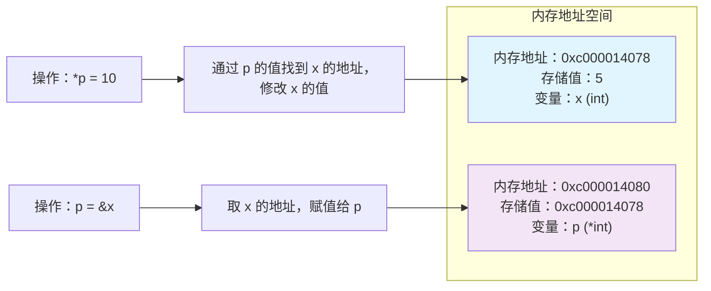
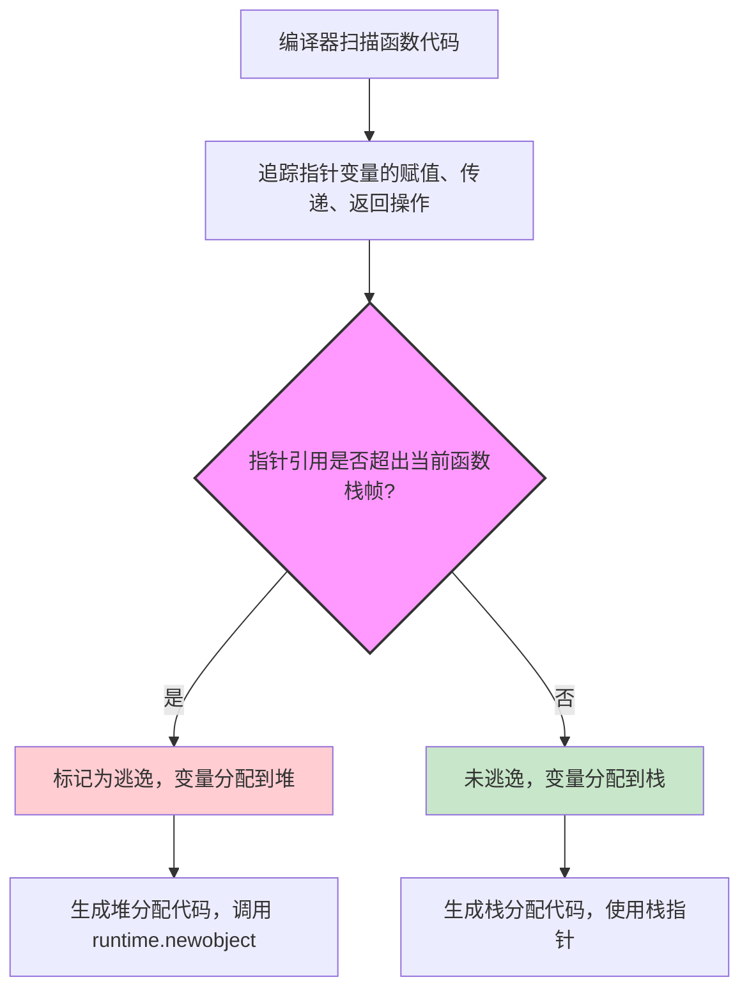
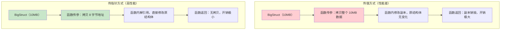
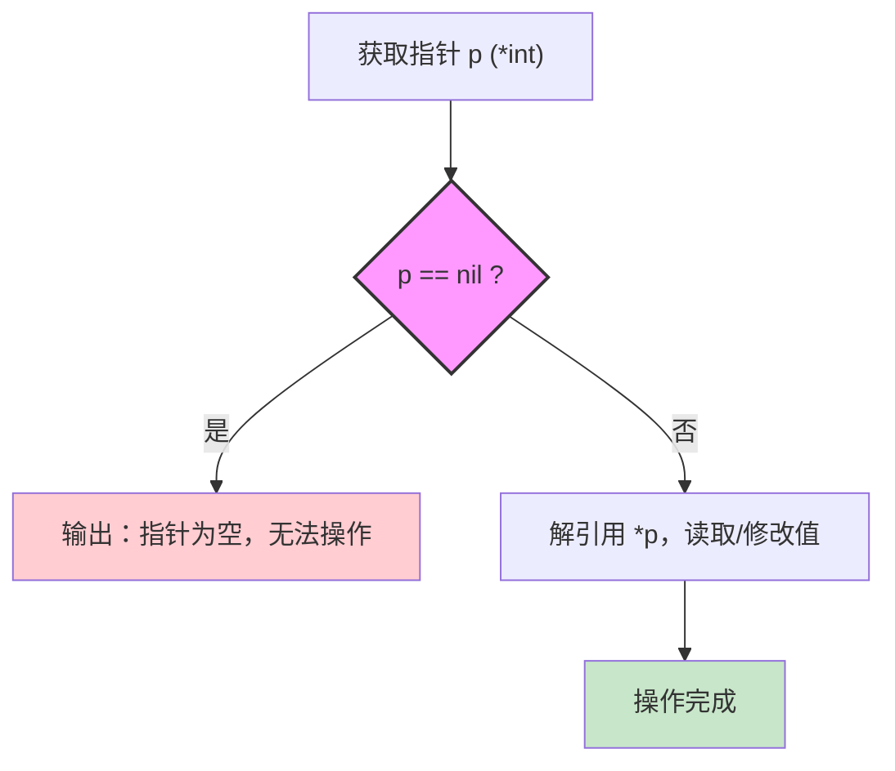
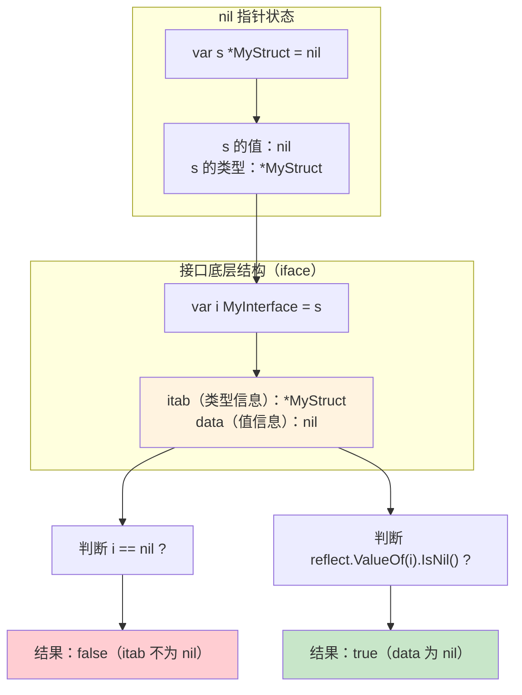

Go 语言保留了指针这一核心概念，但对 C/C++ 的指针做了简化和安全限制——既保留指针直接操作内存地址的优势，又避免野指针、指针算术等不安全操作。指针是 Go 实现引用传递、优化内存效率的核心。

---

## 一、指针的基础定义

### 1.1 指针的本质

指针是一个存储内存地址的变量，其值指向另一个变量在内存中的具体位置。

| 特性 | 说明 |
|------|------|
| 普通变量 | 存储值 |
| 指针变量 | 存储值的内存地址 |
| 指针大小 | 32 位系统 4 字节，64 位系统 8 字节，与指向的变量类型无关 |

### 1.2 核心语法

| 操作符 | 作用 | 示例 |
|--------|------|------|
| `&` | 取地址符：获取变量的内存地址 | `p := &x` |
| `*` | 解引用符：通过指针地址访问/修改指向的变量值 | `*p = 10` |
| `nil` | 指针的零值：表示指针未指向任何内存地址 | `var p *int = nil` |

### 1.3 基础示例

```go
package main

import "fmt"

func main() {
    var x int = 5
    fmt.Println("x 的值：", x)
    fmt.Println("x 的地址：", &x)

    var p *int = &x
    fmt.Println("p 的值（x 的地址）：", p)
    fmt.Println("p 指向的值：", *p)

    *p = 10
    fmt.Println("修改后 x 的值：", x)

    var nilP *int = nil
    fmt.Println("空指针：", nilP)
}
```

---

## 二、Go 指针的核心特性

Go 指针简化了 C/C++ 指针的复杂操作，同时增加了安全限制。

### 2.1 禁止指针算术

这是 Go 与 C/C++ 最核心的区别。C/C++ 支持指针加减，但 Go 明确禁止，避免野指针和越界访问。

```go
var x int = 5
var p *int = &x
// p++ // Go 编译失败：invalid operation: p++ (non-numeric type *int)
```

### 2.2 指针类型严格匹配

Go 不允许不同类型的指针相互转换（除非使用 `unsafe` 包），避免类型错误。

```go
var x int = 5
var p *int = &x
// var q *string = (*string)(p) // 编译报错
```

### 2.3 指针传递是值传递

Go 中所有参数传递都是值传递，指针也不例外——传递指针时，实际复制的是指针的副本，仍指向原变量地址。

```go
func modify(p *int) {
    *p = 20        // 通过指针副本修改原变量值
    p = nil        // 修改的是指针副本，不影响原指针
}

func main() {
    var x int = 10
    var p *int = &x
    modify(p)
    fmt.Println(x)  // 输出：20（原变量被修改）
    fmt.Println(p)  // 输出：0xc000014078（原指针未变）
}
```

### 2.4 逃逸分析保护

Go 编译器通过逃逸分析避免返回局部变量的指针（C/C++ 常见的悬垂指针问题）。

```go
func badPointer() *int {
    var x int = 10
    return &x // Go：x 逃逸到堆，安全
}

func main() {
    p := badPointer()
    fmt.Println(*p) // 输出：10（安全）
}
```

### 2.5 unsafe 包突破限制

Go 提供 `unsafe` 包用于底层内存操作，可绕过指针类型限制、进行指针算术，但非安全操作，生产环境慎用。

```go
package main

import (
    "fmt"
    "unsafe"
)

func main() {
    var x int = 0x12345678
    ptr := uintptr(unsafe.Pointer(&x))
    ptr += unsafe.Sizeof(x)
    newP := (*int)(unsafe.Pointer(ptr))
    fmt.Println(newP)
}
```

---

## 三、指针的核心使用场景

### 3.1 函数传参：避免值拷贝

当变量是大结构体/大切片时，传递指针可避免拷贝整个数据，提升性能。

```go
type BigStruct struct {
    data [1024 * 1024]int
}

func passValue(bs BigStruct) {
    bs.data[0] = 1
}

func passPointer(bs *BigStruct) {
    bs.data[0] = 1
}

func main() {
    var bs BigStruct
    passValue(bs)   // 拷贝 4MB 数据
    passPointer(&bs) // 拷贝 8 字节指针
}
```

### 3.2 修改函数外部变量

通过指针可以在函数内部修改外部变量的值。

```go
func swap(a, b *int) {
    *a, *b = *b, *a
}

func main() {
    x, y := 1, 2
    swap(&x, &y)
    fmt.Println(x, y) // 输出：2 1
}
```

### 3.3 实现可选返回值

指针的零值是 `nil`，可用于标识返回值不存在。

```go
type User struct {
    Name string
}

func findUser(id int) *User {
    users := map[int]User{1: {Name: "Alice"}}
    if u, ok := users[id]; ok {
        return &u
    }
    return nil
}

func main() {
    u := findUser(2)
    if u == nil {
        fmt.Println("用户不存在")
        return
    }
    fmt.Println(u.Name)
}
```

### 3.4 数据结构实现

指针是实现链表、树等复杂数据结构的核心。

```go
type ListNode struct {
    Val  int
    Next *ListNode
}

func main() {
    node1 := &ListNode{Val: 1}
    node2 := &ListNode{Val: 2}
    node1.Next = node2
    fmt.Println(node1.Next.Val) // 输出：2
}
```

### 3.5 与接口结合的特殊场景

需要注意：nil 指针实现接口后，接口本身不为 nil。

```go
type MyInterface interface {
    Do()
}

type MyStruct struct{}

func (m *MyStruct) Do() {}

func main() {
    var m *MyStruct = nil
    var i MyInterface = m
    fmt.Println(i == nil) // 输出：false
}
```

---

## 四、指针的底层原理

### 4.1 内存布局

```go
var x int = 5
var p *int = &x
```

内存布局示意图：



内存布局如下（地址为示例）：

| 变量 | 内存地址 | 存储值 | 说明 |
|------|----------|--------|------|
| x | 0xc000014078 | 5 | 普通变量存储值 |
| p | 0xc000014080 | 0xc000014078 | 指针变量存储地址 |

### 4.2 逃逸分析

Go 编译器通过逃逸分析决定变量分配在栈还是堆。

逃逸分析流程：



| 场景 | 逃逸结果 | 示例 |
|------|----------|------|
| 指针仅在函数内部使用 | 栈分配 | `func f() { var x int; p := &x }` |
| 指针被返回/传递到函数外部 | 堆分配 | `func f() *int { var x int; return &x }` |
| 指针存入全局变量/闭包 | 堆分配 | `var g *int; func f() { var x int; g = &x }` |

通过 `go build -gcflags="-m"` 查看逃逸分析结果：

```bash
go build -gcflags="-m" main.go
# 输出示例：./main.go:8:2: &x escapes to heap
```

### 4.3 GC 对指针的处理

Go GC 扫描堆内存时，通过指针追踪存活对象。

- 指针是 GC 识别对象被引用的核心依据
- 若对象无任何指针指向，则被判定为垃圾，由 GC 回收
- `unsafe.Pointer` 不会被 GC 识别为有效指针，可能导致对象被错误回收

---

## 五、最佳实践案例

### 5.1 大结构体传指针

业务中频繁传递大结构体，传值会拷贝整个结构体，性能低下。

```go
package main

import "fmt"

type BigStruct struct {
    Data [1024 * 1024 * 10]byte // 10MB
}

func processBigStruct(bs *BigStruct) {
    bs.Data[0] = 0x01 // 直接修改原结构体
}

func main() {
    var bs BigStruct
    processBigStruct(&bs)
    fmt.Println(bs.Data[0]) // 输出：1
}
```

大结构体传值 vs 传指针性能对比：



传指针仅拷贝 8 字节（64 位系统），且可直接修改原对象，效率提升数个数量级。

### 5.2 指针实现可选返回值

查询类函数需要区分"未找到数据"和"找到空数据"，指针的 `nil` 特性是最优解。

```go
package main

import "fmt"

type User struct {
    ID   int
    Name string
}

func queryUserByID(id int) *User {
    users := map[int]User{
        1: {ID: 1, Name: "Alice"},
        2: {ID: 2, Name: "Bob"},
    }
    if u, ok := users[id]; ok {
        return &u
    }
    return nil
}

func main() {
    u1 := queryUserByID(1)
    if u1 != nil {
        fmt.Printf("找到用户：%+v\n", u1)
    }

    u2 := queryUserByID(3)
    if u2 == nil {
        fmt.Println("未找到用户")
    }
}
```

相比"返回值 + bool"，指针方案更简洁，且避免零值混淆。

### 5.3 指针实现链表结构

实现单链表的增删改查，指针是关联节点的核心。

```go
package main

import "fmt"

type ListNode struct {
    Val  int
    Next *ListNode
}

func appendNode(head *ListNode, val int) *ListNode {
    newNode := &ListNode{Val: val}
    if head == nil {
        return newNode
    }
    cur := head
    for cur.Next != nil {
        cur = cur.Next
    }
    cur.Next = newNode
    return head
}

func main() {
    var head *ListNode
    head = appendNode(head, 1)
    head = appendNode(head, 2)
    head = appendNode(head, 3)

    cur := head
    for cur != nil {
        fmt.Printf("%d -> ", cur.Val)
        cur = cur.Next
    }
    fmt.Println("nil")
}
```

指针是实现链式结构的唯一方式，通过 `Next *ListNode` 关联节点，形成线性/树形结构。

### 5.4 指针修改函数外部变量

实现交换两个整数的函数，指针是 Go 中修改外部变量的唯一合法方式。

```go
package main

import "fmt"

func swap(a, b *int) {
    *a, *b = *b, *a
}

func main() {
    x, y := 1, 2
    swap(&x, &y)
    fmt.Println(x, y) // 输出：2 1
}
```

Go 是值传递语言，函数参数默认拷贝副本，指针传递的是地址副本，解引用可直接修改原变量。

### 5.5 指针配合 sync.Pool 复用大对象

高频创建大对象，用指针复用对象，降低 GC 开销。

```go
package main

import (
    "sync"
    "fmt"
)

type BigBuffer struct {
    Data []byte
}

var bufferPool = sync.Pool{
    New: func() interface{} {
        return &BigBuffer{Data: make([]byte, 64*1024)}
    },
}

func processData(data []byte) {
    buf := bufferPool.Get().(*BigBuffer)
    defer func() {
        buf.Data = buf.Data[:0]
        bufferPool.Put(buf)
    }()

    copy(buf.Data, data)
    fmt.Printf("处理数据长度：%d\n", len(buf.Data))
}

func main() {
    for i := 0; i < 1000; i++ {
        processData(make([]byte, 1024))
    }
}
```

`sync.Pool` 存储指针而非值，避免对象拷贝。复用大对象指针，减少堆内存分配次数，降低 GC 扫描/回收压力。

---

## 六、典型错误场景与修复

### 6.1 解引用 nil 指针

#### 错误代码

```go
func main() {
    var p *int = nil
    *p = 10 // panic
}
```

#### 错误原因

`nil` 指针指向内存地址 `0x0`，解引用触发段错误，Go 运行时捕获并抛出 panic。

#### 修复方案

解引用前必须判空：

```go
func main() {
    var p *int = nil
    if p == nil {
        fmt.Println("指针为空")
        return
    }
    *p = 10
}
```

nil 指针判空流程：



### 6.2 误解指针传递为引用传递

#### 错误代码

```go
func modifyPointer(p *int) {
    newVal := 10
    p = &newVal // 修改指针副本
}

func main() {
    x := 5
    p := &x
    modifyPointer(p)
    fmt.Println(*p) // 输出：5
}
```

#### 错误原因

Go 中所有传递都是值传递，指针传递的是地址的副本。函数内修改指针副本仅改变副本的指向。

修改指针副本 vs 修改指向的值对比：

```mermaid
graph TD
    subgraph "错误用法：修改指针副本"
        A["main 函数：x=5，p=&x"] --> B["调用 modify(p)"]
        B --> C["函数内：p = &newVal（newVal=10）"]
        C --> D["修改的是指针副本，原 p 仍指向 x"]
        D --> E["main 函数：*p=5（无变化）"]
    end

    subgraph "正确用法：修改指针指向的值"
        F["main 函数：x=5，p=&x"] --> G["调用 modify(p)"]
        G --> H["函数内：*p = 10（解引用修改 x）"]
        H --> I["原 x 的值被修改为 10"]
        I --> J["main 函数：*p=10（修改成功）"]
    end

    style C fill:#ffcdd2
    style H fill:#c8e6c9
    style E fill:#ffcdd2
    style J fill:#c8e6c9
```



#### 修复方案

修改指针指向的值（解引用）：

```go
func modifyPointer(p *int) {
    *p = 10
}

func main() {
    x := 5
    p := &x
    modifyPointer(p)
    fmt.Println(*p) // 输出：10
}
```

### 6.3 接口中的 nil 指针判空错误

#### 错误代码

```go
type MyInterface interface {
    Do()
}

type MyStruct struct{}

func (m *MyStruct) Do() {}

func checkNil(i MyInterface) {
    if i == nil {
        fmt.Println("接口为空")
    } else {
        fmt.Println("接口不为空")
    }
}

func main() {
    var m *MyStruct = nil
    checkNil(m) // 输出：接口不为空
}
```

#### 错误原因

接口的底层结构包含类型信息和值信息。当 nil 指针赋值给接口时，值信息为 nil，但类型信息为 `*MyStruct`，因此接口本身不为 nil。

接口中 nil 指针的底层结构与判空逻辑：



#### 修复方案

使用 `reflect` 包检查接口的动态值：

```go
import (
    "reflect"
)

func checkNil(i MyInterface) {
    if i == nil || reflect.ValueOf(i).IsNil() {
        fmt.Println("接口的动态值为空")
    }
}
```

### 6.4 滥用 unsafe 包导致内存越界

#### 错误代码

```go
func main() {
    arr := [2]int{1, 2}
    p := &arr[0]
    ptr := uintptr(unsafe.Pointer(p)) + unsafe.Sizeof(arr[0])*2
    newP := (*int)(unsafe.Pointer(ptr))
    *newP = 3 // 未定义行为
}
```

#### 错误原因

`unsafe` 包绕过 Go 的类型和内存安全检查，指针算术易导致越界访问，可能修改其他变量的内存。

#### 修复方案

禁止用 `unsafe` 做指针算术，改用数组/切片的合法索引访问。仅在底层优化时慎用 `unsafe`。

### 6.5 返回栈指针依赖逃逸分析

#### 错误代码

```go
func badReturnPointer() *int {
    var x int = 10
    return &x
}
```

#### 错误原因

虽然 Go 的逃逸分析会将局部变量逃逸到堆，但依赖编译器优化的代码不健壮。

#### 修复方案

显式分配堆内存：

```go
func goodReturnPointer() *int {
    return &int{10}
}
```

---

## 七、底层实现原理深度解析

### 7.1 硬件层基础

指针的底层依赖 CPU 的内存寻址能力。

#### 内存地址的本质

计算机内存是线性的字节数组，每个字节都有唯一的物理地址/虚拟地址。

- 64 位系统的虚拟地址空间为 `0x0000000000000000` ~ `0xffffffffffffffff`（8 字节）
- 32 位系统为 `0x00000000` ~ `0xffffffff`（4 字节）

#### 指针的硬件级操作

CPU 通过地址总线访问内存地址。

| 指令 | 作用 | 对应 Go 操作 |
|------|------|--------------|
| `MOV rax, [rbx]` | 将地址指向的内存值加载到寄存器 | 解引用 `*p` |
| `MOV [rbx], rax` | 将寄存器值写入地址指向的内存 | `*p = val` |

Go 指针的汇编级实现：

```go
func main() {
    x := 5
    p := &x
    *p = 10
}
```

编译为 64 位汇编：

```asm
TEXT main.main(SB), $8-0
    MOVQ $5, 0x8(SP)              // x := 5
    LEAQ 0x8(SP), AX              // AX = &x
    MOVQ AX, 0x0(SP)              // p = AX
    MOVQ 0x0(SP), BX              // BX = p
    MOVQ $10, (BX)                // *(BX) = 10
    RET
```

### 7.2 编译器层实现

Go 编译器对指针做了严格的安全约束和优化。

#### 类型系统约束

Go 编译器在编译期对指针类型做强校验，禁止跨类型转换（除非用 `unsafe`）。

#### 禁止指针算术

Go 编译器在语法分析阶段直接拦截指针算术操作，判定为非数值类型的算术运算，抛出编译错误。

#### 逃逸分析实现

编译器通过数据流分析构建变量的引用图。

1. 从函数入口开始，追踪每个指针变量的赋值、传递、返回操作
2. 若指针的引用超出当前函数栈帧，则标记为逃逸
3. 逃逸的变量在堆上分配，非逃逸的在栈上分配

### 7.3 运行时层实现

Go 运行时对指针的管理主要体现在内存分配、GC 追踪、nil 指针处理三个方面。

#### 栈上分配

栈分配由编译器直接生成汇编指令，使用栈指针分配内存，无运行时开销。

#### 堆上分配

堆分配调用 `runtime.newobject` 函数，底层依赖 Go 的内存分配器（TCMalloc 变种）。

```go
func newobject(typ *_type) unsafe.Pointer {
    return mallocgc(typ.size, typ, true)
}
```

#### GC 可达性分析

Go GC 是追踪式垃圾回收，指针是 GC 识别存活对象的核心依据。

1. 根对象扫描：扫描根指针（全局指针、栈上指针、寄存器中的指针）
2. 递归追踪：从根指针出发，递归扫描所有可达的指针，标记对象为存活
3. 垃圾回收：未被标记的对象判定为垃圾，由 GC 释放内存

#### nil 指针实现

Go 中 `nil` 指针的底层值是 `0x0`，该地址属于内核空间，用户态程序无访问权限。解引用 nil 指针时，CPU 会触发段错误（SIGSEGV），Go 运行时捕获该信号，转为 panic。

#### 指针与接口的底层交互

接口的底层结构：

```go
type iface struct {
    tab  *itab            // 类型信息
    data unsafe.Pointer   // 值信息（指针地址）
}
```

当 nil 指针赋值给接口时，`data = nil`，但 `tab` 指向类型信息，因此接口不为 nil。

### 7.4 unsafe 包底层实现

#### unsafe.Pointer

通用指针类型，可转换为任意类型的指针，GC 会将其视为有效指针。

#### uintptr

无类型的整数类型，存储内存地址，可进行算术运算，GC 完全忽略。

---

## 八、核心总结

| 核心维度 | 关键结论 |
|----------|----------|
| 本质 | 存储内存地址的变量，Go 禁止指针算术、严格类型匹配，比 C/C++ 更安全 |
| 传递方式 | 所有传递都是值传递，指针传递的是地址的副本 |
| 核心场景 | 大对象传参、修改外部变量、实现复杂数据结构、可选返回值 |
| 内存管理 | 逃逸分析决定变量分配栈/堆，GC 通过指针追踪存活对象 |
| 最佳实践 | 大对象传指针、小对象传值，解引用前判空，慎用 unsafe 包 |
| 常见错误 | 解引用 nil 指针、误解指针传递为引用传递、忽略接口中的 nil 指针 |

Go 指针是简化版的 C 指针——保留了核心优势，规避了不安全操作，是 Go 实现高性能、低内存开销的关键。

### 指针使用口诀

大对象传指针，小对象传值；解引用先判空，修改值不解引用指针；nil 指针别乱用，unsafe 包慎使用。
