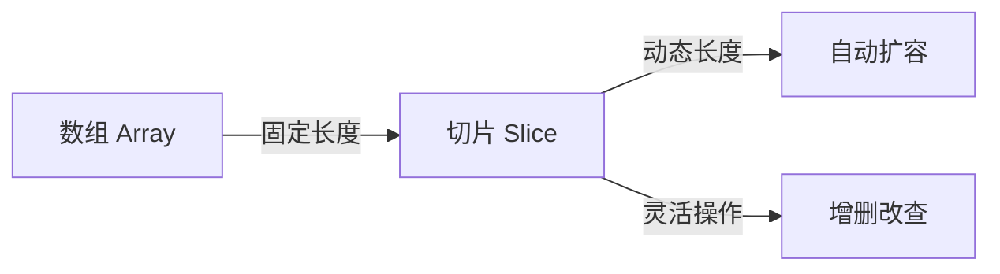
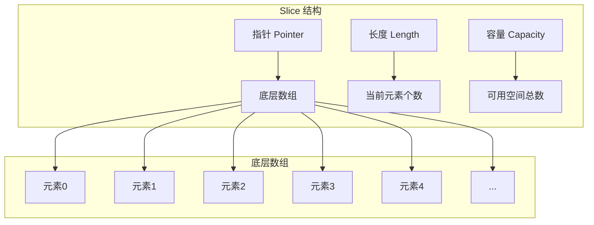
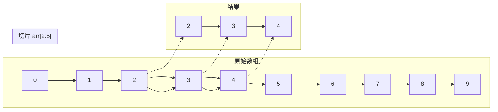
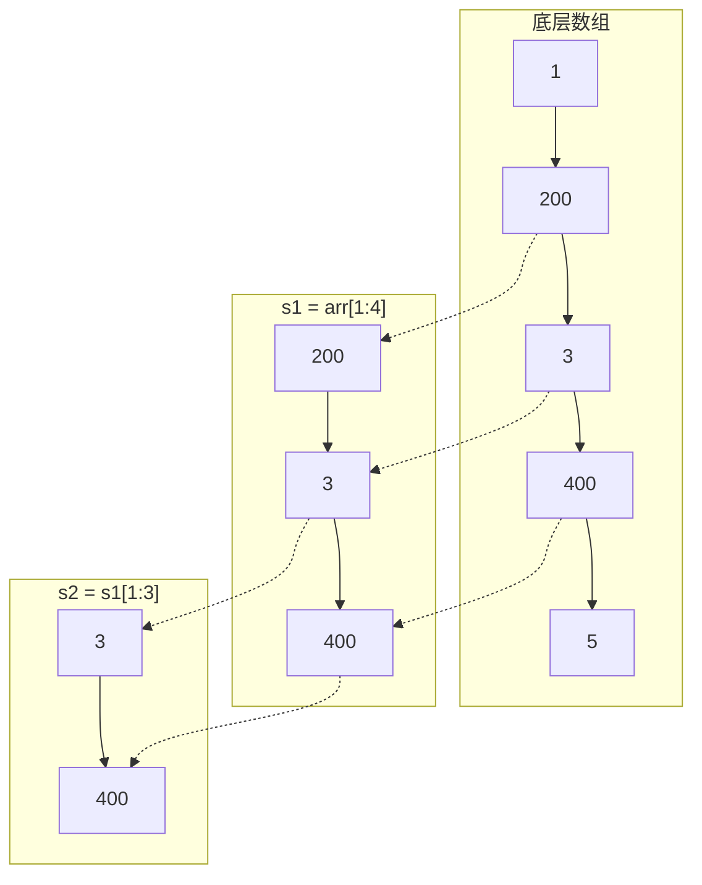
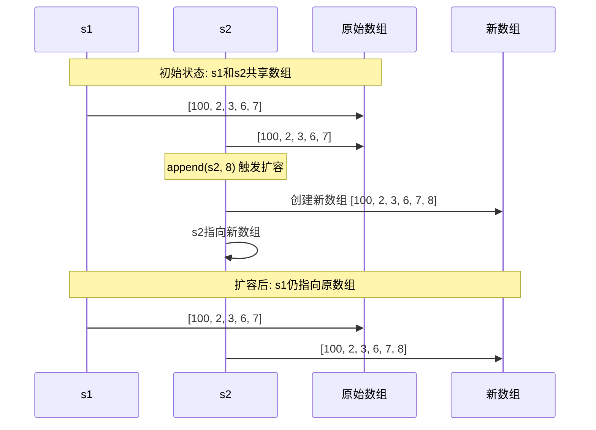
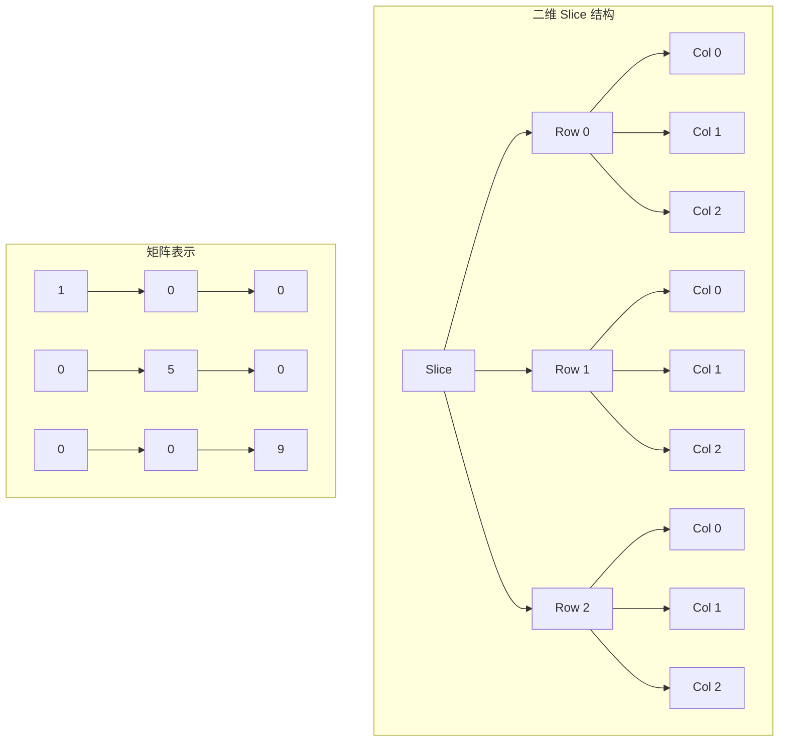

## 1. Slice 基础概念

### 什么是 Slice？

`slice`（切片）是 Go 中最常用、最灵活的数据结构之一。你可以把它理解为一个**动态数组**，它提供了比数组（array）更强大、更方便的功能。



### Slice 的底层结构

`slice` 是一个指向底层数组的**视图（View）**或**窗口（Window）**。它本身不存储数据，而是描述了底层数组的一段连续部分。

一个 `slice` 由三个部分组成：
*   **指针 (Pointer):** 指向底层数组的起始位置。
*   **长度 (Length):** `slice` 中当前元素的个数（`len()`）。
*   **容量 (Capacity):** 从 `slice` 的起始位置到底层数组末尾的元素总数（`cap()`）。



```go
// slice 的内部结构示意
type slice struct {
    array unsafe.Pointer // 指向底层数组
    len   int            // 长度
    cap   int            // 容量
}
```

### 为什么需要 Slice？

Go 的数组（array）有一个很大的限制：**长度是固定的**。一旦声明，长度就不能改变。

```go
var arr [5]int // 一个长度为 5 的 int 数组，它的长度永远是 5
```

这在很多场景下非常不灵活。比如，你无法预先知道需要存储多少个用户数据。`slice` 正是为了解决这个问题而生，它提供了**动态增长**的能力。

---

## 2. Slice 的创建方式

有三种主要的方式来创建一个 `slice`：

### 方式一：使用字面量

这是最直观的方式。

```go
// 创建一个包含 3 个元素的 slice，长度和容量都是 3
s1 := []int{1, 2, 3}
fmt.Printf("s1: %v, len: %d, cap: %d\n", s1, len(s1), cap(s1))
// 输出: s1: [1 2 3], len: 3, cap: 3
```

### 方式二：使用 `make` 函数（推荐）

`make` 函数是创建 `slice` 的标准方式，它可以显式地指定长度和容量。

```go
// make([]Type, length, capacity)
// 创建一个长度为 2，容量为 5 的 int slice
// 底层数组会被初始化为零值（对于 int 来说是 0）
s2 := make([]int, 2, 5)
fmt.Printf("s2: %v, len: %d, cap: %d\n", s2, len(s2), cap(s2))
// 输出: s2: [0 0], len: 2, cap: 5
```

*   **长度 (length):** 决定了 `slice` 初始有多少个元素可以访问。`s2[0]` 和 `s2[1]` 是合法的，但 `s2[2]` 会 panic。
*   **容量 (capacity):** 决定了底层数组的大小。它必须大于或等于长度。

### 方式三：通过截取数组或其他 Slice 创建

这是 `slice` 最强大的特性之一。

```go
arr := [10]int{0, 1, 2, 3, 4, 5, 6, 7, 8, 9}
// 从索引 2 开始，到索引 5（不包含）结束
// 语法: slice[start:end]
s3 := arr[2:5] 
fmt.Printf("s3: %v, len: %d, cap: %d\n", s3, len(s3), cap(s3))
// 输出: s3: [2 3 4], len: 3, cap: 8
// 解释: len = end - start = 5 - 2 = 3
//      cap = 数组总长度 - start = 10 - 2 = 8
```



---

## 3. Slice 的基本操作

### 增 (Append)

使用内置的 `append` 函数向 `slice` 末尾添加元素。**注意：必须将 `append` 的返回值重新赋值给原 `slice` 变量**，因为当底层数组容量不足时，`append` 会创建一个新的底层数组并返回指向它的新 `slice`。

```go
s := []int{1, 2}
s = append(s, 3)      // s 变为 [1, 2, 3]
s = append(s, 4, 5)   // s 变为 [1, 2, 3, 4, 5]
// 也可以 append 另一个 slice
anotherSlice := []int{6, 7}
s = append(s, anotherSlice...) // ... 是解包操作符
fmt.Println(s) // 输出: [1 2 3 4 5 6 7]
```

### 删 (Delete)

Go 没有提供直接删除 `slice` 元素的内置函数，但可以通过**切片**和**`append` 组合**来实现。

**删除指定索引 `i` 的元素：**
原理是将 `i` 前面的部分和 `i` 后面的部分拼接起来。

```go
s := []int{1, 2, 3, 4, 5}
i := 2 // 要删除索引为 2 的元素 (值为 3)
// 将 s[:i] 和 s[i+1:] 拼接
s = append(s[:i], s[i+1:]...)
fmt.Println(s) // 输出: [1 2 4 5]
```

> **注意：** 这种操作会修改原 `slice` 的底层数组。如果有其他 `slice` 也指向这个底层数组，它们的值也可能被意外修改。

### 改 (Modify)

直接通过索引赋值即可。

```go
s := []string{"a", "b", "c"}
s[1] = "x"
fmt.Println(s) // 输出: [a x c]
```

### 查 (Access)

直接通过索引访问。

```go
s := []string{"a", "b", "c"}
element := s[0] // element 的值是 "a"
```

访问越界（`index >= len(s)`）会导致 `panic`。

---

## 4. Slice 的遍历

最常用的方式是使用 `for range` 循环。

```go
fruits := []string{"apple", "banana", "cherry"}
for index, value := range fruits {
    fmt.Printf("Index: %d, Value: %s\n", index, value)
}
// 如果你只关心值，可以用 _ 忽略索引
for _, value := range fruits {
    fmt.Println("Value:", value)
}
// 也可以使用传统的 for 循环
for i := 0; i < len(fruits); i++ {
    fmt.Println("Value:", fruits[i])
}
```

---

## 5. Slice 的截取与共享底层数组

这是 `slice` 一个非常重要且容易出错的特性。当你从一个 `slice` 或数组中截取另一个 `slice` 时，它们**共享同一个底层数组**。

```go
arr := [5]int{1, 2, 3, 4, 5}
s1 := arr[1:4] // s1 = [2, 3, 4], len=3, cap=4
// 修改 s1 会影响到原始数组 arr
s1[0] = 200
fmt.Println(s1) // 输出: [200 3 4]
fmt.Println(arr) // 输出: [1 200 3 4 5]
// 从 s1 再截取一个 s2
s2 := s1[1:3] // s2 = [3, 4], len=2, cap=3
s2[1] = 400
fmt.Println(s2) // 输出: [3 400]
fmt.Println(s1) // 输出: [200 3 400]
fmt.Println(arr) // 输出: [1 200 3 400 5]
```



> **结论：** 多个 `slice` 可以共享同一个底层数组。对其中一个的修改会影响到其他所有共享该数组的 `slice`。只有当 `append` 操作导致扩容时，新的 `slice` 才会指向一个全新的底层数组，从而与原 `slice` 分离。

---

## 6. Slice 的扩容机制

### 触发扩容的时机

扩容的唯一触发时机就是：**当 `slice` 的长度 `len` 即将超过其容量 `cap` 时**。

在 Go 语言中，最常见的操作就是使用内置的 `append` 函数向 `slice` 中添加元素。

```go
s := make([]int, 3, 5) // len=3, cap=5
// 底层数组: [0, 0, 0, _, _]
s = append(s, 10, 20)
// 此时 len=5, cap=5，还未触发扩容
s = append(s, 30)
// 此时 len 即将变为 6，超过了 cap 5，触发扩容！
```

### 扩容的具体策略

当扩容被触发时，Go 会创建一个**新的、更大的底层数组**，然后将旧数组中的元素**拷贝**到新数组中，最后让 `slice` 的指针指向这个新数组。

**新容量的计算规则**是扩容机制的核心，它根据旧容量的大小分为两种情况：

| 旧容量 | 扩容策略 | 说明 |
|--------|----------|------|
| &lt; 1024 | `newCap = oldCap * 2` | 快速增长策略，通过加倍来减少频繁扩容的开销 |
| ≥ 1024 | `newCap = oldCap * 1.25` | 保守增长策略，避免一次性分配过多内存 |

**举个例子：**

```go
// 示例 1: oldCap < 1024
s1 := make([]int, 0, 4) // len=0, cap=4
s1 = append(s1, 1, 2, 3, 4) // len=4, cap=4 (未扩容)
s1 = append(s1, 5)          // len 即将变为 5 > cap 4，触发扩容
// newCap = 4 * 2 = 8
// 现在 s1 的 len=5, cap=8

// 示例 2: oldCap >= 1024
s2 := make([]int, 0, 1024) // len=0, cap=1024
s2 = append(s2, make([]int, 1024)...) // len=1024, cap=1024 (未扩容)
s2 = append(s2, 1)                    // len 即将变为 1025 > cap 1024，触发扩容
// newCap = 1024 * 1.25 = 1280
// 现在 s2 的 len=1025, cap=1280
```

### 一次性添加多个元素的扩容策略

当使用 `append` 一次性添加多个元素时，Go 的扩容策略会更加智能。如果添加的元素数量超过了当前容量，Go 会确保新容量至少能够容纳所有元素。

**处理规则：**

1. 首先计算所需的最小容量：`minCap = oldLen + numElements`
2. 按照常规扩容策略计算新容量：`newCap = oldCap * growthFactor`
3. 如果 `newCap < minCap`，则将 `newCap` 调整为 `minCap`

**举个例子：**

```go
// 示例：一次性添加多个元素
s := make([]int, 3, 5) // len=3, cap=5
fmt.Printf("初始: len=%d, cap=%d\n", len(s), cap(s))

// 一次性添加 4 个元素，超过了当前容量
s = append(s, 10, 20, 30, 40)
fmt.Printf("添加后: len=%d, cap=%d\n", len(s), cap(s))
```

在这个例子中：
- 初始状态：`len=3`, `cap=5`
- 要添加 4 个元素，最终长度将是 `3 + 4 = 7`
- 按常规扩容策略：`newCap = 5 * 2 = 10`
- 因为 `10 >= 7`，所以最终容量是 `10`

**再看一个极端例子：**

```go
// 示例：添加大量元素
s := make([]int, 2, 4) // len=2, cap=4
fmt.Printf("初始: len=%d, cap=%d\n", len(s), cap(s))

// 一次性添加 100 个元素
s = append(s, make([]int, 100)...)
fmt.Printf("添加后: len=%d, cap=%d\n", len(s), cap(s))
```

在这个例子中：
- 初始状态：`len=2`, `cap=4`
- 要添加 100 个元素，最终长度将是 `2 + 100 = 102`
- 按常规扩容策略：`newCap = 4 * 2 = 8`
- 因为 `8 < 102`，所以将 `newCap` 调整为 `102`
- 但 Go 还会进行内存对齐，最终容量可能会是 `104` 或 `112` 等

这种策略确保了无论一次性添加多少元素，`slice` 都有足够的容量来存储它们，避免了多次扩容的开销。

### 扩容过程中的内存拷贝

扩容不仅仅是计算新容量，还涉及到**内存的分配和拷贝**。

1.  **分配新内存：** Go 运行时会根据计算出的 `newCap` 分配一块新的、连续的内存区域来存放新的底层数组。
2.  **拷贝数据：** 使用 `memmove` 等高效的内存拷贝函数，将旧数组中的所有元素复制到新数组的开头。
3.  **更新 `slice` 头：** `slice` 的指针指向新数组，`len` 增加，`cap` 更新为 `newCap`。
4.  **（可选）旧内存回收：** 旧的底层数组如果不再被任何其他 `slice` 引用，将会被垃圾回收（GC）。

这个过程是有性能开销的，尤其是当 `slice` 非常大时，拷贝大量数据会比较耗时。

### 扩容策略的演进（Go 1.18 的变化）

在 Go 1.18 版本之前，扩容策略就是我们上面讲的简单的"小于1024则翻倍，大于等于1024则1.25倍"。

但是，从 **Go 1.18** 开始，扩容策略变得更加精细，主要是为了**减少内存浪费**。新的策略在计算出 `newCap` 后，还会进行一步**内存对齐 (memory alignment)** 的调整。

**新策略的大致逻辑是：**

1.  首先，按照旧的规则（&lt;1024 则 *2，>=1024 则 *1.25）计算出一个**候选容量**。
2.  然后，将这个候选容量向上**舍入到下一个内存页大小的整数倍**（或某个预定义的规格）。

**为什么这么做？**
因为内存分配器（如 `TCMalloc`）通常会分配特定大小的内存块（例如 8, 16, 32, 64, 128, 256, 512, 1024, 2048... 字节）。如果 `slice` 的底层数组大小不是这些规格的整数倍，就会产生一些无法被充分利用的"碎块"内存，造成浪费。

通过内存对齐，Go 可以确保分配的内存块被充分利用，从而提高整体的内存效率。

**示例（Go 1.18+）：**
假设一个 `slice` 的元素是 `struct{ a, b int64 }`，每个元素占 16 字节。

*   旧容量 `oldCap` 为 100，`len` 即将超过 `cap`。
*   按旧规则计算：`newCap = 100 * 2 = 200`。
*   需要的内存是 `200 * 16 = 3200` 字节。
*   在 Go 1.18+ 中，内存分配器可能会发现 3200 字节不是一个标准的块大小，而 4096 字节（4KB，一个常见的内存页大小）是。
*   因此，它可能会直接分配 4096 字节的内存。
*   新的容量就变成了 `4096 / 16 = 256`。

所以，在 Go 1.18+ 之后，你可能会观察到 `slice` 扩容后的容量不再是严格的 2 倍或 1.25 倍，而是一个更大的、符合内存规格的整数。

### 与 `append` 的关系及注意事项

`append` 是使用 `slice` 的核心函数，理解它和扩容的关系至关重要。

**关键点 1：`append` 可能返回新的 `slice`**
`append` 函数在执行时，如果不需要扩容，它会直接在原底层数组上进行修改，并返回一个指向**原底层数组**但 `len` 加一的新 `slice`。如果需要扩容，它会创建新数组、拷贝数据，并返回一个指向**新底层数组**的 `slice`。

**关键点 2：必须用 `slice = append(slice, elem)` 的形式**
因为 `append` 可能会返回一个全新的 `slice`（指向新地址），所以你**必须**将 `append` 的返回值重新赋值给原始的 `slice` 变量，否则你将丢失对新底层数组的引用，并且原 `slice` 的 `len` 和 `cap` 也不会改变。

```go
s := []int{1, 2, 3} // len=3, cap=3
append(s, 4)        // 错误用法！
// s 的 len 和 cap 仍然是 3，因为你没有接收返回值
s = append(s, 4)    // 正确用法
// s 现在指向一个新的、容量为 6 的底层数组，len=4, cap=6
```

**关键点 3：警惕"别名"问题**
多个 `slice` 可能指向同一个底层数组。修改其中一个 `slice` 的元素，可能会影响到其他 `slice`。扩容会切断这种联系。

```go
s1 := []int{1, 2, 3, 4, 5} // len=5, cap=5
s2 := s1[:3]                // len=3, cap=5。s2 和 s1 共享底层数组
s2[0] = 100
fmt.Println(s1) // 输出: [100 2 3 4 5]，s1 也被改变了！
// 现在对 s2 进行 append，触发扩容
s2 = append(s2, 6, 7) // len=3+2=5，未超过 cap 5，不扩容
// 此时 s2 的 len=5, cap=5。它仍然和 s1 共享底层数组
// s2[3] = 6, s2[4] = 7
fmt.Println(s1) // 输出: [100 2 3 6 7]，s1 再次被改变！
// 再次 append s2，触发扩容
s2 = append(s2, 8) // len 即将变为 6 > cap 5，触发扩容
// s2 现在指向一个新的、容量为 10 的底层数组
// s1 仍然指向原来的旧数组
s2[0] = 200
fmt.Println(s2) // 输出: [200 2 3 6 7 8 ...]
fmt.Println(s1) // 输出: [100 2 3 6 7]，s1 不再受影响
```



---

## 7. 多维 Slice

`slice` 可以包含任何类型，包括其他 `slice`，从而构成多维 `slice`（例如，二维 `slice` 可以用来表示矩阵或表格）。

```go
// 创建一个 3x3 的二维 slice
matrix := make([][]int, 3)
for i := range matrix {
    matrix[i] = make([]int, 3)
}
// 赋值
matrix[0][0] = 1
matrix[1][1] = 5
matrix[2][2] = 9
// 遍历
for _, row := range matrix {
    for _, val := range row {
        fmt.Printf("%d ", val)
    }
    fmt.Println()
```



---

## 8. Slice 的常用内置函数

| 函数 | 功能描述 | 示例 |
|------|----------|------|
| `len(s []Type) int` | 返回 `slice` 的长度 | `len(s)` |
| `cap(s []Type) int` | 返回 `slice` 的容量 | `cap(s)` |
| `append(s []Type, elems ...Type) []Type` | 向 `slice` 末尾添加元素，并返回新的 `slice` | `s = append(s, 1, 2)` |
| `copy(dst, src []Type) int` | 将源 `slice` `src` 的元素复制到目标 `slice` `dst` 中 | `copy(dst, src)` |

```go
src := []int{1, 2, 3, 4}
dst := make([]int, 2)
n := copy(dst, src) // 只会复制 src 的前 2 个元素
fmt.Println("dst:", dst) // 输出: dst: [1 2]
fmt.Println("n:", n)     // 输出: n: 2
```

---

## 9. Slice 的性能考量与最佳实践

### 1. 预估容量，避免扩容

如果预先知道 `slice` 大概会有多少个元素，在使用 `make` 创建时就指定合适的容量。这可以避免多次扩容带来的内存分配和数据拷贝开销。

```go
// 假设我们知道最终会有 1000 个元素
// 推荐做法
s := make([]int, 0, 1000) 
// 不推荐做法
var s []int // len=0, cap=0，会经历多次扩容
```

### 2. 注意"内存泄漏"

当你从一个非常大的 `slice` 中截取一小段时，新的小 `slice` 仍然会引用整个大的底层数组。这会导致整个大数组都无法被垃圾回收（GC），即使你只需要其中一小部分。

**解决方案：** 如果需要长期保存截取的小 `slice`，应该将其复制到一个新的 `slice` 中。

```go
largeSlice := make([]int, 10000)
// ... 填充数据 ...
// bad: smallSlice 仍然引用着整个 largeSlice 的底层数组
smallSlice := largeSlice[9990:10000] 
// good: 创建一个新的底层数组，只保存需要的数据
newSmallSlice := make([]int, 0, 10)
newSmallSlice = append(newSmallSlice, smallSlice...)
```

---

## 10. Slice 进阶主题

### 1. `slice` 的底层实现与源码剖析

我们之前提到了 `slice` 的内部结构是一个包含 `array` 指针、`len` 和 `cap` 的结构体。在 Go 的源码中，这个定义位于 `src/runtime/slice.go` 文件中。

```go
// src/runtime/slice.go
type slice struct {
    array unsafe.Pointer // 指向底层数组的指针
    len   int            // 长度
    cap   int            // 容量
}
```

理解这个源码级别的定义至关重要，因为：
*   **它解释了为什么 `slice` 是引用类型**：当你传递一个 `slice` 时，你传递的是这个 `slice` 结构体的一个副本。这个副本仍然指向**同一个底层数组**，所以修改副本指向的数组内容会影响原始 `slice`。
*   **它解释了扩容的本质**：扩容就是重新分配一块更大的内存给 `array` 指针，并更新 `len` 和 `cap`。

扩容的核心逻辑也在 `slice.go` 的 `growslice` 函数中。这个函数非常复杂，它精确地计算了新容量，并处理了内存分配和数据拷贝。

### 2. `slice` 作为函数参数的传递机制

这是一个非常经典的面试题，也是初学者容易混淆的地方。

**核心结论：`slice` 在 Go 中是按值传递的，但它的值是一个"描述符"（包含指针、len、cap）。**

这意味着：
*   **函数内部可以修改 `slice` 的底层数组元素**：因为传递的 `slice` 副本中的 `array` 指针和原始 `slice` 指向同一个地址。
*   **函数内部无法修改原始 `slice` 的 `len` 和 `cap`**：因为函数接收的是 `len` 和 `cap` 的副本。如果你在函数内部对 `slice` 进行 `append` 导致扩容，函数内的 `slice` 变量会指向新的底层数组，但**调用者的原始 `slice` 变量完全不受影响**。

**示例代码：**

```go
package main
import "fmt"
func modifyElements(s []int) {
    // 可以修改底层数组的元素
    s[0] = 100
    fmt.Println("Inside modifyElements, after modifying element:", s) // [100 2 3]
}
func appendElements(s []int) {
    // 这里的 s 是一个副本
    s = append(s, 4)
    fmt.Println("Inside appendElements, after appending:", s) // [1 2 3 4]
}
func main() {
    s1 := []int{1, 2, 3}
    modifyElements(s1)
    fmt.Println("After modifyElements, s1:", s1) // [100 2 3] - 被修改了
    s2 := []int{1, 2, 3}
    appendElements(s2)
    fmt.Println("After appendElements, s2:", s2) // [1 2 3] - 没有被修改
}
```

### 3. `slice` 与 `interface{}` 的关系及类型断言

`slice` 可以被赋值给 `interface{}` 变量，因为 `interface{}` 可以容纳任何类型。但是，当你需要从 `interface{}` 中恢复原始的 `slice` 类型时，需要进行类型断言。

```go
var data interface{} = []int{1, 2, 3}
// 错误的方式：这样会 panic，因为 data 不是 []int 类型，而是 interface{}
// fmt.Println(data[0]) 
// 正确的方式：先进行类型断言
if intSlice, ok := data.([]int); ok {
    fmt.Println(intSlice[0]) // 输出: 1
}
```

### 4. `slice` 的"零值"与 `nil` `slice` 的区别

在 Go 中，`slice` 有一个零值，即 `nil`。一个 `nil` `slice` 的长度和容量都是 0，并且它没有指向任何底层数组。

```go
var s []int // s 是 nil slice
fmt.Println(s == nil) // true
fmt.Println(len(s), cap(s)) // 0 0
// 空 slice（非 nil）
s2 := []int{} 
fmt.Println(s2 == nil) // false
fmt.Println(len(s2), cap(s2)) // 0 0
```

**区别：**
*   `nil` slice 不指向任何底层数组
*   空 slice 指向一个长度为 0 的底层数组
*   在大多数情况下，它们的行为是相同的，但有一些细微差别，比如 JSON 序列化时：
    *   `nil` slice 序列化为 `null`
    *   空 slice 序列化为 `[]`

### 5. 使用 `reflect` 包操作 `slice`

`reflect` 包提供了在运行时检查和操作 `slice` 的能力，这在编写通用函数或框架时非常有用。

```go
package main
import (
    "fmt"
    "reflect"
)
func main() {
    s := []int{1, 2, 3}
    // 获取 slice 的反射值
    val := reflect.ValueOf(s)
    // 获取长度和容量
    fmt.Println("Length:", val.Len())   // 3
    fmt.Println("Capacity:", val.Cap()) // 3
    // 获取元素
    fmt.Println("Element at index 0:", val.Index(0).Int()) // 1
    // 创建新的 slice
    newSlice := reflect.MakeSlice(val.Type(), 0, 5)
    fmt.Println("New slice:", newSlice) // []
}
```

### 6. `sync.Pool` 与 `slice` 的复用

在高性能场景中，频繁创建和销毁大型 `slice` 会带来 GC 压力。`sync.Pool` 可以用来缓存和复用 `slice`，减少内存分配。

```go
package main
import (
    "sync"
)
var bufferPool = sync.Pool{
    New: func() interface{} {
        return make([]byte, 0, 1024) // 预分配 1KB 容量
    },
}
func processData(data []byte) []byte {
    // 从池中获取一个 []byte
    buf := bufferPool.Get().([]byte)
    defer bufferPool.Put(buf[:0]) // 重置长度但保留容量，然后放回池中
    // 使用 buf 处理数据
    buf = append(buf, data...)
    // ... 其他处理 ...
    // 返回处理结果的副本
    result := make([]byte, len(buf))
    copy(result, buf)
    return result
}
```

### 7. `slice` 与 `C` 语言的交互 (CGO)

在使用 CGO 与 C 语言交互时，`slice` 可以与 C 数组进行转换，但需要注意内存管理。

```go
/*
#include <stdlib.h>
*/
import "C"
import (
    "unsafe"
)
func processWithC(data []int) {
    // 将 Go slice 转换为 C 数组
    cArray := (*C.int)(unsafe.Pointer(&data[0]))
    length := C.int(len(data))
    // 调用 C 函数处理数据
    // C.process_data(cArray, length)
    // 注意：不要在 C 函数中保存这个指针，因为它指向 Go 的内存
}
```

---

## 总结

`slice` 是 Go 语言的基石之一。掌握它的创建、增删改查、遍历、截取以及与底层数组的关系，是写出高效、健壮 Go 代码的关键。记住它的灵活性和潜在的"陷阱"（尤其是共享底层数组），你就能很好地驾驭它。

### 关键要点回顾

*   `slice` 扩容发生在 `len` 即将超过 `cap` 时，通常由 `append` 触发。
*   扩容会创建一个**新的、更大的底层数组**，并将旧数据**拷贝**过去。
*   扩容策略在 Go 1.18 前后有所不同：
    *   **Go 1.17 及以前：** 简单的 `oldCap < 1024` 则 `*2`，否则 `*1.25`。
    *   **Go 1.18 及以后：** 在上述基础上，增加了**内存对齐**步骤，以减少内存浪费，新容量可能是一个比 `*2` 或 `*1.25` 更大的、符合内存规格的整数。
*   `append` 可能返回一个新的 `slice`，所以**必须用 `slice = append(...)` 的形式**来更新 `slice` 变量。
*   多个 `slice` 可能共享底层数组，扩容是切断这种共享关系的关键节点。
*   `slice` 是按值传递的，但传递的是包含指针的描述符，所以函数内可以修改底层数组元素，但不能修改原始 `slice` 的 `len` 和 `cap`。