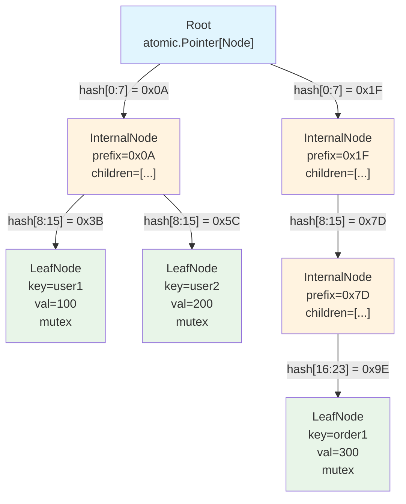
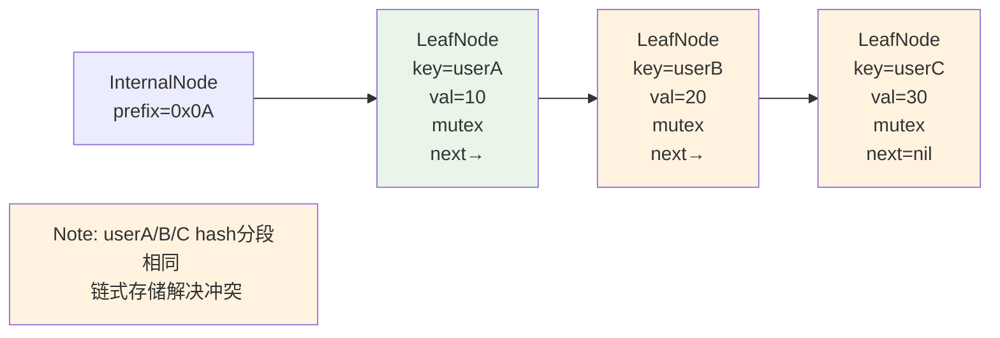
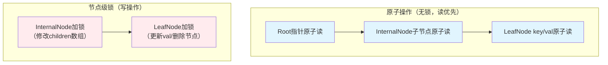
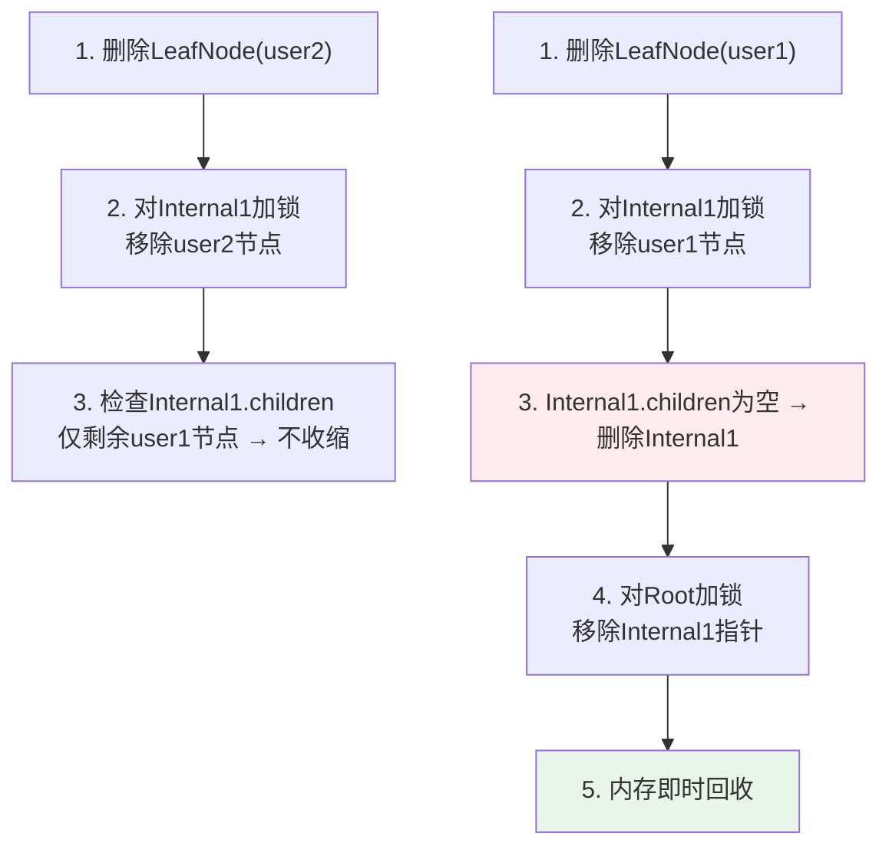
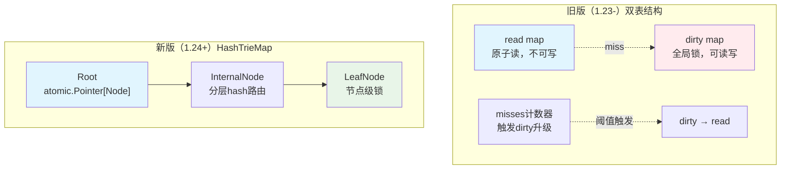
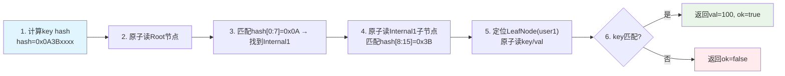
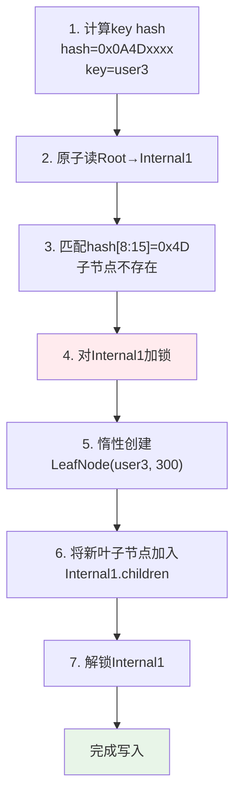

## 概述

Go 1.24+ 版本中，`sync.Map` 的底层实现从传统的双表结构切换为 HashTrieMap（哈希前缀树）结构。这一重大改进显著提升了并发性能，特别是在高并发读写场景下。本文将详细介绍 HashTrieMap 的实现原理、数据读写逻辑以及与旧版本的差异。

## HashTrieMap 核心实现原理

### Hash 分段与树深度控制

1. **分段位数选择**：默认按 `8 位` 对 `key` 的 hash 值分段，即每一层节点对应 hash 的 8 个比特位，单层级最多容纳 `2^8=256` 个子节点。该值是平衡内存占用与树深度的权衡——分段位数太小会导致树深度增加，遍历路径变长；太大则会让内部节点的子节点数组占用过多内存。

2. **最大树深度限制**：为避免恶意 `key` 导致 hash 分布异常（如 hash 前缀高度重复），实现中隐含了最大深度限制，超过后会强制切换为冲突链表存储，防止遍历性能劣化。

以下图示展示了 HashTrieMap 的整体结构和层级关系：

### 惰性展开（Lazy Expansion）优化

1. **内部节点的惰性创建**：初始时内部节点的子节点数组为 `nil`，只有当需要插入对应 hash 段的子节点时，才会按需分配数组空间。相比预分配固定大小数组，该策略大幅降低了空树或稀疏树的内存开销。

2. **叶子节点的冲突处理**：当两个不同 `key` 的 hash 分段完全一致时（极端 hash 冲突），不会继续扩展树深度，而是在当前叶子节点后链式挂载冲突节点，加锁后进行链式遍历匹配 `key`。

以下图示展示了 Hash 冲突时的链式存储解决方案：

### 原子操作与锁的分层使用

1. **原子操作优先原则**：所有节点的指针读取都通过 `atomic.LoadPointer` 完成，只有在需要修改节点（如插入、更新、删除）时，才会对当前层级的节点加 `sync.Mutex` 锁。

2. **锁的范围最小化**：写操作仅锁定当前操作的节点，而非整条路径。例如插入新节点时，仅锁定父节点以修改其子节点数组，操作完成后立即解锁，父节点的锁不会阻塞其他子节点的操作。

3. **无锁读的可见性保障**：依赖 Go 内存模型的原子操作内存屏障，确保读操作能看到最新的节点写入结果，无需加锁即可保证数据一致性。

以下图示对比了原子操作与节点级锁的使用：

### 内存回收与节点收缩机制

1. **递归收缩空节点**：删除叶子节点后，会检查其父节点的子节点数组是否为空。若为空，则删除该父节点，并继续向上递归检查祖父节点，直至遇到非空节点或根节点。该机制避免了旧双表实现中"脏表残留"导致的内存泄漏问题。

2. **不依赖 GC 的主动回收**：节点删除后直接从树结构中移除，其内存可被 GC 即时扫描回收，无需等待 `dirty` 表升级等触发条件，对频繁增删键的场景更友好。

以下图示展示了内存回收过程中递归收缩空节点的机制：

### 与旧版 API 的兼容细节

1. **`Range` 方法的快照语义**：`Range` 遍历过程中不锁定整棵树，而是通过原子读取节点实现弱一致性快照——遍历期间的写入操作可能会被读取到，也可能不会，这与旧版 `sync.Map` 的语义保持一致，避免破坏用户代码。

2. **`LoadOrStore` 的原子性保障**：该方法是原子操作，内部通过"先读（无锁）→ 不存在则加锁写"的逻辑实现，确保多个 goroutine 同时调用时，不会出现重复插入的情况。

3. **环境变量降级开关**：通过 `GOEXPERIMENT=nosynchashtriemap` 可强制回退到旧双表实现，底层会切换为 `sync` 包内的 `oldMap` 结构体，兼容对旧版性能行为有依赖的场景。

以下图示对比了新旧实现的结构差异：

### 性能优化的边界场景

1. **小批量读写的批处理优化**：当连续对一批不相交的 `key` 进行写操作时，由于节点级锁的隔离性，这些操作可以完全并行，吞吐量远高于旧版的全局锁竞争。

2. **高频相同 `key` 操作的取舍**：对于同一 `key` 的高频读写（如单 `key` 每秒数万次更新），新实现的性能略逊于旧版——因为旧版 `read` 表的原子读无需锁，而新版每次写都需要加叶子节点锁。

---

## 数据读写逻辑详解

Go 1.24+ sync.Map（HashTrieMap 底层）的数据读写逻辑基于哈希前缀树的路径遍历 + 节点级细粒度锁，核心是"按 hash 位分段寻址、原子读 + 锁写"。

### 核心前置操作

1. **计算哈希值**：对传入的 `key` 计算 hash（`runtime.maphash`），作为树的寻址路径，hash 值按固定位数（如 8 位）分段，每段对应树的一层节点。

2. **根节点初始化**：Root 是 `atomic.Pointer[Node]` 类型，首次操作时原子化创建空根节点，无全局锁。

### Load（读取数据）逻辑

Load 是无锁原子操作，全程不阻塞，步骤如下：

1. 从 Root 原子读取当前根节点指针，若根节点为空，直接返回 `ok=false`。

2. 按 hash 分段逐层遍历树：
   - 取当前 hash 段的值，匹配当前节点的子节点列表。
   - 用原子操作读取子节点指针，若子节点不存在，终止遍历，返回 `ok=false`。
   - 若子节点是内部节点，继续下一层遍历；若为叶子节点，进入下一步。

3. 叶子节点匹配：
   - 原子读取叶子节点的 `key` 和 `val`，对比目标 `key` 是否完全一致（解决 hash 冲突）。
   - 匹配成功则返回 `val` 和 `ok=true`；否则返回 `ok=false`。

以下图示展示了 Load 操作的完整流程：

### Store（写入/更新数据）逻辑

Store 是节点级加锁操作，仅锁定目标路径的节点，不影响其他键的读写，步骤如下：

1. 计算 `key` 的 hash 值，从 Root 开始遍历，过程与 Load 一致。

2. **路径存在的情况（更新）**：
   - 遍历到匹配的叶子节点后，对该叶子节点加互斥锁（`sync.Mutex`）。
   - 更新叶子节点的 `val` 字段，解锁。

3. **路径不存在的情况（插入）**：
   - 遍历到某一层无匹配子节点时，对当前层的父节点加锁。
   - 惰性创建缺失的内部节点/叶子节点，将新节点链接到父节点的子节点列表。
   - 解锁父节点，完成插入。

4. **特殊场景：hash 冲突**：
   - 若遇到相同 hash 段但 `key` 不同的叶子节点，会在当前叶子节点下扩展冲突链表，加锁后追加新节点。

以下图示展示了 Store 操作的完整流程：

### 额外核心操作逻辑补充

1. **Delete（删除数据）**
   - 遍历到目标叶子节点后加锁，直接标记节点删除并从父节点移除。
   - 若父节点的子节点列表为空，递归向上删除空的内部节点，实现树的收缩，内存即时回收。

2. **Range（遍历数据）**
   - 从 Root 开始深度优先遍历整棵树，对每个叶子节点原子读取 `key` 和 `val`，传入用户回调函数。
   - 遍历过程中不阻塞其他操作，若遇到节点更新，以当前读取到的状态为准。

---

## 总结

Go 1.24+ 中 HashTrieMap 的实现是对 `sync.Map` 的一次重大升级，通过哈希前缀树结构和节点级细粒度锁，显著提升了并发性能。新实现特别适合以下场景：

- 高并发读写操作，尤其是不同 key 的并行操作
- 频繁的键值对增删操作，得益于即时内存回收机制
- 大规模数据存储，通过树结构降低了锁竞争

然而，对于单一 key 的高频更新场景，旧版实现可能仍有优势。开发者可以通过环境变量 `GOEXPERIMENT=nosynchashtriemap` 在必要时回退到旧版实现，确保兼容性。