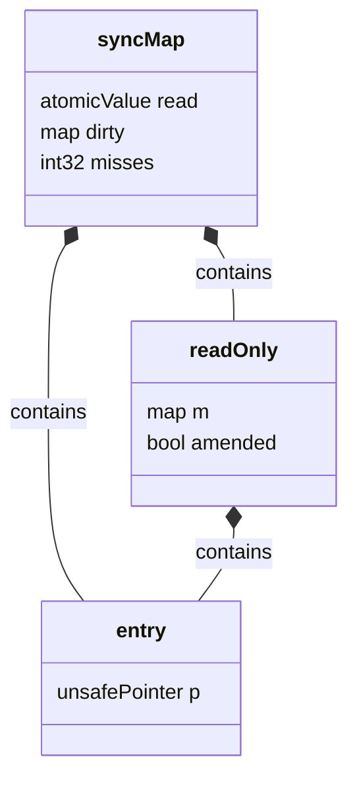
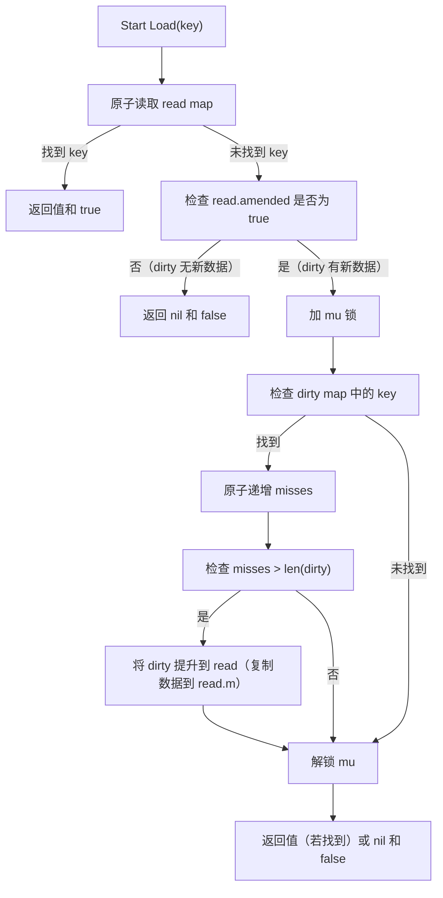

## 1. 引言
在 Go 语言中，`map` 是一种常用的数据结构，但**原生 `map` 并不支持并发读写**。当多个 goroutine 同时对一个 `map` 进行读、写或删除操作时，会导致不可预知的行为（如 panic）。为了解决这个问题，Go 1.9 引入了 `sync.Map`——一种**并发安全的 map 实现**，专门优化了读-heavy 的并发场景，无需显式使用锁即可安全访问。


## 2. sync.Map 的核心特性
`sync.Map` 的设计目标是**在保证并发安全的前提下，最大化读操作的性能**。其核心特性包括：
1. **无锁读优化**：读操作优先访问一个**只读的 `read` map**，无需加锁，大幅提升读吞吐量。
2. **读写分离**：写操作先写入一个**带锁的 `dirty` map**，避免阻塞读操作。
3. **自动提升机制**：当 `read` map 中未找到键的次数（`misses`）达到阈值时，会将 `dirty` map 中的数据**自动提升**到 `read` map，减少后续读操作的 miss 次数。
4. **安全的并发操作**：所有方法（`Store`, `Load`, `Delete`, `Range`）均实现了并发安全，无需用户手动加锁。


## 3. 底层实现原理
### 3.1 数据结构设计
`sync.Map` 的内部结构由三个核心部分组成（如图 3-1 所示）：


**图 3-1 sync.Map 内部结构示意图**


**各部分说明**：
- `read`：类型为 `atomic.Value`，存储一个 `readOnly` 结构体。`readOnly` 包含：
  - `m`：一个只读的 `map[interface{}]*entry`，存储大部分键值对（读操作优先访问）。
  - `amended`：布尔值，标记 `dirty` map 是否包含 `read` 中没有的键（即是否有未提升的新数据）。
- `dirty`：类型为 `map[interface{}]*entry`，用于存储最近修改（新增、更新）的键值对。访问 `dirty` 时需要持有 `mu` 锁（`sync.Mutex`）。
- `misses`：类型为 `int32`，记录从 `read` 中未找到键的次数。当 `misses` 超过 `dirty` map 的长度时，触发**提升操作**（将 `dirty` 中的数据复制到 `read`）。
- `entry`：封装了值的指针（`p`），使用原子操作（`unsafe.Pointer` + `sync/atomic`）修改值，保证并发安全。


### 3.2 关键操作的流程
#### 3.2.1 Load：读取键值
`Load(key interface{}) (value interface{}, ok bool)` 是 `sync.Map` 最常用的方法，其流程如图 3-2 所示：


**流程说明**：
1. 优先从 `read` map 中读取（无锁，快）。
2. 如果 `read` 中没有且 `amended` 为 `true`（说明 `dirty` 有新数据），则加锁检查 `dirty`。
3. 若在 `dirty` 中找到 key，递增 `misses`——当 `misses` 超过 `dirty` 的长度时，将 `dirty` 中的数据**复制到 `read`**（提升操作），避免后续读操作再次 miss。


#### 3.2.2 Store：存储键值
`Store(key, value interface{})` 用于存储或更新键值对，流程如下：
1. **检查 `read` map**：如果 key 已存在于 `read`，则通过原子操作更新 `entry` 的值（无锁）。
2. **写入 `dirty` map**：如果 key 不在 `read`，则加锁并将 key-value 写入 `dirty` map。同时，将 `read.amended` 设为 `true`（标记 `dirty` 有新数据）。


#### 3.2.3 Delete：删除键值
`Delete(key interface{})` 用于删除键值对：
1. **标记为删除**：首先尝试从 `read` 或 `dirty` 中找到 key，将对应的 `entry.p` 设为 `nil`（原子操作）。
2. **清理 `dirty`**：如果 key 存在于 `dirty`，则加锁删除该 key（避免内存泄漏）。


## 4. 与 sync.RWMutex + map 的对比
`sync.Map` 并非银弹，其性能优势随版本迭代优化。Go 1.23 引入**16叉树优化**（针对大负载场景）后，`sync.Map` 的特性有显著变化。表 4-1 对比了三个方案：
- Go 1.22及之前的 `sync.Map`（双 map 结构）
- Go 1.23+ 的 `sync.Map`（16叉树优化）
- 传统 "`sync.RWMutex + map`" 方案

| 特性                | Go 1.22- sync.Map         | Go 1.23+ sync.Map（16叉树）| sync.RWMutex + map        |
|---------------------|---------------------------|---------------------------|---------------------------|
| **并发安全**        | 是（内置）                | 是（内置）                | 是（手动锁）              |
| **读性能**          | 高（无锁读）              | 极高（16叉树无锁遍历）    | 较高（读锁，需竞争）      |
| **写性能**          | 较低（dirty 锁）          | 中（16叉树减少锁竞争）    | 较高（写锁，竞争小）      |
| **内存开销**        | 较高（双 map）             | 中（优化双 map 结构）     | 较低（单 map）            |
| **适用场景**        | 读多写少，动态键          | 高并发大负载，读写均衡    | 写多读少，静态键          |
| **迭代复杂度**      | 简单（Range 方法）         | 简单（Range 方法）         | 复杂（需手动锁）          |
| **动态键支持**      | 优（自动提升）             | 优（16叉树动态扩容）      | 一般（需手动管理锁）      |


## 5. 最佳实践与注意事项
### 5.1 不要过度使用 sync.Map
`sync.Map` 的优势在于**读多写少**的场景。如果你的场景是**写多读少**（如频繁插入新键），或键的集合基本固定（如配置项），`sync.RWMutex + map` 会更高效。


### 5.2 利用 LoadOrStore 简化逻辑
对于 "如果键存在则返回值，否则存储新值" 的常见场景，`LoadOrStore` 方法可以避免手动检查和锁的组合：
```go
var m sync.Map
value, loaded := m.LoadOrStore("key", "default")
if loaded {
    // 键已存在，value 是原有的值
} else {
    // 键不存在，已存储新值
}
```


### 5.3 注意迭代的一致性
`sync.Map` 的 `Range` 方法会遍历 `read` 和 `dirty` 中的键，但**不保证迭代过程中数据的一致性**（即可能包含已删除的键或未提交的修改）。如果需要强一致的迭代，建议使用 `sync.RWMutex + map` 并手动加锁。


## 6. 典型使用场景
### 6.1 缓存系统
在 HTTP 服务器中缓存频繁访问的响应，`sync.Map` 的读优化可以应对高并发的请求：
```go
var cache sync.Map

func handler(w http.ResponseWriter, r *http.Request) {
    key := r.URL.Path
    if value, ok := cache.Load(key); ok {
        fmt.Fprint(w, value)
        return
    }
    // 生成响应...
    response := generateResponse(r)
    cache.Store(key, response)
    fmt.Fprint(w, response)
}
```


### 6.2 共享动态状态
在多个 goroutine 之间共享用户在线状态，无需手动管理锁：
```go
var onlineUsers sync.Map

// 标记用户上线
func userOnline(userID string) {
    onlineUsers.Store(userID, time.Now())
}

// 标记用户下线
func userOffline(userID string) {
    onlineUsers.Delete(userID)
}

// 检查用户是否在线
func isUserOnline(userID string) bool {
    _, ok := onlineUsers.Load(userID)
    return ok
}
```


### 6.3 流数据处理
在处理流数据时，动态存储中间结果（如统计每个用户的消息数）：
```go
var messageCount sync.Map

func processMessage(msg Message) {
    userID := msg.UserID
    count, _ := messageCount.LoadOrStore(userID, 0)
    messageCount.Store(userID, count.(int)+1)
}
```


## 7. 总结
`sync.Map` 是 Go 语言针对**并发读-heavy 场景**设计的高效数据结构，其核心优势是**无锁读**和**自动读写分离**。通过 `read` 和 `dirty` 双 map 的设计，`sync.Map` 可以在高并发读的场景下大幅提升性能，同时保证并发安全。

**选择建议**：
- 当你的 map 访问模式是**读多写少**，且键的集合动态变化时，优先选择 `sync.Map`。
- 当你的 map 访问模式是**写多读少**，或键的集合基本固定时，选择 `sync.RWMutex + map` 更高效。

最后，记住：**没有银弹**——理解 `sync.Map` 的底层原理和适用场景，才能让它成为你并发编程的利器。