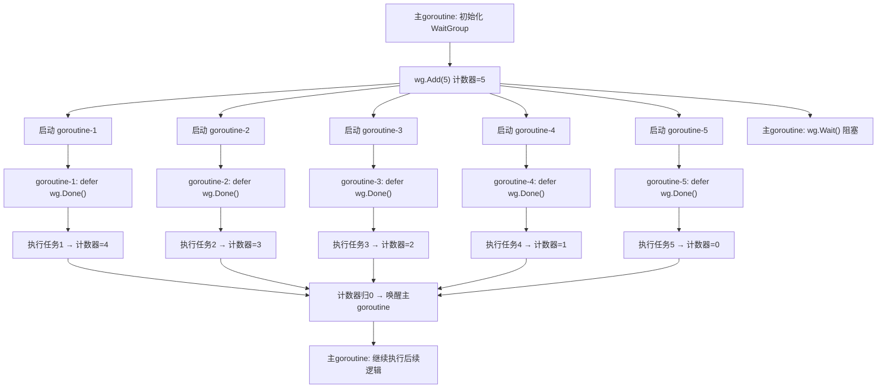
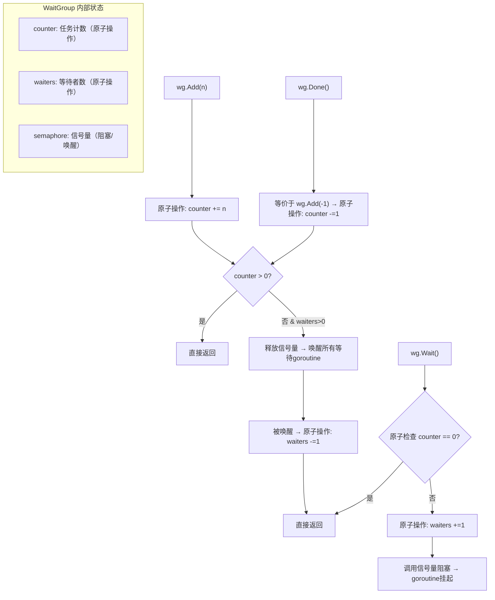
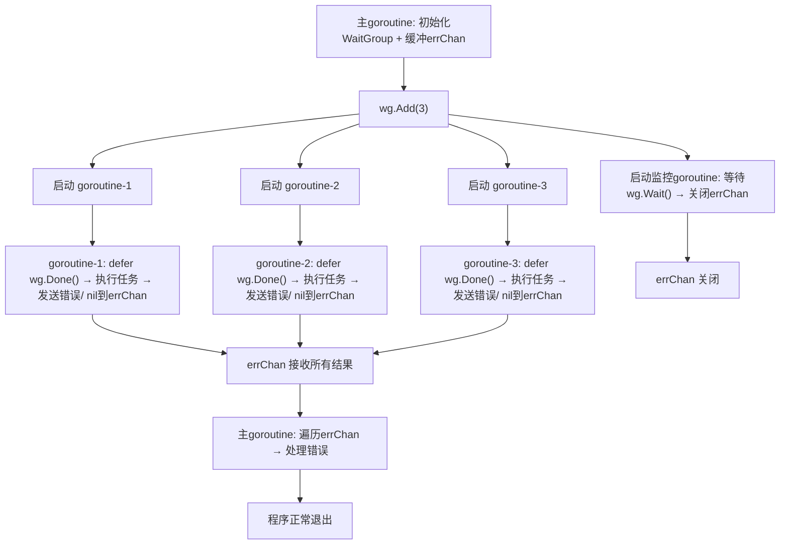
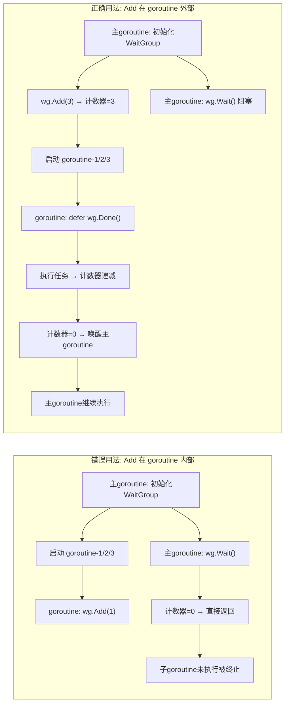

`sync.WaitGroup` 是 Go 语言中用于**等待一组 goroutine 全部执行完成**的核心同步工具，常用来协调多个并发任务的结束时机，避免主 goroutine 提前退出导致子任务未执行完。

## 一、核心概念与工作原理

`WaitGroup` 本质是一个计数器，核心逻辑分为三步：

1. **添加计数**：告诉 `WaitGroup` 需要等待多少个 goroutine（计数 +n）
2. **完成通知**：每个 goroutine 执行完后，告诉 `WaitGroup` 自己完成了（计数 -1）
3. **等待结束**：主 goroutine 阻塞，直到计数器归 0（所有 goroutine 都完成）

### 核心方法

| 方法                | 作用                                                                 |
|---------------------|----------------------------------------------------------------------|
| `wg.Add(n int)`     | 给计数器加 n（n 通常是待执行的 goroutine 数量，必须在 goroutine 启动前调用） |
| `wg.Done()`         | 计数器减 1（等价于 `wg.Add(-1)`，通常用 `defer` 放在 goroutine 开头）     |
| `wg.Wait()`         | 阻塞当前 goroutine，直到计数器归 0                                    |

## 二、基础使用示例

下面是一个典型场景：主 goroutine 启动 5 个子 goroutine，等待所有子 goroutine 执行完后再退出。

```go
package main

import (
    "fmt"
    "sync"
    "time"
)

func main() {
    // 1. 初始化 WaitGroup
    var wg sync.WaitGroup

    // 2. 添加计数：需要等待 5 个 goroutine
    wg.Add(5)

    // 3. 启动 5 个 goroutine
    for i := 0; i < 5; i++ {
        go func(num int) {
            // 关键：用 defer 确保 goroutine 执行完必调用 Done
            defer wg.Done()

            // 模拟子任务执行（比如耗时操作）
            fmt.Printf("goroutine %d 开始执行\n", num)
            time.Sleep(1 * time.Second)
            fmt.Printf("goroutine %d 执行完成\n", num)
        }(i)
    }

    // 4. 等待所有 goroutine 完成
    fmt.Println("主 goroutine 等待所有子任务完成...")
    wg.Wait()
    fmt.Println("所有子任务都完成了，主 goroutine 退出")
}
```

### 输出效果

顺序可能因 goroutine 调度略有不同：

```
主 goroutine 等待所有子任务完成...
goroutine 0 开始执行
goroutine 1 开始执行
goroutine 2 开始执行
goroutine 3 开始执行
goroutine 4 开始执行
goroutine 0 执行完成
goroutine 1 执行完成
goroutine 2 执行完成
goroutine 3 执行完成
goroutine 4 执行完成
所有子任务都完成了，主 goroutine 退出
```

### 执行流程图



## 三、关键注意事项

### 1. Add 必须在 goroutine 启动前调用

如果先启动 goroutine 再调用 `wg.Add()`，可能导致主 goroutine 的 `Wait()` 先执行（此时计数器还是 0），直接退出，子 goroutine 还没执行就被终止。

### 2. 禁止重复使用 WaitGroup

`Wait()` 返回后，计数器已经归 0，不能再次调用 `Wait()` 或 `Add()` 复用这个 `WaitGroup`（会导致 panic），如需再次使用需重新初始化。

### 3. Done 调用次数必须和 Add 匹配

- 如果 `Done` 调用太少：计数器永远不为 0，`Wait()` 会一直阻塞（死锁）
- 如果 `Done` 调用太多：计数器变为负数，会直接 panic

### 4. 不要复制 WaitGroup

`WaitGroup` 是结构体，值传递会复制计数器状态，导致同步失效。如需传递，必须用指针（`*sync.WaitGroup`）。

## 四、错误示例

### 错误示例：Add 在 goroutine 内部调用

```go
package main

import (
    "fmt"
    "sync"
    "time"
)

func main() {
    var wg sync.WaitGroup

    for i := 0; i < 5; i++ {
        go func(num int) {
            wg.Add(1) // 错误：Add 在 goroutine 内，主 goroutine 可能先执行 Wait()
            defer wg.Done()
            fmt.Printf("goroutine %d 执行\n", num)
            time.Sleep(1 * time.Second)
        }(i)
    }

    wg.Wait() // 大概率直接退出，子 goroutine 没执行
    fmt.Println("退出")
}
```

---

## 五、底层实现原理

Go 源码中 `WaitGroup` 的实现核心围绕**原子操作**和**信号量**展开，整体逻辑简洁但兼顾了并发安全和性能。

### 数据结构

Go 源码（`src/sync/waitgroup.go`）中，`WaitGroup` 的核心结构体定义非常精简：

```go
type WaitGroup struct {
    noCopy noCopy       // 禁止拷贝的标记（编译期检查）
    state1 [3]uint32    // 存储状态：高32位是等待者数，低32位是计数，还有1个32位存信号量
}
```

### state1 的三段式划分

`state1` 是一个长度为 3 的 `uint32` 数组，实际会被拆成三个逻辑部分（根据系统是否为64位对齐调整）：

- **counter（计数）**：低32位，对应 `Add(n)` 操作的增减值（也就是我们常说的"需要等待的 goroutine 数"）
- **waiters（等待者数）**：高32位，记录有多少个 goroutine 调用了 `Wait()` 并处于阻塞状态
- **semaphore（信号量）**：第三个32位，用于唤醒阻塞的等待者 goroutine

简单说：`state1` 打包了"待完成任务数"、"等待的goroutine数"、"唤醒信号"三个核心状态。

### 核心方法的底层实现

`WaitGroup` 的三个核心方法（`Add`/`Done`/`Wait`）全部基于**原子操作**（保证并发安全）和**信号量操作**（实现阻塞/唤醒），没有用复杂的锁，性能极高。

#### Add(n int) 方法：原子增减计数器

`Add(n)` 的核心是**原子地修改 counter 值**，并在特定条件下唤醒等待者，步骤如下：

1. **参数校验**：如果 n 是负数且 counter 减完后为负，直接 panic（对应"Done 调用次数超过 Add"的场景）
2. **原子操作更新 counter**：用 `atomic.AddUint64` 把 n 加到 counter 上（因为 counter 是64位值的低32位，所以整体按64位原子操作）
3. **关键判断**：
   - 如果 counter > 0：说明还有任务没完成，直接返回
   - 如果 counter == 0 且 waiters > 0：说明所有任务都完成了，需要唤醒所有调用 `Wait()` 的 goroutine（通过释放信号量实现）

#### Done() 方法：本质是 Add(-1)

源码中 `Done()` 就是简单的封装：

```go
func (wg *WaitGroup) Done() {
    wg.Add(-1)
}
```

所以 `Done()` 的底层逻辑和 `Add(-1)` 完全一致，只是语义上更清晰（标记一个任务完成）。

#### Wait() 方法：阻塞等待 + 信号量唤醒

`Wait()` 是最复杂的方法，核心是"阻塞当前 goroutine，直到 counter 归 0"，步骤如下：

1. **原子检查 counter**：如果 counter 已经是 0，说明所有任务都完成了，直接返回
2. **增加 waiters 计数**：原子地把 waiters 数 +1（记录当前有一个 goroutine 在等待）
3. **循环阻塞等待**：
   - 再次检查 counter，如果为 0，就把 waiters 数 -1 并返回
   - 如果 counter 不为 0，调用 `runtime_Semacquire`（底层信号量操作），让当前 goroutine 进入阻塞状态
4. **被唤醒后清理**：当 `Add` 触发 counter 归 0 时，会调用 `runtime_Semrelease` 释放信号量，唤醒所有阻塞的 goroutine，此时 `Wait()` 会把 waiters 数 -1 并返回

### 核心机制总结



#### 1. 并发安全靠原子操作

所有对 counter、waiters 的修改都是通过 `atomic` 包的原子操作（如 `atomic.AddUint64`、`atomic.CompareAndSwapUint64`）完成，避免了多 goroutine 同时修改导致的竞态问题，比普通互斥锁（`sync.Mutex`）更高效。

#### 2. 阻塞/唤醒靠信号量

Go 运行时（runtime）提供了轻量级的信号量原语（`runtime_Semacquire`/`runtime_Semrelease`），`Wait()` 调用时如果任务没完成，goroutine 会被挂起（让出CPU），直到信号量被释放才会被唤醒，不会空耗CPU。

#### 3. 禁止拷贝靠编译期检查

`noCopy` 字段是一个空结构体，Go 编译器会通过 `vet` 工具检查是否有拷贝 `WaitGroup` 的行为（比如作为函数参数值传递），一旦发现就会报错，避免因拷贝导致多个 `WaitGroup` 实例共享状态的问题。

### 简化版执行流程

用"主 goroutine 等待 2 个子 goroutine"的场景举例：

1. 主 goroutine 调用 `wg.Add(2)` → 原子操作把 counter 设为 2
2. 启动 2 个子 goroutine，每个执行完调用 `wg.Done()` → 第一次 `Done()` 把 counter 减到 1，第二次减到 0
3. 主 goroutine 调用 `wg.Wait()` → 此时 counter 还没到 0，waiters 加 1，主 goroutine 阻塞
4. 第二个 `Done()` 把 counter 减到 0，检测到 waiters > 0 → 释放信号量，唤醒主 goroutine
5. 主 goroutine 被唤醒，waiters 减 1，`Wait()` 返回，继续执行后续逻辑

---

## 六、最佳实践

### 固定套路：Add → goroutine 内 defer Done → Wait

这是最核心、最安全的用法，记住这个流程就解决了80%的问题：

```go
package main

import (
    "fmt"
    "sync"
    "time"
)

func main() {
    var wg sync.WaitGroup

    // 1. 先Add：明确要等待的goroutine数量（必须在启动goroutine前）
    taskNum := 3
    wg.Add(taskNum)

    // 2. 启动goroutine，用defer确保Done必执行
    for i := 0; i < taskNum; i++ {
        go func(id int) {
            // 核心：defer放在goroutine开头，无论是否panic都能调用Done
            defer wg.Done()

            // 业务逻辑（即使出错，Done也会执行）
            fmt.Printf("任务%d开始\n", id)
            time.Sleep(time.Millisecond * 100)
            fmt.Printf("任务%d完成\n", id)
        }(i)
    }

    // 3. 等待所有任务完成
    wg.Wait()
    fmt.Println("所有任务执行完毕")
}
```

### 进阶最佳实践

| 场景                | 实践要点                                                                 |
|---------------------|--------------------------------------------------------------------------|
| 动态任务数          | 提前预估最大任务数调用 `Add`，或分批 `Add`（比如每启动1个goroutine就 `Add(1)`，但必须在启动前） |
| 避免goroutine泄露   | 业务逻辑中即使有 `return`/`panic`，也要通过 `defer wg.Done()` 保证计数递减 |
| 传递WaitGroup       | 必须传指针（`*sync.WaitGroup`），禁止值传递（避免拷贝状态）               |
| 批量任务分组        | 一个WaitGroup对应一组同类任务，不同组用不同WaitGroup（避免复用）           |
| 结合错误处理        | 用通道（chan）收集错误，WaitGroup只负责等待任务结束，不处理业务逻辑       |

### 传指针 + 收集错误（生产级用法）

```go
package main

import (
    "errors"
    "fmt"
    "sync"
)

func main() {
    var wg sync.WaitGroup
    errChan := make(chan error, 3) // 缓冲通道，避免goroutine阻塞

    wg.Add(3)
    for i := 0; i < 3; i++ {
        go func(id int) {
            defer wg.Done()
            // 模拟业务错误
            if id == 1 {
                errChan <- errors.New(fmt.Sprintf("任务%d执行失败", id))
                return
            }
            errChan <- nil // 无错误则传nil
        }(i)
    }

    // 等待所有任务完成后关闭通道
    go func() {
        wg.Wait()
        close(errChan)
    }()

    // 遍历错误通道，处理结果
    for err := range errChan {
        if err != nil {
            fmt.Println("错误：", err)
        }
    }
    fmt.Println("任务全部完成，错误处理完毕")
}
```

### 生产级用法流程图



---

## 七、高频错误场景

### 错误场景对比图



### 错误场景1：Add 在 goroutine 内部调用（最常见）

#### 错误代码

```go
var wg sync.WaitGroup
for i := 0; i < 3; i++ {
    go func(id int) {
        wg.Add(1) // 错误：Add在goroutine内，主goroutine可能先执行Wait()
        defer wg.Done()
        fmt.Println("任务", id)
    }(i)
}
wg.Wait() // 大概率直接退出，子goroutine没执行
```

#### 问题原因

goroutine 启动有延迟，主 goroutine 的 `Wait()` 可能先执行（此时计数器为0），直接返回，导致子 goroutine 被终止。

#### 修复方案

`Add` 必须在启动 goroutine 前调用：

```go
var wg sync.WaitGroup
wg.Add(3) // 提前Add
for i := 0; i < 3; i++ {
    go func(id int) {
        defer wg.Done()
        fmt.Println("任务", id)
    }(i)
}
wg.Wait()
```

### 错误场景2：拷贝 WaitGroup（值传递）

#### 错误代码

```go
func worker(wg sync.WaitGroup) { // 错误：值传递，拷贝了WaitGroup
    defer wg.Done()
    fmt.Println("执行任务")
}

func main() {
    var wg sync.WaitGroup
    wg.Add(1)
    go worker(wg) // 传递的是拷贝，不是原实例
    wg.Wait()     // 原计数器永远为1，死锁！
}
```

#### 问题原因

`WaitGroup` 是结构体，值传递会复制其内部状态（计数器、等待者数等），子 goroutine 操作的是拷贝的实例，原实例的计数器永远无法归0，导致 `Wait()` 永久阻塞。

#### 修复方案

传指针：

```go
func worker(wg *sync.WaitGroup) { // 传指针
    defer wg.Done()
    fmt.Println("执行任务")
}

func main() {
    var wg sync.WaitGroup
    wg.Add(1)
    go worker(&wg) // 传递指针
    wg.Wait()
}
```

### 错误场景3：复用 WaitGroup（Wait 后再次使用）

#### 错误代码

```go
var wg sync.WaitGroup

// 第一组任务
wg.Add(2)
go func() { defer wg.Done(); fmt.Println("任务1") }()
go func() { defer wg.Done(); fmt.Println("任务2") }()
wg.Wait()

// 错误：复用WaitGroup
wg.Add(1) // Wait后计数器归0，再次Add会导致panic（或计数混乱）
go func() { defer wg.Done(); fmt.Println("任务3") }()
wg.Wait()
```

#### 问题原因

`Wait()` 返回后，`WaitGroup` 的内部状态已被清理，再次调用 `Add()`/`Wait()` 会导致计数器状态混乱，甚至 panic。

#### 修复方案

重新初始化 WaitGroup：

```go
// 第一组任务
var wg1 sync.WaitGroup
wg1.Add(2)
go func() { defer wg1.Done(); fmt.Println("任务1") }()
go func() { defer wg1.Done(); fmt.Println("任务2") }()
wg1.Wait()

// 第二组任务：重新初始化
var wg2 sync.WaitGroup
wg2.Add(1)
go func() { defer wg2.Done(); fmt.Println("任务3") }()
wg2.Wait()
```

### 错误场景4：Done 调用次数不匹配（少调用/多调用）

- **少调用 Done**：计数器无法归0，`Wait()` 永久阻塞（死锁）。示例：启动3个goroutine，但只调用2次 `Done()` → 死锁
- **多调用 Done**：计数器变为负数，直接 panic。示例：`wg.Add(1)` 但调用2次 `wg.Done()` → panic: sync: negative WaitGroup counter

#### 修复方案

- 确保 `Done()` 调用次数 = `Add()` 的数值
- 用 `defer wg.Done()` 确保每个 goroutine 必调用一次，避免漏调
- 禁止在业务逻辑中重复调用 `Done()`

### 错误场景5：goroutine 内 panic 导致 Done 未执行

#### 错误代码

```go
var wg sync.WaitGroup
wg.Add(1)
go func() {
    // 没有defer，panic后Done未执行
    panic("任务出错")
    wg.Done() // 永远执行不到
}()
wg.Wait() // 死锁
```

#### 问题原因

panic 会终止 goroutine，未执行的 `Done()` 导致计数器无法归0。

#### 修复方案

用 `defer` 包裹 `Done()`，即使 panic 也会执行：

```go
var wg sync.WaitGroup
wg.Add(1)
go func() {
    defer wg.Done() // panic后仍会执行
    panic("任务出错")
}()
wg.Wait() // 正常退出（计数器归0）
```

---

## 总结

### 最佳实践核心要点

1. 遵循 **Add（前置）→ goroutine 内 defer Done → Wait** 的固定流程
2. 传递 WaitGroup 必须用指针，禁止值拷贝
3. 一个 WaitGroup 对应一组任务，用完即弃，不复用
4. 用 defer 保证 Done 必执行，避免 panic/return 导致漏调

### 必避错误

1. 不在 goroutine 内调用 Add
2. 不拷贝、不复用 WaitGroup
3. 保证 Done 调用次数与 Add 完全匹配
4. 用 defer 规避 panic 导致的 Done 漏调

只要遵守这些规则，`WaitGroup` 就能稳定、安全地协调多 goroutine 同步，几乎不会出问题。
