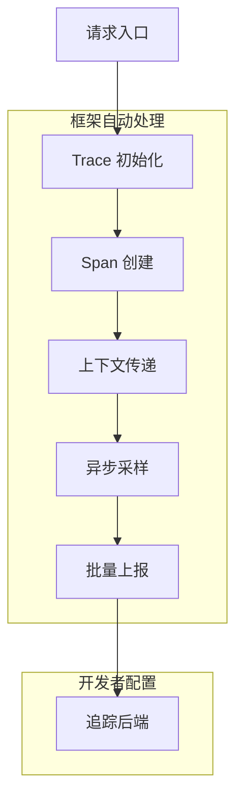
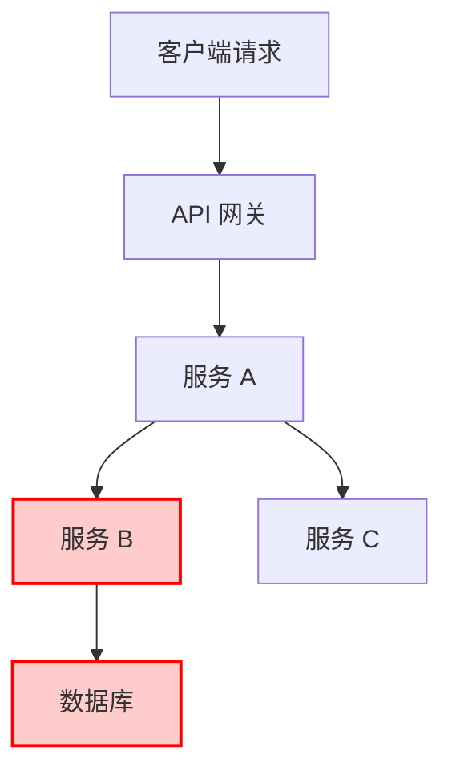
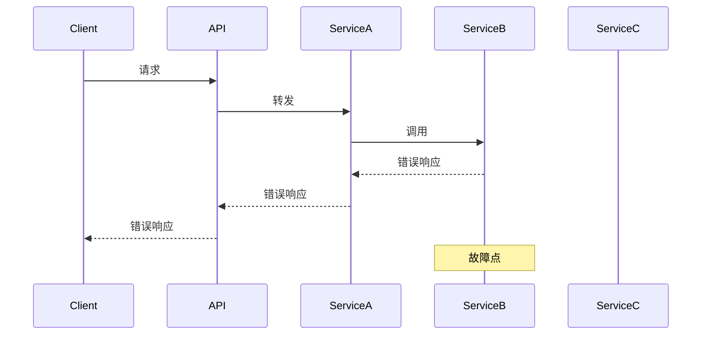

## 一、文档概述

### 1. 核心目标
本文深入解析 Go-Zero 框架的链路追踪能力，包括其设计理念、实现原理、使用场景以及与其他开源链路追踪方案的对比，帮助开发者全面理解并高效使用 Go-Zero 的链路追踪功能。

### 2. 适用场景
- **微服务架构监控**：适用于基于 Go-Zero 构建的微服务系统，实现全链路可视化监控
- **性能瓶颈定位**：帮助开发者快速定位服务调用中的性能瓶颈
- **分布式故障排查**：在分布式系统中追踪请求链路，快速定位故障点
- **系统架构优化**：通过链路数据分析系统架构合理性，进行优化调整

### 3. 前置依赖
- 了解 Go-Zero 框架基本使用
- 熟悉分布式系统概念
- 了解 OpenTelemetry 或 OpenTracing 标准

## 二、核心原理

### 1. 技术背景
在微服务架构中，一个请求往往需要经过多个服务才能完成，传统的日志监控方式难以追踪完整的请求链路。链路追踪技术应运而生，通过在请求传递过程中记录上下文信息，实现全链路可视化监控。

Go-Zero 框架内置了强大的链路追踪能力，基于 OpenTelemetry 标准实现，支持多种追踪后端，如 Jaeger、Zipkin 等。

### 2. 核心设计
Go-Zero 的链路追踪能力具有以下核心设计特点：

- **低侵入性**：通过框架层面的自动注入，开发者无需手动埋点
- **标准化实现**：基于 OpenTelemetry 标准，支持与其他生态系统无缝集成
- **高性能**：采用异步采样和批量上报机制，降低对业务性能的影响
- **可扩展性**：支持多种追踪后端，可根据需求灵活切换

### 3. 实现原理

Go-Zero 的链路追踪实现主要包括以下几个核心组件：



#### 3.1 追踪上下文传递
Go-Zero 通过 `context.Context` 在服务间传递追踪上下文，主要包括：
- Trace ID：全局唯一标识一个请求链路
- Span ID：标识链路中的一个操作
- Parent Span ID：标识父操作的 Span ID
- 其他元数据：如采样率、标签等

#### 3.2 自动埋点机制
Go-Zero 在以下关键节点自动创建 Span：
- HTTP 服务请求入口和出口
- gRPC 服务请求入口和出口
- 数据库操作
- Redis 操作
- 消息队列操作

#### 3.3 采样策略
Go-Zero 支持多种采样策略：
- 全量采样：记录所有请求
- 概率采样：按指定概率采样
- 速率采样：按指定速率采样
- 自定义采样：支持开发者自定义采样逻辑

## 三、实操步骤

### 1. 配置链路追踪

#### 1.1 修改配置文件
在 Go-Zero 服务的配置文件中添加链路追踪配置：

```yaml
Telemetry:
  Name: "your-service-name"
  Endpoint: "http://jaeger-collector:4317"  # 追踪后端地址
  Sampler: 1.0  # 采样率，1.0 表示全量采样
  Batcher: "otlp"  # 上报器类型，支持 otlp、jaeger 等
```

#### 1.2 初始化追踪器
在服务启动时初始化追踪器：

```go
import (
    "github.com/zeromicro/go-zero/core/telemetry"
)

func main() {
    // 加载配置
    var cfg config.Config
    loadConfig(&cfg)
    
    // 初始化追踪器
    defer telemetry.Stop()
    if err := telemetry.Start(telemetry.Config{
        Name:      cfg.Telemetry.Name,
        Endpoint:  cfg.Telemetry.Endpoint,
        Sampler:   cfg.Telemetry.Sampler,
        Batcher:   cfg.Telemetry.Batcher,
    }); err != nil {
        log.Fatalf("Failed to start telemetry: %v", err)
    }
    
    // 启动服务...
}
```

### 2. 手动埋点（可选）

对于框架未自动埋点的自定义逻辑，可手动创建 Span：

```go
import (
    "context"
    "github.com/zeromicro/go-zero/core/telemetry/trace"
)

func customLogic(ctx context.Context) {
    // 创建自定义 Span
    ctx, span := trace.StartSpan(ctx, "custom-operation")
    defer span.End()
    
    // 添加标签
    span.SetAttributes(trace.StringAttribute("key", "value"))
    
    // 记录事件
    span.AddEvent("custom-event")
    
    // 执行业务逻辑...
}
```

### 3. 查看追踪数据

配置完成后，启动服务并发送请求，即可在追踪后端（如 Jaeger）查看完整的请求链路：

```bash
# 访问 Jaeger UI
http://localhost:16686
```

## 四、使用场景

### 1. 性能瓶颈定位

通过查看链路中的 Span 耗时，快速定位性能瓶颈：



### 2. 分布式故障排查

当某个服务出现故障时，通过 Trace ID 可以快速定位故障点及其影响范围：



### 3. 系统架构优化

通过分析链路数据，可以发现系统架构中的不合理之处，如不必要的服务调用、过长的调用链等，进行优化调整。

## 五、与其他方案对比

### 1. 与原生 OpenTelemetry 对比

| 特性 | Go-Zero 链路追踪 | 原生 OpenTelemetry |
|------|------------------|--------------------|
| 集成复杂度 | 低（框架内置） | 高（需要手动配置） |
| 性能开销 | 低（优化过的实现） | 中等（通用实现） |
| 易用性 | 高（自动埋点） | 中等（需要手动埋点） |
| 与框架的集成度 | 无缝集成 | 需要额外适配 |

### 2. 与 Jaeger Client 对比

| 特性 | Go-Zero 链路追踪 | Jaeger Client |
|------|------------------|---------------|
| 标准支持 | OpenTelemetry | OpenTracing |
| 后端支持 | 多后端支持 | 主要支持 Jaeger |
| 采样策略 | 多种采样策略 | 有限的采样策略 |
| 配置复杂度 | 简单 | 中等 |

### 3. 与 Zipkin Client 对比

| 特性 | Go-Zero 链路追踪 | Zipkin Client |
|------|------------------|---------------|
| 标准支持 | OpenTelemetry | OpenTracing |
| 性能 | 高 | 中等 |
| 功能丰富度 | 高 | 中等 |
| 社区活跃度 | 高（Go-Zero 生态） | 稳定 |

## 六、最佳实践

### 1. 合理配置采样率

根据系统规模和性能要求，合理配置采样率：
- 开发环境：建议使用 1.0（全量采样）
- 测试环境：建议使用 0.5（50% 采样）
- 生产环境：建议使用 0.1-0.2（10%-20% 采样），或根据 QPS 调整

### 2. 添加有意义的标签

在关键业务节点添加有意义的标签，便于后续分析：

```go
span.SetAttributes(
    trace.StringAttribute("user.id", userId),
    trace.StringAttribute("order.id", orderId),
    trace.BoolAttribute("is.vip", isVip),
)
```

### 3. 结合日志使用

将 Trace ID 加入日志中，便于关联日志和追踪数据：

```go
logx.WithContext(ctx).Infof("处理订单: %s", orderId)
```

### 4. 定期分析追踪数据

定期分析追踪数据，发现系统潜在问题：
- 识别耗时较长的 Span
- 发现异常高频的服务调用
- 分析服务依赖关系

## 七、常见问题与解决方案

| 问题现象 | 可能原因 | 解决步骤 |
|----------|----------|----------|
| 没有追踪数据 | 1. 配置错误；2. 采样率过低；3. 后端服务不可用 | 1. 检查配置文件；2. 临时提高采样率；3. 检查后端服务状态 |
| 追踪数据不完整 | 1. 服务未集成链路追踪；2. 上下文传递错误 | 1. 确保所有服务都已集成；2. 检查上下文传递逻辑 |
| 性能开销过大 | 1. 采样率过高；2. 上报频率过高 | 1. 降低采样率；2. 调整批量上报配置 |
| 无法关联日志和追踪数据 | 1. 日志中未包含 Trace ID；2. 日志格式不正确 | 1. 使用 logx.WithContext() 记录日志；2. 确保日志格式包含 Trace ID |

## 八、扩展推荐

### 1. 相关技术文档
- Go-Zero 官方文档：https://go-zero.dev/docs/tutorials/advanced/telemetry/
- OpenTelemetry 官方文档：https://opentelemetry.io/docs/
- Jaeger 官方文档：https://www.jaegertracing.io/docs/

### 2. 进阶学习方向
- 深入学习 OpenTelemetry 标准
- 探索分布式追踪在可观测性中的作用
- 学习基于追踪数据的 AIOps 实践

### 3. 工具推荐
- Jaeger：开源的分布式追踪系统，支持多种后端存储
- Prometheus：与链路追踪结合，实现 metrics + tracing 一体化监控
- Grafana：可视化展示追踪数据和 metrics

## 九、总结

Go-Zero 框架内置的链路追踪能力为微服务架构提供了强大的可观测性支持，通过低侵入性的设计和标准化的实现，帮助开发者轻松实现全链路可视化监控。

在实际使用中，开发者应根据系统规模和性能要求，合理配置采样率，添加有意义的标签，并结合日志系统使用，以充分发挥链路追踪的价值。

随着分布式系统的不断发展，链路追踪技术将在可观测性领域发挥越来越重要的作用，Go-Zero 框架的链路追踪能力也将持续演进，为开发者提供更强大、更易用的监控解决方案。

本文可直接转载分享，转载请注明来源。