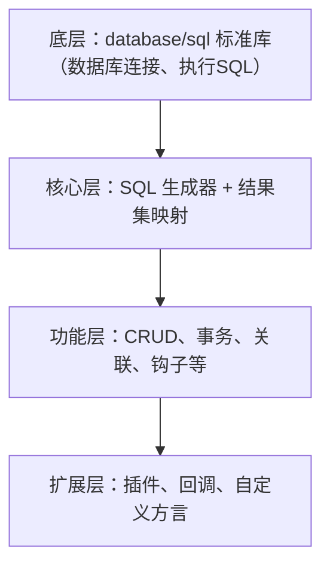
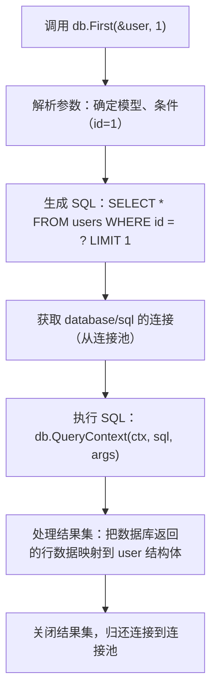
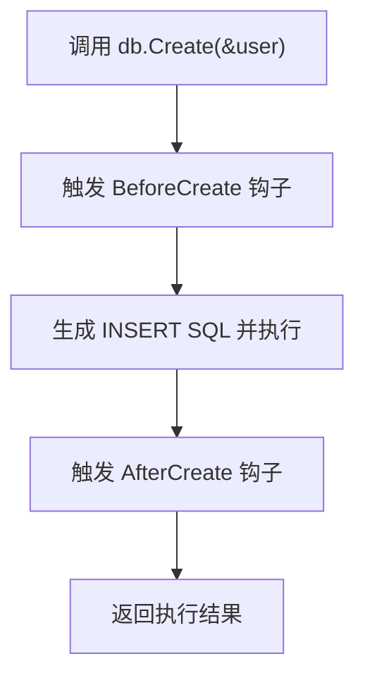

GORM（全称 Go ORM）是 Go 语言中主流的 ORM 框架，是专门为 Go 设计的、功能丰富的数据库操作工具，能够以面向对象的方式操作数据库，无需手写大量 SQL 语句。

---

## GORM 核心定位

GORM 是 Go 生态中最流行的 ORM（Object-Relational Mapping，对象关系映射）框架，核心目标是**将 Go 结构体与数据库表进行映射**，通过操作结构体实例来实现对数据库的增删改查（CRUD），大幅降低手写 SQL 的成本，同时支持 MySQL、PostgreSQL、SQLite、SQL Server 等主流数据库。

官方仓库：https://github.com/go-gorm/gorm  
当前主流版本：**GORM v2**（推荐使用，v1 已停止维护）

## GORM 核心特性

| 特性 | 说明 |
|------|------|
| 全功能 ORM | 支持 CRUD、关联查询、预加载、事务、迁移等 |
| 自动迁移 | 根据 Go 结构体自动创建/更新数据库表结构（无需手动写 DDL） |
| 关联操作 | 支持一对一、一对多、多对多等关联关系的查询与操作 |
| 钩子函数 | 支持 Create/Update/Delete/Query 前后的钩子（如创建前校验数据） |
| 事务支持 | 手动事务、嵌套事务、SavePoint/RollbackTo 等 |
| 查询构建器 | 灵活的链式查询，支持复杂条件、分页、排序等 |
| 性能优化 | 支持预编译语句、批量操作、索引提示等 |
| 插件扩展 | 支持自定义插件（如读写分离、分表、审计日志） |

## GORM 框架原理

深入了解 GORM 的底层实现原理，能够理解它"为什么能通过操作结构体实现数据库操作"，以及它的核心设计思路。GORM v2 的核心原理围绕 ORM 映射规则、SQL 生成、执行流程和扩展机制展开，从核心层拆解，同时结合关键源码逻辑（简化版）辅助理解。

## 核心原理总览
GORM 的本质是**"翻译器 + 执行器"**：
- 翻译器：把你对 Go 结构体的操作（如 `db.Create(&user)`）翻译成对应的 SQL 语句；
- 执行器：封装标准库 `database/sql`，负责执行 SQL、处理结果集，并把数据库返回的数据映射回结构体。

整体架构可分为 4 层，从下到上依次是：



## 核心原理拆解

### ORM 映射规则（结构体 ↔ 数据库）

GORM 最基础的原理是**把 Go 结构体元信息映射为数据库表/字段信息**，核心依赖 Go 的 `reflect`（反射）包解析结构体。

#### 映射规则的实现逻辑
GORM 启动时，会通过 `reflect.TypeOf()` 解析模型结构体的：
- **表名映射**：默认规则（结构体名小写复数 → `User` → `users`），或通过 `TableName()` 方法自定义；
- **字段映射**：
  - 字段名 → 列名：默认蛇形化（`UserName` → `user_name`），可通过 `gorm:"column:xxx"` 自定义；
  - 字段类型 → 数据库类型：如 `string` → `VARCHAR`、`int` → `INT`，可通过标签（`gorm:"type:int(11)"`）覆盖；
  - 字段约束：通过标签解析 `not null`、`default`、`unique`、`index` 等约束，用于自动迁移生成 DDL。

#### 关键源码逻辑（简化版）
```go
// GORM 解析模型字段的核心逻辑（简化）
func parseField(field reflect.StructField) Field {
    // 1. 获取字段名（结构体字段名）
    fieldName := field.Name
    // 2. 解析 gorm 标签（如 `gorm:"column:user_name;not null"`）
    tag := parseTag(field.Tag.Get("gorm"))
    // 3. 确定数据库列名（标签指定 > 蛇形化字段名）
    columnName := tag.Get("column")
    if columnName == "" {
        columnName = snakeCase(fieldName) // 蛇形化：UserName → user_name
    }
    // 4. 解析字段类型、约束等
    return Field{
        Name:     fieldName,
        Column:   columnName,
        Type:     parseDataType(field.Type), // 映射为数据库类型
        NotNull:  tag.Get("not null") == "true",
        // ... 其他约束（默认值、索引等）
    }
}
```

### SQL 生成（结构体操作 → SQL 语句）

这是 GORM 最核心的"翻译"逻辑，不同的 CRUD 方法对应不同的 SQL 生成规则，核心依赖链式查询构建器。

#### SQL 生成的核心流程
以 `db.Where("age > ?", 20).Find(&users)` 为例，流程如下：
1. **构建查询上下文（Statement）**：
   GORM 会创建一个 `Statement` 结构体，存储查询的所有上下文：
   - 模型信息（表名、字段映射）；
   - 条件（Where 子句）；
   - 执行类型（SELECT/INSERT/UPDATE/DELETE）；
   - 其他参数（Limit、Offset、Order 等）。
2. **拼接 SQL 模板**：
   根据执行类型选择对应的 SQL 模板，比如 SELECT 的模板是 `SELECT {columns} FROM {table} {where} {limit} {offset}`。
3. **填充模板参数**：
   - `{columns}`：解析模型字段，生成 `id, name, age, email`；
   - `{table}`：解析表名（如 `users`）；
   - `{where}`：解析 Where 条件，生成 `WHERE age > ?`；
   - 其他参数（Limit/Offset）同理。
4. **生成最终 SQL**：
   最终拼接为 `SELECT id, name, age, email FROM users WHERE age > ?`。

#### 关键源码逻辑（简化版）
```go
// GORM 生成 SELECT SQL 的核心逻辑（简化）
func (stmt *Statement) BuildSelectSQL() {
    // 1. 拼接 SELECT 子句（默认查询所有字段，或指定 Select 字段）
    stmt.SQL.WriteString("SELECT ")
    if len(stmt.Selects) == 0 {
        stmt.SQL.WriteString(strings.Join(stmt.Schema.Columns, ", ")) // 所有字段
    } else {
        stmt.SQL.WriteString(strings.Join(stmt.Selects, ", ")) // 指定字段
    }
    // 2. 拼接 FROM 子句
    stmt.SQL.WriteString(" FROM ")
    stmt.SQL.WriteString(stmt.Table)
    // 3. 拼接 WHERE 子句
    if len(stmt.Conditions) > 0 {
        stmt.SQL.WriteString(" WHERE ")
        stmt.SQL.WriteString(stmt.Conditions.String()) // 条件字符串
    }
    // 4. 拼接 Limit/Offset
    if stmt.Limit > 0 {
        stmt.SQL.WriteString(fmt.Sprintf(" LIMIT %d", stmt.Limit))
    }
    if stmt.Offset > 0 {
        stmt.SQL.WriteString(fmt.Sprintf(" OFFSET %d", stmt.Offset))
    }
}
```

### 执行流程：SQL 执行 + 结果集映射

GORM 不直接操作数据库，而是封装了 Go 标准库 `database/sql`（这是所有 Go 数据库驱动的基础），核心执行流程分 3 步。

#### 执行流程拆解
以 `db.First(&user, 1)` 为例：


#### 核心细节：结果集映射
数据库返回的是"行数据"（如 `id:1, name:"张三", age:20`），GORM 会通过反射把这些数据赋值给结构体字段：
- 遍历结构体的每个字段，找到对应的数据库列名；
- 调用 `rows.Scan()`（`database/sql` 方法），把列值转换为 Go 类型（如 VARCHAR → string、INT → int）；
- 赋值给结构体实例的对应字段。

#### 关键源码逻辑（简化版）
```go
// GORM 把结果集映射到结构体的核心逻辑（简化）
func (stmt *Statement) Scan(dest interface{}) error {
    // 1. 反射解析目标结构体
    val := reflect.ValueOf(dest).Elem()
    // 2. 遍历数据库返回的行
    rows, err := stmt.DB.QueryContext(stmt.Context, stmt.SQL.String(), stmt.Vars...)
    if err != nil {
        return err
    }
    defer rows.Close()

    // 3. 解析列名与结构体字段的映射关系
    columns, _ := rows.Columns() // 获取返回的列名
    fieldMap := stmt.Schema.FieldMap // 列名 → 结构体字段的映射

    // 4. 为每一行数据创建值指针切片（用于 Scan）
    values := make([]interface{}, len(columns))
    for i, col := range columns {
        field := fieldMap[col]
        // 创建对应类型的指针，用于接收数据
        values[i] = reflect.New(field.Type).Interface()
    }

    // 5. 扫描行数据到 values，再赋值给结构体
    if rows.Next() {
        if err := rows.Scan(values...); err != nil {
            return err
        }
        // 把 values 中的值赋值给结构体字段
        for i, col := range columns {
            field := fieldMap[col]
            fieldValue := reflect.ValueOf(values[i]).Elem()
            val.FieldByName(field.Name).Set(fieldValue)
        }
    }
    return nil
}
```

### 扩展机制：钩子（Hook）与插件

GORM 的灵活度来自其钩子函数和插件机制，核心原理是拦截器模式。

| 扩展机制 | 说明 |
|---------|------|
| 钩子函数 | 在 SQL 执行前后插入自定义逻辑（如 `BeforeCreate`、`AfterUpdate`），GORM 会在执行 CRUD 的关键节点触发这些钩子 |
| 插件机制 | 基于 GORM 的 `Caller` 接口，可拦截 SQL 生成、执行的全流程（如读写分离插件、分表插件） |

#### 钩子执行流程（以 Create 为例）


## 核心依赖与关键优化

### 核心依赖

| 依赖 | 作用 |
|------|------|
| `reflect` | 解析结构体元信息（字段名、类型、标签） |
| `database/sql` | 底层数据库连接、SQL 执行、结果集处理 |
| `sync.Pool` | 复用 Statement、SQL 缓存等对象，提升性能 |
| 数据库驱动（如 `gorm.io/driver/mysql`） | 适配不同数据库的 SQL 方言（如 MySQL 的 `LIMIT`、PostgreSQL 的 `LIMIT/OFFSET`） |

### 关键性能优化

| 优化项 | 说明 |
|--------|------|
| SQL 缓存 | 重复的查询条件会缓存生成的 SQL 模板，避免重复拼接 |
| 预编译语句 | 复用 `database/sql.Stmt`，减少数据库解析 SQL 的开销 |
| 连接池管理 | 封装 `database/sql.DB` 的连接池（SetMaxIdleConns/SetMaxOpenConns），避免频繁创建连接 |
| 延迟加载 | 关联查询默认不加载，通过 `Preload` 手动触发，减少无效查询 |

## 总结

| 核心原理 | 说明 |
|---------|------|
| 整体流程 | 反射解析结构体 → 生成 SQL → 封装 database/sql 执行 → 结果集映射回结构体 |
| 映射规则 | 通过反射和标签把结构体与数据库表/字段绑定 |
| SQL 生成 | 把结构体操作翻译成标准 SQL，适配不同数据库方言 |
| 执行流程 | 依赖 `database/sql` 负责底层数据库交互，GORM 只做上层封装 |
| 扩展机制 | 钩子/插件基于拦截器模式，让框架灵活适配业务需求 |